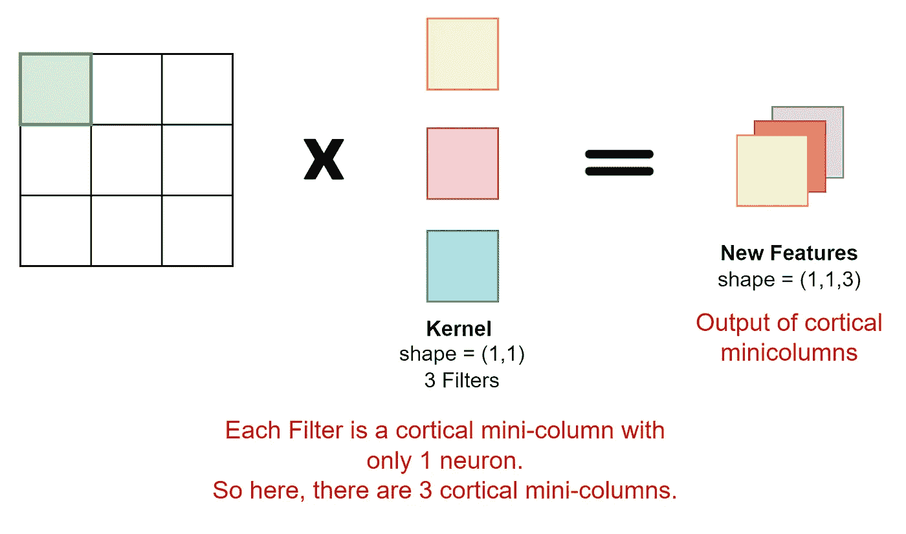
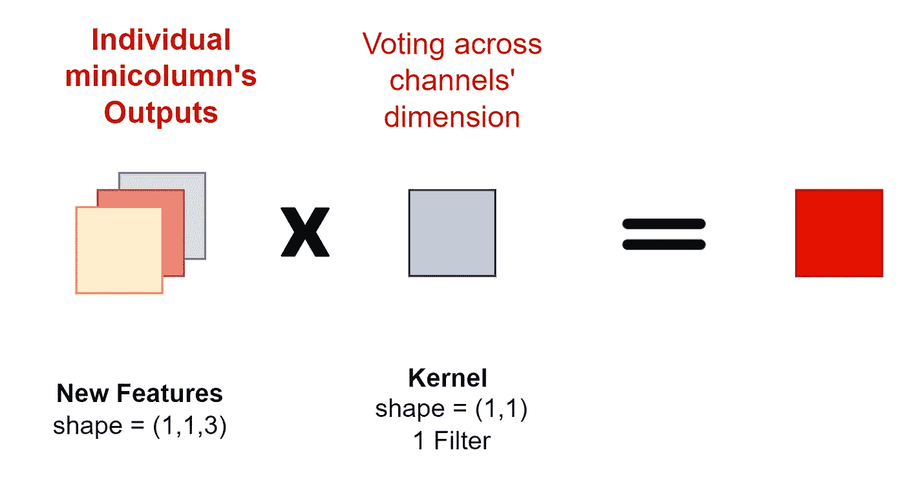
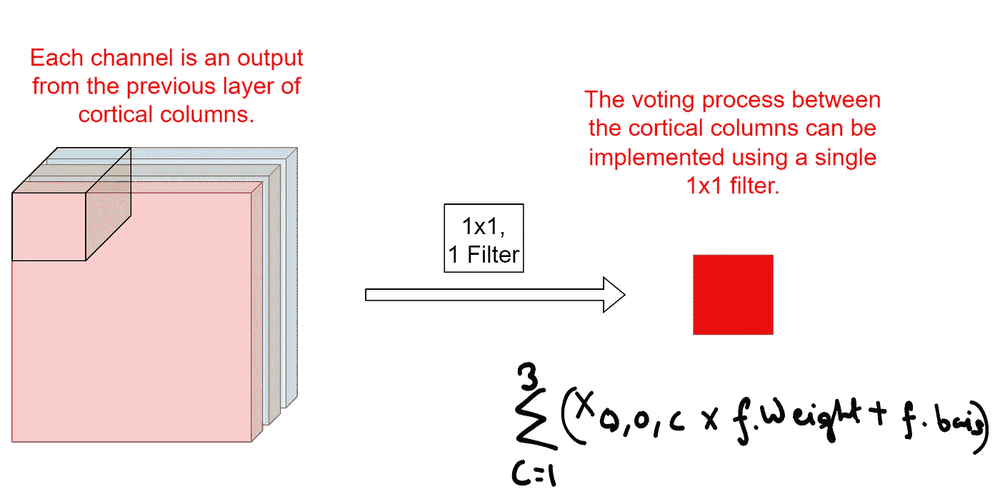
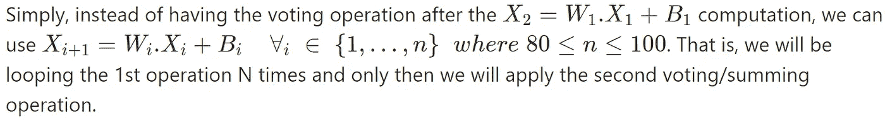
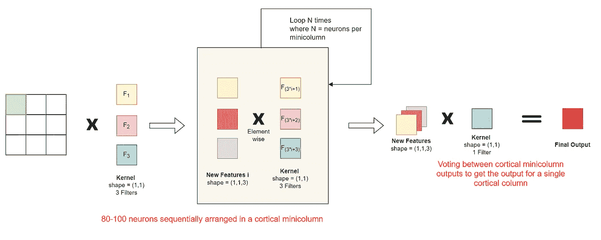
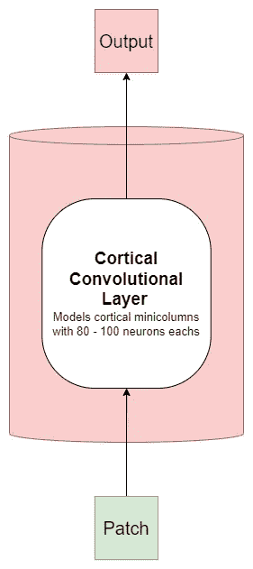
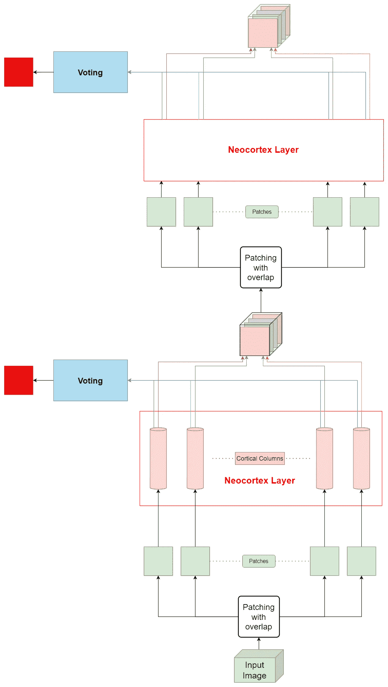

# 智力的千脑理论建模

> 原文：<https://pub.towardsai.net/modelling-the-thousand-brains-theory-of-intelligence-bf7e67e91918?source=collection_archive---------1----------------------->

图片来源: [Numenta](https://numenta.com/blog/2018/03/19/thousand-brains-model-of-intelligence/)

# 在这篇文章中-

根据智能的千脑理论，我提出了一种新颖的卷积结构。

我还提出了一个软证明，说明为什么卷积可以用作皮质微型柱的基础。这提出了一个问题，即卷积神经网络体系结构的成功是否可以作为 1000 个大脑理论的微弱经验证据。

# 介绍

我不会在这里试图解释千脑理论，我会推荐一些比我聪明得多，比我优秀得多的人。

*   [Numenta 的博客](https://numenta.com/blog/2019/01/16/the-thousand-brains-theory-of-intelligence/)

> 智力的千脑理论提出，大脑不是学习一个物体(或概念)的模型，而是为每个物体建立许多模型。每个模型都是使用不同的输入构建的，无论是来自传感器的稍微不同的部分(比如你手上的不同手指)，还是来自完全不同的传感器(眼睛与皮肤)。这些模型一起投票，就它们所感受到的达成共识，而共识投票就是我们所感知的。就好像你的大脑实际上是成千上万个大脑同时工作。

*   [机器学习街谈](https://youtu.be/6VQILbDqaI4)
*   [莱克斯·弗里德曼播客](https://youtu.be/-EVqrDlAqYo?t=2087)
*   [在谷歌的演讲](https://youtu.be/TS5zcTGiAH4)
*   智力书千脑论

# 灵感

我在看一集机器学习街头谈话，杰夫·霍金斯在其中解释了他的千脑理论。我认为这个理论很棒，很酷，当他说没有皮质列算法的实现时，我知道我必须尝试一下。

在思考如何在某种程度上创建算法的简化但优化的实现后，我想到了架构。

这只是一个 21 岁的人尝试模拟人脑的一个小小尝试。我没有太多关于神经科学的知识，所以所有对架构的批评都是赞赏的。我坚信这就是科学进步的方式，对我来说，没有比有人能把我的工作作为垫脚石更大的荣誉了。

# 建筑设计

这个架构由许多部分组成，这就是为什么我会试着一点一点地分解它。

# 投入

该模型是卷积模型，其输入将是 RGB 图像。

[根据千脑理论，](https://youtu.be/TS5zcTGiAH4?t=517)每个皮质柱只接收我们视网膜一小部分的输入。Jeff 将这种输入比作通过吸管看世界。除此之外，每一列收到的输入有很大的重叠。

这就是为什么我建议使用一个函数，将图像分成重叠的小块。这不同于视觉变形金刚使用的修补操作。让我们也定义一个超参数 *Overlap_ratio* ，它表示一个片与另一个片有多少重叠。

# 模拟皮质迷你柱

一个柱内的所有皮质小柱接收相似的输入。每个皮质迷你栏在计算个人产出后投票建立共识。这个输出是皮层列的输出。

**软证明为什么我们可以使用卷积作为皮质迷你柱的基础**

我想先证明一个卷积层中的每个滤波器大致相当于一个只有一个神经元的微柱。这听起来可能很滑稽，但这只是我们建立的基础。

我发现这最容易用(1，1)内核来可视化，尽管这应该外推到更大的内核大小。为简单起见，我将只展示(1，1)输入的操作，如绿色方块所示。

内核的操作可以分为两个功能。

1.  在 2D 输入(无通道尺寸)下，只能看到其中一种操作，即 W.X + B 操作。这种操作模拟了神经元的行为。所有滤波器的输入保持完全相同。每个过滤器仅输出单个特征。因此，我们可以安全地假设内核的第一个操作是只有 1 个神经元的皮质微列。

2.为了形象化内核的第二个功能，让我们使用上一步的输出。滤波器将对每个通道中的值求和。这个函数充当投票机制，因为每个通道代表一个皮层微柱的输出。

皮层微柱之间的投票机制

类似地，皮质列之间的投票过程也可以使用单个 1×1 滤波器来实现。

皮质柱之间的投票机制。

# 新提出的皮层卷积层

这种相关性的一个突出问题是这些微柱只有一个神经元。由于实际的皮层微柱有 80-100 个神经元，我们可以修复这种架构，并将新层称为**皮层卷积层**。

这是一个皮质卷积层的可视化，它有 3 个微柱，每个微柱有 N 个神经元。

要在皮质柱中模拟[50–100 个微柱，我们需要做的就是增加过滤器的数量来与之匹配。](https://en.wikipedia.org/wiki/Cortical_column#:~:text=There%20are%20about,)%20cortical%20columns.)

我们还可以通过增加过滤器的数量和每个微柱中的神经元数量，轻松匹配千脑理论提出的一个皮质柱中的 [10 万个神经元。](https://www.flickr.com/photos/jurvetson/51981065970#:~:text=They%20are%20roughly%20one%20square%20millimeter%20in%20size%20with%20100K%20neurons.)

# 新大脑皮层

使用皮层卷积层，我们可以模拟皮层列。

如果我们平行排列这些皮质柱，我们可以创造出大致相当于新皮质层的东西。该层将在下一节中显示。

# 新建筑

把这些放在一起，

1.  我们拍摄一幅图像，并将其转换成小块。这些补丁必须相互重叠。
2.  每个小块都被输入到一个皮层列，这样所有的小块都被输入到新皮层。
3.  在一个列中，有一个皮层卷积层模拟 50-100 个微列。使用筛选器对微列进行建模。
4.  来自大脑皮层的输出进入投票机制，产生最终输出，如红色方块所示。
5.  输出也可以再次转换成补丁，并发送到第二个新皮层。因此，这使得大脑皮层可以堆叠，为网络提供深度。

# 附加组件

*   [我们大脑中的前三个新皮层(v1，v2，v4)都直接从视网膜接收输入。](https://youtu.be/5LFo36g4Lug?t=2011)因此，为了建模，在这种架构中，我们可以获取输入图像的补丁，并将其与先前新皮层输出生成的补丁相结合。这可能是一个残留连接，我们将输入图像的一个补丁连接到通道维度上的前一个新皮层输出的一个补丁。
*   因为卷积是我们的基础，所以可以利用 ConvNets 多年的研究来快速改进架构。例如，我们可以对皮层卷积层甚至新皮层内部的残余连接进行建模。此外，我们可以讨论 ConvBlocks 之类的想法，它将几个卷积层与一个最大池层结合在一起。即使是规范化图层对于加载项来说也非常简单。我们可以利用大量成熟的研究来提高这一模型的性能。
*   也有可能循环组合新皮层，并在每个时间步产生一个输出。

# 结论

在这里，我提出了一个新的卷积架构，在我看来，根据千脑理论，它比传统的卷积网络更好地模拟了我们的大脑。它模拟了皮质柱理论的一些主要方面，但由于这只是第一次迭代，所以还有许多组件要添加。我希望将来能以某种方式模拟网格单元和参考框架。这里的小柱也只有一种神经元，点神经元。模拟存在于我们大脑中的许多不同的神经元也是未来工作的范围。

我能在网上找到关于一千种大脑理论和神经科学的解释，这真的很酷。谢谢大家！

# 问题

1.  CNN 能作为千脑理论的弱实证证据吗？
2.  根据神经科学和 1000 个大脑理论，你认为皮层卷积的设计比卷积核有所改进吗？