# 蛋鸡死亡率建模

> 原文：<https://pub.towardsai.net/modelling-time-to-event-data-in-chickens-1e2aab639ad3?source=collection_archive---------5----------------------->

## 结合死亡率和温度数据进行激动人心的努力

这篇文章不是关于[卡普兰-迈耶](/analysis-of-a-synthetic-breast-cancer-dataset-in-r-1aba3cfe5a87)或[考克斯回归](https://blog.devgenius.io/survival-analysis-in-sas-kaplan-meier-cox-regression-time-varying-predictors-recurrent-events-4ae7cd95f8c0)，而是关于通过[二元](/analyzing-ordinal-data-in-sas-using-the-binary-binomial-and-beta-distribution-8efe5fe5af66)、[泊松](https://medium.com/mlearning-ai/analysis-of-repeated-count-data-in-r-the-poisson-quasi-poisson-negative-binomial-e62aff528309)或[负二项式](https://blog.devgenius.io/analysis-of-count-data-in-r-3345f5373695)方式对事件时间数据建模。如果您对这些主题中的任何一个感兴趣，在不同的例子中，只需点击它们所附的链接。

我将在这篇文章中添加一些额外的东西，这可能是一个真正的痛苦——我正在对来自时间序列数据集的数据进行建模。这意味着几乎全年的数据，来自蛋鸡，其中母鸡死亡。现在，一个众所周知的死亡率催化剂是温度。尽管采取了控制良好的措施来确保谷仓温度稳定，但还是会有波动。因此，作为一个数据集，我们将拥有事件数据(离散和有序)和连续数据。我们每小时都有临时数据，每天都有事件数据。让我们看看我们会在哪里结束，但我已经知道这并不容易。爱死了！

首先是图书馆。总是，图书馆！

```
rm(list = ls())
options("scipen"=100, "digits"=10)#### LIBRARIES ####
library(readr)
library(readxl)
library(DataExplorer)
library(tidyverse)
library(gridExtra)
library(grid)
library(AzureStor)
library(skimr)
library(lubridate)
library(ggplot2)
pacman::p_load(tidyverse, magrittr) # data wrangling packages
pacman::p_load(lubridate, tsintermittent, fpp3, modeltime, 
               timetk, modeltime.gluonts, tidymodels, modeltime.ensemble, modeltime.resample) # time series model packages
pacman::p_load(foreach, future) # parallel functions
pacman::p_load(viridis, plotly) # visualizations packages
theme_set(hrbrthemes::theme_ipsum()) # set default themes
```

然后，我会把 Azure 上 blob 存储的数据加载到 R 中，好好看看。

```
folder<-setwd(getwd())
name="/DATA.csv"
download_from_url("[https://farmresultstals.blob.core.windows.net/xxxx/Location860_day.csv](https://farmresultstals.blob.core.windows.net/stals/Location860_day.csv)",
                  dest      = paste0(folder,name),
                  overwrite = TRUE,
                  key       = "xxxxxxxxxxxxxxxxxxxxxxxxxxxxxxxxxxx")
day <- read_csv("DATA.csv")
skimr::skim(day)
```

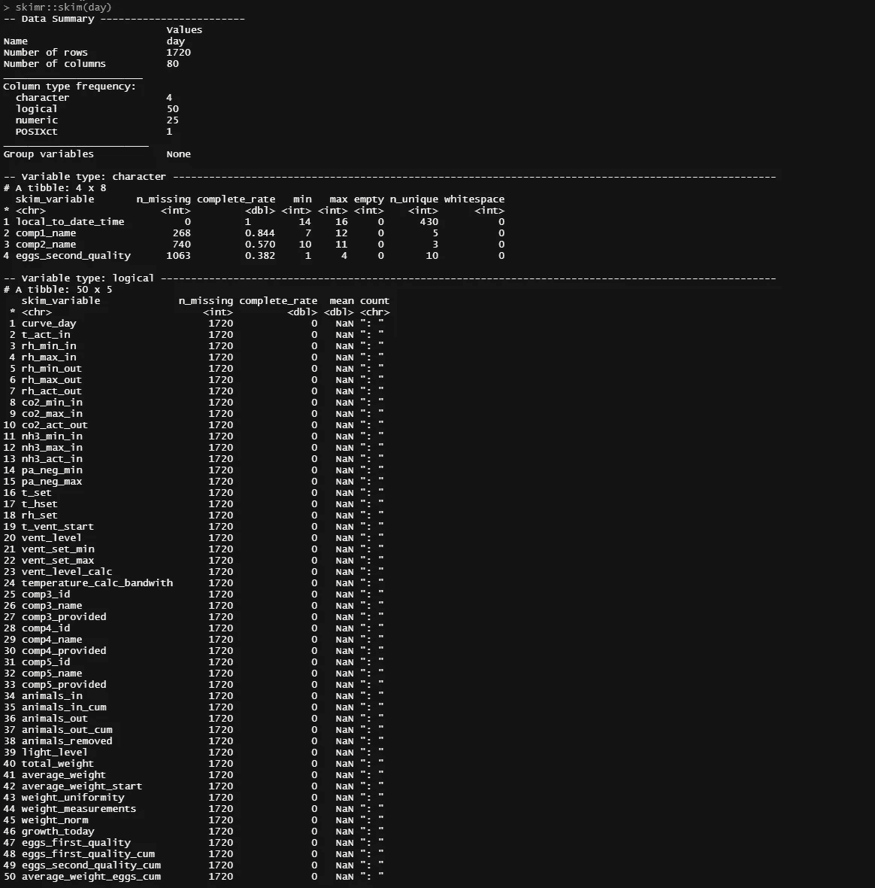

80 列，数据还过得去。你可以用它做很多事情，但是我将会集中在 10 个变量中的大部分。

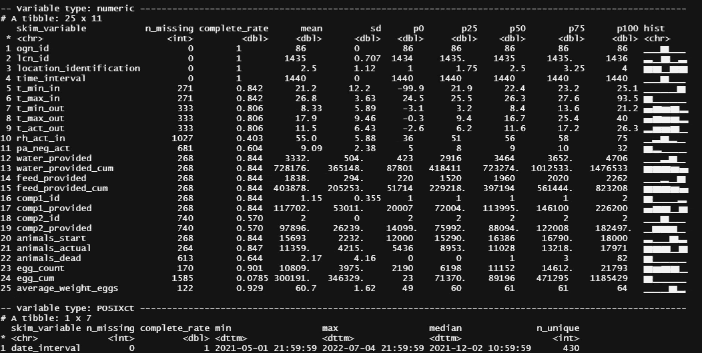

和数字数据。在这里您可以看到温度变量，如 **t_min_in** 或 **t_act_out** 。稍后我们将深入探讨这些问题。

为了掌握数据，让我们开始绘图。现在，关于这个数据集有趣的部分是，你可以很容易地绘制类似生存曲线的曲线，但是数据不是以这样一种方式建立的，你可以对它执行[生存分析](https://towardsdatascience.com/introduction-to-survival-analysis-in-cows-using-r-28b82c2821fb)。

```
day%>%
  dplyr::filter(!lcn_id %in% c('1435'))%>%
                  ggplot(.,
                         aes(x=date_interval, 
                             y=animals_actual, 
                             colour=as.factor(lcn_id)))+
  geom_line()+
  facet_wrap(~lcn_id, scales="free")+
  labs(x="Time", 
       y="Animals", 
       col="Barn")+
  theme_bw()
```

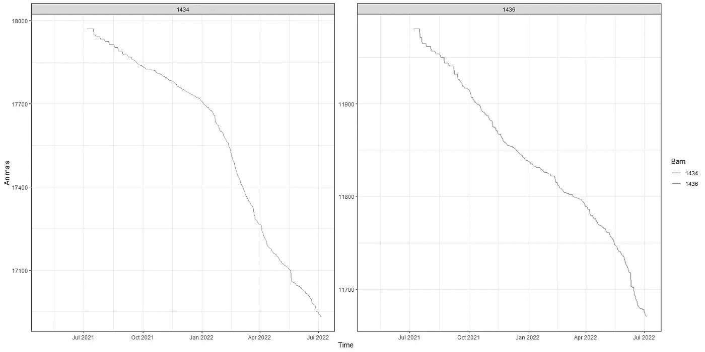

一个曲线图，显示两个畜棚，一段时间内每个畜棚的实际动物数量。这些图片模拟了一个生存情节，但是数据不是在生存分析模式下。稍后我会说明为什么这是不必要的——无论如何我们都不会做生存分析。

上面你看到了实际动物的变化，但下面我会给你看每个时间点的实际死亡数。如你所见，这两个谷仓的死亡模式不同。

```
day%>%
  dplyr::group_by(lcn_id)%>%
  dplyr::filter(!lcn_id %in% c('1435'))%>%
  ggplot(.,
         aes(x=date_interval, 
             weight=animals_dead, 
             fill=as.factor(lcn_id)))+
  geom_bar()+
  facet_wrap(~lcn_id, scales="free")+
  labs(x="Time", 
       y="Animals dead", 
       fill="Barn")+
  theme_bw()
```

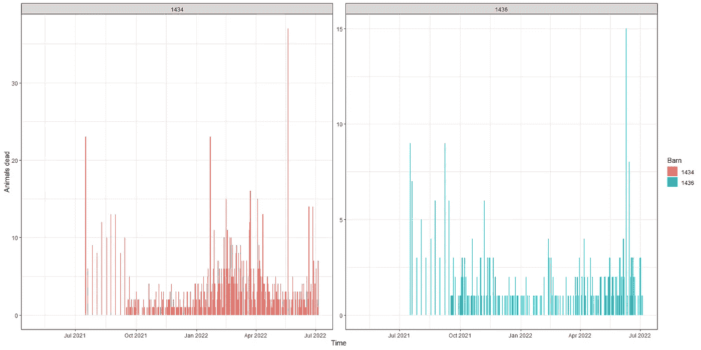

```
day%>%
  dplyr::group_by(lcn_id)%>%
  dplyr::filter(!lcn_id %in% c('1435'))%>%
  dplyr::select(lcn_id, date_interval, animals_dead)%>%
  replace(is.na(.), 0)%>%
  dplyr::mutate(event = ifelse(animals_dead>0, 1, 0))%>%
  ggplot(.,
         aes(x=date_interval, 
             y=as.factor(lcn_id), 
             fill=as.factor(event)))+
  geom_tile()+
  scale_fill_viridis_d(option="cividis")+
  labs(x="Time", 
       y="Barn", 
       fill="Event")+
  theme_bw()
```

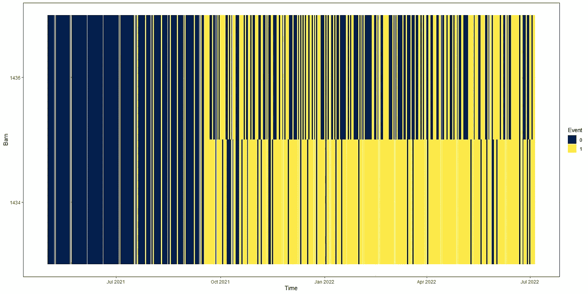

然而，随着时间的推移，真正的动物不仅会因死亡而大批死亡。很可能是因为某种原因，鸟被移走或带走了。我们来看看只拿死亡做减法时的曲线。

```
day%>%
  dplyr::filter(!lcn_id %in% c('1435'))%>%
  dplyr::filter_at(vars(animals_start), all_vars(!is.na(.)))%>%
  dplyr::select(lcn_id, date_interval, animals_dead, animals_start, animals_actual)%>%
  replace(is.na(.), 0)%>%
  dplyr::mutate(cum_dead = cumsum(animals_dead), 
                animals_by_dead = animals_start-cum_dead)%>%
  ggplot(.,
         aes(x=date_interval))+
  geom_line(aes(y=animals_actual), col="red")+
  geom_line(aes(y=animals_by_dead), col="blue")+
  facet_wrap(~lcn_id, scales="free")+
  labs(x="Time", 
       y="Animals")+
  theme_bw()
```

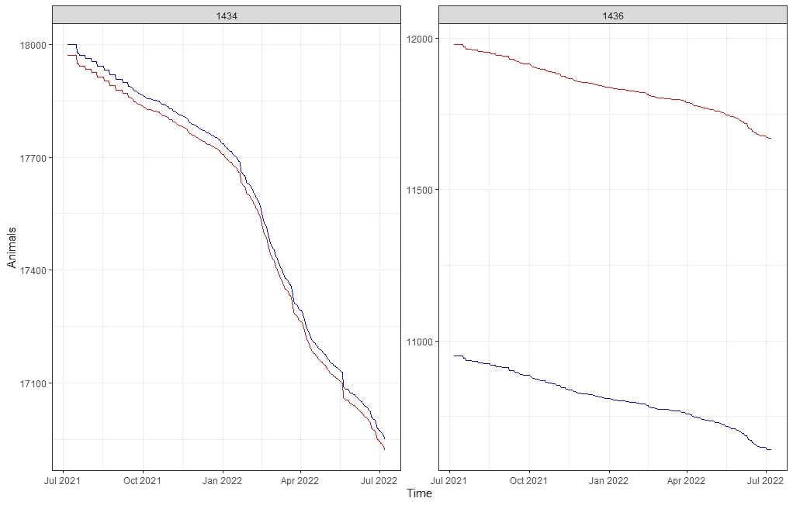

有些事情出了差错，但在它下面就理顺了。如你所见，只看死亡得到的曲线几乎与整体实际动物曲线平行。所以没什么好担心的。

```
day%>%
  dplyr::filter(lcn_id == c('1436'))%>%
  dplyr::filter_at(vars(animals_start), all_vars(!is.na(.)))%>%
  dplyr::select(lcn_id, date_interval, animals_dead, animals_start, animals_actual)%>%
  replace(is.na(.), 0)%>%
  dplyr::mutate(cum_dead = cumsum(animals_dead), 
                animals_by_dead = animals_start-cum_dead)%>%
  ggplot(.,
         aes(x=date_interval))+
  geom_line(aes(y=animals_actual), col="red")+
  geom_line(aes(y=animals_by_dead), col="blue")+
  facet_wrap(~lcn_id, scales="free")+
  labs(x="Time", 
       y="Animals")+
  theme_bw()
```

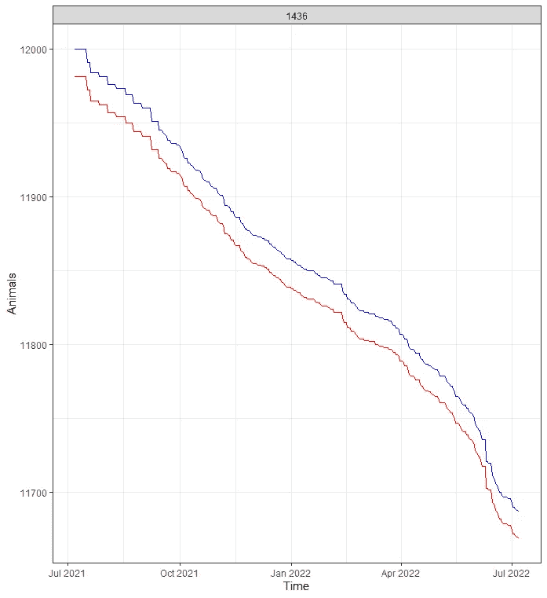

现在，让这个练习变得非常肮脏的是，我将不得不随着时间的推移对事件数据进行建模，但不使用生存技巧。如果我每周或每月汇总，可能的选项是二元类或二项式类。二进制可能是一种真正的痛苦，模型可能需要很长时间才能运行，必须找到 0 和 1 之间的模式。对于那些已经忘记二进制或伯努利分布的人来说:

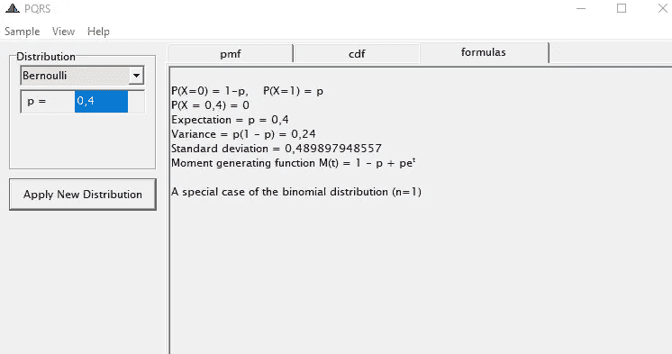

在伯努利，你所拥有的只是一个机会，而这个机会将决定一切。在数据中，你会看到一个 0 或 1，这些值并不像二项式那样相互关联。除了您在每一行中看到的内容之外，没有要寻找的变化，这就是为什么运行需要这么长时间的原因。它必须通过解读字里行间来分析差异。我稍后会告诉你它造成的痛苦。

让我们进入建模部分，运行一个二元模型，看看情况如何。没什么特别的。

```
day%>%
  dplyr::filter(!lcn_id %in% c('1435'))%>%
  dplyr::filter_at(vars(animals_start), all_vars(!is.na(.)))%>%
  dplyr::mutate(day = lubridate::day(date_interval))%>%
  dplyr::select(lcn_id, day, animals_dead, animals_start, animals_actual)%>%
  replace(is.na(.), 0)%>%
  dplyr::mutate(event = ifelse(animals_dead>0,1,0))%>%
  glm(event~
        day+as.factor(lcn_id),
      family=binomial(link=logit),
      data=.)%>%summary()
```


glm 模型试图将事件的概率与日期和位置联系起来。该模型是线性的。

最好是画出模型得出的结果，我认为上面的数字并没有真正的帮助。

```
fit<-day%>%
  dplyr::filter(!lcn_id %in% c('1435'))%>%
  dplyr::filter_at(vars(animals_start), all_vars(!is.na(.)))%>%
  dplyr::mutate(day = lubridate::day(date_interval))%>%
  dplyr::select(lcn_id, day, animals_dead, animals_start, animals_actual)%>%
  replace(is.na(.), 0)%>%
  dplyr::mutate(event = ifelse(animals_dead>0,1,0))%>%
  glm(event~
        day+as.factor(lcn_id),
      family=binomial(link=logit),
      data=.)
plot(fit)
sjPlot::plot_model(fit, type="pred", 
                   terms=c("day [all])", "lcn_id"))
```

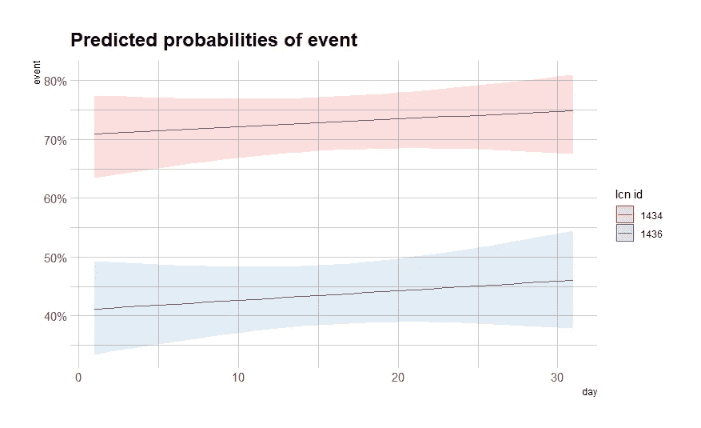

从前面的图中我们都知道，模式不是线性的。那么如果我们给它加一条样条线呢？因为我们的数据集中包含了相当多的天数，所以我们可以创建一个包含五个节点的漂亮的样条。如果有必要，创建更粗的样条可能需要通过正弦和/或余弦函数建模。

```
fit<-day%>%
  dplyr::filter(!lcn_id %in% c('1435'))%>%
  dplyr::filter_at(vars(animals_start), all_vars(!is.na(.)))%>%
  dplyr::mutate(day = lubridate::day(date_interval))%>%
  dplyr::select(lcn_id, day, animals_dead, animals_start, animals_actual)%>%
  replace(is.na(.), 0)%>%
  dplyr::mutate(event = ifelse(animals_dead>0,1,0))%>%
  glm(event~
        splines::ns(day,5)+as.factor(lcn_id),
      family=binomial(link=logit),
      data=.)
summary(fit)
sjPlot::plot_model(fit, type="pred", 
                   terms=c("day [all])", "lcn_id"))
```

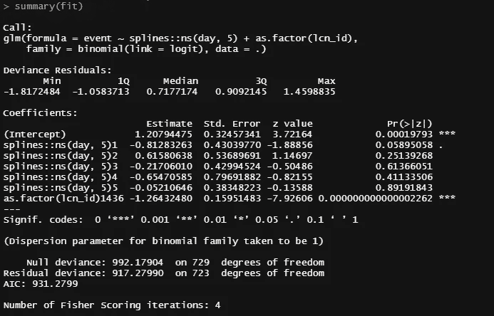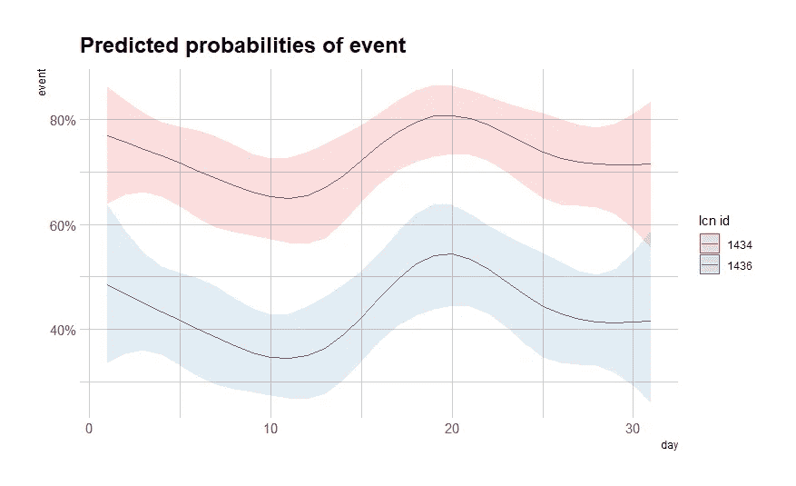

加入样条将使分析看起来像这样。现在，所发生的是，模型已经聚合了一个月 31 天的所有数据，产生了不应该存在的差异。我想对整个 300 多天进行建模，但是模型不应该受到责备。错误是我的。

所以，让我们更好地模拟它，把月份考虑进去，看看我们最终得到什么。

```
df_fit2<-fit2<-day%>%
  dplyr::filter(!lcn_id %in% c('1435'))%>%
  dplyr::filter_at(vars(animals_start), all_vars(!is.na(.)))%>%
  dplyr::mutate(day = lubridate::day(date_interval), 
                month=lubridate::month(date_interval))%>%
  dplyr::select(lcn_id, day, month, animals_dead, animals_start, animals_actual)%>%
  replace(is.na(.), 0)%>%
  dplyr::mutate(event = ifelse(animals_dead>0,1,0))%>%
  dplyr::select(lcn_id, day, month, event)
pred<-plogis(predict(fit2, newdata=df_fit2))
plot(pred)
df_fit2_combined<-cbind(df_fit2, pred)
ggplot(df_fit2_combined, 
       aes(x=day, y=pred, col=as.factor(lcn_id)))+
  geom_point(alpha=0.5)+
  geom_line()+
  facet_wrap(~month, scales="free")+
  labs(x="Day in month", y="Predicted Probability of Mortality", col="Location")+
  theme_bw()
```


你可以看到曲线每月不同，但距离总是相同的。这是因为我没有包括互动。我们去吧。

```
fit3<-glm(event~
      splines::ns(day,5)*as.factor(month)*as.factor(lcn_id),
    family=binomial(link=logit),
    data=df_fit2)
```


现在我们以此结束，这很有意义。我已经包括了所有可能的相互作用，这意味着没有任何变化。这个模型会因为缺少自由度而遇到问题。那么，该怎么办呢？

我们可以在模型中指定我们想要的交互，所以我选择交互 *day*lcn_id* 和 *month*lcn_id* 。我将得到的和我已经拥有的没有太大的不同。实际上，它似乎没有增加任何东西。

```
fit3<-glm(event~
      splines::ns(day,5) + as.factor(month) + as.factor(lcn_id) +
        splines::ns(day,5):as.factor(lcn_id) + as.factor(month):as.factor(lcn_id),
    family=binomial(link=logit),
    data=df_fit2)
summary(fit3)
pred_fit3<-plogis(predict(fit3, newdata=df_fit2))
plot(pred_fit3)
df_fit3_combined<-cbind(df_fit2, pred_fit3)
ggplot(df_fit3_combined, 
       aes(x=day, y=pred, col=as.factor(lcn_id)))+
  geom_point(alpha=0.5)+
  geom_line()+
  facet_wrap(~month, scales="free")+
  labs(x="Day in month", y="Predicted Probability of Mortality", col="Location")+
  theme_bw()
```

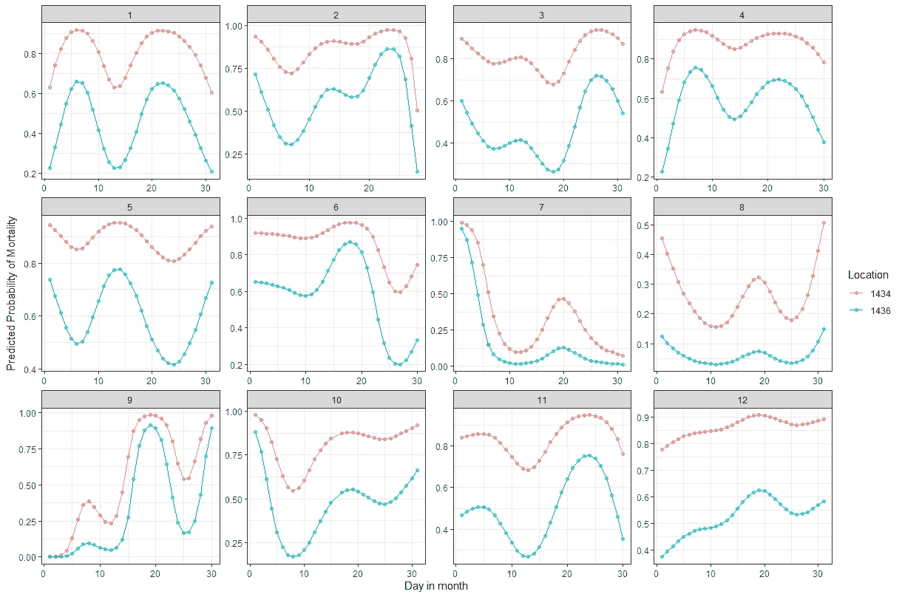

我看不出有什么不同。

让我们比较一下目前为止的模型。

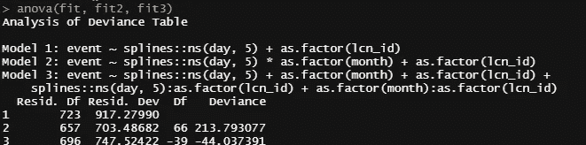

似乎最后一个模型真的不值得努力。但是从上面的图表中可以看出这一点。至少，他们没有太大的不同。

然而，考虑到一天之内可能会有不止一只鸟死亡，而且我们没有考虑到我们从 18k 鸟开始的事实，也许它们真的没有那么有用。所以死亡的几率肯定不是 80%，随着时间的推移，我们会遇到死鸟的事实是必然的(这实际上是 80%的意思)。因此，是时候转向二项式和泊松分布，并计算一些比率和利率了。

```
fit<-day%>%
  dplyr::filter(!lcn_id %in% c('1435'))%>%
  dplyr::filter_at(vars(animals_start), all_vars(!is.na(.)))%>%
  dplyr::mutate(day = lubridate::day(date_interval), 
                month=lubridate::month(date_interval))%>%
  dplyr::select(lcn_id, day, month, animals_dead)%>%
  replace(is.na(.), 0)%>%
  glm(animals_dead~
        splines::ns(day,5)*as.factor(month)+as.factor(lcn_id),
      family=poisson(link=log),
      data=.)
summary(fit)
sjPlot::plot_model(fit)
```

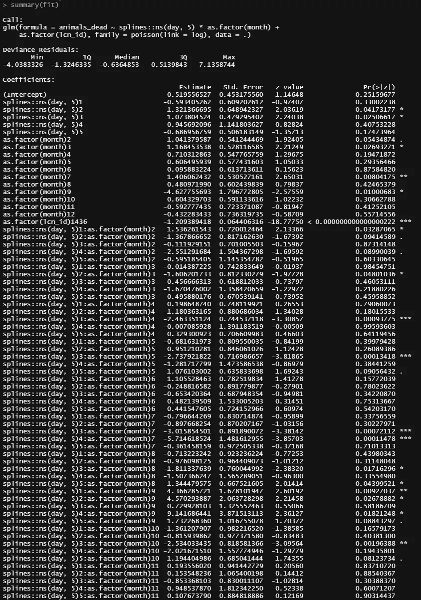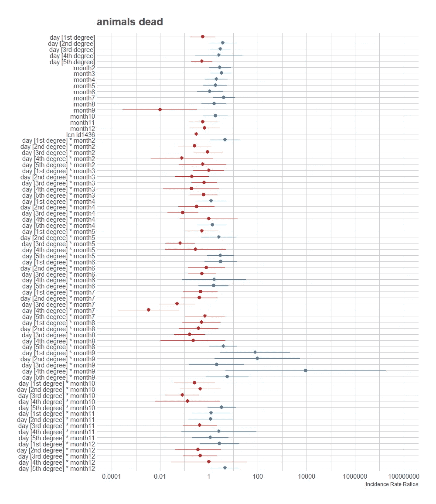

是的，有了这样一个模型和交互，你会得到一个参数的负载。想象一下，在进行贝叶斯计算时，为这样一个模型创建先验。话说回来，那也不算太坏。一些参数具有疯狂的 [**发生率比率**](https://doi.org/10.1136/bmj.c4804) ，在这一点上，不清楚这是否是“真正的影响”或由于变异问题(缺乏)而产生的错误。较大的置信区间似乎暗示了后者，但我不确定。

如果我想绘制所有的东西，所有的参数，来自 sjPlot 包的一个图给我带来了问题。目前，我能做的是查看每个地点每月的平均预测数量。似乎有一种模式，但我非常不确定这种模式是否真的好。

```
sjPlot::plot_model(fit, type="pred", 
                   terms=c("month", "lcn_id"))
```

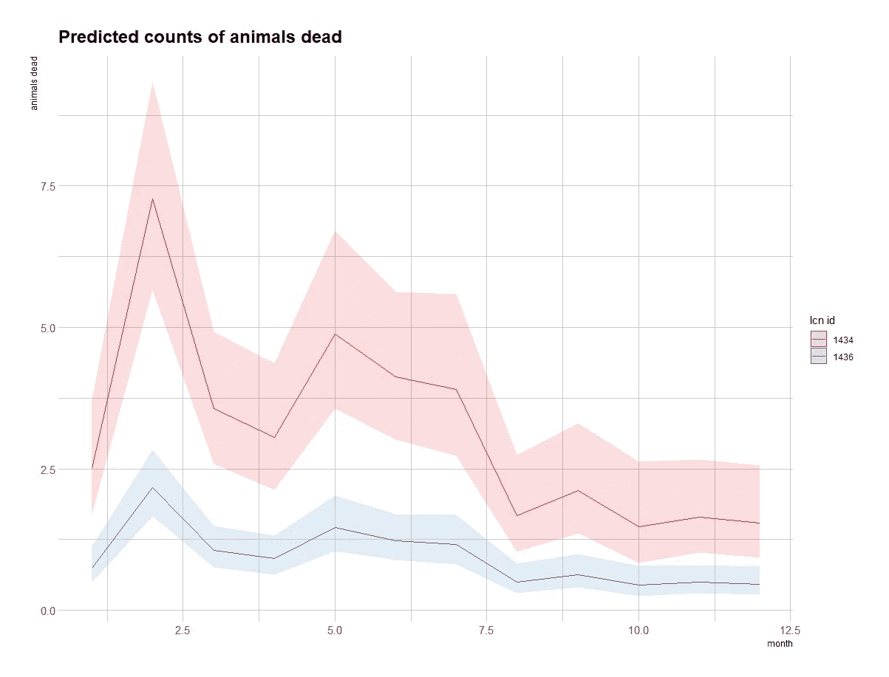

为了更好地了解条件效应，我将要求 R 给我预测的计数，我将通过对从 [*glm*](https://www.rdocumentation.org/packages/stats/versions/3.6.2/topics/glm) 接收的对数值求幂来获得该计数。这样，我就能绘制出所有潜在影响者的数量，看看它们是否有意义。

```
df_pois<-day%>%
  dplyr::filter(!lcn_id %in% c('1435'))%>%
  dplyr::filter_at(vars(animals_start), all_vars(!is.na(.)))%>%
  dplyr::mutate(day = lubridate::day(date_interval), 
                month=lubridate::month(date_interval))%>%
  dplyr::select(lcn_id, day, month, animals_dead)%>%
  replace(is.na(.), 0)
fit<-glm(animals_dead~
           splines::ns(day,5)*as.factor(month)+as.factor(lcn_id),
         family=poisson(link=log),
         data=df_pois)
pred_fit<-exp(predict(fit,newdata=df_pois))
df_fit_combined<-cbind(df_pois, pred_fit)
ggplot(df_fit_combined, 
       aes(x=day, 
           y=pred_fit, 
           col=as.factor(lcn_id)))+
  geom_point(alpha=0.5)+
  geom_line()+
  facet_wrap(~month, scales="free")+
  labs(x="Day in month", 
       y="Predicted Counts of Mortality", 
       col="Location")+
  theme_bw()
```

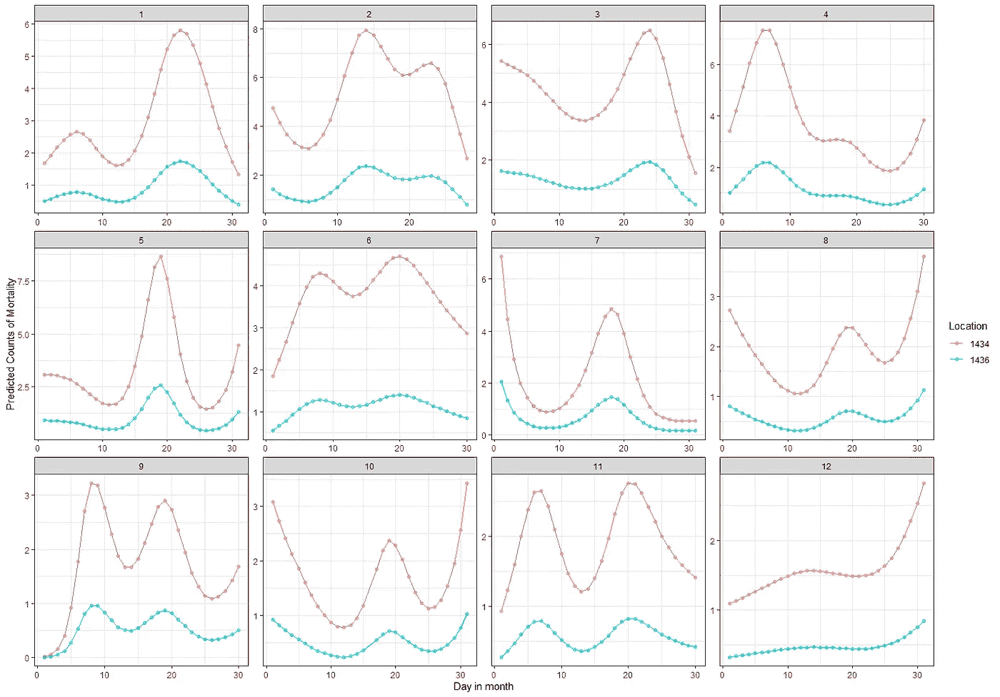

这些图显示了每个位置随时间变化的预测计数。如果这些预测是好的，我还不知道，但我稍后会回到这个话题。

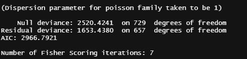

啊，色散参数。我之前谈过这个，我现在看到的是[过度分散](/generalized-linear-mixed-models-in-sas-distributions-link-functions-scales-overdisperion-and-4b1c767bb89a)。而且很多。这意味着模型低估了实际的方差，这并不令我惊讶。[泊松模型存在固有的局限性](https://blog.devgenius.io/analysis-of-count-data-in-r-3345f5373695)。

从一开始，我就提到我想把死亡数字和温度联系起来，因为热应力是造成严重破坏的已知原因。为了防止这种情况，谷仓有高度灵敏的监控系统来控制温度。我们将在后面的情节中看到这一点。下面，我会告诉你谷仓里的最低和最高温度，以及外面的实际温度。

```
day%>%
  dplyr::filter(!lcn_id %in% c('1435'))%>%
  dplyr::filter_at(vars(animals_start), all_vars(!is.na(.)))%>%
  dplyr::select(lcn_id, date_interval, t_min_in, t_max_in, t_act_out)%>%
  replace(is.na(.), 0)%>%
  ggplot(.,
         aes(x=date_interval))+
  geom_line(aes(y=t_max_in), col="red")+
  geom_line(aes(y=t_min_in), col="blue")+
  geom_line(aes(y=t_act_out), col="black")+
  facet_wrap(~lcn_id, scales="free")+
  labs(x="Time", 
       y="Temperature in the barn")+
  theme_bw()
```

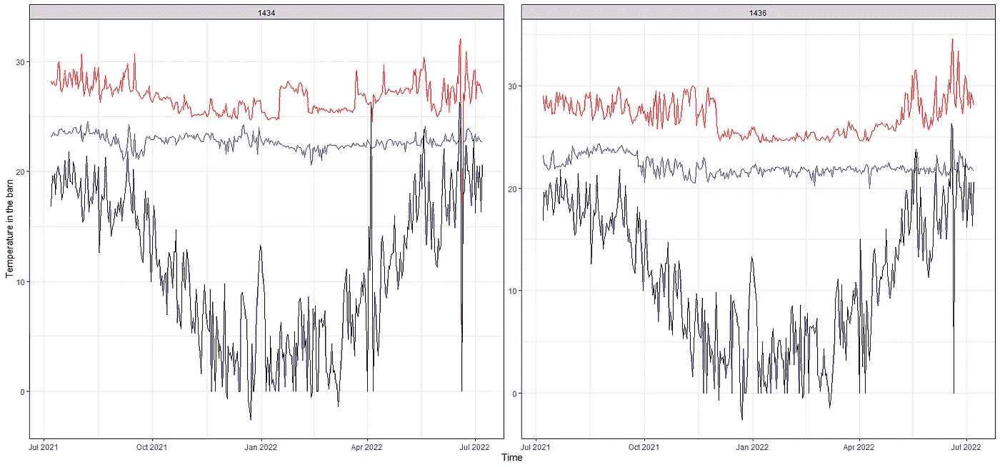

数据显示出波动，这是可以预料的。现在，真正有趣的是看我们能否将这些数据与我们现有的事件数据联系起来。

请记住，时间序列数据(如温度数据)中包含不直接可见的成分。我很可能需要理清这些成分，例如，某种形式的季节性或周期性模式，以将温度数据与事件数据联系起来。此外，我们有每日级别的数据。我确实可以访问每小时的数据，但这会增加分析的复杂性。让我们把它放在心里。

首先，我想以一种更易于阅读的方式可视化数据，热图可以做到这一点。

```
day%>%
  dplyr::filter(!lcn_id %in% c('1435'))%>%
  dplyr::filter_at(vars(animals_start), all_vars(!is.na(.)))%>%
  dplyr::select(lcn_id, date_interval, t_min_in, t_max_in, t_act_out)%>%
  replace(is.na(.), 0)%>%
  reshape2::melt(id.vars=c("lcn_id", "date_interval"))%>%
  ggplot(.,
         aes(x=date_interval, 
             y=variable, 
             fill=value))+
  geom_tile()+
  scale_fill_viridis_c(option="turbo")+
  facet_wrap(~lcn_id, scales="free")+
  labs(x="Time", 
       y="Temperatures")+
  theme_bw()
```

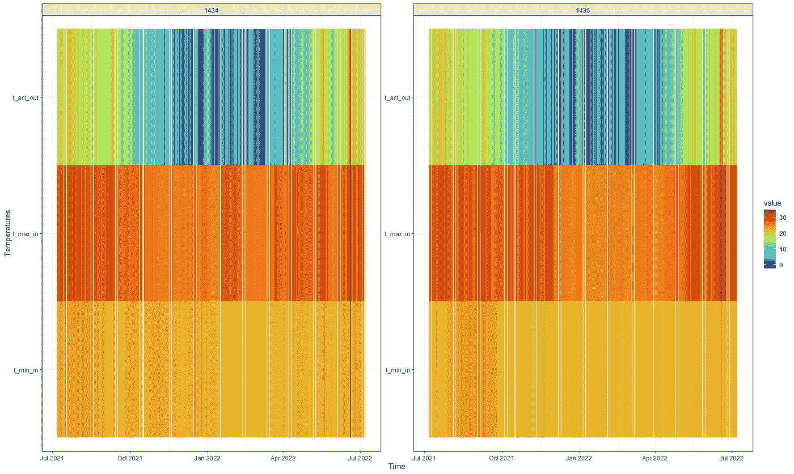

使用[绿色](https://cran.r-project.org/web/packages/viridis/vignettes/intro-to-viridis.html)的涡轮色，你可以很容易地发现外部温度如何变化，而内部温度保持稳定。

也许温度本身并不重要，重要的是温度和气温之间的差异。让我们也画一下，采用不同于绿色的颜色方案。

```
day%>%
  dplyr::filter(!lcn_id %in% c('1435'))%>%
  dplyr::filter_at(vars(animals_start), all_vars(!is.na(.)))%>%
  dplyr::select(lcn_id, date_interval, t_min_in, t_max_in)%>%
  replace(is.na(.), 0)%>%
  dplyr::mutate(diff=t_max_in-t_min_in)%>%
  dplyr::select(lcn_id, date_interval, diff)%>%
  ggplot(.,
         aes(x=date_interval, 
             y=lcn_id, 
             fill=diff))+
  geom_tile()+
  scale_fill_viridis_c(option="cividis")+
  labs(x="Time", 
       y="Barn", 
       fill="Difference Min_Max")+
  theme_bw()
```

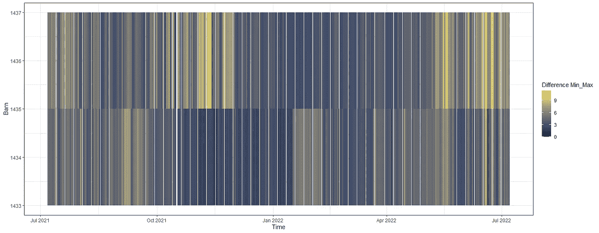

在这里，您可以看到每个位置的最小值和最大值之间的差异。每天肯定有差别，而且这种差别也在不断变化。所以温度可能一点也不稳定，但我不确定这是否有什么不同。

下面，我将向您展示一种方法，将事件和温度结合起来，将所有内容放入一个图表中。

```
day%>%
  dplyr::filter(!lcn_id %in% c('1435'))%>%
  dplyr::filter_at(vars(animals_start), all_vars(!is.na(.)))%>%
  dplyr::select(lcn_id, date_interval, animals_dead, t_min_in, t_max_in, t_act_out)%>%
  replace(is.na(.), 0)%>%
  ggplot(.,
         aes(x=date_interval))+
  geom_line(aes(y=t_max_in), col="red")+
  geom_line(aes(y=t_min_in), col="blue")+
  geom_line(aes(y=t_act_out), col="black")+
  geom_linerange(aes(ymin=0, ymax=animals_dead), 
           col="purple",alpha=0.3, size=1)+
  facet_wrap(~lcn_id, scales="free")+
  labs(x="Time", 
       y="Temperature in the barn")+
  theme_bw()
```

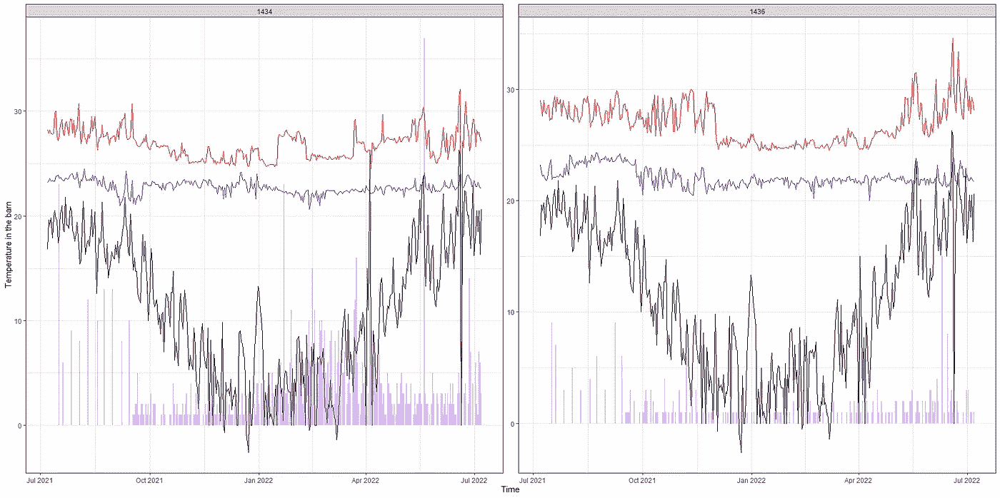

该图看起来不错，但从这样的图中不可能发现任何模式。甚至不清楚这种模式是否存在。

让我们将泊松模型预测与数据结合起来，看看这是否会对我们有所帮助。与上面的图表相比，泊松模型应该为我们提供样条曲线，我想看看它们是否跟随温度。请注意，该模型不包含作为预测因子的温差。还没有。

```
df_pois<-day%>%
  dplyr::filter(!lcn_id %in% c('1435'))%>%
  dplyr::filter_at(vars(animals_start), all_vars(!is.na(.)))%>%
  dplyr::mutate(day = lubridate::day(date_interval), 
                month=lubridate::month(date_interval))%>%
  dplyr::select(lcn_id, day, month, animals_dead, 
                t_min_in, t_max_in, t_act_out)%>%
  replace(is.na(.), 0)
fit<-glm(animals_dead~
           splines::ns(day,5)*as.factor(month)+as.factor(lcn_id),
         family=poisson(link=log),
         data=df_pois)
pred_fit<-exp(predict(fit,newdata=df_pois))
df_fit_combined<-cbind(df_pois, pred_fit)
ggplot(df_fit_combined, 
       aes(x=day, 
           y=pred_fit, 
           group=lcn_id, 
           ))+
  geom_line(col="orange", size=1.5)+
  geom_line(aes(y=t_max_in), col="red")+
  geom_line(aes(y=t_min_in), col="blue")+
  geom_line(aes(y=t_act_out), col="black")+
  facet_grid(lcn_id~month)+
  labs(x="Day in month", 
       y="Predicted Counts of Mortality", 
       col="Predicted Deaths")+
  theme_bw()
```

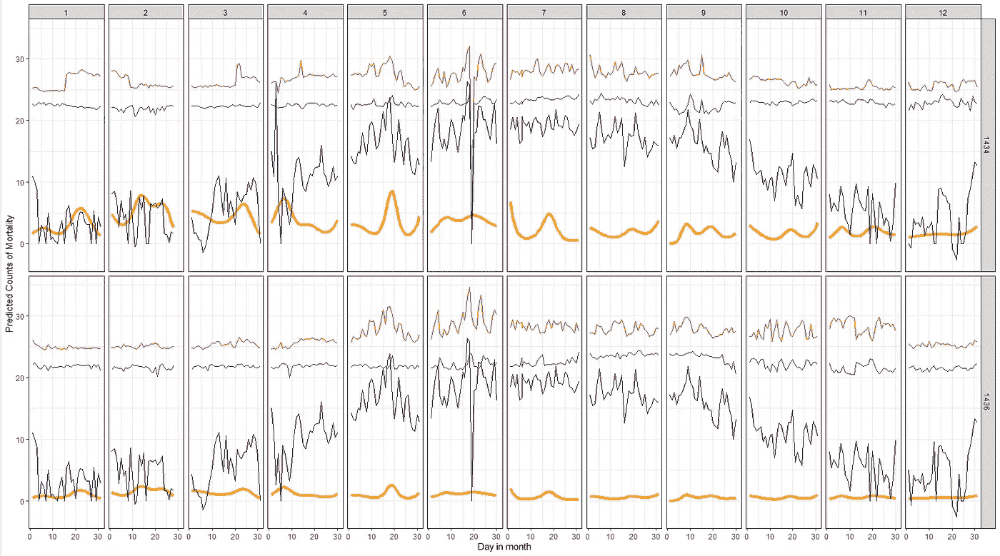

预测以橙色显示，红色、蓝色和黑色线条分别显示室内的最高和最低温度以及室外的实际温度。看不清任何图案。当然，一个位置预计会有更多的事件发生，但不清楚这与谷仓内外的实际温度有什么关系。

接下来，我想看看能否将实际温度数据与发生的事件联系起来。我将在这里添加[样条](https://medium.com/mlearning-ai/determining-the-rent-d1431c90ca9f)，这将使模型变重，但我们有足够的扩展来完成它。至少，我希望如此。

```
df_pois<-day%>%
  dplyr::filter(!lcn_id %in% c('1435'))%>%
  dplyr::filter_at(vars(animals_start), all_vars(!is.na(.)))%>%
  dplyr::mutate(day = lubridate::day(date_interval), 
                month=lubridate::month(date_interval))%>%
  dplyr::select(lcn_id, day, month, animals_dead, 
                t_min_in, t_max_in, t_act_out)%>%
  replace(is.na(.), 0)
fit<-glm(animals_dead~
           splines::ns(day,5)*as.factor(month)+
           splines::ns(t_min_in,5)+
           splines::ns(t_max_in,5)+
           as.factor(lcn_id),
         family=poisson(link=log),
         data=df_pois)
summary(fit)
pred_fit<-exp(predict(fit,newdata=df_pois))
df_fit_combined<-cbind(df_pois, pred_fit)
ggplot(df_fit_combined, 
       aes(x=t_min_in, 
           y=t_max_in, 
           z=pred_fit))+
  geom_contour_filled()+
  labs(x="Minimum Temp in Barn", 
       y="Maximum Temp in Barn", 
       z="Predicted deaths")+
  theme_bw()
```

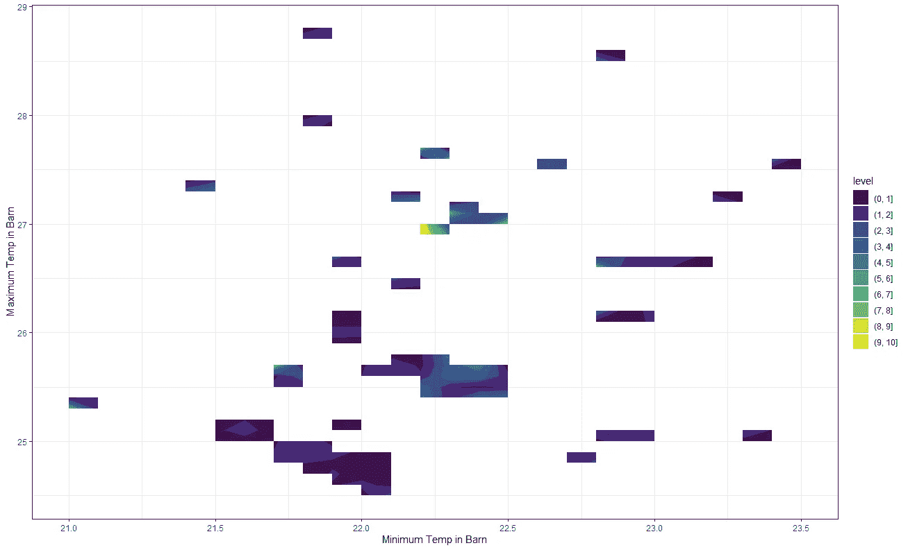

嗯，好像没有足够的传播。你所看到的是一个样条图的尝试，或者你可以称之为响应面，我将最低和最高温度与事件数量联系起来。也许，包含日使它有点不可行。让我们再试一次。

但首先，我将绘制原始数据，看看为什么我有这么多差距。

```
ggplot(df_pois, 
       aes(x=t_min_in, 
           y=t_max_in))+
  geom_point()+
  labs(x="Minimum Temp in Barn", 
       y="Maximum Temp in Barn")+
  theme_bw()
```

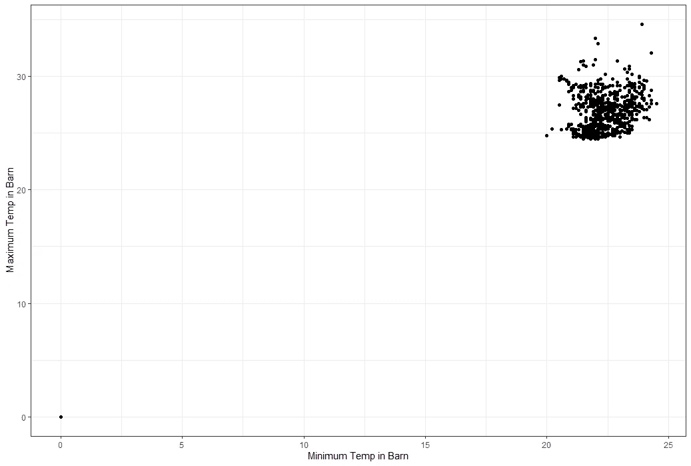

有足够的传播，但零需要去。

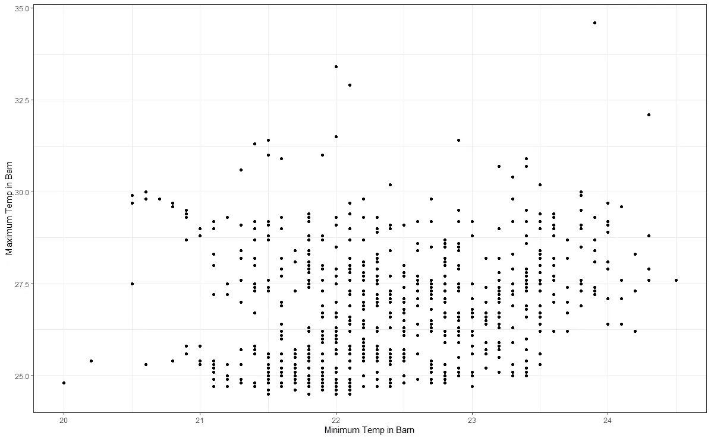

不是全屏，但是，应该比我现在看到的要多。

我将再次尝试，删除一些数据，看看我现在是否可以获得更好的视图。正如你所看到的，我现在正在做很多[动作。我就是爱 dplyr！](https://dplyr.tidyverse.org/)

```
df_pois<-day%>%
  dplyr::filter(!lcn_id %in% c('1435'))%>%
  dplyr::filter_at(vars(animals_start), all_vars(!is.na(.)))%>%
  dplyr::mutate(day = lubridate::day(date_interval), 
                month=lubridate::month(date_interval))%>%
  dplyr::select(lcn_id, day, month, animals_dead, 
                t_min_in, t_max_in, t_act_out)%>%
  replace(is.na(.), 0)%>%
  dplyr::filter(t_min_in>0)%>%
  dplyr::filter(t_max_in>0)
fit<-glm(animals_dead~splines::ns(t_min_in,5)+
           splines::ns(t_max_in,5)+
           as.factor(lcn_id),
         family=poisson(link=log),
         data=df_pois)
summary(fit)
pred_fit<-exp(predict(fit,newdata=df_pois))
df_fit_combined<-cbind(df_pois, pred_fit)
ggplot(df_fit_combined, 
       aes(x=t_min_in, 
           y=t_max_in, 
           z=pred_fit))+
  geom_contour_filled()+
  geom_point(data=df_pois, alpha=0.1)+
  labs(x="Minimum Temp in Barn", 
       y="Maximum Temp in Barn", 
       z="Predicted deaths")+
  theme_bw()
```

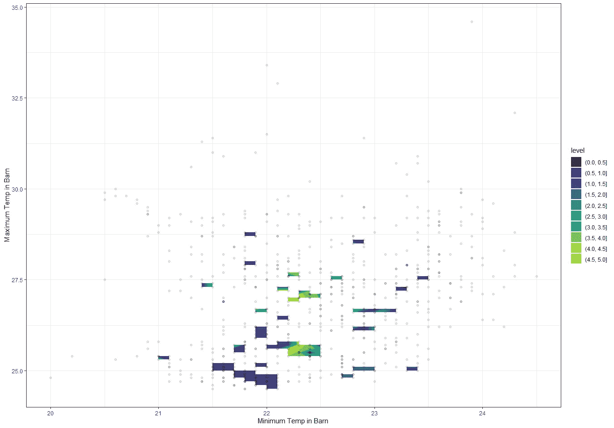

好吧，这太令人失望了。让我们看看是否能更好地理解为什么响应面会比实际显示更多，因为它确实有区别。

也许我需要不同的计划。等高线图的问题在于它寻找连接，因此如果没有这样的连接是可行的，我们将得到间隙。让我们走一条不同的可视化道路，使用 [geom_raster](https://ggplot2.tidyverse.org/reference/geom_tile.html) 。

```
ggplot(df_fit_combined, 
       aes(x=t_min_in, 
           y=t_max_in, 
           fill=pred_fit))+
  geom_raster()+
  scale_fill_viridis_c()+
  labs(x="Minimum Temp in Barn", 
       y="Maximum Temp in Barn", 
       fill="Predicted deaths")+
  theme_bw()
```

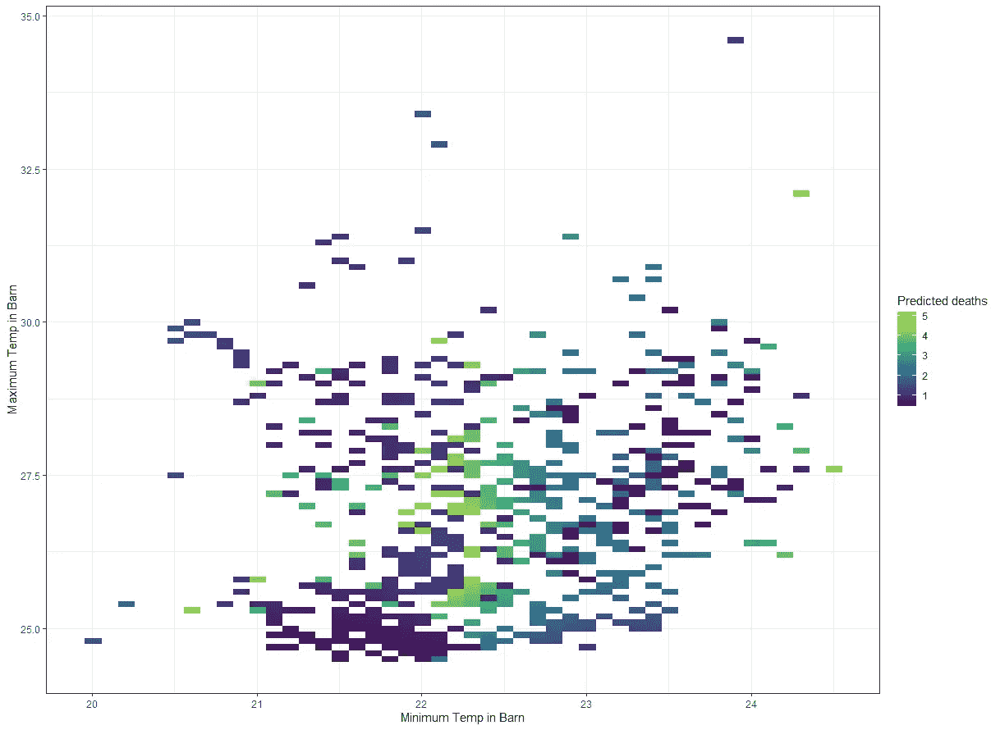

看起来已经好多了。我们也可以将其与原始数据进行比较。

```
g1<-ggplot(df_fit_combined, 
       aes(x=t_min_in, 
           y=t_max_in, 
           fill=pred_fit))+
  geom_raster()+
  scale_fill_viridis_c()+
  labs(x="Minimum Temp in Barn", 
       y="Maximum Temp in Barn", 
       fill="Predicted deaths")+
  theme_bw()+
  theme(legend.position="bottom")
g2<-ggplot(df_fit_combined, 
       aes(x=t_min_in, 
           y=t_max_in, 
           fill=animals_dead))+
  geom_raster()+
  scale_fill_viridis_c()+
  labs(x="Minimum Temp in Barn", 
       y="Maximum Temp in Barn", 
       fill="Predicted deaths")+
  theme_bw()+
  theme(legend.position="bottom")
grid.arrange(g1,g2,ncol=2)
```

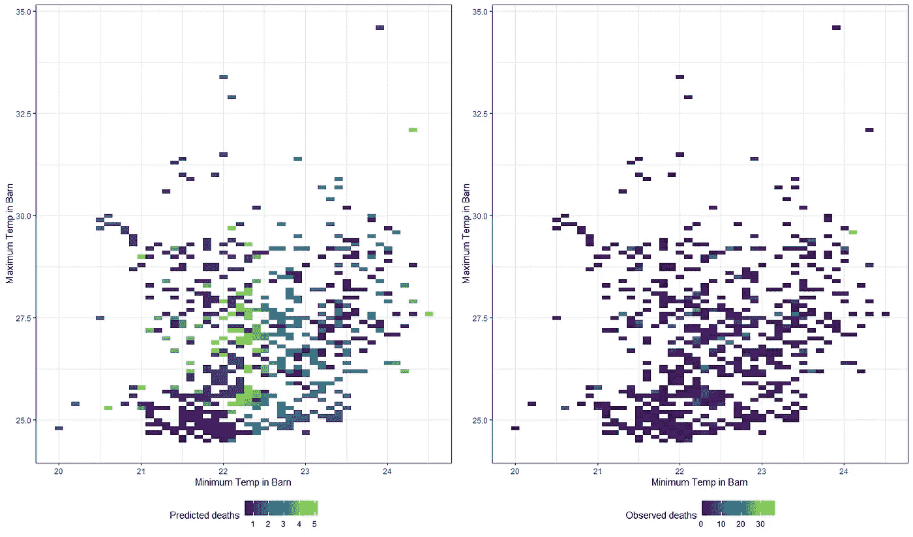

不能说这种模式做得很好。在原始数据中，似乎有比我预测的更多的极端事件发生。现在，一般来说，极端事件建模是一种痛苦，但这比我感觉舒服的差异更大。

如果我区分每个位置，会不会有问题？

```
g3<-ggplot(df_fit_combined, 
           aes(x=t_min_in, 
               y=t_max_in, 
               fill=pred_fit))+
  geom_raster()+
  scale_fill_viridis_c()+
  labs(x="Minimum Temp in Barn", 
       y="Maximum Temp in Barn", 
       fill="Predicted deaths")+
  theme_bw()+
  facet_wrap(~lcn_id, scales="free")+
  theme(legend.position="right")
g4<-ggplot(df_fit_combined, 
           aes(x=t_min_in, 
               y=t_max_in, 
               fill=animals_dead))+
  geom_raster()+
  scale_fill_viridis_c()+
  labs(x="Minimum Temp in Barn", 
       y="Maximum Temp in Barn", 
       fill="Observed deaths")+
  theme_bw()+
  facet_wrap(~lcn_id, scales="free")+
  theme(legend.position="right")
grid.arrange(g3,g4,ncol=1)
```

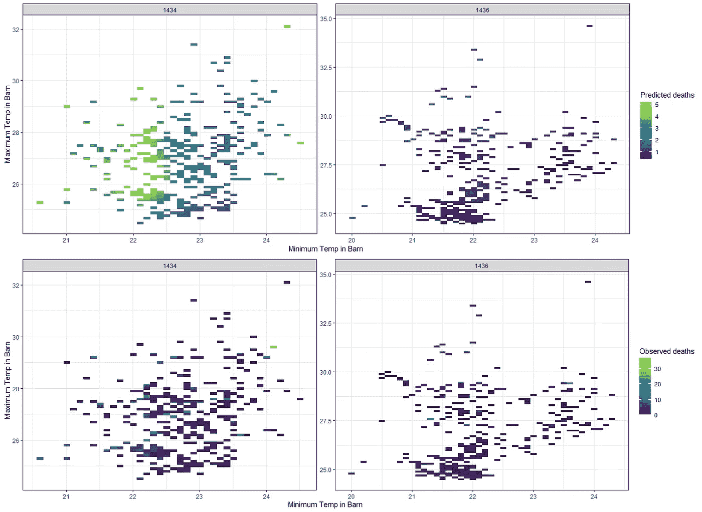

至少我知道问题出在哪里。

好的，让我们停下来，讨论温度差。也许这将使我们更容易建模。

```
df_pois<-day%>%
  dplyr::filter(!lcn_id %in% c('1435'))%>%
  dplyr::filter_at(vars(animals_start), all_vars(!is.na(.)))%>%
  dplyr::select(lcn_id, date_interval, animals_dead, t_min_in, t_max_in)%>%
  replace(is.na(.), 0)%>%
  dplyr::mutate(diff=t_max_in-t_min_in,
                day = lubridate::day(date_interval), 
                month=lubridate::month(date_interval))%>%
  dplyr::select(lcn_id, day, month, diff, animals_dead, date_interval)
fit<-glm(animals_dead~
           splines::ns(day,5)*
           splines::ns(diff,5)+
           as.factor(month)+
           as.factor(lcn_id),
         family=poisson(link=log),
         data=df_pois)
summary(fit)
pred_fit<-exp(predict(fit,newdata=df_pois))
df_fit_combined<-cbind(df_pois, pred_fit)
ggplot(df_fit_combined, 
       aes(x=date_interval, 
           y=diff, 
           size=pred_fit, 
           col=pred_fit))+
  geom_point(alpha=0.7)+
  scale_color_viridis_c(option="magma")+
  facet_wrap(~lcn_id)+
  labs(x="Date", 
       y="Difference Temp in Barn", 
       size="Predicted deaths")+
  theme_bw()+
  theme(legend.position="bottom")+
  guides(color = FALSE)
```

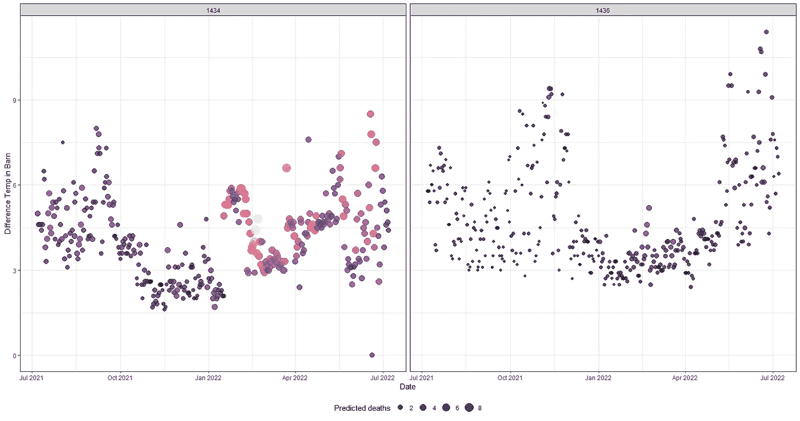

所以我在这里展示的是，随着时间的推移，在每个地点，预测的死亡是温差的函数。大小和颜色都表明了预测的死亡人数。将这个图与观察到的数据进行比较总是好的。

```
ggplot(df_fit_combined, 
       aes(x=date_interval, 
           y=diff, 
           size=animals_dead, 
           col=animals_dead))+
  geom_point(alpha=0.7)+
  scale_color_viridis_c(option="magma")+
  facet_wrap(~lcn_id)+
  labs(x="Date", 
       y="Difference Temp in Barn", 
       size="Observed deaths")+
  theme_bw()+
  theme(legend.position="bottom")+
  guides(color = FALSE)
```

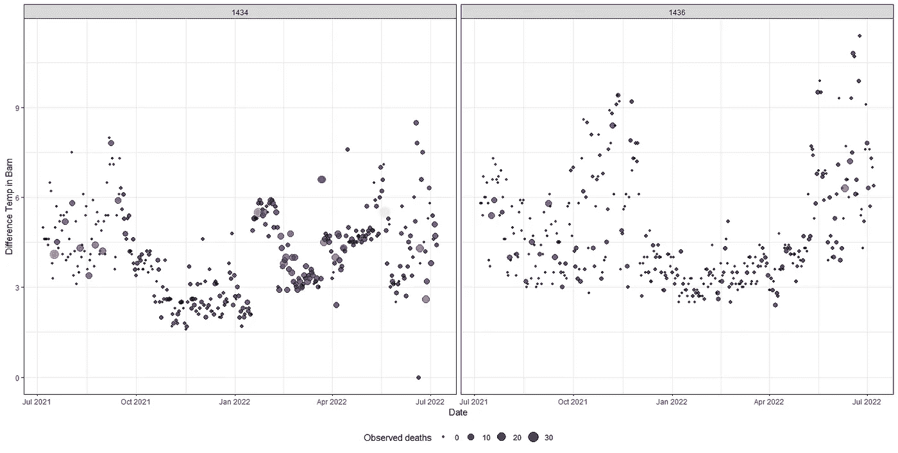

同样，观察值看起来与预测值不同。这种模式似乎并不符合极端情况。

查看模型性能的一个好方法是绘制一个校准图。

```
ggplot(df_fit_combined, 
       aes(x=animals_dead, 
           y=pred_fit))+
  geom_point(alpha=0.7)+
  geom_abline(intercept = 0, slope=1, lty=2, col="red")+
  facet_grid(lcn_id~month, scales="free")+
  labs(x="Observed deaths", 
       y="Predicted deaths")+
  theme_bw()+
  theme(legend.position="bottom")
```

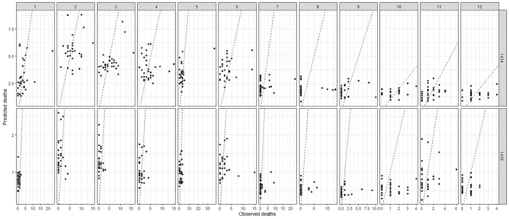

乍一看似乎还不错，但是校准线没有沿对角线移动的事实已经暗示了刻度范围太远。让我们创建一个更清晰的图片。

```
ggplot(df_fit_combined, 
       aes(x=animals_dead, 
           y=pred_fit))+
  geom_point(alpha=0.3)+
  geom_abline(intercept = 0, slope=1, lty=2, col="red")+
  geom_smooth(method='lm', lty=2, col="blue", se=FALSE)+
  facet_grid(lcn_id~month, scales="free")+
  labs(x="Observed deaths", 
       y="Predicted deaths")+
  theme_bw()+
  theme(panel.grid.major = element_blank(), panel.grid.minor = element_blank(),
        panel.background = element_blank(), axis.line = element_line(colour = "black"))+
  theme(legend.position="bottom")
```

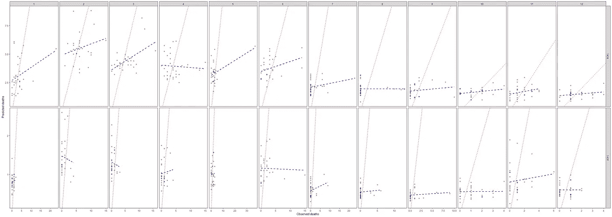

一点也不好看！其实这些预测都是乱七八糟的。难怪其余的看起来不太好。

好的，我们需要改进，我首先从去掉泊松分布开始。这是一个好的开始，但是是时候探索其他的了，比如负二项分布。为此，我将使用带有 [glm.nb](https://www.rdocumentation.org/packages/MASS/versions/7.3-57/topics/glm.nb) 的大众包。

```
df_pois<-day%>%
  dplyr::filter(!lcn_id %in% c('1435'))%>%
  dplyr::filter_at(vars(animals_start), all_vars(!is.na(.)))%>%
  dplyr::select(lcn_id, date_interval, animals_dead, t_min_in, t_max_in)%>%
  replace(is.na(.), 0)%>%
  dplyr::mutate(diff=t_max_in-t_min_in,
                day = lubridate::day(date_interval), 
                month=lubridate::month(date_interval))%>%
  dplyr::select(lcn_id, day, month, diff, animals_dead, date_interval)
fit<-MASS::glm.nb(animals_dead~
           splines::ns(day,5)*
           splines::ns(diff,5)+
           as.factor(month)+
           as.factor(lcn_id),
         data=df_pois)
summary(fit)
pred_fit<-exp(predict(fit,newdata=df_pois))
df_fit_combined<-cbind(df_pois, pred_fit)
ggplot(df_fit_combined, 
       aes(x=animals_dead, 
           y=pred_fit))+
  geom_point(alpha=0.3)+
  geom_abline(intercept = 0, slope=1, lty=2, col="red")+
  geom_smooth(method='lm', lty=2, col="blue", se=FALSE)+
  facet_grid(lcn_id~month, scales="free")+
  labs(x="Observed deaths", 
       y="Predicted deaths")+
  theme_bw()+
  theme(panel.grid.major = element_blank(), panel.grid.minor = element_blank(),
        panel.background = element_blank(), axis.line = element_line(colour = "black"))+
  theme(legend.position="bottom")
```

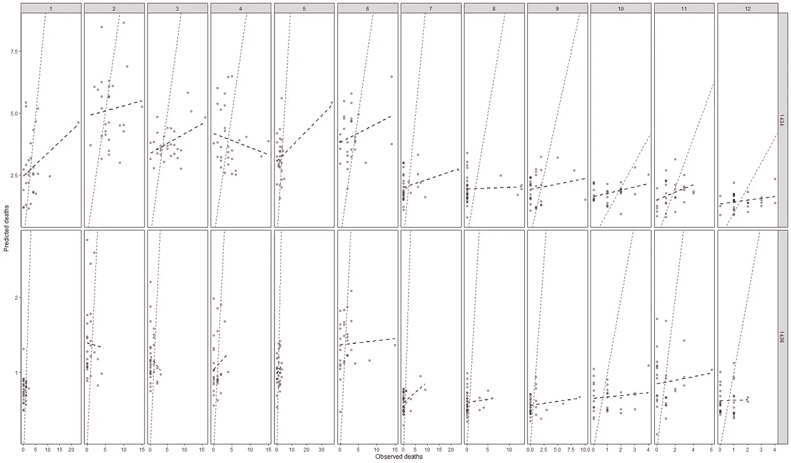

不能说我太激动了。出于某种原因，我无法获取数据。

也许，我应该处理零通货膨胀，我怀疑我因为关注日期、日子和时间而跨过了零通货膨胀。

```
ggplot(df_pois, aes(x=animals_dead, 
                    fill=as.factor(lcn_id)))+
  geom_histogram(alpha=0.5, bins=20)+
  theme_bw()+
  labs(x="Animals Dead", 
       y="Count", 
       fill="Location")
```

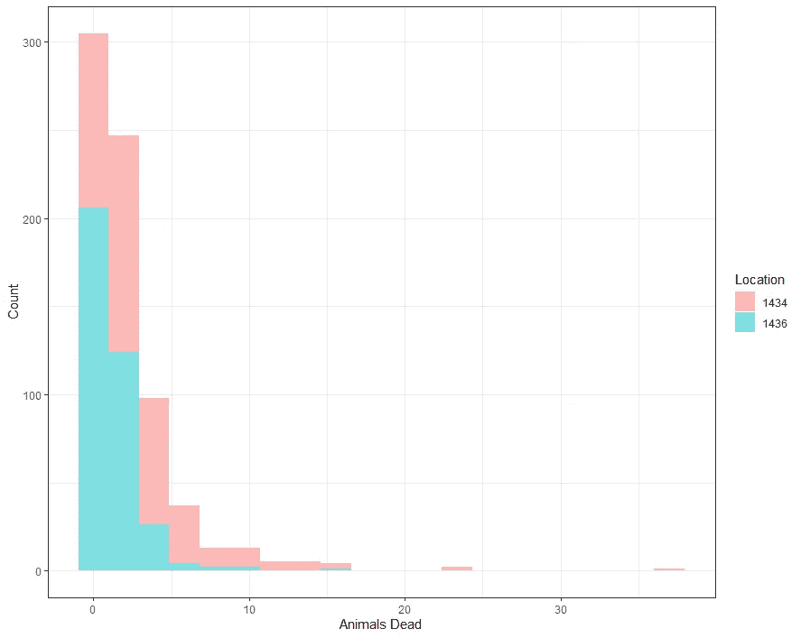

呜哇！我应该先做的，实际上我有点愚蠢。现在，一切都水落石出了。这是严重的零通胀，需要加以应对。

[我最近发表了一篇关于零膨胀模型的文章，用贝叶斯方法对它们进行了分析](https://medium.com/mlearning-ai/ivermectin-covid-19-and-death-355114059c41)。他们并不容易，因为他们将模型分成两部分——一部分预测零或非零死亡，另一部分预测有多少非零死亡。我将使用 [pscl 包](https://cran.r-project.org/web/packages/pscl/index.html)作为零膨胀泊松模型的标准 *glm* 方法。你将看到我做的是复制以前的模型，但也为零部分添加一个特定的模型。这里我选择了*月*。

```
fit<-pscl::zeroinfl(animals_dead~
           splines::ns(day,5)*
           splines::ns(diff,5)+
           as.factor(month)+
           as.factor(lcn_id) | month, data = df_pois)
summary(fit)
```

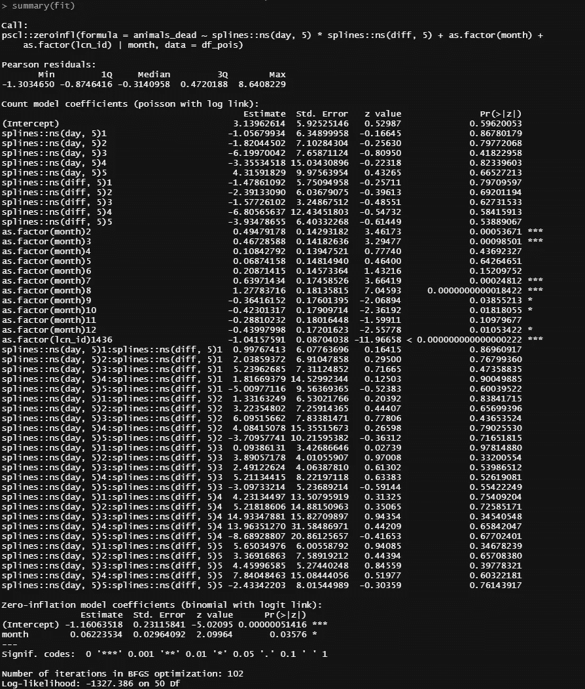

现在，让我们检查性能。

```
pred_fit<-predict(fit,newdata=df_pois)
df_fit_combined<-cbind(df_pois, pred_fit)
ggplot(df_fit_combined, 
       aes(x=animals_dead, 
           y=pred_fit))+
  geom_point(alpha=0.3)+
  geom_abline(intercept = 0, slope=1, lty=2, col="red")+
  geom_smooth(method='lm', lty=2, col="blue", se=FALSE)+
  facet_grid(lcn_id~month, scales="free")+
  labs(x="Observed deaths", 
       y="Predicted deaths")+
  theme_bw()+
  theme(panel.grid.major = element_blank(), panel.grid.minor = element_blank(),
        panel.background = element_blank(), axis.line = element_line(colour = "black"))+
  theme(legend.position="bottom")ggplot(df_fit_combined)+
  geom_histogram(aes(x=animals_dead), fill="red", alpha=0.5)+
  geom_histogram(aes(x=pred_fit), fill="blue", alpha=0.5)+
  facet_grid(lcn_id~month, scales="free")+
  labs(x="Day", 
       y="Deaths",
       main="Predicted (blue) vs Observed (red) Deaths from a Zero-Inflated Poisson model")+
  theme_bw()
```

该模型运行，但检查预测与观察到的死亡并没有真正给我感觉这个模型做得更好。也许是时候重新检查整个模型了，因为位置参数 *lcn_id* 似乎有巨大的主要影响，但在这个模型中，我没有任何东西与之交互。

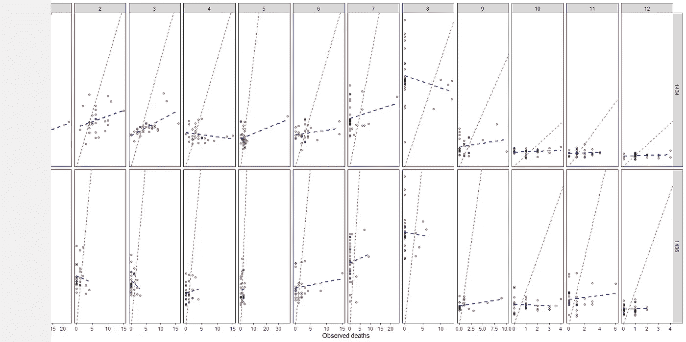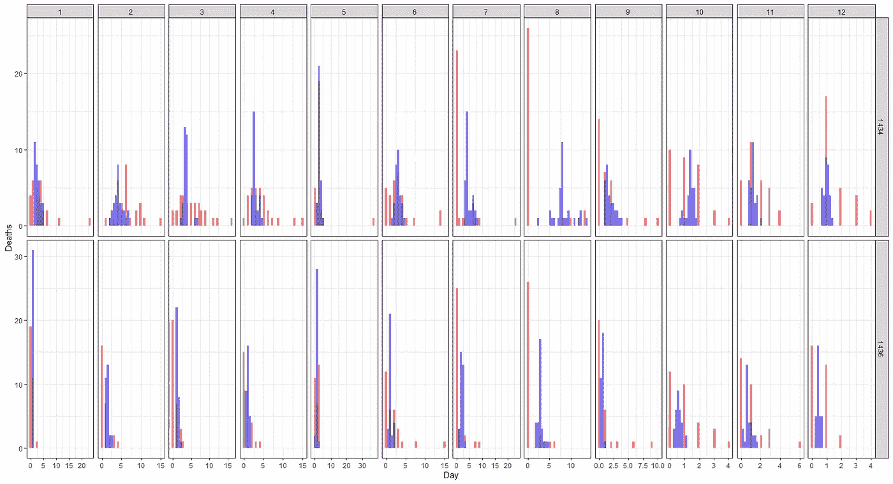

```
fit2<-pscl::zeroinfl(animals_dead~
                      splines::ns(day,5)*
                      splines::ns(diff,5)+
                      as.factor(month) + 
                       splines::ns(day,5):as.factor(month)  +
                      as.factor(lcn_id) | month, data = df_pois)
summary(fit2)
AIC(fit); AIC(fit2)
pred_fit<-predict(fit2,newdata=df_pois)
df_fit_combined<-cbind(df_pois, pred_fit)ggplot(df_fit_combined, 
       aes(x=animals_dead, 
           y=pred_fit))+
  geom_point(alpha=0.3)+
  geom_abline(intercept = 0, slope=1, lty=2, col="red")+
  geom_smooth(method='lm', lty=2, col="blue", se=FALSE)+
  labs(x="Observed deaths", 
       y="Predicted deaths")+
  theme_bw()+
  theme(panel.grid.major = element_blank(), panel.grid.minor = element_blank(),
        panel.background = element_blank(), axis.line = element_line(colour = "black"))+
  theme(legend.position="bottom")+
  ylim(0,50)ggplot(df_fit_combined)+
  geom_histogram(aes(x=animals_dead), fill="red", alpha=0.5)+
  geom_histogram(aes(x=pred_fit), fill="blue", alpha=0.5)+
  labs(x="Deaths", 
       y="Frequency",
       title="Predicted (blue) vs Observed (red) Deaths from a Zero-Inflated Poisson model")+
  theme_bw()+
  xlim(0,30)
```


根据 AIC 的说法，日与月交互的模型更适合。

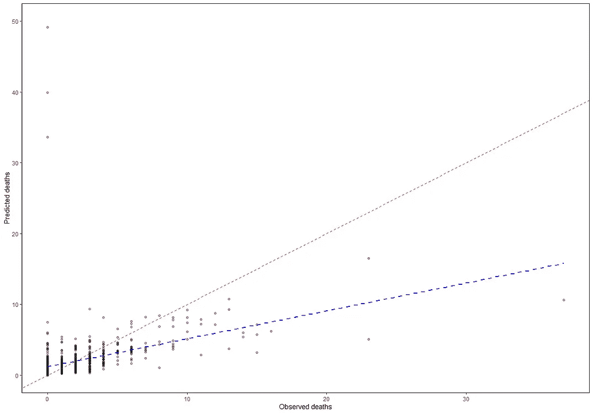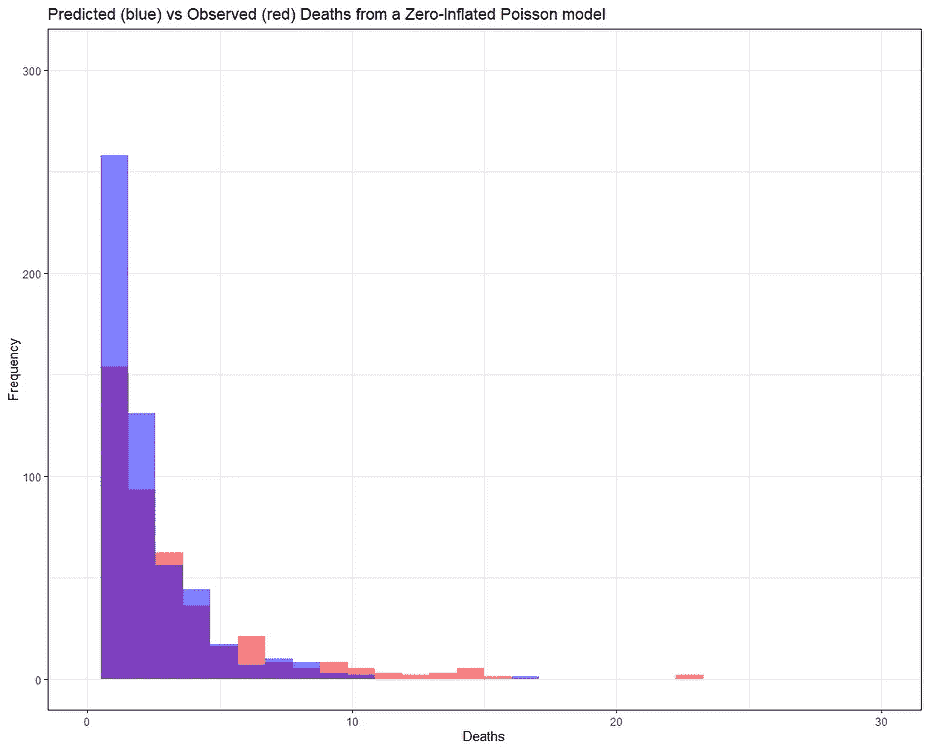

但是，仍然有足够的改进空间。像这样的事件数据真的不容易预测。

```
ggplot(df_fit_combined)+
  geom_histogram(aes(x=animals_dead), fill="red", alpha=0.5)+
  geom_histogram(aes(x=pred_fit), fill="blue", alpha=0.5)+
  facet_grid(lcn_id~month, scales="free")+
  labs(x="Day", 
       y="Frequency",
       main="Predicted (blue) vs Observed (red) Deaths from a Zero-Inflated Poisson model")+
  theme_bw()+
  xlim(0,30)
```

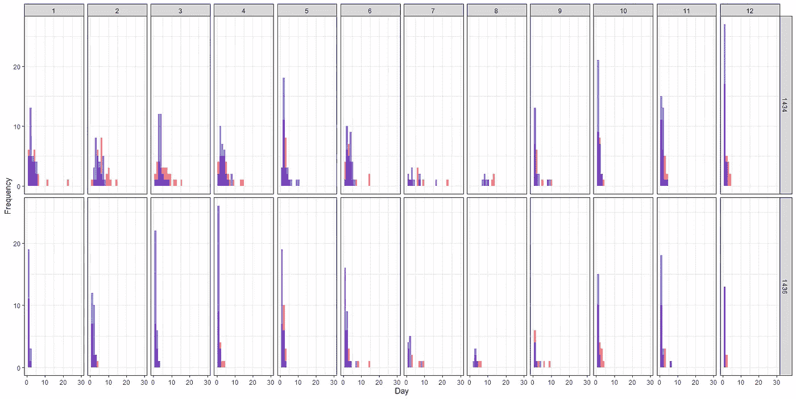

让我们把日作为一个变量加到零的部分。

```
fit3<-pscl::zeroinfl(animals_dead~
                       splines::ns(day,5)*
                       splines::ns(diff,5)+
                       as.factor(month) + 
                       splines::ns(day,5):as.factor(month)  +
                       as.factor(lcn_id) | day + month, 
                     dist="poisson", 
                     link="log",
                     data = df_pois)
summary(fit3)
AIC(fit); AIC(fit2); AIC(fit3)
```

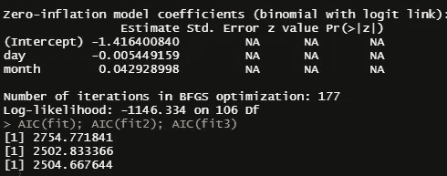

那并不顺利。

我们将进行另一轮建模，这一次参照原始温度，包括更多的相互作用，现在是位置。因为我们知道日期、月份和位置会区分数据。

```
df_pois<-day%>%
  dplyr::filter(!lcn_id %in% c('1435'))%>%
  dplyr::filter_at(vars(animals_start), all_vars(!is.na(.)))%>%
  dplyr::mutate(day = lubridate::day(date_interval), 
                month=lubridate::month(date_interval))%>%
  dplyr::select(lcn_id, day, month, animals_dead, 
                t_min_in, t_max_in, t_act_out)%>%
  replace(is.na(.), 0)%>%
  dplyr::filter(t_min_in>0)%>%
  dplyr::filter(t_max_in>0)fit4<-pscl::zeroinfl(animals_dead~
                       splines::ns(day,5)*
                       splines::ns(t_min_in,5)+
                       splines::ns(t_max_in,5)+
                       splines::ns(t_act_out,5)+
                       as.factor(month) + 
                       splines::ns(day,5):as.factor(month)+
                       as.factor(lcn_id) + as.factor(month):as.factor(lcn_id)| 
                       day + month, 
                     dist="poisson", 
                     link="log",
                     data = df_pois)
summary(fit4)
AIC(fit); AIC(fit2); AIC(fit3); AIC(fit4)
pred_fit<-predict(fit4,newdata=df_pois)
df_fit_combined<-cbind(df_pois, pred_fit)ggplot(df_fit_combined, 
       aes(x=animals_dead, 
           y=pred_fit))+
  geom_point(alpha=0.3)+
  geom_abline(intercept = 0, slope=1, lty=2, col="red")+
  geom_smooth(method='lm', lty=2, col="blue", se=FALSE)+
  labs(x="Observed deaths", 
       y="Predicted deaths")+
  theme_bw()+
  theme(panel.grid.major = element_blank(), panel.grid.minor = element_blank(),
        panel.background = element_blank(), axis.line = element_line(colour = "black"))+
  theme(legend.position="bottom")+
  ylim(0,30)+
  xlim(0,30)ggplot(df_fit_combined, 
       aes(x=animals_dead, 
           y=pred_fit))+
  geom_point(alpha=0.3)+
  geom_abline(intercept = 0, slope=1, lty=2, col="red")+
  geom_smooth(method='lm', lty=2, col="blue", se=FALSE)+
  labs(x="Observed deaths", 
       y="Predicted deaths")+
  facet_grid(lcn_id~month, scales="free")+
  theme_bw()+
  theme(panel.grid.major = element_blank(), panel.grid.minor = element_blank(),
        panel.background = element_blank(), axis.line = element_line(colour = "black"))+
  theme(legend.position="bottom")+
  ylim(0,10)+
  xlim(0,10)
```

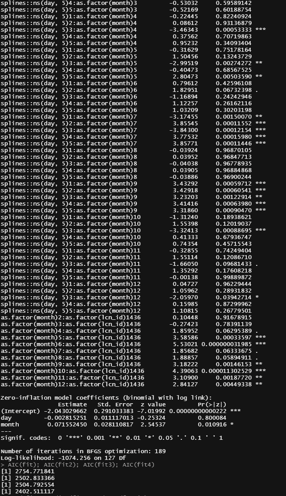

大模型，但 AIC 是最低的。

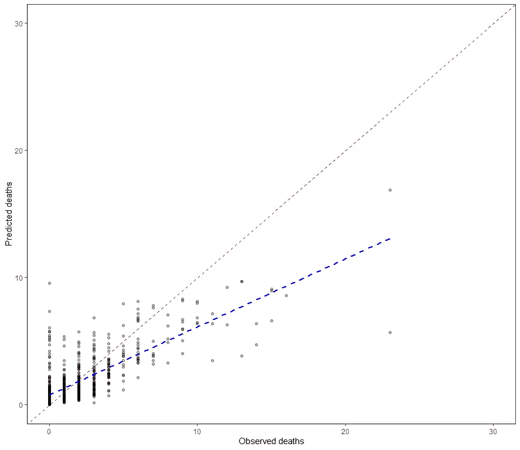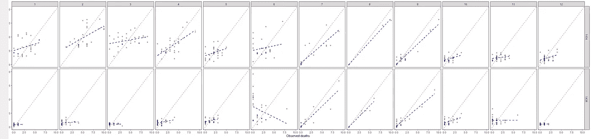

预测仍然不太好。

可以肯定地说，如果我继续这样下去，我将会接近我想去的任何地方。转向负二项式真的没有改变模型的预测能力。我现在想做的是，看看能否从温度数据中获得更多信号，这意味着应用分解方法。

如果我们回头看看温度数据，很容易看到有很多正在发生的事情，但我一直试图用一个 5 结样条来覆盖它。让我们看看那是什么样子。请记住，5 节自然样条意味着 7 个自由度。

```
day%>%
  dplyr::filter(!lcn_id %in% c('1435'))%>%
  dplyr::filter_at(vars(animals_start), all_vars(!is.na(.)))%>%
  dplyr::select(lcn_id, date_interval, animals_dead, 
                t_min_in, t_max_in, t_act_out)%>%
  replace(is.na(.), 0)%>%
  dplyr::filter(t_min_in>0)%>%
  dplyr::filter(t_max_in>0)%>%
  ggplot(., aes(x=date_interval, 
                y=t_max_in))+
  geom_line()+
  geom_smooth(method = "lm",
              formula = y ~ splines::ns(x, df = 7))+
  facet_wrap(~lcn_id)+
  theme_bw()
```

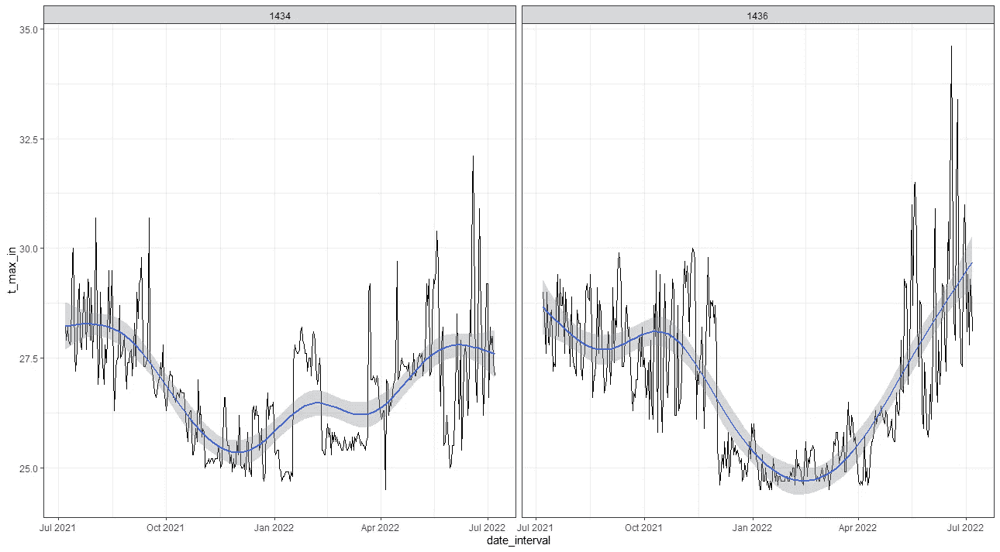

立即显示时态数据不应该用样条来近似。还有更多的事情可以做。

那么，让我们看看是否可以使用时间序列分解。我将从单变量时间序列开始，取 1436 号谷仓的最低温度。然后我会对它进行分解。

```
df<-day%>%
  dplyr::filter(lcn_id=='1436')%>%
  dplyr::filter_at(vars(animals_start), all_vars(!is.na(.)))%>%
  dplyr::select(lcn_id, date_interval, animals_dead, t_min_in, t_max_in)%>%
  replace(is.na(.), 0)
min(lubridate::date(df$date_interval))
max(lubridate::date(df$date_interval))
myts<-ts(df$t_min_in,
   start=c(lubridate::year(min(df$date_interval)),lubridate::yday(min(df$date_interval))), 
   end=c(lubridate::year(max(df$date_interval)),lubridate::yday(max(df$date_interval))), 
   frequency=365)
class(myts)
plot(myts)
decomp<-stats::decompose(myts)  
plot(decomp)
```

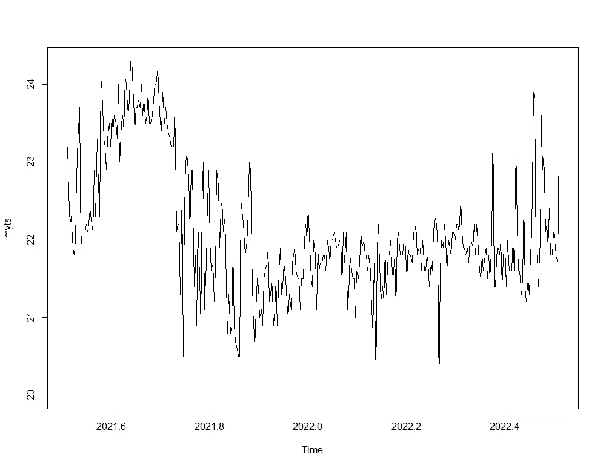

1436 号谷仓最低温度的观测


不幸的是，分解是不可能的，因为我们错过了足够的时期。不知道为什么这是必要的，因为我们有全年的数据，但我猜测这与季节性因素有关。因为我们只有一年的时间，所以无法计算。

我发现了另一种寻找提取成分，尤其是循环的方法，叫做 [Hodrick-Prescott 过滤器](https://www.rdocumentation.org/packages/mFilter/versions/0.1-5/topics/hpfilter)。我第一次听说它，所以让我们看看它是做什么的。它的应用和大多数 R 函数一样简单。就像我之前说的，这肯定有危险。

```
p_min_temp<-mFilter::hpfilter(myts, freq = 1600)
plot(hp_min_temp)
```

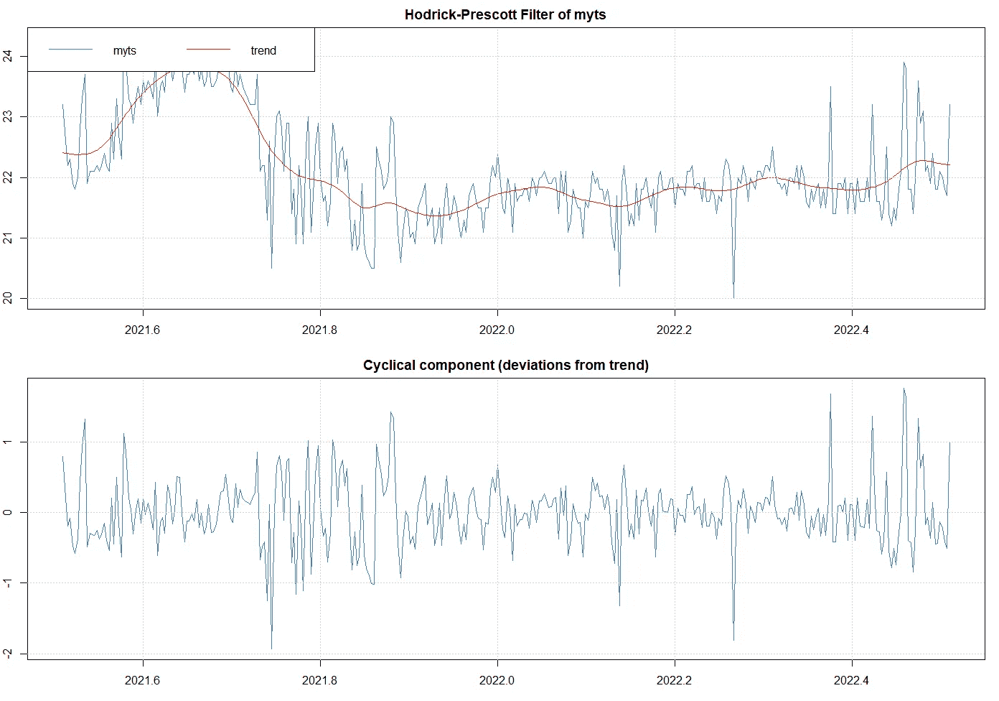

数据、趋势和偏离趋势的周期性成分。

上面看起来不错，但我记得有一个更好的方法，那就是通过未观察的组件模型(UCMs)来分析单变量时间序列。我之前在[的博客](/time-series-analysis-in-sas-8b6c03b39fd4)上讨论过这种方法，我喜欢的是它的工作方式与分解方法完全一样，除了你可以调整组件，将它们设置为零或固定方差，以及这个模型。让我们试一试。

下面，我将运行一个 UCM，其中我要求水平，斜率和周期分量。循环周期设置为 12，即 12 天。我还要求一个不规则的组件，模仿不规则，基本上是偏差。

```
ucm_min_temp<-rucm::ucm(t_min_in~0, 
                        data=df, 
                        level=TRUE,
                        slope=TRUE,
                        cycle=TRUE,cycle.period = 12,
                        irregular=TRUE)
ucm_min_temp
g1<-ggplot(df, 
       aes(x=date_interval))+
  geom_line(aes(y=t_min_in))+
  geom_line(aes(y=ucm_min_temp$s.level), col="red", size=1)+
  labs(x="Date", 
       y="Min Temp in the Barn", 
       title="UCM-Level")+
  theme_bw()+
  theme(axis.text.y=element_blank())
g2<-ggplot(df, 
       aes(x=date_interval))+
  geom_line(aes(y=ucm_min_temp$s.cycle), col="blue", size=0.5)+
  labs(x="Date", 
       y="Min Temp in the Barn", 
       title="UCM-cycle")+
  theme_bw()+
  theme(axis.text.y=element_blank())
g3<-ggplot(df, 
       aes(x=date_interval))+
  geom_line(aes(y=ucm_min_temp$s.slope), col="seagreen", size=0.5)+
  labs(x="Date", 
       y="Min Temp in the Barn", 
       title="UCM-Slope")+
  theme_bw()+
  theme(axis.text.y=element_blank())
grid.arrange(g1,g2,g3, nrow=3)
```

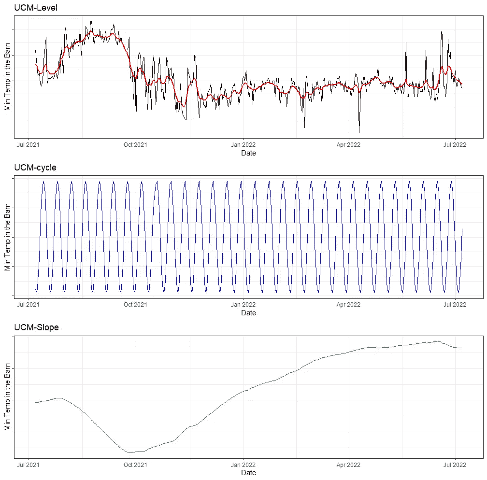

水平、周期和斜率。这个周期肯定需要一些调整，也许我应该把它设置为 7，意思是 7 天，或者 30，意思是一个月。然而，我们这里谈的是温度，所以任何一种循环都是季节性或日常性的。因为我们只有平均每天，季节是我们的全部。

让我们用实际死亡率数据来绘制最低温度的水平分量，看看我们是否能找到任何模式。

```
df$level<-ucm_min_temp$s.level
obj1<-lattice::xyplot(animals_dead~date_interval, 
                data=df, type="l")
obj2<-lattice::xyplot(level~date_interval, 
                      data=df, type="l")
latticeExtra::doubleYScale(obj1, 
             obj2, 
             add.ylab2 = TRUE)
```

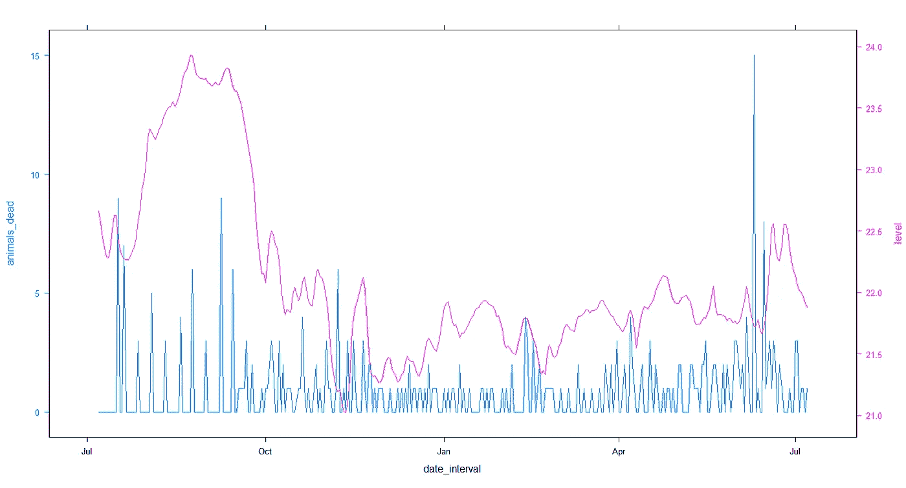

显示位置 1436 的最低温度和每个数据的死亡人数的图片。肉眼很难发现任何图案。

```
df<-day%>%
  dplyr::filter(lcn_id=='1434')%>%
  dplyr::filter_at(vars(animals_start), all_vars(!is.na(.)))%>%
  dplyr::select(lcn_id, date_interval, animals_dead, t_min_in, t_max_in)%>%
  replace(is.na(.), 0)
min(lubridate::date(df$date_interval))
max(lubridate::date(df$date_interval))
ucm_min_temp<-rucm::ucm(t_min_in~0, 
                        data=df, 
                        level=TRUE,
                        slope=TRUE,
                        cycle=TRUE,cycle.period = 12,
                        irregular=TRUE)
ucm_min_temp
df$level<-ucm_min_temp$s.level
obj1<-lattice::xyplot(animals_dead~date_interval, 
                      data=df, type="l")
obj2<-lattice::xyplot(level~date_interval, 
                      data=df, type="l")
latticeExtra::doubleYScale(obj1, 
                           obj2, 
                           add.ylab2 = TRUE)
```

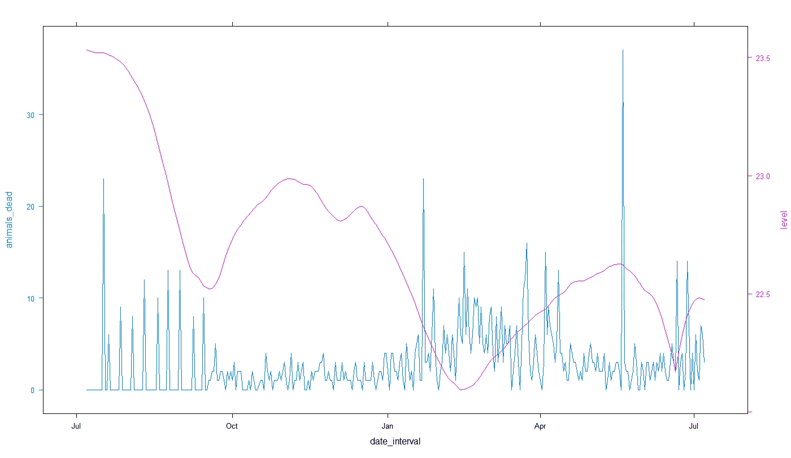

显示位置 1434 的最低温度和每个数据的死亡人数的图片。肉眼很难发现任何图案。

那么，现在怎么办？我们可以看到死亡率的模式在每个地方都有变化，可以肯定的是死亡率是可以看到的。有事件，无论如何。下一步可能是回到最初的[生存分析](https://towardsdatascience.com/introduction-to-survival-analysis-in-cows-using-r-28b82c2821fb)，像 Kaplan-Meier 或 Cox 回归，因为两者都可以包含像时间这样的时变系数。然后我们可以添加参数生存分析来寻找预期的死亡率曲线。

首先，让我们回到我们制作的最后一个模型，并绘制预测生存曲线，以进一步了解模型的性能。只是为了更好地了解我们所拥有的。

```
df_pois<-day%>%
  dplyr::filter(!lcn_id %in% c('1435'))%>%
  dplyr::filter_at(vars(animals_start), all_vars(!is.na(.)))%>%
  dplyr::mutate(day = lubridate::day(date_interval), 
                month=lubridate::month(date_interval))%>%
  dplyr::select(lcn_id, date_interval, day, month, animals_dead, animals_start,
                t_min_in, t_max_in, t_act_out)%>%
  replace(is.na(.), 0)%>%
  dplyr::filter(t_min_in>0)%>%
  dplyr::filter(t_max_in>0)
fit5<-pscl::zeroinfl(animals_dead~
                       splines::ns(day,5)*
                       splines::ns(t_min_in,5)+
                       splines::ns(t_max_in,5)+
                       splines::ns(t_act_out,5)+
                       as.factor(month) + 
                       splines::ns(day,5):as.factor(month)+
                       as.factor(lcn_id) + as.factor(month):as.factor(lcn_id)| 
                       day + month, 
                     dist="negbin", 
                     link="log",
                     data = df_pois)
summary(fit5)
pred_fit<-predict(fit5,newdata=df_pois)
df_fit_combined<-cbind(df_pois, pred_fit)
plot(hist(df_fit_combined$pred_fit))
```

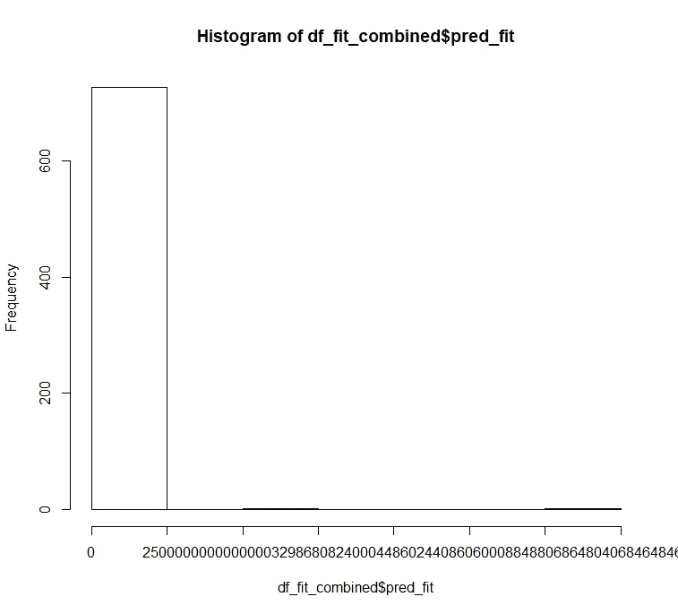

哇，这里有一些时髦的预测！

```
ggplot(df_fit_combined, 
       aes(x=pred_fit, fill=as.factor(lcn_id)))+
  geom_density(alpha=0.5)+
  theme_bw()+
  labs(fill="Location")+
  xlim(0,40)
```

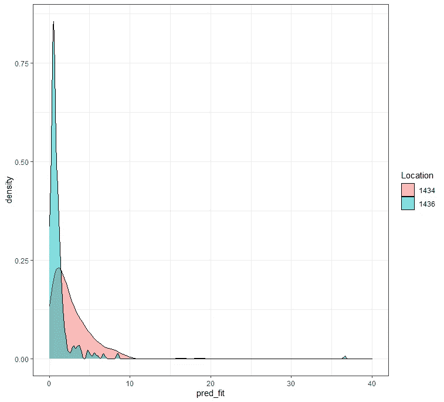

如果我把上限设在 40，看起来会更好。我把上限定在 40 没有特别的理由，除了我知道有时候单日死亡率可以达到那个数字。幸运的是，该模型在预测中确实做到了零通胀，而且预测的数字也没有那么可怕。

记住，我警告过你们所有人，这种建模并不容易。我故意拒绝使用 Kaplan-Meier 或 Cox 回归对数据建模，而是选择使用时间对事件数据建模，并包括零通货膨胀。

检查我的模型做得如何的一个更好的方法是看一看我预测的死亡总数，并创建一种[生命风险](https://blog.devgenius.io/survival-analysis-in-sas-kaplan-meier-cox-regression-time-varying-predictors-recurrent-events-4ae7cd95f8c0)图。请记住，真正疯狂的预测，我踢出来，这里用零代替。我需要，否则情节不会工作，但这些事实上是我丢弃的预测。当然，这是一个限制。

```
df_fit_combined%>%
  dplyr::group_by(lcn_id)%>%
  dplyr::mutate(pred_fit = ifelse(pred_fit>40, NA, pred_fit))%>%
  dplyr::select(lcn_id, date_interval, animals_dead, animals_start, pred_fit)%>%
  replace(is.na(.), 0)%>%
  dplyr::mutate(cum_dead = cumsum(animals_dead), 
                cum_pred_dead = cumsum(pred_fit),
                animals_no_dead = animals_start - cum_dead, 
                animals_pred_no_dead = animals_start - cum_pred_dead)%>%
  ggplot(., aes(x=date_interval))+
  geom_line(aes(y=cum_pred_dead), col="red")+
  geom_line(aes(y=cum_dead), col="black")+
  facet_wrap(~lcn_id, scales="free")+
  theme_bw()
df_fit_combined%>%
  dplyr::group_by(lcn_id)%>%
  dplyr::mutate(pred_fit = ifelse(pred_fit>40, NA, pred_fit))%>%
  dplyr::select(lcn_id, date_interval, animals_dead, animals_start, pred_fit)%>%
  replace(is.na(.), 0)%>%
  dplyr::mutate(cum_dead = cumsum(animals_dead), 
                cum_pred_dead = cumsum(pred_fit),
                animals_no_dead = animals_start - cum_dead, 
                animals_pred_no_dead = animals_start - cum_pred_dead)%>%
  ggplot(., aes(x=date_interval))+
  geom_line(aes(y=animals_pred_no_dead), col="red")+
  geom_line(aes(y=animals_no_dead), col="black")+
  facet_wrap(~lcn_id, scales="free")+
  theme_bw()
```

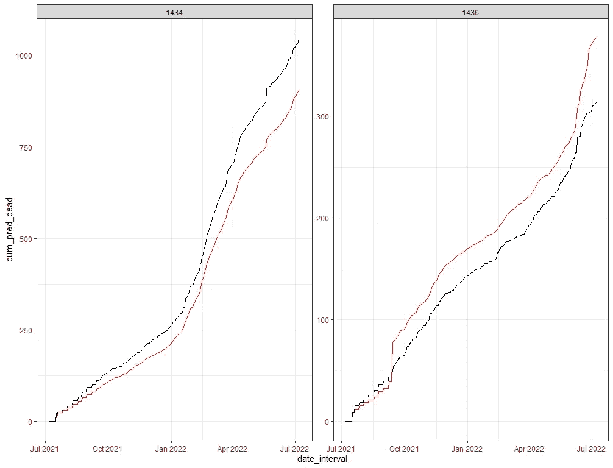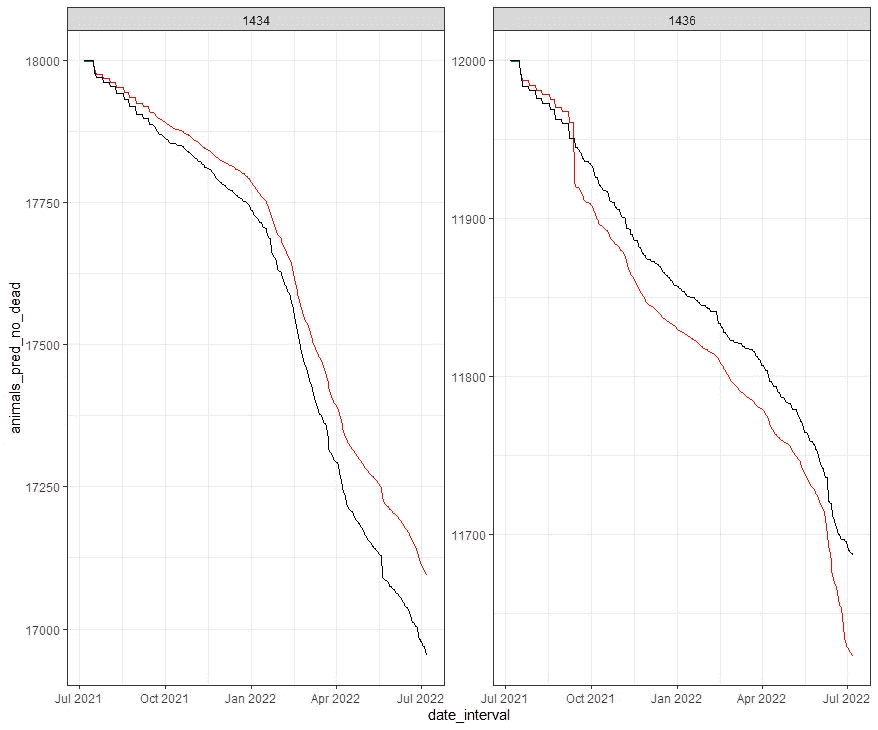

左图:累计死亡总数。右图:显示动物数量减少的生命风险图。在这两幅图中，预测用红色表示，实际数字用黑色表示。你可以看到这个模型是如何反复预测的，但是因为我没有使用任何变量，所以你看不到不确定性。让我们加上这一点。

pscl 包没有标准的置信区间计算，因此获得置信区间的最简单方法是引导数据。同样在这里，我需要删除严重的预测，我不喜欢，但无论如何让我们这样做。

```
fit5<-pscl::zeroinfl(animals_dead~
                       splines::ns(day,5)*
                       splines::ns(t_min_in,5)+
                       splines::ns(t_max_in,5)+
                       splines::ns(t_act_out,5)+
                       as.factor(month) + 
                       splines::ns(day,5):as.factor(month)+
                       as.factor(lcn_id) + as.factor(month):as.factor(lcn_id)| 
                       day + month, 
                     dist="negbin", 
                     link="log",
                     data = df_pois, 
                     X=TRUE, 
                     y=TRUE, 
                     model=TRUE,
                     linkinv=TRUE)
stat <- function(df_pois, inds) {
  model <- formula(animals_dead~
                     splines::ns(day,5)*
                     splines::ns(t_min_in,5)+
                     splines::ns(t_max_in,5)+
                     splines::ns(t_act_out,5)+
                     as.factor(month) + 
                     splines::ns(day,5):as.factor(month)+
                     as.factor(lcn_id) + as.factor(month):as.factor(lcn_id)| 
                     day + month)
  predict(
    pscl::zeroinfl(model, 
                   dist = "negbin", 
                   link = "log", 
                   data = df_pois[inds, ]))
}
(res <- boot::boot(df_pois, stat, R = 2000, parallel="snow", ncpus = 6))
CI <- setNames(as.data.frame(t(sapply(1:nrow(df_pois), function(row)
  boot.ci(res, conf = 0.95, type = "basic", index = row)$basic[, 4:5]))),
  c("lower", "upper"))
df_all <- cbind.data.frame(df_pois, 
                           response = predict(fit5), CI)
df_boot<-df_all%>%
  dplyr::mutate(response = ifelse(response>40, NA, response),
                lower = ifelse(between(lower,-40,40), lower, NA),
                upper = ifelse(between(upper,-40,40), upper, NA))table(is.na(df_boot$lower))
table(is.na(df_boot$upper))
table(is.na(df_boot$response))ggplot(df_boot, 
       aes(x=as.numeric(response), 
           y=lubridate::date(date_interval)))+
  geom_pointrange(aes(xmin=0, xmax=upper), alpha=0.5)+
  geom_point()+
  facet_wrap(~lcn_id, scales="free")+
  theme_bw()
```

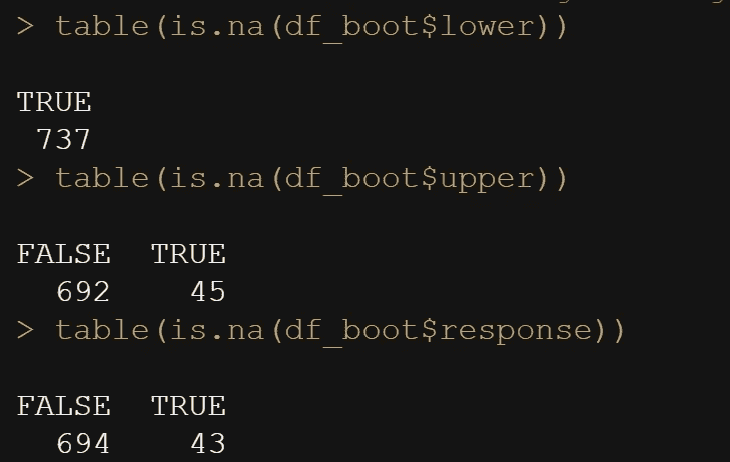

如你所见，置信区间的下限非常非常低，所以我必须把它们设为零。通常，你不希望必须这样做，而是让模型考虑零的边界，但是这里没有发生。所以我帮了点忙。

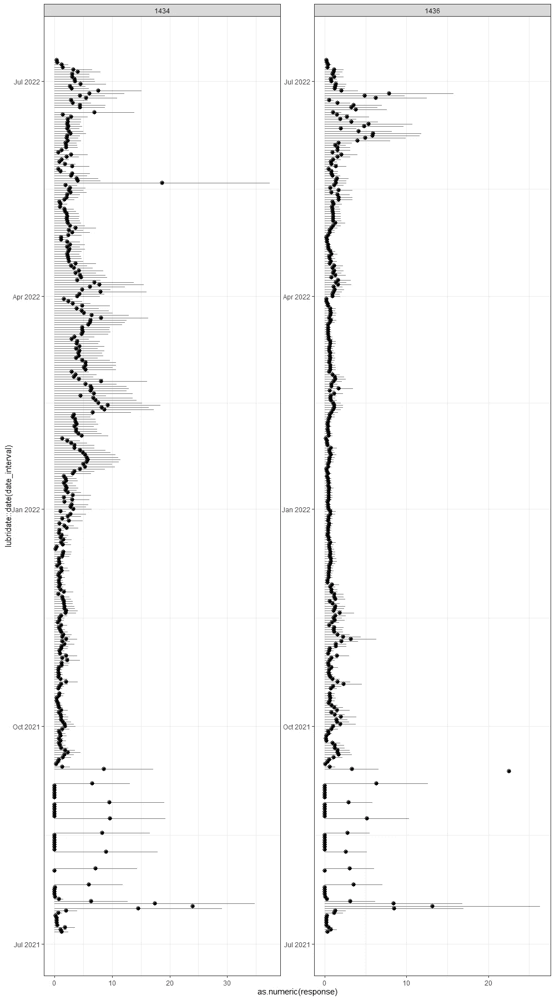

以及自举预测。帮忙之后，看起来没那么糟。您还可以看到，在某些点上没有做出任何预测。让我们看看所有这些在累积和图中是什么样子的。

下面是累积和图。男孩哦男孩。请记住，我运行了 2000 次模型，并预测了 2000 次我观察到的每个数据点的死亡人数。然后，我得到了每个预测的置信区间。可以说这些是预测区间。然后我开始总结这些，下面我得到的是一个相当诚实的解释，关于我的模型本身有多确定，它不是很确定。话说回来，我一开始也不是很确定。

```
df_boot%>%
  dplyr::group_by(lcn_id)%>%
  dplyr::select(lcn_id, date_interval, 
                animals_dead, 
                animals_start, 
                response, 
                lower, 
                upper)%>%
  replace(is.na(.), 0)%>%
  dplyr::mutate(cum_dead = cumsum(animals_dead), 
                cum_pred_dead = cumsum(response),
                cum_pred_lower_dead = cumsum(lower),
                cum_pred_upper_dead = cumsum(upper),
                animals_no_dead = animals_start - cum_dead, 
                animals_pred_no_dead = animals_start - cum_pred_dead,
                animals_lower_no_dead = animals_start - cum_pred_lower_dead,
                animals_upper_no_dead = animals_start - cum_pred_upper_dead)%>%
  ggplot(., aes(x=date_interval))+
  geom_line(aes(y=cum_pred_dead), col="red")+
  geom_line(aes(y=cum_dead), col="black")+
  geom_ribbon(aes(ymin=cum_pred_lower_dead, ymax=cum_pred_upper_dead), 
              fill="red", alpha=0.3)+
  facet_wrap(~lcn_id, scales="free")+
  theme_bw()
```

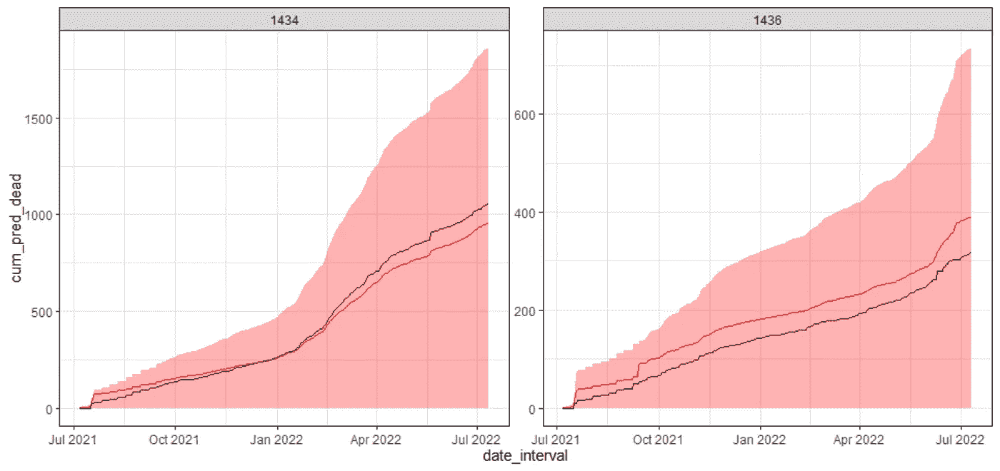

置信区间看起来不错，就它们应该看起来如何而言，但它们是巨大的。当然，如果 yu 运行一个模型，该模型将不得不自我更新，但仍然可以预期，当你试图对这样的离散数据建模时，很难得到任何类型的有效预测。

现在，还有最后一件事我想尝试，那就是从 UCM 模型中提取曲线，帮我预测事件，然后绘制它。我将只为一个位置这样做。只是为了看看。我对它不抱太大期望，但谁知道呢。好像我从一开始就没有警告过你们。

```
df_pois<-day%>%
  dplyr::filter(!lcn_id %in% c('1435'))%>%
  dplyr::filter_at(vars(animals_start), all_vars(!is.na(.)))%>%
  dplyr::mutate(day = lubridate::day(date_interval), 
                month=lubridate::month(date_interval))%>%
  dplyr::select(lcn_id, date_interval, day, month, animals_dead, animals_start,
                t_min_in, t_max_in, t_act_out)%>%
  replace(is.na(.), 0)%>%
  dplyr::filter(t_min_in>0)%>%
  dplyr::filter(t_max_in>0)
ucm_min_temp<-rucm::ucm(t_min_in~0, 
                        data=df_pois, 
                        level=TRUE,
                        slope=TRUE,
                        cycle=TRUE,cycle.period = 12,
                        irregular=TRUE)
df_pois$level<-ucm_min_temp$s.levelfit6<-pscl::zeroinfl(animals_dead~
                       splines::ns(day,5)+
                       splines::ns(level,5)+
                       as.factor(month) + 
                       as.factor(lcn_id)+
                       splines::ns(day,5):as.factor(month)+
                       splines::ns(day,5):splines::ns(level,5)+
                       as.factor(lcn_id) + as.factor(month):as.factor(lcn_id)| 
                       day + month, 
                     dist="negbin", 
                     link="log",
                     data = df_pois, 
                     X=TRUE, 
                     y=TRUE, 
                     model=TRUE,
                     linkinv=TRUE)
AIC(fit5);AIC(fit6)
stat <- function(df_pois, inds) {
  model <- formula(animals_dead~
                     splines::ns(day,5)+
                     splines::ns(level,5)+
                     as.factor(month) + 
                     as.factor(lcn_id)+
                     splines::ns(day,5):as.factor(month)+
                     splines::ns(day,5):splines::ns(level,5)+
                     as.factor(lcn_id) + as.factor(month):as.factor(lcn_id)| 
                     day + month)
  predict(
    pscl::zeroinfl(model, 
                   dist = "negbin", 
                   link = "log", 
                   data = df_pois[inds, ]))
}
(res <- boot::boot(df_pois, stat, R = 2000, parallel="snow", ncpus = 6))
CI <- setNames(as.data.frame(t(sapply(1:nrow(df_pois), function(row)
  boot.ci(res, conf = 0.95, type = "basic", index = row)$basic[, 4:5]))),
  c("lower", "upper"))
df_all <- cbind.data.frame(df_pois, 
                           response = predict(fit6), CI)
df_boot<-df_all%>%
  dplyr::mutate(response = ifelse(response>40, NA, response),
                lower = ifelse(between(lower,-40,40), lower, NA),
                upper = ifelse(between(upper,-40,40), upper, NA))
ggplot(df_boot, 
       aes(x=as.numeric(response), 
           y=lubridate::date(date_interval)))+
  geom_pointrange(aes(xmin=0, xmax=upper), alpha=0.5)+
  geom_point()+
  facet_wrap(~lcn_id, scales="free")+
  theme_bw()
df_boot%>%
  dplyr::group_by(lcn_id)%>%
  dplyr::select(lcn_id, date_interval, 
                animals_dead, 
                animals_start, 
                response, 
                lower, 
                upper)%>%
  replace(is.na(.), 0)%>%
  dplyr::mutate(cum_dead = cumsum(animals_dead), 
                cum_pred_dead = cumsum(response),
                cum_pred_lower_dead = cumsum(lower),
                cum_pred_upper_dead = cumsum(upper),
                animals_no_dead = animals_start - cum_dead, 
                animals_pred_no_dead = animals_start - cum_pred_dead,
                animals_lower_no_dead = animals_start - cum_pred_lower_dead,
                animals_upper_no_dead = animals_start - cum_pred_upper_dead)%>%
  ggplot(., aes(x=date_interval))+
  geom_line(aes(y=cum_pred_dead), col="red")+
  geom_line(aes(y=cum_dead), col="black")+
  geom_ribbon(aes(ymin=cum_pred_lower_dead, ymax=cum_pred_upper_dead), 
              fill="red", alpha=0.3)+
  facet_wrap(~lcn_id, scales="free")+
  theme_bw()
```


AIC 更糟糕

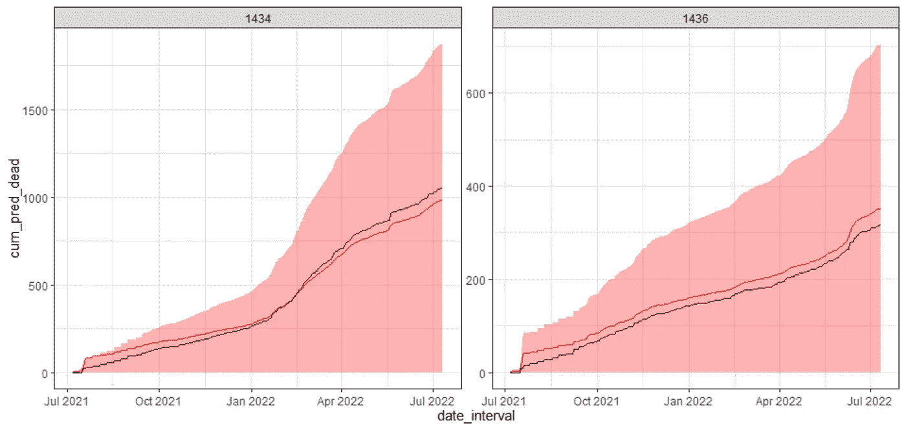

但是均值预测更好。置信区间仍然很大，就像以前的模型一样大，但是现在线更近了。

我暂时就说到这里。我可以使用最大内部温度和实际外部温度的级别摘要，但我还必须进行全面的交叉验证和滚动时间窗口。

建模并不容易，需要做很多工作。我所做的是一个如何模拟死亡率的练习，它似乎有一些优点，但它肯定不是万无一失的。简而言之，这就是建模。

希望你喜欢它！

如果有什么不对劲，请告诉我！