# 矩母函数教程

> 原文：<https://pub.towardsai.net/moment-generating-function-for-probability-distribution-with-python-tutorial-34857e93d8f6?source=collection_archive---------0----------------------->

来源:[像素](https://www.pexels.com/@thisisengineering)

## [数据科学](https://towardsai.net/p/category/data-science)，[编辑](https://towardsai.net/p/category/editorial)，[机器学习](https://towardsai.net/p/category/machine-learning)，[编程](https://towardsai.net/p/category/programming)，[统计](https://towardsai.net/p/category/statistics)

## 深入研究概率分布的矩生成函数的教程，包含完整的推导和 Python 代码示例

**作者:**普拉蒂克·舒克拉，[罗伯特·伊里翁多](https://mktg.best/vguzs)

最后更新，2021 年 1 月 8 日

 [## 加入我们吧↓ |面向人工智能成员|数据驱动的社区

### 加入人工智能，成为会员，你将不仅支持人工智能，但你将有机会…

members.towardsai.net](https://members.towardsai.net/) 

**本教程的代码可在**[**Github**](https://github.com/towardsai/tutorials/tree/master/moment_generating_function)**上获得，其完整实现也可在**[**Google Colab**](https://colab.research.google.com/drive/1Qwans3PpDi1I37EaG_vSqqtIZn8UMjl0?usp=sharing)**上获得。**

## 目录:

1.  统计学瞬间。
2.  原始时刻。
3.  居中的时刻。
4.  标准化时刻。
5.  力矩生成函数。
6.  矩母函数的证明。
7.  原始矩和中心矩之间关系的推导。
8.  Python 实现。

> 📚查看我们对[最佳机器学习书籍](https://towardsai.net/p/machine-learning/best-machine-learning-books-free-and-paid-ml-book-recommendations-40c9ab30b0c)的编辑建议。📚

# 统计学中的矩是什么？

我们一般用统计中的矩、 [**、机器学习**](https://mld.ai/mldcmu) 、数学等领域来描述一个分布的特征。

假设我们感兴趣的变量是 X，那么矩就是 X 的期望值。比如 E(X)，E(X)，E(X)，E(X⁴),…等等。

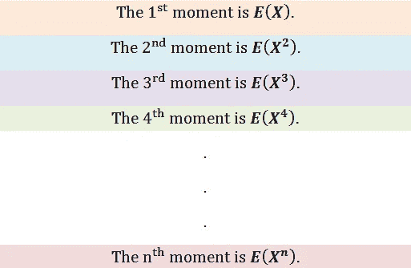

图 1:统计中的矩。

# 统计学中的矩:

**1)一阶矩:**中心位置的度量。

**2)二阶矩:**离差/扩散的度量。

**3)三阶矩:**不对称的度量。

**4)四阶矩:**离群值/尾数的度量。

现在我们非常熟悉一阶矩(均值)和二阶矩(方差)。三阶矩称为偏度，四阶矩称为峰度。第三个矩测量分布的不对称性，而第四个矩测量尾部值有多重。物理学家通常在物理应用中使用高阶矩。让我们来看看第三和第四个时刻的可视化。

# 三阶矩(偏斜度):

**1)无歪斜:**

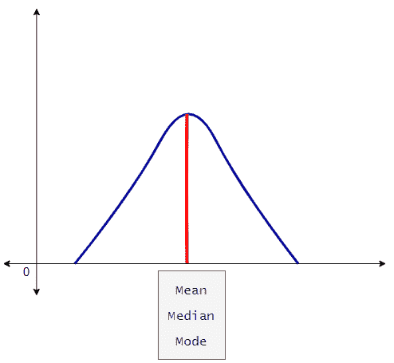

图 2:没有偏斜的图表数据。

**2)正偏斜:**

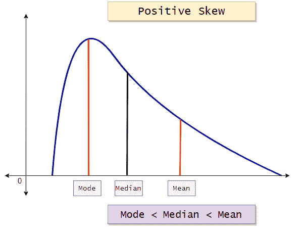

图 3:正偏斜的数据图。

**3)负偏斜:**

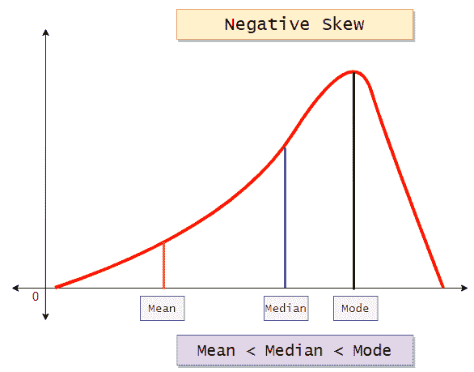

图 4:具有负偏斜的数据图表。

# 四阶矩(峰度):

图 5:表示峰度类型的图表。

我们将在下一篇描述性统计教程中详细研究这些时刻。在本教程中，我们将学习矩母函数(MGF)。在此之前，让我们看看力矩的公式。

# 原始时刻:

在下面的公式中，“A”是任意变量。通常，在计算原始矩时，我们取 A=0。

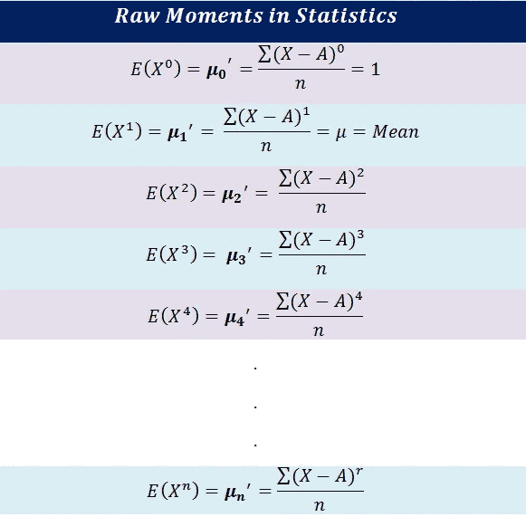

图 6:原始矩的公式。

# 居中力矩:

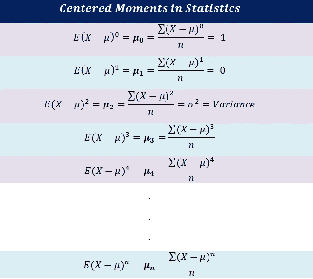

图 7:居中力矩的公式。

# 标准化时刻:

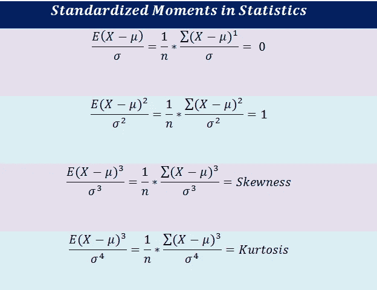

图 8:标准化矩的公式。

# 什么是矩母函数(MGF)？

顾名思义，矩母函数就是生成矩的函数——E(X)，E(X)，e(x)，E(X⁴)，…，E(X^n).

**让我们来看看 MGF 的定义:**

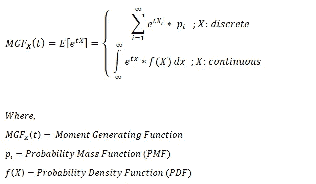

图 9:力矩生成函数的定义。

现在请注意，在矩母函数的公式中有 E[e^tx，而我们感兴趣的是寻找 E[X^n].的值

取 E[e^tx 的 n 阶导数]并代入 t=0，我们将得到 E[X^n].

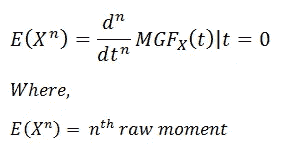

图 10:求矩母函数的 n 阶导数。

**a)寻找第一个原始时刻:**

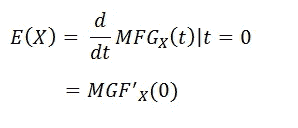

图 11:力矩生成函数的一阶导数。

**b)寻找第二个原始时刻:**

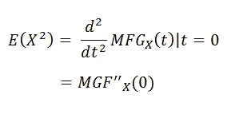

图 12:力矩生成函数的二阶导数。

# 证明:MGF 的 n 阶导数是 n 阶矩

这里我们就用[泰勒级数](https://en.wikipedia.org/wiki/Taylor_series)来证明。

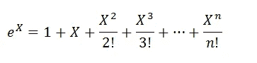

图 13:用泰勒级数展开 e^x。

由此，我们可以说，

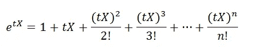

图 14:用泰勒级数展开 e^tx。

**求 e^tx:的期望值**

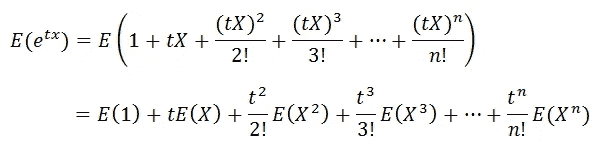

图 15:e^tx.的期望值

现在让我们证明 E(e^tx 的 n 阶导数)是 n 阶矩。

**a)求一阶导数:**

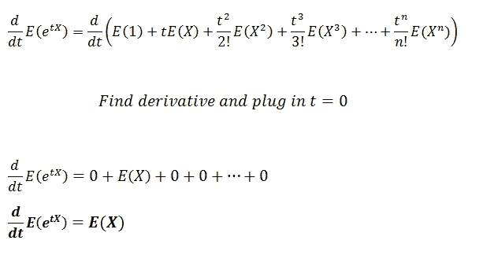

图 16:获取力矩生成函数的一阶导数。

这里我们可以看到它给了我们第一个瞬间。

**b)求二阶导数:**

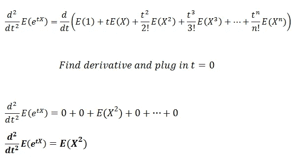

图 17:获取力矩生成函数的二阶导数。

这里我们可以看到它给了我们第二个瞬间。

**从这两个推导，我们可以很有信心地说，矩母函数的 n 阶导数就是 n 阶矩。**

# “t”在矩母函数中的作用是什么？

从上面的推导中，我们可以看到变量“t”作为一个辅助变量工作。通过使用“t”，我们可以在矩母函数中找到不同的导数。

# 我们为什么需要 MGF？

在连续概率分布的情况下，我们必须对概率密度函数(PDF)进行积分，以找到分布的矩。此外，事实证明，寻找积分会增加算法的复杂性，并增加程序的运行时间。作为替代，我们使用矩母函数和它们的导数来寻找矩。请注意，我们可以在不使用矩母函数的情况下获得矩，但随着我们进一步计算高阶矩，这变得复杂。

# 原始矩和中心矩之间的关系:

在这一点上，我们知道，

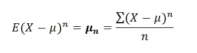

图 18:第 n 个居中的力矩。

现在我们将找到中心矩和原始矩之间的关系。

**a)用不同的形式写出公式:**

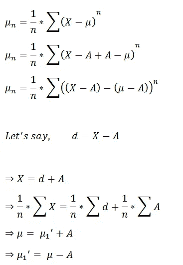

图 19:修改 n 次中心矩公式。

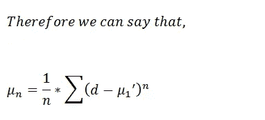

图 20:不同形式的 n 次居中力矩。

**b)利用** [**二项式定理**](https://en.wikipedia.org/wiki/Binomial_theorem) **:** 展开主项

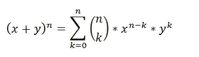

图 21:二项式定理。

**c)扩展我们的主要术语:**

图 22:使用二项式定理展开。

**d)将该内容放入主公式:**

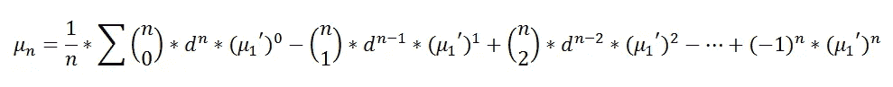

图 23:将扩展项放入主公式。

**e)使用原始力矩的定义简化术语:**

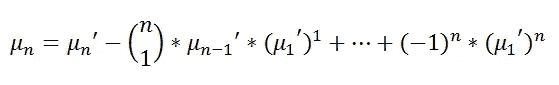

图 24:根据原始力矩的居中力矩。

用简单的形式写出公式:

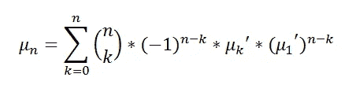

图 25:以原始力矩表示的中心力矩。

瞧啊。我们已经推导出了公式来找出原始矩和中心矩之间的关系。现在让我们找出它们之间的关系。

**a)根据原始矩的第一中心矩:**

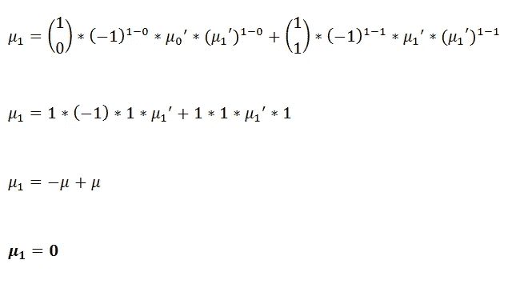

图 26:根据原始矩的第一个中心矩。

**2)根据原始矩的第二中心矩:**

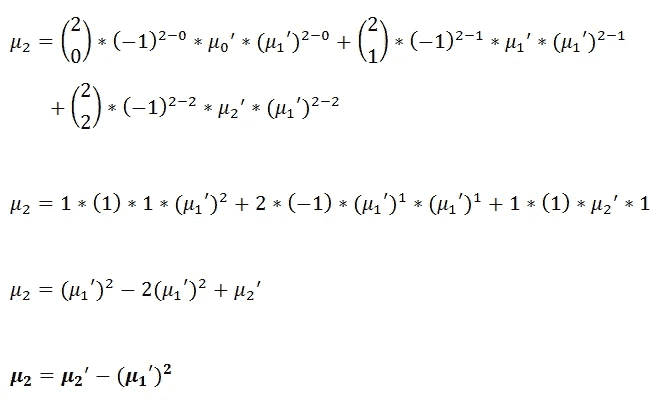

图 27:根据原始矩的第二中心矩。

**3)根据原始矩的第三中心矩:**

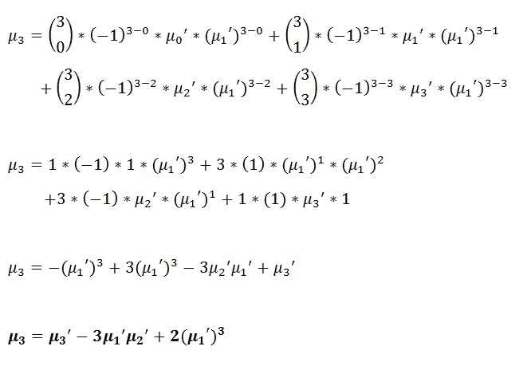

图 28:根据原始矩的第三中心矩。

**4)根据原始矩的第四中心矩:**

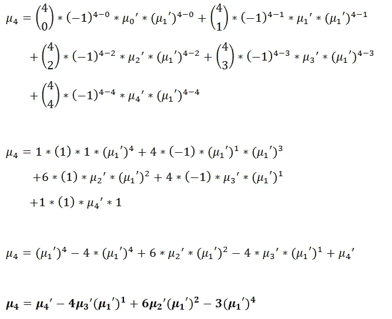

图 29:根据原始矩的第四中心矩。

**综上所述，**

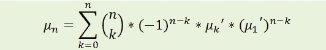

图 30:根据原始力矩的居中力矩。

图 31:中心矩和原始矩之间关系的总结。

请注意，我们是通过矩母函数(MGF)寻找矩时得到原始矩的。我们可以使用上面导出的公式从原始矩中找出中心矩。利用中心矩，我们可以很容易地找到标准化矩。我们将在未来的概率分布教程中使用这些公式。

# Python 实现:

使用 Python，我们可以找到数据集的中心矩。让我们来看几个例子。

**1)一维数据:**

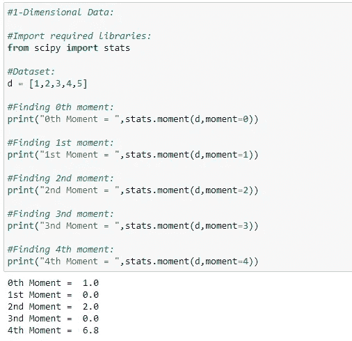

图 32:寻找一维数据的矩。

**2)二维数据:**

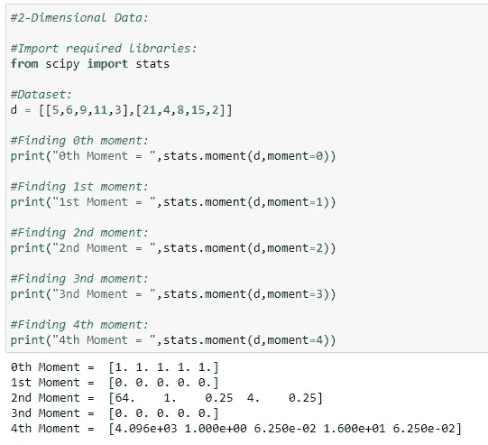

图 33:寻找二维数据的矩。

**3)轴=1 的二维数据:**

图 34:寻找轴=1 的二维数据的矩。

**4)多维数据:**

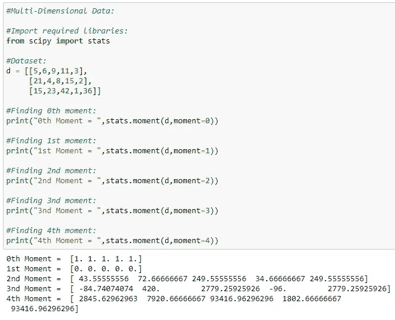

图 35:寻找多维数据的矩。

**5)高阶矩:**

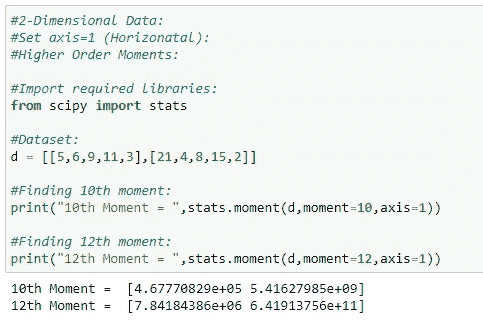

图 36:寻找高阶矩。

## 关键点:

1.  对于任何有效的矩母函数，我们可以说 0 阶矩等于 1。
2.  用矩母函数求导数，给了我们原始的矩。
3.  一旦我们有了概率分布的 MGF，我们就可以很容易地求出 n 阶矩。
4.  每个概率分布都有一个独特的矩母函数。
5.  不使用矩母函数也能找到矩，但使用 MGF 降低了时间和空间复杂度。

在以后的文章中，我们将看到每个概率分布及其矩母函数的细节。我们将在那些教程中使用从这篇文章中得到的公式。**任何建议或反馈对持续改进都至关重要。如果你有任何问题，请在评论中告诉我们。**

给普拉蒂克买杯咖啡！

**免责声明:**本文所表达的观点为作者个人观点，不代表卡内基梅隆大学的观点。这些文章并不打算成为最终产品，而是当前思想的反映，同时也是讨论和改进的催化剂。

通过[向 AI](https://towardsai.net/) 发布

## 参考资料:

[1] scipy.stats.moment，scipy.org，[https://docs . scipy . org/doc/scipy/reference/generated/scipy . stats . moment . html](https://docs.scipy.org/doc/scipy/reference/generated/scipy.stats.moment.html)

[2]统计学中的矩:定义，例子，统计学如何，[https://www.statisticshowto.com/what-is-a-moment/](https://www.statisticshowto.com/what-is-a-moment/)

[3]力矩生成函数，维基百科，【https://en.wikipedia.org/wiki/Moment-generating_function 

[4]泰勒级数，维基百科，【https://en.wikipedia.org/wiki/Taylor_series 

[5]二项式定理，维基百科，[https://en.wikipedia.org/wiki/Binomial_theorem](https://en.wikipedia.org/wiki/Binomial_theorem)