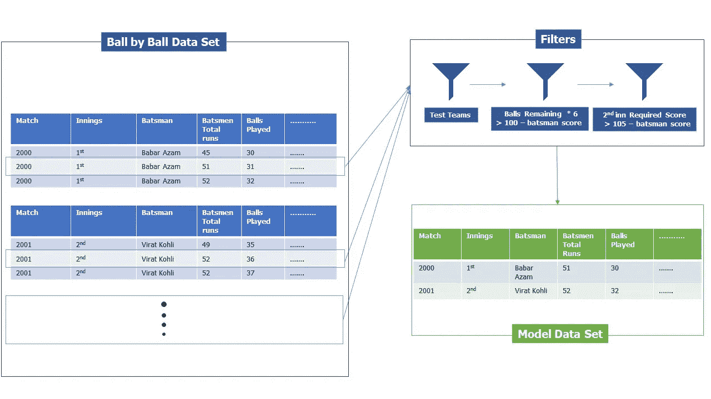
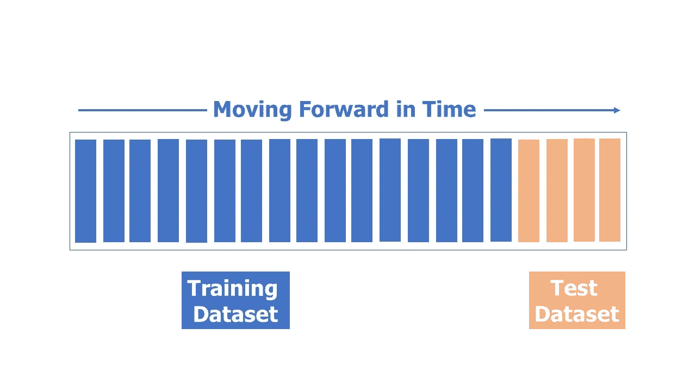
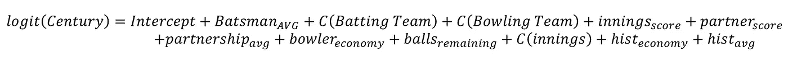
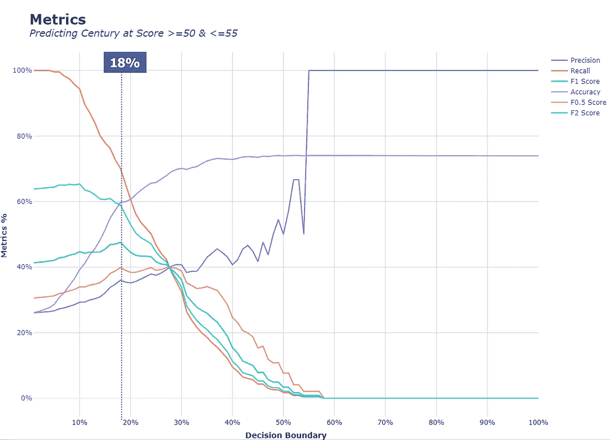
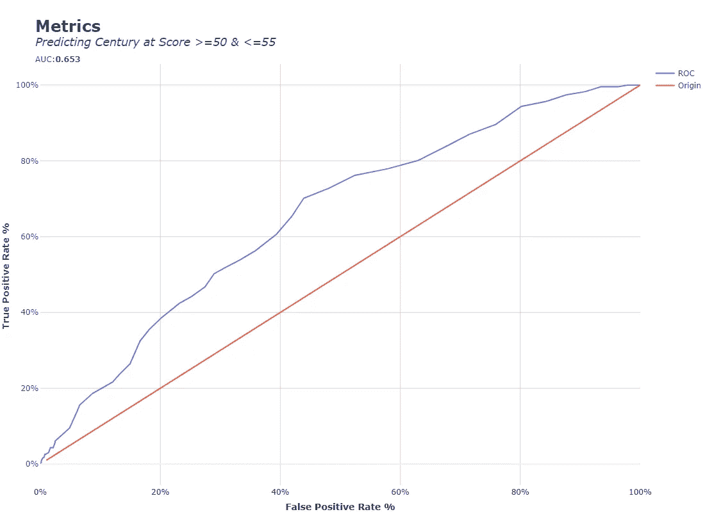

# 板球摇钱树:预测世纪——基础模型

> 原文：<https://pub.towardsai.net/moneyballing-cricket-predicting-centuries-base-model-d23a4c3ec0cd?source=collection_archive---------1----------------------->

## 数据准备&板球世纪二元分类建模

图片来自 [Pexel](https://www.pexels.com/photo/brown-wooden-stick-on-green-grass-9420724/) 。图片由[马哈福祖尔·拉赫曼](https://www.pexels.com/@mahafuzur-rahman-102047458/)提供

世纪是板球的一个著名事件，通常由击球手赢得比赛。作为一个统计爱好者，建模似乎是一个很大的问题，因为它不仅非常有趣，而且这个问题的新颖性也使它具有挑战性。这篇文章解释了我准备数据的原因，我使用的模型和评估标准。

# 数据

在开始之前，先了解一些关于数据源和验证的信息。

1.  **数据来源:**所有数据均来源于[cricsheet.org](https://cricsheet.org/)。他们提供 ODI、t20 和测试赛的详细数据。我并不拥有这些数据，但是在开放数据共享归属许可下，可以获得抄袭的数据。在本许可证下，每个人都可以自由地使用、构建和再分发数据，并赋予其适当的所有权。点击阅读关于许可[的信息。](https://cricsheet.org/register/)
2.  **数据验证:**CRIC sheet 的创始人在验证数据源方面做得很好，误差极小。我使用汇总数据验证了这些数据，并将其与 ESPNcricinfo 等主要板球网站上的汇总数据进行了比较。
3.  **数据维度&时间:**数据集包含 2050 个 ODI 匹配，从 2004 年 1 月 3 日开始到 2022 年 7 月 7 日。几乎囊括了期间所有主要的男性 ODI 玩法。数据集包含打了 **1，087，793** 球，&35，357 击球手敲了& **4，002** 局。

在以前的帖子中，我做了一个世纪的概率分析，一个关键的发现是，在没有任何其他条件的情况下，击球手击球导致一个世纪的经验估计概率只有 3.16%。这很重要，因为当对一个分类问题建模时，类的普遍性可能是决定你的模型有效性的最关键的因素。低级别的流行通常意味着模型在准确性、精确度和召回率等指标上的性能会很低。简而言之，如果你在比赛开始时预测一个世纪，这将是很难预测的，你需要以某种方式克服这一点，以获得任何有意义的结果。

 [## 金钱球板球——使用重复条件反射的概率为 100

### 板球得分≥ 100 分的概率分析

towardsdatascience.com](https://towardsdatascience.com/money-balling-cricket-probability-of-100-using-repeated-conditioning-2fc8dbceb42e) 

# 简化问题

任何用比赛开始时采样的数据训练的模型都不太可能有预测能力，为了减轻这个问题，我需要简化这个问题。如果有人在模型预测的中点预测几个世纪，比如击球手**达到 50-55 分的阈值**，他们会得到更好的结果。

另一个要做的简化是排除一个世纪不可能的数据点；**当剩余的球数不允许一个世纪没有自由安打时，**和第二局当要求获胜的**总数低于一个世纪的要求得分时**。这将减少我们数据中的噪音。最后一个简化是排除不打板球测试赛的队伍，我这样做是因为这些队伍与主要队伍相比样本很少。

所有这些简化可能看起来像欺骗，但是当你建模时，首先做你能做的最简单的事情，然后去除一些限制以获得一系列更“完整”的模型。

# 数据准备

数据准备说明。作者图片

从 cricsheet 中提取的原始数据集是一个球接一个球的，这是我设计我们的模型的方式，它将在击球手跑过 50 分时捕捉他们的击球局快照。采取以下步骤为建模做准备。

1.  识别比赛中击球手第一次在一局中超过 50 分门槛的行或实例。
2.  这些然后通过一系列过滤器。
3.  第一个过滤器检查击球队和保龄球队是否都是测试队。
4.  考虑到剩余的球数，第二个过滤器确保一个世纪仍然是可能的。
5.  第三个过滤器删除击球手无法完成他们的世纪的行，如果目标分数不允许一个，它只适用于第二局。

在这些快照中，击球手的所有历史数据(直到当前比赛的当前球)被汇总。对于击球手来说，他们相对于他们所击球的球队的历史平均值，对于保龄球队来说，计算相对于同一球队的经济的历史平均值(每球得分)、每门得分等。在没有历史记录的情况下，他们在问题局之前被估算了一个整体团队历史 KPI。此外，合作伙伴统计数据，如当前合作伙伴的总跑步次数和合作伙伴的分数，也被添加到数据集中。

这些历史 KPI 对于建立信息模型很重要，但是包含它们会带来目标泄漏的风险。当你在一个数据集上训练你的算法时，这种情况就会发生，这个数据集包括在预测时不可用的**信息。在我们的例子中，如果我在训练数据集中包含在测试数据集中匹配之后发生的匹配的历史 KPI，就会发生这种情况。为了防止这种情况发生，数据必须按照比赛中打球的时间进行排序，只有前 80%的数据用于训练，其余 20%的数据放入测试数据集中。**

测试列车分离。作者图片

# 基础模型

对于我的初始模型，我选择了二元 Logit 模型，也称为逻辑回归。选择该模型的原因如下:

1.  **可解释性** : 神经网络等复杂的建模技术可能会在性能指标上表现得更好，但这是以可解释性为代价的。逻辑回归很容易解释，它通常能让我们深入了解自变量是如何影响因变量的。
2.  **调试:**在大多数建模练习中，你经常要调试你的数据&模型。在简单的模型中，离群值和混杂效应更容易识别。这可以帮助您清理数据或进行更好的特征工程。

模型方程，C()表示变量是分类的。作者图片

***注*** : *历史经济是保龄球队整体对击球队的历史经济，到那场比赛为止&历史平均是击球手对同一保龄球队的历史平均水平。如果击球队&保龄球队之间没有历史，则两者都被估算为历史总平均/经济。*

**有一个数据科学问题，需要专家来解决？考虑招聘** [**我**](https://www.upwork.com/ab/flservices/workwith/naivebayesian) **！**

# 模型评估

该模型是在一系列度量标准的测试数据集上进行评估的，这些度量标准会随着您更改模型的决策边界而更改。Logit 模型预测事件发生的概率，由建模者选择用于将事件分类为一个世纪或不是一个世纪的截止阈值。

默认情况下，决策边界设置为 0.5(大于 0.5 的预测概率为 1，否则为 0)，但在大多数情况下，当存在巨大的阶级不平衡时，这是失败的。一个类比另一个类更普遍，因此要克服这一点，您需要改变决策边界。

以下是用于评估我们模型的所有指标的直观解释:

> **精度**:
> 
> 公式—(True _ positive)/(True _ positive+False _ positive)。
> 
> 直觉:最大化精确度意味着你在你的预测中不包括任何假阳性，你只包括那些极有可能是真阳性的预测。这直观地意味着您的预测将包括许多假阴性，但很少或没有假阳性。
> 
> **回忆**:
> 
> 公式—(真 _ 正)/(真 _ 正+假 _ 负)。
> 
> 直觉:最大化回忆意味着你捕捉到所有真实的积极事件，不包括任何错误的消极事件。这意味着你可以容忍假阳性，但不能容忍假阴性。在精确度和召回率之间有一个折衷。
> 
> **F1 比分**:
> 
> Formula — 2*(精度*召回)/(精度+召回)。
> 
> 直觉:F1 分数是精确度和回忆的调和平均值。最大化 f1 分数是你在精确度和召回率之间达到“中点”的地方。在这里你可以同等地仔细检查假阴性和假阳性。
> 
> **F-beta 评分**:
> 
> 公式— (1+Beta)(精度*召回)/((Beta)精度+召回)。
> 
> 直觉:与 F1 分数类似，F-beta 分数也试图在精确度和召回率之间达到“共识点”,但是 beta 值使共识偏向精确度或召回率。大于 1 的 beta 值意味着偏向于召回&小于 1 的 beta 值意味着偏向于精确。

模型度量图。虚线是 f1 分数最大化的决策边界。图片由作者提供。

上面的曲线显示了当模型的决策边界改变时，模型指标是如何变化的。最大化哪个指标纯粹是你想如何使用模型的问题。例如，在体育博彩中，如果你想对一个赢得一百分的玩家下大注，你会非常确定你的预测是一个真正的正数，所以你可能想优化模型的精度或低于 1 beta 值的 f beta 分数。

在大多数情况下，人们会希望选择一个点来平等地惩罚假阳性和假阴性，所以 f1 的分数最有意义。F1 分数在 18%的阈值处最大化，该模型的 f1 分数为 48%，准确率为 60%，召回率为 70%。这意味着该模型捕获了 70%的真阳性，但 38%的精度很低。对这个基础模型的任何改进都应该使它的预测更加精确！

这些是用于找到最佳决策边界的指标，现在，让我们从整体上评估该模型。为此，我使用了受试者工作特征(ROC)曲线的曲线下面积(AUC)。

ROC 曲线。图片由作者提供。

> ***【直觉(ROC)****:*ROC 曲线显示真阳性率(TPR) &假阳性率(FPR)的关系。真正的阳性率和回忆是一样的。ROC 告诉我们这两者是如何变化的，记住要捕捉更多的真阳性，你也必须容忍更多的假阳性。原点线是两个 TPR & FPR 相等的地方，对于所有决策边界，TPR = FPR 的模型纯粹是进行随机预测。
> 
> ***直觉(AUC):*** 曲线下的面积是我们模型整体表现的一个度量。AUC 范围从 0 到 1，0 没有预测能力，1 表示完全预测能力& 0.5 表示完全随机预测能力(不比掷硬币好)。
> 
> 原点线与 x 轴形成一个三角形，长度和高度= 1。这意味着它的 AUC 为 0.5(三角形的面积= 0.5 *高*长)。我们模型的 ROC 曲线的 AUC 为 0.653，**，这意味着它比随机模型好得多！**

我们的模型可以通过两种方式进行改进，使用更复杂的算法或尝试以 50-55 次运行之外的阈值预测几个世纪！

感谢您的阅读！我将在下一篇关于这个主题的文章中探讨不同的评分阈值和不同的、更复杂的模型。敬请期待！

想了解更多关于 cricket 的统计建模，请查看以下内容:

 [## 金钱球板球——统计评估比赛

### 使用描述性统计评估运动员的表现

medium.com](https://medium.com/mlearning-ai/money-balling-cricket-statistically-evaluating-a-match-9cda986d015e)  [## 钱球板球:平均巴巴尔阿扎姆的运行

### 电影《金钱球》(2011)中的一个关键元素是比利·比恩(布拉德·皮特)和彼得·布兰德(乔纳·希尔)…

arslanshahid-1997.medium.com](https://arslanshahid-1997.medium.com/money-balling-cricket-averaging-babar-azams-runs-adb8de62d65b) 

或者你想要不同的东西:

 [## 谎言，弥天大谎，数据科学？

### 我敢肯定，围绕数据科学、机器学习和人工智能的所有宣传，你已经…

medium.com](https://medium.com/mlearning-ai/lies-big-lies-and-data-science-6147e81fb9fc) 

请在 M [edium](https://arslanshahid-1997.medium.com/) 、 [Twitter、](https://twitter.com/naivebaesian)和 [Linkedin](https://www.linkedin.com/in/arslan-shahid1997/) 上关注我。不要忘记点击电子邮件图标，这样你就可以收到我的帖子的电子邮件。