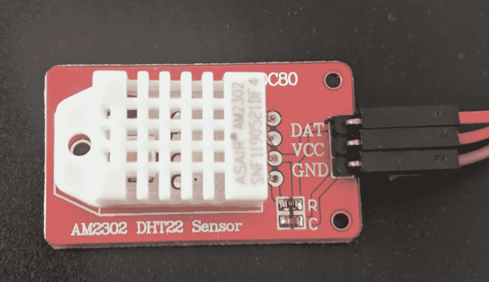
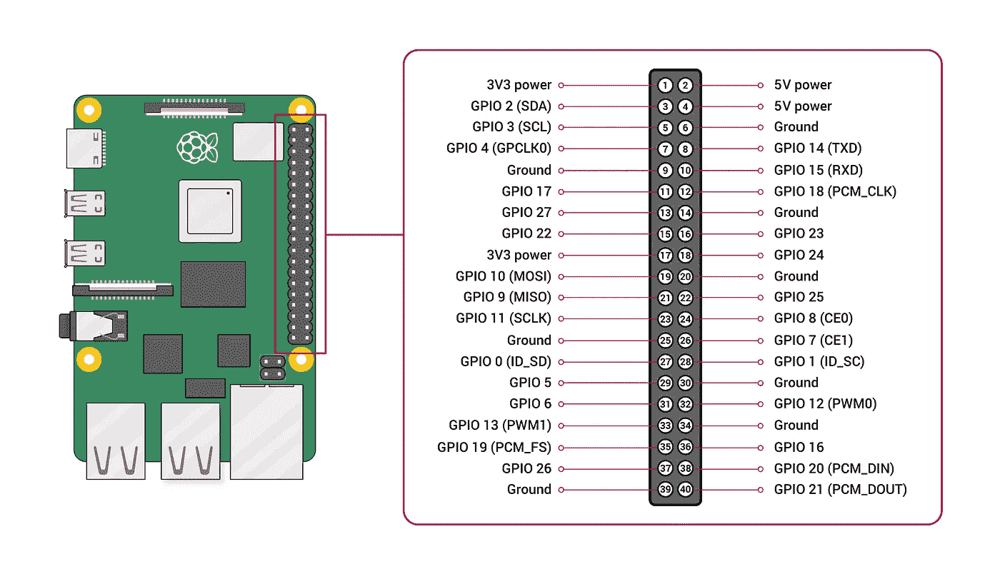
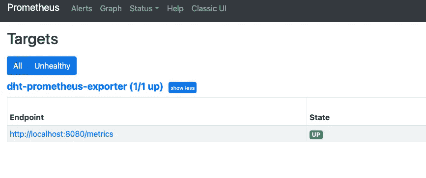
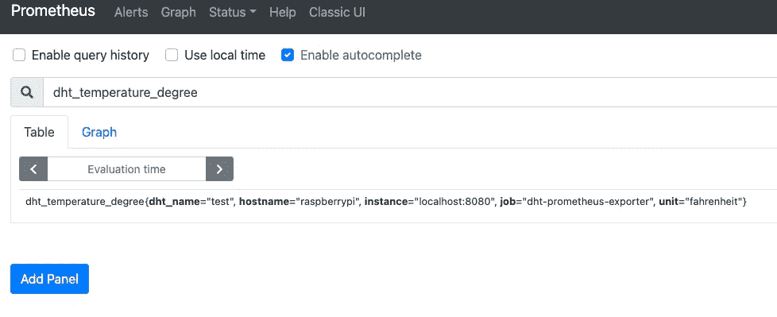
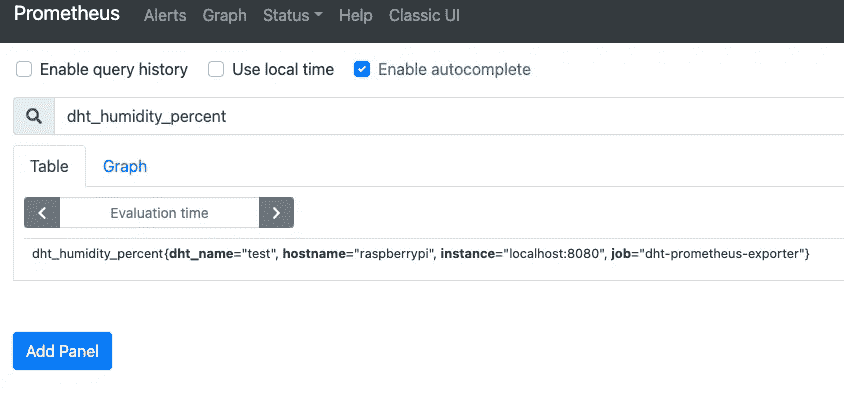
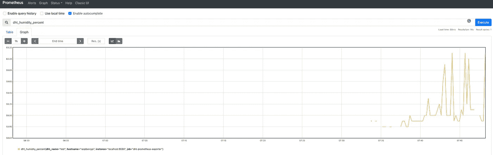
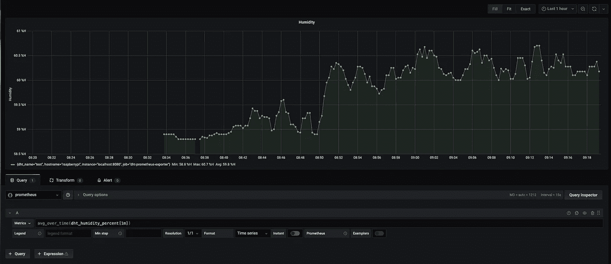
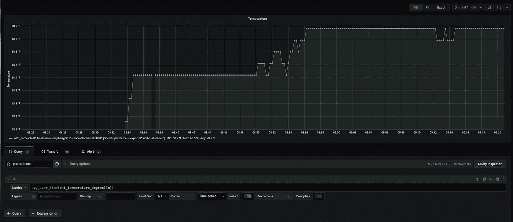
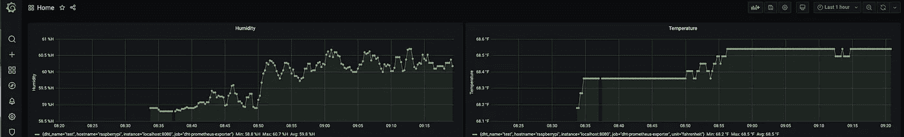

# 如何构建 DHT22/AM2302 传感器的 Prometheus Exporter

> 原文：<https://pub.towardsai.net/monitor-home-temperature-and-humidity-with-a-raspberry-pi-and-prometheus-e863c62b6219?source=collection_archive---------2----------------------->

## 用树莓皮 DIY 你家的温度和湿度


照片由[Praveen Thirumurugan](https://unsplash.com/@praveentcom?utm_source=ghost&utm_medium=referral&utm_campaign=api-credit)/[Unsplash](https://unsplash.com/?utm_source=ghost&utm_medium=referral&utm_campaign=api-credit)拍摄

Prometheus 是一个用于监控和警告指标的开源项目。它依赖于非常适合物联网用途的时序数据库。在本文中，我们将了解如何从树莓 Pi 中收集温度和湿度。这些指标是从 DHT22/AM2302 传感器收集的。我们将了解如何将传感器连接到卡上，并确认数据采集。

下一步是在 Golang 实施一个 Prometheus 出口商。导出器通过格式良好的 HTTP 服务器公开指标。Prometheus 服务器调用导出器来收集和存储指标。普罗米修斯本身是用 Golang 编写的，我们的出口商将使用相同的库。

一旦在普罗米修斯度量，我们配置一个美丽的 Grafana 仪表板。

# 传感器配置

## 介绍会；展示会

AM2302 是 DHT22 传感器的有线版本。[数据表](https://learn.adafruit.com/dht)呈现以下特征:

*   低成本
*   3v 至 5v 电源和 I/O
*   转换期间(请求数据时)最大电流为 2.5 mA
*   适用于 0–100%湿度读数，精确度为 2–5%
*   适用于-40 至 80°C 的温度读数，精度为 0.5°C
*   采样率不超过 0.5 Hz(每 2 秒一次)
*   机身尺寸 15.1 毫米 x 25mm 毫米 x 7.7mm 毫米
*   4 个间距为 0.1 英寸的引脚



AM2302/DHT22 传感器

## 关系

传感器是即插即用的，它连接到 Raspberry Pi 的方式如下:

*   GPIO 引脚上的 DAT(GPIO 3)
*   3v 和 5v 之间的营养引脚上的 VCC(引脚 1)
*   GCC 接地引脚(引脚 6)



来自 https://www.raspberrypi.org/documentation/usage/gpio/[的树莓 pin 模式](https://www.raspberrypi.org/documentation/usage/gpio/)

## 数据采集

更新可用软件包列表并安装`python3`和`pip`:

```
$ sudo apt-get update
$ sudo apt-get install python3 python3-pip
$ python3 -m pip install --upgrade pip
```

安装`Adafruit-DHT` pip 包:

```
$ python3 -m pip install Adafruit-DHT
```

使脚本可执行并启动它:

```
$ chmod +x am2302_tester.py
$ python3 am2302_tester.py
Temp=19.2*C  Humidity=55.0%
```

传感器可以很好地收集湿度和温度指标。

# 普罗米修斯出口商

## 配置

该配置是一个 YAML 文件，其位置与优先级不同:

*   `/etc/dht-prometheus-exporter.yml`
*   `$HOME/dht-prometheus-exporter.yml`
*   `$PWD/dht-prometheus-exporter.yml`

viper 包管理配置文件并将值存储到一个结构中。项目的其他部分可以访问重复出现的信息。

## 记录

logrus 包管理日志记录并重用配置中定义的级别:

## 传感器

go-dht 包与传感器接口。它已经具有从 gpio 引脚读取数据的功能。结构包含收集的指标:

## 普罗米修斯收集器

普罗米修斯包装提供了收集器。它列出了收集和公开它们的不同指标。湿度和温度指标在同一个收集器中。指标有标签来提供更多的上下文:

*   *dht_name* :易于识别的传感器名称(多传感器时)
*   *主机名*
*   *单位*:温度单位为华氏度或摄氏度

`Describe`和`Collector`功能已经在 Prometheus 包中实现。我们需要重新定义它们，以便用我们的指标来重载这些功能:

## 主要的

主文件粘合了前一个文件的函数。它创建了负责从 gpio 引脚读取数据的客户端。然后，它用这个客户机实例化收集器并注册它。最后，它用日志配置 promhttp 服务器并启动它。这些指标可通过`/metrics`路径获得:

启动后，二进制文件会根据请求显示收集的指标:

```
$ pi@raspberrypi:~/go/src/github.com/guivin/dht-prometheus-exporter $ ./dht-exporter
time="2021-02-17T20:19:20Z" level=info msg="Initializing the DHT22/AM2302 sensor on the host"
time="2021-02-17T20:19:20Z" level=info msg="Starting http server on TCP/8080 port"
time="2021-02-17T20:19:36Z" level=info msg="Retrieved humidity=62.70%, temperature=68.90°F from the sensor"
```

该请求是在 TCP/8080 端口上完成的:

```
# HELP dht_humidity_percent Humidity percent measured by the sensor
# TYPE dht_humidity_percent counter
dht_humidity_percent{dht_name="test",hostname="raspberrypi"} 62.8
# HELP dht_temperature_degree Temperature degree measured by the sensor
# TYPE dht_temperature_degree counter
dht_temperature_degree{dht_name="test",hostname="raspberrypi",unit="fahrenheit"} 68.9
# HELP go_gc_duration_seconds A summary of the GC invocation durations.
# TYPE go_gc_duration_seconds summary
go_gc_duration_seconds{quantile="0"} 0
go_gc_duration_seconds{quantile="0.25"} 0
go_gc_duration_seconds{quantile="0.5"} 0
go_gc_duration_seconds{quantile="0.75"} 0
go_gc_duration_seconds{quantile="1"} 0
go_gc_duration_seconds_sum 0
go_gc_duration_seconds_count 0
# HELP go_goroutines Number of goroutines that currently exist.
# TYPE go_goroutines gauge
go_goroutines 12
# HELP go_info Information about the Go environment.
# TYPE go_info gauge
go_info{version="go1.11.6"} 1
# HELP go_memstats_alloc_bytes Number of bytes allocated and still in use.
# TYPE go_memstats_alloc_bytes gauge
go_memstats_alloc_bytes 1.798512e+06
# HELP go_memstats_alloc_bytes_total Total number of bytes allocated, even if freed.
# TYPE go_memstats_alloc_bytes_total counter
go_memstats_alloc_bytes_total 1.798512e+06
# HELP go_memstats_buck_hash_sys_bytes Number of bytes used by the profiling bucket hash table.
# TYPE go_memstats_buck_hash_sys_bytes gauge
go_memstats_buck_hash_sys_bytes 724468
# HELP go_memstats_frees_total Total number of frees.
# TYPE go_memstats_frees_total counter
go_memstats_frees_total 1026
# HELP go_memstats_gc_cpu_fraction The fraction of this program's available CPU time used by the GC since the program started.
# TYPE go_memstats_gc_cpu_fraction gauge
go_memstats_gc_cpu_fraction 0
# HELP go_memstats_gc_sys_bytes Number of bytes used for garbage collection system metadata.
# TYPE go_memstats_gc_sys_bytes gauge
go_memstats_gc_sys_bytes 334848
# HELP go_memstats_heap_alloc_bytes Number of heap bytes allocated and still in use.
# TYPE go_memstats_heap_alloc_bytes gauge
go_memstats_heap_alloc_bytes 1.798512e+06
# HELP go_memstats_heap_idle_bytes Number of heap bytes waiting to be used.
# TYPE go_memstats_heap_idle_bytes gauge
go_memstats_heap_idle_bytes 589824
# HELP go_memstats_heap_inuse_bytes Number of heap bytes that are in use.
# TYPE go_memstats_heap_inuse_bytes gauge
go_memstats_heap_inuse_bytes 3.11296e+06
# HELP go_memstats_heap_objects Number of allocated objects.
# TYPE go_memstats_heap_objects gauge
go_memstats_heap_objects 6257
# HELP go_memstats_heap_released_bytes Number of heap bytes released to OS.
# TYPE go_memstats_heap_released_bytes gauge
go_memstats_heap_released_bytes 0
# HELP go_memstats_heap_sys_bytes Number of heap bytes obtained from system.
# TYPE go_memstats_heap_sys_bytes gauge
go_memstats_heap_sys_bytes 3.702784e+06
# HELP go_memstats_last_gc_time_seconds Number of seconds since 1970 of last garbage collection.
# TYPE go_memstats_last_gc_time_seconds gauge
go_memstats_last_gc_time_seconds 0
# HELP go_memstats_lookups_total Total number of pointer lookups.
# TYPE go_memstats_lookups_total counter
go_memstats_lookups_total 0
# HELP go_memstats_mallocs_total Total number of mallocs.
# TYPE go_memstats_mallocs_total counter
go_memstats_mallocs_total 7283
# HELP go_memstats_mcache_inuse_bytes Number of bytes in use by mcache structures.
# TYPE go_memstats_mcache_inuse_bytes gauge
go_memstats_mcache_inuse_bytes 3456
# HELP go_memstats_mcache_sys_bytes Number of bytes used for mcache structures obtained from system.
# TYPE go_memstats_mcache_sys_bytes gauge
go_memstats_mcache_sys_bytes 16384
# HELP go_memstats_mspan_inuse_bytes Number of bytes in use by mspan structures.
# TYPE go_memstats_mspan_inuse_bytes gauge
go_memstats_mspan_inuse_bytes 22080
# HELP go_memstats_mspan_sys_bytes Number of bytes used for mspan structures obtained from system.
# TYPE go_memstats_mspan_sys_bytes gauge
go_memstats_mspan_sys_bytes 32768
# HELP go_memstats_next_gc_bytes Number of heap bytes when next garbage collection will take place.
# TYPE go_memstats_next_gc_bytes gauge
go_memstats_next_gc_bytes 4.473924e+06
# HELP go_memstats_other_sys_bytes Number of bytes used for other system allocations.
# TYPE go_memstats_other_sys_bytes gauge
go_memstats_other_sys_bytes 1.315464e+06
# HELP go_memstats_stack_inuse_bytes Number of bytes in use by the stack allocator.
# TYPE go_memstats_stack_inuse_bytes gauge
go_memstats_stack_inuse_bytes 491520
# HELP go_memstats_stack_sys_bytes Number of bytes obtained from system for stack allocator.
# TYPE go_memstats_stack_sys_bytes gauge
go_memstats_stack_sys_bytes 491520
# HELP go_memstats_sys_bytes Number of bytes obtained from system.
# TYPE go_memstats_sys_bytes gauge
go_memstats_sys_bytes 6.618236e+06
# HELP go_threads Number of OS threads created.
# TYPE go_threads gauge
go_threads 9
# HELP process_cpu_seconds_total Total user and system CPU time spent in seconds.
# TYPE process_cpu_seconds_total counter
process_cpu_seconds_total 0.16
# HELP process_max_fds Maximum number of open file descriptors.
# TYPE process_max_fds gauge
process_max_fds 1024
# HELP process_open_fds Number of open file descriptors.
# TYPE process_open_fds gauge
process_open_fds 101
# HELP process_resident_memory_bytes Resident memory size in bytes.
# TYPE process_resident_memory_bytes gauge
process_resident_memory_bytes 1.0858496e+07
# HELP process_start_time_seconds Start time of the process since unix epoch in seconds.
# TYPE process_start_time_seconds gauge
process_start_time_seconds 1.61359321311e+09
# HELP process_virtual_memory_bytes Virtual memory size in bytes.
# TYPE process_virtual_memory_bytes gauge
process_virtual_memory_bytes 8.93046784e+08
# HELP process_virtual_memory_max_bytes Maximum amount of virtual memory available in bytes.
# TYPE process_virtual_memory_max_bytes gauge
process_virtual_memory_max_bytes 1.8446744073709552e+19
```

# 普罗米修斯出口装置

## 先决条件

安装`golang`和`make`来构建源代码:

```
$ sudo apt install golang make
```

为 Golang 定义环境变量:

```
$ export GOPATH=$HOME/go
$ export GOBIN=$GOPATH/bin
$ export PATH=$PATH:$GOBIN
```

下载`dep`包:

```
go get -u github.com/golang/dep/cmd/dep
```

## 建设

克隆 git 存储库并构建源代码:

```
$ go get -u [github.com/guivin/dht-prometheus-exporter.git](https://github.com/guivin/dht-prometheus-exporter.git)
$ cd $GOPATH/src/guivin/dht-prometheus-exporter
$ git checkout tags/v0.1
$ make all
```

## 部署

安装`systemd`维修单元:

```
$ sudo cp dht-prometheus-exporter.service /etc/systemd/system
```

部署配置文件:

```
$ sudo cp dht-prometheus-exporter.yml /etc
$ sudo chown dht-prometheus-exporter:dht-prometheus-exporter /etc/dht-prometheus-exporter.yml
$ sudo chmod 0640 /etc/dht-prometheus-exporter.yml
```

为导出者创建一个`dht-prometheus-exporter`系统用户和组。该系统用户也属于`gpio`作为读取 gpio 引脚的第二组:

```
$ sudo useradd --user-group --groups gpio --no-create-home --system --shell /usr/sbin/nologin dht-prometheus-exporter
```

启动`systemd`单元:

```
$ sudo systemctl daemon-reload
$ sudo systemctl start dht-prometheus-exporter
```

检查`systemd`单元的日志；

```
$ sudo journalctl -u dht-prometheus-exporter -f
Feb 18 07:14:25 raspberrypi dht-prometheus-exporter[4031]: time="2021-02-18T07:14:25Z" level=info msg="Initializing the DHT22/AM2302 sensor on the host"
Feb 18 07:14:25 raspberrypi dht-prometheus-exporter[4031]: time="2021-02-18T07:14:25Z" level=info msg="Starting http server on TCP/8080 port"
```

# 普罗米修斯

## 安装和配置

创建`prometheus`系统用户和组:

```
$ useradd --home-dir /opt/prometheus --user-group --shell /usr/sbin/nologin --system prometheus
```

下载`prometheus`二进制文件并根据您的 Raspberry Pi 架构进行调整(这里我们使用`armv7`):

```
$ cd /tmp
$ wget [https://github.com/prometheus/prometheus/releases/download/v2.25.0/prometheus-2.25.0.linux-armv7.tar.gz](https://github.com/prometheus/prometheus/releases/download/v2.25.0/prometheus-2.25.0.linux-armv7.tar.gz)
$ tar xzf [prometheus-2.25.0.linux-armv7.tar.gz](https://github.com/prometheus/prometheus/releases/download/v2.25.0/prometheus-2.25.0.linux-armv7.tar.gz)
```

在`/opt/prometheus`中为`prometheus`用户创建主目录:

```
$ sudo cp -r [prometheus-2.25.0.linux-armv7](https://github.com/prometheus/prometheus/releases/download/v2.25.0/prometheus-2.25.0.linux-armv7.tar.gz) /opt/prometheus
$ sudo chown prometheus:prometheus /opt/prometheus
$ sudo chmod 0740 -R /opt/prometheus
```

为`tsdb`(时序数据库)存储创建具有良好权限的`/var/lib/prometheus`目录:

```
$ sudo mkdir /var/lib/prometheus
$ sudo chown -R prometheus:prometheus /var/lib/prometheus
$ sudo chmod -R 0740 /var/lib/prometheus
```

从`/opt/prometheus`到`/etc`中的配置创建一个符号链接:

```
sudo ln -s /opt/prometheus/prometheus.yml /etc/prometheus.yml
```

更新`/etc/prometheus.yml`并在`scrape_configs`块中添加一个新任务:

```
- job_name: 'dht-prometheus-exporter'
  static_configs:
    - targets: ['localhost:8080']
```

在`/etc/systemd/system/prometheus.service`中为`prometheus`创建一个`systemd`单元，如下所示:

```
[Service]
Type=simple 
User=prometheus
Group=prometheus
ExecReload=/bin/kill -HUP $MAINPID
ExecStart=/opt/prometheus/prometheus \
  --config.file=/etc/prometheus/prometheus.yml \
  --storage.tsdb.path=/var/lib/prometheus \
  --storage.tsdb.retention.time=30d \
  --storage.tsdb.retention.size=0 \
  --web.console.libraries=/opt/prometheus/console_libraries \
  --web.console.templates=/opt/prometheus/consoles \
  --web.listen-address=0.0.0.0:9090 \
  --web.external-url=
SyslogIdentifier=prometheus
Restart=always[Install]
WantedBy=multi-user.target
```

启动并启用`prometheus`服务:

```
$ sudo systemctl daemon-reload
$ sudo systemctl start prometheus
$ sudo systemctl enable prometheus
```

确保`prometheus`正常:

```
sudo systemctl status prometheus --no-pager
● prometheus.service
   Loaded: loaded (/etc/systemd/system/prometheus.service; enabled; vendor preset: enabled)
   Active: active (running) since Thu 2021-02-18 07:37:18 GMT; 16min ago
 Main PID: 4348 (prometheus)
    Tasks: 9 (limit: 2062)
   CGroup: /system.slice/prometheus.service
           └─4348 /opt/prometheus/prometheus --config.file=/etc/prometheus/prometheus.yml --storage.tsdb.path=/var/lib/prometheus --storage.tsdb.retention.time=30d --storage.tsdb.retention.size=0 --web.console.libraries=/opt/prometheus/console_libraries --web.console.templates=/opt/prometheus/consoles --web.listen-address=0.0.0.0:9090 --web.external-url=Feb 18 07:37:18 raspberrypi prometheus[4348]: level=info ts=2021-02-18T07:37:18.614Z caller=head.go:682 component=tsdb msg="On-disk memory mappable chunks replay completed" duration=21.667µs
Feb 18 07:37:18 raspberrypi prometheus[4348]: level=info ts=2021-02-18T07:37:18.614Z caller=head.go:688 component=tsdb msg="Replaying WAL, this may take a while"
Feb 18 07:37:18 raspberrypi prometheus[4348]: level=info ts=2021-02-18T07:37:18.630Z caller=head.go:740 component=tsdb msg="WAL segment loaded" segment=0 maxSegment=1
Feb 18 07:37:18 raspberrypi prometheus[4348]: level=info ts=2021-02-18T07:37:18.632Z caller=head.go:740 component=tsdb msg="WAL segment loaded" segment=1 maxSegment=1
Feb 18 07:37:18 raspberrypi prometheus[4348]: level=info ts=2021-02-18T07:37:18.632Z caller=head.go:745 component=tsdb msg="WAL replay completed" checkpoint_replay_duration=372.29µs wal_replay_duration=17.413166ms total_replay_duration=18.029362ms
Feb 18 07:37:18 raspberrypi prometheus[4348]: level=info ts=2021-02-18T07:37:18.651Z caller=main.go:799 fs_type=EXT4_SUPER_MAGIC
Feb 18 07:37:18 raspberrypi prometheus[4348]: level=info ts=2021-02-18T07:37:18.652Z caller=main.go:802 msg="TSDB started"
Feb 18 07:37:18 raspberrypi prometheus[4348]: level=info ts=2021-02-18T07:37:18.652Z caller=main.go:928 msg="Loading configuration file" filename=/etc/prometheus/prometheus.yml
Feb 18 07:37:18 raspberrypi prometheus[4348]: level=info ts=2021-02-18T07:37:18.680Z caller=main.go:959 msg="Completed loading of configuration file" filename=/etc/prometheus/prometheus.yml totalDuration=27.748754ms remote_storage=11.666µs web_handler=3.281µs query_engine=5.104µs scrape=1.784837ms scrape_sd=278.332µs notify=7.552µs notify_sd=26.25µs rules=23.37…
Feb 18 07:37:18 raspberrypi prometheus[4348]: level=info ts=2021-02-18T07:37:18.682Z caller=main.go:751 msg="Server is ready to receive web requests."
Hint: Some lines were ellipsized, use -l to show in full.
```

## 网络界面

使用`ip a`命令记录您的 Raspberry Pi 私有 IP。打开浏览器，通过 TCP/8080 端口用 HTTP 模式连接到浏览器(例如[HTTP://<RASPBERRY _ IP>:8080](/<RASPBERRY_IP>:8080))。出口商在“目标”菜单中注册良好:



出口商在普罗米修斯目标公司注册良好，健康状况良好

在 Prometheus UI 的主页上，我们键入来自导出器的两个指标的名称。它们会出现并显示我们之前定义的标签:



带标签的 dht_temperature_degree 度量存在于 Prometheus 中



带标签的 dht _ 湿度 _ 百分比指标存在于 Prometheus 中

我们还可以有一个出口商指标的图表:



图表显示了普罗米修斯中 dht 湿度百分比指标的不同值

# 格拉夫纳

## 安装和配置

对于 Grafana，您可以遵循以下链接中的说明:

[](https://grafana.com/tutorials/install-grafana-on-raspberry-pi/#3) [## 在树莓墩上安装 Grafana

### Raspberry Pi 是一款小巧、经济、功能强大的电脑，可以运行一系列不同的应用程序。甚至…

grafana.com](https://grafana.com/tutorials/install-grafana-on-raspberry-pi/#3) 

## 仪表板创建

我们连接到 Grafana 界面并创建一个新的仪表板。在这个控制面板中，我们为每个指标添加了一个图表:温度和湿度。对于这两者，我们使用 avg_over_time 函数，向量为 1 分钟。这是为了避免不连续的图表:



格拉夫纳的湿度图



格拉夫纳的温度图



带有湿度和温度图表的仪表板

# 结论

通过这些不同的步骤，我们建立了一个带有传感器的监控系统。我们已经将传感器卡连接到 Raspberry Pi 并验证了数据采集。我们能够得到房间的温度和湿度。

为了让普罗米修斯获得这些指标，我们编写了一个导出器代码。它根据请求通过 HTTP 服务器公开指标。我们还在指标中添加了一些标签。这在您想要跟踪许多传感器并识别它们的情况下非常有用。

然后，我们在 Raspberry Pi 上安装并配置了 Prometheus。它抓取导出器并存储指标。在 Prometheus 用户界面上，我们注意到我们可以查询和利用这些指标。

使用 Prometheus 用户界面，我们能够根据指标创建图表。但是为了更进一步，我们安装了 Grafana 以提供更好的可视化体验。在 Grafana 中，我们创建了一个带有湿度和温度图表的仪表板。

这个项目提供了一个端到端的视图，展示了树莓派和普罗米修斯的可能性。我希望它给了你家庭自动化项目的灵感。感谢您的阅读，并期待看到您未来的成就！

为了支持我的工作并鼓励我写出更好的文章，你可以通过我的推荐链接订阅媒体会员。此外，你将解锁大量的内容和更有见识！

# 资源

[](https://learn.adafruit.com/dht) [## DHT11、DHT22 和 AM2302 传感器

### 本指南涵盖了低成本 DHT 温度和湿度传感器。这些传感器非常简单和缓慢，但非常棒…

learn.adafruit.com](https://learn.adafruit.com/dht) [](https://prometheus.io/docs/instrumenting/writing_exporters/) [## 写作出口商|普罗米修斯

### 如果您正在检测自己的代码，那么如何使用 Prometheus 客户端库检测代码的一般规则…

普罗米修斯](https://prometheus.io/docs/instrumenting/writing_exporters/) [](https://www.raspberrypi.org/documentation/usage/gpio/) [## GPIO

### Raspberry Pi 的一个强大功能是沿顶部边缘的一排 GPIO(通用输入/输出)引脚…

www.raspberrypi.org](https://www.raspberrypi.org/documentation/usage/gpio/) [](https://pypi.org/project/adafruit-io/) [## 阿达果木卫一

### 如果您已经安装了 PIP(通常在基于 Debian/Ubuntu 的系统上使用 apt-get 安装 python-pip ),那么运行:pip3…

pypi.org](https://pypi.org/project/adafruit-io/) [](https://github.com/prometheus/client_golang) [## 普罗米修斯/客户 _golang

### 这是普罗米修斯的 Go 客户端库。它有两个独立的部分，一部分用于检测应用程序代码，另一部分…

github.com](https://github.com/prometheus/client_golang) [](https://github.com/MichaelS11/go-dht) [## 迈克尔 11/go-dht

### 使用 periph.io 驱动程序的 Golang DHT22 / AM2302 / DHT11 接口请确保设置您的 DHT22 / AM2302 / DHT11…

github.com](https://github.com/MichaelS11/go-dht)