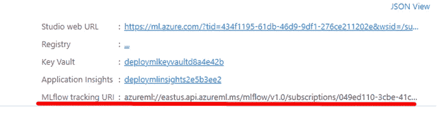
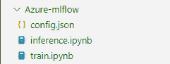
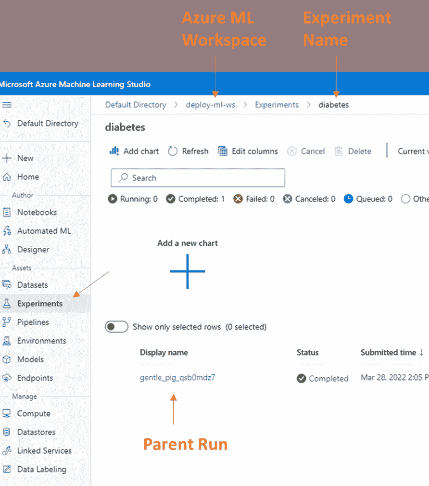
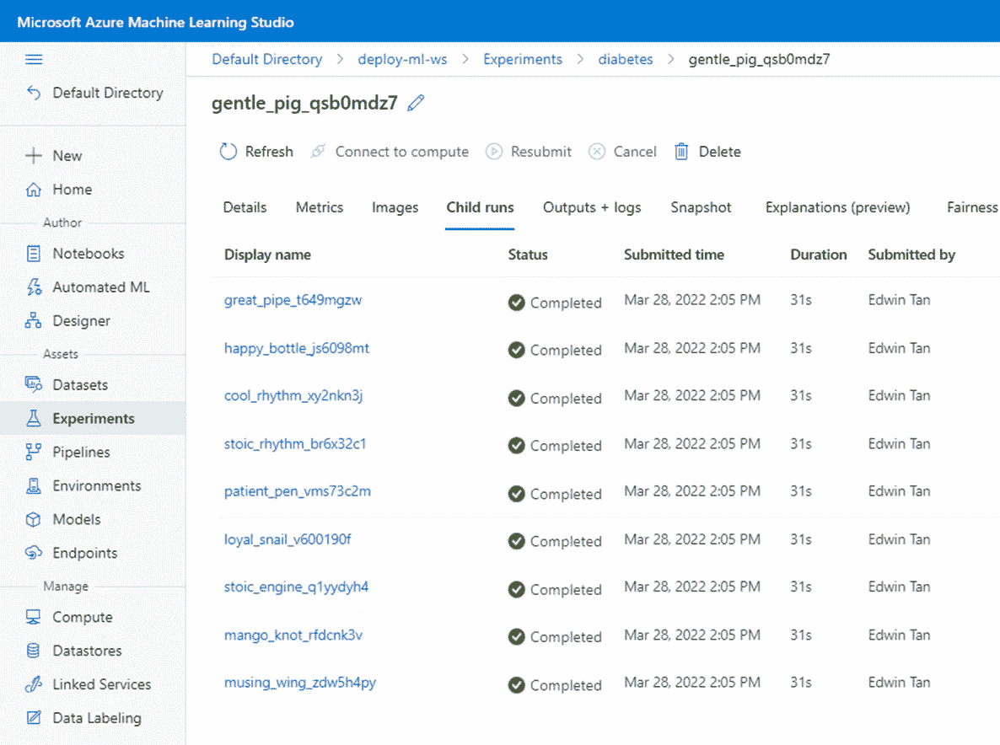
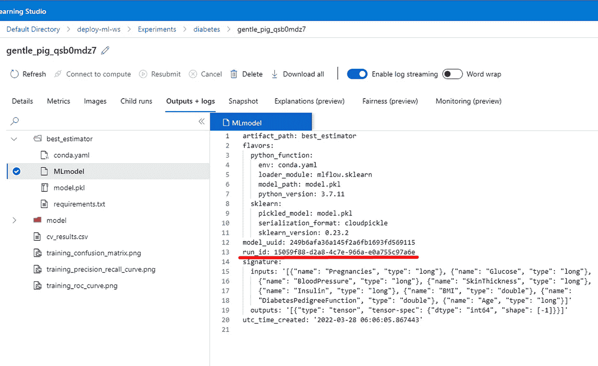
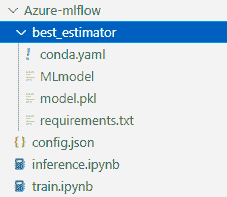

# 在 Azure Cloud 上用 MLFlow 监控机器学习实验

> 原文：<https://pub.towardsai.net/monitor-machine-learning-experiments-with-mlflow-on-azure-cloud-a4de13a39735?source=collection_archive---------3----------------------->

## *如何使用 Azure Machine Learning 在远程 MLFlow 跟踪服务器上设置和记录机器学习实验*


奥斯卡·卡达克索在 [Unsplash](https://unsplash.com?utm_source=medium&utm_medium=referral) 上拍摄的照片

# 1.介绍

典型的机器学习工作流程包括数据预处理、超参数调整和模型评估等步骤。数据科学家可能需要试验超参数、模型算法和预处理步骤的组合，以获得所需的结果。记录超参数、模型算法、结果和模型工件对于确保机器学习实验的可重复性至关重要。使用 MLFlow 等 MLOps 工具可以简化这项艰巨的任务。

MLFlow [1]是一个管理 ML 生命周期的开源平台，包括实验、可复制性、部署和中央模型注册。MLFlow 提供 4 种不同的组件:

1.  **MLFlow Tracking:** 记录和查询实验:代码、数据、配置和结果
2.  **MLFlow 项目:**将数据科学代码打包成可在任何平台上运行的格式
3.  **MLFlow 模型:**在不同的服务环境中部署机器学习模型
4.  **模型注册:**在中央存储库中存储、注释、发现和管理模型

人们可以在云虚拟机(如 AWS EC2 或 Azure VM)上托管 MLFlow 跟踪服务器，但是设置服务器和工件存储的过程可能会很繁琐。一种替代方法是使用托管 MLFlow 解决方案，如 Azure Machine Learning。

**Azure 机器学习**是微软 Azure 云计算平台的一部分，帮助数据科学家和工程师管理他们的机器学习工作流程[2]。每个 Azure 机器学习工作区都附带一个预配置的 MLFlow 服务器。我们将使用 MLFlow 跟踪功能将机器学习实验的参数、结果和工件记录到 Azure 机器学习服务托管的 MLFLow 服务器中。

在本文中，我们将展示如何

1.  在 Azure Machine Learning 上设置远程 MLFlow 跟踪服务器
2.  使用 scikit-learn 在本地训练模型
3.  将本地模型参数、结果和工件记录到远程 MLFlow 跟踪服务器上
4.  从 MLFlow 跟踪服务器检索已训练的模型以进行离线批量评分

# 2.设置

在这一节中，我们看看如何设置 Azure 服务和模型训练环境。

# 2.1.创建 Azure 帐户

跟踪服务器将托管在 Azure 机器学习上，因此，我们需要有一个 [Azure 账户](https://azure.microsoft.com/en-us/free/)。新帐户在前 30 天和 12 个月免费获得 200 美元的 Azure 点数，用于选择服务。

# 2.2.设置 Azure ML 工作区

**1。创建资源组**

> *资源组是一个为 Azure 解决方案[3]保存相关资源的容器。*

*   转到[https://portal.azure.com/](https://portal.azure.com/)
*   在 Azure Services 下或通过搜索栏找到“资源组”


作者图片

*   创建新的资源组


作者图片

*   填写详细信息，如订阅、资源组名称和区域


作者图片

**2。创建 Azure ML 工作空间**

> *工作区是 Azure 机器学习的顶级资源，提供了一个集中的地方来处理您在使用 Azure 机器学习时创建的所有工件。工作区保存了所有训练运行的历史，包括日志、指标、输出和脚本的快照。您使用这些信息来确定哪一次训练运行产生了最好的模型[4]。*

*   在 Azure Services 下或者通过搜索栏找到“机器学习”。


作者图片

*   点击创建


作者图片

*   填空。资源组是我们在上一步中创建的


作者图片

*   MLFlow 跟踪服务器是作为 Azure ML 工作区的一部分自动创建的



作者图片

# 2.3.设置培训环境

我们将使用本地培训环境(即在您的 PC 或笔记本电脑上)。

**IDE**

我在 Visual Studio 代码中使用 Jupyter 笔记本。您可以自由使用任何 IDE。

**康达环境**

确保机器上安装了 miniconda3。从命令行界面创建 python 3.7 conda 环境。环境名是任意的，我将其命名为`general`。

```
#command line
conda create -n general python=3.7
```

激活康达环境。我们将在这种环境下进行所有的开发工作。

```
#command line
conda activate general
```

**Python 包**

确保 Conda 环境中安装了以下软件包

```
azureml-core
azureml-mlflow
pandas
numpy
scikit-learn
mlflow
```

**Azure 机器学习工作区配置**

下载 Azure 机器学习工作区配置。


作者图片

配置文件采用 JSON 格式，包含以下信息:

```
# config.json{
    "subscription_id": "your-subscription-id",
    "resource_group": "your-resource-group-name",
    "workspace_name": "your-workspace-name"
}
```

我们需要这些信息来连接到 AML 工作区进行记录实验。

**项目结构**

下面是当前项目的本地目录。



作者图片

*   `train.ipynb`:包含数据处理和训练代码
*   `inference.ipynb`:包含离线批量评分代码
*   `config.json` : Azure ML 工作区配置

# 3.`train.ipynb`

**导入包**

```
import mlflow
from azureml.core import Workspace
import pandas as pd
import numpy as np
from sklearn.ensemble import RandomForestClassifier
from sklearn.model_selection import GridSearchCV, train_test_split
from sklearn.pipeline import Pipeline
from sklearn.preprocessing import FunctionTransformer
from sklearn.impute import SimpleImputer
```

**设置工作空间**

```
ws = Workspace.from_config()
```

运行此单元后，您可能会得到一个 URL 来执行 web 身份验证。这是连接到 Azure 机器学习工作区所必需的。完成后，您可以返回 IDE 并继续下一步。

**设置跟踪 URI**

MLFlow 跟踪 URI 是我们可以找到 MLFlow 跟踪服务器的地址。我们设置跟踪 URI 来让 MLFlow 也知道在哪里记录实验。

```
mlflow.set_tracking_uri(ws.get_mlflow_tracking_uri())
```

跟踪 URI 的格式如下

```
azureml://<region>.api.azureml.ms/mlflow/v1.0/subscriptions/<subscription-id>/resourceGroups/<resource-group>/providers/Microsoft.MachineLearningServices/workspaces/<aml-workspace>?
```

你也可以在 Azure 机器学习工作区找到同样的追踪 URI。

**设置 MLFlow 实验**

下面的代码定义了 MLFlow 实验的名称。MLFlow 实验是组织不同运行的一种方式。一个实验包含多次运行，每次运行都是训练代码的一次执行。我们可以为每次运行定义要存储的参数、结果和工件。如果实验名称不存在，将创建一个新的实验，否则它会将运行记录到同名的现有实验中。

```
experiment_name = 'diabetes'
mlflow.set_experiment(experiment_name)
```

**数据预处理**

让我们加载数据并执行训练测试分割。

```
input_path = 'path/to/data.csv'df = pd.read_csv(input_path, sep = ',')
y = df.pop('Outcome')
X = dfX_train, X_test, y_train, y_test = train_test_split(X, y)
```

我们创建一个 scikit-learn `FunctionTransformer`来查找所选列中的“0”值，并用“NaN”替换它。

```
def replace_zeros(x):

		x = x.copy()
    x[['Glucose','BloodPressure','SkinThickness','Insulin','BMI']] = x[['Glucose','BloodPressure','SkinThickness','Insulin','BMI']].replace(0,np.NaN) return xft_replace_zeros = FunctionTransformer(replace_zeros)
```

**创建一个 scikit-learn 管道**

```
rf_clf = RandomForestClassifier()
num_imputer = SimpleImputer()
pipe = Pipeline([('replace_zeros', ft_replace_zeros), ('fillna', num_imputer), ('clf', rf_clf)])
```

以下是 scikit-learn 管道中的步骤:

*   `replace_zeros`:使用 UDF 和 scikit-learn 的`FunctionTransformer`将所有“0”替换为“NaN”值
*   `fillna`:使用 scikit-learn 的`SimpleImputer`用列的平均值填充缺失值
*   `clf`:随机森林分类器

**超参数调谐**

```
mlflow.sklearn.autolog(max_tuning_runs=None)param_grid = {'clf__n_estimators': [1,2,3], 'clf__max_depth':[2,3,4]}clf = GridSearchCV(pipe, param_grid = param_grid, scoring = ['roc_auc', 'precision', 'recall', 'f1', 'accuracy'], refit = 'roc_auc')
clf.fit(X_train, y_train)
```

上述代码执行以下操作:

1.  日志实验:在训练代码之前调用`mlflow.sklearn.autolog()`可以自动记录参数、度量和模型。MLFlow 向 scikit-learn、TensorFlow、XGBoost 等流行的机器学习框架提供`autolog`。
2.  用我们想要试验的参数创建一个参数网格`param_grid`
3.  执行`GridSearchCV`搜索最佳参数。`param_grid`中定义的每个超参数组合将用于交叉验证。结果、指标和工件将被记录到 MLFlow 中。

我们可以在 Azure 机器学习([https://ml.azure.com/](https://ml.azure.com/))workspace→Experiments 上查看运行结果。自动记录`GridsearchCV`创建一个包含嵌套子运行的父运行。每组超参数被记录到单独子运行中。



作者图片

子运行的详细信息可以在父运行中找到。



作者图片

最佳子运行的参数、结果和模型也记录在父运行下。下图显示了最佳子运行的模型文件。带红色下划线的`run_id`是产生最佳估计值的运行的唯一标识符。



作者图片

# 4.`inference.ipynb`

本节展示了如何基于其`run_id`从 Azure 机器学习 MLFlow 实验中加载一个模型，并使用该模型进行离线批量评分。评分在本地计算机(即 PC 或笔记本电脑)上完成。本节假设推理环境与训练环境具有相同的依赖性。

**导入库**

```
import mlflow
from azureml.core import Workspace
import pandas as pd
```

**配置 Azure ML 工作区& MLFlow**

```
ws = Workspace.from_config()
mlflow.set_tracking_uri(ws.get_mlflow_tracking_uri())
```

**负荷模型**

可以使用`run_id`从 MLFlow 中检索模型。

```
run_id = '15059f88-d2a8-4c7e-966a-e0a755c97a6e'
model = mlflow.sklearn.load_model(f'runs:/{run_id}/best_estimator', './')
```

`mlflow.sklearn.load_model()`的参数是:

*   `model_uri`:ml flow 模型的位置，以 URI 格式表示。模型的路径采用格式`runs:/<mlflow_run_id>/run-relative/path/to/model`
*   `dst_path`–下载模型工件的本地文件系统路径。该目录必须已经存在。如果未指定，将创建本地输出路径。



作者图片

当我们执行`mlflow.sklearn.load_model()`时，包含`model.pkl`的文件夹`best_estimator`以及`conda.yaml`、`requirements.txt`和`MLmodel`等依赖文件被下载到`dst_path`中定义的本地目录。

加载的模型(`model.pkl`)是一个合适的 scikit-learn 管道对象。这与我们在培训阶段创建的管道相同。

```
Pipeline(steps=[('replace_zeros',
                 FunctionTransformer(func=<function replace_zeros at 0x000001EBEF3F0AF8>)),
                ('fillna', SimpleImputer()),
                ('clf', RandomForestClassifier(max_depth=3, n_estimators=3))])
```

**根据新数据进行预测**

```
new_data = pd.read_csv('/path/to/new_data.csv', sep = ',')
model.predict_proba(new_data) 
#OR
model.predict(new_data)
```

# 5.摘要

在本文中，我们讨论了在 Azure Machine Learning 上使用 MLFlow 跟踪机器学习实验的动机，并研究了如何:

1.  在 Azure Machine Learning 上设置远程 MLFlow 跟踪服务器
2.  使用 scikit-learn 在本地训练模型
3.  将模型参数、结果和工件记录到 MLFlow 上
4.  从 MLFlow 跟踪服务器检索已训练的模型以进行离线批量评分

# 参考

[1] [MLFlow](https://mlflow.org/)

[2] [蔚蓝机器学习](https://docs.microsoft.com/en-us/azure/machine-learning/overview-what-is-azure-machine-learning)

[3] [资源组](https://docs.microsoft.com/en-us/azure/azure-resource-manager/management/manage-resource-groups-portal)

[4] [Azure 机器学习工作区](https://docs.microsoft.com/en-us/azure/machine-learning/concept-workspace)