# 从图像中检测猴痘

> 原文：<https://pub.towardsai.net/monkey-pox-detection-from-images-33d6fc39dbff?source=collection_archive---------1----------------------->

## 世界卫生组织宣布猴痘为全球卫生紧急事件

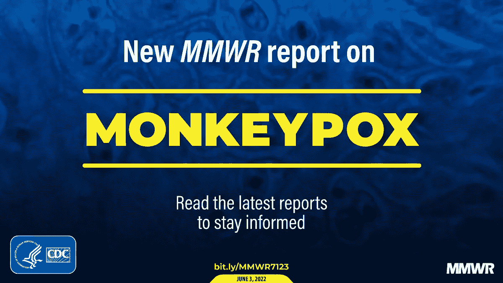

有不同种类的痘——水痘、天花、麻疹，现在还有猴痘。这将是有趣的，看看我们有多少数据可用于不同类型的痘和训练模型，使它们能够从图像中检测痘类型。

**使用的深度学习库:Pytorch**

**Github 资源库:** [**链接**](https://github.com/ashhadulislam/train-pox-detector)

# 第 1 部分:数据收集

谷歌搜索揭示了由 [Md Manjurul Ahsan](https://scholar.google.com/citations?hl=en&user=fvWTiS8AAAAJ&view_op=list_works&sortby=pubdate%5C) 在 [GitHub](https://github.com/mahsan2/Monkeypox-dataset-2022) 维护的 pox 数据库。它包含水痘、麻疹、猴痘、麻疹和正常的彩色图像。同样的图片也有灰度版本。因此，对于所有不同的类别类型，它都有一组灰色的增强图像。

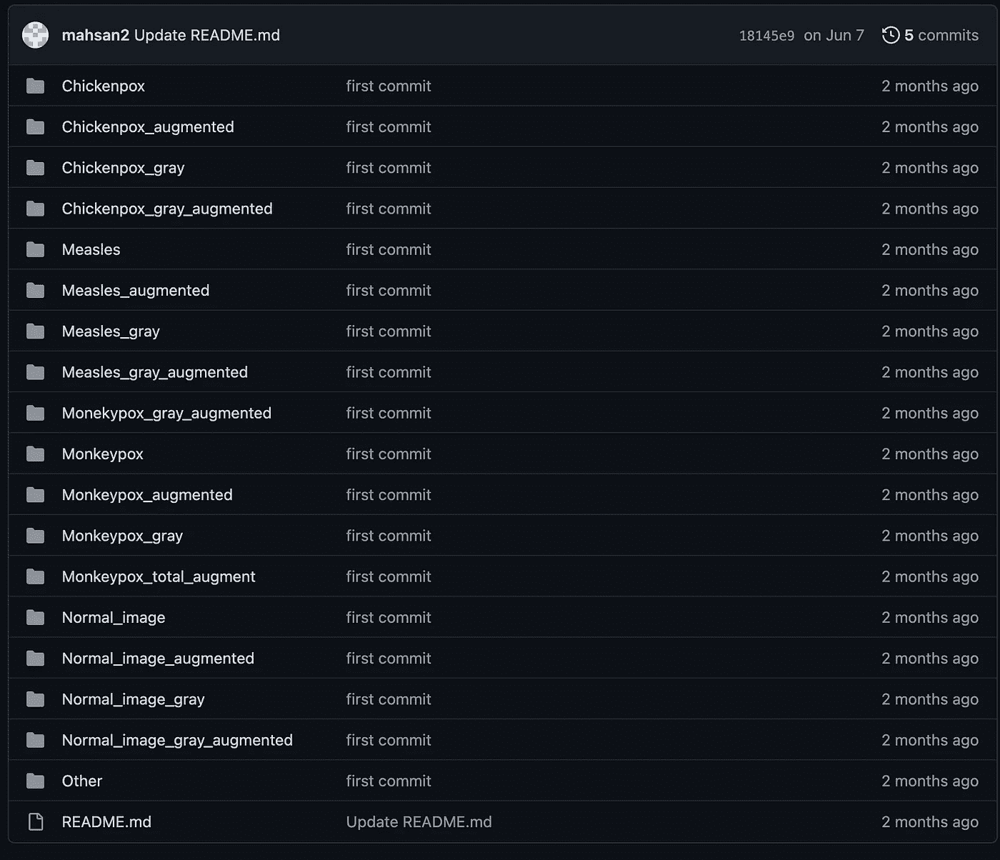

不同痘型的图像

我们可以很容易地下载数据。但是，我们需要整理文件，以便 PyTorch 库可以使用它们。
我们创建了一个名为 project 的文件夹和一个名为 data 的子文件夹。我们在数据文件夹中创建四个空文件夹来代表不同的数据类。

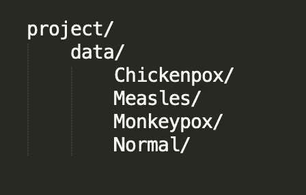

包含图像的文件夹

现在我们把水痘 _gray 和水痘 _gray_augmented 的图片从资源库复制到 project/data/水痘。

将麻疹 _gray 和麻疹 _gray_augmented 中的图像从资源库复制到 project/data/麻疹中。

将 Monekypox_gray 和 Monekypox_gray_augmented 中的图像从存储库中复制到 project/data/Monekypox 中。

最后，将 Normal_image_gray 和 Normal_image_gray_augmented 中的图像从存储库中复制到 project/data/Normal 中。

传输文件后，文件夹结构应如下所示:

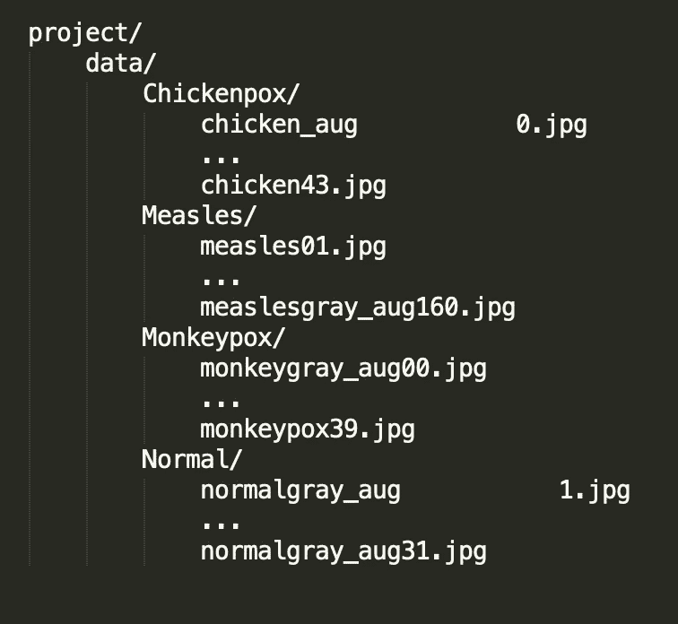

每个文件夹都有其灰度图像和灰度增强图像的集合。有些文件名中间有空格

# 第 2 部分:数据转换

如果我们检查单个文件，我们会看到文件大小不同。然而，它们需要是统一的，以便将它们提供给网络。因此，我们将定义一些 Pytorch 转换来使图像一致。

我们在项目的根层打开一个 jupyter 笔记本。

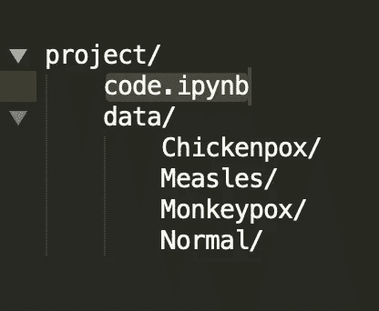

code.ipynb 将包含模型等

首先需要导入这些库

接下来，我们将数据处理到训练加载器和测试加载器中。

从文件夹加载图像的代码片段。

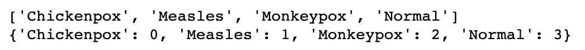

上述代码单元的输出。显示类别和标签值之间的映射。

请注意，图像的根文件夹是 data/。数据/包含不同 pox 类型的所有图像。因此，我们在上面的代码片段中添加了额外的代码来将数据分成 train 和 test。此外，在第 23 行和第 24 行，shuffle 被设置为 true，以便在将图像分成 train 和 test 之前对它们进行随机重新排序。

接下来，我们编写一段代码来检查图像是否被正确转换。

显示训练集中的图像。

上面的代码从第一批训练图像中取出第 10 幅图像并显示出来。由于数据在前一个代码块中被打乱，您的输出可能与我的不同。

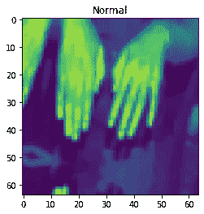

正常的皮肤图像

有了数据，我们就可以开始重新训练预先训练好的模型了。

# 第 3 部分:训练不同的模型。

我们定义了一个通用的训练函数和一个通用的精度检验函数，可以用来计算模型的效率。

根据数据训练模型并测试其准确性的一般函数

第一行包含设备检查，以了解代码是在 CPU 上运行还是在 GPU 上运行。我们将历元的数量设置为 30。随后，有两个函数可用于训练模型和测试模型。

我们还可以用下面的代码检查数据中是否有重大的不平衡。

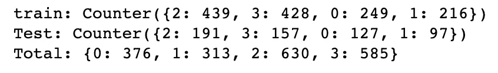

数据相当平衡。本来可以更好，但看起来还可以。

我们现在准备执行模型训练。我们将训练的预训练模型是

*   squeezenet1_0
*   densenet161
*   densenet169
*   亚历克斯 _ 网
*   resnet18

## Squeezenet1_0

以下代码片段为 squeezenet1_0 模型定型。

代码可以分为 4 个部分。第 1 行设置了保存训练模型的位置，以便将来使用。第 4 到 9 行初始化模型和其他条件。由于数据有 4 个类，因此有必要将模型的最后一层改为有 4 个输出(第 5 行)。第 12 到 14 行训练模型。最后，在第 17 到 22 行初始化一个新的模型，并在第 25 行测试它。

精确度如下

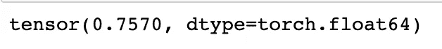

75%的准确率，不够好

## DenseNet161

下面的代码片段为 densenet161 模型定型。

输出如下所示

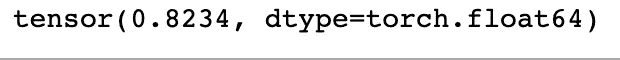

DenseNet161 的测试精度

## DenseNet169

以下是用于训练 DenseNet169 的代码片段。它与前面的代码库非常相似，只是名称和预最终层(第 6 行和第 20 行)中的神经元数量有所变化

输出如下所示:

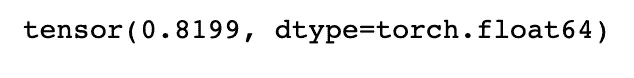

准确率在 82 %左右

## AlexNet

接下来，我们尝试一个 AlexNet。下面的代码帮助我们加载和重新训练模型。

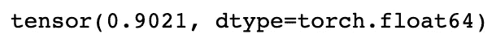

准确率提高到 90 %

## Resnet18

下面的代码片段为 resnet18 模型定型。

培训和测试 resnet18 模型

上面的代码中发生了 4 件事。

在第 1 行中，我们选择要保存的模型的名称和位置。第 3 到 12 行设置了 resnet18 模型的不同参数。我们将模型的输出数量改为 4，这是我们数据集中的类的数量。第 15 到 17 行对模型进行训练，并将其保存在 path 中。在第 19 到 25 行，我们初始化了另一个 resnet18 模型，并将权重从 path 加载到其中。然后我们在第 28 行检查它的准确性。

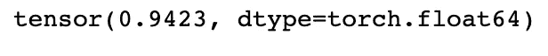

准确率提高到 94.23 %

培训到此结束。为了使模型有用，我们需要编写代码将模型应用于单个图像，并预测图像中皮肤可能患有的痘的类型。

由于 resnet18 提供了最好的精度，我们将在未来的步骤中使用相同的精度。

# 第 4 部分:分类单个图像

我们假设输入图像是一个文件或一个 HTTP 链接，需要通过上面训练的 resnet 模型进行处理和传递，以确定流行的 pox 类型。让我们定义两个函数，一个用于加载模型，另一个用于预测给定模型和图像(可能是灰度或彩色)的类别。

创建另一个名为 *test.ipynb* 的 jupyter 笔记本

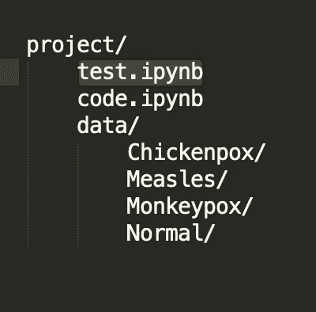

分离测试

上面的代码执行必要的导入，设置转换器，并初始化一些全局变量，如类、路径和设备。

接下来，我们定义加载模型的函数(resnet18)。这将类似于我们之前已经编写的代码。然而，为了方便使用，我们把它放在一个函数中。

加载 resnet18 模型

需要另一个函数将模型应用于传递的图像。图像可以是文件或 url。

上面的函数接收一个图像位置，并使用 validator 包检查它是一个 URL 还是一个绝对位置(第 6 到 10 行)。第 12 行到第 15 行执行一些转换，将单个图像存储在一个列表中(因为模型期望一批图像)，并将灰度通道复制为三个通道，因为模型可以用三个通道处理彩色图像。第 16 行是代码生成预测值的地方。我们从最高到最低对值进行排序，并返回与值的顺序相对应的所有标签。因此，这个函数的输出是 pox 类型的列表。

**比如:**【猴痘、水痘、麻疹、正常】暗示皮肤像几率最高的是得了猴痘，其次是水痘等等。

这就正式把我们带到了这篇文章的结尾。这里整个练习的代码可以在 [github](https://github.com/ashhadulislam/train-pox-detector) 找到。

# 附加部分:前端应用

如果我们能把这作为一个应用程序与全世界分享，那就太好了。我们上传皮肤的图像，它会按照严重程度的降序告诉我们痘的类型。我们可以使用 Streamlit 精确地做到这一点。

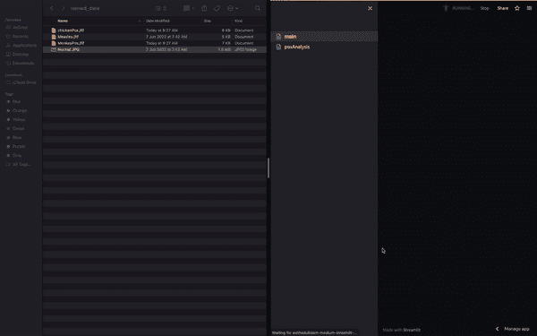

实时 Streamlit 应用程序执行痘型检测，视频可在 [vimeo](https://vimeo.com/734438419) 获得。

关于 Streamlit 中编码的更详细的解释，看一看这篇[文章](/deep-learning-a692669f6f42)，并转到*部分作为 Streamlit 应用程序托管(本地，然后在云中)*。这个应用程序的代码以类似的格式编写。Streamlit 应用程序的 GitHub repo 可以在[这里](https://github.com/ashhadulislam/medium-streamlit-pox-detection)找到。你可以试试这里的 app。

**结论**

如果你坚持到最后，这里祝你和你的亲人身体健康。下次见。