# 蒙特卡洛模拟:Python 的深入教程

> 原文：<https://pub.towardsai.net/monte-carlo-simulation-an-in-depth-tutorial-with-python-bcf6eb7856c8?source=collection_archive---------1----------------------->

图 1:蒙特卡罗模拟方法被用于许多行业，从股票市场到金融、能源、银行和其他预测模型。|来源:[像素](https://www.pexels.com/photo/white-android-tablet-turned-on-displaying-a-graph-186464/)

## [机器学习](https://towardsai.net/p/category/machine-learning)，[数学](https://towardsai.net/p/category/mathematics)，[编程](https://towardsai.net/p/category/programming)，[教程](https://towardsai.net/p/category/tutorial)

## 关于蒙特卡罗模拟方法和 Python 应用的深入教程

**作者:** [普拉蒂克·舒克拉](https://www.linkedin.com/in/pratik-shukla28/)，[罗伯特·伊里翁多](https://mktg.best/vguzs)

最后更新于 2021 年 1 月 8 日

 [## 加入我们吧↓ |面向人工智能成员|数据驱动的社区

### 加入人工智能，成为会员，你将不仅支持人工智能，但你将有机会…

members.towardsai.net](https://members.towardsai.net/) 

# 什么是蒙特卡洛模拟？

蒙特卡罗方法是一种使用随机数和概率来解决复杂问题的技术。蒙特卡洛模拟，或称概率模拟，是一种用于理解金融部门、项目管理、成本和其他预测 [**机器学习**](https://mld.ai/mldcmu) 模型中风险和不确定性影响的技术。

风险分析几乎是我们做出的每一个决定的一部分，因为我们在生活中不断面临不确定性、模糊性和可变性。此外，即使我们获得了前所未有的信息，我们也无法准确预测未来。

蒙特卡洛模拟使我们能够看到决策的所有可能结果，并评估风险影响，从而在不确定的情况下做出更好的决策。

在本文中，我们将通过五个不同的例子来理解蒙特卡罗模拟方法。本教程的代码可在[**Github**](https://github.com/towardsai/tutorials/tree/master/monte_carlo_simulation)**上获得，其完整实现也可在 [**Google Colab**](https://colab.research.google.com/drive/1ZniHyaE7AqkNYpypw8Qn7dGv62MlSrGG?usp=sharing) 上获得。**

> **📚查看我们的[主成分分析](https://towardsai.net/p/data-science/principal-component-analysis-pca-with-python-examples-tutorial-67a917bae9aa)教程。📚**

# **应用:**

*   **金融。**
*   **项目管理。**
*   **能量。**
*   **制造业。**
*   **工程。**
*   **研发。**
*   **保险。**
*   **石油和天然气。**
*   **运输。**
*   **环境。**
*   **和其他人。**

# **示例:**

1.  **[抛硬币的例子](#8cf2)。**
2.  **[用圆和方估算圆周率。](#41b8)**
3.  **[天魔堂问题。](#81a5)**
4.  **[布冯的针的问题。](#c5ea)**
5.  **[为什么房子总是赢？](#6185)**

# **a.抛硬币示例:**

**正面对公平硬币的概率是 1/2。但是，有什么方法可以通过实验证明呢？在这个例子中，我们将使用蒙特卡罗方法反复模拟 5000 次抛硬币，以找出为什么正面或反面的概率总是 1/2。如果我们重复抛硬币很多很多次，那么我们可以获得更高的概率值的精确答案。**

**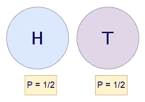**

**图 2:正面和反面，数学表示。**

**抛硬币时:**

**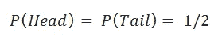**

**图 3:正面和反面硬币的公式示例。**

**接下来，我们将使用蒙特卡罗方法通过实验证明这个公式。**

## **Python 实现:**

1.  ****导入所需的库:****

**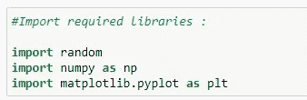**

**图 4:为我们的抛硬币示例导入所需的库。**

****2。硬币翻转功能:****

**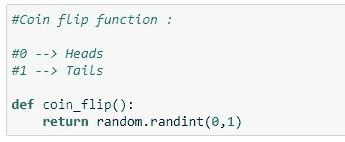**

**图 5:一个在 0 和 1 之间随机化结果的简单函数，0 表示正面，1 表示反面。**

****3。检查函数的输出:****

**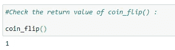**

**图 6:运行 coin_flip()函数**

****4。主要功能:****

**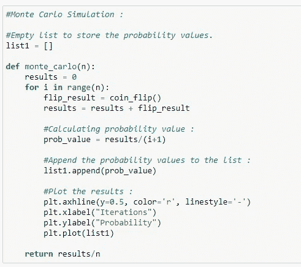**

**图 7:计算概率并将概率值附加到结果中。**

****5。调用主函数:****

**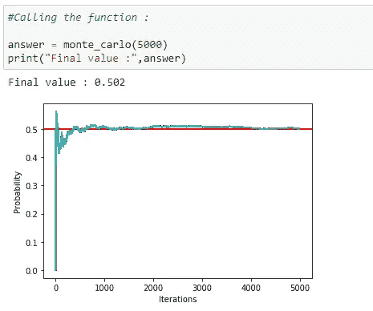**

**图 8:调用蒙特卡罗主函数，并绘制最终值。**

**如图 8 所示，我们表明在 5000 次迭代之后，得到尾部的概率是 0.502。因此，这就是我们如何使用蒙特卡罗模拟来通过实验找到概率。**

# **b.使用圆和正方形估算圆周率:**

**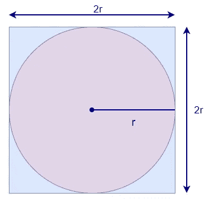**

**图 9:圆形和正方形的简单面积。**

**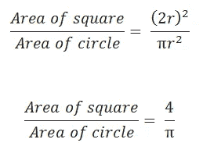**

**图 10:分别计算圆和正方形的面积。**

**为了估计圆周率的值，我们需要正方形的面积和圆形的面积。为了找到这些区域，我们将在表面上随机放置点，并计算落在圆圈内的点和落在正方形内的点。这将为我们提供它们的估计面积。因此，我们将使用点数作为面积，而不是使用实际面积。**

**在下面的代码中，我们使用 Python 的 turtle 模块来查看点的随机放置。**

## **Python 实现:**

1.  ****导入所需的库:****

**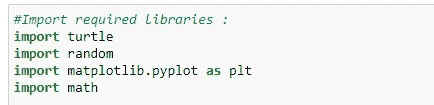**

**图 10:为我们的π例子导入所需的库。**

****2。为了可视化这些点:****

**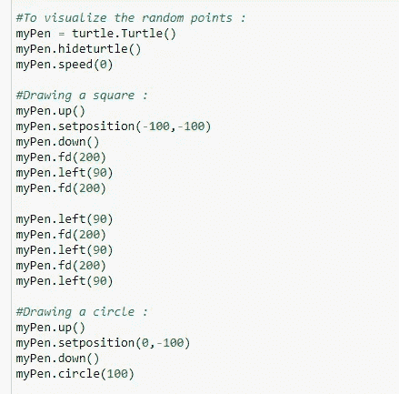**

**图 11:绘制图形。**

****3。初始化一些需要的数据:****

**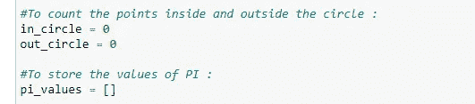**

**图 12:初始化数据值。**

****4。主要功能:****

**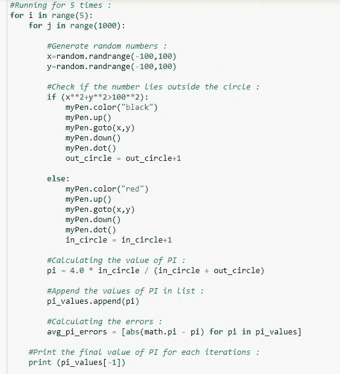**

**图 13:实现 main 函数。**

****5。绘制数据:****

**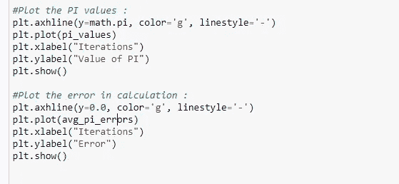**

**图 14:绘制数据值。**

****6。输出:****

**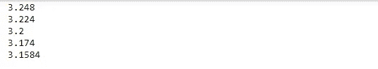**

**图 15:使用蒙特卡罗方法的π近似值。**

**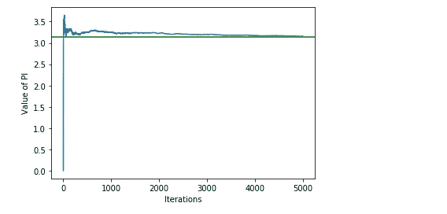**

**图 16:值的数据可视化。**

**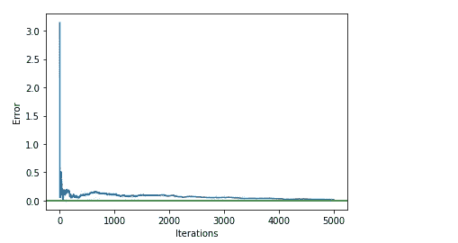**

**图 17:值的数据可视化。**

**如图 17 所示，我们可以看到，经过 5000 次迭代，我们可以得到圆周率的近似值。此外，请注意，随着迭代次数的增加，估计误差也呈指数下降。**

**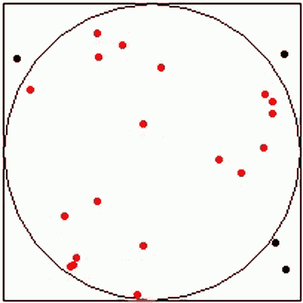**

> **📚查看[机器学习算法的概述](https://towardsai.net/machine-learning-algorithms)，为初学者提供 Python 代码示例。📚**

# **3.蒙蒂霍尔问题:**

> ***假设你在参加一个游戏节目，你可以选择三扇门中的一扇门:一扇门后是一辆汽车；在另一扇门后面，山羊。你选了一扇门，比如 1 号门，主人知道门后有什么，他打开了另一扇门，比如 3 号门，里面有一只山羊。主持人接着问你:你是坚持自己的选择还是选择另一个门？【*[*1*](https://www.imdb.com/title/tt0478087/characters/nm0000228#quotes)*】***

> **改变你选择的门对你有利吗？**

**根据概率，事实证明开关门对我们有利。让我们来看看如何:**

**最初，对于所有三个门，获得汽车的概率(P)是相同的(P = 1/3)。**

**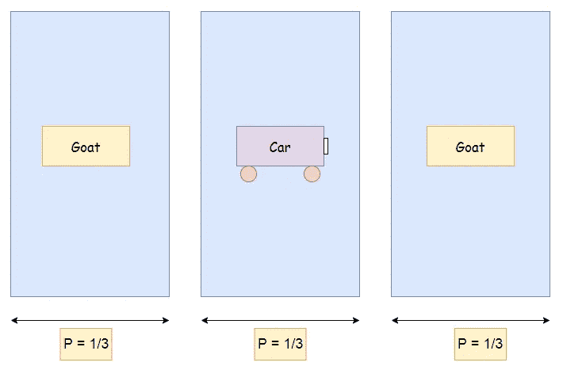**

**图 18:我们游戏展示的三个大门的模拟，展示了每一个可能的结果。**

**现在假设参赛者选择 1 号门。接下来，主人打开第三扇门，里面有一只山羊。接下来，主持人问参赛者他/她是否想换门？**

**我们将了解为什么对门更有利:**

**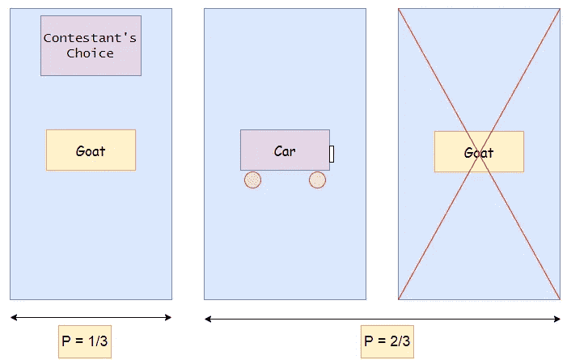**

**图 19:门游戏的形象化结果。**

**在图 19 中我们可以看到，主机打开 3 号门后，后两个门有车的概率增加到 2/3。现在我们知道第三扇门有一只山羊，第二扇门有一辆汽车的概率增加到 2/3。因此，对门进行切换更为有利。**

**现在我们将使用蒙特卡罗方法多次执行这个测试用例，并以实验的方式找出它的概率。**

## **Python 实现:**

1.  ****导入所需的库:****

**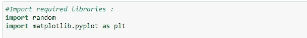**

**图 20:为我们的游戏展示示例导入所需的库。**

****2。初始化一些数据:****

**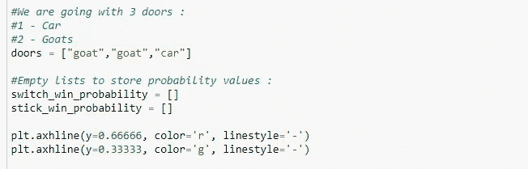**

**图 21:初始化门和空列表来存储概率值。**

****3。主要功能:****

**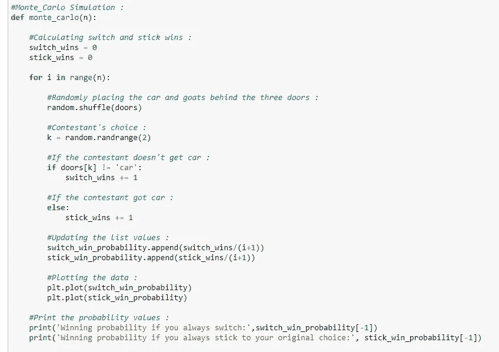**

**图 22:用蒙特卡罗模拟方法实现主函数。**

****4。调用主函数:****

**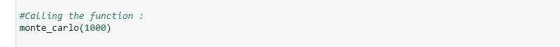**

**图 23:调用我们游戏 show 示例的主函数，并且有趣 1000 次。**

****5。输出:****

**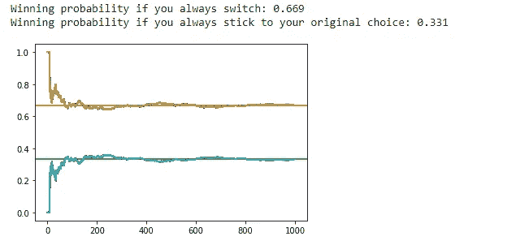**

**图 24:坚持你的选择或换门的大概获胜概率。**

**在图 24 中，我们显示了在 1000 次迭代之后，如果我们对门，获胜概率是 0.669。因此，我们确信在这个例子中对门进行切换对我们有利。**

# **4.布冯的针头问题:**

**一位法国贵族乔治-路易·莱克勒克，孔德·德·布丰，在 1777 年发表了以下问题[ [2](https://en.wikipedia.org/wiki/Georges-Louis_Leclerc,_Comte_de_Buffon) ] [ [3](https://en.wikipedia.org/wiki/Buffon%27s_needle_problem) ]。**

> ***假设我们将一根短针落在一张画纸上，这根针落在与其中一条线相交的位置上的概率是多少？***

**概率取决于划线纸的线之间的距离(d ),取决于我们放下的针的长度(l)——或者更确切地说，取决于比率`l/d`。对于这个例子，我们可以把针解释为`l ≤ d`。简而言之，我们的目的是针不能同时穿过两条不同的线。令人惊讶的是，布冯针问题的答案涉及圆周率。**

**这里我们将使用布丰针问题的解决方案，使用**蒙特卡罗方法**实验性地估计圆周率的值。然而，在此之前，我们将展示解决方案是如何产生的，使它更有趣。**

## **定理:**

> ***如果一根长度为 l 的短针落在一张纸上，纸上划有距离 d ≥ l 的等距线，那么针落在穿过其中一条线的位置的概率为:***

**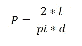**

**图 25:布冯的针问题定理。**

## **证明:**

**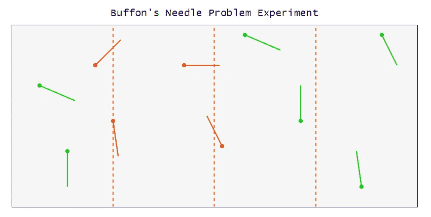**

**图 26:可视化布冯的针问题。**

**接下来，我们需要计算穿过任何垂直线的针数。对于针与其中一条线相交，对于特定的θ值，以下是针与垂直线相交的最大和最小可能值。**

1.  ****最大可能值:****

**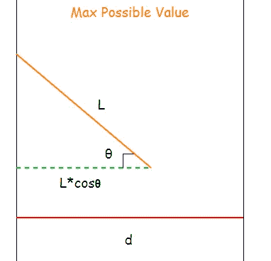**

**图 27:最大可能值。**

****2。最小可能值:****

**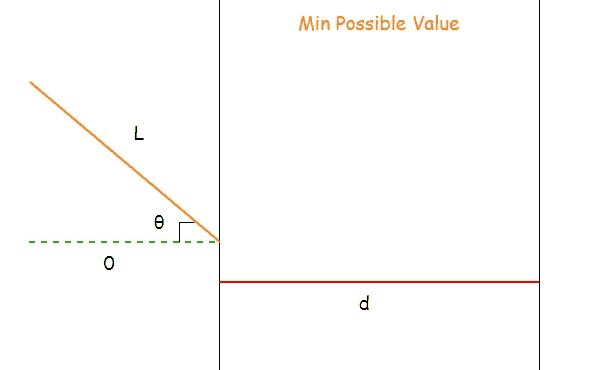**

**图 28:最小可能值。**

**因此，对于特定的θ值，针位于垂直线上的概率为:**

****

**图 29:针落在垂直线公式上的概率。**

**上面的概率公式只限于θ的一个值；在我们的实验中，θ值的范围是从 0 到π/2。接下来，我们将通过对θ的所有值进行积分来找到实际的概率。**

**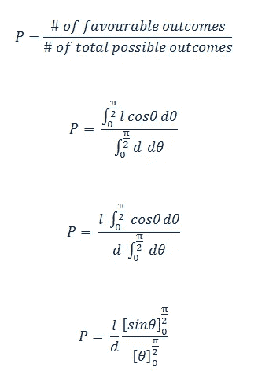**

**图 30:整合θ所有可能值的概率公式。**

**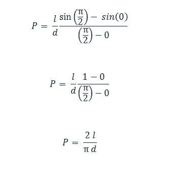**

**图 31: PI 估计。**

## **用布丰针问题估算圆周率；**

**接下来我们要用上面的公式，通过实验求出圆周率的值。**

**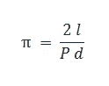**

**图 32:求圆周率的值。**

**现在，注意我们有了 l 和 d 的值，我们的目标是先找到 P 的值，这样我们就可以得到 PI 的值。为了求出概率 P，我们必须知道击中的针数和总针数。因为我们已经有了总针数，我们现在唯一需要的是命中针数。**

**下面是我们如何计算击中针数的直观表示。**

**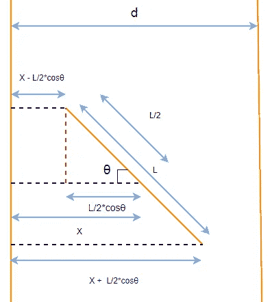**

**图 33:计算针数的直观表示。**

## **Python 实现:**

1.  ****导入所需的库:****

**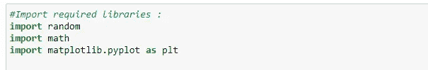**

**图 34:为我们的问题导入所需的库。**

****2。主要功能:****

****

**图 35:对我们的布丰问题实施蒙特卡罗模拟方法。**

****3。调用主函数:****

**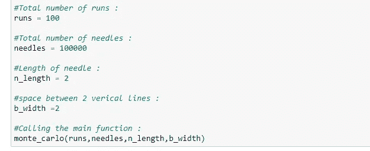**

**图 36:调用蒙特卡罗方法的主函数来解决我们的布丰问题。**

****4。输出:****

**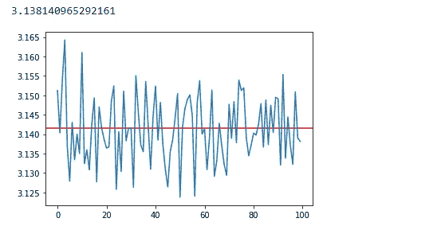**

**图 37:使用蒙特卡罗方法 100 次迭代的数据可视化。**

**如图 37 所示，经过 100 次迭代后，我们能够使用**蒙特卡罗方法*获得非常接近的 PI 值。*****

**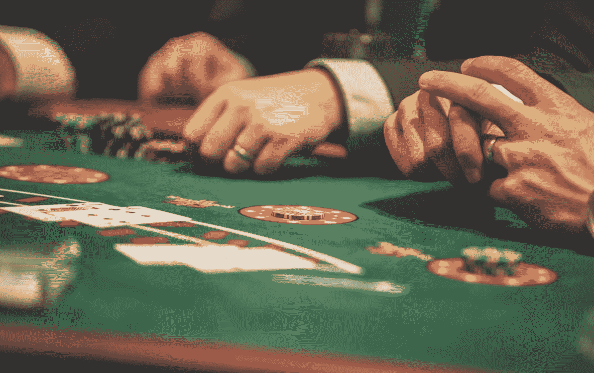**

**来源:[像素](https://www.pexels.com/photo/person-playing-poker-1871508/)**

# **5.为什么房子总是赢？**

**赌场是怎么挣钱的？诀窍很简单——“你玩得越多，他们赚得越多。”让我们用一个简单的**蒙特卡罗模拟**例子 ***来看看这是如何工作的。*****

**考虑一个假想的游戏，玩家必须从一袋筹码中选择一个筹码。**

## **规则:**

1.  **一个袋子里有从 1 到 100 不等的数字。**
2.  **用户可以赌偶数或奇数筹码。**
3.  **在这个游戏中，10 和 11 是特殊数字。如果我们赌偶数，那么 10 会算奇数，如果我们赌奇数，那么 11 会算偶数。**
4.  **如果我们赌偶数，我们得到 10，那我们就输了。**
5.  **如果我们赌奇数，我们得到 11，那么我们就输了。**

**如果我们赌赔率，我们赢的概率是 49/100。这家赢的概率是 51/100。因此，对于奇数下注，**房子边缘**为= 51/100–49/100 = 200/10000 = 0.02 =**2%****

**如果我们赌偶数，用户赢的概率是 49/100。这家赢的概率是 51/100。因此，对于一个奇数赌注，**房子边缘**是= 51/100–49/100 = 200/10000 = 0.02 =**2%****

**总之，每赌 1 美元，就有 0.02 美元进了赌场。相比之下，轮盘赌上单个 0 的最低房子边缘是 2.5%。因此，我们确信，在我们想象的游戏中，你会比在轮盘赌中有更大的胜算。**

## **Python 实现:**

1.  ****导入所需的库:****

**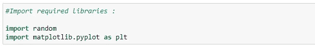**

**图 38:导入赌场问题所需的库。**

****2。玩家下注:****

**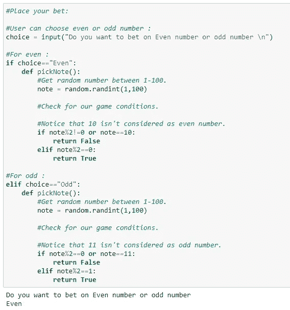**

**图 39:为奇数和偶数下注。**

****3。主要功能:****

**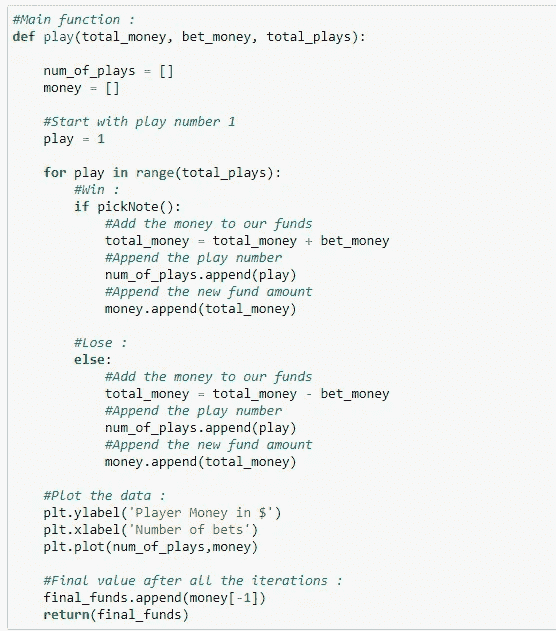**

**图 40:将蒙特卡洛方法应用于我们的赌场问题。**

****4。最终输出:****

**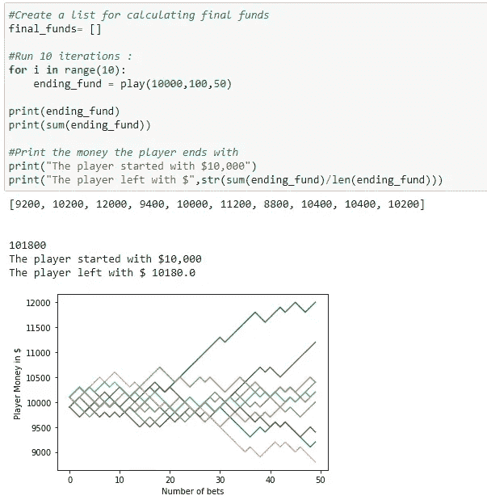**

**图 41:计算和显示最终值。**

****5。运行 1000 次迭代:****

**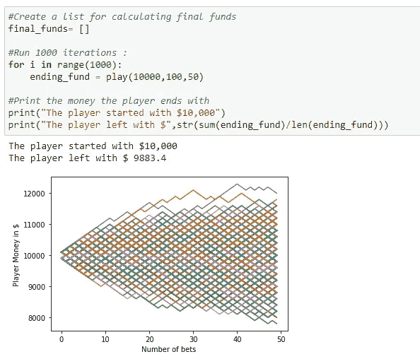**

**图 42:运行我们的函数 1000 次。**

****6。赌注数= 5:****

**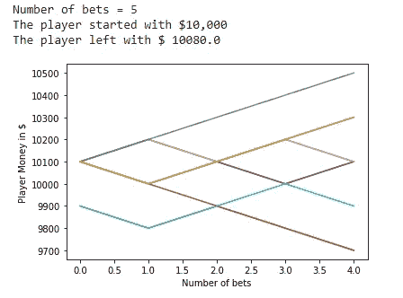**

**图 43:下注数等于 5 时结果的数据可视化。**

**7。赌注数= 10:**

**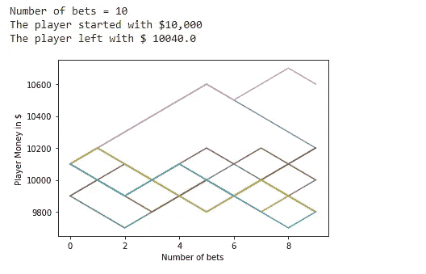**

**图 44:下注数等于 10 时结果的数据可视化。**

**8。下注数= 1000:**

**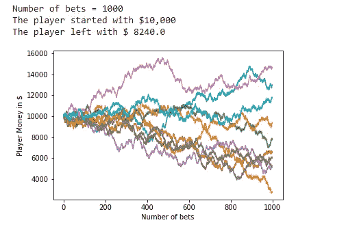**

**图 45:下注数等于 1000 时结果的数据可视化。**

**9。下注数= 5000:**

**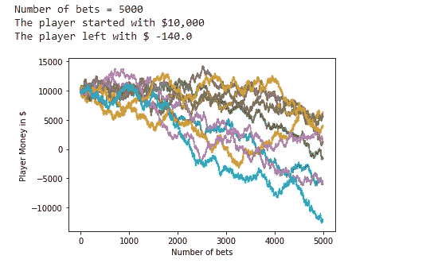**

**图 46:下注数等于 5000 时结果的数据可视化。**

**10。下注数= 10000:**

**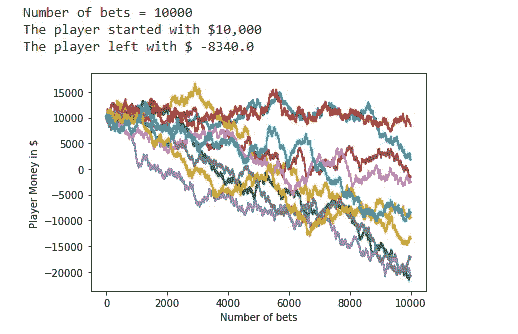**

**图 47:下注数等于 10000 时结果的数据可视化。**

**从上面的实验中，我们可以看到，如果玩家在这些游戏上下注较少，他们就有更大的机会获利。在某些情况下，我们会得到负数，这意味着玩家失去了所有的钱，积累了债务，而不是盈利。**

**请记住，这些百分比是我们的比喻游戏，他们可以修改。**

# **结论:**

**就像任何预测模型一样，模拟的好坏取决于我们所做的估计。重要的是要记住，蒙特卡洛模拟只代表概率，而不是确定性。然而，蒙特卡洛模拟在预测未知的未来时是一个有价值的工具。**

> **📚查看我们的[神经网络教程](https://towardsai.net/neural-networks-with-python)从头开始，详细介绍 Python 代码和数学。📚**

**

给普拉蒂克买杯咖啡！** 

****免责声明:**本文表达的观点为作者个人观点，不代表卡内基梅隆大学的观点。这些文章并不打算成为最终产品，而是当前思想的反映，同时也是讨论和改进的催化剂。**

**通过[向艾](https://towardsai.net/)发布**

# **推荐文章**

**一、[机器学习和数据科学最佳数据集](https://towardsai.net/p/machine-learning/best-datasets-for-machine-learning-and-data-science-d80e9f030279)
二。[艾薪资冲天](http://towardsai.net/ai-salaries)三世
。[什么是机器学习？](https://towardsai.net/p/machine-learning/what-is-machine-learning-ml-b58162f97ec7)
四世。[2020 年最佳机器学习硕士项目](https://towardsai.net/ml-masters)
五、[2020 年最佳机器学习博士项目](https://towardsai.net/ml-phd)
六、[最佳机器学习博客](https://towardsai.net/p/machine-learning/best-machine-learning-blogs-6730ea2df3bd)
七。[关键机器学习定义](https://towardsai.net/p/machine-learning/key-machine-learning-ml-definitions-43e837ec6add)
八。[用机器学习在 0.05 秒内破解验证码](https://towardsai.net/ml-captcha)
九。[机器学习 vs. AI 及其重要区别](https://towardsai.net/p/machine-learning/machine-learning-vs-ai-important-differences-between-them/robiriondo/3432/)
十.[确保成功开创机器学习事业(ML)](https://towardsai.net/p/machine-learning/moocs-vs-academia-ensuring-success-starting-in-a-machine-learning-ml-career-304b2e42315e)
XI。[机器学习算法初学者](https://towardsai.net/p/machine-learning/machine-learning-algorithms-for-beginners-with-python-code-examples-ml-19c6afd60daa)
十二。[神经网络从零开始详细用 Python 代码和数学](https://towardsai.net/neural-networks-with-python)
XIII。[用 Python 构建神经网络](https://towardsai.net/p/machine-learning/building-neural-networks-with-python-code-and-math-in-detail-ii-bbe8accbf3d1)
XIV。[神经网络的主要类型](https://towardsai.net/p/machine-learning/main-types-of-neural-networks-and-its-applications-tutorial-734480d7ec8e)
十五。[用 Python 编写的蒙特卡洛模拟教程](https://towardsai.net/p/machine-learning/monte-carlo-simulation-an-in-depth-tutorial-with-python-bcf6eb7856c8)
XVI。[Python 自然语言处理教程](https://towardsai.net/p/nlp/natural-language-processing-nlp-with-python-tutorial-for-beginners-1f54e610a1a0)**

# **参考资料:**

**[1]概率问题语录，21 部电影，[https://www . IMDB . com/title/TT 0478087/characters/nm 0000228 #语录](https://www.imdb.com/title/tt0478087/characters/nm0000228#quotes)**

**[2]乔治-路易·莱克勒克，布丰伯爵，维基百科，h[ttps://en . Wikipedia . org/wiki/乔治-路易 _ 莱克勒克，_ 布丰伯爵](https://en.wikipedia.org/wiki/Georges-Louis_Leclerc,_Comte_de_Buffon)**

**[3]布冯的针头问题，维基百科，【https://en.wikipedia.org/wiki/Buffon%27s_needle_problem **

# **资源:**

**[Github 教程库](https://github.com/towardsai/tutorials/tree/master/monte_carlo_simulation)。**

**[Google Collab 实现](https://colab.research.google.com/drive/1ZniHyaE7AqkNYpypw8Qn7dGv62MlSrGG?usp=sharing)。**