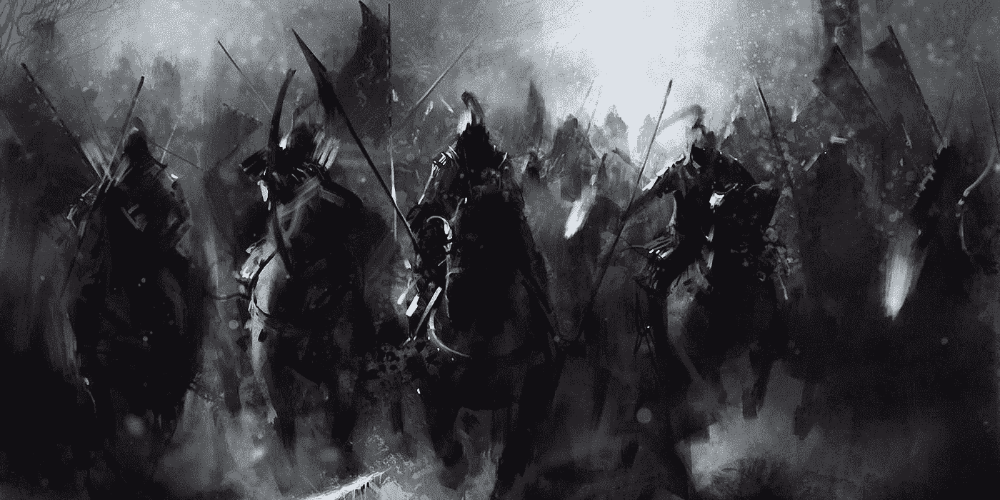
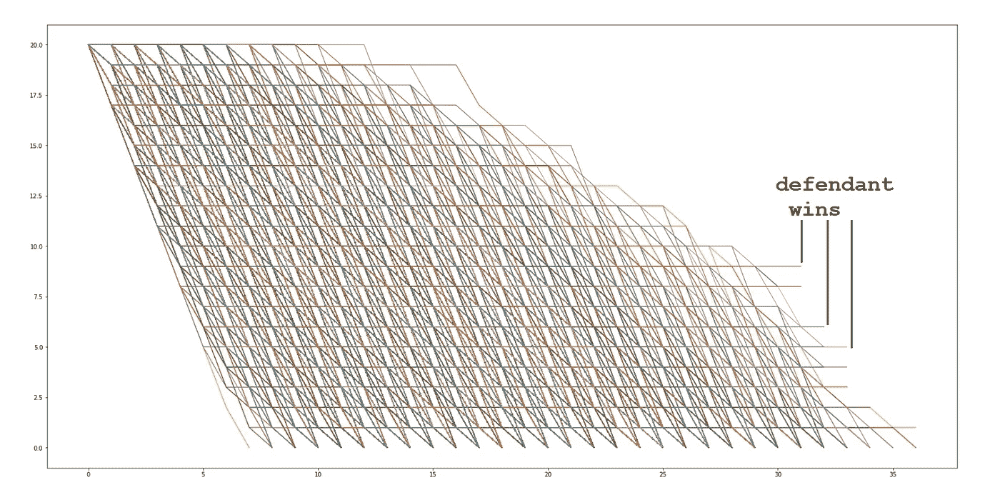
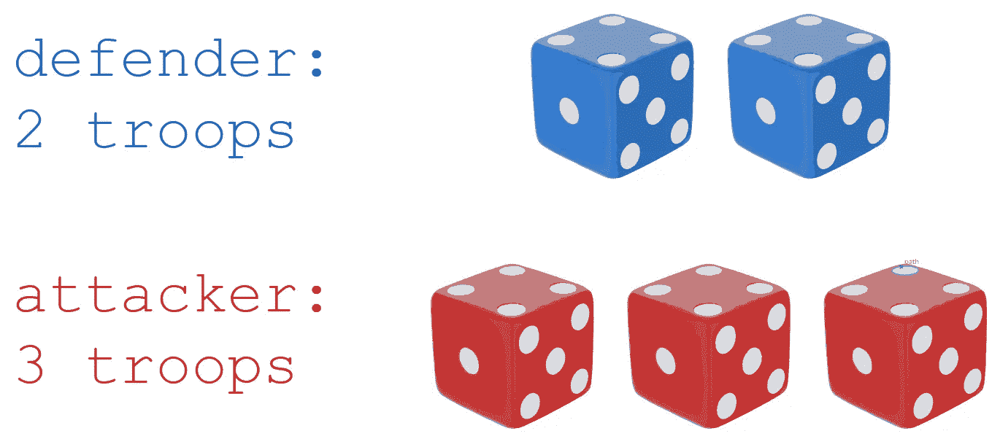
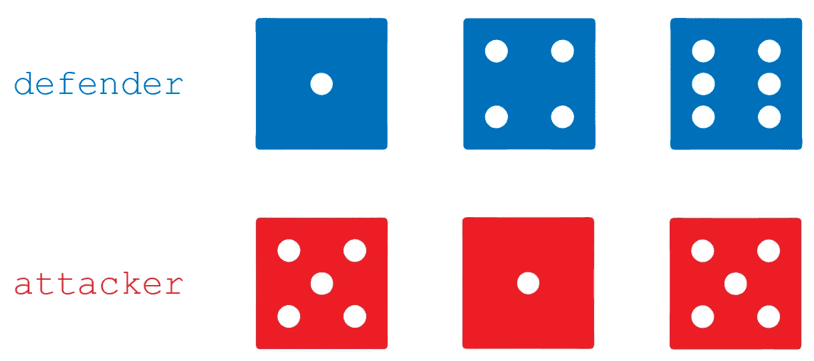
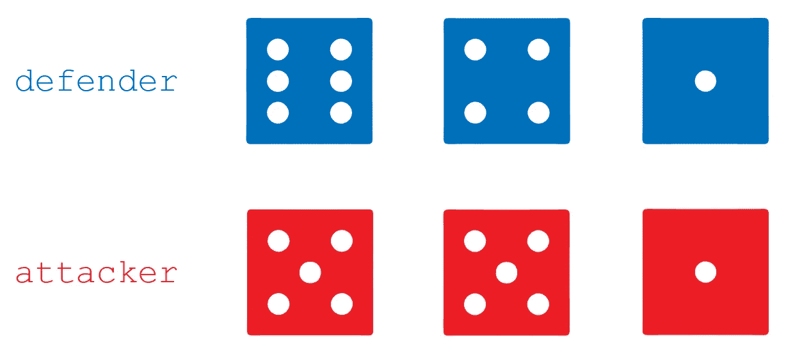
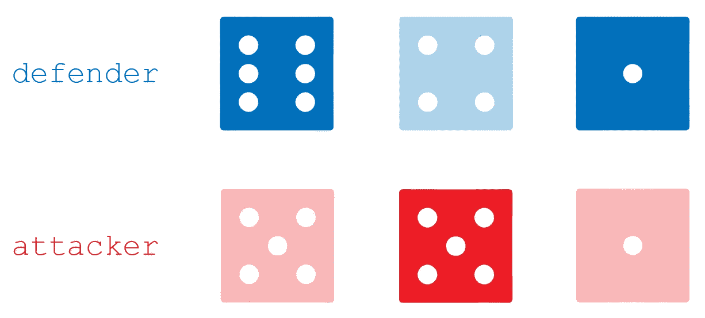
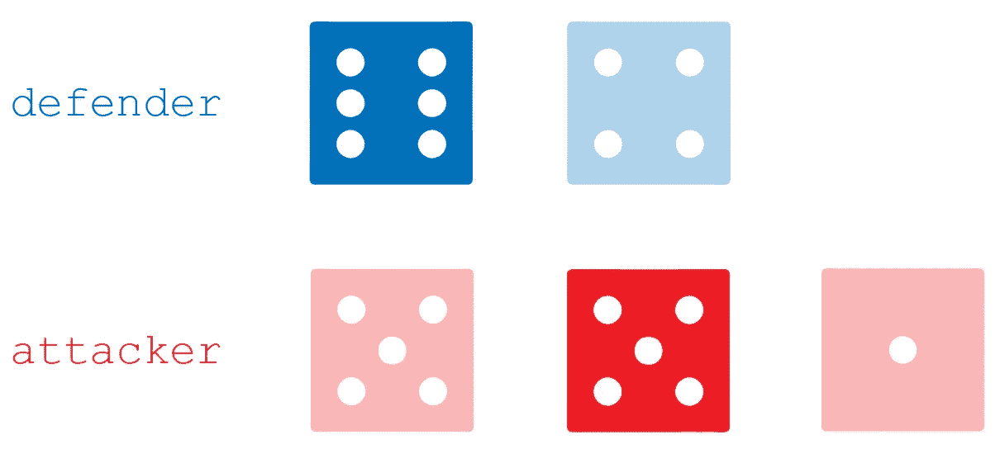
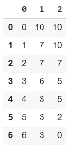
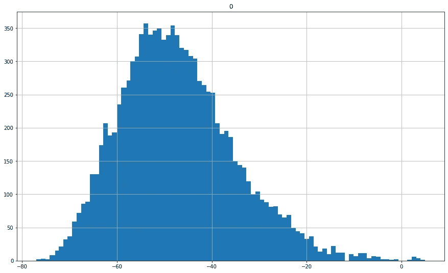

# 骰子战的蒙特卡罗模拟:风险，80 个攻击者对 20 个防御者

> 原文：<https://pub.towardsai.net/monte-carlo-simulation-on-dice-battles-risk-80-attackers-vs-20-defenders-df6700e44763?source=collection_archive---------2----------------------->

## [统计](https://towardsai.net/p/category/statistics)，[教程](https://towardsai.net/p/category/tutorial)

## 为决策进行模拟。全部代码可在我的回购[。](https://github.com/arditoibryan/Projects/blob/master/20200810_RISK_simulation/Risk_Battle.ipynb)

在本教程中，我将通过对同样的战斗进行一百万次模拟来探索随机过程和模拟的领域，看看什么是最好和最坏的情况。



这将是最终结果:



100.000 模拟，全战报道

# 间谍软件

这个实验的规则取自 SPQRisk，这是一个风险游戏的版本，但背景是罗马帝国。这是我和朋友一起长大时玩的最有趣的游戏之一。


## 这就是战斗的方式

游戏是轮流组织的。每个玩家都有一定数量的部队可以用来攻击其他玩家(然后结盟、背叛、威胁……)。

当一个玩家在敌对地区部署他的部队时，战斗开始了。

*   每个玩家可以掷骰子，掷骰子的数量与战斗中可用军队的数量一样多，最多 3 个



骰子极限

也就是说，如果防御者有 2 支部队，而敌人有 3 支，他最多可以掷 2 个骰子，而拥有 3 支部队的攻击者可以掷 3 个。再比如，如果防御者有 3 个部队，敌人有 5 个，防御者和进攻者都要用 3 个骰子。



第一次掷骰子，骰子还没点

*   掷骰子后，每个玩家将按降序排列



按升序掷骰子

*   比较结果:较低的骰子点数会输，掷骰子点数较低的玩家所拥有的队伍会被杀死。
*   因为防守有优势，在得分相等的情况下防守获胜



*   在骰子数量不一致的情况下，在分类发生后，多余的骰子被排除



*   当一个玩家没有多余的部队或者攻击者撤退时，比赛结束

到目前为止一切顺利。正如你所看到的，计算一场战斗的结果的概率是一个非常复杂的问题。手写公式是做不到的(至少我还没到那一步)。本文的目的是创建一个算法，能够按照上述规则执行多达百万次的模拟:

*   最接近一个事件的概率分布
*   在做任何决定之前，让我们了解我们有多少劣势或优势

## 导入库

```
import random
import pandas as pd
```

## 骰子滚动器

```
def dice_roll():
  return random.randint(1, 6)
```

# 模拟一场比赛

每一次攻击都可能有不确定的人数。双方可以有 3 个人，通过掷骰子一次来完成整个比赛。但是，如果玩家都是 10 个部队呢？很简单，他们会继续掷骰子，直到他们中的一个结束队伍或者攻击者决定撤退。因此，每场战斗都是一系列不同的比赛，每一次掷骰子都会有至少一方的伤亡。

为了模拟一场比赛，我将从模拟一场战斗开始。根据每个玩家掷骰子的数量，进行掷骰子，并且在每个回合中部队都被消灭。然后，我将在一个**递归过程**中再次调用该战斗，将仍然站立的人数作为变量传递。

```
def simulate_battle(annalis, iteration, white_army, black_army, return_winner):
  annalis.append([iteration, white_army, black_army])
  iteration += 1if white_army == 0 or black_army == 0:
    if return_winner == 'all_data':
      #return entire battle
      return annaliselif return_winner == 'only_winner':
      #print(white_army, black_army)
      #only return winner
      if white_army > black_army:
        return 1
      else:
        return 0elif return_winner == 'man_killed':
      return white_army - black_army
```

有了上面的条件，算法会一直运行，直到其中一个玩家完成了它的部队。例如，如果我将白军和黑军变量设为 10，10(每个玩家 10 人)，第一次模拟将会有伤亡，导致防守者损失 1 人，进攻者损失 2 人。因此，该函数将再次调用自身，但这一次使用输入:9，8。

```
 #make rolls for white and black according to the quantity of their men
  white_rolls = []
  if white_army >= 3:
    #then make 3 rolls
    for _ in range(0, 3):
      white_rolls.append(dice_roll())
  elif white_army == 2:
    #then only 2 rolls
    for _ in range(0, 2):
      white_rolls.append(dice_roll())
  elif white_army == 1:
    #the only 1 roll
    for _ in range(0, 1):
      white_rolls.append(dice_roll())black_rolls = []
  if black_army >= 3:
    #then make 3 rolls
    for _ in range(0, 3):
      black_rolls.append(dice_roll())
  elif black_army == 2:
    #then only 2 rolls
    for _ in range(0, 2):
      black_rolls.append(dice_roll())
  elif black_army == 1:
    #the only 1 roll
    for _ in range(0, 1):
      black_rolls.append(dice_roll())#sort both of them
  white_rolls, black_rolls = sorted(white_rolls, reverse=True), sorted(black_rolls, reverse=True)
  #equal size
  minimum = min(len(white_rolls), len(black_rolls))
  white_rolls, black_rolls = white_rolls[:minimum], black_rolls[:minimum]
```

## 保存每次迭代

每次战斗结束后，我都会记录每次迭代的伤亡情况。

```
#kill men
  #white = defender
  #black = attacker
  for fighter in range(0, 3):
    try:
      if white_rolls[fighter] >= black_rolls[fighter]:
        #kill black
        black_army -= 1
      else:
        white_army -= 1
    except:
      pass
  #print(str(white_army) + " defenders remaining", str(black_army) + " attackers remaining")
```

现在一场战斗结束了。我将需要重复这个过程，直到两个玩家中的一个没有更多的部队进攻或防守。我将通过再次调用函数来使用递归，直到满足这个条件。

```
 return simulate_battle(annalis, iteration, white_army, black_army, return_winner)
```

# 模拟整个战斗

现在，我只需要调用函数。我可以自由选择从模拟中提取哪些指标。

## 返回整个战斗

通过运行下面的代码，我甚至可以通过查看每个回合的结果来模拟整个战斗。

```
pd.DataFrame(simulate_battle(list(), 0, 10, 10, ‘all_data’))
```

*   列 0:迭代
*   第一栏:捍卫者
*   第二栏:攻击者



模拟整个战斗，返回数据帧

## 返回伤亡人数

例如，“man_killed”返回每个模拟中被杀死的防御者的数量。

```
simulate_battle(list(), 0, 10, 10, 'man_killed')
```

如果模拟的结果是-3，这意味着从逻辑上讲，当一个防御者失去了他所有的 10 个人时，模拟已经结束，并且仍然有 3 个人支持攻击者。

相反，如果函数返回+3，则相反的情况有效:攻击者已经损失了 10 个人，而仍然有 3 个人站在防御者一边。

## 赢与输的回归

```
#defender wins vs. defender loss
defender = 0
attacker = 0
for _ in range(0, 1000000):
  out = simulate_battle(list(), 0, 10, 10, 'only_winner')
  if out == 1:
    defender += 1
  else:
    attacker += 1print(defender, attacker, defender/attacker)
809686 190314 4.2544741847683305
```

在 10 对 10 的战斗中，防守方的胜率是进攻方的 4 倍多。

# 80 名进攻者对 20 名防守者

当我还是个孩子的时候，我记得在一场与我的一个朋友的战斗中，他用他 80 人组成的庞大军队攻击了我的 20 个人，我差点就活了下来。光荣的战斗之后，他只剩下 5 英镑。我一直很好奇如何计算那场战斗结果的概率。

```
#man killed per simulation
man_killed = list()
for _ in range(0, 1000000):
  man_killed.append(simulate_battle(list(), 0, 20, 80, 'man_killed'))
```

因为问题的复杂性使我无法通过公式计算概率，所以我可以通过大量的模拟来获得相同的结果。为了获得我正在搜索的结果，我需要在所有的模拟中找出，哪些模拟返回了指标“man _ killed”< 5。这样做，我会孤立所有对我有利的案件。用这个数字除以模拟的总数，我可以找到我的概率，至少和我小时候在那个游戏中的成功程度一样。

```
#number of points after a treshold
man_killed_ = pd.DataFrame(sorted(man_killed, reverse=True))
man_killed_ = man_killed_.loc[man_killed_[0] >= -5]#successful simulations where defender has won or lost, but attackers remained with less or equal 5
print(len(man_killed)-man_killed_.shape[0], man_killed_.shape[0]/len(man_killed))
997746 0.002254
```

# 图形结果

## 绘制 PDF(概率分布函数)

```
pd.DataFrame(man_killed).hist(bins=87, figsize=(15, 9))
```



## 绘制时间序列图

到目前为止，我只画出了模拟的结果。因为在 main 函数中，我允许自己存储每个模拟的结果，我可以将它们绘制成时间序列。

```
#for one simulation only record white remaining
all_battles = list()
for _ in range(0, 100000):
  all_battles.append([x[1] for x in simulate_battle(list(), 0, 20, 80, 'all_data')])
pd.DataFrame(all_battles)all_battles = pd.DataFrame(all_battles)
all_battles = all_battles.drop_duplicates()
all_battlesall_battles = all_battles.transpose()#graph all stocks
import matplotlib.pyplot as pltplt.figure(figsize=(28, 14))
fig = plt.plot(all_battles.index, all_battles, lw=1, alpha=1)
```


100.000 模拟，全战报道(错别字:应该是防御者)