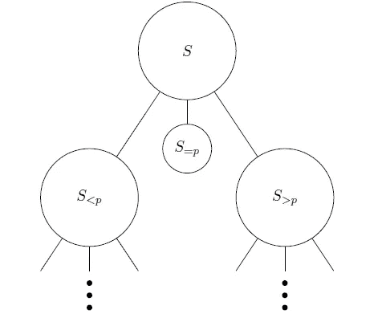

# 机器学习世界中的蒙特卡洛 vs 拉斯维加斯

> 原文：<https://pub.towardsai.net/monte-carlo-vs-las-vegas-in-the-world-of-machine-learning-db450ccc78d8?source=collection_archive---------1----------------------->

## [机器学习](https://towardsai.net/p/category/machine-learning)

## 解决机器学习系统中随机性的两个最重要的算法家族。

来源:[https://www . green book . org/Mr/market-research-methodology/what-are-Monte-Carlo-studies/](https://www.greenbook.org/mr/market-research-methodology/what-are-monte-carlo-studies/)

> 我最近创办了一份专注于人工智能的教育时事通讯，已经有超过 80，000 名订户。《序列》是一份无废话(意思是没有炒作，没有新闻等)的 ML 导向时事通讯，需要 5 分钟阅读。目标是让你与机器学习项目、研究论文和概念保持同步。请通过订阅以下内容来尝试一下:

 [## 序列

### 该序列解释了主要的机器学习概念，让你与最相关的项目和最新的…

thesequence.substack.com](https://thesequence.substack.com/) 

大多数机器学习从业者都熟悉蒙特卡罗方法。作为机器学习教科书中无处不在的元素，蒙特卡罗方法在机器学习系统的发展中发挥了超级重要的作用。

虽然基于蒙特卡罗的技术已经存在了一段时间，但深度学习系统中常见的多维数据集的爆炸使其相关性达到了另一个水平。蒙特卡罗技术属于随机算法的范畴，它试图为一个具有一定随机性的问题提供答案。在这个领域，蒙特卡洛方法被视为另一个“赌博天堂”:拉斯维加斯的替代方案。

# **拉斯韦加斯对蒙特卡洛**

蒙特卡洛和拉斯维加斯技术的主要区别在于输出的准确性。拉斯维加斯方法往往总是提供一个准确的答案，而蒙特卡洛方法则返回带有随机误差的答案。显然，蒙特卡罗系统的误差程度随着数据或计算模型等资源的增加而降低。

1979 年，匈牙利计算机科学家 [*拉斯洛·巴拜*](https://en.wikipedia.org/wiki/L%C3%A1szl%C3%B3_Babai) *提出了拉斯韦加斯算法。毫不奇怪，Babai 引入了这个术语，作为只能产生精确结果的蒙特卡罗方法的对偶。*

拉斯维加斯算法的一个经典例子是随机快速排序算法，它随机选取一个中枢，然后将元素分成三组:所有小于中枢的元素、所有等于中枢的元素和所有大于中枢的元素。

随机快速排序方法往往会消耗大量资源，但却能保证得到准确的答案。因此，在潜在答案数量较少的情况下，倾向于推荐使用拉斯维加斯方法。

尽管拉斯维加斯模型在理论上看起来很棒，但它们在许多深度学习场景中不切实际，这些场景太大了，永远无法指望产生准确的答案。蒙特卡洛技术通过提高计算图的效率，在答案中引入一定程度的随机性，解决了拉斯维加斯算法的一些限制。毫不奇怪，蒙特卡罗技术在处理多维、大容量数据集的深度学习场景中变得非常流行。

蒙特卡洛方法在深度学习系统中的主要应用之一是从代表数据集的一些概率分布中抽取样本。这通常被称为蒙特卡罗抽样，在历史上被广泛用于解决高度复杂的数据估计问题。在一个最臭名昭著的例子中，法国数学家皮埃尔·西蒙·拉普拉斯曾经提出了一种使用蒙特卡罗抽样来估计圆周率的方法。

在深度学习系统的背景下，蒙特卡罗采样方法具有非常众所周知的应用。例如，通常利用蒙特卡罗采样来选择近似原始数据集的训练数据集的分布。蒙特卡罗方法也在正则化或优化技术中发挥作用，这些技术在不评估整个计算图的情况下估计输出数据集。