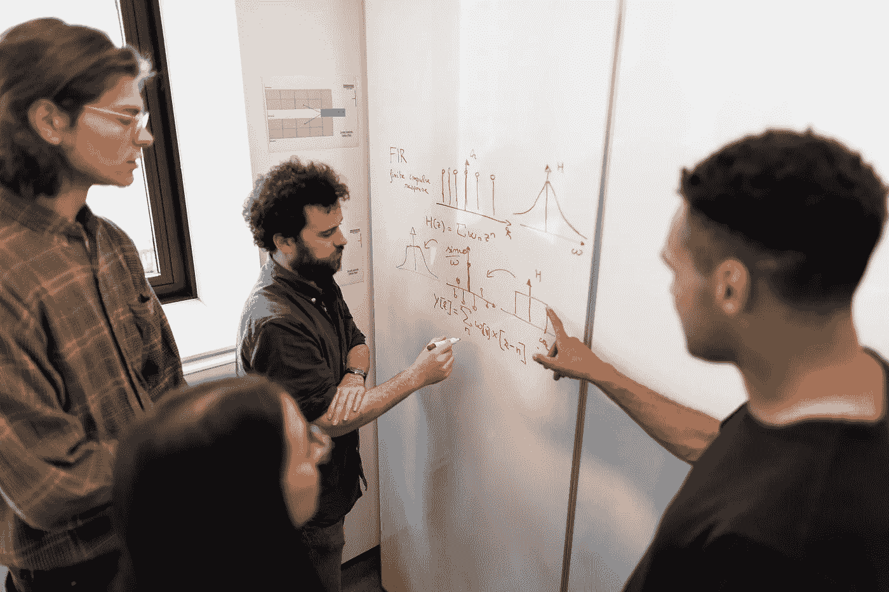

# 确保成功开始机器学习生涯(ML)

> 原文：<https://pub.towardsai.net/moocs-vs-academia-ensuring-success-starting-in-a-machine-learning-ml-career-304b2e42315e?source=collection_archive---------0----------------------->

## [机器学习](https://towardsai.net/p/category/machine-learning)

## [机器学习](https://mld.ai/mldcmu) (ML)工业界和学术界对职业的需求如此之高，你如何保证自己能在这样一个竞争激烈的领域取得成功？

来源: [Pexels](https://www.pexels.com/@thisisengineering)

[**机器学习**](https://mld.ai/mldcmu) 许多人都在寻找职业，从研究人员、行业专家到机器学习爱好者。每个人都在尝试使用机器学习来为这样一个快速发展的领域做出贡献。

拥有海量开放在线课程(MOOCs)提供机器学习路径从[**Coursera**](https://mktg.best/40ebo)**[**uda city**](https://mktg.best/udacity-school-ai)**[**edX**](https://mktg.best/tuk2f)**等**。领导学术研究机构，如 [**卡内基梅隆大学、伯克利大学、麻省理工学院、佐治亚理工学院等**](https://medium.com/towards-artificial-intelligence/best-universities-to-pursue-a-phd-in-machine-learning-in-the-us-artificial-intelligence-ai-ml-ffb745a1554a) 。****

> ****有这么多选择，你怎么知道该走哪条路呢？****

****看情况。就机器学习的职业生涯而言，如果你权衡对你来说至关重要的事情，那是最好的。下面，请找出在 MOOC 或大学学习机器学习课程的一些主要区别。****

## ****MOOCs 和学术界的区别****

****MOOCs 往往更宽松，不像学术界那么严谨。它们也不太耗时，最适合那些在全职工作和/或照顾家庭的同时努力学习新东西的忙碌的人。****

****在学术方面从事机器学习职业将更加耗时，更加严谨，并将要求你在整个 [**节目**](https://medium.com/towards-artificial-intelligence/top-universities-to-pursue-a-masters-in-machine-learning-ml-in-the-us-ai-d4a461229fbb) 期间日复一日地尽你所能。****

****MOOCs 可以帮你打开大门，尤其是如果你已经有计算机科学、统计学、数学或其他 STEM 相关领域的背景。然而，学术机器学习程序与 [**最先进的研究和项目**](https://mktg.best/machine-learning-blog) 一起工作，这不仅会帮助你进入机器学习者的大门，还会让你在完成程序后立即获得成为该领域领导者所需的专业知识。****

****然而，这完全取决于你对 ML 的热情。有很多了不起的人，他们的背景是 STEM 领域，只追求 MOOCs，他们在人工智能行业做得非常好。****

****另一个需要考虑的问题是，你真的热衷于修改数据吗？你会用机器学习模型来做决策吗？—如果答案是肯定的，那么请继续前进，追随你的梦想，成为一名机器学习者。****

****例如，在学术方面，卡耐基梅隆大学提供了一种 [**自我评估测试**](http://www.cs.cmu.edu/~wcohen/10-601/self-assessment/Intro_ML_Self_Evaluation.pdf) ，可以让你了解即将进入他们的 [**机器学习硕士项目**](https://mld.ai/mlmscv) **的学生的预期背景。**这样的提到需要各种类型的数学，比如多元微积分、线性代数、初等概率、统计学至少到本科水平。****

****他们的 [**网站**](https://mld.ai/mlmscv) 也提到，即将入学的学生必须有很强的计算机科学背景，以及对复杂性理论的扎实理解和良好的编程技能。****

****然而，如果你没有这样的背景，并且你想在一所大学 攻读 [**机器学习项目，请不要放弃申请，因为大多数精英大学在录取学生时采取“整体方法”——强调学生的整体，而不仅仅是选择信息。**](https://medium.com/towards-artificial-intelligence/best-universities-to-pursue-a-phd-in-machine-learning-in-the-us-artificial-intelligence-ai-ml-ffb745a1554a)****

## ****结论****

****如果你真的对机器学习的科学领域着迷，那么由你来决定最有利于你的职业生涯并符合你需求的道路。尤其是现在，当 [**机器学习的薪水**](https://towardsai.net/ai-salaries) 继续疯涨的时候。****

****感谢您的阅读。我们随时欢迎您的反馈。****

******免责声明:**本文所表达的观点仅代表作者个人，不代表卡耐基梅隆大学或其他(直接或间接)与作者相关的公司的观点。这些文章并不打算成为最终产品，而是当前思想的反映，同时也是讨论和改进的催化剂。****

****你可以在 [**中**](https://medium.com/@robiriondo) ， [**Instagram**](https://www.instagram.com/robiriondo) ， [**Twitter**](https://twitter.com/robiriondo) ， [**脸书**](https://www.facebook.com/robiriondo) ， [**LinkedIn**](https://www.linkedin.com/in/robiriondo) 上找到我，或者通过我的 [**SEO 公司**](https://www.daibuilds.com/seo-company/) 。****

# ****资源****

## ****机器学习的学术途径:****

**** [## 2020 年最佳机器学习硕士项目

### 美国最佳机器学习硕士项目。

towardsai.net](https://medium.com/towards-artificial-intelligence/top-universities-to-pursue-a-masters-in-machine-learning-ml-in-the-us-ai-d4a461229fbb)  [## 2020 年最佳机器学习博士项目

### 美国攻读机器学习博士的最佳大学。

towardsai.net](https://medium.com/towards-artificial-intelligence/best-universities-to-pursue-a-phd-in-machine-learning-in-the-us-artificial-intelligence-ai-ml-ffb745a1554a) 

## 在线课程:

机器学习导论| [马特·葛姆雷](http://www.cs.cmu.edu/~mgormley/) | [卡耐基·梅隆大学计算机科学学院](https://cs.cmu.edu/)|[http://www.cs.cmu.edu/~mgormley/courses/10601/](http://www.cs.cmu.edu/~mgormley/courses/10601/)

AI for Everyone |吴恩达| Coursera |[https://www.coursera.org/learn/ai-for-everyone](https://mktg.best/dxh4u)

机器学习速成班| Google |[https://developers . Google . com/machine-Learning/Crash-Course/](https://mktg.best/2rq0b)

机器学习简介| uda city |[https://www.udacity.com/course/intro-to-machine-learning-ud 120](https://mktg.best/myi1v)

机器学习培训|亚马逊网络服务|[https://AWS . Amazon . com/Training/Learning-paths/machine-Learning/](https://mktg.best/0hnh5)

机器学习入门| Coursera |【https://www.coursera.org/learn/machine-learning T5

## 书籍:

机器学习| Tom Mitchell | McGraw Hill，1997 |卡内基梅隆大学|[http://www . cs . CMU . edu/AFS/cs . CMU . edu/user/Mitchell/FTP/ml book . html](http://www.cs.cmu.edu/afs/cs.cmu.edu/user/mitchell/ftp/mlbook.html)

# 推荐文章

一、[机器学习和数据科学最佳数据集](https://towardsai.net/p/machine-learning/best-datasets-for-machine-learning-and-data-science-d80e9f030279)
二。[艾薪资冲天](http://towardsai.net/ai-salaries)三世
。[什么是机器学习？](https://towardsai.net/p/machine-learning/what-is-machine-learning-ml-b58162f97ec7)
四世。[2020 年最佳机器学习硕士项目](https://towardsai.net/ml-masters)
五、[2020 年最佳机器学习博士项目](https://towardsai.net/ml-phd)
六、[最佳机器学习博客](https://towardsai.net/p/machine-learning/best-machine-learning-blogs-6730ea2df3bd)
七。[关键机器学习定义](https://towardsai.net/p/machine-learning/key-machine-learning-ml-definitions-43e837ec6add)
八。[用机器学习在 0.05 秒内破解验证码](https://towardsai.net/ml-captcha)
九。[机器学习 vs. AI 及其重要区别](https://towardsai.net/p/machine-learning/machine-learning-vs-ai-important-differences-between-them/robiriondo/3432/)
十.[确保成功开创机器学习事业(ML)](https://towardsai.net/p/machine-learning/moocs-vs-academia-ensuring-success-starting-in-a-machine-learning-ml-career-304b2e42315e)
XI。[机器学习算法初学者](https://towardsai.net/p/machine-learning/machine-learning-algorithms-for-beginners-with-python-code-examples-ml-19c6afd60daa)
十二。[神经网络从零开始详细用 Python 代码和数学](https://towardsai.net/neural-networks-with-python)
XIII。[用 Python 构建神经网络](https://towardsai.net/p/machine-learning/building-neural-networks-with-python-code-and-math-in-detail-ii-bbe8accbf3d1)
XIV。[神经网络的主要类型](https://towardsai.net/p/machine-learning/main-types-of-neural-networks-and-its-applications-tutorial-734480d7ec8e)
十五。[用 Python 编写的蒙特卡洛模拟教程](https://towardsai.net/p/machine-learning/monte-carlo-simulation-an-in-depth-tutorial-with-python-bcf6eb7856c8)
XVI。[Python 自然语言处理教程](https://towardsai.net/p/nlp/natural-language-processing-nlp-with-python-tutorial-for-beginners-1f54e610a1a0)****