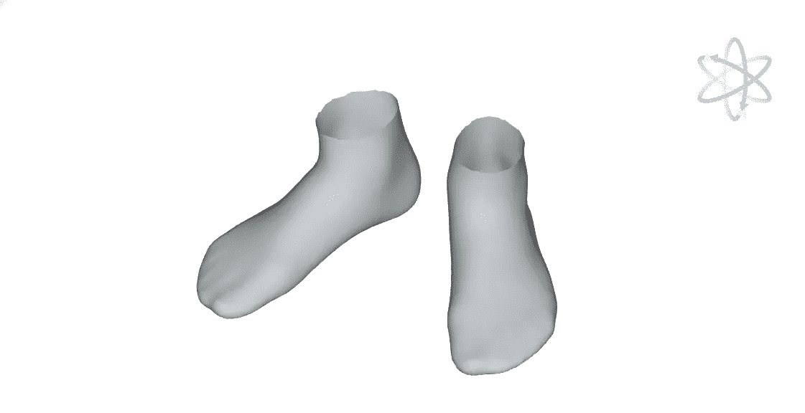
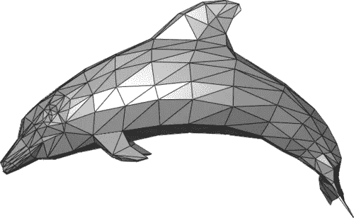
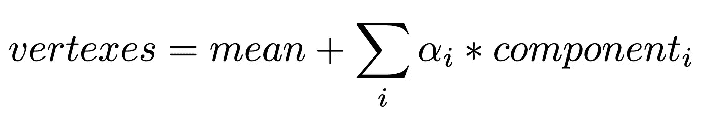

# 变形模型解释

> 原文：<https://pub.towardsai.net/morphable-model-explained-54dce55604be?source=collection_archive---------3----------------------->

## [计算机视觉](https://towardsai.net/p/category/computer-science)，[机器学习](https://towardsai.net/p/category/machine-learning)

## 可变形 3D 模型是具有直观用户界面的创成式模型。让我们看看它们是如何工作的，然后建造一个

Neatsy 应用程序构建的 3D 脚模型。

3D 建模正在成为计算机科学的重要组成部分。自最引人注目的论文之一——3D 变形人脸模型首次在 SIGGRAPH’99 上发表以来，已经过去了 20 多年。这篇论文对应用和后续研究都产生了重大的长期影响。在过去的几年里，可变形模型在深度学习的背景下取得了重大进展，并被纳入到许多最先进的人脸分析解决方案中。尽管如此，第一篇论文对于为不同对象构建有意义的模型来说是足够强大和可扩展的。让我们看看这篇论文是关于什么的。

任务是模拟人脸。作者介绍了一种创建具有直观用户界面的创成式模型的技术。生成模型是指生成面的算法，并有一些参数来控制输出。算法的设计提出这些参数必须是简单的并且能够被人类理解。

我们能把这种技术用于其他物体吗？我们可以。在 Neatsy 中，我们为人类的脚创建了一个，你可以在下面的图中尝试一下。

脚的可变形模型。每次换脚对应一个分量。

现在，让我们弄清楚它是如何工作的。首先，我们需要了解什么是 3D 模型。基本的 3D 模型由两部分组成，顶点(空间中的点)和面(由顶点形成的三角形)。顶点定义模型面的形状，并使模型相连。顶点和面一起称为网格。网格中的顶点越多，3D 对象的结果就越详细。

由 [Chrschn](https://en.wikipedia.org/wiki/User:Chrschn) 制作的 3D 模型示例

在某种意义上，3D 模型已经参数化了。每个顶点中的每个坐标都是我们可以改变的参数，但这些改变对我们来说没有意义，因为它们会破坏对象的结构。因此，在所有可能改变模型的方法中，我们希望创造出最合理的方法。从这个角度来看，我们需要对我们的模型进行分解。分解任务是一个经典的机器学习任务。它解决的问题是降维降噪。这个任务有很多解决方案。其中最受欢迎的是 PCA。

PCA 对我们来说是一个非常好的选择，因为它解决的任务被公式化为:“找到一个坐标系，使得数据的一些标量投影的最大方差位于第一个坐标上(称为第一主分量)，第二个最大方差位于第二个坐标上，以此类推。”换句话说，PCA 找到数据中最大变化的向量。

我们来看看 PCA。PCA 采用(n，d)形状的矩阵，其中 n 是对象的数量，d 是特征的数量。在我们的例子中，每个物体都是一只被扫描的脚，每个特征都是一个顶点坐标。所以特征的数量将是 3⋅v，其中 v 是顶点的数量。矩阵 X 的关键特性是每一列必须匹配一个特定的点坐标。例如，列中的所有要素必须是拇指手指边缘的 x 坐标。因此，我们数据集中的所有扫描必须具有相同数量的点，并且这些点必须在所有扫描中以相同的方式排序。作为一个副作用，我们获得了具有相同面的数据集。为脚收集这样一个数据集是一个复杂而有趣的故事，但我们现在将跳过它。如果您愿意，您可以在原始论文中找到人脸模型的数据集细节。

现在，当我们有一个数据集时，我们需要对我们的数据应用 PCA。PCA 在许多包中实现。我们将在 [sklearn.decomposition](https://www.google.com/url?q=https://www.google.com/url?q%3Dhttps://scikit-learn.org/stable/modules/classes.html%2523module-sklearn.decomposition%26amp;sa%3DD%26amp;ust%3D1605191997292000%26amp;usg%3DAOvVaw1A3Y6WECqD-0FjVrEOlS_m&sa=D&ust=1605191997302000&usg=AOvVaw1t9JwwDIGXG0dK1e0kevZ0) 中使用符号。我们对 3 个领域感兴趣。

1.  PCA.mean_ —这是一个平均脚模型。我们将使用它作为我们的变形模型的零点。
2.  PCA . components _—这是一个向量数组，指定最大变化的方向。
3.  PCA.explained _ variance _ ratio _ 此数组包含每个 PCA 组件的重要性。查看这些值，我们可以决定我们的模型中真正需要多少组件。

现在我们准备好创建模型了。公式是:

作者图片

使用上面的公式，我们制作模型的 alphas 参数，并需要可视化输出。在我们的数据集中，所有的面都是一样的，我们不需要改变它们，所以我们只是把它们添加到结果网格中。
结果生成模型是线性的，乍看之下，它不应该强大到使组件有意义，但它们有很大的现实世界的感觉！正如你在交互图上看到的，第一个参数负责宽度，第二个负责内旋，第三个负责高度。而所有这些参数对于描述脚来说都是残酷的，至少在选择脚对的情况下。

这就是建立这样一个模型的全部内容。现在来说说应用吧。最令人印象深刻的方法之一是将这个模型用于真实世界的对象。由于可变形模型描述了 3D 对象，因此我们可以找到适合照片上对象的模型参数。然后，拟合的模型可以用于不可见部分的插值或改变场景和相机参数。