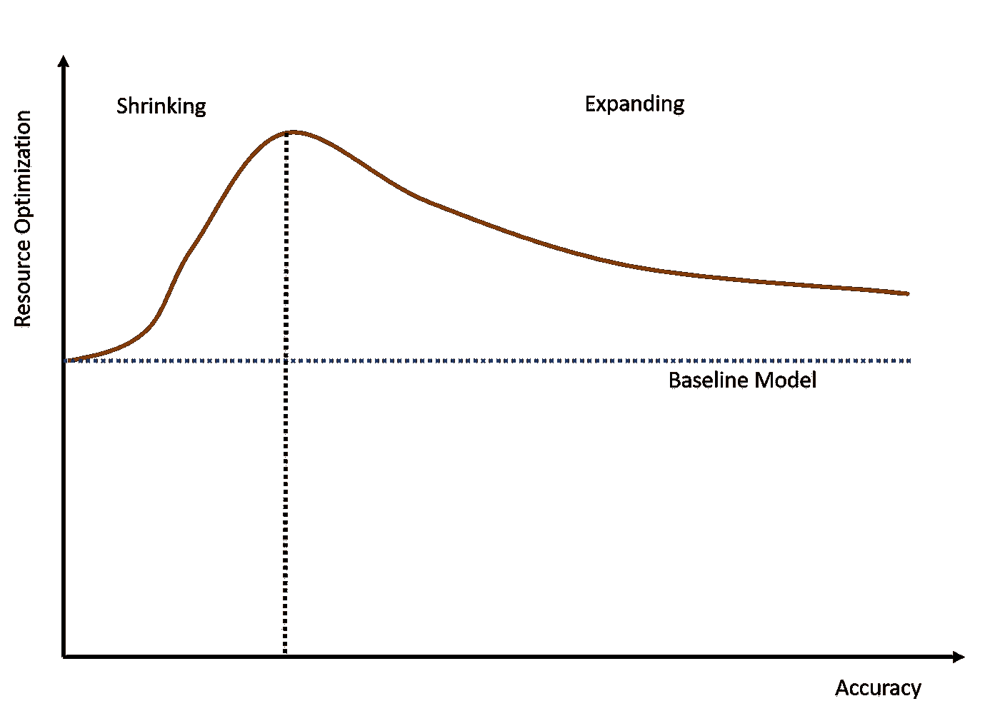
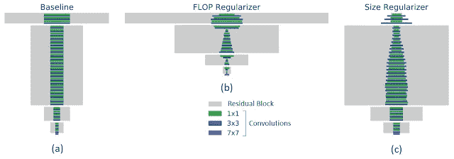
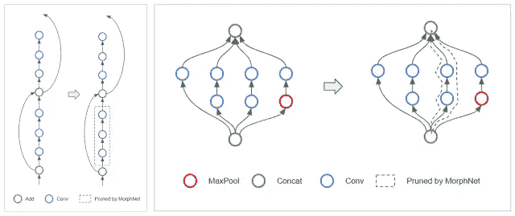
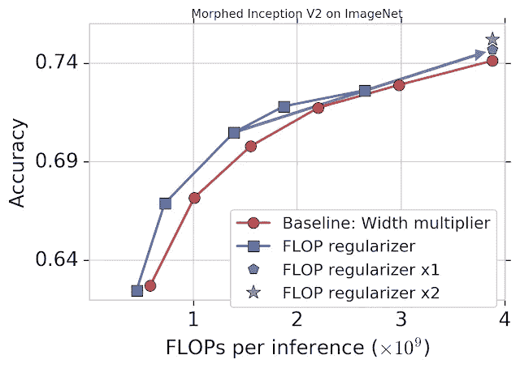

# MorphNet 是 Google 的一个模型，用来建立更快更小的神经网络

> 原文：<https://pub.towardsai.net/morphnet-is-a-google-model-to-build-faster-and-smaller-neural-networks-f890276da456?source=collection_archive---------0----------------------->

## [人工智能](https://towardsai.net/p/category/artificial-intelligence)

## 该模型在优化神经网络结构方面取得了进展。


来源:[https://blog . use journal . com/compress-optimize-your-deep-neural-network-with-pruning-97a 010321637](https://blog.usejournal.com/compress-optimize-your-deep-neural-network-with-pruning-97a010321637)

> 我最近创办了一份专注于人工智能的教育时事通讯，已经有超过 80，000 名订户。《序列》是一份无废话(意思是没有炒作，没有新闻等)的 ML 导向时事通讯，需要 5 分钟阅读。目标是让你与机器学习项目、研究论文和概念保持同步。请通过订阅以下内容来尝试一下:

[](https://thesequence.substack.com/) [## 序列

### 订阅人工智能世界中最相关的项目和研究论文。受到 85，000 多人的信任…

thesequence.substack.com](https://thesequence.substack.com/) 

如今设计深度神经网络更像是艺术而非科学。在深度学习领域，任何给定的问题都可以通过大量的神经网络架构来解决。从这个意义上说，为一个给定的问题从头开始设计一个深度神经网络，在时间和计算资源方面可能会非常昂贵。此外，由于在这个领域缺乏指导，我们经常最终产生对于手头的任务来说不太理想的神经网络架构。大约两年前，来自谷歌[的人工智能(AI)研究人员发表了一篇论文，提出了一种叫做 MorphNet](https://arxiv.org/pdf/1711.06798.pdf) 的方法来优化深度神经网络的设计。

自动神经网络设计是深度学习领域中最活跃的研究领域之一。神经网络架构设计的最传统的方法涉及使用诸如 L1 的方法的稀疏正则化器。虽然这种技术已被证明在减少神经网络中的连接数量方面是有效的，但经常最终产生次优的架构。另一种方法涉及使用搜索技术来为给定的问题找到最佳的神经网络结构。该方法已经能够产生高度优化的神经网络结构，但是它需要大量的反复试验，这经常导致计算上被禁止。因此，神经网络架构搜索只在非常特殊的情况下才被证明是有效的。考虑到前面方法的局限性，我们可以得出有效的自动神经网络设计技术的三个关键特征:

a) **可扩展性:**自动化设计方法应该可扩展到大型数据集和模型。

b) **多因素优化:**自动化的方法应该能够优化针对特定资源的深度神经网络的结构。

c) **最优:**一个自动化的神经网络设计应该产生一个提高性能同时减少目标资源使用的架构。

# MorphNet

Google 的 MorphNet 从一个稍微不同的角度探讨了自动化神经网络架构设计的问题。MorphNet 没有尝试在一个大的设计空间中使用多种架构，而是针对类似的问题从一个现有的架构开始，然后针对手头的任务进行优化。

MorphNet 通过交互式收缩和扩展其结构来优化深度神经网络。在收缩阶段，MorphNet 识别低效神经元，并通过应用[稀疏正则化器](https://en.wikipedia.org/wiki/Structured_sparsity_regularization)将它们从网络中删除，这样网络的总损失函数包括每个神经元的成本。仅仅这样做通常会导致神经网络消耗更少的目标资源，但是通常会实现较低的性能。然而，MorphNet 应用了一个特定的收缩模型，该模型不仅突出了神经网络的哪些层是过度参数化的，而且还突出了哪些层是瓶颈。MorphNet 不是对每个神经元应用统一的成本，而是计算相对于目标资源的神经元成本。随着训练的进行，优化器在计算梯度时会意识到资源成本，从而了解哪些神经元是资源高效的，哪些神经元可以被移除。

MorphNet 的收缩阶段对于产生优化特定资源成本的神经网络是有用的。然而，这种优化可能会以准确性为代价。这就是为什么 MorphNet 使用基于宽度乘数的扩展阶段来扩展所有图层的大小。例如，50%的扩展将导致效率低下的层，该层从 100 个神经元开始并收缩到 10 个，将仅扩展回 15 个，而仅收缩到 80 个神经元的重要层可能扩展到 120 个并具有更多的资源来工作。净效应是将计算资源从效率较低的网络部分重新分配到它们可能更有用的网络部分。

收缩阶段和扩展阶段的组合产生了比原始神经网络更精确的神经网络，同时对于特定的资源仍有所优化。



来源:[https://arxiv.org/pdf/1711.06798.pdf](https://arxiv.org/pdf/1711.06798.pdf)

在最初的迭代中，MorphNet 可以在几个领域提供神经网络架构的即时价值。

**目标正则化:** MorphNet 优化深度神经网络的结构，专注于特定资源的缩减。从概念上讲，该模型提供了比传统正则化技术更有针对性的方法。下图显示了 MorphNet 使用两个标准优化的传统 RestNet-101 架构:FLOPs 和模型大小。MorphNet 针对 FLOPs(中间，FLOPs 减少 40%)或 model size(右侧，重量减少 43%)生成的结构有很大不同。当针对计算成本进行优化时，网络较低层中的较高分辨率神经元往往比较高层中的较低分辨率神经元被修剪得更多。当目标是较小的模型尺寸时，修剪权衡是相反的。



来源:https://arxiv.org/pdf/1711.06798.pdf

**拓扑变形:**MorphNet 创建的一些优化可能会产生全新的拓扑。例如，当一个层有 0 个神经元时，MorphNet 可以通过从网络中剪切受影响的分支来有效地改变网络的拓扑。让我们看看下图，它再次显示了 RestNet 架构的变化。在该示例中，MorphNet 可能会保留跳过连接，但会移除剩余的块，如下图所示(左图)。对于盗梦空间风格的架构，MorphNet 可能会移除整个平行塔，如右图所示。



来源:[https://arxiv.org/pdf/1711.06798.pdf](https://arxiv.org/pdf/1711.06798.pdf)

**可扩展性:**MorphNet 的最大优势之一是，它可以在单次训练中学习新的结构，从而最大限度地减少训练所需的计算资源，并可以扩展到非常复杂的架构。

**可移植性:**MorphNet 生产的网络在技术上是可移植的，并且可以从头开始重新训练，因为权重与学习过程无关。

谷歌将 MorphNet 应用于各种场景，包括使用翻牌优化的[盗梦 V2](https://github.com/tensorflow/models/tree/master/research/slim#pre-trained-models) 在 [ImageNet](http://www.image-net.org/) 上训练。与侧重于缩小输出数量的传统正则化方法相比，MorphNet 方法直接针对 FLOPs，并在缩小模型时产生更好的权衡曲线(蓝色)。在这种情况下，与基线相比，在精度相同的情况下，翻牌成本降低了 11%至 15%。



来源:[https://arxiv.org/pdf/1711.06798.pdf](https://arxiv.org/pdf/1711.06798.pdf)

# 使用 MorphNet

谷歌在 GitHub 上发布了[开源版本的 MorphNet。简而言之，使用 MorphNet 包括以下步骤:](https://github.com/google-research/morph-net)

1)从 morphnet.network _ regularizers 中选择一个正则项，并使用特定的优化度量对其进行初始化。MorphNet 的当前实现包括几种正则化算法。

2)训练目标模型。

3)用 StructureExporter 保存建议的模型结构。

4)在没有 MorphNet 正则化器的情况下从零开始重新训练模型。

以下代码说明了这些步骤:

```
from morph_net.network_regularizers import flop_regularizer
from morph_net.tools import structure_exporterlogits = build_model()network_regularizer = flop_regularizer.GammaFlopsRegularizer(
    [logits.op], gamma_threshold=1e-3)
regularization_strength = 1e-10
regularizer_loss = (network_regularizer.get_regularization_term() * regularization_strength)model_loss = tf.nn.sparse_softmax_cross_entropy_with_logits(labels, logits)optimizer = tf.train.MomentumOptimizer(learning_rate=0.01, momentum=0.9)train_op = optimizer.minimize(model_loss + regularizer_loss)
```

自动化神经网络架构设计是使深度学习更加主流的关键领域。最好的神经网络架构是使用人类程序员和机器学习算法的组合产生的。MorphNet 为深度学习生态系统的这个新的热门领域带来了一个非常创新的角度。