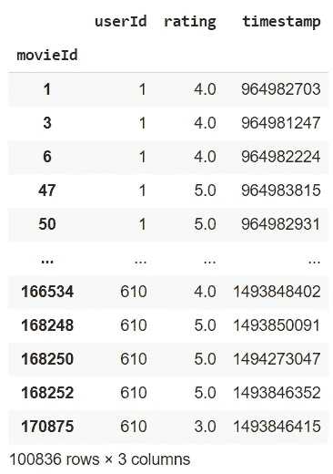
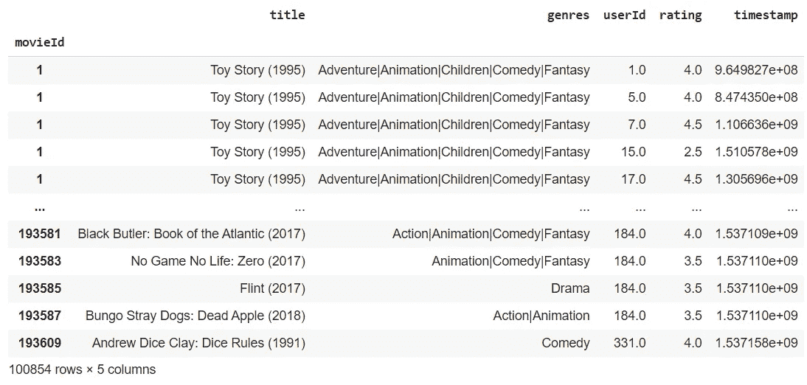
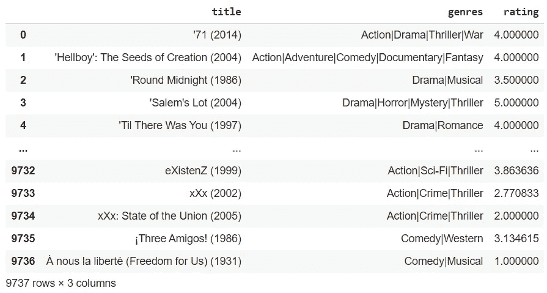
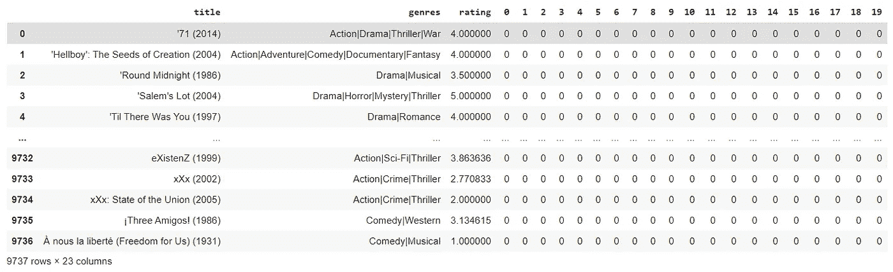
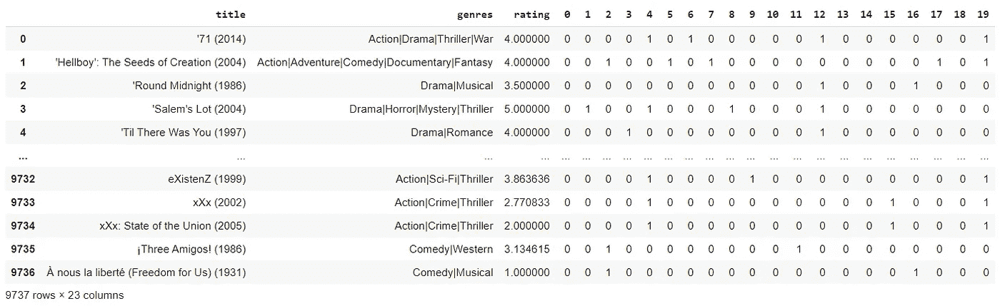
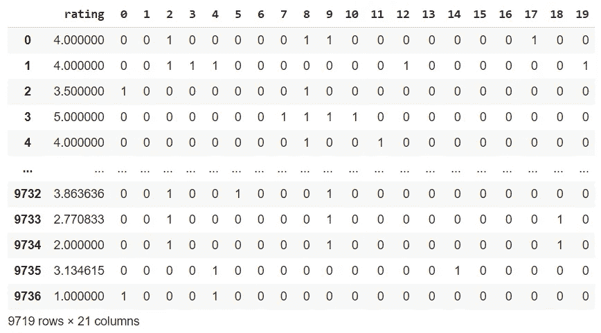

# 使用 PCA 进行数据可视化的 N 维空间中的电影邻近性

> 原文：<https://pub.towardsai.net/movie-proximity-in-the-n-dimensional-space-using-pca-for-data-visualization-1148296169ec?source=collection_archive---------3----------------------->

## [数据可视化](https://towardsai.net/p/category/data-visualization)

## 将 21 维的数值数据压缩为 3 维，然后将结果绘制成 3D 图形

数据已经从[这个网站](https://grouplens.org/datasets/movielens/)下载，这是一个开源的电影评级和标签数据集。出于可视化目的，我将编辑数据集中的数据，将所有标记编码为 one_hot 编码，并将它们放入多维空间。


[https://www.artstation.com/artwork/VEG9N](https://www.artstation.com/artwork/VEG9N)，来自奥利维尔普龙地形象

因为一个超过 3 维的空间不能使用图像来绘制，我将需要使用 PCA 技术来压缩数据，并使用 Plotly 在 3D 空间中可视化它。

## 下载数据

因为数据可视化是 GPU 密集型任务，在 3D 空间中有几个限制，所以我可以简单地使用 2MB 数据集。如果你真的想建立庞大的网络或进行其他实验，你要知道，在这个源头上，你可以访问一个 3.1GB 的电影数据集。

我将从数据中收集以下变量，这些变量存储在两个独立的 excel 文件中(原因是每部电影都有多个评级)。

*   电影分级
*   影片标签

然后，我将继续合并这两个数据集，对标记进行 one_hot 编码，将它们转换为数字数据，最后，对这个多维数据集执行 PCA。

## 导入包含熊猫的数据

从网站下载文件后，我将使用熊猫导入它们。您必须将路径更改为。以正确导入数据集。

```
import pandas as pd
X_1= pd.read_csv('/content/drive/MyDrive/Colab Notebooks/Projects/20210103_Movie_PCA/movies.csv')
X_1.index = X_1.pop('movieId')
X_1
```


```
X_2 = pd.read_csv('/content/drive/MyDrive/Colab Notebooks/Projects/20210103_Movie_PCA/ratings.csv')
X_2.index = X_2.pop('movieId')
X_2
```



从这两个数据集可以看出，行数是不相等的，这就是为什么它们存储在不同的文件中。我需要把它们合并到同一个 **movieId** 中，然后把评级压缩成一个数字，代表它们的平均值。

```
X = X_1.join(X_2, on='movieId', rsuffix='_')
X
```



## **平均评级**

现在，我将根据影片的标题创建不同的组，然后通过对评级执行平均来压缩同一影片的所有行。

```
#making a copy to not import everything over again
df = X.copy()#separate groups
dataframe_list = list()
for region, df_region in df.groupby('title'):
  dataframe_list.append(df_region)#average ratings
final_list=list()
for movie in dataframe_list:
  movie_df = pd.DataFrame(movie.iloc[0]).transpose()
  movie_df['rating'] = movie.mean()[1]
  final_list.append(movie_df)final_list
```

现在，我已经将每个影片作为 final_list 的一个元素进行了存储，我将通过将它们连接为行来创建一个唯一的数据集，然后删除无用的列以供 out 分析:

```
df = pd.concat(final_list, axis=0)
df = df.reset_index()
df.pop('index')
df.pop('userId')
df.pop('timestamp')
df
```



## **One_Hot 编码**

要执行 one_hot 编码，我将首先创建一组所有可能的标记:

```
#creating set of tags
set1 = set()
for row in range(df.shape[0]):
  df.iloc[row]for _ in df.iloc[row]['genres'].split('|'):
    set1.add(_)set1
{'(no genres listed)',
 'Action',
 'Adventure',
 'Animation',
 'Children',
 'Comedy',
 'Crime',
 'Documentary',
 'Drama',
 'Fantasy',
 'Film-Noir',
 'Horror',
 'IMAX',
 'Musical',
 'Mystery',
 'Romance',
 'Sci-Fi',
 'Thriller',
 'War',
 'Western'}
```

然后我需要一部字典，它会为每个标签关联一个数字，这就是**固定基数编码**:

```
tag_dict = {list(set1)[i]:i for i in [x for x in range(len(set1))]}
tag_dict
\
{'(no genres listed)': 13,  
'Action': 19,  
'Adventure': 17,  
'Animation': 14,  
'Children': 18,  
'Comedy': 2,  
'Crime': 15,  
'Documentary': 7,  
'Drama': 12,  
'Fantasy': 5,  
'Film-Noir': 0,  
'Horror': 8,  
'IMAX': 10,  
'Musical': 16,  
'Mystery': 1,  
'Romance': 3,  
'Sci-Fi': 9,  
'Thriller': 4,  
'War': 6,  
'Western': 11}
```

现在我有了一个将每个标签与其编号相关联的字典，我需要用空白来填充数据集。我将创建 20 列，可以容纳二进制编码数据:

```
#creating empty columns from 0 to 20
df[[x for x in range(20)]] = 0
```



```
#fill the zeroes
for row in range(df.shape[0]):
  #print(df.iloc[row]['genres'].split('|'))
  for zero in [tag_dict[x] for x in df.iloc[row]['genres'].split('|')]:
    #print(row, zero)
    #iloc won't change values, I am using at for this purpose
    df.at[row, zero] = 1
df
```

通过将每个标签除以|，假设**动作|犯罪|惊悚**将变成 **['动作'，'犯罪'，'惊悚']** ，我将使用 **tag_dict** 将每个标签转换成其对应的数字。然后，对于每个数字，我将把数据集中右边的 0 变成 1:



为了执行 PCA，我只需要存储数字数据。我将把电影的标题保存在另一个名为 movie_index 的列表中，以后我可以用它来制作图表。

```
k = df.copy()
k.pop('genres')
k = k.dropna()
movie_index = k.pop('title')
k
```



## 执行 PCA

现在我只有数字数据，假设我将标签分类数据转换为数字数据，我将所有数据压缩到一个我可以绘制的 3D 空间中。

* * *我将只使用 500 个样本，9719 个样本很长，绘制起来会减慢实验速度:请随意删除此限制并查看结果

```
from sklearn.decomposition import PCA
import matplotlib.pyplot as pltpca = PCA(n_components=3)
pca_result = pca.fit_transform(k[0:500])
pca_result
\
array([[-0.73554249, -0.913036 , 0.04851076],
 [-0.61063851, 0.57240558, -1.05159588],
 [-0.36358865, -0.26951576, 0.50582827],
 …,
 [-0.33447108, 0.72195369, 0.76125547],
 [-0.18515421, -0.32207719, 0.55323268],
 [-0.08170257, -0.95603453, 0.50899355]])
```

## 绘制结果图表

```
import plotly.express as px
fig = plt.figure(figsize=(14, 8))x = list(pca_result[:,0])
y = list(pca_result[:,1])
z = list(pca_result[:,2])#fig = px.scatter_3d(k, x=x, y=y, z=z, text=k.index[0:500])
fig = px.scatter_3d(k, x=x, y=y, z=z)
fig.show()
```


绘制不带标签的数据集