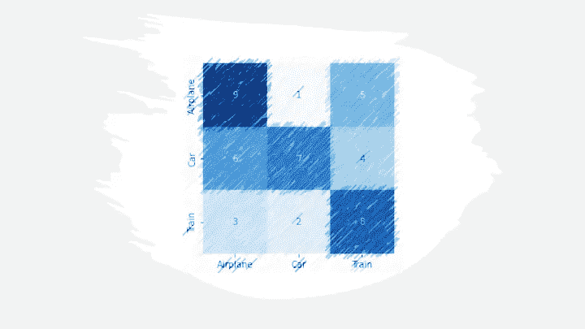
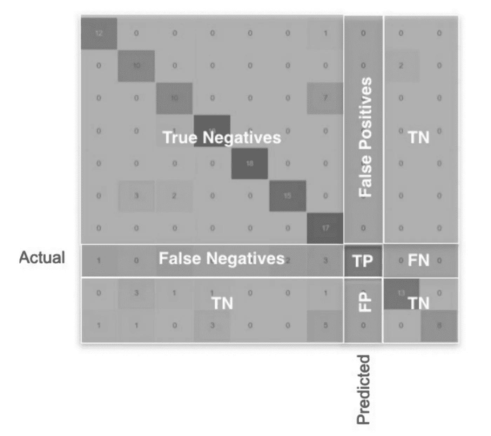
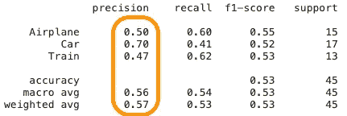
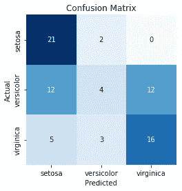
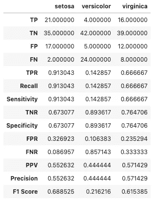
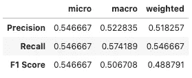

# 用混淆矩阵和分类报告进行多类模型评估

> 原文：<https://pub.towardsai.net/multi-class-model-evaluation-with-confusion-matrix-and-classification-report-c92a74d5e908?source=collection_archive---------0----------------------->

## 模型评估

## 精确度、召回、F1、微观、宏观、加权和分类报告



作者图片

如果你熟悉混淆矩阵，你可能知道它主要是针对只有两个输出的二进制分类来解释的。TP、TN、FP、FN 以及其他派生的度量标准(如精度和召回率)易于理解。然而，当我们有两个以上的目标类时，情况就不一样了。

在这个博客中，重点将放在两个以上类别的问题上，或者换句话说，多类别分类。与二进制分类不同，不存在负类。人们认为 TP、TN 和其他指标很难从多类别的混淆矩阵中导出，但实际上，这很容易。

在多类分类中，除了需要对每个类进行计算之外，所有度量(无论是 TP、精度还是任何其他度量)的计算方式都与二进制相同。如果我们计算一个类的 TP、TN、FP 和 FN，我们几乎可以得到这个类的任何度量。



多类混淆矩阵|作者图片

如果我们从两个维度寻找一个特定的类，TP，FP 和 FN 可以从矩阵中推导出来，其余的数字将对 TN 有贡献。其他度量也可以以相同的方式导出。请访问 [**混淆矩阵简介**](/introduction-to-confusion-matrix-50676f2756ee) 和 [**深入了解混淆矩阵**](/deep-dive-into-confusion-matrix-6b8111d5c3f7) 阅读混淆矩阵是什么以及如何从它派生出精度、召回和许多其他指标。

让我们了解如何计算多类的度量；为简单起见，我们将考虑 3 类*(飞机、汽车、火车)的问题。*


困惑矩阵|作者图片

```
## Calculation of class “Airplane”:TP = 9
FN = 1+5 = 6
FP = 6+3 = 9
TN = 7+4+2+8 = 21
Precision = TP/(TP+FP) = 9/(9+9) = 0.5
Recall = TP/(TP+FN) = 9/(9+6) = 0.6
F1 = 2*(0.5*0.6)/(0.5+0.6) = 5.55
```

类似地，我们可以计算其他类。但是，这次我们将使用 sklearn metrics API 来产生精度、召回率和 f1 分数。

```
from sklearn.metrics import confusion_matrix
from sklearn.metrics import precision_score
y_true = [0]*15 + [1]*17 + [2]*13
y_pred = [0]*9 + [1]*1 + [2]*5 + [0]*6 + [1]*7 + [2]*4 + [0]*3 + [1]*2 + [2]*8confusion_matrix(y_true, y_pred, labels=[0,1,2])**Output:** array([[9, 1, 5],
       [6, 7, 4],
       [3, 2, 8]])
```

*上面的例子是为了计算混淆矩阵，它返回 ndarray，如果标签不是热编码的，我们必须提供一个标签的* ***集合*** *来对抗‘labels’参数。*

**精度:** It 是指某一特定类的所有预测中，正确预测的比例。

```
from sklearn.metrics import precision_score
precision_score(y_true, y_pred, labels=[0,1,2], average=None)**Output:**
array([0.5       , 0.7       , 0.47058824])
```

**召回:** It 是指某一特定类别的实例，已经被模型预测为属于该类别的比例。

```
from sklearn.metrics import recall_score
recall_score(y_true, y_pred, labels=[0,1,2], average=None)**Output:**
array([0.6       , 0.41176471, 0.61538462])
```

**F1 评分:**精确度和召回率的调和平均值。

```
from sklearn.metrics import f1_score
f1_score(y_true, y_pred, labels=[0,1,2], average=None)**Output:**
array([0.54545455, 0.51851852, 0.53333333])
```

*上述评估方法中的“平均”参数需要为* ***【无】*** *，这将返回与各个类相关的度量数组。*

在多类问题中，我们已经观察到 ***精度*** 已经针对单个类进行了计算，而在二进制类问题中，我们只有一个值。如果我们想用一个全局度量来评估多类，我们有微观、宏观和加权精度。混淆矩阵中的任何指标都可以与微观、宏观和加权相结合，使其成为一个全局指标。

**微精度:**通过考虑总 TP、TN、FN 和 TN 而不考虑类别来计算精度。

*   全局 TP = TP(飞机)+ TP(汽车)+ TP(火车)= 9+7+8 = 24
*   全局 FP = FP(A)+FP(C)+FP(T)=(6+3)+(1+2)+(5+4)= 21
*   微精度= 24/(24+21) = 0.533

```
from sklearn.metrics import precision_score
precision_score(y_true, y_pred, labels=[0,1,2], average='micro')**Output:**
0.5333333333333333
```

**宏观精度:**是指每一类测量的未加权平均值。



分类报告|按作者分类的图片

*   宏精度= (0.50 + 0.70 + 0.47)/3 = 0.556

```
from sklearn.metrics import precision_score
precision_score(y_true, y_pred, labels=[0,1,2], average='macro')**Output:** 0.5568627450980391
```

**加权精度:**与宏不同，它是度量的加权平均值。权重是每类样本的总数。在我们的例子中，我们有 15 架飞机、17 辆汽车和 13 辆火车，总共有 45 辆。

*   加权精度=(15 * 0.50+17 * 0.70+13 * 0.47)/45 = 0.566

```
from sklearn.metrics import precision_score
precision_score(y_true, y_pred, labels=[0,1,2], average='weighted')**Output:** 0.5670588235294117
```

## 什么是分类报告？

这是 sklearn metrics API 下的一个 python 方法，当我们需要类级度量和全局度量时，这个方法很有用。它提供个人和全球水平的精确度、召回率和 F1 分数。*这里支持* *是对样本的计数。sklearn 中的分类报告计算所有必要的评估指标。*

```
from sklearn.metrics import classification_report
report = classification_report(y_true, y_pred, labels=[0,1,2], target_names=["Airplane", "Car", "Train"])
print(report)**Output:
**              precision    recall  f1-score   support Airplane       0.50      0.60      0.55        15
         Car       0.70      0.41      0.52        17
       Train       0.47      0.62      0.53        13 accuracy                           0.53        45
   macro avg       0.56      0.54      0.53        45
weighted avg       0.57      0.53      0.53        45
```

下面是绘制混淆矩阵和详细分类报告的代码

```
import numpy as np
from sklearn.datasets import load_iris
from sklearn.model_selection import train_test_split
from sklearn.linear_model import LogisticRegression
from . import confusion_matrix# Load Dataset
data = load_iris()
X = data.data
y = data.target
labels = list(data.target_names)# Adding Noise
random_state = np.random.RandomState(0)
n_samples, n_features = X.shape
X = np.concatenate([X, 
                    random_state.randn(n_samples, 200* n_features)],
                                       axis=1)
X_train, X_test, y_train, y_test = train_test_split(
    X[y < 3], y[y < 3], test_size=0.5, random_state=random_state)lr = LogisticRegression()
lr.fit(X_train, y_train)
y_pred = lr.predict(X_test)
y_pred_prob = lr.predict_proba(X_test)confusion_matrix(y_test, y_pred, labels)
```

如果你想知道“从”。导入混淆 _ 矩阵”请参考 [***混淆矩阵介绍***](/introduction-to-confusion-matrix-50676f2756ee) *获取 Python 方法。*



困惑矩阵|作者图片

```
multi_classification_report(y_test, y_pred, labels=labels, encoded_labels=True, as_frame=True)
```



详细分类报告|按作者分类的图片

```
summarized_classification_report(y_test, y_pred, as_frame=True)
```



汇总分类报告|按作者分类的图片

我希望这篇博客和其他人的系列文章*(参考文献中提到)*能帮助你建立对困惑矩阵的清晰理解。

欢迎提出建议和问题，请在评论中分享。

**参考文献:**

[1] sklearn 度量 API。[https://sci kit-learn . org/stable/modules/classes . html # module-sk learn . metrics](https://scikit-learn.org/stable/modules/classes.html#module-sklearn.metrics)

[2]混淆矩阵介绍。[https://pub . toward sai . net/introduction-to-confusion-matrix-50676 f 2756 ee](/introduction-to-confusion-matrix-50676f2756ee)

[3]深入混乱矩阵。[https://pub . toward sai . net/deep-dive-into-mission-matrix-6b 8111 D5 c3f 7](/deep-dive-into-confusion-matrix-6b8111d5c3f7)