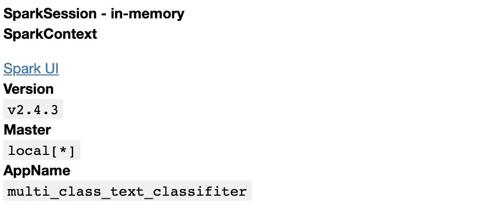
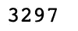
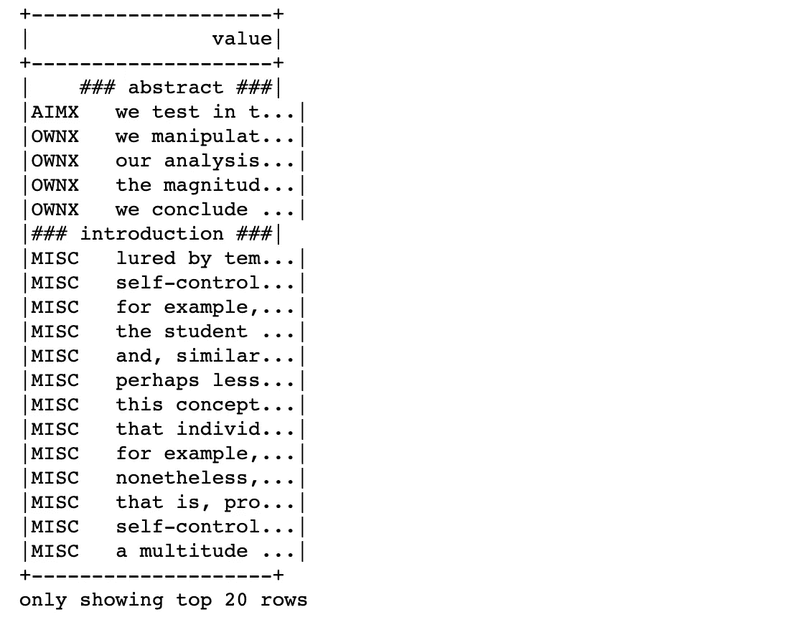
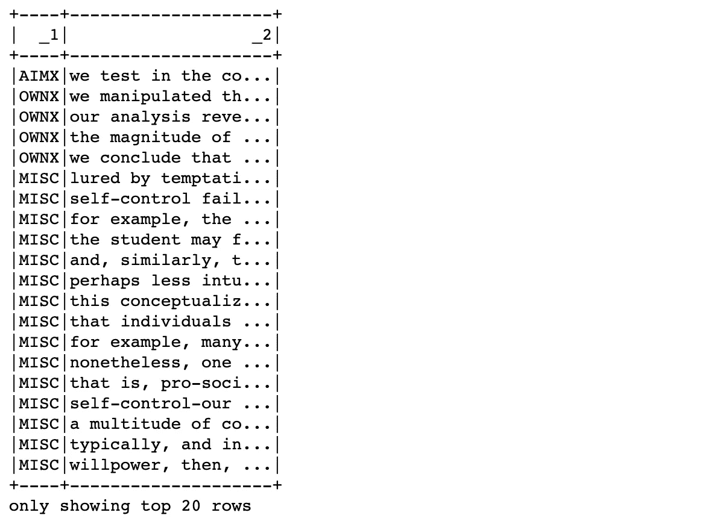
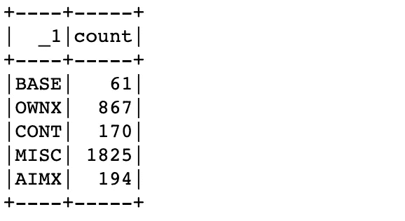
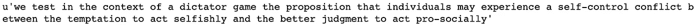
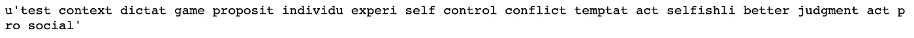
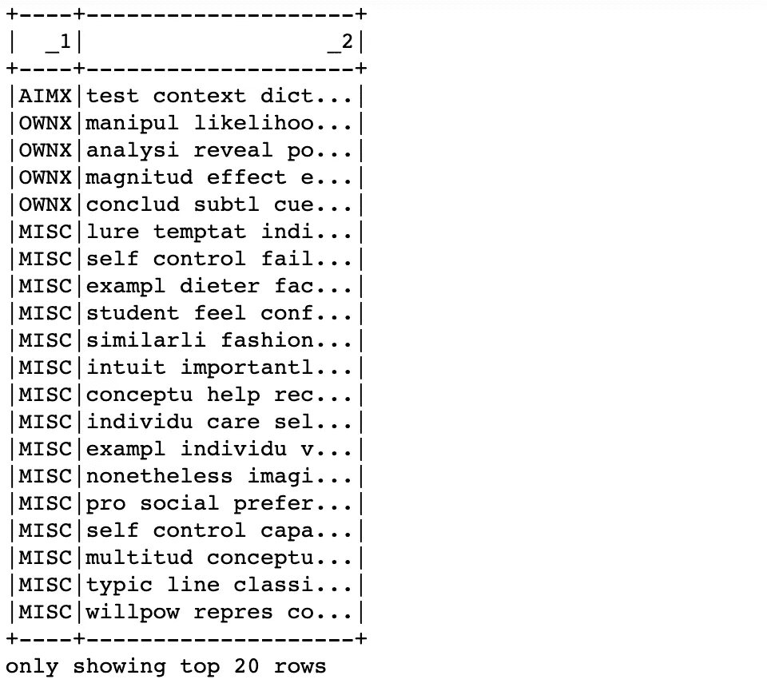
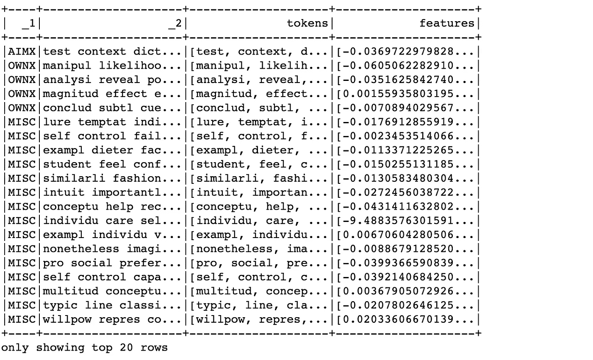

# 基于 PySpark、MLlib 和 Doc2Vec 的多类文本分类

> 原文：<https://pub.towardsai.net/multi-class-text-classification-using-pyspark-mllib-doc2vec-dbfcee5b39f2?source=collection_archive---------1----------------------->

## [机器学习](https://towardsai.net/p/category/machine-learning)，[编程](https://towardsai.net/p/category/programming)， [Python](https://towardsai.net/p/category/programming/python)

## 如何使用 Apache Spark MLlib 和 PySpark 解决 NLP 问题以及如何在 Spark MLlib 中模拟 Doc2Vec


图片来源:新闻— Pixabay

Apache Spark 现在非常流行，可以扩展任何数据处理应用程序。对于机器学习，它也提供了一个名为[‘ml lib’](https://spark.apache.org/mllib/)的库。这是一种解决 ML 问题的分布式编程方法。在本文中，我们将看到如何将这个 MLlib 与 PySpark 集成，以及使用 Doc2Vec 和 PySpark 解决文本分类问题的技术。

在继续之前，我们需要知道什么是‘doc 2 vec’。它是一个描述文本或文档的 NLP 模型。它将文本转换成数字特征的向量，以便在任何 ML 算法中使用。基本上，它是一种特征工程技术。它试图通过随机抽样单词来理解文档的上下文，并用这些单词训练神经网络。神经网络的隐藏层向量成为文档向量，也称为“Doc2Vec”。还有一种叫做“Word2Vec”的技术，也是基于类似的原理。但是它不是处理文档/文本，而是处理单词语料库，并为单词提供向量。有关“Doc2Vec”和“Word2Vec”的更多详细信息，以下资源会有所帮助:

*   [稀有技术公司的 Doc2Vec 教程](https://rare-technologies.com/doc2vec-tutorial/)
*   [句子的分布式表示&文档](https://cs.stanford.edu/~quocle/paragraph_vector.pdf)
*   [word 2 vec 初学者指南](https://skymind.ai/wiki/word2vec)

# **设置 PySpark**

本文需要 PySpark 本地设置。出于兼容性原因，我们将使用 PySpark 2.4.3 和 Python 2.7，并将为此应用程序设置足够的内存。我们可以通过以下方式实现这一点:

我们现在可以看到那个火花物体了

```
spark
```



图 1

# **数据探索&问题公式化**

我们将使用来自 UCI 机器学习知识库的句子分类集。这一个包含总共 3297 个标记的句子，分布在不同的文件中。每个句子都被指定一个特定的类别。显然，这是一个典型的文本分类问题。

我们先来看看数据集中有什么！

记录总数

```
total_df.count()
```



显示数据集

```
total_df.show()
```



图 2

如我们所见，数据集包含一些不必要的文本，如' # # # abstract # # # ' & ' # # introduction # # # '。这些文本只不过是对那些文件的评论。这个数据集还没有被分成单独的“标签”和“内容”列，这对于分类问题来说是很常见的。因此，这必须被清理&分成适当的列，以便进一步处理。

让我们看看如何做到这一点。

```
input_df = input_rdd.toDF()
input_df.show()
```



图 3

“1”是标签，而“2”是问题的实际文本。现在我们可以使用这个数据集进行进一步的处理和实际的问题解决。

让我们来看看句子有多少不同的类别，即' _1 '列有多少不同的值

```
input_df.groupBy('_1').count().show()
```



图 4

因此，总共有 5 个不同的类/类别，这是一个 5 类文本分类问题。

# **基础文字清理**

在进入“Doc2Vec”处理之前，基本的文本清理是必要的。典型的文本清理包括以下步骤

1.  转换成小写
2.  删除标点符号
3.  整数、数字的移除
4.  移除多余的空格
5.  移除标签(如、

    等)

6.  删除停用词(如“and”、“to”、“the”等)
7.  词干(将单词转换成词根形式)

我们将使用 Python ' **gensim** '库来清理所有文本。

让我们看看一个特定句子的内容，以及这个“clean_text”函数是如何处理它的

```
input_rdd.take(1)[0][1]
```



图 5

```
clean_text(input_rdd.take(1)[0])[1]
```



图 6

虽然“干净的”句子不再是语法正确的，但它仍然包含了对“Doc2Vec”处理非常重要的上下文

现在，让我们看看如何在 PySpark 中使用这个函数来清理所有的句子

```
cleaned_rdd = input_rdd.map(lambda x : clean_text(x))cleaned_df = cleaned_rdd.toDF()
cleaned_df.show()
```



图 7

# **机器学习管道**

现在，是做实际工作的时候了。截至目前，Apache Spark 没有为‘doc 2 vec’提供任何 API。但它提供了一个“Word2Vec”变压器。它基于“跳格”法。根据 [Apache Spark 文档](https://spark.apache.org/docs/latest/ml-features.html#word2vec):

*`*Word2VecModel*`*使用文档中所有单词的平均值将每个文档转换成向量**

*比方说，对于我们的用例，一个句子有 5 个单词。然后，例如，典型的“Word2Vec”将每个单词转换成大小为 100 的特征向量。在这种情况下,“Doc2Vec”表示将是所有这 100 个长度向量的平均值，其长度也将是 100。这是“Doc2Vec”模型的简化“平均”方案。我们将使用 Apache Spark 的“Word2Vec”作为我们的“Doc2Vec”模型。*

*我们的机器学习管道将由两个阶段组成*

1.  *象征主义者*
2.  *“Word2Vec”模型*

*为此，我们将使用 [Apache Spark 管道 API](https://spark.apache.org/docs/latest/ml-pipeline.html) 。*

*让我们打印' Doc2Vec '内容*

```
*doc2vecs_df.show()*
```

**

*图 8*

*“特征”列是实际的“Doc2Vec”密集向量。我们使用了 300 号的“Doc2Vec”。通常，首选大小保持在 100 到 300 之间。*

# *模型培训和评估*

*下一步将是把这些“Doc2Vec”特征放入分类器模型。我们将尝试使用 random forest & logistic regression 模型。*

*我们需要将数据分成训练集和测试集，并评估模型的准确性*

```
*w2v_train_df, w2v_test_df = doc2vecs_df.randomSplit([0.8, 0.2])*
```

***RandomForest 模型***

*Spark MLlib 不理解典型的分类变量。为此，我们的类标签(列' _1 ')必须转换成索引。 [StringIndexer](https://spark.apache.org/docs/latest/ml-features.html#stringindexer) ' API 为我们做了这些。*

*这里，我们也必须构建一个包含以下阶段的管道*

1.  *StringIndexer(输入= '_1 '，输出= 'label ')*
2.  *RandomForest 分类器(标签列= '标签'，特征列= '特征'。这个“特性”是从“Doc2Vec”转化而来的)*

```
*accuracy = rf_model_evaluator.evaluate(rf_predictions)
print("Accuracy = %g" % (accuracy))*
```

**

*图 9*

***物流回收模式***

*对于物流回收，同样的管道阶段也是适用的。*

```
*accuracy = lr_model_evaluator.evaluate(lr_predictions)
print("Accuracy = %g" % (accuracy))*
```

**

*图 10*

*我们可以看到，两个分类器的精度大致相同。通过“超参数”调整和改变分类器，可以进一步提高精确度。这超出了本文的范围。这篇文章的读者可以自己尝试一下。*

*这就把我们带到了终点。我们学习了如何通过 PySpark 使用 Spark MLlib，模拟 Doc2Vec，构建管道。*

*这篇文章的 Jupyter 笔记本可以在 [Github](https://github.com/avisheknag17/public_ml_models/blob/master/multi_class_text_classification_pyspark/notebook/multi_class_text_classifier_pyspark_2.ipynb) 上找到。任何反馈都将受到高度赞赏。*

*最近，我写了一本关于 ML([https://twitter.com/bpbonline/status/1256146448346988546](https://twitter.com/bpbonline/status/1256146448346988546))的书*