# 使用 Scikit-multilearn 的多标签文本分类:StackOverflow 问题的案例研究

> 原文：<https://pub.towardsai.net/multi-label-text-classification-using-scikit-multilearn-case-study-with-stackoverflow-questions-768cb487ad12?source=collection_archive---------0----------------------->

## [机器学习](https://towardsai.net/p/category/machine-learning)

## 设计一个多标签文本分类模型，该模型有助于用不同主题标记 stackoverflow.com 问题


stackoverflow.com**的日常用户发布了许多技术问题，这些问题都被贴上了不同主题的标签。在本文中，我们将讨论一个分类模型，它可以自动判断哪些标签可以附加到未回答的问题上。**

显然，一个问题可以关联多个标签。因此，最终这个问题变成了“对问题进行分类并给它贴上类别标签”。根据机器学习理论，这是一个“多标签分类”问题。

我们已经在下面的文章中讨论了多标签模型所需的不同理论技术和准确性度量。

[](https://medium.com/towards-artificial-intelligence/understanding-multi-label-classification-model-and-accuracy-metrics-1b2a8e2648ca) [## 了解多标签分类模型和准确性指标

### 多标签/多标记模型背后的理论、不同的伞式分类方案和准确性度量分析

medium.com](https://medium.com/towards-artificial-intelligence/understanding-multi-label-classification-model-and-accuracy-metrics-1b2a8e2648ca) 

以上是当前讨论的先决条件。在这篇文章之前，读者需要浏览一下。

我们将在工作中使用 scikit-multilearn、gensim & scikit-learn。

# 获取数据和探索

这篇文章的数据可以从 [Kaggle](https://www.kaggle.com/stackoverflow/statsquestions) 找到。它包含我们讨论所需的“Questions.csv”和“Tags.csv”。

让我们研究一下这些文件

```
import pandas as pdtag_df = pd.read_csv('../data/Tags.csv')
tag_df.head()
```

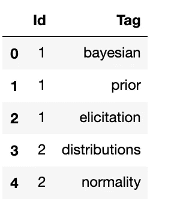

图 1

```
questions_df = pd.read_csv('../data/Questions.csv', encoding = "ISO-8859-1")
questions_df.head()
```

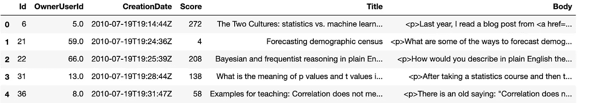

图 2

所以，每个问题都以“正文”和“标题”为主要内容。我们需要理解这些，从那里我们必须预测一个未回答问题的标签。

我们可以看到，这些文件的数据与“id ”(即“问题 Id ”)相关联。所以，我们可以把这两者结合起来，得到一个统一的观点。对于每个“正文”和“标题”,我们将以逗号分隔的方式连接标签。

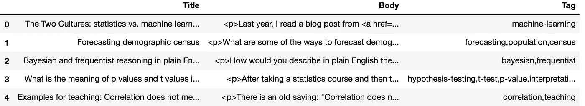

图 3

总共有 1316 种不同类型的标签(在前一篇文章中给出了分析)

现在，让我们看看最少出现次数为 3 的标签是什么(例如，该标签至少出现在三个问题中)

```
tags_count_df = tag_df.groupby(['Tag']).count()
tags_count_df_asc = tags_count_df.sort_values(by=['Id'])
tags_count_df_asc.query('Id >= 3').head()
```

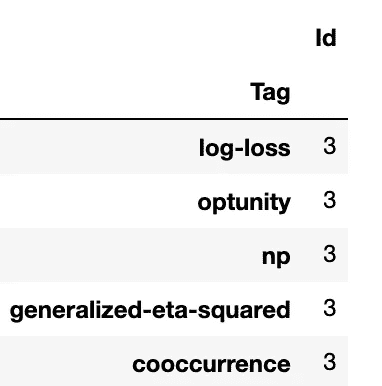

图 3

和反向或最频繁的标签

```
tags_count_df_desc = tags_count_df.sort_values(by=['Id'], ascending=False)
tags_count_df_desc.head()
```

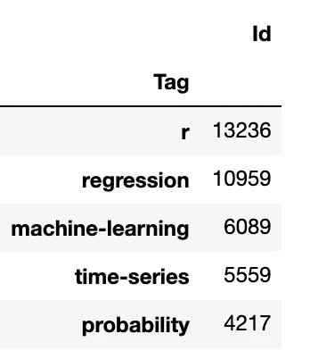

图 4

## **可视化“正文”内容&“标题”内容**

现在，让我们看看单词云表示中问题的“正文”和“标题”的内容。为此，我们可以定义一个函数

探索词云中“标签”的内容

```
tags = ''
for index, row in input_df.iterrows():
    tags = tags + ',' + row['Tag']

plot_word_cloud(tags)
```

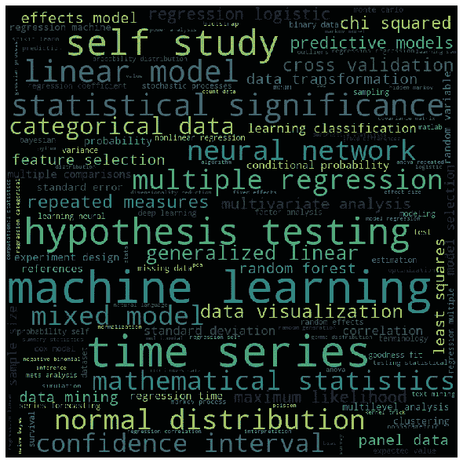

图 5

我们可以看到，像“机器学习”、“时间序列”等标签是最常见的。

**进一步勘探的数据预处理**

我们应该将数据分为输入内容和目标变量。在我们的例子中，目标变量是“Tag”

```
df_x = input_df[['Title','Body']]
df_y = input_df[['Tag']]
```

为了分析“Body”和“Tag”的内容，我们需要进行基本的文本预处理。

步骤如下

1.  转换成小写
2.  删除标点符号
3.  整数、数字的移除
4.  移除多余的空格
5.  移除标签(如、

    等)

6.  删除停用词(如“and”、“to”、“the”等)
7.  词干(将单词转换成词根形式)

我们将使用 Python ' **gensim** '库来清理所有文本。

让我们先为此编写函数

我们将通过一个例子来看这个函数在“正文”和“标题”上的应用效果

“标题”的内容

```
input_df.iloc[0,0]
```

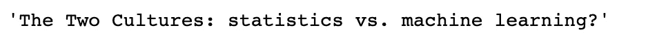

图 6

清洁后

```
clean_text(input_df.iloc[0,0])
```

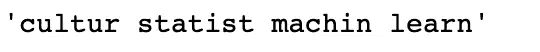

图 7

“主体”的内容

```
input_df.iloc[0,1]
```

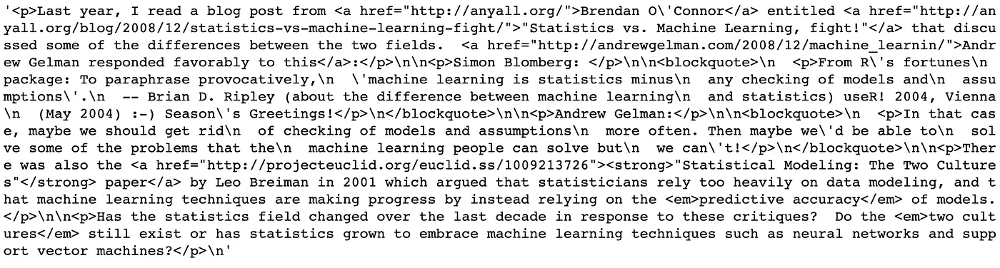

图 8

清洁后

```
clean_text(input_df.iloc[0,1])
```

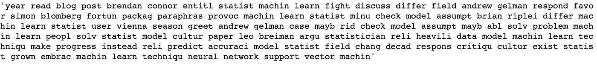

图 9

虽然清洗后的内容看起来有点笨拙，但这些需要进一步处理

现在，我们来看看所有清理过的‘标题’的字云。我们将使用上面定义的" **clean_text"** 函数进行清洗。

```
titles = ''
for index, row in input_df.iterrows():
    titles = titles + ' ' + clean_text(row['Title'])

plot_word_cloud(titles)
```

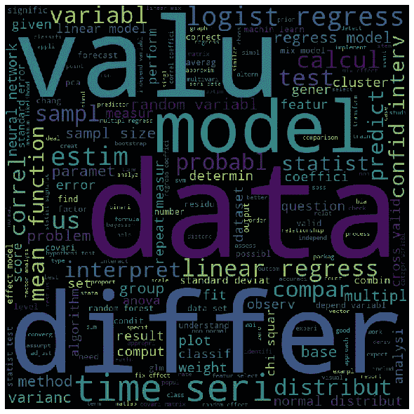

图 10

因此，“数据”、“差异”、“价值”等是“标题”内容中最常见的标记

所有已清理“正文”内容的相同词云图

```
bodies = ''
for index, row in input_df.iterrows():
    bodies = bodies + ' ' + clean_text(row['Body'])

plot_word_cloud(bodies)
```

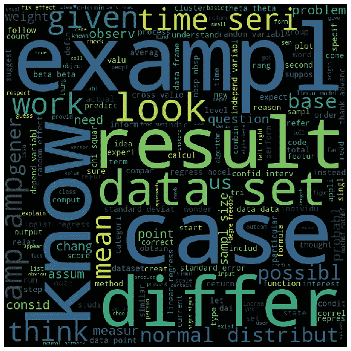

图 11

know、exampl、case 等是 Body 中最常用的标记

我们还可以看到与特定标签相对应的“主体”内容。为此，让我们定义一个函数

带有“matlab”标签的问题的词云

```
plot_word_cloud_of_body_for_tag('matlab')
```


图 12

显而易见,“matlab”将是最常见的标记之一。

标签“概率”也是如此

```
plot_word_cloud_of_body_for_tag('probability')
```


图 13

# 构建机器学习模型和管道

在所有的数据探索之后，现在让我们集中精力构建实际的模型。由于这是一个多标签分类，我们需要将我们的目标标签转换为一个二进制向量，其中多个位设置为 1。

“scikit-learn”的“multilabel binarizer”可以做到这一点

因为我们正在处理文本数据。我们需要把它转换成向量空间模型。我们将使用' [Doc2Vec](https://skymind.ai/wiki/word2vec) '模型进行转换。

我们将使用 python 的“ **gensim** ”库编写一个自定义的“Doc2VecTransformer”

这个类将字段名作为输入(在我们的例子中分别是“Body”和“Title ”),并将文本转换成数字特征的数组

我们将把数据分为“训练”和“测试”

```
from sklearn.model_selection import train_test_splittrain_x, test_x, train_y, test_y = train_test_split(df_x, encoded_y)
```

> 在使用 **scikit-learn** 的 **FeatureUnion** 进行“ **Doc2Vec** ”转换后，我们需要将两个字段“Body”和“Title”合并到一个特性中。

> 从“多标签”模型的概念出发，我们将尝试使用“**二元相关性**”&”**分类器链**作为我们的伞式分类方案**(参考前面提到的文章)**，并将使用“ **RandomForest** ”作为我们的基础二元分类器。
> 
> 因为有 1316 个不同的标签，所以里面会有 1316 个分解的和独立的二元分类器。

我们将比较两种伞式方案的准确性。

**二元相关性**

我们的管道应该在“RandomForest”分类器之上包含“FeatureUnion”步骤和“BinaryRelevance”步骤。我们将使用' **scikit-multilearn** '库中的' **BinaryRelevance** 类。

为了测试我们模型的准确性，让我们定义一个函数来计算'**汉明损失**'(参考上一篇文章)

让我们训练和测试“二元相关性”模型

```
multi_label_rf_br_model.fit(train_x, train_y)
print('Hamming loss for test data :', hamming_loss(multi_label_rf_br_model,train_x,train_y,test_x,test_y))
```

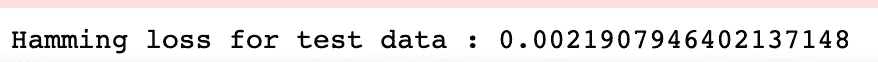

图 14

这意味着几乎 0.02%的损失，或者我们可以说 99.98%的准确性！！

**分类器链**

同样，我们可以训练和测试“分类器链”。 **scikit-multilearn** 为此提供了一个类

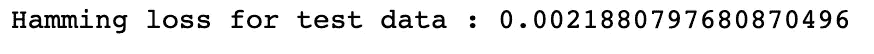

图 15

几乎一样的精度！！

**单个分类器的进一步精度分析**

由于有两个以上的分类器，不可能检查每个人的表现和准确性，但我们将看到其中 3 个分类器的 ROC 曲线。让我们为此写一个函数。

现在，我们将看到三个标签的“ROC 曲线”:“正态分布”、“数据可视化”和“估计”

```
plot_roc_curve(x=test_x, y=test_y, classes=['normal-distribution','data-visualization','estimation'], 
               title='ROC curve')
```

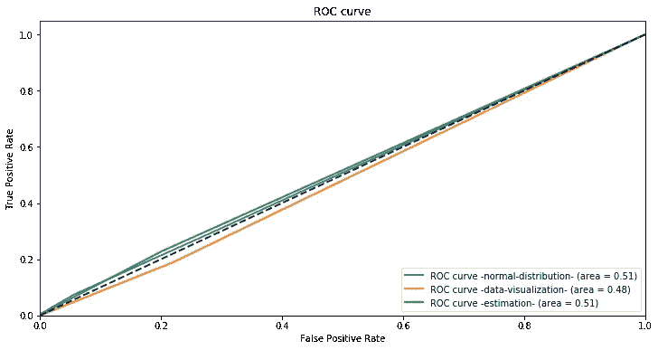

图 16

类似的 ROC 曲线也可以通过该函数为其他标签绘制。读者可以自行尝试。

# 结论

这都是为了解决问题。通过使用不同的二元分类器或使用超参数对其进行调整，可以实现进一步的改进。这篇文章的读者可以自己尝试一下。本文的源代码可以在 Github 中找到。

[](https://github.com/avisheknag17/public_ml_models/blob/master/multi_label_classification_understanding/notebook/multi_label_text_classification_scikit_multilearn.ipynb) [## avisheknag17/public_ml_models

### 在 GitHub 上创建一个帐户，为 avisheknag17/public_ml_models 开发做出贡献。

github.com](https://github.com/avisheknag17/public_ml_models/blob/master/multi_label_classification_understanding/notebook/multi_label_text_classification_scikit_multilearn.ipynb) 

最近，我写了一本关于 ML([https://twitter.com/bpbonline/status/1256146448346988546](https://twitter.com/bpbonline/status/1256146448346988546))的书