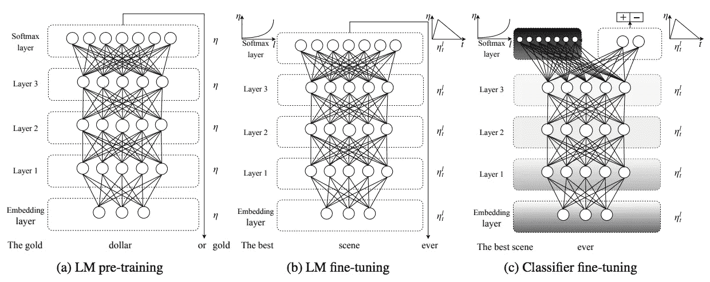
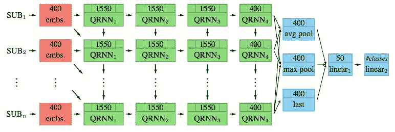
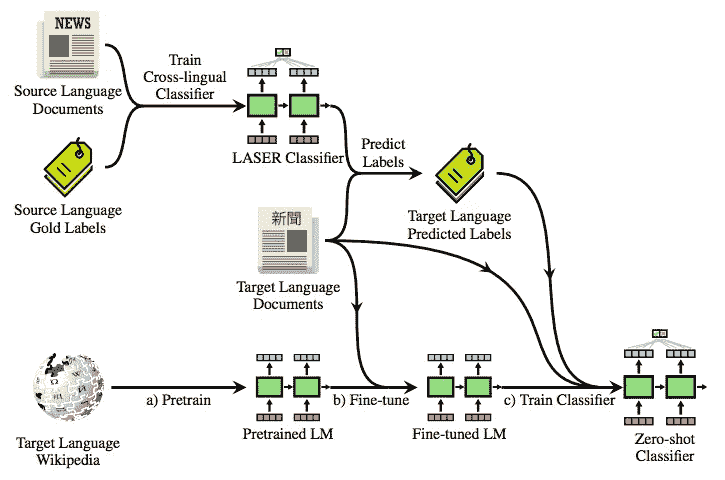
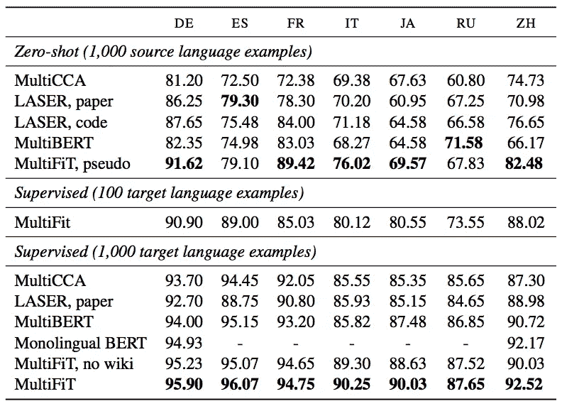

# 多语言语言模型微调

> 原文：<https://pub.towardsai.net/multi-lingual-language-model-fine-tuning-81922a80438f?source=collection_archive---------0----------------------->

## 低资源语言的问题

照片由[克洛伊·伊文斯](https://unsplash.com/@chloeevans?utm_source=medium&utm_medium=referral)在 [Unsplash](https://unsplash.com?utm_source=medium&utm_medium=referral)

英语是自然语言处理领域最丰富的资源之一。许多最先进的自然语言处理模型天生支持英语。为了解决多语言下游问题，提出了[跨语言模型](https://medium.com/towards-artificial-intelligence/cross-lingual-language-model-56a65dba9358) ( `XLM`)和其他解决方案。

然而，当目标语言具有非常有限的训练数据时，仍然存在挑战。Eisenschlo 等人提出了多语种语言模型微调(`MultiFiT`)来使我们能够有效地训练目标语言。

# 多重拟合

`MultiFiT` (Eisenschlo 等人，2019)旨在解决低资源语言问题。神经网络架构基于[通用语言模型微调](https://towardsdatascience.com/multi-task-learning-in-language-model-for-text-classification-c3acc1fedd89) (ULMFiT) (Howard 和 Ruder，2018)和准递归神经网络(QRNN) (Bradbury et al .，2017)。对于文本表示，应用[子词](https://medium.com/@makcedward/how-subword-helps-on-your-nlp-model-83dd1b836f46) (Kudo，2018)对词进行分词。

QRNN (Bradbury 等人，2017)不同于长短期记忆(LSTM) (Hochreiter 和 Schmidhuber，1997)和卷积神经网络(CNN)(Krizhevsky 等人，2012)。卷积层和池层分别跨时间戳和通道并行。

LSTM、CNN 和 QRNN 之间的视觉比较(Bradbury 等人，2017 年)

ULMFiT (Howard 和 Ruder，2018 年)包括从源数据到目标数据训练模型的 3 个步骤。首先，在源数据上从头开始训练模型。微调 LM 模型并在目标数据上训练分类器层。你可以访问这个[故事](https://towardsdatascience.com/multi-task-learning-in-language-model-for-text-classification-c3acc1fedd89)来了解更多关于 ULMFiT 的细节。

乌尔姆菲特建筑(霍华德和鲁德，2018 年)

最初的 ULMFiT (Howard 和 Ruder，2018 年)使用了平均随机梯度下降权重长期短期记忆(AWD-LSTM)，而由于性能和效率的提高，它被 QRNN (Bradbury 等人，2017 年)取代。

多 iT 架构(Eisenschlo 等人，2019 年)

此外

该培训包括 5 个步骤:

*   激光分类器:使用预先训练的模型在源语言数据上训练分类器层
*   目标语言预测标签:将目标语言数据提供给激光分类器
*   预翻译的 LM:使用目标语言维基百科为目标语言训练一个 LM 模型
*   微调 LM:通过输入目标语言数据来微调 LM 模型。
*   零镜头分类器:将目标语言预测标签和目标语言文档提供给微调的 LM。

MultiFiT 的训练步骤(Eisenschlo 等人，2019 年)

从下面的实验结果来看，`MultiFiT`的表现优于多种语言，尤其是中文(ZH)。

模型性能比较(Eisenschlo 等人，2019 年)

# 拿走

*   从实验来看，在预训练阶段和微调阶段，QRNN 的 MultiFiT 比 AWD-LSTM 的 MultiFit 分别快大约 2 倍和 3 倍。
*   预训练 LM 模型很重要，因为它提高了对噪声的鲁棒性。

# 喜欢学习？

我是湾区的数据科学家。关注数据科学的最新发展，尤其是 NLP、数据扩充和平台相关领域。在 [LinkedIn](https://www.linkedin.com/in/edwardma1026) 或 [Github](https://github.com/makcedward) 上随时与 [me](https://makcedward.github.io/) 联系。

# 延伸阅读

*   [3 子字算法解释](https://medium.com/@makcedward/how-subword-helps-on-your-nlp-model-83dd1b836f46)
*   [MultiFit 实现](https://github.com/n-waves/ulmfit-multilingual/tree/master/ulmfit)
*   [XLM 实施](https://medium.com/towards-artificial-intelligence/cross-lingual-language-model-56a65dba9358)
*   [ULMFiT 实施](https://towardsdatascience.com/multi-task-learning-in-language-model-for-text-classification-c3acc1fedd89)

# 参考

*   J.Bradbury，S. Merity，C. Xiong 和 R. Socher。[准递归神经网络。](https://arxiv.org/pdf/1611.01576.pdf) 2017
*   J.霍华德和史路德。[文本分类通用语言模型微调](https://arxiv.org/pdf/1801.06146.pdf)。2018
*   J.艾森施洛斯、s .鲁德、p .恰普拉、m .卡尔达斯、s .古格和 j .霍华德。 [MultiFiT:高效的多语言语言模型微调](https://arxiv.org/pdf/1909.04761.pdf)。2019