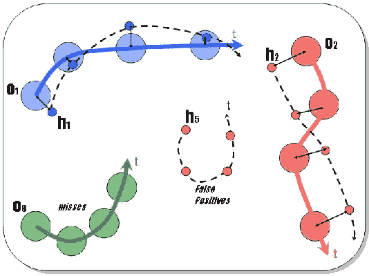

# 多目标跟踪度量

> 原文：<https://pub.towardsai.net/multi-object-tracking-metrics-1e602f364c0c?source=collection_archive---------2----------------------->

## [机器学习](https://towardsai.net/p/category/machine-learning)

评估过程是建立机器学习模型的最重要的步骤之一。尤其是实时检测加跟踪系统。计算机视觉在跟踪方面的应用在监控、体育分析、自动驾驶汽车等领域越来越受欢迎。因此，在部署之前，评估您的模型将是最困难的任务。今天，让我们来看一组评估您的跟踪系统的指标，让您更好地理解您的模型。


照片由[米卡·鲍梅斯特](https://unsplash.com/@mbaumi?utm_source=medium&utm_medium=referral)在 [Unsplash](https://unsplash.com?utm_source=medium&utm_medium=referral) 上拍摄

# 介绍

现实环境中的多目标跟踪系统总是具有挑战性，并且没有很多度量标准来评估你的跟踪系统。这篇文章描述了一个叫做 CLEAR MOT Metrics 的指标的实现。任何跟踪评估系统的主要目标都是判断跟踪器的精度并检查运动物体的轨迹，而单个物体没有多条路线。

## **清除运动指标**

假设对于视频馈送中的每一帧，跟踪器系统输出“n”个假设，并且该帧具有“m”个基本事实对象。CLEAR MOT 度量的评估过程如下:

1.  基于它们的坐标并在不同匹配算法的帮助下，找到并配对假设和基本事实之间的最佳匹配。
2.  对于每一个配对，找出物体位置的误差。
3.  计算多个误差的总和，例如:

a)未命中，其中跟踪器未能为给定对象产生任何假设。

b)假阳性，其中追踪器产生了假设，但是没有物体存在。

c)不匹配误差，其中跟踪者对地面真实的假设改变了当前帧。



图:伯纳丁、妮可和莱纳·斯蒂费尔哈根。"[评估多目标跟踪性能:清晰的运动指标](http://citeseerx.ist.psu.edu/viewdoc/download?doi=10.1.1.367.6279&rep=rep1&type=pdf)。"《欧洲图像与视频处理杂志》2008(2008):1–10。

基于上述过程，性能可以用两个指标来表示:

1.  MOTP(多目标跟踪精度)表示对目标精确位置的估计有多精确。它是所有帧中匹配的基础真值-假设对的估计位置的总误差，由匹配的总数平均。该指标不负责识别对象配置和评估对象轨迹。
2.  MOTA(多目标跟踪精度)显示了跟踪系统在未命中、误报、不匹配错误等方面犯了多少错误。因此，它可以从三个错误率导出:缺失率、假阳性率和所有帧的不匹配率。

## **使用 Python 实现**

如果你想要一个详细的数学解释，我建议你去看看下面链接的官方论文。现在，让我们深入研究使用 python 实现这些指标。

py-motmetrics python 库不仅为您提供了 MOTA 和 MOTP，还提供了各种各样的值，您可以通过这些值来分析您的跟踪系统。

使用 pip 命令安装库，

```
pip install motmetrics
```

导入必要的包，并给出假设和地面真相坐标和对象 id，并使用 IOU 方法获得距离矩阵。

```
import motmetrics as mm
import numpy as np

acc = mm.MOTAccumulator(auto_id=True)
a = np.array([            
   [121,458,187,551], #coordinates of three hypothesis in the frame
   [ 316 ,414 ,373,492] # Format--> X, Y, Width, Height
])
b = np.array([ 
    [600 , 612, 700, 712], #coordinates of three groundtruth objects
    [134, 445, 173, 523],                                                  
    [321 , 436, 366, 481]
])
distance_matrix = mm.distances.iou_matrix(a, b, max_iou=0.7)
print(distance_matrix)OUTPUT -->[[       nan 0.16199685        nan]
[       nan        nan 0.08276546]]
```

现在让我们用对象 id 更新累加器，并获得评估报告。

```
acc.update(
[1, 2],                     # Ground truth object ID in this frame
[0,3,4],                  # Detector hypothesis ID in this frame
[distance_matrix])mh = mm.metrics.create()report = mh.compute(acc, metrics=['num_frames', 'num_objects','num_matches' ,'mota','motp', 'num_misses','num_false_positives','num_switches','mostly_tracked','partially_tracked','mostly_lost'], name='acc')print(report)
```

查看文档，了解评估报告中包含的更多参数。您可以为视频的多个帧自动编写代码。

前往 [MOT Challenge 网站](https://motchallenge.net/)下载样本视频，这些视频带有针对不同视频场景的逐帧注释数据集，以测试您的跟踪系统。MOT17 和 MOT20 的地面实况数据解析示例:

```
def gtparser(current_frame,end_frame,file,split):'''
current_frame and end_frame gives you a range of frames you wanna work with. 
file -> location of the gt.txt file.
split-> how are the values in gt seperated(mostly it is a ',' or a space ' ').
'''
    dict1 = {}
    while current_frame<=end_frame:  
        f_bb,idarr = [], []
        f = open(file,'r')   
        for line in f.readlines():
            bb = []    
            if int(line.split(split)[0])==current_frame and int(line.split(split)[7])==1:
                x_scale = 960/1920
                y_scale = 540/1080
                (origLeft, origTop, origWidth, oriHeight) = (int(float(line.split(split)[2])),int(float(line.split(split)[3])),int(float(line.split(split)[4])),int(float(line.split(split)[5]))) dict1 = {}
    while current_frame<=end_frame:  
        f_bb,idarr = [], []
        f = open(file,'r')   
        for line in f.readlines():
            bb = []    
            if int(line.split(split)[0])==current_frame and int(line.split(split)[7])==1:
                x_scale = 960/1920
                y_scale = 540/1080
                (origLeft, origTop, origWidth, oriHeight) = (int(float(line.split(split)[2])),int(float(line.split(split)[3])),int(float(line.split(split)[4])),int(float(line.split(split)[5])))x = int(np.round(origLeft * x_scale))
                y = int(np.round(origTop * y_scale))w = int(np.round(origWidth * x_scale)) 
                h = int(np.round(oriHeight * y_scale)) 
                bb.append(x)
                bb.append(y)
                bb.append(w)
                bb.append(h)
                idarr.append(int(line.split(split)[1]))
                f_bb.append(bb)
        f_bb = np.array(f_bb)  
        dict1[current_frame] = (idarr,f_bb)
        current_frame+=1
        f.close()
    #print(len(dict),current_frame)return dict1
```

## **对 py-motmetrics 结果的解释**

1.  MOTP 的范围是从 0 到 1(如果你需要用百分比乘以 100)。如果 MOTP 值是 1，那么系统的精度很差。如果它接近于零，那么系统的精度是好的。
2.  MOTA 的范围从–INF 到 1。(如果需要 MOTA 的百分比，请乘以 100)。如果 MOTA 是 1，那么系统的精度是好的。如果 MOTA 在零附近或小于零，则系统的精度很差。
3.  num_objects，所有帧中唯一对象出现的总数。
4.  num_matches，假设和基本事实对象 id 之间匹配总数。
5.  未命中，未命中的总数(假阴性)。
6.  false_positives (FP)，误报(误报警)的总数。
7.  道岔，轨道道岔的总数。
8.  mostly _ tracked，在至少 80%的生命周期内跟踪的对象数量
9.  partially_tracked，在生命周期的 20%到 80%之间跟踪的对象数量。
10.  大多数情况下，跟踪的对象数量少于寿命的 20%。

## **来源**

1.  伯纳丁，妮可和莱纳·斯蒂费尔哈根。"[评估多目标跟踪性能:清晰的运动指标](http://citeseerx.ist.psu.edu/viewdoc/download?doi=10.1.1.367.6279&rep=rep1&type=pdf)。" *EURASIP 图像和视频处理杂志*2008(2008):1–10。
2.  py-motmetrics Github，[https://Github . com/cheind/py-mot metrics/tree/6597 E8 a4 ed 398 B9 f 14880 fa 76 de 26 BC 43d 230836](https://github.com/cheind/py-motmetrics/tree/6597e8a4ed398b9f14880fa76de26bc43d230836)