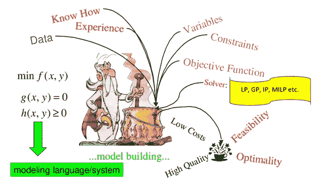
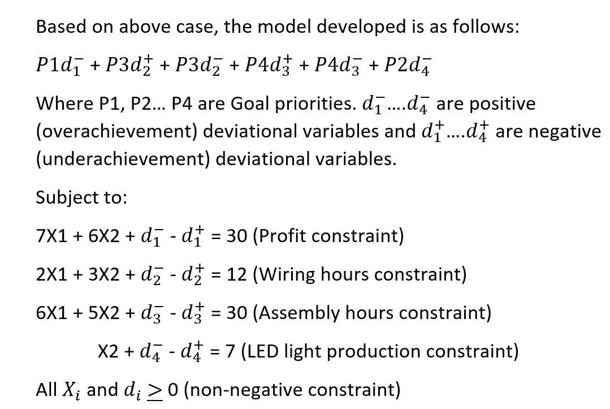
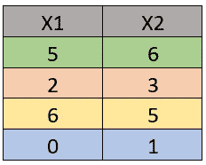
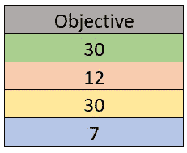
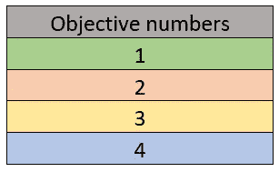
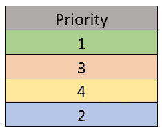
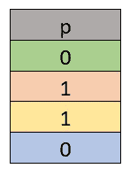
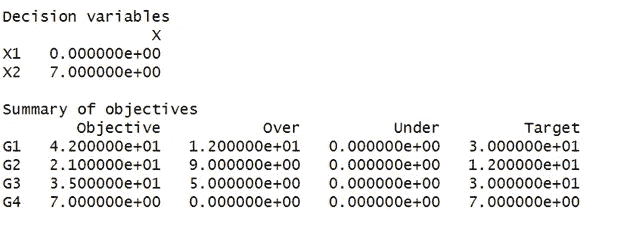

# 用 R — Part2 求解多目标优化模型

> 原文：<https://pub.towardsai.net/multi-objective-optimization-model-solved-using-r-part2-958a9a6f1bf0?source=collection_archive---------1----------------------->

## [优化](https://towardsai.net/p/category/optimization)



来源—[https://musfirsays . WordPress . com/2012/02/22/mathematical-optimization/](https://musfirsays.wordpress.com/2012/02/22/mathematical-optimization/)

用“R”解决目标规划的多目标优化问题是不是很棒？

如果是的话，那么你可以证明一些事情。

在这篇文章中，我将深入探讨当我们手头已经有了开发的模型时，如何解决多目标优化问题？

我将利用“R”语言，在给定开发模型、其目标、约束和偏差变量的情况下，找到最佳解决方案。我将进一步阐述解决方案，使您了解它的每个方面。

在第 1 部分中，

[**多目标优化模型开发采用目标规划**](/multi-objective-optimization-problem-using-goal-programming-7bbfcaa0b3bd)

我已经从零开始阐述了完整的模型制定过程。

让我从重复前面使用的制造案例开始，优化模型就是基于这个案例开发的。

一家受欢迎的照明公司生产两种产品系列，彩色灯罩和 LED 灯。这两种产品都需要两步生产过程，包括接线和组装。给每个灯罩接线大约需要 2 个小时，给每个 LED 灯接线需要 3 个小时。灯罩和 LED 灯的最终组装分别需要 6 个小时和 5 个小时。生产能力是这样的，只有 12 小时的布线时间和 30 小时的组装时间可用。该公司严格要求最大限度地利用布线部门的工作时间，不得有任何浪费，同时也不希望装配部门加班。它从每个灯罩中获利 7 美元，从每个 LED 灯中获利 6 美元。此外，公司有合同义务完成至少 7 个 LED 灯的交付。

但与此同时，该公司正在向一个新的战略位置转移，并认为最初的利润最大化并不是一个现实的目标。管理层设定的利润水平为 30 美元，在此期间是令人满意的。

在生产时间有限的情况下，公司希望找到尽可能接近这一目标的产品组合。

基于上述情况，开发的模型如下:



来源—按作者

其中 X1 和 X2 是决策变量。

现在。让我们解决这个问题，得到我们的最优解。

步骤 1 —构建系数矩阵。

在这种情况下，我们的系数将从与 X1 和 X2 变量相关的数值中导出。

即 7×1+6×2、2×1+3×2、6×1+5×2 和 X2。

这为我们提供了 4 x 2 矩阵



这里，行数等于目标数，列数等于决策变量数。

步骤 2——构建目标向量

目标向量是为目标设定的要达到的目标值。



这里元素的数量等于目标的数量。

步骤 3-构建定义成就目标的成就数据框架。

该数据框将第一列设置为目标，并包含特定目标的索引。



因为我们有 4 个目标，所以提到了计数 1，2…4。

第二列是优先级，它记录了所分配目标的优先级。



由于第一个目标具有最高优先级，其次是第四个目标，然后分别是第二个和第三个目标，因此下文对其进行了描述。

第三列是正偏差变量的表示(超额完成)。



一般来说，它在“R”视觉中用符号“p”来表示。

第 4 列是负偏差变量的表示(成绩不良)。


一般来说，它在“R”视觉中用符号“n”来表示。

步骤 4——利用 R 包和函数，根据偏差变量的最小化，最终计算出最佳结果。

这里“R”使用一种改进的单纯形法来导出一个最优解。

这里要考虑的更重要的一点是，如果除了优先级之外，还要考虑目标的权重，那么数据框将有五个命名列。前四列与上面已经提到的列相同。第五列称为“w ”,它是与指定优先级相关的权重。

下面是显示计算的完整 R 代码。

```
# Copy "goalprog" package from the specified pathurl <- "[https://cran.r-project.org/src/contrib/Archive/goalprog/goalprog_1.0-2.tar.gz](https://cran.r-project.org/src/contrib/Archive/goalprog/goalprog_1.0-2.tar.gz)"
pkgFile <- "goalprog_1.0-2.tar.gz"
download.file(url = url, destfile = pkgFile)# Install "goalprog" package
install.packages(pkgs=pkgFile, type="source", repos=NULL)library(goalprog)# Use function llgp() to solve multi-opjective optimization model# List coefficients as specified in objective functions
# Store as a matrix
coefficients <- matrix( c( 7, 6, 2, 3, 6, 5, 0, 1 ), nrow=4, byrow=TRUE )
coefficients# List target values as specified in objective functions
# Store as a vector
targets <- c( 30, 12, 30, 7 )
targets# List achievement goals as specified in objective functions
# Store as a data frame, where 1st column is objective,2nd column is priority,
# 3rd column is deviational variable indicating overachievement and is indicated as p,
# 4th column is deviational variable indicating underachievement and is indicated as n,  
achievements <- data.frame( matrix( 
  c( 1, 1, 0, 1, 
     2, 3, 1, 1, 
     3, 4, 1, 1, 
     4, 2, 0, 1), nrow=4, byrow=TRUE ) )
# Functions to get or set the names of an object.
names( achievements ) <- c( "objective", "priority", "p", "n" )
achievementssoln <- llgp( coefficients, targets, achievements )
soln$out
print( soln$out)
```

从执行“R”代码中捕捉到的结果的一瞥，我将详细解释它以得出结论。



上述结果表明

X1 为 0(在此期间没有生产灯罩)

X2 as 7(根据合同义务生产 7 盏 LED 灯)

d1+ = 12(利润超额完成 12 美元，因为目标是 30 美元，但实际完成是 42 美元)。

d2+ = 9(布线部门超负荷工作 9 小时，目标是 12 小时，但实际达到 21 小时)

d3+ = 5(装配部门加班 5 小时，因为目标是 30 小时，但实际是 35 小时)

注意-根据最佳结果，在这种情况下，不需要对成绩不佳偏离变量值进行优化，因此“低于”列的所有值都为 0。根据手头的问题，最佳解决方案也可以包括成就不良偏差变量。


来源:[https://economic times . India times . com/jobs/5-ways-to-deal-with-a-coach-a-colleat-who-take all-the-credit/share-credit/slide show/67636783 . CMS](https://economictimes.indiatimes.com/jobs/5-ways-to-deal-with-a-colleague-who-takes-all-the-credit/share-credit/slideshow/67636783.cms)

因此，根据这一结果，我们得出结论，我们的目标利润和无合同违约的高优先级目标已经以较低优先级目标为代价得到了很好的照顾，因为目标规划基于“满意”原则而不是完全最小化或最大化原则。在这种情况下，在给定目标优先级和约束的情况下，实现的解决方案是最优的。

希望你喜欢这个。

你可以在 LinkedIn 上关注我: [Supriya Ghosh](https://www.linkedin.com/in/supriya-ghosh)

还有推特: [@isupriyaghosh](https://twitter.com/isupriyaghosh)