# 多分辨率图像处理和压缩

> 原文：<https://pub.towardsai.net/multi-resolution-image-processing-and-compression-ecc249d817dc?source=collection_archive---------0----------------------->

## 使用 Monk，低代码深度学习工具和计算机视觉的统一包装器，使计算机视觉变得简单。

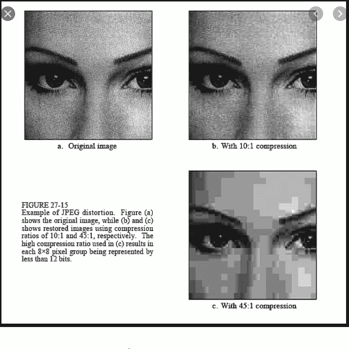

参考:[谷歌图片](https://www.google.com/search?q=Image+compression&rlz=1C1CHBF_enIN847IN847&sxsrf=ALeKk00Xhl07iewuv6GODdQCwkLA2tuFDQ:1582465441269&source=lnms&tbm=isch&sa=X&ved=2ahUKEwi25PuT5-fnAhV_ILcAHTIsAN0Q_AUoAnoECA8QBA&biw=1536&bih=754#imgrc=phG11RZKAfgFdM)

# 目录

1.  **多尺度图像处理**
2.  **形象金字塔**
3.  **使用 OpenCV 的图像金字塔**
4.  **使用金字塔进行图像混合**
5.  **图像压缩**

# 多尺度图像处理

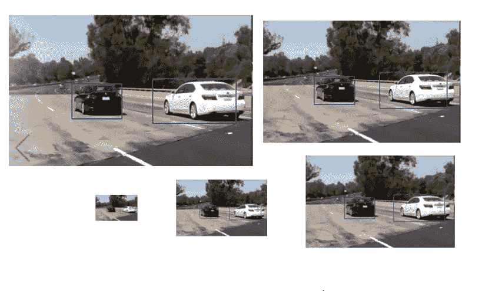

> 优势

*   缩小规模以减少存储需求。
*   放大图像以进行缩放操作。
*   缩放图像并组合它们用于增加图像清晰度。

# **图像金字塔**

*   这种放大和缩小可以被想象成金字塔。由此得名金字塔图像处理。

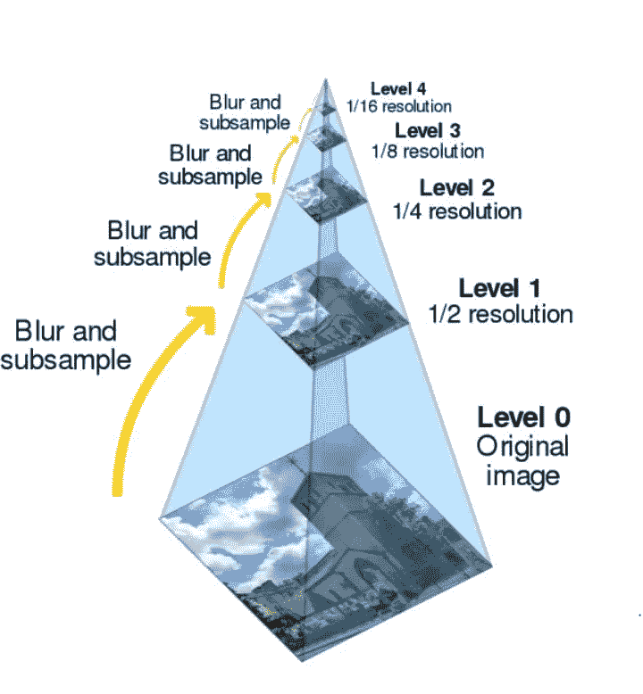

# 使用 OpenCV 的图像金字塔

> 使用 OpenCV 降低金字塔

```
%matplotlib inline
import numpy as np
import cv2
from matplotlib import pyplot as plt
img = cv2.imread("imgs/chapter8/indoor.jpg", 0)print("Original Image shape            - {}".format(img.shape))lower_reso1 = cv2.pyrDown(img)print("First Lower Pyramid Image shape - {}".format(lower_reso1.shape))f = plt.figure(figsize=(15,15))
f.add_subplot(2, 1, 1).set_title('Original Image')
plt.imshow(img, cmap="gray")
f.add_subplot(2, 1, 2).set_title('Lower level 1 Image')
plt.imshow(lower_reso1, cmap="gray")
plt.show()
```

输出

```
Original Image shape            - (423, 640)
First Lower Pyramid Image shape - (212, 320)
```

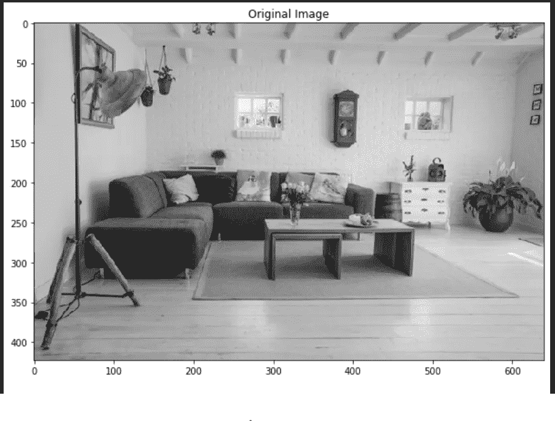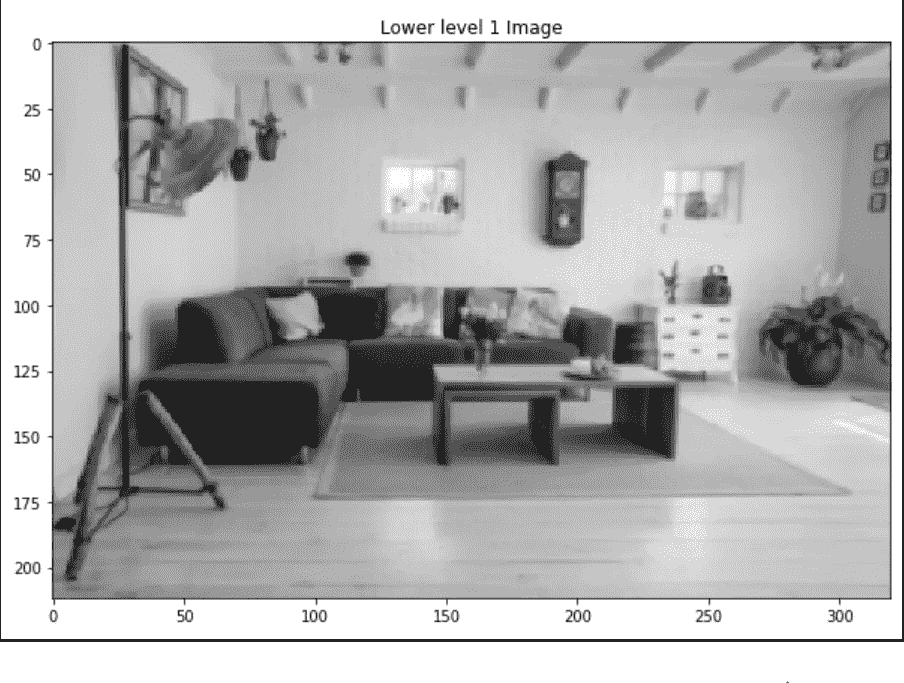

注意:看图像旁边的比例，而不是可见的形状

> 使用 OpenCV 的更高金字塔

```
%matplotlib inline
import numpy as np
import cv2
from matplotlib import pyplot as plt
img = cv2.imread("imgs/chapter8/indoor.jpg", 0)
print("Original Image shape            - {}".format(img.shape))
lower_reso1 = cv2.pyrDown(img)
print("First Lower Pyramid Image shape - {}".format(lower_reso1.shape))
restored_reso = cv2.pyrUp(lower_reso1)
print(" Restored Image shape           -{}".format(restored_reso.shape))
f = plt.figure(figsize=(15,15))
f.add_subplot(2, 1, 1).set_title('Original Image')
plt.imshow(img, cmap="gray")
f.add_subplot(2, 1, 2).set_title('Restored Image')
plt.imshow(restored_reso, cmap="gray")
plt.show()
```

输出

```
Original Image shape            - (423, 640) 
First Lower Pyramid Image shape - (212, 320)  
Restored Image shape           - (424, 640)
```

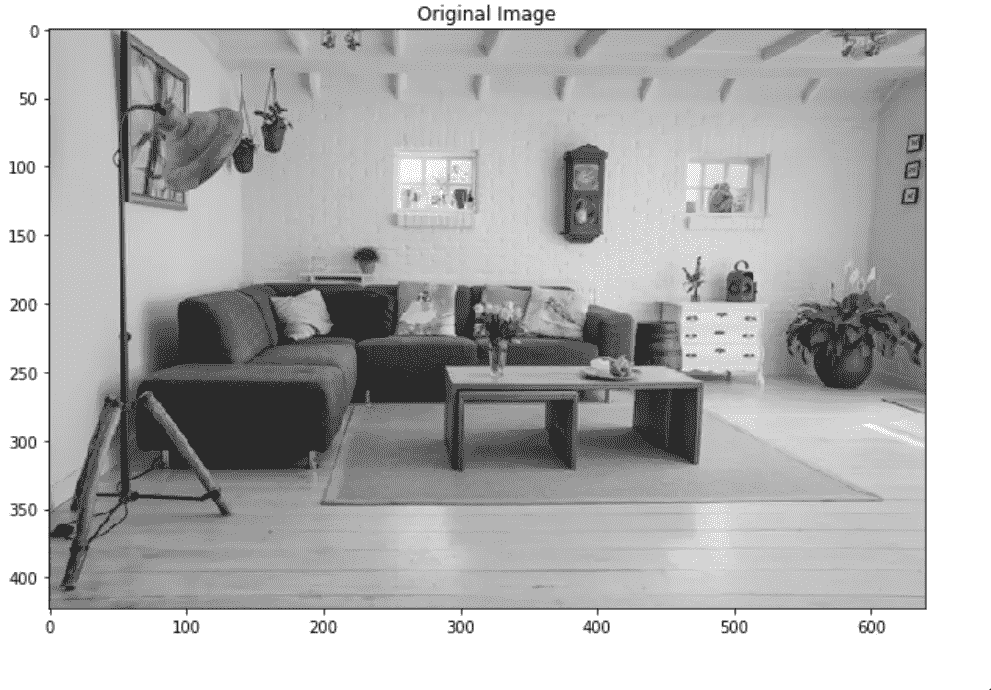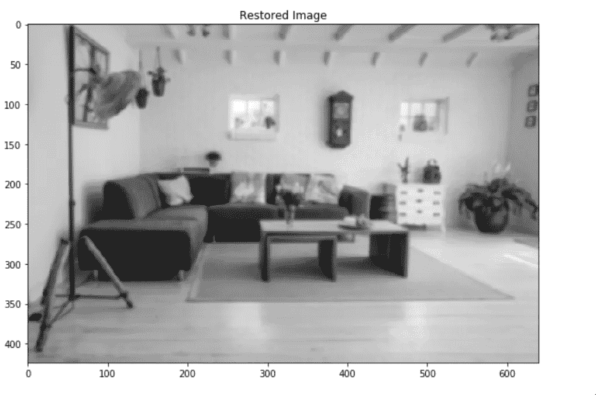

> *高斯金字塔缩减*

```
%matplotlib inline
**import** **numpy** **as** **np**
**import** **cv2**
**from** **matplotlib** **import** pyplot **as** plt
A = cv2.imread("imgs/chapter8/sea.jpg", 1);
height, width, channel = A.shape;

gaussian_pyramid = [];

*# First image in pyramid is the orginal one*gaussian_pyramid.append(A);

*# Then for six times we apply pyramid down functions*
**for** i **in** range(5):
    A = cv2.pyrDown(A)
    B = np.zeros((height, width, 3), dtype=np.uint8)
    B[:A.shape[0], :A.shape[1], :] = A[:, :, :]
    gaussian_pyramid.append(B)img1 = np.hstack((gaussian_pyramid[0], gaussian_pyramid[1]))
img2 = np.hstack((gaussian_pyramid[2], gaussian_pyramid[3]))
img3 = np.hstack((gaussian_pyramid[4], gaussian_pyramid[5]))

out = np.vstack((img1, img2, img3))

plt.figure(figsize=(15, 15))
plt.imshow(out[:,:,::-1])
plt.show()
```


> *拉普拉斯金字塔放大*

```
%matplotlib inline
**import** **numpy** **as** **np**
**import** **cv2**
**from** **matplotlib** **import** pyplot **as** plt
A = cv2.imread("imgs/chapter8/outdoor.jpg", 1)

down = cv2.pyrDown(A)
up = cv2.pyrUp(down)

print(A.shape, up.shape)
laplacian_up = cv2.subtract(A, up)

plt.figure(figsize=(15, 15))
plt.imshow(laplacian_up[:,:,::-1])
plt.show()
```

输出

```
(360, 640, 3) (360, 640, 3)
```

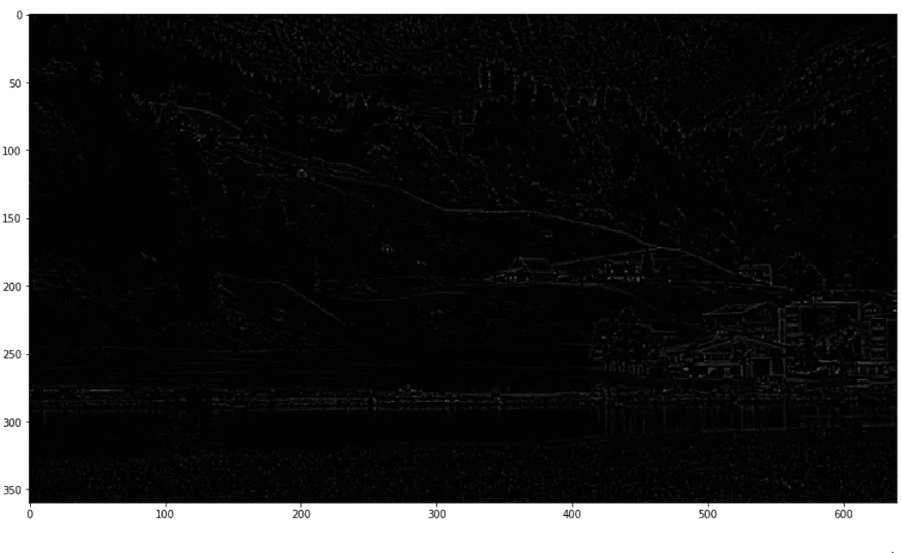

# 使用金字塔的图像混合

> 图像的持续集成

```
*'''
Image credits: https://github.com/opencv/opencv/tree/master/samples/data*
'''%matplotlib inline
**import** **numpy** **as** **np**
**import** **cv2**
**from** **matplotlib** **import** pyplot **as** plt
A = cv2.imread("imgs/chapter8/orange.jpg", 1);
B = cv2.imread("imgs/chapter8/apple.jpg", 1);

*# generate Gaussian pyramid for A*
G = A.copy()
gpA = [G]
**for** i **in** range(6):
    G = cv2.pyrDown(G)
    gpA.append(G)

*# generate Gaussian pyramid for B*
G = B.copy()
gpB = [G]
**for** i **in** range(6):
    G = cv2.pyrDown(G)
    gpB.append(G)

*# generate Laplacian Pyramid for A*
lpA = [gpA[5]]
**for** i **in** range(5,0,-1):
    GE = cv2.pyrUp(gpA[i])
    L = cv2.subtract(gpA[i-1],GE)
    lpA.append(L)

*# generate Laplacian Pyramid for B*
lpB = [gpB[5]]
**for** i **in** range(5,0,-1):
    GE = cv2.pyrUp(gpB[i])
    L = cv2.subtract(gpB[i-1],GE)
    lpB.append(L)

*#Now add left and right halves of images in each level*
LS = []
**for** la,lb **in** list(zip(lpA,lpB)):
    rows,cols,dpt = la.shape
    ls = np.hstack((la[:,0:cols//2], lb[:,cols//2:]))
    LS.append(ls)

*# now reconstruct*
ls_ = LS[0]
**for** i **in** range(1,6):
    ls_ = cv2.pyrUp(ls_)
    ls_ = cv2.add(ls_, LS[i])

*# image with direct connecting each half*
real = np.hstack((A[:,:cols//2],B[:,cols//2:]))
*#cv2.imwrite('Pyramid_blending2.jpg',ls_)*
*#cv2.imwrite('Direct_blending.jpg',real)* 

f = plt.figure(figsize=(15,15))
f.add_subplot(2, 1, 1).set_title('Pyramidal Blending');
plt.imshow(ls_[:, :,::-1])
f.add_subplot(2, 1, 2).set_title('Direct Blending');
plt.imshow(real[:, :,::-1]);
plt.show()
```

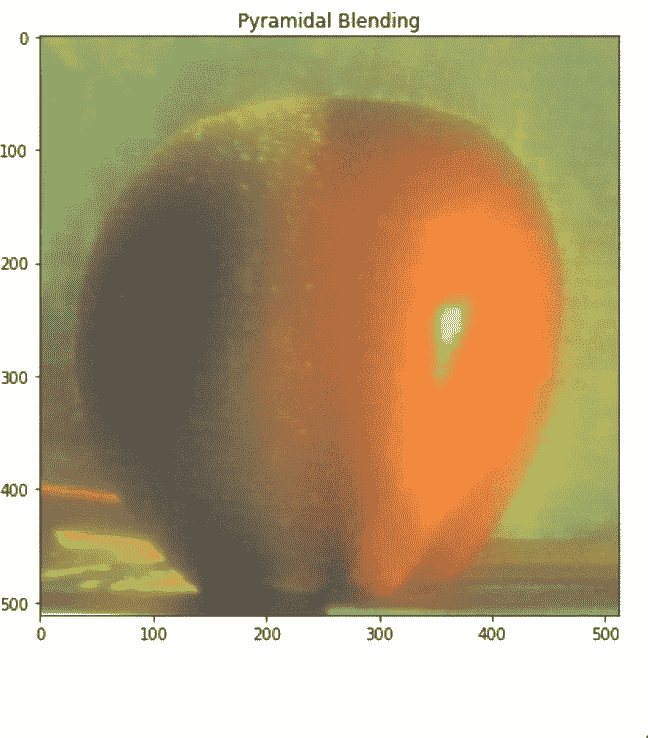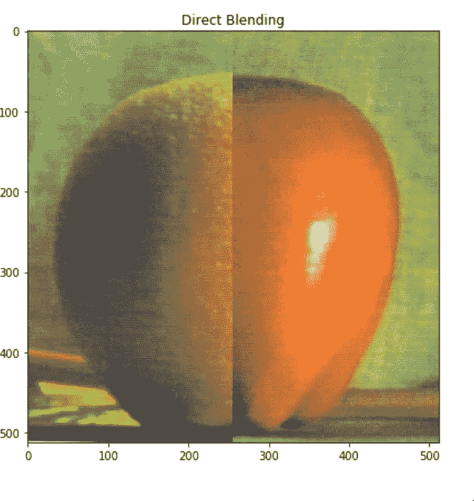

# 图像和视频压缩

*   到 2020 年底，数字世界预计将产生 45z 字节的数据。其中大部分是图像和视频。平均而言，个人日常互联网数据使用的 80 %来自视频和图像。

> 迫切需要无损数据压缩技术

*   更少的数据传输
*   较少的数据存储

> 流行的图像压缩技术

> 无损压缩

*   用于 BMP 文件的游程编码。
*   压缩用于 PNG 文件的数据。
*   用于 gif 的 LZW 压缩

> 有损压缩

*   联合图像专家组

你可以在 Github 上找到完整的 jupyter 笔记本。

如果你有任何问题，你可以联系[阿布舍克](https://www.linkedin.com/in/abhishek-kumar-annamraju/)和[阿卡什](https://www.linkedin.com/in/akashdeepsingh01/)。请随意联系他们。

我对计算机视觉和深度学习充满热情。我是 [Monk](https://github.com/Tessellate-Imaging/Monk_Object_Detection) Libraries 的开源贡献者。

你也可以在以下网址看到我的其他作品:

[](https://medium.com/@akulahemanth) [## 阿库拉·赫曼思·库马尔培养基

### 阅读阿库拉·赫曼思·库马尔在媒介上的作品。计算机视觉爱好者。每天，阿库拉·赫曼思·库马尔和…

medium.com](https://medium.com/@akulahemanth) 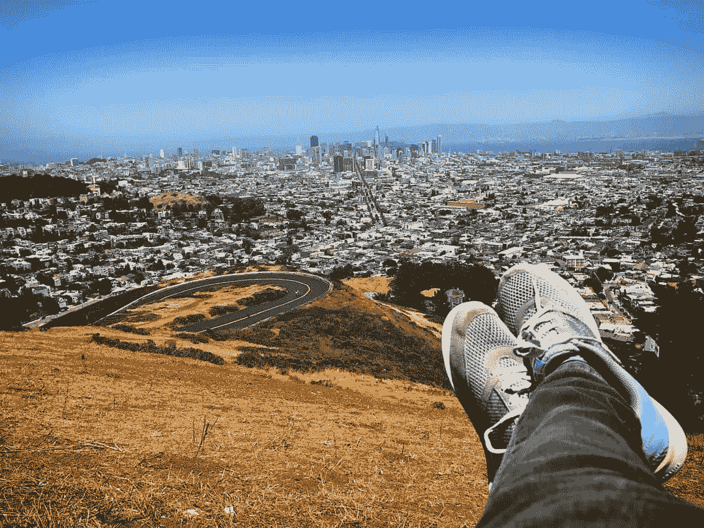

照片由 [Srilekha](https://www.instagram.com/_fernwehd_._/) 拍摄