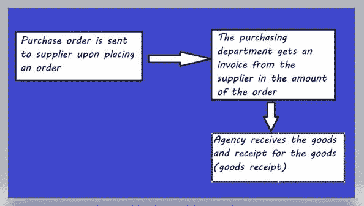
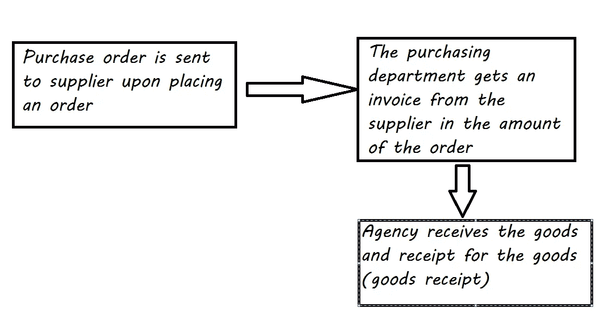
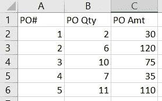
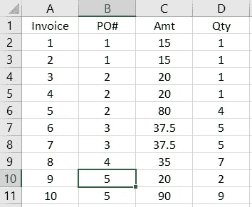
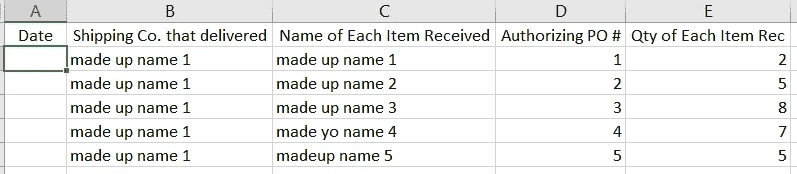
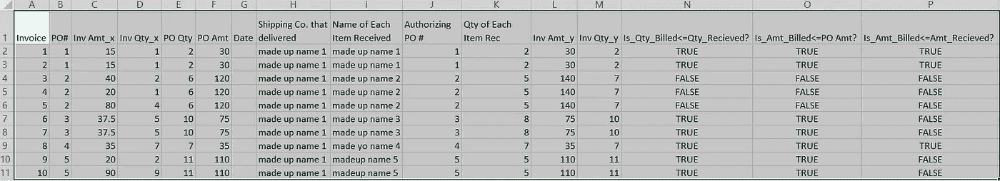

# Python 中的多维数据建模实现了三向匹配的自动化

> 原文：<https://pub.towardsai.net/multidimensional-data-modeling-in-python-to-automate-3-way-match-8641c5f29671?source=collection_archive---------0----------------------->



作者

## [计算机科学](https://towardsai.net/p/category/computer-science)

## 三向匹配审计自动化

本文将介绍如何使用多维建模来规划和自动化财务/会计数据库中的三向匹配。

# 目录:

## 一.什么是三方匹配？

## 二。数据集信息

## 三。导入文件

## 四。多维建模

## 动词 （verb 的缩写）将三向匹配编码到我们的多维模型中

*   条件 1:开单数量必须小于或等于订购数量。
*   条件 2:发票价格必须小于或等于采购订单价格
*   条件 3:开单数量必须小于或等于收货数量

## 一.什么是三方匹配？

“三方匹配就是比较[采购订单](https://www.gep.com/knowledge-bank/glossary/purchase-order)的过程；在审核供应商的付款发票之前，货物接收单和供应商的发票。三方匹配有助于确定发票是应该部分支付还是全部支付。”(【https://www.gep.com/knowledge-bank/glossary/three-way-match】T4)



过程

收到货物后，采购机构会将上述流程中的所有三个文件进行匹配:

1.  邮局（post office)
2.  发票
3.  货物收据

## **二。数据集信息**

有三个单独的表:

包含 5 行数据的采购订单表:



有 10 行数据的发票表:



货物收据表:



## **三世。导入文件**

启动您的 python 编辑器。将此键入导入包:

```
import pandas as pd
from glob import glob
```

使用 glob 一次拉入文件:

```
filenames = glob(r’C:\*the path you are taking*\Three Way Match\*.csv’)
dataframes = [pd.read_csv(f) for f in filenames]```
```

将数据框列表与变量数据框分开，并将其重命名:

```
df_inv=dataframes[0]
df_po=dataframes[1]
df_receipt = dataframes[2]
```

## **四。多维建模**

现在我们有了 3 个数据框，我们可以利用维度事实建模和自动化 3 向匹配过程对它们进行建模。

让我们从第一个连接开始。对于这个连接，我们将使用一个 join。以下是对连接的快速回顾:

[](https://imgur.com/gallery/8u7fc/comment/1014793793) [## SQL 连接——我重新做了这个...

### 帖子有 121 票和 6855 次浏览。标记为 SQL、SQL 连接、cat taxwartickler 分享。SQL 联接-我重新制作了…

imgur.com](https://imgur.com/gallery/8u7fc/comment/1014793793) 

好了，让我们连接发票表和采购订单表。现在请记住，一份采购订单可以有多张发票。

下面是这种一对多关系的图示:


采购订单和发票之间的一对多关系

这意味着，如果您正在进行左连接，您应该使用 invoice 表作为您的左表，以便为发票拉入采购订单。要进行左连接，可以在 pandas 中使用 pd.merge。

```
df_connect_1=pd.merge(df_inv,df_po,how=’left’,left_on=[‘PO#’],right_on=[‘PO#’])
```

现在，让我们将上面名为 df_connect_1 的数据帧连接到包含货物收据信息的第三个表:

```
df_connect_2=pd.merge(df_connect_1,df_receipt,how=’left’,left_on=[‘PO#’],right_on=[‘Authorizing PO #’])
```

好的，我们知道我们已经将发票总额与 PO 金额进行了比较。但是，当我们连接我们的表时，发票到采购订单的关系是多发票到一个采购订单的关系。这意味着我们将知道必须在 df_connect_2 上使用聚合后连接/混合来获得一行的总发票金额。

```
dfinvoice_sum=df_connect_2.groupby("PO#")["Inv Amt","Inv Qty"].sum()df_connect_3=pd.merge(df_connect_2,dfinvoice_sum,how='left',left_on=['PO#'],right_on=['PO#'])
```

上述代码中的第一行按 PO#(按 PO 分组)合计发票金额和数量。

## **V .将三方匹配编码到我们的多维模型中**

现在，让我们编写 3 路匹配的代码:

a.条件 1:开单数量必须小于或等于订购数量。

为了测试这个条件，我们可以使用这个代码。此代码是一个布尔条件，将根据条件是否满足而返回“真”或“假”:

```
df_connect_3['Is_Qty_Billed<=Qty_Recieved?']=df_connect_3['Inv Qty_y']<=df_connect_3['PO Qty']
```

b.条件 2:发票价格必须小于或等于采购订单价格

```
df_connect_3['Is_Amt_Billed<=PO Amt?']=df_connect_3['Inv Amt_y']<=df_connect_3['PO Amt']
```

c.条件 3:开单数量必须小于或等于收货数量

```
df_connect_3['Is_Amt_Billed<=Amt_Recieved?']=df_connect_3['Inv Qty_y']<=df_connect_3['Qty of Each Item Rec']
```

就这样，三向匹配现在是自动的了。



输出曲线描绘台

感谢您的阅读。

参考资料:

1—(【https://www.gep.com/knowledge-bank/glossary/three-way-match】T2)

以下是我的一些其他文章:

[](/machine-learning-c84c2795c296) [## 机器学习

### 如何用 Weka 和 Python 预测肺癌

pub.towardsai.net](/machine-learning-c84c2795c296) [](/how-to-shortest-loop-any-euclidean-travelling-salesman-problem-c13c08841f94) [## 如何最短循环任何欧几里德旅行商问题

### 笛卡尔坐标系统

pub.towardsai.net](/how-to-shortest-loop-any-euclidean-travelling-salesman-problem-c13c08841f94) [](/can-multiple-linear-regression-be-improved-with-instance-level-statistics-27282e6a7070) [## 多元线性回归可以用实例级统计改进吗？

### 估计混凝土抗压强度

pub.towardsai.net](/can-multiple-linear-regression-be-improved-with-instance-level-statistics-27282e6a7070) [](/how-to-perform-letter-recognition-in-python-using-random-forest-classifier-cdaca6a58e31) [## 如何使用随机森林分类器在 Python 中执行字母识别

### 目录:

pub.towardsai.net](/how-to-perform-letter-recognition-in-python-using-random-forest-classifier-cdaca6a58e31) [](/how-to-use-weka-to-predict-thyroid-disease-e8571c9330d4) [## 如何使用 Weka 预测甲状腺疾病

### 一.数据集信息

pub.towardsai.net](/how-to-use-weka-to-predict-thyroid-disease-e8571c9330d4) [](/how-to-write-a-statistical-learning-model-in-excel-to-predict-whether-a-bank-note-is-fake-or-not-992c996ef883) [## 如何在 Excel 中写一个统计学习模型来预测一张钞票是不是假钞

### 数据集源:

pub.towardsai.net](/how-to-write-a-statistical-learning-model-in-excel-to-predict-whether-a-bank-note-is-fake-or-not-992c996ef883) [](https://medium.com/analytics-vidhya/breast-cancer-prediction-with-geometric-mean-classification-with-probabilistic-optimization-2e2988cb8bd1) [## 基于概率优化的几何平均分类乳腺癌预测

### 本文将讨论基于 UCI 机器学习数据集的乳腺癌诊断预测

medium.com](https://medium.com/analytics-vidhya/breast-cancer-prediction-with-geometric-mean-classification-with-probabilistic-optimization-2e2988cb8bd1) [](/building-and-deploying-a-data-science-web-application-to-recognize-flowers-using-geometric-mean-c700d23e187) [## 构建和部署一个数据科学 Web 应用程序来识别花朵

### App 使用几何平均分类器

pub.towardsai.net](/building-and-deploying-a-data-science-web-application-to-recognize-flowers-using-geometric-mean-c700d23e187) [](/an-example-of-branchless-logic-using-excel-c6afc6eef75e) [## 使用 Excel 实现无分支逻辑的一个例子

### 这是一篇使用 IRIS flowers 数据集和几何平均分类器作为例子来介绍…

pub.towardsai.net](/an-example-of-branchless-logic-using-excel-c6afc6eef75e) [](/geometric-mean-classifier-for-iris-dataset-ed83209f54f3) [## 虹膜数据集的几何平均分类器

### 这篇文章将通过一个几何平均算法对鸢尾花数据集进行分类。

pub.towardsai.net](/geometric-mean-classifier-for-iris-dataset-ed83209f54f3)