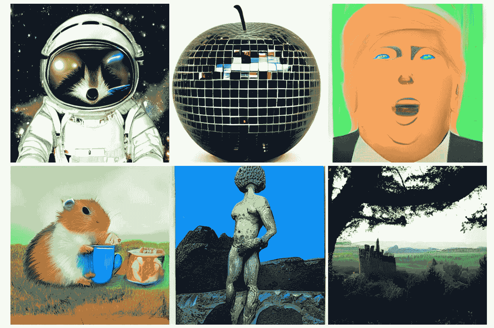
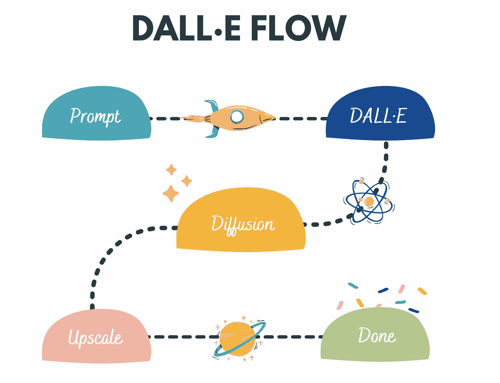

# 多模态人工智能→结合文本和图像

> 原文：<https://pub.towardsai.net/multimodal-ai-combining-text-with-images-f25a150c6cf5?source=collection_archive---------1----------------------->

## OpenAI GPT-3 与 DALL 结合。电子流生成创意艺术品！

DALL 生成的图像。电子流量

# 概观

在本文中，我们将探讨如何将 GPT 3 的文本生成功能与 DALL 的创意图像生成部分结合起来。如果使用传统的设备，制作一件艺术品可能需要几天甚至几个月的时间😱

事不宜迟，让我们使用[GPT 3 text generation](https://hub.jina.ai/executor/ub03fi15)Executor 以莎士比亚的风格写一首关于非结构化数据的诗，并使用 [DALL 为其生成插图。电子流](https://github.com/jina-ai/dalle-flow)。

我们将使用下面的 colab 笔记本来访问 GPT-3 执行器，因为它将所有的计算都放在云上，所以您不必担心依赖性👇

 [## GTP 三号客户端

### 使用 GPT-3 和 Hub Executor 构建多模式应用程序

colab.research.google.com](https://colab.research.google.com/github/Shubhamsaboo/gpt3-text-generation/blob/main/Jina_GPT3.ipynb#scrollTo=jaWq2U08KaqE) 

我们将把 GPT-3 生成的诗作为输入发送给 DALL。为我们的诗生成艺术插图。我们将使用下面的笔记本来完成这项工作👇

 [## 达尔。电子流量

### 使用 DALL。e 流客户端生成艺术图片

colab.research.google.com](https://colab.research.google.com/github/jina-ai/dalle-flow/blob/main/client.ipynb#scrollTo=13cf87ce) 

# 图形艺术书籍

## GPT-3 🖌生成的诗

> 非结构化数据就像田野里的野花
> 
> 它漂亮又免费，
> 
> 但是这很难控制
> 
> 而且很难找到
> 
> 当你在寻找特定的东西时！

## 图形插图🎨

下面是上面使用 DALL 生成的诗的逐行图解。电子流量👀

第 1 行→ " **非结构化数据就像田野里的野花**"

由 DALL 生成。电子流量

第 2 行→“是**好看又自由**”

由 DALL 生成。电子流量

第 3 行→ " **但是可能很难控制**"

由 DALL 生成。电子流量

第 4 行→ " **当你在寻找某样特定的东西时，很难找到！**

由 DALL 生成。电子流量

# 什么是 GPT-3？

GPT-3 是自然语言处理历史上第一个通用语言模型，可以在一系列 NLP 任务中表现同样出色。GPT-3 代表“生成性预训练变压器”，这是 OpenAI 的第三次迭代模型。让我们来分解这三个术语:

*   **生成式:**生成式模型是一种统计模型，用于生成新的数据点。这些模型学习数据集中变量之间的潜在关系，以便生成与数据集中的数据点相似的新数据点。
*   **预训练:**预训练模型是已经在大型数据集上训练过的模型。这使得它们可以用于很难从头开始训练模型的任务。一个预先训练好的模型可能不是 100%准确，但是它可以让你避免重新发明轮子，节省时间，提高性能。
*   **变压器:**变压器模型是 2017 年发明的著名人工神经网络。这是一个深度学习模型，旨在处理序列数据，如文本。Transformer 模型通常用于机器翻译和文本分类等任务。

一些人认为 GPT 3 号是探索人工智能的第一步。要了解它如何彻底改变人工智能领域，请查看 GPT-3 的最新 [***初级读本！***](https://www.datacamp.com/blog/a-beginners-guide-to-gpt-3)

# 什么是 DALL。e 流？

DALL 中涉及的步骤。电子流量

DALL E Flow 是一个交互式工作流，用于根据文本提示生成高清图像。首先，它利用 [DALL E-Mega](https://github.com/borisdayma/dalle-mini) 生成候选图像，然后调用 [CLIP-as-service](https://github.com/jina-ai/clip-as-service) 根据提示对候选图像进行排序。

## 为什么是人在回路中？

生成艺术是一个创造性的过程。虽然 DALL E 的最新进展释放了人们的创造力，但是拥有一个单提示单输出的 UX/UI 将想象力锁定在一个单一的可能性上，无论这个单一的结果多么令人满意，这都是不好的。DALL E Flow 是一行程序的替代方案，它将生成艺术形式化为一个迭代过程。

想知道更多关于 DALL 的事。e 流作品，查看以下 [***GitHub 库***](https://github.com/jina-ai/dalle-flow) 。

# 快速工程:秘方

如果你已经阅读了这篇文章，你可能会思考这些问题🤔

> 如何使用 GPT-3 和 DALL？e 流才能得到最好的结果？
> 
> 如何计算出这些人工智能模型产生预期结果的输入？
> 
> 输入文本的微小变化如何显著影响输出？

所有问题的答案都在一个简单的术语中→ ***提示工程***

> “即时工程是一门艺术和科学，它为生成式人工智能模型提供清晰的输入文本(指令)，从而生成所需的输出。”

编写好的提示的秘密是理解这些人工智能模型对世界的了解，以及如何让模型使用这些信息来生成有用的结果。

要详细了解 Prompt 工程，请查看以下资源👇

*   [奥莱利关于 GPT 的书第二章-3](https://learning.oreilly.com/library/view/gpt-3/9781098113612/)
*   [Cohere 的一篇关于提示工程的文章](https://docs.cohere.ai/prompt-engineering-wiki/)
*   [提示工程:未来的职业](https://medium.com/nerd-for-tech/prompt-engineering-the-career-of-future-2fb93f90f117)

这里有更多关于 Prompt 工程的信息👉

*   [GPT 3 号提示维基](http://gptprompts.wikidot.com/)
*   [文本到图像人工智能提示编写指南](https://docs.google.com/document/d/17VPu3U2qXthOpt2zWczFvf-AH6z37hxUbvEe1rJTsEc/edit?usp=sharing)

# 结论

创造性人工智能的未来看起来非常光明。通过结合文字和图像，我们可以创造出一些真正令人惊叹和独特的创作。这仅仅是你可以用这项技术做什么的开始，你只能想象我们的未来会怎样！

如果你想了解更多，或者想让我写更多关于这个主题的东西，请随时联系我们。

*如果你喜欢这篇文章或觉得它有帮助，请花一分钟按一下拍手按钮，它增加了这篇文章对其他媒体用户的可见性。*