# 使用 SAS 进行多元分析

> 原文：<https://pub.towardsai.net/multivariate-analysis-using-sas-b4f34ced6d0?source=collection_archive---------1----------------------->

## [机器学习](https://towardsai.net/p/category/machine-learning)

T 单变量、多变量和多变量之间的差异经常被忽视。因此，多变量和多变量可以互换使用，尽管它们意味着完全不同的东西。

没有单变量或多变量模型，但是你可以有:

1.  单变量，多变量
2.  多变量
3.  单变量的
4.  多元的，单变量的

多变量意味着多个因变量(Y ),多变量意味着多个自变量(X)。多变量和单变量之间的区别可能是大多数人都知道的，因为你运行的大多数模型都有一个以上的自变量。这意味着你有一个单一的结果和多个预测因素。

单变量和多变量之间的差异将具有更陡峭的学习曲线，因为多变量分析通常会导致原始数据的减少或重构，以处理您试图建模的多个结果。

[一个**多变量模型**可以被认为是在模型方程](https://www.ncbi.nlm.nih.gov/pmc/articles/PMC3518362/)的右边找到多个独立变量的模型。这种类型的统计模型可用于尝试评估多个变量之间的关系；人们可以评估独立的关系，同时调整潜在的混杂因素。

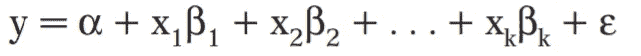

**多变量建模**是指通常来自纵向研究的数据建模，其中在多个时间点测量同一个体的结果(重复测量)，或嵌套/聚类数据建模，其中每个聚类中有多个个体

**多元线性回归模型**是一种评估多个因变量(即 Ys)和一组预测变量(即 Xs)之间关系的模型。

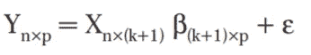

**多变量分析**指的是一种广泛的统计方法，用于同时分析一个主题的多个可靠变量。

尽管科学和商业研究中研究的许多物理和虚拟系统是多变量的，但实际上大多数分析是单变量的。经常发生的情况是，这些关系被合并到一个新的变量中(例如，饲料转化率)。通常，一些**维度缩减**是可能的，使您能够使用图形技术看到复杂数据中的模式。

在单变量统计中，对每个变量进行单独分析只能提供有限的数据视图，因为一次只能计算一个变量的均值和标准差。

如果一个模型有一个以上的因变量，单独分析每个因变量也会增加一组分析中第一类错误的概率*(通常设置为 5%或 0.05)。*

而且，如果你还没有意识到，纵向数据可以用单变量和多变量的方式进行分析——这取决于你想把方差-协方差矩阵放在哪里。

多变量分析的例子有:

1.  **因子分析**可以检查许多变量之间复杂的相互关系，以识别少量的潜在因素。
2.  **判别函数分析**将一组相关预测变量的组间分离最大化，并根据其与整体组均值的相似性对观察值进行分类。
3.  **典型相关分析**检查两组变量之间的关联，并在少量典型变量中最大化组间相关性*(稍后讨论)*。

所以，开始考虑看不见的或潜在的变量。

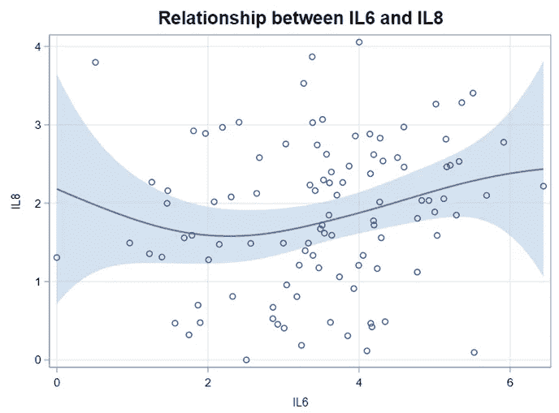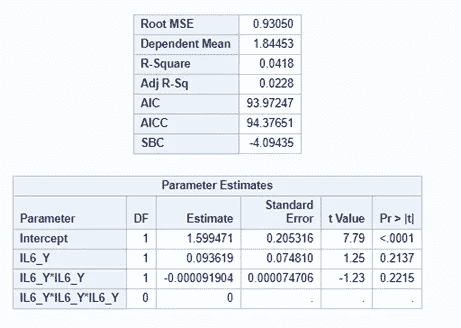

单变量和单变量

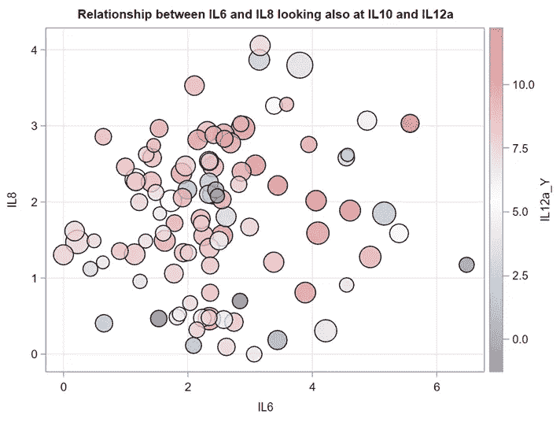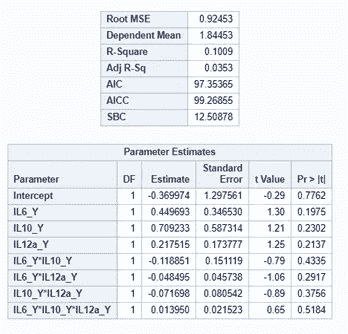

单变量和多变量

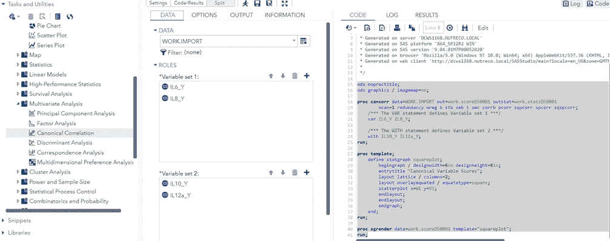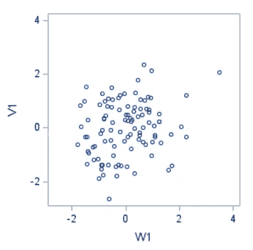

多变量和多变量

M 多变量分析是您可以进行的最危险的分析之一，因为它们能够处理罕见的情况:

1.  大列 N-超过 100 列的数据集
2.  N
3.  Multicollinearity — datasets containing highly correlated data

However, before just applying multivariate analysis on any dataset you see, you must make sure that you **先了解你的数据**。如果这在生物学上没有意义，这个模型也不会在意。

只要看看下面的数据集，看看你是否能发现会使数据分析变得困难的问题。我向你保证，肯定会发现一些问题。

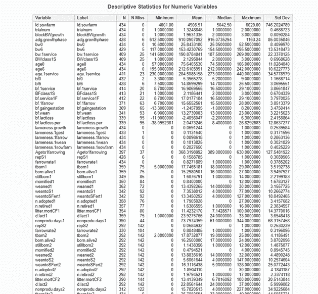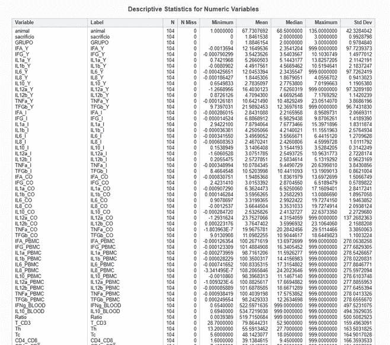

在处理多变量数据时，分析前选择、筛选异常或寻找潜在的收敛错误尤为重要。一旦包含，并且模型运行，由于维度减少，您通常无法找到放入模型中的内容。

在 SAS 中，您可以使用许多工具来探索数据、总结数据、制表和创建关联。

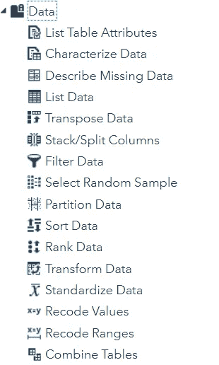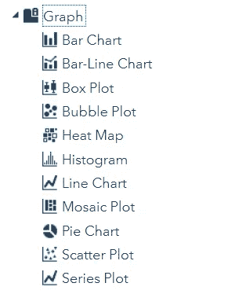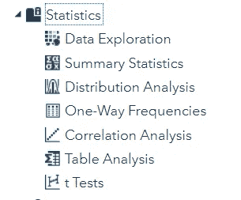

不要忘记，要进行有意义的分析，你需要花大量的时间来争论你的数据。

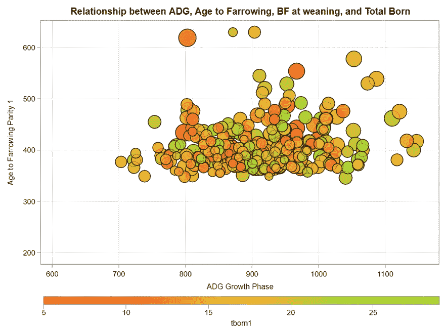

气泡图相当于散点图，但只有 4 个变量。

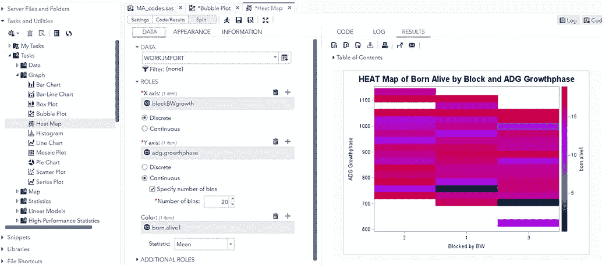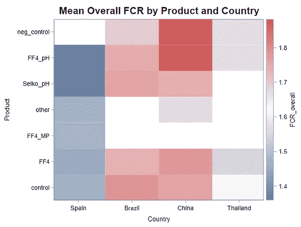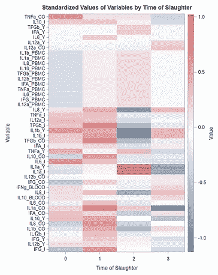

热图

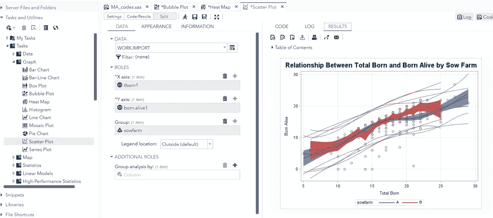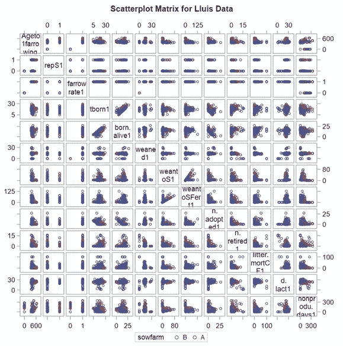

散点图和散点图矩阵。散点图矩阵是一种很好的方式来观察各种变量之间以及各组之间的关系。矩阵中的每个单元格显示两个变量之间的关系。对角线的上下两边是镜像的。对角线显示变量名。

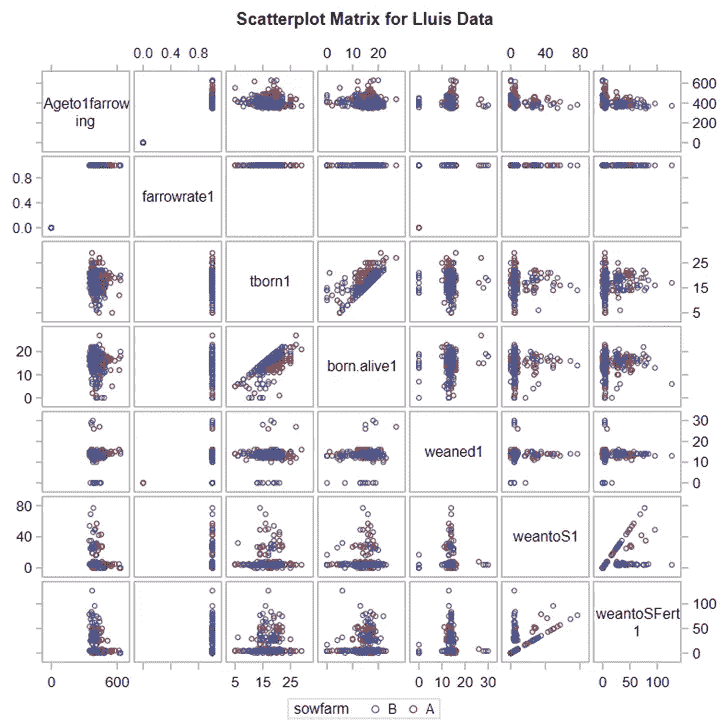

曲线图显示异常值影响散布矩阵。

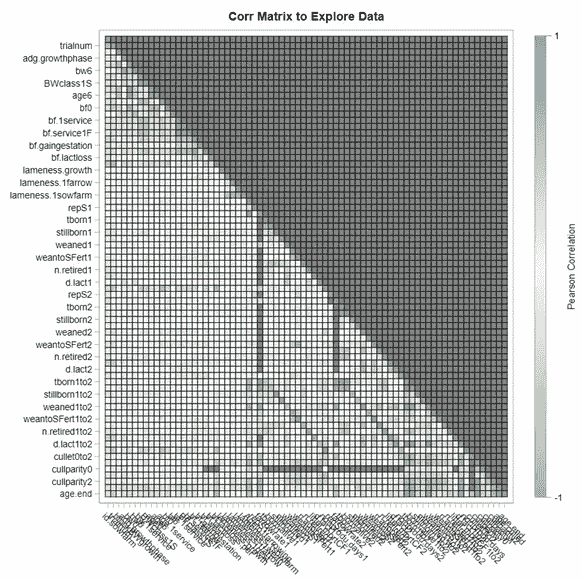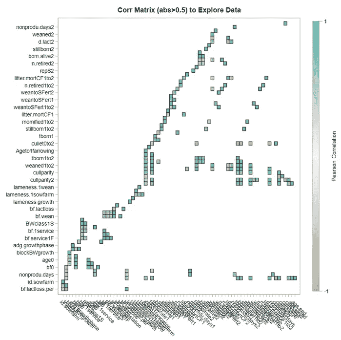

关联矩阵—热图和散点图矩阵的组合。

一个好的第一步是创建几个相关矩阵，以确定最大的相关性。热图也会有所帮助。一旦你确定了放大的地方，使用散点图和气泡图来仔细观察。

所以，是的，你会创建很多图表，所以最好在实际制作之前想好你想制作哪些图表，这样你就不会迷路了！因为绘制数据图是获得洞察力的第一步，所以多重变量意味着你需要聪明地绘制图表。从绘制生物学相关数据开始。然后再看更多未知的数据。

悖论:许多将要介绍的分析方法实际上需要相互关联的数据。因此，如果您发现许多多重共线性，不要担心。其实，拥抱它！这是多元模型发挥最大作用的地方。

好，让我们先从相关性开始，因为它们是事实上的关联性度量。记住，我们想要找到相关性。然而，在这篇文章中，我将讨论的不仅仅是好的皮尔逊相关性。我还将讨论:

1.  古老的皮尔逊相关性——T2——变量 1 能预测变量 2 吗？
2.  典型相关— *集合 1 能预测集合 2 吗？*
3.  判别分析— *变量组合能否用于预测群体成员关系？*

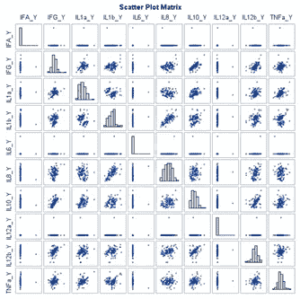

*变量 1 和变量 2 有联系吗？*

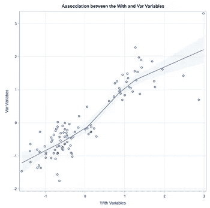

*一组变量和另一组变量有联系吗？*

*变量组合可以用来预测团队成员吗？*

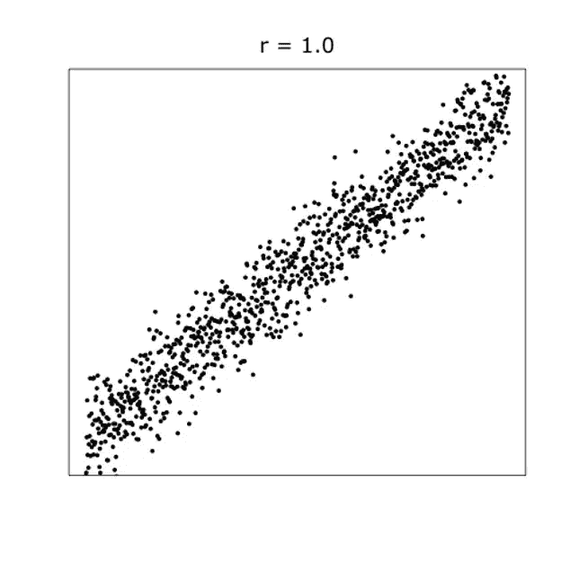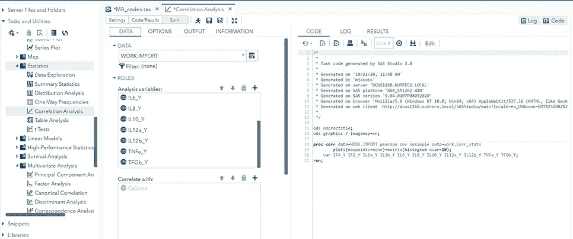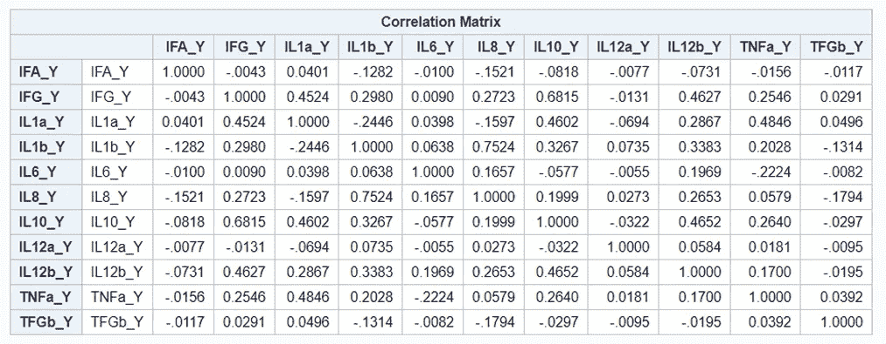

相关性是寻找两个变量之间潜在关系的最简单的方法。寻找绝对值> 0.7。

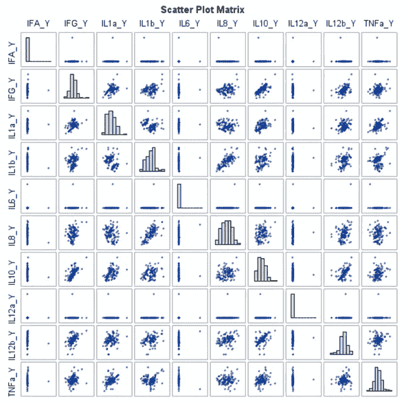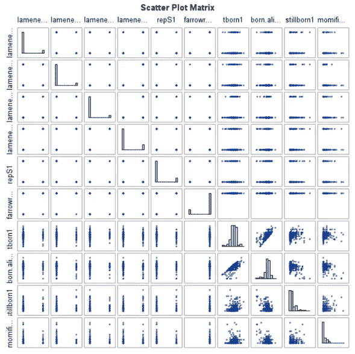

和散点图矩阵。你找的是云，最好是很斜的云。任何不是斜云的东西都不值得你花时间。方向很重要，但首先要找到一个对角线。

当处理相关性时，你也必须处理异常值，因为异常值会使相关性变得非常困难。异常值给信号增加了噪声。

处理异常值有两种可能的方法:

1.  **—根据数据集中的值范围用另一个值替换一个值。第 4 百分位的值被第 5 百分位的值替换；第 97 百分位上的值被第 95 百分位上的值替换。**
2.  **[**修剪**](https://en.wikipedia.org/wiki/Truncated_mean) —删除边界外的值。**

**winsorizing 和 trimming 都是由变量完成的。**

**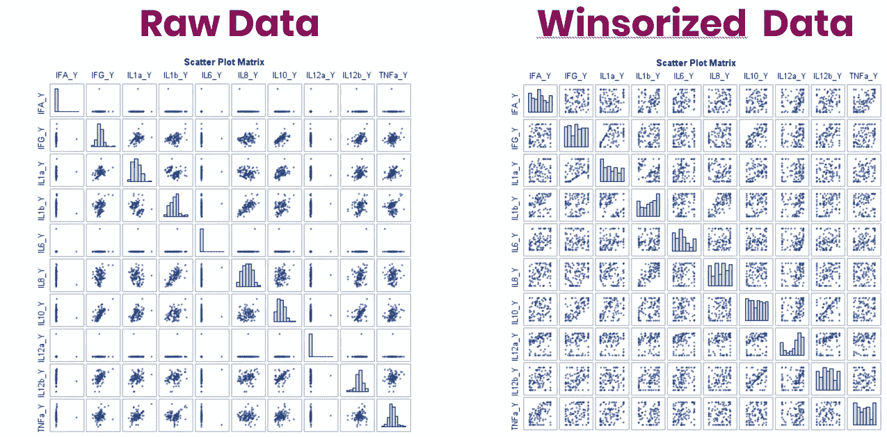**

**您可以立即看到差异，但并不像您预期的那样大。右边的云只有一点点图案。**

******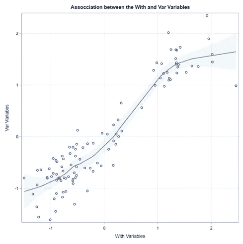

原始数据与 winsorized 数据。转换数据时必须始终小心。有时，您会在想要释放信号的地方引入偏差。** 

**总之，相关性分析对你来说可能并不陌生，尽管它有缺点，但它为探索大量变量提供了一个良好的开端。尤其是查看:**

1.  **关系是存在的**
2.  **已知关系得到确认**
3.  **集群存在**
4.  **有未知的关系**

**N ext-up is 是典型相关分析(CCA)，用于识别和测量两组变量之间的关联。这些集合由分析师定义。没有附加条件。**

**当存在高度多重共线性时，典型相关尤其适用。这是因为 CCA 确定了一组规范变量，这些变量是每组内变量的正交线性组合，能够最好地解释组内和组间的可变性。**

**简而言之，典型相关允许您:**

1.  **解释预测因素与反应之间的关系。**
2.  **解释回答与预测因素之间的关系。**
3.  **检查变量集共有多少个维度。**

**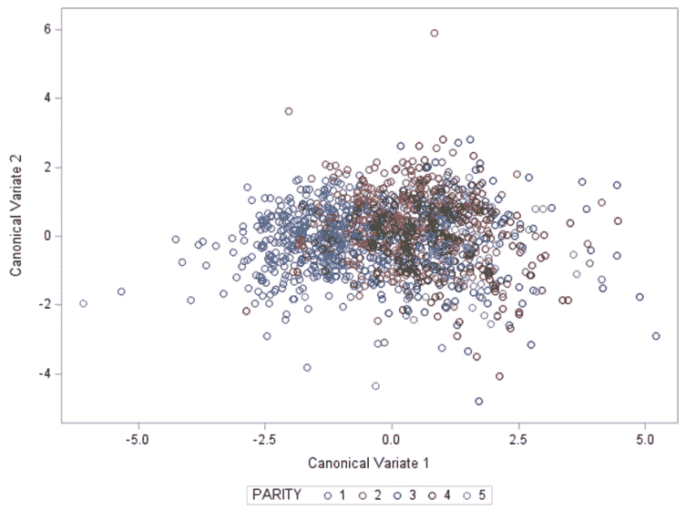**

**用分组因子着色的规范变量。**

**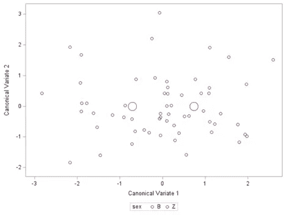****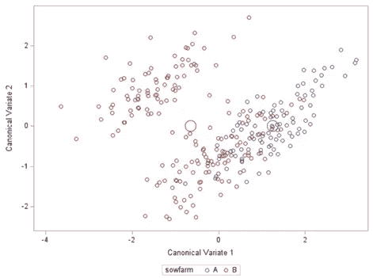****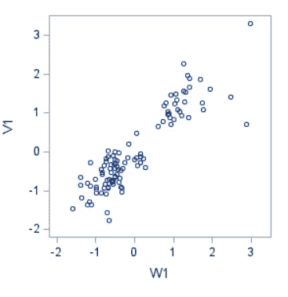****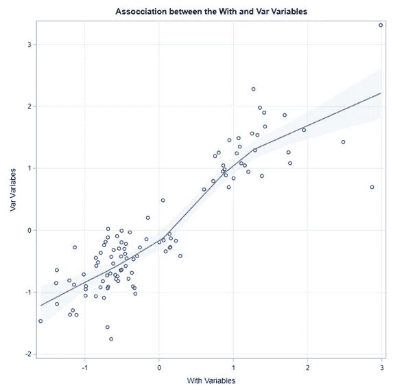**

**这些图显示了数据集中的每个观察值是如何加载到两组变量上的，以及这两组变量是如何相关的。**

**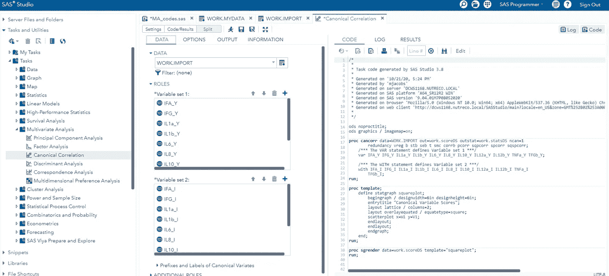**

****PROC CANCORR** 是进行 CCA 的程序。**

**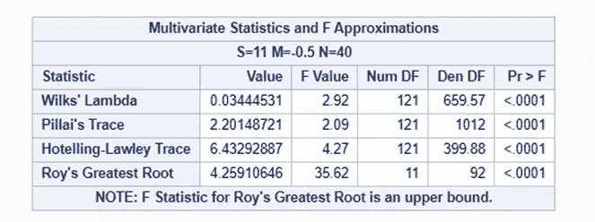**

**这些统计检验了所有典型相关为零的零假设。这些测试的小 p 值(< 0.0001)是拒绝 CCA 没有保证的无效假设的证据。有足够的共享方差！**

**系数解释可能很棘手:**

1.  **标准化系数解决了缩放问题，但它们没有解决变量之间的依赖性问题。**
2.  **系数对评分有用，但对解释没用——分析方法旨在预测！**

******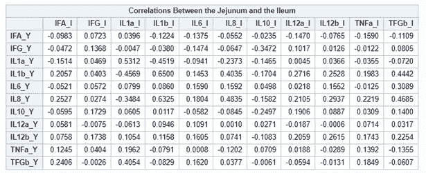****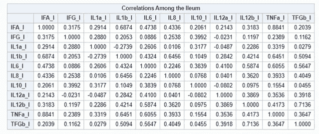**

**这些是相互关联的表格。寻找绝对值超过 0.7 的关系**

**CCA 创建了 11 个规范维度，因为包含了 11 个变量。这是因为规范变量类似于因子分析中发现的**潜在变量**，除了规范变量也最大化两组变量之间的相关性。它们是所包含变量的线性函数。因此，当包含变量时，会自动生成等量的规范**

**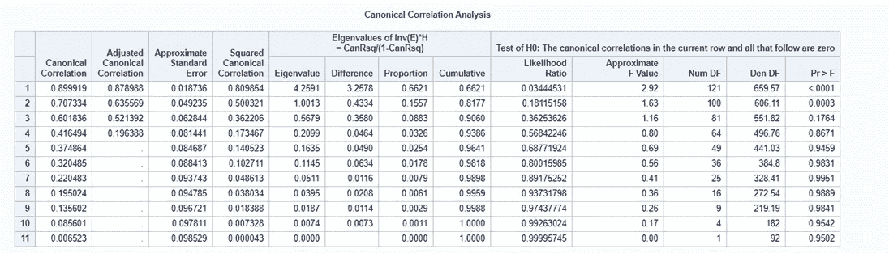**

**在这个图表中，你可以看到是否所有 11 个都值得努力。**

**然而，根据输入变量解释典型相关的更有用的方法是查看简单的相关统计。对于每一对变量，查看规范结构表。**

**下面是每个变量及其典型变量之间的相关性。**

**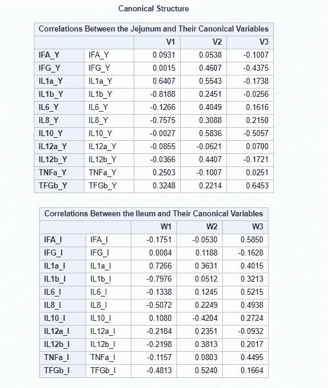**

**下面是每个变量和另一组变量的标准变量之间的相关性。**

**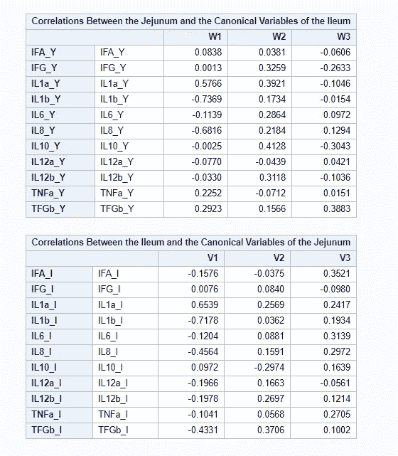**

**我们甚至可以更进一步，应用规范冗余统计，这表明了由每个规范变量解释的共享方差的数量。它为您提供:**

1.  **每个变量中方差的比例由变量本身的变量来解释。**
2.  **由其他变量的变量解释的每个变量的方差的比例。**
3.  **r 用于从另一组中的前 M 个变量预测每个变量。**

**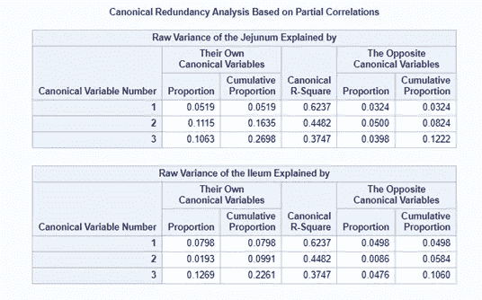****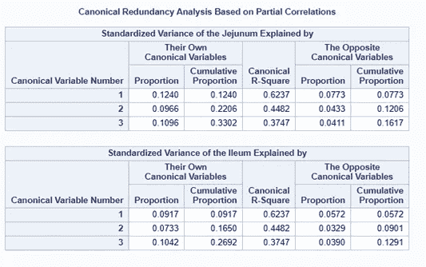**

**每一个变量都可以用它们自己的标准来更好地解释，但这不是一个滑坡。**

**冗余分析的输出使您能够调查由规范变量解释的每个变量的方差。这样，您不仅可以确定变量的高度相关线性组合是否存在，还可以确定这些线性组合是否真正解释了原始变量中相当大一部分的方差。这里不是这样的！**

**您还可以执行**规范** **回归分析**，通过该分析，一个集合在第二个集合上回归。与冗余统计一起，回归分析将为您提供对指定集合的预测能力的更多洞察。**

**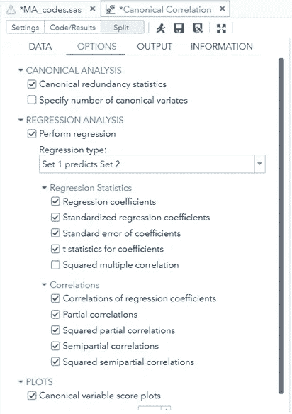****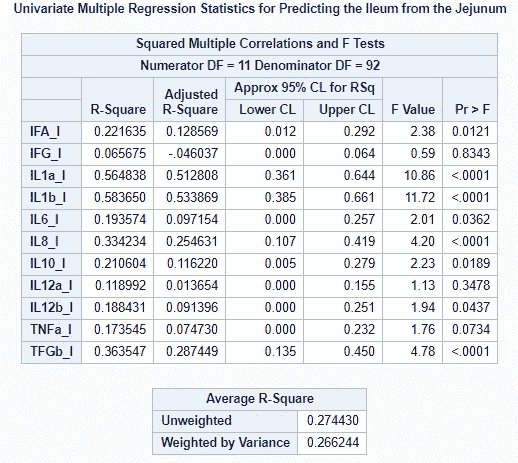

回归结果*(平均 R )* 并没有暗示回肠和回肠之间的密切关系。不要过多地关注 p 值，而是关注每个变量对 R 的影响。你不必是火箭科学家，也能发现 Jejenum 对回肠的预测能力也不是很强。** 

**简而言之，典型相关分析是一种描述性方法，试图通过使用以下方法将一组变量与另一组变量联系起来:**

1.  **相互关系**
2.  **回归**
3.  **冗余分析**

**作为第一种方法，它可以让您很好地了解所涉及的多重共线性的程度，以及两个指定集合之间的相关程度。不要忘记— CCA 主要用于预测，而不是解释。**

**三者中的最后一个是判别函数分析(DFA ),用来回答这个问题:*变量的组合能用来预测群体成员吗？*因为，如果一组变量预测了群体成员关系，那么它也与那个群体相关联。**

**DFA 是一种与主成分分析(PCA)和典型相关分析(CCA)相关的降维技术。**

**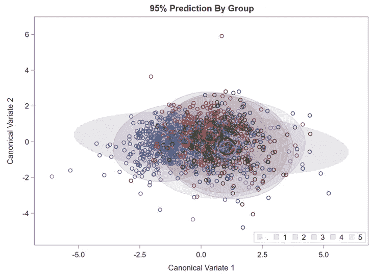**

**DFA 在起作用——大环是中心点，预测的中心点，是我们试图基于两个规范变量预测的每个组的中心点。**

**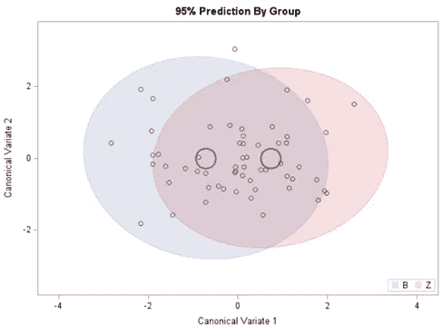****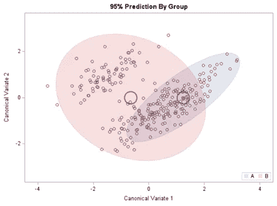**

**在 SAS 中，进行判别函数分析有三个步骤:**

1.  ****PROC CANDISC** —典型判别分析。**
2.  ****PROC DISCRIM** —开发一个*判别标准*，将每个观察值分类到其中一个组中。**
3.  ****PROC STEPDISC** —执行逐步判别分析，选择定量变量的子集，用于在类别间进行判别。**

****PROC STEPDISC** 和 **PROC DISCRIM** 可以一起使用，以启用判别分析之上的选择方法。**

**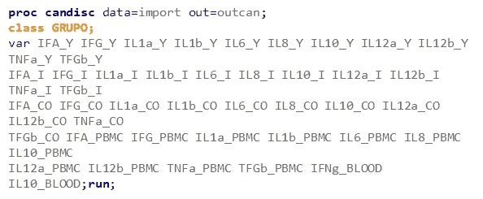**

**PROC CANDISC 的一个例子。class 变量在这里很重要——您试图为该组进行预测。**

**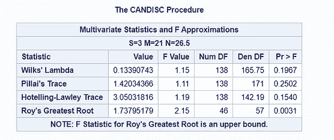****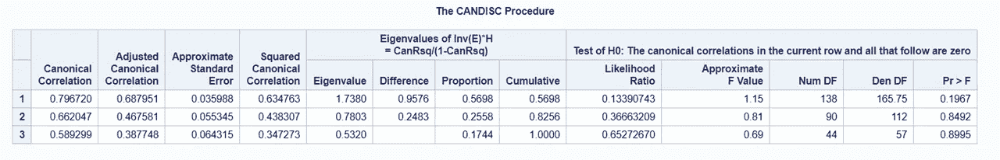**

**结果清楚地表明，从数据集创建的规范变量不会提供一个强大的集合来预测群体归因。**

**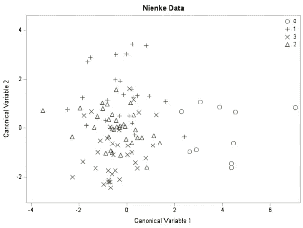****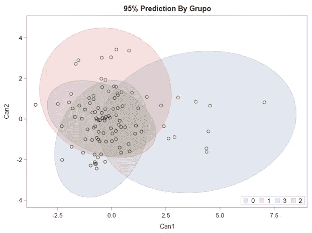**

**绘制相同数据的两种方法。由于椭圆重叠，结果并不令人印象深刻。**

**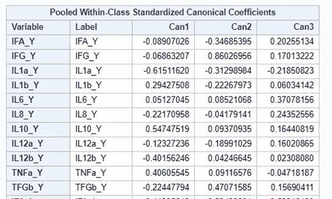**

**IFA_Y 变量增加一个标准差将导致判别函数 1 的预测值减少-0.089 个标准差。正如您所看到的，这些关系并不令人印象深刻，这一点在前面的图表中已经很清楚了。这意味着规范变量并不真正代表一组变量！**

**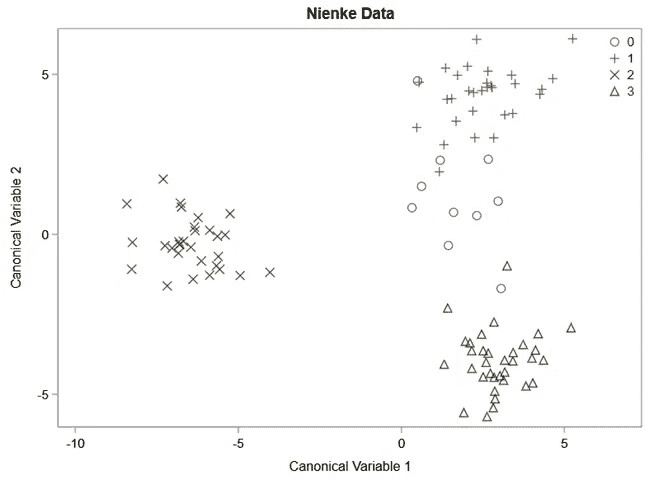****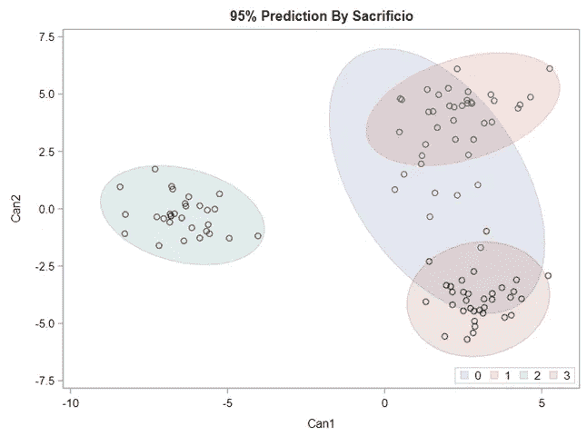**

**一个更好的分裂，由于规范变量。**

**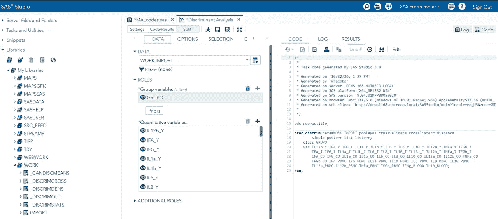**

**进入 **PROC DISCRIM** 的方法。**

**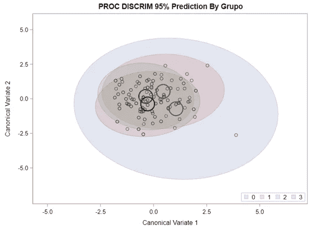****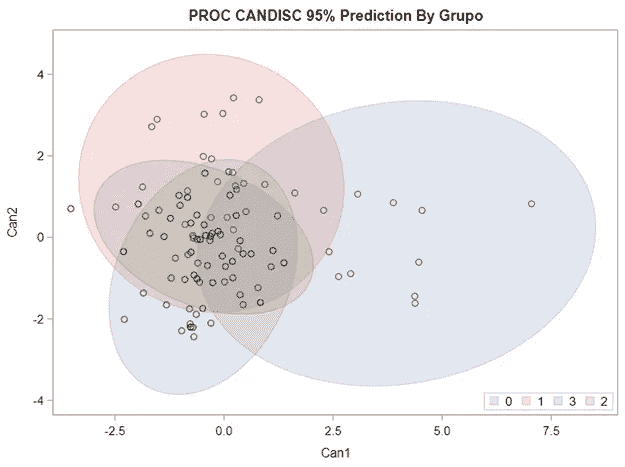**

**左右图之间的差异是因为数学上的差异，也是因为我在 DISCRIM 中采取的一些初步步骤。让我们仔细看看！**

**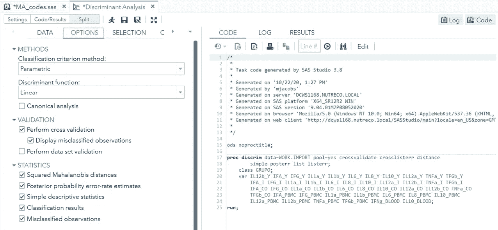**

**将 DISCRIM 与交叉验证结合使用。**

****

**易于在 SAS 中包含交叉验证。**

**选项' **Validation** '看似一个小请求，其实不然。[其实是对过度拟合](https://medium.com/@marc.jacobs012/predictive-regression-using-splines-partial-least-squares-penalization-cross-validation-and-339b74a7e108)话题的介绍。**过度拟合**发生在模型对它用来得出解决方案的数据“过度拟合”的时候。它把噪音误认为信号。过度拟合的模型在训练数据集上预测得很好，但在新的测试数据上预测得很糟糕。因此，作为一个预测模型，它是有限的。**记住:** DFA 是一种预测方法。因此，防止过度拟合是非常有意义的！**

**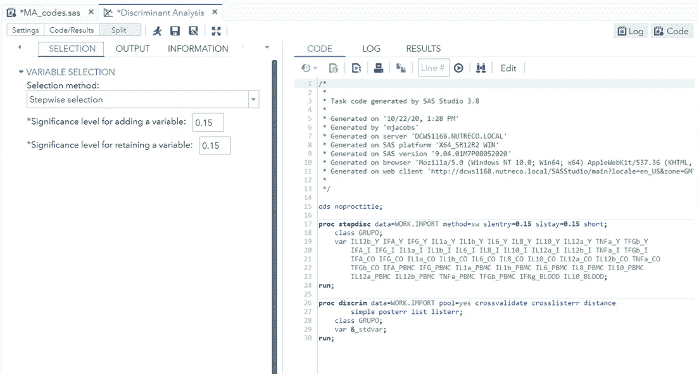**

**以及包括选择方法。**

**您可以通过首先使用 PROC STEPDISC 来扩充 PROC DISCRIM，它包括变量选择的算法。这些大多是传统方法:**

1.  ****反向消除:**从完整模型开始，在每一步删除对模型贡献最小的效果。**
2.  ****正向选择:**从截距开始，在每一步添加对模型贡献最大的效果。**
3.  ****逐步选择:**前向选择技术的修改，其不同之处在于模型中已经存在的效应不一定停留在那里。**

**我要求 SAS 包含满足某个阈值的变量，以便添加或保留某个变量。**

**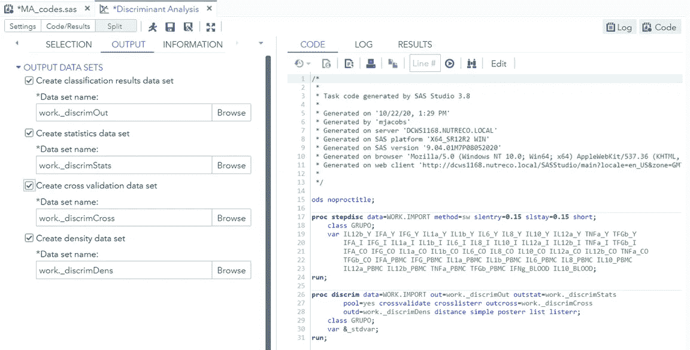**

**保存图形输出。**

**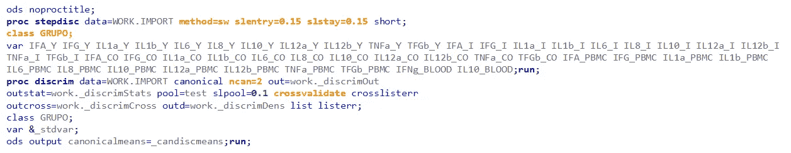**

**完整的代码包括鉴别分析的选择方法和交叉验证。**

**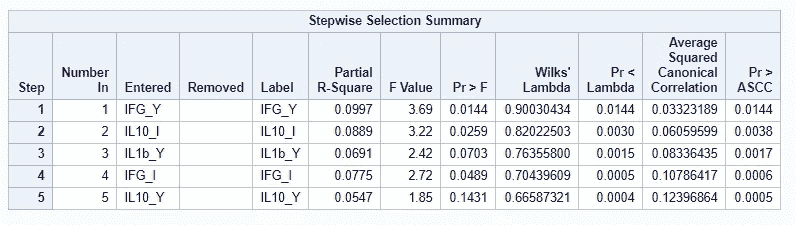****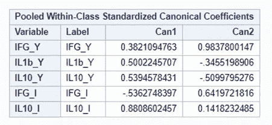**

**典范 1 由 IL10_1 定义。典范 2 由 IFG_Y 定义**

**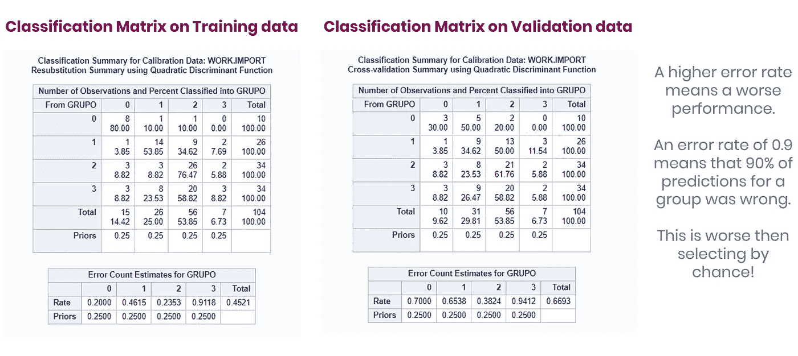**

**显示模型性能的分类矩阵。没那么好！**

**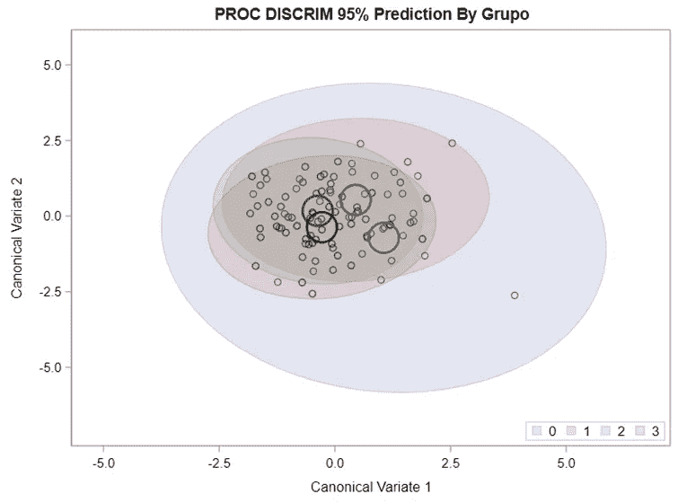**

**大圆圈表示两个正则变量上的群和它们的平均载荷。较小的圆圈显示个体动物和它们在数据库中被分配到的组(无预测)。如果你看到这样的图，那么你就知道规范变量没有真正的判别能力。**

**因此，这张图表显示的是这些规范变量在多大程度上能够基于所包含的模型预测群体分配。良好的预测能力将显示某一组中的动物将聚集在该组平均标准负荷处。事实并非如此。**

**显示模型判别能力的更好方法是创建一个包含所有变量的新数据集，并向其中添加范围，以便进行网格搜索。然后，您可以要求每个 DFA 模型使用不同的算法，向您展示它们的性能。**

**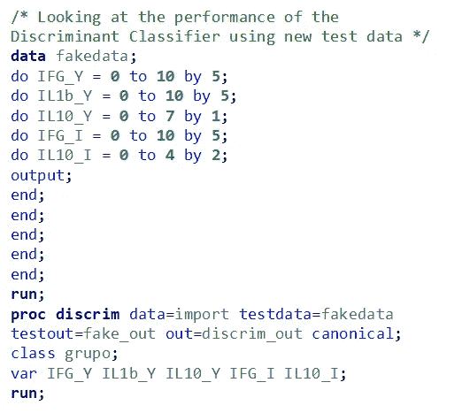****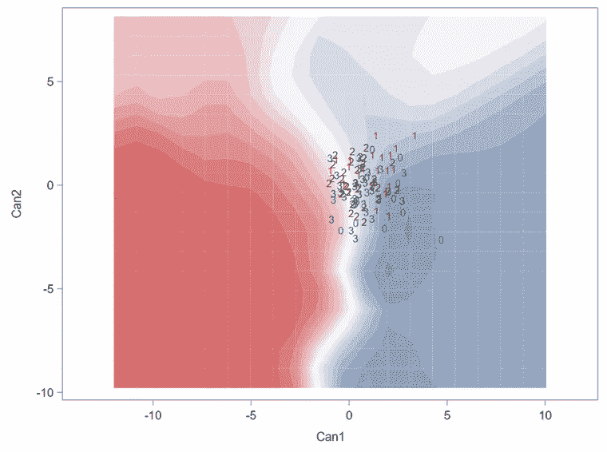**

**测试数据的判别分析。**

**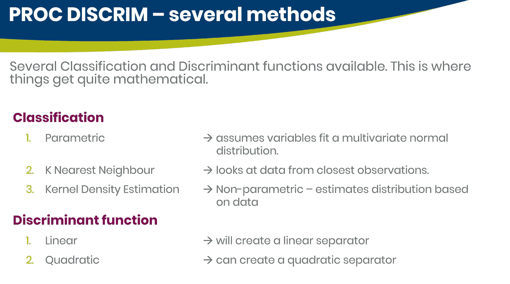**

**不同的分类和判别函数可以组合起来产生六种不同的算法。让我们看看这是否会导致六种不同的模式。**

**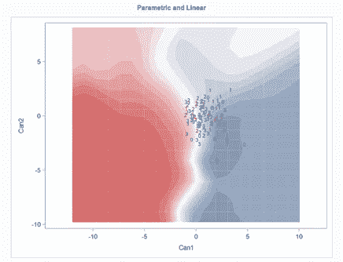****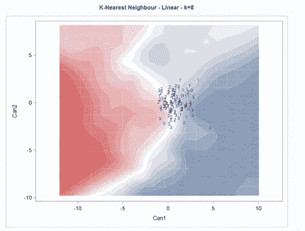****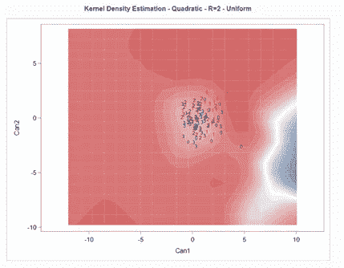****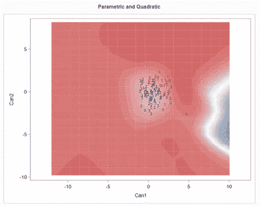****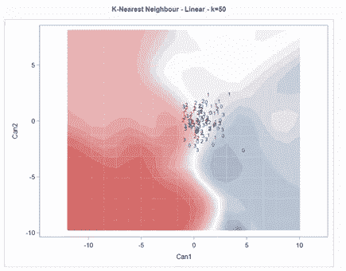****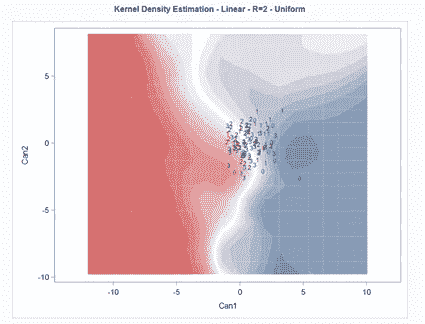**

**结果呢。如您所见，这些函数为不同的模型提供了不同的分隔线。突出的一点是，该模型不能分离，因为分隔线实际上正好穿过数据点的聚类。**

**从上面可以看出，没有放之四海而皆准的最佳方法。这完全取决于数据，因为非参数方法估计正态性，而参数方法假定正态性。最重要的区别是使用线性或二次判别函数。这显然改变了预测模型，从而改变了分类矩阵。正如生活中的许多事情一样，尝试不同的口味，但永远不要忘记检查您的假设、模型及其性能。**

**总之，判别函数分析通常用于预测自然发生组中的成员。它回答了这个问题: ***“可以用变量的组合来预测群体成员吗？”*** 在 SAS 中，进行判别函数分析有两个步骤:**

1.  ****PROC STEPDISC** —选择变量的子集，用于区分类别。**
2.  ****PROC CANDISC** —执行规范判别分析。**
3.  ****PROC DISCRIM** —开发一个*判别标准*将每个观察值分类到其中一个组中。**

**L ets 进一步探索降维的世界，并问我们自己以下问题:**

1.  **我能把我看到的减少到看不见的变量吗？**
2.  **我能建立一个基本的分类法吗？**

**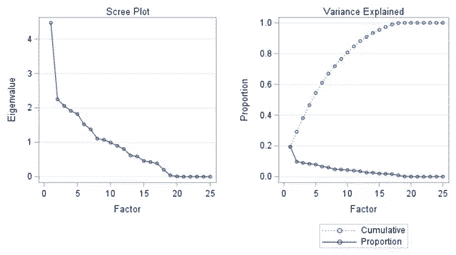****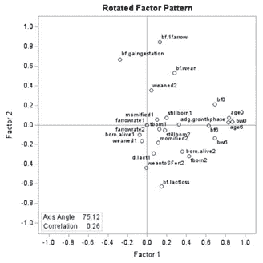****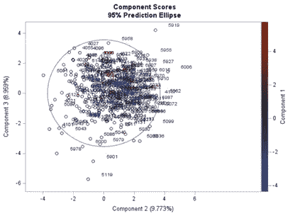********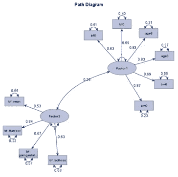**

**运行降维技术时可以从 SAS 获得的输出示例。**

**在 SAS 中有各种各样的过程可以进行降维。当然，本帖之前展示的例子也是降维的例子。**

1.  ****PROC PRINCOMP** 对连续数据进行主成分分析，输出标准化或非标准化的主成分得分。**
2.  ****PROC FACTOR** 通过旋转执行主成分分析和各种形式的探索性因子分析，并输出公共因子得分(或主成分得分)的估计值。**
3.  ****PROC PRINQUAL** 执行定性数据的主成分分析和多维偏好分析。此过程对标称、序号、间隔或比率刻度数据执行三种转换方法之一。它还可以用于有约束和无约束的缺失数据估计。**
4.  ****PROC CORRESP** 使用列联表、Burt 表、二元表或原始分类数据作为输入，执行简单和多重对应分析。对应分析是主成分分析的一种加权形式，适用于频率数据。**
5.  ****PROC PLS** 使用多种线性预测方法中的任何一种来拟合模型，包括*偏最小二乘法* (PLS)。尽管 PLS 用于更广泛的分析，但它可以执行主成分回归分析，尽管回归输出用于预测且不包括推断假设检验信息。**

**可能最广为人知的聚类技术是主成分分析(PCA ),正如您之前看到的，它与典型相关分析有很大的关系。主成分分析试图回答一个实际问题:*“我如何将一组相关变量减少到更易于管理的不相关变量数量？”***

**PCA 是一种降维技术，它创建的新变量是一组相关变量→主成分的加权线性组合。它没有假设潜在的潜在因素结构。**

**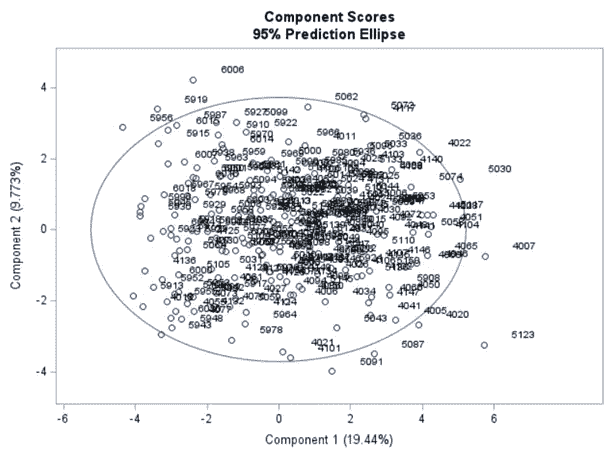****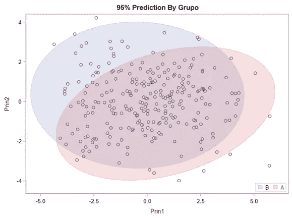**

**显示 PCA。**

**PCA 的工作与正交回归线的组成部分，创建以尽量减少误差。**

**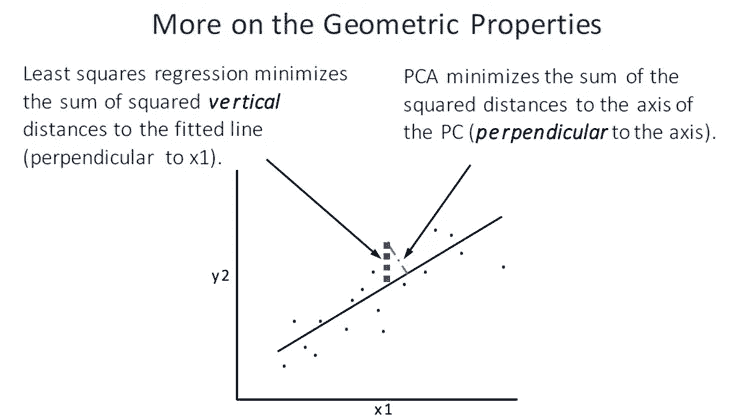****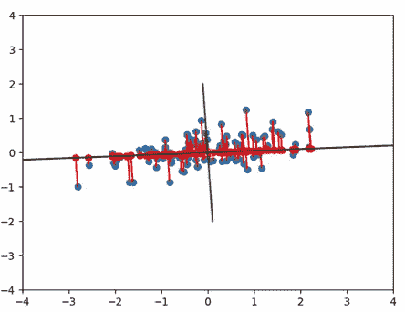****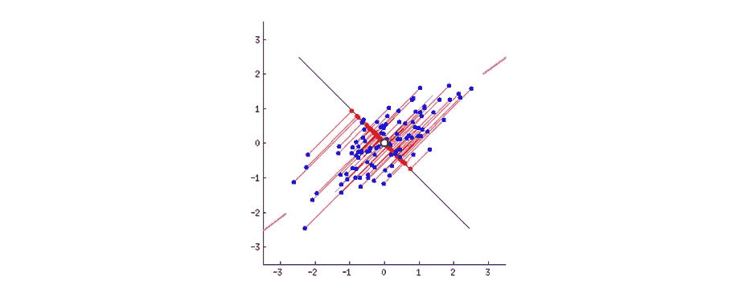****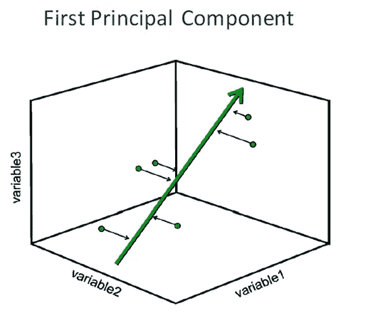****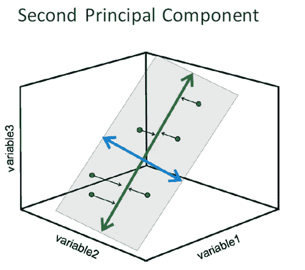**

**第三个组成部分也是以同样的方式构建的，每个后续组成部分在数据的总变异性中所占的比重越来越小。通常，相对少量的创建变量或组件可以解释数据中总可变性的大部分。**

**PCA 通过执行相关或协方差矩阵的特征值分解来创建与输入变量一样多的分量。它创建的组件将比原始数据中的任何变量更多的解释差异合并到前几个 PCs 中。它们相互正交，因此相互独立。它们是这样生成的，即第一个分量说明了变量中最大的变化，然后是第二个分量，依此类推。**

**与许多多变量技术一样，PCA 通常是大型数据分析计划中的初步步骤。例如，五氯苯甲醚可用于:**

1.  **探索数据并检测观察中的模式。**
2.  **寻找多元异常值。**
3.  **确定数据集中共线性的总体范围。**

**偏最小二乘也使用 PCA 作为底层引擎。**

**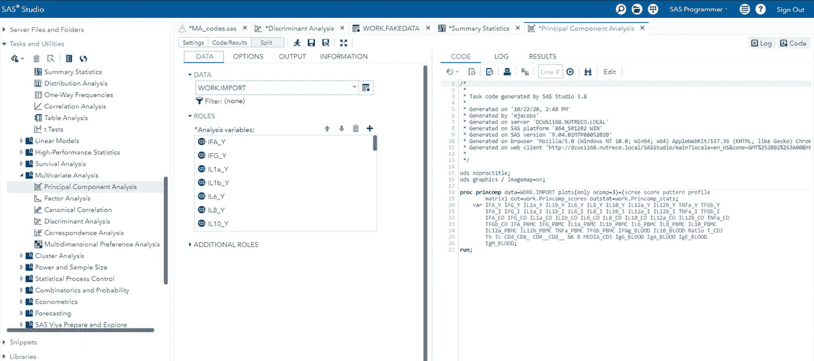**

**运行 **PROC PRINCOMP** 的 SAS Studio 代码**

**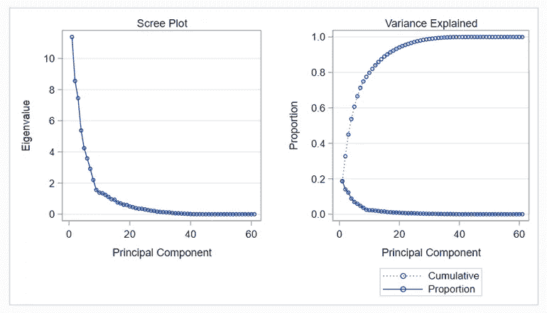**

**你要看的第一张图——有多少成分能很好地区分已解释的方差和剩余的可解释方差。**

**Scree 图显示了你需要多少个主成分才能达到所解释的方差的合理水平。诀窍是观察碎石图，看看什么时候落差变得平稳。这里，这是在八个组件之后。让我们画出这八个部分。**

****

**这个组件模式剖面图显示了每个组件是如何加载到包含的变量上的。因此，它显示了每个组件所代表的内容。你能立即看到的是，它相当混乱。许多变量在某种程度上加载到许多组件上。因此，为了便于解释，您必须限制要使用的组件数量。**

**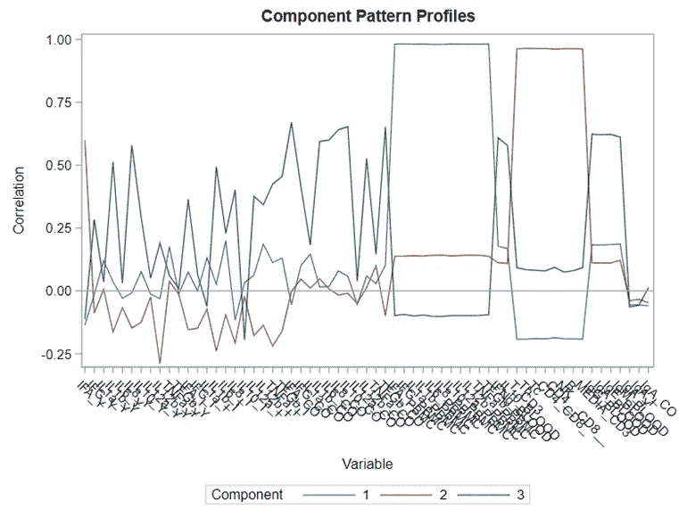**

**三个组成部分。您可以清楚地看到，组件 1 和 2 由几个不同的变量表示。**

**因此，在那些组件上加载高的观察值可能在那些变量上也明显不同。组件 3 看起来有点像垃圾组件。**

**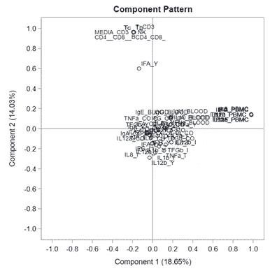****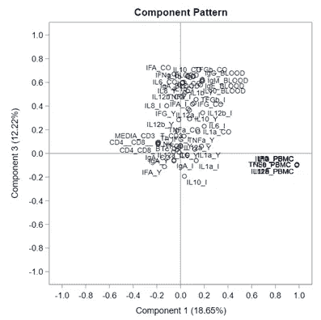******

**这些图显示了变量是如何加载到每个组件上的。有些集群很突出，但是很明显，很多变量并没有真正加载到一个组件上。这反映在所解释的低百分比差异上。**

**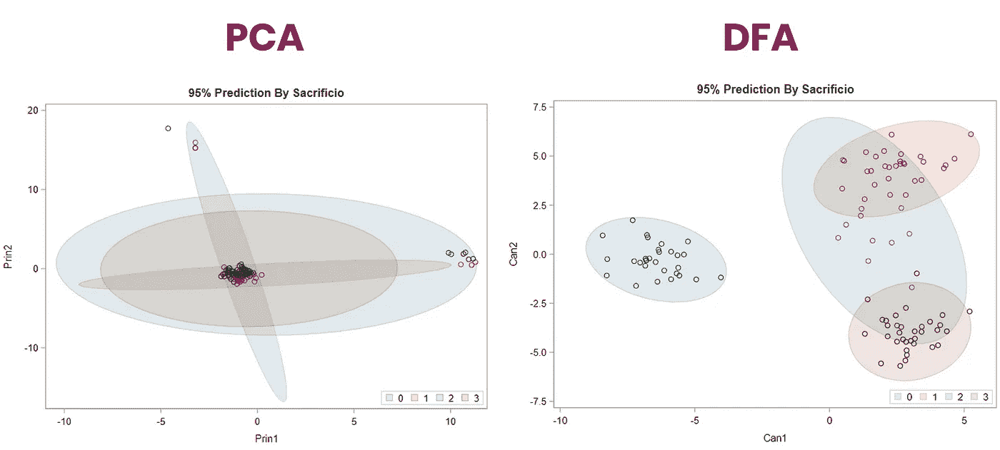**

**PCA 和 DFA 分析的区别。如您所见，DFA 做得更好，但是已经基于组来分离数据。**

**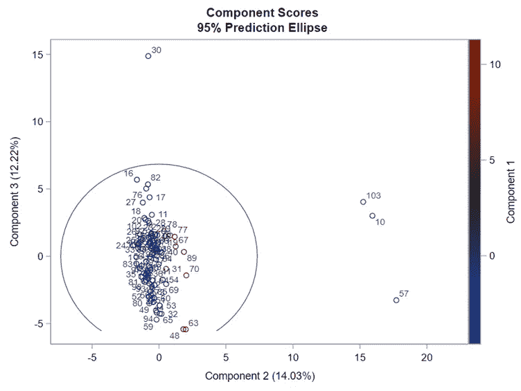**

**此图显示了如何使用 x 和 y 轴以及颜色加载所有三个分量的观察值。如你所见，组件 1(大部分是蓝色)和组件 2(0 附近的所有内容)非常有用。组件 3 增加了一些维度，但不如 1 和 2 清晰。**

**总之，PCA 是一种降维技术，它创建新的变量，这些变量是一组相关变量与主成分的加权线性组合。PCA 试图回答一个实际问题:*“我如何将一组许多相关的变量减少到一个更易管理的不相关变量的数量？”* PCA 通常是大型数据分析计划中的初步步骤，也是许多简化分析的回归技术的一部分。**

**从主成分分析出发，进一步走向主因子分析(PFA)是相当简单的。区别在于，在主成分分析中，唯一因子彼此不相关。它们是数据的线性组合。在 PFA 中，独特因素与共同因素(潜在因素— Yx)不相关。它们是由数据部分测量的潜在变量的估计值。**

******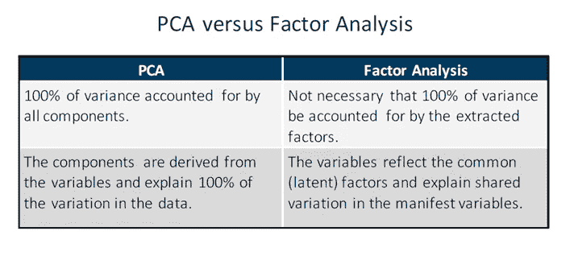**

**组件分析实际上是重构相同的数据。探索性因素分析就是建模。**

**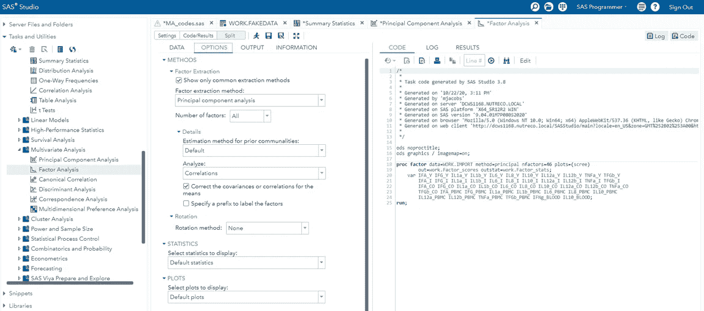**

****过程因子**是因子分析的 de 因子程序。**

**当您怀疑您观察到的变量**(显变量)**是您无法直接观察到的变量**(潜变量)**的函数时，可以使用因子分析。因此，因子分析用于:**

1.  **识别潜在变量，了解一些关于你的人口行为的有趣的事情。**
2.  **识别不同潜在变量之间的关系。**
3.  **表明少量的潜在变量是你为了简化你的理论而测量的过程或行为的基础。**
4.  **解释观察变量之间的相互关系。**

**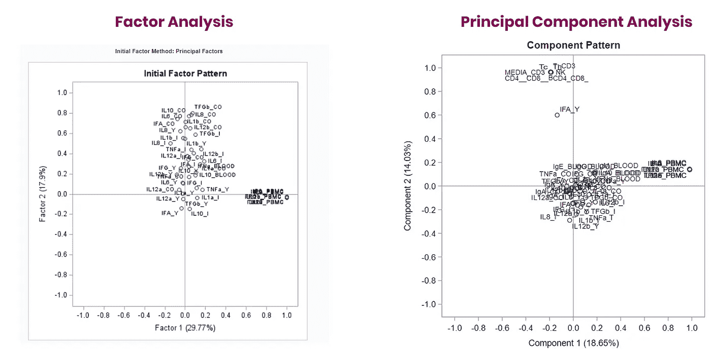**

**因子分析和主成分分析的区别。**

**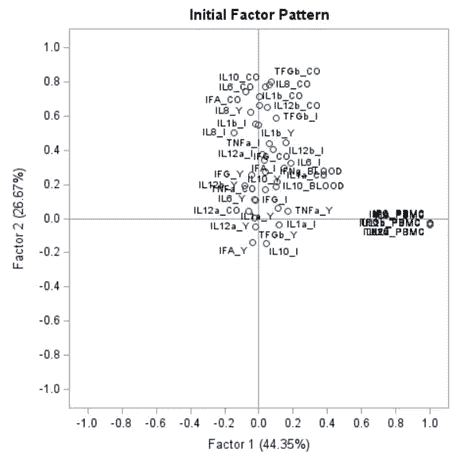****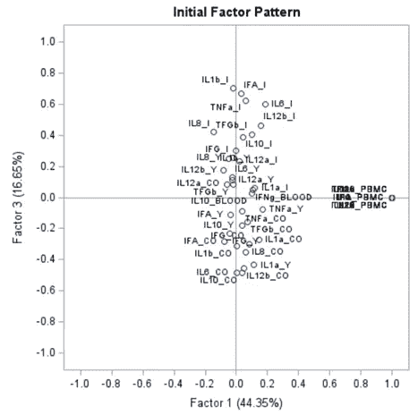****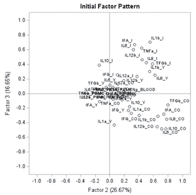****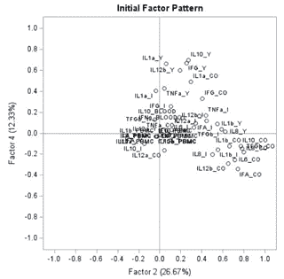****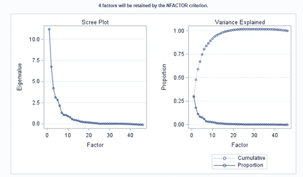****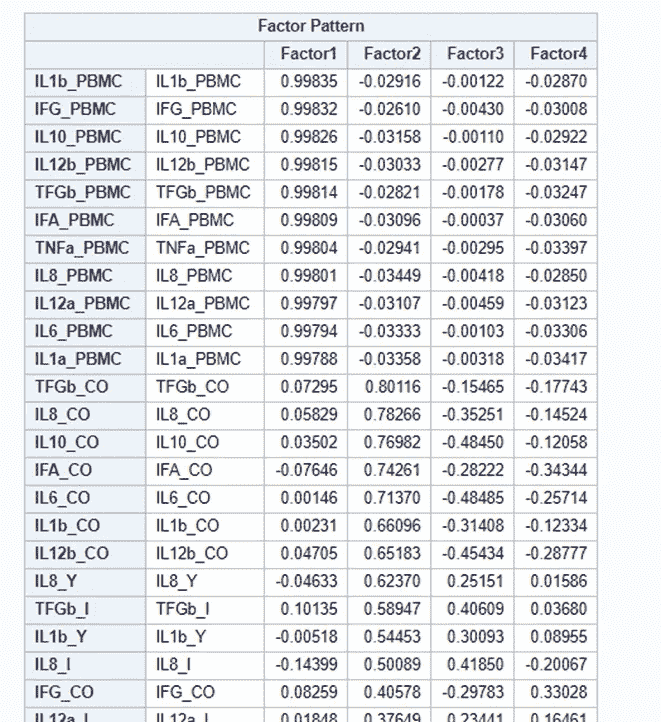**

**寻找绝对因子负荷> 0.5。显然，PBMC 的因子 1 非常高。CO 和 Y 似乎在因子 2 上负载很高。**

**初始因子加载只是第一步，需要使用旋转方法来解释结果，这将有助于你理解因子分析的结果。**

**轮换方法有两种一般分类**

1.  **假设正交因子。**
2.  **放松正交性假设。**

**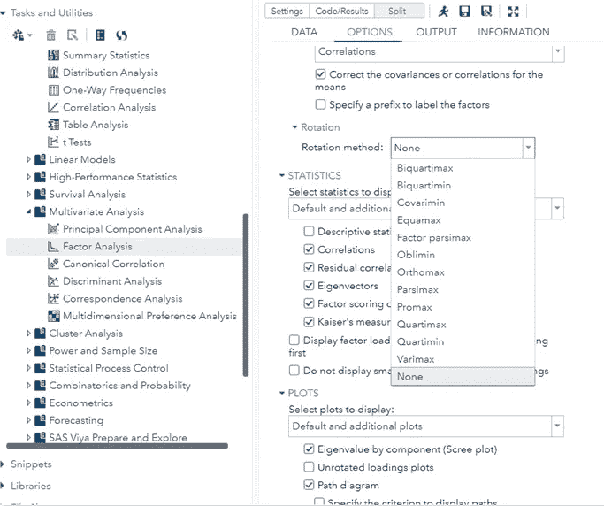**

**如您所见，有许多选项可用于因子模型的轮换。**

****正交旋转**保持落在垂直轴上的相互不相关的因子。为此，通常使用方差最大化正交方法，该方法最大化因子模式矩阵的列的方差。轴是旋转的，但轴之间的距离保持正交。**

**然后我们还有**斜旋转**，它允许因子相互关联。因为因素在理论上可能是相关的，所以使用倾斜旋转方法可以更容易地解释这些因素。为此，经常使用 Promax-beigual，它执行:**

1.  **varimax 旋转**
2.  **放松正交约束并进一步旋转**
3.  **可以会聚/发散的旋转轴**

**但是正如你在下面看到的，有很多可能的组合。主要部分是放松或不放松正交假设，这意味着因子可以有或没有协方差矩阵。**

**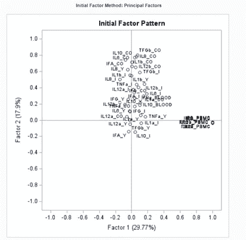****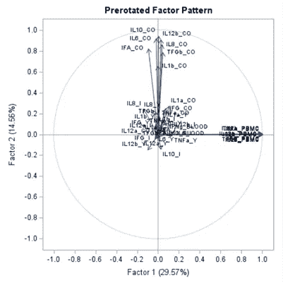****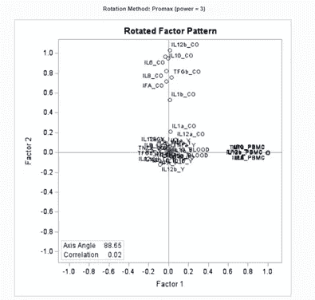**

**原始结果。轴的旋转。旋转结果。**

**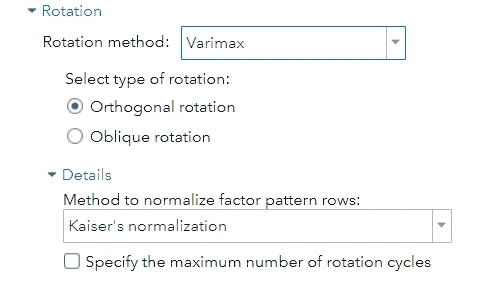****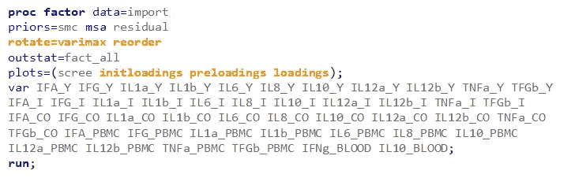****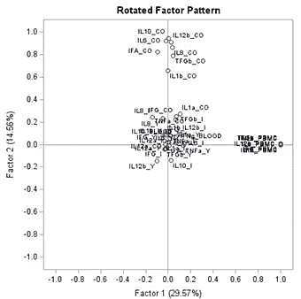********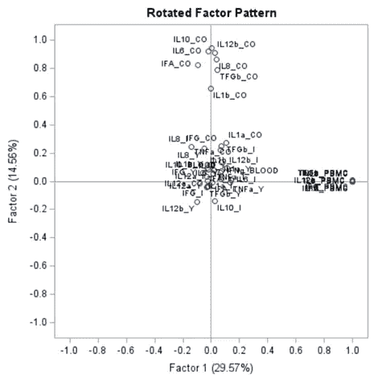

初始因子模式和旋转因子模式之间的差异显而易见。现在有三个集群，而不是两个。因子上的方差载荷略有变化，因为格网和观测值之间的距离也因旋转而不同** 

**拥有 18 个因素将使这个 PFA 相当具有挑战性。它还告诉你，这些变量将不会那么容易加载到一个潜在的变量。为了抵消这一点，我们也可以限制因素的数量。**

**结果会是一样的，我只是在 4 点把它剪掉了。**

**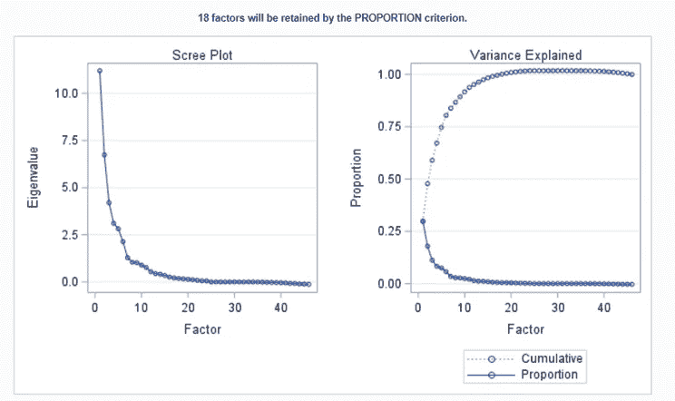****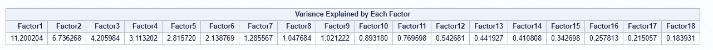**

**为了检查正交性，这些因素不应与其他因素高度相关。右边的加载表清楚地显示了因子代表什么，吃最少因子 1 (PBMC)和因子 2(一氧化碳)。然后，它变得模糊。**

**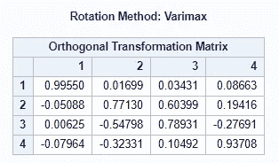**

**您希望在对角线上看到一个较高的数字，而在其他单元格中不要看到太多的数字。**

**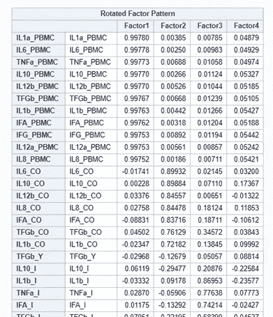****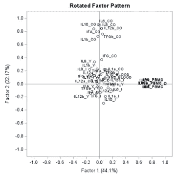****

旋转导致了三个漂亮的集群。** 

**在前面的例子中，我突然决定将因子的数量从 18 减少到 4。使用平行分析(一种模拟形式)可以更好地选择因素的数量。**

**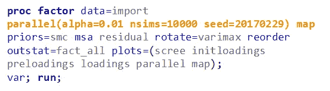**

**并行分析要求 10000 个模拟，看看我需要多少因素来建立一个像样的因素分析。**

**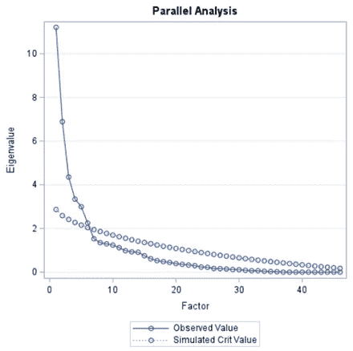****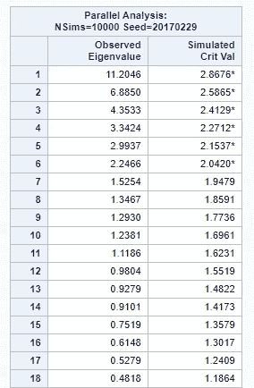

平行分析表明，应保留 6 个因素。** **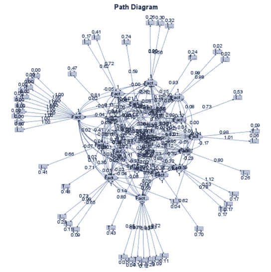****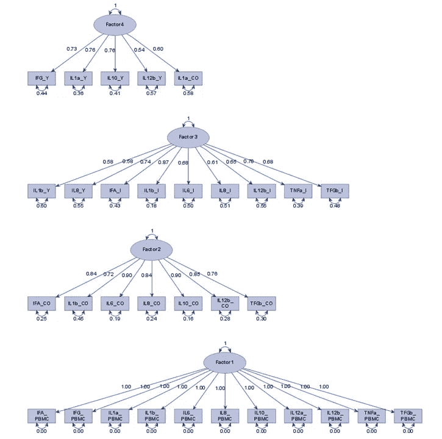**

**探索性因素分析还可以为您提供路径图，这是模型的可视化表示。如果你发现自己得到了一个像左图这样的模型，那么这个能够真正识别潜在变量的模型一定有问题。**

**总之，探索性因素分析(EFA)是一种变量识别技术。当假定潜在的因素结构存在，但不能用单个(观察到的)变量简单表示时，使用因素分析法。在全民教育中，独特因素与潜在因素是不相关的。它们是由数据部分测量的潜在变量的估计值。因此，全民教育不能解释 100%的差异。**

**全民教育是走向成熟的因果模型的探索性步骤。**

**聚类就是测量变量和观测值之间的距离，以及变量和观测值之间的距离，以及它们之间的距离。在 SAS 中有很多数据聚类的方法。各种聚类方法的不同之处在于如何计算两个聚类之间的**距离**。**

**一般来说，集群是这样工作的:**

1.  **每一个观察都是从一个集群开始的。**
2.  **两个最接近的聚类被合并以形成替换两个旧聚类的新聚类。**
3.  **重复合并两个最接近的聚类，直到只剩下一个聚类。**

**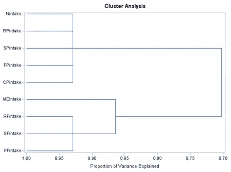****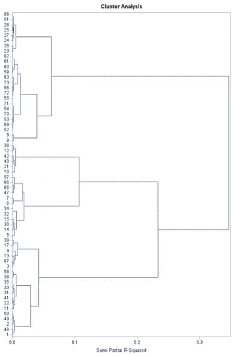****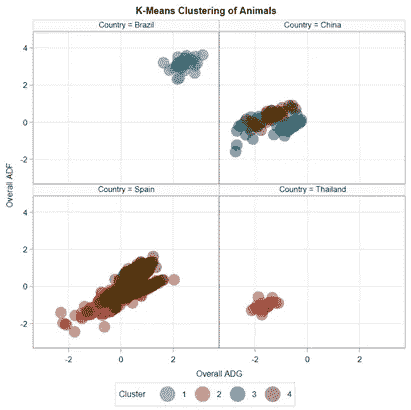****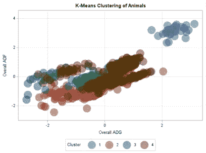****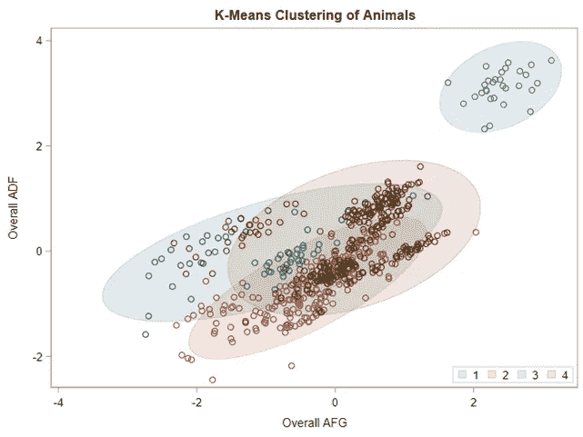****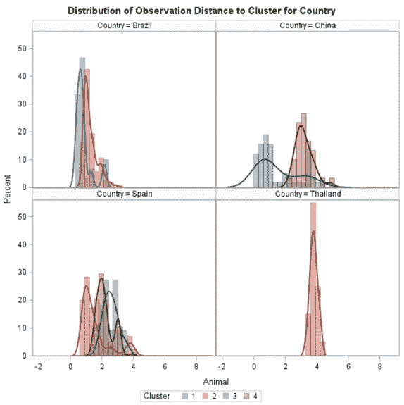**

**使用聚类在数据中查找模式的示例。**

**SAS 提供了多种程序来帮助您对数据进行聚类:**

1.  ****PROC CLUSTER** 对观测值进行层次聚类。**
2.  ****PROC VARCLUS** 执行变量的聚类，并通过层次聚类划分一组变量。**
3.  ****PROC TREE** 使用 CLUSTER 或 VARCLUS 程序的输出绘制树形图。**
4.  ****PROC FASTCLUS** 根据从一个或多个变量计算的距离执行 k 均值聚类。**
5.  ****过程距离**计算各行(观察值)之间的距离、相异度或相似度的各种度量。**
6.  ****PROC ACECLUS** 通过估计汇集的聚类内协方差矩阵，在实际聚类分析之前处理数据非常有用。**
7.  ****PROC MODECLUS** 通过实现几个聚类方法而不是一个来执行聚类。**

**Al 虽然我已经标记了很多聚类方法的可能性，但迄今为止最强大的程序是[偏最小二乘法](https://medium.com/@marc.jacobs012/partial-least-squares-in-r-extending-towards-a-hosted-api-via-plumber-and-docker-7c445b9fa382)——一种多变量算法。主成分回归*(解释总方差)*和典型相关分析(解释共享方差)之间的 PLS 平衡。它从因变量和自变量中提取成分，并搜索集合内的解释方差和集合间的共享方差。**

**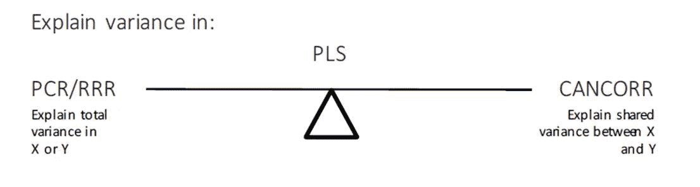**

**当 N < P as it extracts **个因素/成分/潜在向量**达到:**

1.  **解释响应变化。**
2.  **解释预测变量。**

**因此，偏最小二乘法平衡了两个目标:**

1.  **寻找解释反应变化的因素。**
2.  **寻找解释预测变量的因素。**

**PLS 程序用于拟合模型，并考虑因变量的任何变化。偏最小二乘法使用的技术有:**

1.  ****主成分回归** (PCR)技术，提取因子来解释预测样本的变异。**
2.  ****降秩回归** (RRR)技术，其中提取因素来解释响应变化。**
3.  ****偏最小二乘法** (PLS)回归技术，其中反应变异和预测变异都被考虑在内。**

**PCR、RRR 和 PLS 回归都是有偏回归技术的例子。这意味着使用来自 *k* 个变量的信息，但是在回归模型中将它们减少到*k*个维度，使得误差 DF 大于对所有变量使用普通最小二乘(OLS)回归的情况。PLS 通常与 PCR 和 RRR 混淆，尽管有以下主要区别:**

1.  **PCR 和 RRR 只考虑由 PCs 解释的集合内方差的比例。线性组合的形成不考虑预测器和响应之间的关联。**
2.  **PLS 寻求最大化集合之间的关联，同时考虑每组变量中解释的方差。**

**PLS 程序用于拟合模型，并考虑因变量的任何变化。**

**然而，PLS 并没有比 OLS 更好地拟合样本数据——它只能拟合得更差或者一样好。随着提取因子数量的增加，PLS 逼近 OLS。然而，OLS 过度拟合样本数据，其中具有较少因素的 PLS 在预测未来数据方面通常比 OLS 表现得更好。PLS 使用交叉验证技术来确定应该保留多少因子以防止过度拟合。**

**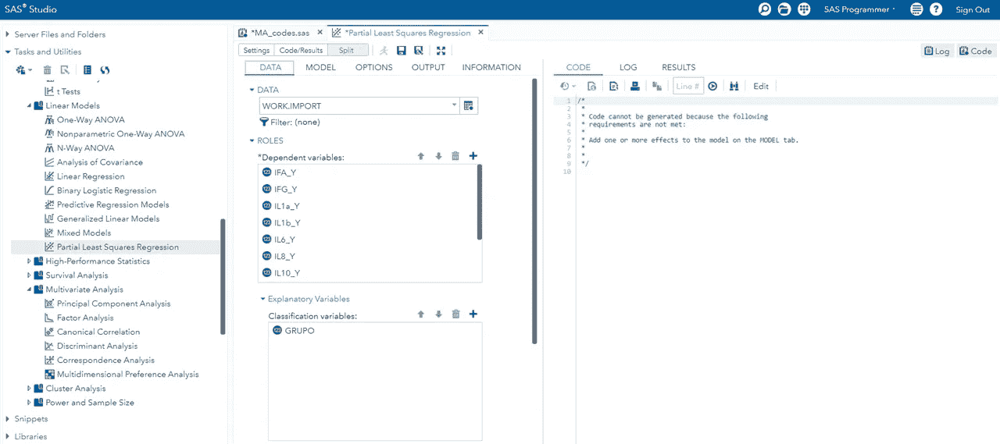**

**SAS Studio 任务开始使用 PLS 回归。**

**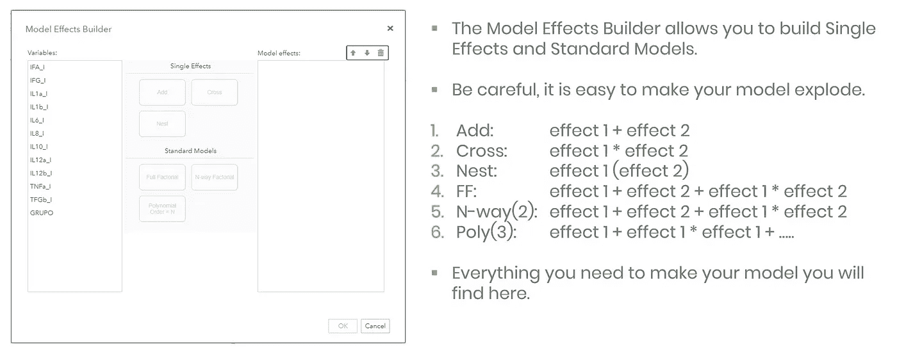**

**您可以创建一些野生模型。**

**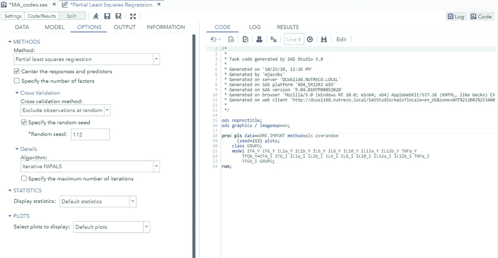**

**我将许多选项保留为默认选项，以查看模型是否可以运行。PLS 可能会很快变得非常复杂，为了避免在不考虑的情况下将变量注入其中，您最好先了解默认结果。**

**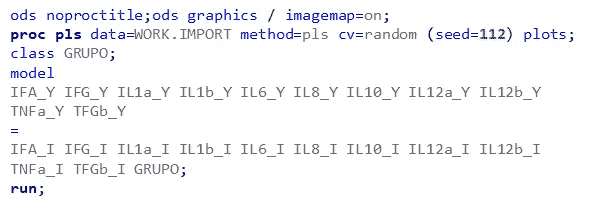**

**代码很简单。我有很多结果和预测。多变量多变量模型的标志。**

**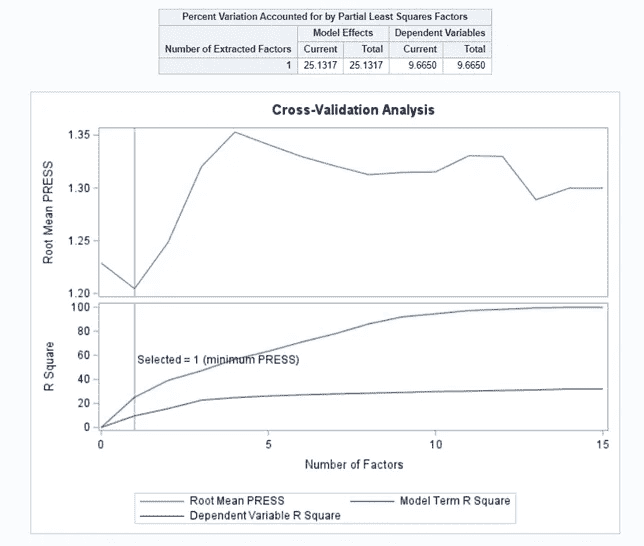**

**这种模式绝对行不通！**

**所以让我们从简单一点的开始:**

1.  **一个因变量**
2.  **更多独立变量**
3.  **没有交叉验证来确保我有所有的数据来训练一个模型。**

**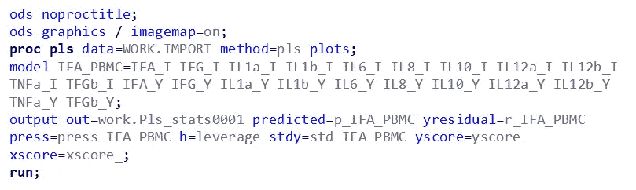**

**单变量多变量模型。**

**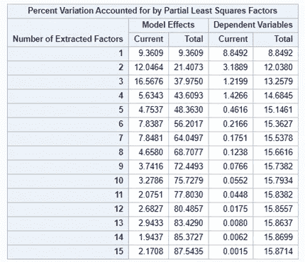****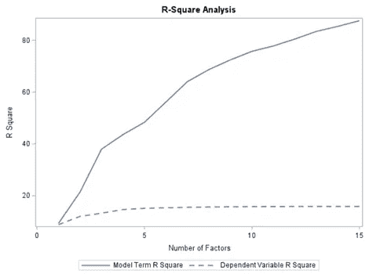

您可以看到提取因子的数量以及 R 的行为。请注意，提供了两个 R。这是因为 PLS 正在同时构建两个模型。一个可以解释预测因素，一个可以解释结果。** 

**至少我们有了结果。然而，这不是你想要的结果——15 个因素解释了 87%的自变量和 16%的因变量的方差。优选地，您希望少量提取的因素能够在可靠的水平上进行预测。不过，r 并不是评估这一点的最佳方法。**

**下面是一些幻灯片，介绍了如何解释有史以来最有趣的图——相关负载图。这看起来很难，但是一旦你学会了，就会变得非常简单。**

**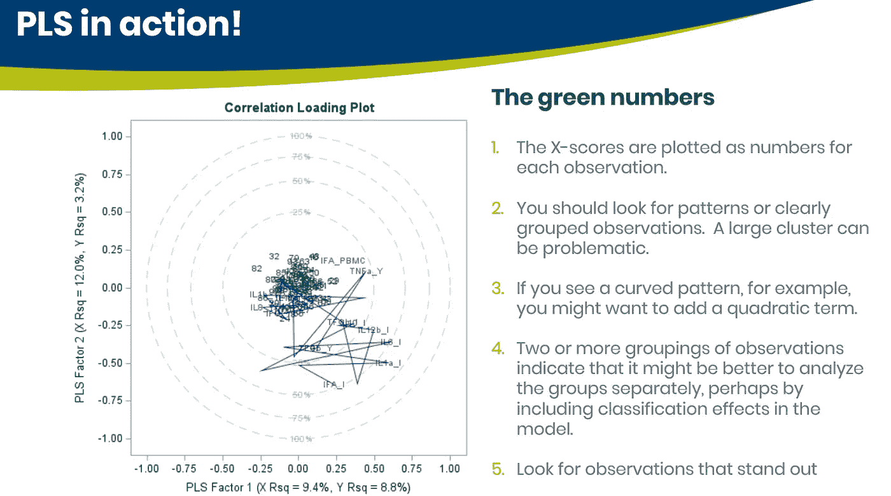****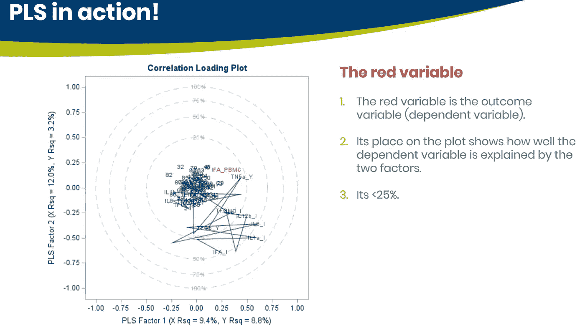****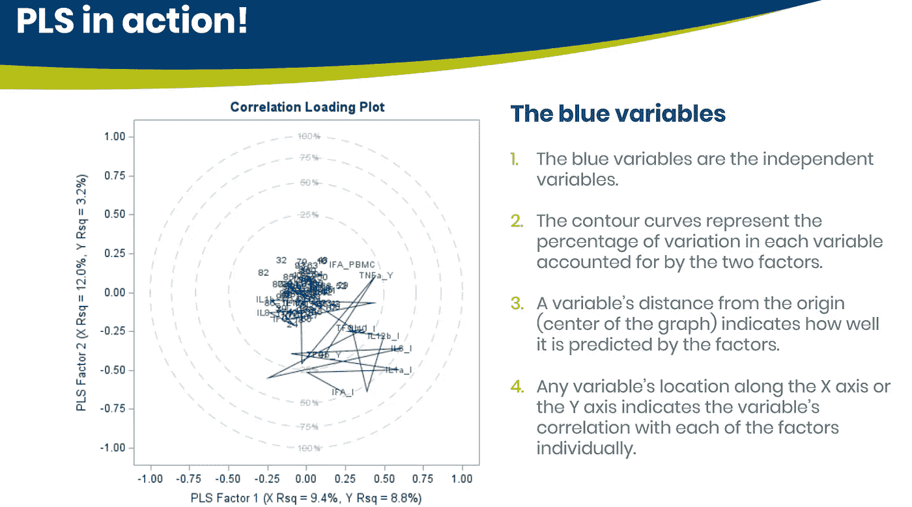****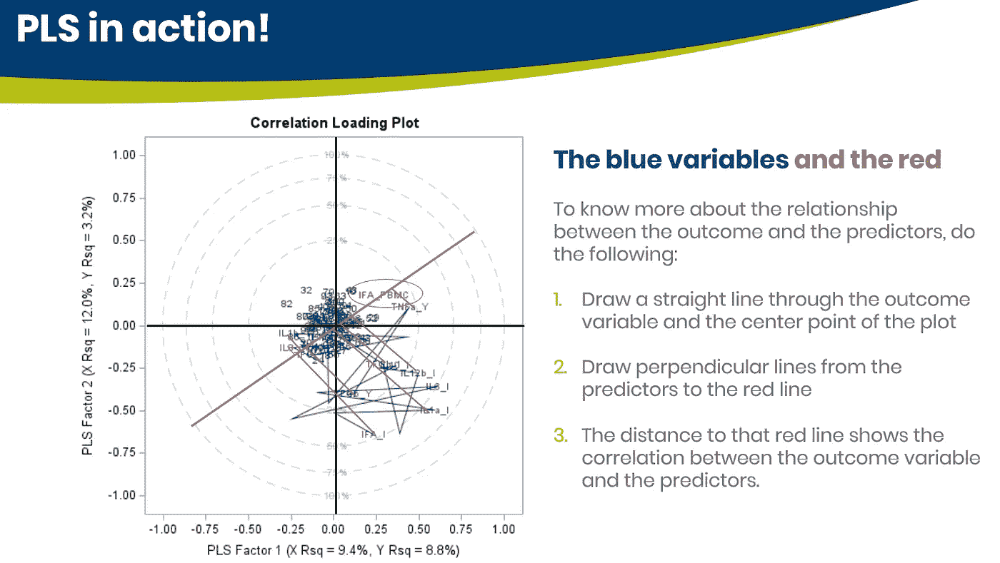****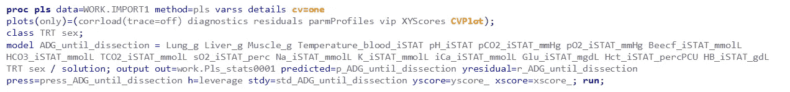****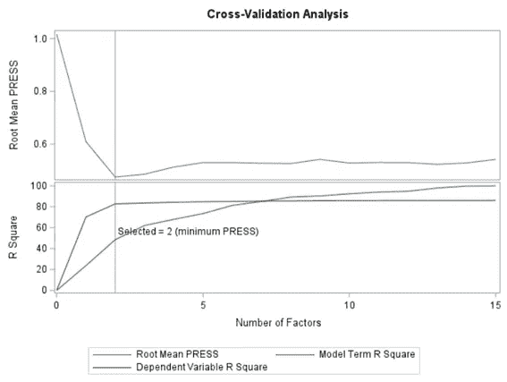****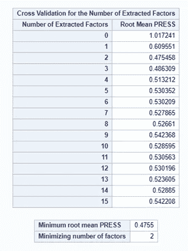

通过交叉验证，模型选择了 2 个因子。总是检查模型是否有生物学意义。请记住，统计模型根本不在乎它们包含了什么。他们不知道。** 

**如果你想要的话，请给你提供一长串的结果和图表。一些最重要的你可以在这里找到。首先，看看模型的拟合诊断。然后看可变重要性图。它们有生物学意义吗？此外，您可以使用结果创建自己的诊断图。**

**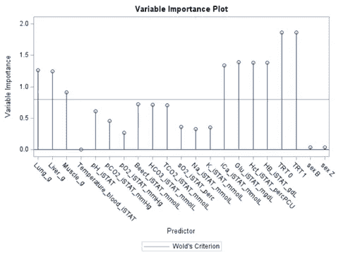****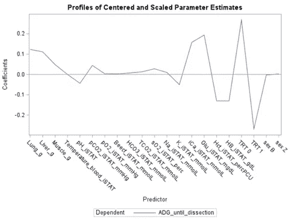****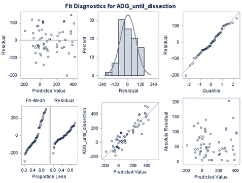****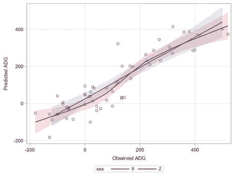**

**这里，我们有另一个相关载荷图。它们很难消化。首先，看看模型(X R)和预测(Y R)中解释的因素和百分比方差。这两个因素解释了 75%的结果变量方差。如您所见，许多变量的负载非常高(范围为 75% — 100%)。总之，观察显示了 3 个聚类，表明分类变量可能有助于解释更多的差异。**

**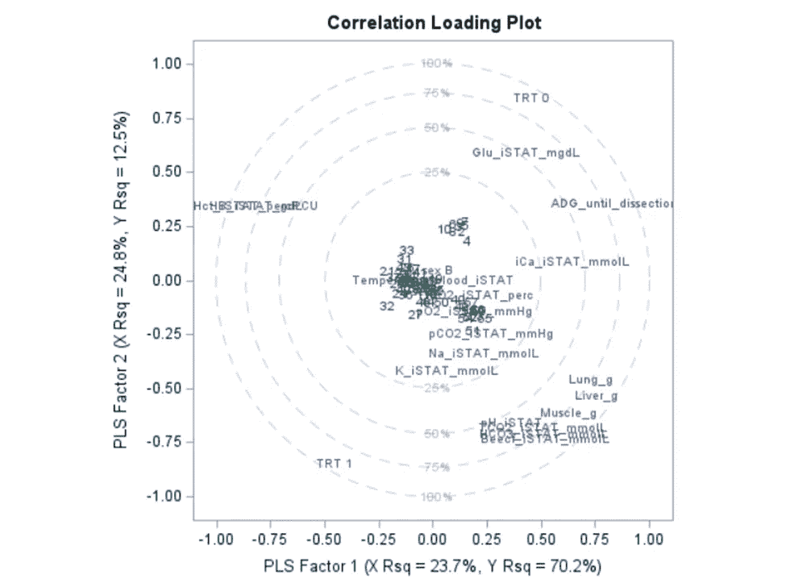****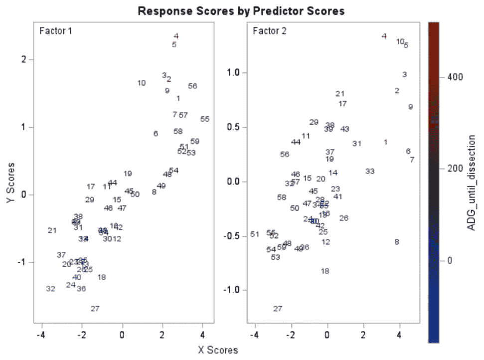**

**该图显示了每个因素区分响应变量粒度的能力。如果你看因素 1，你会看到反应变量的完整范围被包括在内。对角线越直，从左下到右上越好。这清楚地显示在因素 2 中——差异更大。数字表示观察结果。**

**总之，PLS 程序是一个统计上先进的、大量输出的程序。开始之前要知道自己在做什么！PLS 在主成分回归和典型相关分析之间取得了平衡。它从预测因子/响应中提取分量，这些分量说明了集合内的已解释方差和集合间的共享变化。与多元多元回归或预测回归方法不同，当 N < P 时，PLS 是一种很好的回归技术。**

**我希望你喜欢这篇文章。如果有什么不对劲，请告诉我！**