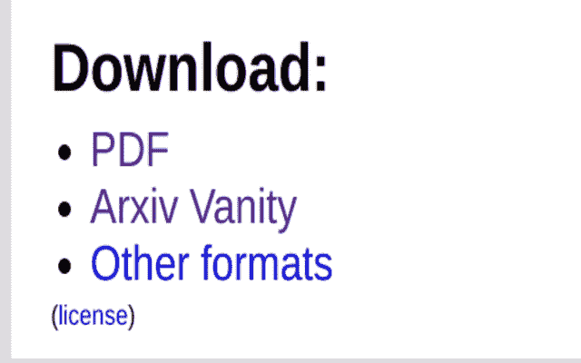
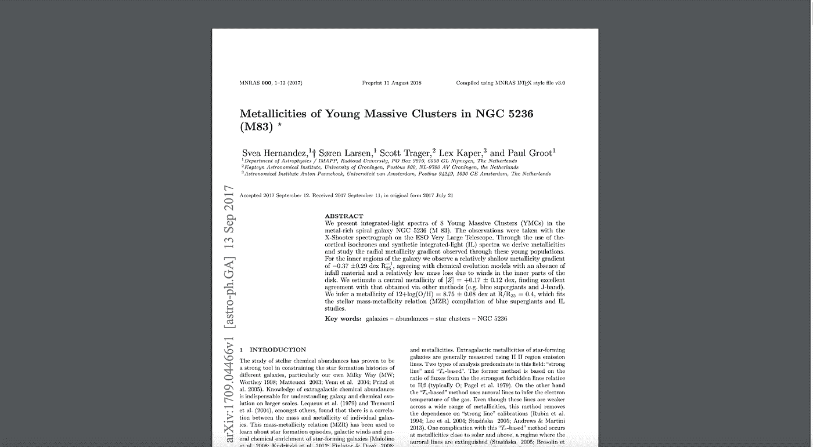
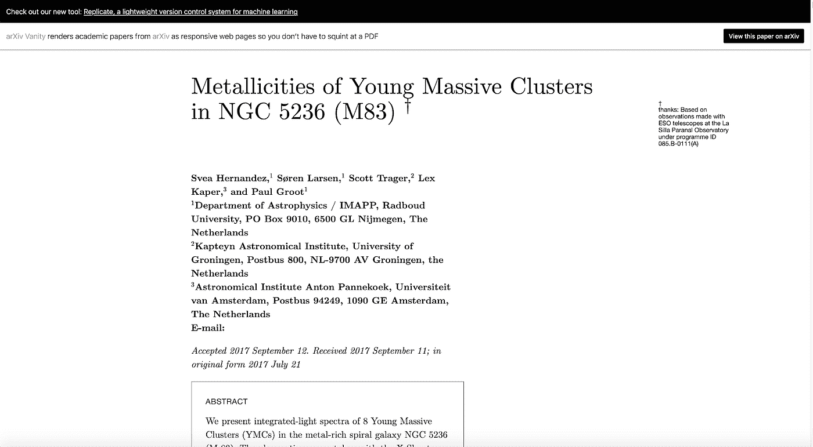
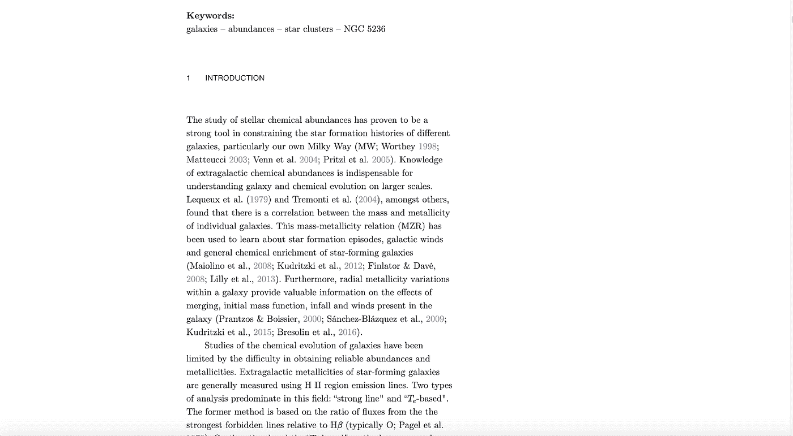
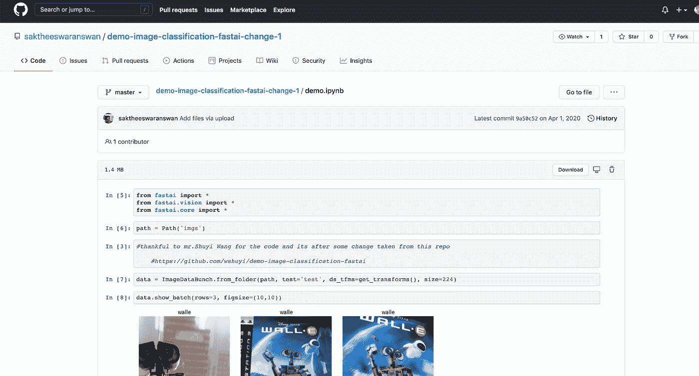
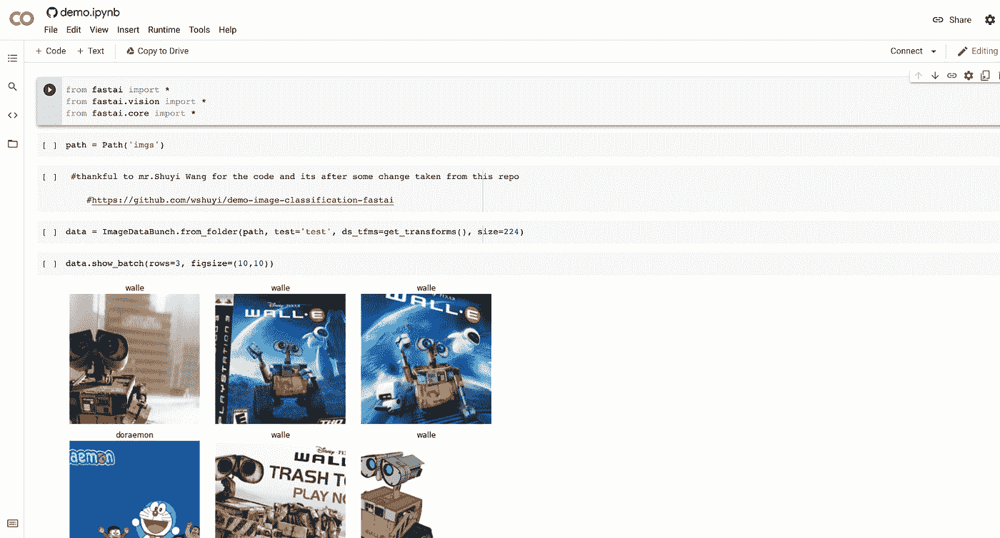
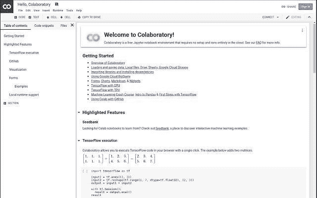
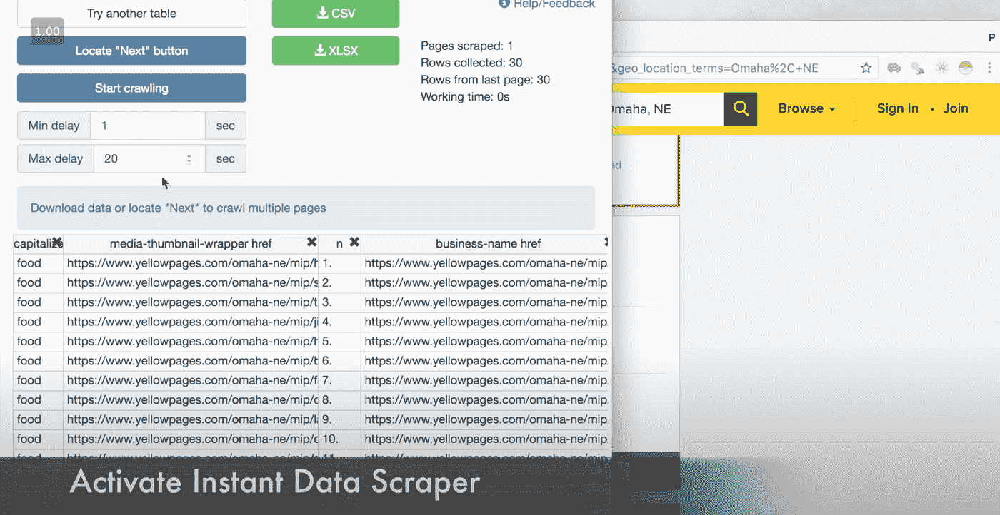
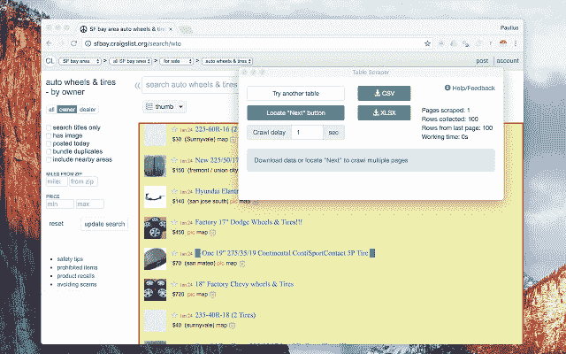

# 机器学习工程师和数据科学家必备的 Chrome 扩展

> 原文：<https://pub.towardsai.net/must-have-chrome-extensions-for-machine-learning-engineers-and-data-scientists-5968bda69ee?source=collection_archive---------0----------------------->

## [数据科学](https://towardsai.net/p/category/data-science)、[机器学习](https://towardsai.net/p/category/machine-learning)、[观点](https://towardsai.net/p/category/opinion)

浏览器扩展是大多数黑客和开发者保持更高生产力的秘密武器。由于很大一部分机器学习者使用 chrome ( [鉴于 chrome 巨大的市场份额](https://www.w3counter.com/globalstats.php)，我为机器学习工程师和数据科学家编制了一份必备的 chrome 扩展列表。

来自[像素](https://www.pexels.com/photo/woman-coding-on-computer-3861958/?utm_content=attributionCopyText&utm_medium=referral&utm_source=pexels)的[this is 工程](https://www.pexels.com/@thisisengineering?utm_content=attributionCopyText&utm_medium=referral&utm_source=pexels)照片

# **Arxiv 虚空**

数以百万计的 ML 行业工程师和研究人员每天都使用 Arxiv 来阅读最新的论文。然而，在 pdf 中阅读它通常是可怕的。Arxiv Vanity 将纸张转换成 HTML 格式，以便于阅读和吸收信息！

[点击这里安装 Arxiv Chrome 扩展](https://chrome.google.com/webstore/detail/arxiv-vanity-plugin/jfnlkegibnoaagfdabjkchhocdhnoofk)

来源:图片来自 chrome 网上商店[Arxiv Vanity](https://chrome.google.com/webstore/detail/arxiv-vanity-plugin/jfnlkegibnoaagfdabjkchhocdhnoofk)

正如你所看到的，一个通常很难阅读的 pdf，你的眼睛很紧张，如下

来源:图片由 Himanshu Ragtah 提供

由于 Arxiv Vanity 而变得易于阅读。

来源:图片由 Himanshu Ragtah 提供

来源:图片由 Himanshu Ragtah 提供

— — — — — —

# ML/AI 论文的代码实现查找器

这个浏览器扩展会自动向你显示你正在寻找的任何机器学习/人工智能研究论文的代码，以及你正在查看的任何地方(谷歌、推特、Arxiv、谷歌学术等。)

[点击此处安装 CatalyzeX Chrome 扩展](https://chrome.google.com/webstore/detail/mlai-code-implementation/aikkeehnlfpamidigaffhfmgbkdeheil)

[点击这里安装 CatalyzeX 火狐扩展](https://addons.mozilla.org/en-US/firefox/addon/code-finder-catalyzex/)

来源:图片由 Himanshu Ragtah 提供

来源:图片由 Himanshu Ragtah 提供

— — — — — —

# 在 Colab 打开

机器学习者希望经常直接进入代码实现并开始实验。这个扩展允许你这样做。只要找到。ipynb 文件并点击扩展图标！

例如，看看这个关于[演示图像分类](https://github.com/saktheeswaranswan/demo-image-classification-fastai-change-1/blob/master/demo.ipynb)的 GitHub 知识库

继续这个关于图像分类的演示，然后点击扩展工具栏中的“在 colab 中打开”图标！它将在 colab 环境中打开它，这样您就可以开始试验它了！

来源:图片由 Himanshu Ragtah 提供

来源:图片由 Himanshu Ragtah 提供

[点击这里安装 Open in Colab Chrome 扩展](https://chrome.google.com/webstore/detail/open-in-colab/iogfkhleblhcpcekbiedikdehleodpjo)

来源:图片由 chrome 网上商店的 colab 提供

目前这个扩展已经安装了超过 20，000 个！

— — — — — — — — — —

# 即时数据刮刀

机器学习者依靠高质量的数据来训练他们的模型。这个扩展使得这个过程变得更加容易。[查看提取所有搜索结果的视频演示！](https://www.youtube.com/watch?v=biHNChKt0mA)

专门从事 NLP 的机器学习工程师可以使用这种方法从 yelp 等给定网站提取评论和评级。此外，还可以提取评论和喜欢，这对那些从事情感分析的人非常有帮助。

[点击这里安装即时数据刮刀 Chrome 扩展](https://chrome.google.com/webstore/detail/instant-data-scraper/ofaokhiedipichpaobibbnahnkdoiiah)

例如，该扩展可以从 Yellowpages.com 获取位于奥马哈、东北的所有烧烤餐馆的列表，并以 excel 表格的形式给出数据。

来源:图片来自[即时数据刮刀](https://chrome.google.com/webstore/detail/instant-data-scraper/ofaokhiedipichpaobibbnahnkdoiiah)

来源:图片来自[即时数据刮刀](https://chrome.google.com/webstore/detail/instant-data-scraper/ofaokhiedipichpaobibbnahnkdoiiah)

或者

如果你想从 Craigslist 上搜罗海湾地区的车轮卖家名单。

来源:图片来自[即时数据刮刀](https://chrome.google.com/webstore/detail/instant-data-scraper/ofaokhiedipichpaobibbnahnkdoiiah)