# 深度学习的必备术语

> 原文：<https://pub.towardsai.net/must-know-terms-for-deep-learning-c2747d4fa318?source=collection_archive---------0----------------------->

## [深度学习](https://towardsai.net/p/category/machine-learning/deep-learning)

## T 在我开始深度学习、机器学习和人工智能的那一天，我一直听到一句非常著名的话。

照片由[洛伦佐·埃雷拉](https://unsplash.com/@lorenzoherrera?utm_source=unsplash&utm_medium=referral&utm_content=creditCopyText)在 [Unsplash](https://unsplash.com/s/photos/computer?utm_source=unsplash&utm_medium=referral&utm_content=creditCopyText) 拍摄

> “深度学习和机器学习系统是黑匣子。”

但我认为它们不是，尽管这在某些特定的情况下是合适的，但它在总体上很容易误导人，并会造成大量的混乱。

因为无论我们用深度学习和机器学习构建了什么，我们都知道这些东西将如何工作，因此不存在黑盒。我认为，为什么大多数人说它是一个黑盒，因为它们相当复杂，但正如我所说，我们知道它们将如何工作。所以让我们试着理解一些深度学习的必备术语。

我们将在本文中讨论的内容。

*   什么是深度学习
*   为什么称之为“深度学习”
*   激活功能
*   价值函数
*   梯度下降和学习率的重要性
*   反向传播
*   卷积神经网络(CNN)的基本理解
*   对递归神经网络(RNN)的基本理解

让我们开始吧

> **什么是深度学习**

深度学习是机器学习的一个子领域，涉及被称为人工神经网络的大脑结构和功能所启发的算法。

*   **神经元:-** 当我们得到信息，我们处理它，然后我们产生一个输出。类似地，在神经网络的情况下，神经元接收输入，对其进行处理，并生成输出，该输出或者被发送到其他神经元进行进一步处理，或者是最终输出。

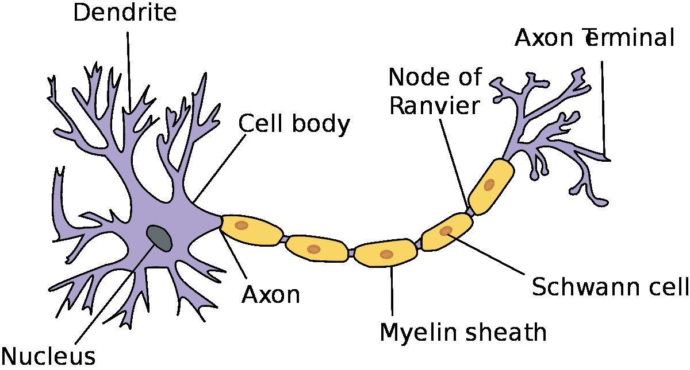

*   重量:- 当我们认为我们需要从地上捡起某样东西时，我们的大脑会将信号传递给我们的手，然后我们的眼睛会看到这个东西，并把它捡起来。神经元也是如此，当输入进入神经元时，它被乘以一个权重，假设我们有两个输入，那么每个输入都有自己的权重。

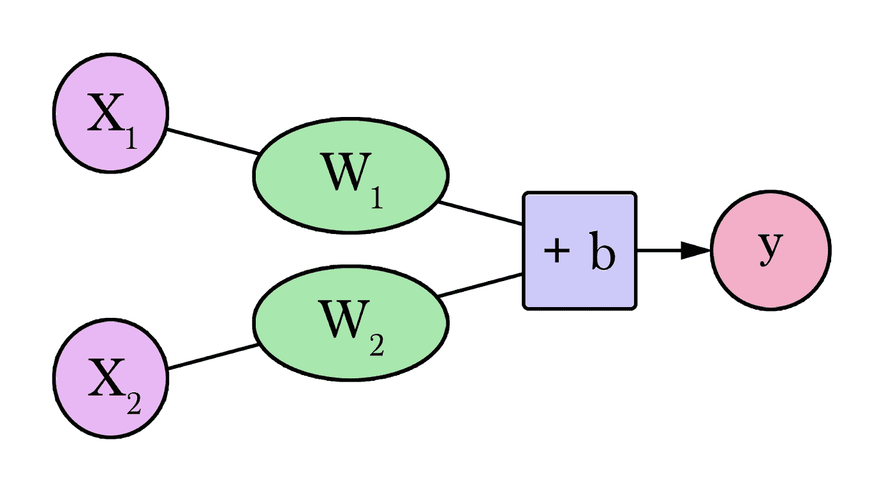

> 现在在图中，我们可以看到一个项(+b)，那是什么？

它只不过是一个偏差，除了权重之外，另一个分量应用于输入，这就是偏差。它被添加到输入的权重相乘的结果中。

> **为什么称之为“深度学习”**

在深度学习时代的开始，我们只知道人工神经网络的结构，也称为 **ANNs** ，并且由于计算能力和我们没有大量数据，只有 1 层可以工作。但是随着时间的推移，我们拥有了更多的计算能力，同时每天都有大量的数据产生。因此，为了对如此大量的数据进行预测，我们需要改变我们的人工神经网络模型。现在，拥有 10+层甚至 1000+层的神经网络是非常常见的，所有这些层都形成了一个“**深度**模型。这就是为什么它被称为“深度学习”。

> **激活功能**
> 
> 激活函数是添加到人工神经网络中的函数，以便帮助网络学习数据中的复杂模式。当与我们大脑中基于神经元的模型进行比较时，激活功能最终决定什么将被激发给下一个神经元。
> 
> 激活函数就像一个电灯开关，它决定一个神经元是否应该被激活。

一些最常用的激活功能

> **乙状结肠功能:-**

它也被称为逻辑函数，传统上是神经网络非常流行的激活函数。函数的输入被转换为 0.0 到 1.0 之间的值。它特别适用于我们必须预测概率作为输出的模型。

> **Tanh Activationn 功能:**

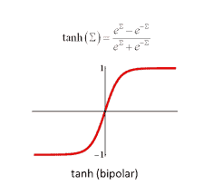

Tanh 或**双曲正切激活函数**…tanh 和 logistic sigmoid 的区别在于，其优势在于负输入将被映射为强负，零输入将被映射为 tanh 图中的零附近。

> **ReLU 激活功能:-**

**整流线性激活函数**或简称 ReLU 是一个分段线性函数，如果它是正的，它将直接输出输入，否则，它将输出零…整流线性激活函数克服了消失梯度问题，允许模型更快地学习和更好地执行。

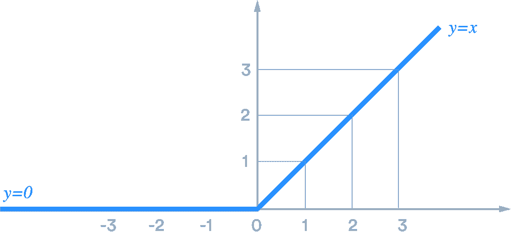

> **泄漏的 ReLU:**

漏 ReLU 是解决“**将死 ReLU** ”问题的一种尝试。当 x < 0 时，函数不是零，泄漏的 Relu 将具有小的负斜率(大约 0.01)…当单元饱和且不活动时，泄漏整流器允许小的非零梯度

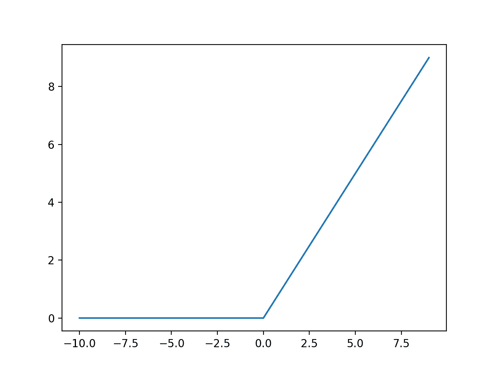

> **Sotfmax 激活功能:-**

softmax 激活函数用于预测**多项式概率分布**的神经网络模型的输出层，即 softmax 用于需要两个以上类别标签的多类别分类问题。

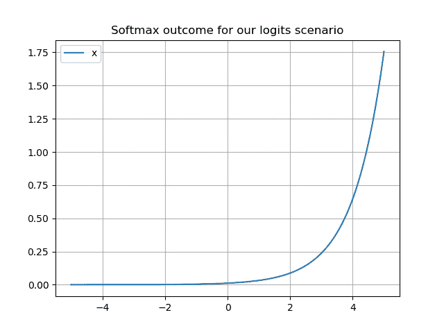

> **成本函数:**

成本函数是投入价格和产出质量的函数，其值是在给定投入价格的情况下制造产出的成本，通常由公司通过使用成本曲线来应用，以最小化成本和最大化生产效率。

啊！**相当复杂**，让我们简单点

这是对神经网络的预测值与实际值相比有多“好”的一种衡量。它与模型的质量成反比——模型越好，成本函数越低，反之亦然。通过最小化神经网络的成本函数，您将获得模型的最佳权重和参数，从而最大化它的性能。

**大多数成本函数在给定值 0 到 1 之间时给出最佳值**

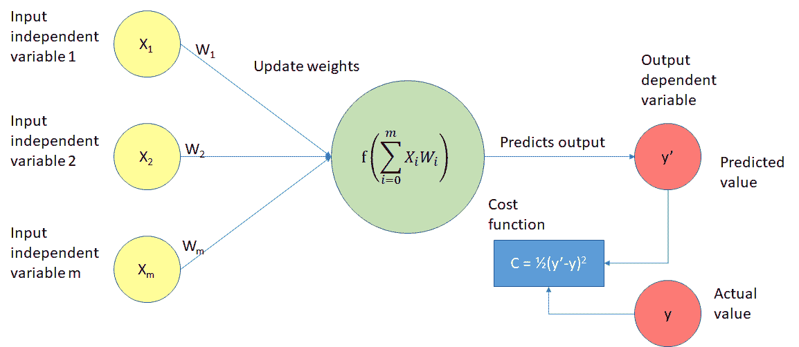

> **梯度下降和学习率的重要性:**

梯度下降是一种**优化算法**，用于训练神经网络模型。它基于一个凸函数，并反复调整其参数，以最小化给定函数到其局部最小值。

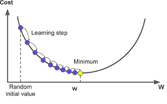

让我们假设一个场景，你在山顶，你需要下山。所以从山顶开始，我们沿着负梯度指定的方向迈出第一步下坡。接下来，我们重新计算负梯度，在方向上再走一步。我们不断重复这个过程，直到我们到达图表的底部，或者到达一个我们不能再走下坡路的点

> **梯度下降的工作原理**

与其爬上一座小山，不如把梯度下降想象成徒步走到谷底。这是一个更好的类比，因为它是最小化给定函数的最小化算法。

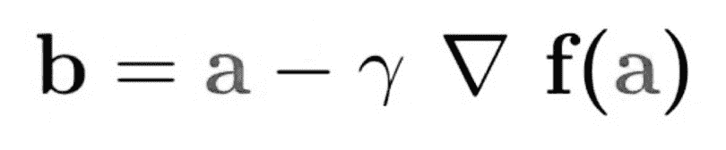

在上面的等式中:b 是我们攀登者的下一个位置，同时代表他当前的位置。负号是指梯度下降的最小化部分。γ是中间的等待因子，梯度项(δf(a))就是最陡下降的方向。

假设你有一个机器学习问题，想要用梯度下降来训练你的算法，以最小化你的成本函数 *J* ( *w* ， *b* )，并通过调整其参数( *w* 和 *b* )来达到其局部最小值。下图显示横轴代表参数( *w* 和 *b* )，纵轴代表成本函数 *J* ( *w* 、 *b* )。梯度下降是一个凸函数。

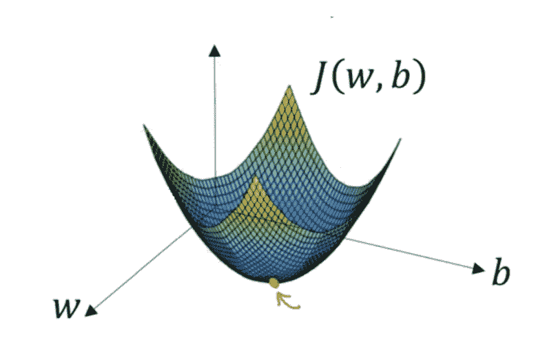

> **学习率的重要性**

梯度下降进入局部最小值方向的步长由学习率决定，学习率计算出我们向最优权重移动的快慢。

为了使梯度下降达到局部最小值，我们必须将学习速率设置为一个适当的值，这个值不能太低也不能太高。这很重要，因为如果它采取的步骤太大，它可能不会达到局部最小值，因为它在梯度下降的凸函数之间来回跳动(见下图)。如果我们将学习率设置为一个非常小的值，梯度下降将最终达到局部最小值，但这可能需要一段时间(见右图)。

**梯度下降的类型**

*   批量梯度下降
*   随机梯度下降
*   小批量梯度下降

> **反向传播:**

这是一种用于计算成本函数的梯度的**算法。这是一种基于前一时期(即迭代)获得的错误率微调神经网络权重的方法。适当调整权重可以降低错误率，并通过提高模型的泛化能力来提高模型的可靠性**

**一般来说，反向传播单词如下:**

1.  计算每个输入输出对的正向相位
2.  计算每对的反向相位
3.  组合单独的渐变
4.  基于学习率和总梯度更新权重

> **为什么我们需要反向传播？**

反向传播最突出的优点是:

*   反向传播快速、简单且易于编程
*   除了输入的数量之外，它没有要调整的参数
*   这是一种灵活的方法，因为它不需要关于网络的先验知识
*   这是一种标准方法，通常效果很好
*   不需要特别提及要学习的功能的特征。

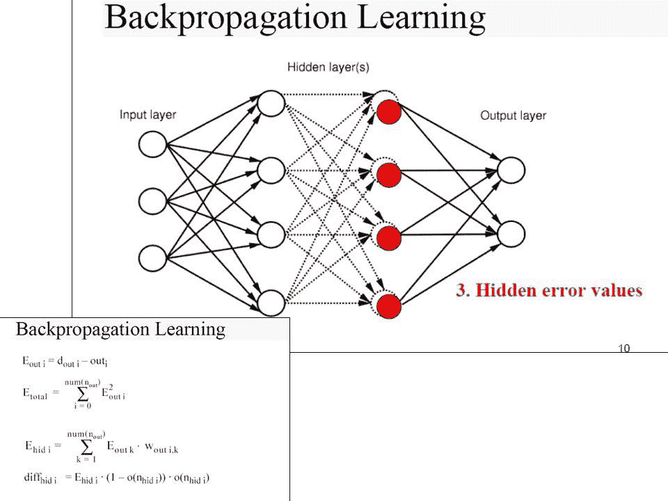

*** *此部分来自我的** [**上一篇**](https://medium.com/analytics-vidhya/brain-tumor-classification-transfer-learning-e04f84f96443) ******

> **用 CNN 了解深度学习**
> 
> **什么是卷积神经网络？**

卷积神经网络(CNN 或 ConvNet)是最受欢迎的深度学习算法之一，这是一种机器学习，其中模型学习直接从图像、视频、文本或声音中执行分类任务。

CNN 对于在图像中寻找模式以识别物体、面孔和场景特别有用。他们直接从图像数据中学习，使用模式对图像进行分类，无需手动提取特征。

需要[物体识别](https://www.mathworks.com/solutions/image-video-processing/object-recognition.html)和[计算机视觉](https://www.mathworks.com/solutions/image-video-processing.html)的应用——比如[自动驾驶汽车](https://www.mathworks.com/solutions/automotive/automated-driving.html)和[人脸识别应用](https://www.mathworks.com/discovery/face-recognition.html)——严重依赖 CNN。根据您的应用，您可以从头开始构建 CNN，或者对您的数据集使用预先训练的模型。

**是什么让 CNN 如此有用？**

由于三个重要因素，使用 CNN 进行深度学习变得越来越流行:

CNN 消除了手动特征提取的需要——特征由 CNN 直接学习。

CNN 产生最先进的识别结果。

CNN 可以为新的识别任务进行再培训，使您能够建立在现有的网络上。

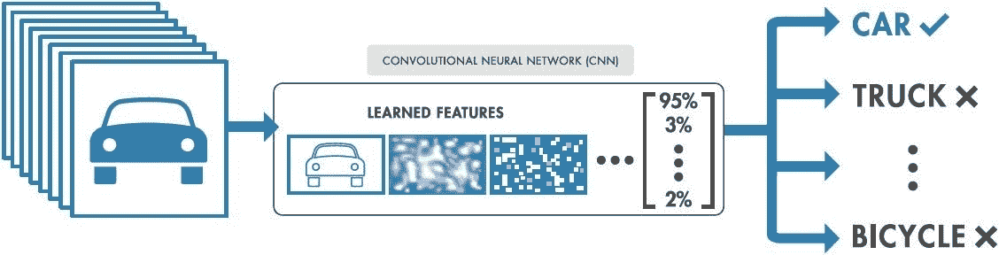

**CNN 如何工作？**

一个卷积神经网络可以有几十层或几百层，每一层都学习检测图像的不同特征。滤波器以不同的分辨率应用于每个训练图像，并且每个卷积图像的输出被用作下一层的输入。过滤器可以从非常简单的特征开始，例如亮度和边缘，并增加复杂性到唯一定义对象的特征。

> **特征学习、分层和分类**

这些层执行改变数据的操作，目的是学习特定于数据的特征。三个最常见的层是卷积、激活或 ReLU 以及池化。

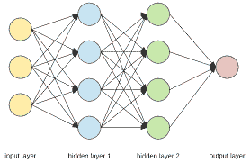

卷积将输入图像通过一组卷积滤波器，每个滤波器激活图像的某些特征。

校正线性单元(ReLU)通过将负值映射到零并保持正值来实现更快、更有效的训练。这有时被称为*激活*，因为只有被激活的特征被带入下一层。

池化通过执行非线性下采样简化了输出，减少了网络需要学习的参数数量

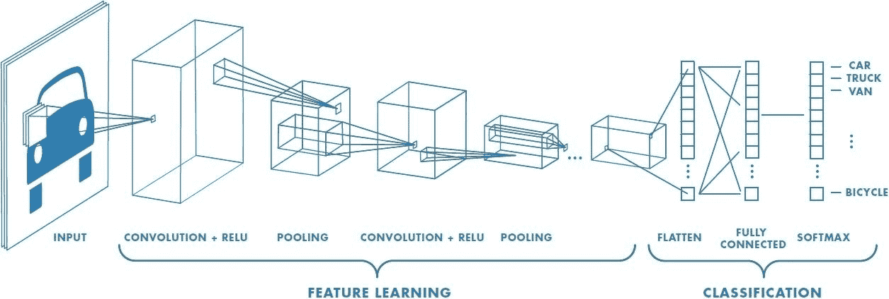

> **递归神经网络**

RNN 使用的架构与传统的神经网络没有什么不同。不同的是，RNN 引入了记忆的概念，并且它以一种不同类型的联系的形式存在。与前馈神经网络不同，某些层的输出被反馈到前一层的输入中。这种增加允许对顺序数据进行分析，这是传统神经网络所不能做到的。此外，传统的神经网络限于固定长度的输入，而 RNN 没有这样的限制。

在相反方向的层之间包含链接允许反馈循环，这用于帮助基于上下文学习概念。对于深度学习应用程序来说，这在很大程度上取决于需求(或目标)和数据。

rnn 有不同的种类，通常也取决于任务。RNN 的类型由输入数量与输出数量的关系来描述。这四种不同的类型是:

*   一对一，也就是俗称的香草 RNN。这个变体有一个输入，比如一个单词或一个图像，并输出一个标记，比如一个单词或一个布尔值。
*   一对多，一个输入用于创建多个输出。
*   多对一，使用几个输入创建一个输出。
*   多对多，分析几个输入以生成几个输出。

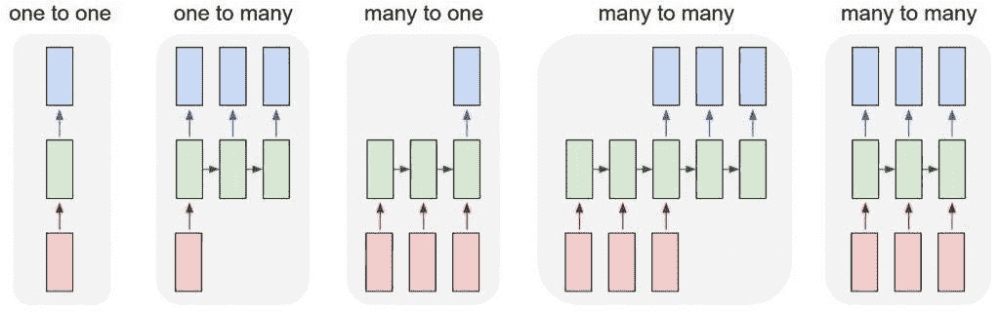

我们可以利用 RNN 的地方:

*   时间序列预测
*   预测序列中的下一个单词
*   语音/音频处理

****************************************************************

在我的 YouTube 上查看更多有趣的机器学习、深度学习、数据科学项目👉:-[YouTube](https://www.youtube.com/c/himanshutripathi)**(👍)**

**暂时就这样了👏👏。下一篇文章再见。**

> ****看看我以前的文章:****

** [## 基于网页视觉相似性的产品推荐:机器学习项目…

### 众所周知，谷歌、亚马逊、网飞等大型科技公司都在使用推荐系统…

medium.com](https://medium.com/@iamhimanshutripathi0/product-recommendation-based-on-visual-similarity-on-the-web-machine-learning-project-end-to-end-6d38d68d414f)  [## Web 上印度语言(印地语)的自然语言处理(NLP)

### "语言是一个秘密，每个人都可以处理，对我来说，这是美丽的."

medium.com](https://medium.com/datadriveninvestor/natural-langauge-processing-nlp-for-indian-language-hindi-on-web-64d83f16544a)  [## 什么是平衡和不平衡数据集？

### 不平衡数据集到平衡数据集的转换技术及其比较

medium.com](https://medium.com/analytics-vidhya/what-is-balance-and-imbalance-dataset-89e8d7f46bc5)  [## 基于迁移学习的脑肿瘤分类

### 迁移学习的详细解释以及如何使用它进行分类

medium.com](https://medium.com/analytics-vidhya/brain-tumor-classification-transfer-learning-e04f84f96443)  [## 用于分类变量编码的不同类型的特征工程编码技术

### “让我们从现有功能中创建新功能。”

medium.com](https://medium.com/analytics-vidhya/different-type-of-feature-engineering-encoding-techniques-for-categorical-variable-encoding-214363a016fb) 

**如果你觉得这篇文章有趣，有帮助，如果你从这篇文章中学到了什么，请鼓掌(**👏👏)**并留下反馈。**

**感谢阅读！**

***参考文献:-***

 [## 梯度下降:机器学习最流行的算法之一介绍

### 梯度下降是迄今为止在机器学习和深度学习中使用的最流行的优化策略

builtin.com](https://builtin.com/data-science/gradient-descent)  [## 基于迁移学习的脑肿瘤分类

### 迁移学习的详细解释以及如何使用它进行分类

medium.com](https://medium.com/analytics-vidhya/brain-tumor-classification-transfer-learning-e04f84f96443)  [## 什么是深度学习？-机器学习精通

### 深度学习是机器学习的一个子领域，它涉及的算法是由大脑的结构和功能激发的

machinelearningmastery.com](https://machinelearningmastery.com/what-is-deep-learning/)**