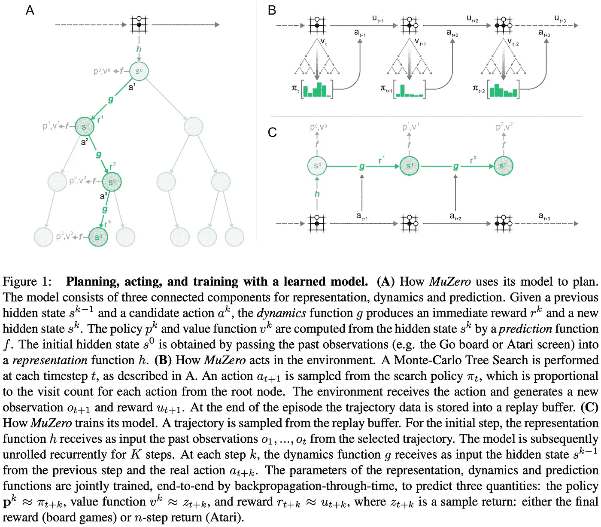
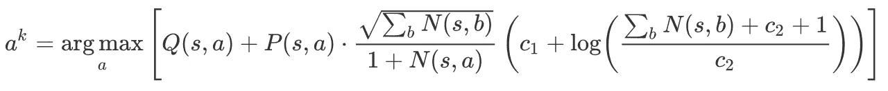
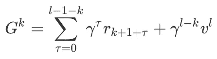
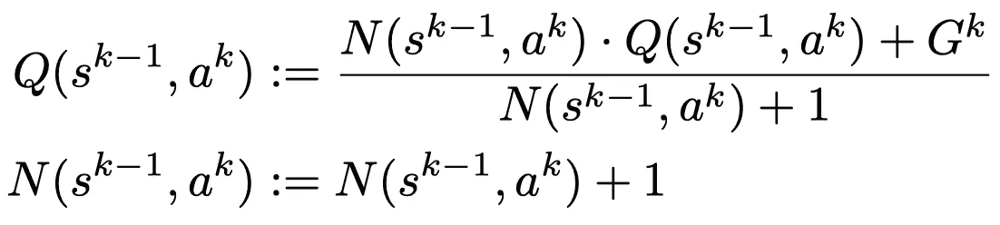
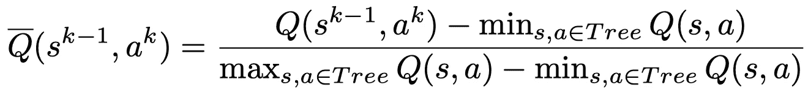
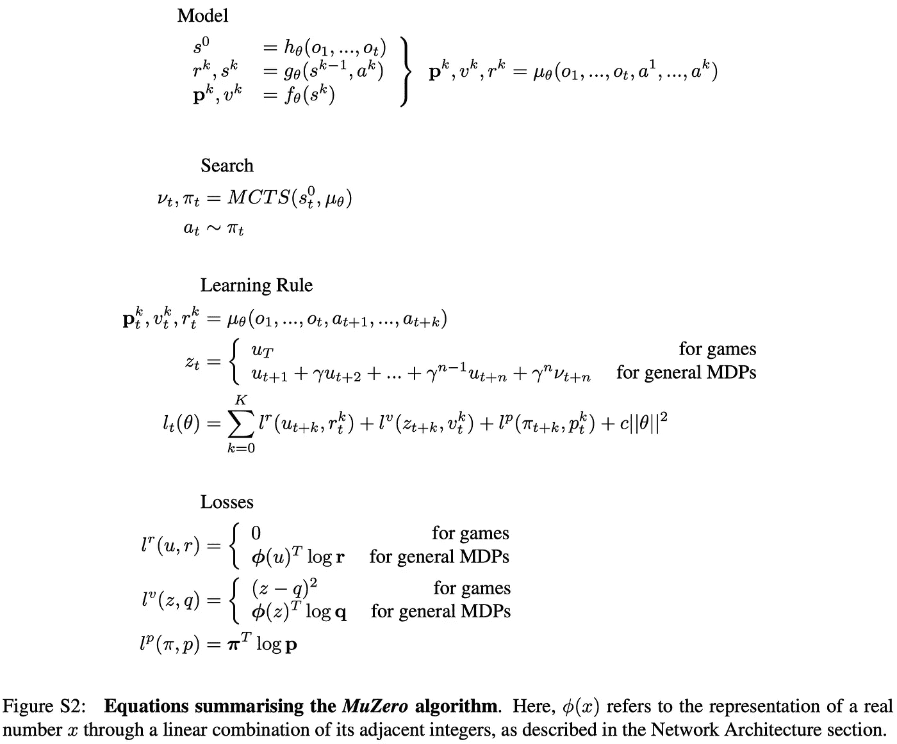
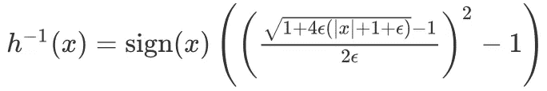
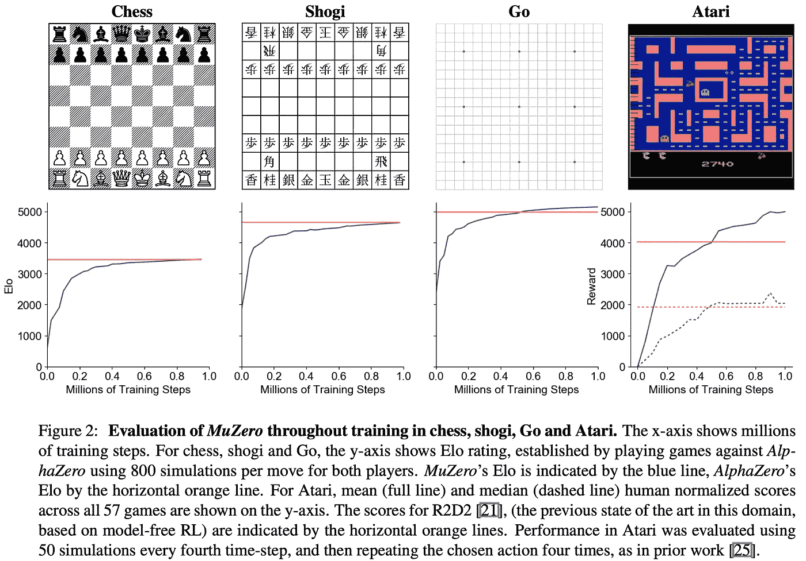
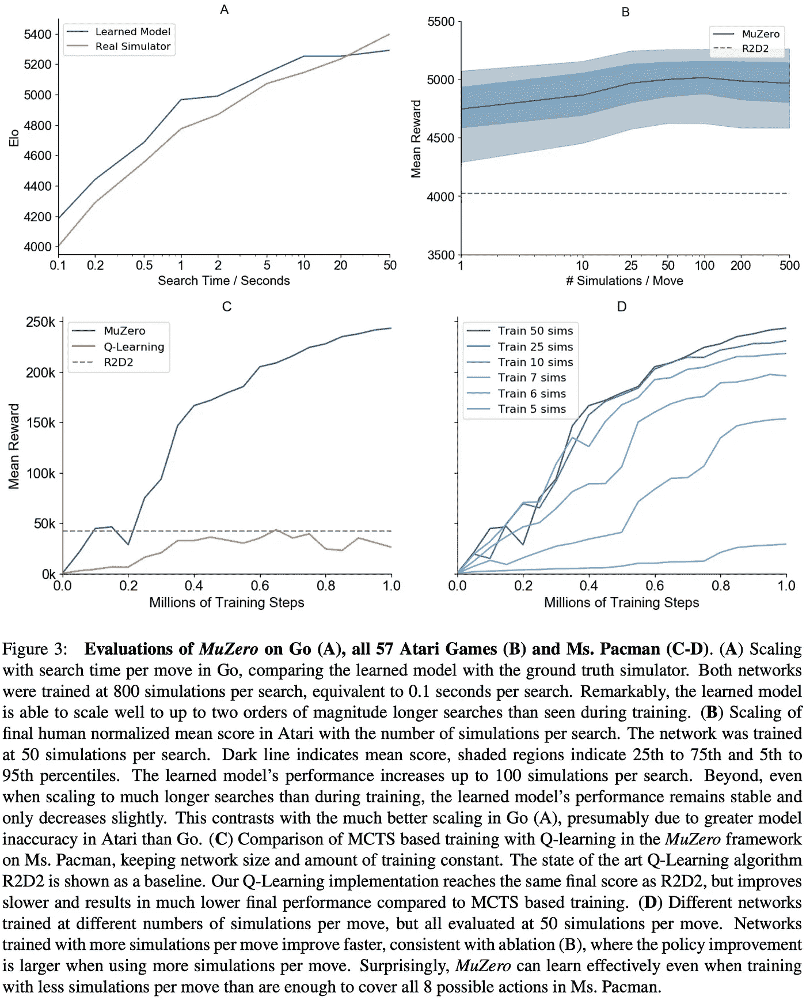

# MuZero:alpha zero 继任者的主板和雅达利游戏

> 原文：<https://pub.towardsai.net/muzero-master-board-and-atari-games-with-the-successor-of-alphazero-94bbe5121e60?source=collection_archive---------3----------------------->

## 强化学习

## 对穆泽罗的温和介绍

图片由来自 Pixabay 的 FelixMittermeier 提供

# 介绍

尽管无模型强化学习算法在解决许多具有挑战性的任务方面表现出了巨大的潜力，如星际争霸和 Dota，但在需要精度和复杂前瞻的领域，如国际象棋和围棋，它们仍远未达到最先进的水平。另一方面，规划算法可以掌握国际象棋和围棋，但它们通常依赖于环境动力学的知识，这阻止了它们在机器人等现实世界领域的应用。我们讨论一个名为 *MuZero* 的基于模型的 RL 代理，它是 [AlphaZero](/{{ site.baseurl }}) 的继任者，也是由 Silver 等人在 DeepMind 提出的，它在 Atari 2600 中实现了最先进的性能，同时在精确规划任务(如国际象棋和围棋)中保持了超人的性能。

与其前身 *AlphaZero 类似，* *MuZero* 使用蒙特卡罗树搜索(MCTS)来决定每一步。不同的是，MuZero 不需要了解环境的动态。相反，它学习潜在空间的动力学模型，使其能够应用于动力学未知的情况。

这篇文章由三部分组成:首先，我们讨论代理人如何在每一步做出决定。然后我们讨论在 *MuZero* 中使用的网络，以及这些网络是如何被训练的。最后，我们给出了几个有趣的实验结果。

# 推理

来源:通过学习模型进行规划，掌握雅达利、围棋、国际象棋和日本象棋

如图 1 所示， *MuZero* 在推理时创建一个搜索树，其中每个节点都与一个内部状态 *s* 相关联。对于来自 *s* 的每个动作 *a* 都有一个边 *(s，a)* 存储一组统计数据 *{N(s，a)，Q(s，a)，P(s，a)，R(s，a)，S(s，a)}* ，分别代表访问计数 *N* ，平均动作值 *Q* ，策略 *P* ，奖励起始状态 *s⁰* 通过表示函数 *h* 获得，它将输入平面编码成初始状态 *s⁰* 。

对于几个模拟，搜索重复以下三个阶段:

**选择:**每次模拟从内部根状态 *s⁰* 开始，当模拟到达叶子节点 *s^l* 时结束。对于搜索树中的每一步 *k=1，…，l* ，选择一个动作 *a^k* 以在置信上限(UCB)的一个变量上最大化，该变量与在 *AlphaZero* 中定义的相同

等式 pUCT 规则

其中*C1*和*C2*控制优先策略 *P* 相对于动作值 *Q* 的影响。

**扩展:**在最后一个时间步 *l* ，由动力学函数 *r^l、s^l=g(s^{l-1}、a^l)* 计算出奖励和下一个状态，并存储在相应的表 *R(s^{l-1}、a^l)=r^l、S(s^{l-1},a^l)=s^l* 中。这里，我们确定性地表示动力学函数；对随机跃迁的扩展仍然留给未来的工作。对应于状态*s^l*的新节点被添加到搜索树中，并且策略和值由预测函数*p^l,v^l=f(s^l*计算。从新扩展节点开始的每条边 *(s^l，a)* 初始化为 *{N(s^l，a)=0，Q(s^l，a)=0，P(s^l，a)=p^l}* 。注意，搜索算法每次模拟最多分别调用一次动态函数 *g* 和预测函数 *f* ，并且到新扩展节点的边的统计数据此时还没有更新。作为一个具体的例子，考虑图 1A。在时间步骤 3，MCTS 展开 *s* 并计算 *g(s，a )* 和 *f(s )* 用于记账)。

**后援:**穆泽罗将后援推广到环境可以发出中间奖励，并且𝛾的折扣小于的情况(我们仍然使用 *𝛾=1* 进行没有给出中间奖励的桌游)。对于内部节点 *k=l…0* ，我们从价值函数 *v^l* 自举，形成累积贴现报酬的 *l-k* 步估计:

对于 *k=l…0* ，我们也相应地更新路径中每条边的统计数据:

在两人零和博弈中，价值函数被假设为有界在[0，1]内。这种选择允许我们使用 pUCT 规则(等式 1)将价值估计与概率结合起来。但是，由于在许多环境中，该值是无界的，因此有必要调整 pUCT 规则。为了避免特定于环境的知识，我们将等式 1 中的 *Q* 值替换为归一化的 *\bar Q* 值，计算如下:

# 培养

*穆泽罗*由 3 个模型组成:一个将观察值 *o_1，…，o_t* 映射到根状态 *s⁰* 的表示模型，一个将状态 *s^{k-1}* 和动作 *a^k* 映射到下一个状态 *s^k* 和奖励 *r^k* 的动力学模型，以及一个接受状态 *s^* k 并产生策略*p^k*的演员-评论家模型所有这些都是卷积神经网络。

在训练期间，长度为 *K=5* 的转换序列通过从重放缓冲器中采样一个状态来选择，然后从该状态展开 *K* 步。对于棋盘游戏，状态是统一采样的，而在雅达利中，样本是按照以与[相同的方式抽取的，优先级为 *|𝜈-z|* ，其中𝜈是搜索值， *z* 是观察到的 n 步返回。该网络还展开了 K 个步骤，以便我们可以计算相应的回报、价值和策略损失，如图 S2 所示。](https://arxiv.org/abs/1511.05952)

培训过程还引入了几个微妙之处:

*   我们通过 *1/K* 来缩放每个压头的损失，以确保总梯度具有较小的幅度，而不管我们展开了多少步
*   我们通过 *1/2* 缩放动态功能开始时的梯度。这确保了应用于动态函数的总梯度保持不变。
*   我们将隐藏状态缩放到[0，1]，与动作输入的范围相同。这改进了学习过程并限制了激活。
*   对于 Atari，回报和价值由分类分布表示，因此用交叉熵损失进行训练。为了减少价值函数的潜在无限规模，我们使用 [Ape-X DQfD](https://arxiv.org/pdf/1805.11593.pdf) 的反函数进一步缩放价值预测。

# 有趣的实验结果

来源:通过学习模型进行规划，掌握雅达利、围棋、国际象棋和日本象棋

图 2 显示了每场比赛中整个训练过程的表现。 *MuZero* 的性能略微超过 *AlphaGo* 的性能，尽管在搜索树中每个节点使用的计算量更少(与 *AlphaGo* 中的 20 个块相比， *MuZero* 中每个评估使用 16 个剩余块)。这表明 *MuZero* 可能在动力学模型中缓存其计算，以获得对位置的更深入了解。

来源:通过学习模型进行规划，掌握雅达利、围棋、国际象棋和日本象棋

图 3 显示了关于 *MuZero:* 规划的可伸缩性的几个实验

*   图 3A 显示 *MuZero* 与完美模型的性能相匹配，即使在进行比训练模型(思考时间约为 0.1 秒)更深入的搜索(思考时间长达 10 秒)时也是如此。
*   图 3B 显示，雅达利由于计划的改进不如棋盘游戏显著，这可能是因为更大的模型误差；随着搜索时间的增加，性能略有提高。另一方面，即使是一个单一的模拟——也就是说，当只根据学习到的策略选择行动时——表现也很好，这表明，在训练结束时，原始策略已经学会了将搜索的好处内在化。
*   图 3C 显示，即使具有相同的网络规模和训练步骤，*穆泽罗*的表现也比 *Q-learning* 好得多，这表明*穆泽罗*的基于搜索的策略改进步骤提供了比 *Q-learning* 使用的高偏差、高方差目标更强的学习信号。然而，他们没有分析奖励和价值预测的分类表征的效果。这可能有助于 MuZero 的性能，因为众所周知，交叉熵损失提供了比 MSE 更强的学习信号。
*   图 3D 显示了模拟的数量在训练中起着重要的作用。但是，正如前面提到的，由于更大的模型误差，它可能会停滞不前。

# 参考

Julian Schrittwieser、Ioannis Antonoglou、Thomas Hubert、卡伦·西蒙扬、Laurent Sifre、Simon Schmitt、Arthur Guez、Edward Lockhart、戴密斯·哈萨比斯、托雷·格雷佩尔、Timothy Lillicrap、David Silver。通过学习模型进行规划，掌握雅达利、围棋、国际象棋和日本象棋