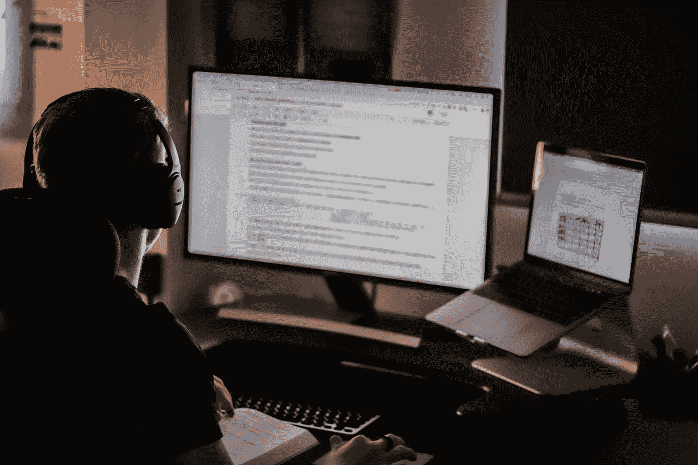
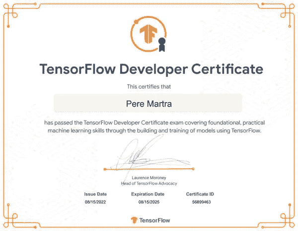

# 我成为 TensorFlow 认证开发人员的旅程

> 原文：<https://pub.towardsai.net/my-journey-to-becoming-a-tensorflow-certified-developer-407ca899c1b4?source=collection_archive---------1----------------------->

## 通过 TensorFlow 开发者证书考试是很多想进入深度学习的人的目标。我想解释一下我是如何在没有机器或深度学习经验的情况下通过考试的，更不用说 TensorFlow 了。

图片[塞缪尔·伯克](https://unsplash.com/@sambourke?utm_source=unsplash&utm_medium=referral&utm_content=creditCopyText)在 [Unsplash](https://unsplash.com/es/s/fotos/studying-code?utm_source=unsplash&utm_medium=referral&utm_content=creditCopyText)

# 我的起点。

我是一名工程师，有很好的 C++背景，我已经做了很长时间的开发人员，但是几年前，在我职业生涯的初期。我在过去的 15 年里一直和自动取款机打交道，最近 5 年领导着一个网络安全团队。如你所见，与人工智能或机器学习无关。

但是我整个职业生涯都在学习和训练。学习视频游戏开发的最后几年。就这样，我用强化学习知道了人工智能移动人物的发展。这是我在决定改变职业生涯之前对人工智能的全部体验。

的确，我知道训练、时期、步骤和超参数的概念。但是我在 TensorFlow 和解决 NLP(自然语言处理)、卷积网络或序列预测问题方面的经验是完全无效的。

# 为什么要通过 TensorFlow 开发者认证？

TensorFlow 是谷歌的图书馆，事实上，它几乎是机器学习领域的标准。

它可以在任何大型制造商的框架中使用，无论是 IBM、微软还是亚马逊。

这个认证，在我看来，有很好的声誉。这不是一个他们问你问题，你给他们答案的测试。这是一个测试，你必须制作模型，用他们给你的信息解决他们给你的问题。

而且是一个很长的考试，最多五个小时。有些人很早就结束了，有些人像我一样，到达终点时还有 10 分钟。在过去的半个小时里，我一直在改进几个模型来增加音符。

# 我是如何准备 TensorFlow 考试的？

我想说的是，虽然我遵循的是所谓的核心培训路线，但我也一直在开展次要活动。偶尔，在学习课程材料的过程中休息一下，花时间观看 YouTube 视频、学习 Kaggle 代码或阅读相关文章也是不错的。这些东西对我通过考试帮助很大。

我强烈建议你选不同导师的课程。每个人都有自己解释事情的技巧和方式，我已经能够从不同的人那里学到一些小技巧。和我最喜欢或者最理解的人在一起。

# 选修的课程。

## [**深度学习。Coursera 上的 AI TensorFlow 开发者证书。**](https://www.coursera.org/professional-certificates/tensorflow-in-practice)

DeepLearning.ai specialization 是准备 TensorFlow 开发者证书考试的官方课程。这门课由劳伦斯·莫罗尼教授。你看我一开始放的证明，是他签的。所以，很明显他知道自己在说什么。

该专业包括四门课程:

*   张量流简介。
*   图像分类的卷积网络。
*   自然语言处理，将讨论文本中的情感分析和预测文本生成。
*   系列预测。

它们与 TensorFlow 考试中需要查看的部分相匹配。

每门课程分为四个“周”。在每本书里，我们都可以找到视频，一些轻松的读物，一些在谷歌实验室里做的练习，还有一个期末作业。

也就是说，对于每门课程，你将有大约 8 / 10 的练习和 4 个必须在 Google Colab 中完成的作业。

虽然他们建议每个课程一个月，也就是整个专业四个月，但可以更早完成。我认为如果你每周花大约五个小时，你可以在几个月内完成这个专业。

**判决:必不可少。**

## [**谷歌上的机器学习速成班。**](https://developers.google.com/machine-learning/crash-course)

我猜大部分人一开始都会推荐上这门课。我不知道。很优秀但是比 Coursera 的专精更无聊。刚完成 Coursera 专精就做了。

好的一面是，所有的事情对你来说听起来都很熟悉，你已经知道了，而且不时地，他们会用不同的方式向你解释一些事情，你的脑袋咔嚓一声……你会想，哦，亲爱的……好吧！

本课程由 Colab 中的视频、文本、问卷和项目组成。内容真的很精彩。格式没有 Coursera 的好看。有时候，我很难知道自己被丢在哪里。视频有点老了。但是对我来说，在专业化之后马上做它是完美的！

**判决:强烈推荐。**

## [**关于 Udacity 上深度学习的 TensorFlow 介绍。**](https://www.udacity.com/course/intro-to-tensorflow-for-deep-learning--ud187)

我在考试前的最后 10 天或多或少参加了这个课程，我认为它对结果有很大的贡献。

不仅是因为它的内容，还因为它给了我信心，让我相信我有能力解决问题，而且我完全理解向我解释的一切。

这是一个很快的过程，一两个星期。但是，用一种清晰的方式解释这些概念，甚至给你时间来处理诸如迁移学习之类的话题。这也包括在 Coursera 专业化课程中，但本课程解释了一种更简单的方法来实现这一技术。

卷积网络，自然语言处理，和系列是触及。系列部分是托尼·摩西给的，我觉得很棒。不仅仅是因为《预测》系列中的解释，还因为你知道他的小伎俩或他的工作方式。另一方面，该课程遵循与 Coursera 相同的格式，即在 Google Colab 上混合视频和笔记本。

这门课学得很快。特别是如果你在最后做，因为你将能够解决提出的问题，但你会发现一些新的方法。

# 替代训练。

第一个推荐是劳伦斯·莫罗尼的[机器学习基础。这是一个必备的 YouTube 列表。它包含了 Coursera tensor flow 专业中前两门课程的大部分内容。](https://www.youtube.com/playlist?list=PLOU2XLYxmsII9mzQ-Xxug4l2o04JBrkLV)

提前浏览一下这个 YouTube 列表是个好主意，这样你就可以用一些有助于你更快进步的先验知识来面对这个专业。

我喜欢的其他 YouTube 频道是 Greg Hogh 和 Nicolas Rennote。在这两个网站上，我都找到了解释如何用 Tensorflow 解决任何问题的视频。

我的建议是，如果你在某些方面比较弱，比如预测文本生成，那就去 YouTube 上找找视频，看看他们是怎么解决的。

可能，他们会给你一个与你正在做的课程中所解释的不同的视角。或者他们只是用你更容易理解的方式来解释。

在 Kaggle 最好的事情就是看看[入门](https://www.kaggle.com/competitions?hostSegmentIdFilter=5)下的比赛，研究一下笔记本是怎么解决的。我会特别关注[数字识别器](https://www.kaggle.com/competitions/digit-recognizer)和[自然语言处理灾难推文](https://www.kaggle.com/competitions/nlp-getting-started)。

 [## 指南:使用迁移学习的推文分析

### 使用 Kaggle 笔记本探索和运行机器学习代码|使用自然语言处理中的数据应对灾难…

www.kaggle.com](https://www.kaggle.com/code/peremartramanonellas/guide-tweet-analysis-with-transfer-learning)  [## 张量流 MNIST 数字识别 0.9974

### 使用 Kaggle 笔记本探索和运行机器学习代码|使用来自数字识别器的数据

www.kaggle.com](https://www.kaggle.com/code/peremartramanonellas/mnist-digit-recognigtion-0-9974-with-tensorflow) 

# 环境和考试日。

最让我担心的一点是，考试是在 Pycharm 开发环境中进行的。一个我从未使用过的环境，现在我可以说我还没有使用过。别担心皮查姆！

我们需要 Pycharm 来安装考试插件。这将创建一个虚拟环境，其中包含要解决的练习。但是我在我的 Jupyter local 和 Google Colab 上做了 100%的工作。

您必须以. h5 格式保存模型，并将它们复制到考试插件创建的目录之一。

然后，您可以点击 evaluate 按钮，Pycharm 上传模型并对其进行评估。

模型的名称是不相关的，但是目录中必须只有一个模型。您可以发送模型进行评估，次数不限，这样您就可以进行测试并保留最佳模型。

这些模特的得分从 0 分到 5 分。我建议用 a 4 快速通过所有问题，然后，如果你还有剩余时间，致力于提高你的分数。

在发送待评估的试卷时，你必须小心。我们必须确保在每个目录中都有我们想要的模型。那些目前在目录中的人被评估，而不是那些以前评估过的人，即使他们有更好的成绩。

考试持续五个小时，但是直到你把一切都准备好了才开始计数。不要担心，当你正确安装插件并点击开始考试按钮时，它将开始计数。

我使用了两台计算机:一台装有 i5 的 MAC，在那里我用推荐的库配置了 Pycharm 另一台 Mac，但是是 Silicon，用 Conda 创建了一个 Jupyter 环境，用推荐的库。

我不建议安装 Pycharm 并尝试在 Mac 芯片上创建考试环境。我无法在 MAC 芯片上的 Pycharm 上安装 TensorFlow 2.9。

但我在 MAC 上使用了硅，并将. h5 模型传递给了 Intel MAC，在那里，考试环境用 Pycharm 进行了正确配置。

## 参加考试

**我很快解决了前三个问题，第四个也是，虽然花了我一点时间**。事实是，我的分数是 5，4，5，4，5 是最大可能的分数。我还有两个半小时，我开始着手解决第五个问题。

嗯，在第五个问题中，我遇到了一个问题，花了我大约两个小时才解决。**我无法让模型正确地通过测试验证。最后，当我设法明白我做错了什么时，我以 3 分通过了。**很公平，但有事就是有事。我还剩半个小时，决定试着提高两个 4。我已经被第五个问题弄得筋疲力尽了。

从第一个问题开始，我相当放松。我最担心的是一些考试设置不起作用。一切似乎都很好。

随着我的进步，我注意到我真的能够通过，但是第五个模型…我甚至想过把它留在 0。在那五个小时里，我几乎没吃东西。我没有停下来吃饭。我在桌子上吃了点东西，我的一瓶水。我的两台电脑都打开了，准备好了。在紧张的几天后，我花了五个小时做最后的评论。

我建议你准备好环境，确保它是一个舒适的环境。一个人在家的时候选了一个假期，真的很紧张。

考试并不复杂，但是你确实要表现出你知道如何用 TensorFlow 解决图像分类、语言、级数等领域的问题。在一些问题中，它们可以包含一些额外的困难，就像我在第五题中遇到的那样。

不要担心。如果你准备好了，你会通过的。你不是侥幸通过考试，而是祝你天下好运！

我会在 TensorFlow 认证开发者的[目录里等你。](https://developers.google.com/certification/directory/tensorflow)

这是我将解释我从 ATM 安全工程师到机器学习工程师的旅程的系列文章的第一篇。在 ATM 工作 15 年后的转换并不容易，尤其是考虑到我已经 50 岁了！

但永远不会太晚，道路是令人兴奋的。

我定期写张量流和机器学习。**考虑** [**在媒体**](https://medium.com/subscribe/@peremartra) **上关注我，获取关于新文章的更新。**如果你喜欢 TensorFlow，想了解一些有趣的技巧，可以查看我的系列:TensorFlow Beyond The Basics。

[佩雷·马特拉](https://medium.com/@peremartra?source=post_page-----407ca899c1b4--------------------------------)

## 张量流超越基础

[View list](https://medium.com/@peremartra/list/tensorflow-beyond-the-basics-24c4c6a844d8?source=post_page-----407ca899c1b4--------------------------------)3 stories

当然，欢迎你在 LinkedIn 上与我联系。