# 我关于使用 py-spy 和 VS 代码剖析 Python 微服务的笔记

> 原文：<https://pub.towardsai.net/my-notes-on-profiling-a-python-microservice-using-py-spy-and-vs-code-bee5c9d98891?source=collection_archive---------2----------------------->

## [软件工程](https://towardsai.net/p/category/software-engineering)

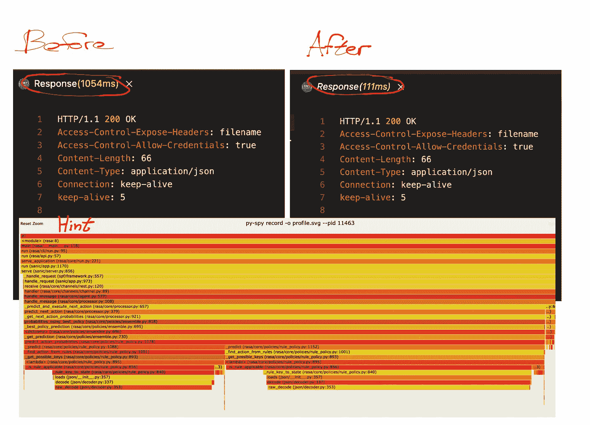

# 介绍

本文是我上一篇文章[1]的后续，在那篇文章中，我介绍了使用 VS 代码分析 python 代码的工作流程。我们想要分析的应用程序是一个聊天机器人，这里使用的主要工具是 [cProfile](https://docs.python.org/3.8/library/profile.html#module-cProfile) 。让我们称这种方法为 cProfile 方法。

现在，这篇文章将展示如何使用 [py-spy](https://github.com/benfred/py-spy) 做同样的事情。

为什么要再写一篇讨论同样问题的文章呢？因为正如我们将看到的，py-spy 方法非常不同，足以保证它自己的解释，并且可能是快速确定性能问题原因的首选方法。

重现本文中描述的结果的代码在这个 [repo](https://github.com/hsm207/python_profile) 中。

我们将从快速概述我们想要解决的问题开始。然后，我们将介绍使用 py-spy 来分析代码的步骤，并在最后讨论这种方法与 cProfile 方法相比的优势。

# 问题陈述

问题与[1]中的相同。

总结一下，你收到了一个错误报告，说你的聊天机器人每次处理一条来自用户的消息时都有不合理的高 CPU 负载。

请记住一个重要的事实:

您的聊天机器人是按照微服务架构构建的，因此很明显，问题出在处理用户消息的组件上，而不是其他地方，例如后端调用、数据库查询等。

# 解决办法

## 概观

以下是使用 py-spy 和 VS 代码分析有问题组件的主要步骤:

1.  使用 VS 代码在容器中部署组件
2.  重现问题
3.  确定处理请求时哪个(哪些)功能消耗的时间最多
4.  找出函数花费很长时间的原因
5.  尝试各种修复[可选]

## 步骤 1 使用 VS 代码在容器中部署组件

和以前一样，我们将使用 VS 代码创建一个基于`rasa/rasa:2.8.22-full`图像的容器。我们还需要添加任何必要的设置来重新创建 bug 报告中描述的 bot。

一旦进入容器，我们将启动一个服务器来托管机器人(使用`rasa run`)。

注意，为了让 py-spy 工作，容器需要使用`SYS_PTRACE`参数运行，因此我们需要将它添加到`devcontainer.json`配置中:

图 1:使 py-spy 在容器中工作的额外容器配置

## 重现问题

我们可以使用`curl`向服务器发送一个请求，并观察 CPU 负载是否出现峰值。然而，在 shell 中键入有效负载是很麻烦的。幸运的是，VS 代码中有一个扩展使得发送 REST 请求变得容易: [REST 客户端](https://marketplace.visualstudio.com/items?itemName=humao.rest-client)

使用这个扩展，我们可以将请求的有效负载写在一个文件中，并通过单击一个按钮将它发送到服务器:

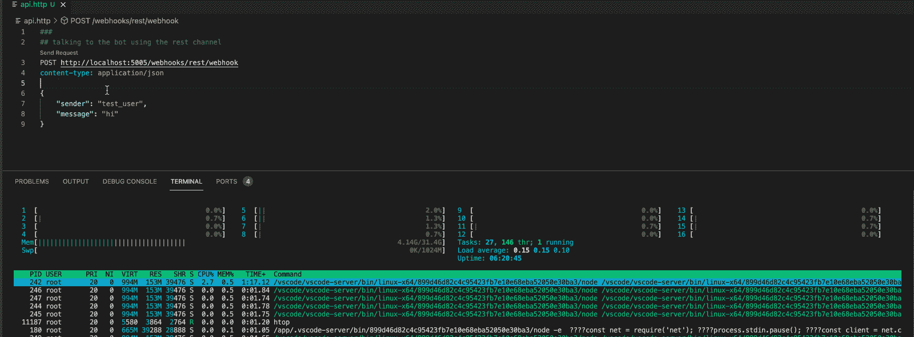

图 2:尝试重现问题

图 1 向服务器发送了 3 次请求。请注意，每个请求需要大约 1500 毫秒才能完成，并且总是伴随着巨大的 CPU 峰值。

因此，我们成功地重现了错误报告中描述的问题。

## 步骤 3 确定在处理请求时哪个(哪些)功能消耗的时间最多

py-spy 的`top`命令可用于获得处理请求时哪个函数消耗时间最多的高级概述。不过，在这样做之前，我们需要知道进程的 id。

我们可以使用`pgrep`命令找到服务器的进程 id:

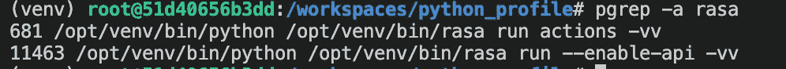

图 3:使用 pgrep 计算 rasa 服务器的 pid

图 2 显示`11463`是我们想要的进程 id，因为这是用于启动服务器的命令。

运行`py-spy top --pid 11463`给出:

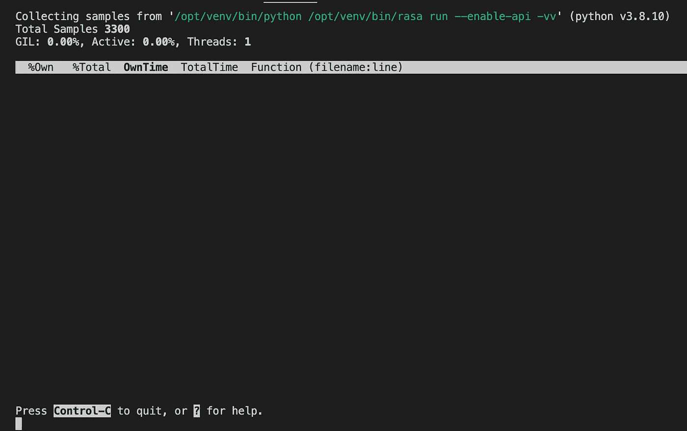

图 4:启动时的 py-spy top

这是向服务器发送几个请求后的输出:

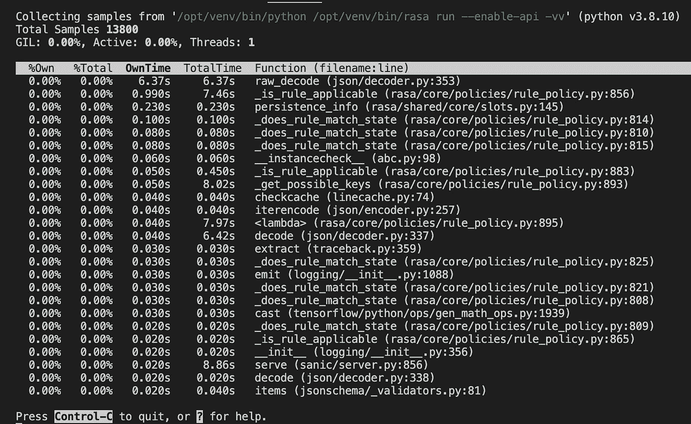

图 5:向服务器发送几个请求后的 py-spy top

我们看到最耗时的函数是来自`json`库的`raw_decode`,然后是来自`rasa`库的`_is_rule_applicable`,这是我们正在分析的库。

我们来看看这两个功能有没有关系。

## 第四步，找出函数花费时间长的原因

py-spy 的`record`命令可以用来可视化所有函数调用之间的关系:

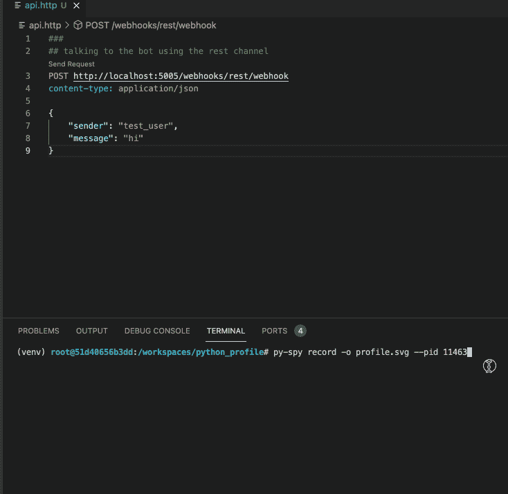

图 6:构建火焰图

图 6 的结果是一个名为`profile.svg`的 svg 文件中的火焰图，如下所示:

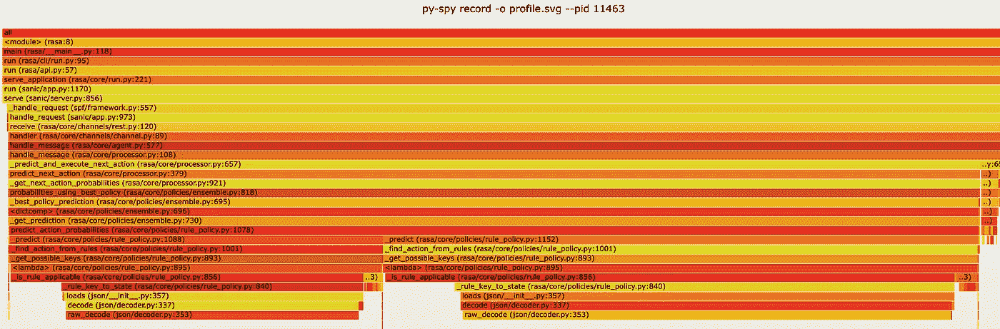

图 7:来自图 6 的火焰图

每个矩形是一个函数的名称，它的长度代表在该函数中花费的时间。[2]是学习如何解释火焰图的一个很好的资源。

显而易见的是:

1.  `raw_decode`是最耗时的功能
2.  `raw_decode`在`_predict_action_probabilities`函数中的两个不同位置被调用两次
3.  `_is_rule_applicable`依赖于`raw_decode`无论它是什么，前一个函数应该
4.  在调用`raw_decode`之前，rasa 库中的最后一个函数是`_rule_key_to_state`

最后一点值得注意，因为我们不能修复我们不维护的库。

仔细查看来自`_predict_action_probabilities`的函数调用:

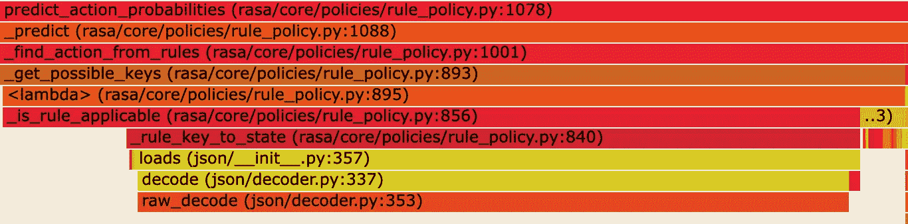

图 8:来自`_predict_action_probabilities onwards`的函数调用

注意，有一个 lambda 函数调用了`is_rule_applicable`。这基本上是代码耗时部分的起点，所以研究这个 lambda 做什么会很有趣:

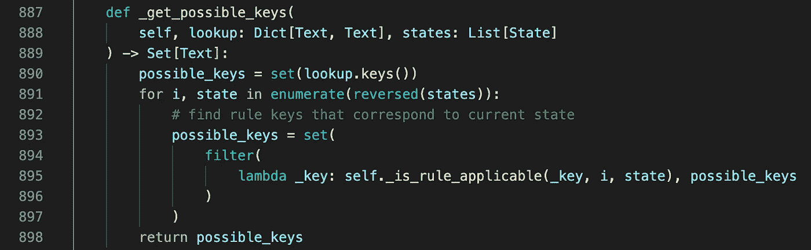

图 lambda 函数的细节(第 895 行)

根据图 9，我们可以得出高 CPU 负载的原因是:

*   `_is_rule_applicable`是一个计算密集型函数，或者
*   `possible_keys`是一个非常大的集合，所以使用`filter`函数循环遍历它会消耗大量的 CPU 周期

或者两者都是真的？

如果不知道每个函数被调用的次数，很难判断。无论如何，我们已经隔离了性能问题的来源，并收集了足够的信息传递给开发人员进行修复。

## 尝试各种修复方法[可选]

由于`_rule_key_to_state`是在代码中最耗时的部分调用的最后一个与 rasa 库相关的函数，如果我们想找到一个快速解决方法，检查它的实现是一个很好的起点:

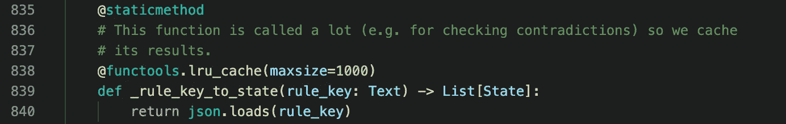

图 10: `_rule_key_to_state implementation`

在这种情况下，我们真的很幸运。这个函数只做一件事(使用`json`库将字符串中的 JSON 对象解码成字典),并附带一个缓存来存储之前的结果。

因此，增加这个缓存的大小应该会减少 CPU 的负载，并增加响应时间，但代价是消耗更多的 RAM。这是我们将`maxsize`设置为 10，000 时发生的情况:

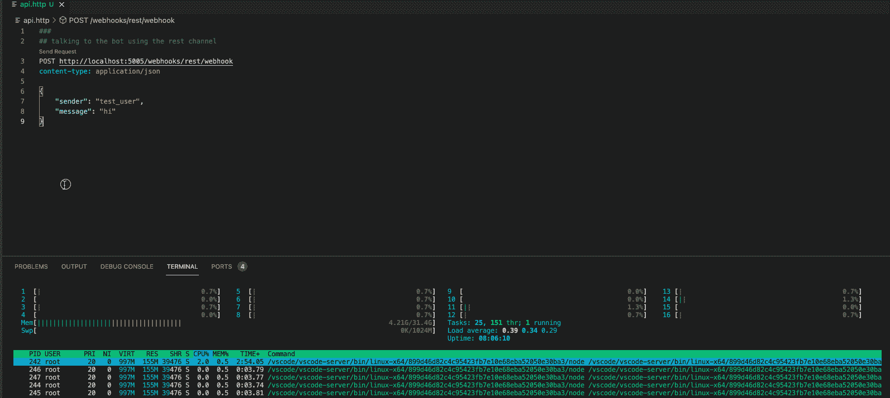

图 maxsize = 10000 时的 CPU 负载和响应时间

当`maxsize`设置为 10，000 时，只有第一个请求会导致 CPU 负载峰值。后续请求的负载可以忽略不计，并且在 100 毫秒内完成。

# 间谍方法的好处

我认为在微服务中使用 py-spy 来分析 Python 代码的主要好处是设置起来既快又容易。先决条件只是部署应用程序并找出它的进程 id。一旦完成，我们就可以像最终用户一样与应用程序进行交互，但要打开 py-spy 来调查性能问题。

此外，如果发生性能问题的环境不容易重现，那么我们可以登录到 bug 报告者环境中的容器，使用 py-spy 进行分析。事实上，我们可以告诉 bug 报告者从`py-spy top`和`py-spy record`那里收集信息，并与我们分享结果。对于担任支持工程师角色的人来说，这是一个很好的选择，他们所支持的应用程序没有足够的工具来诊断问题。

# 结论

本文展示了我如何使用 py-spy 和 VS 代码来诊断 python 微服务中的性能问题。它还展示了如何使用火焰图来快速确定性能瓶颈，以便进一步调查。

我希望你已经发现这是有用的。

# 参考

[1] [我使用 VS 代码剖析 Python 代码的工作流程](/how-i-profile-python-code-using-vs-code-714d0ba71b6d)。____ .2022

【2】[USENIX ATC’17:用火焰图可视化表演](https://www.youtube.com/watch?v=D53T1Ejig1Q)。布兰登·格雷格。2017