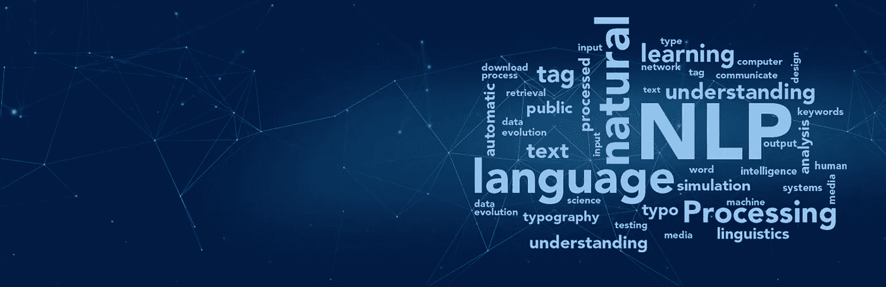

# 我的研究员作品集:8 年研究人工智能应用于自然语言处理

> 原文：<https://pub.towardsai.net/my-researchers-portfolio-8-years-of-studying-ai-applied-to-natural-language-processing-5bbe94426610?source=collection_archive---------1----------------------->

2013 年，我决定开始一篇应用于 NLP 的 AI 博士论文。这个决定改变了我的专业方向，也是我在数据项目上获得专业知识和经验的第一步。

图片来自[www.aismartz.com](http://www.aismartz.com)

我选择进入科学研究领域显然有两个原因。第一个是出于好奇。作为一个更注重实践的工程研究的获奖者，这个研究领域对我来说是一个未知的领域。然后我想发现它:成为实验室的一部分，做研究，做更多的理论研究，当然，写一份科学出版物。第二个原因与 2010 年代的技术趋势有关，这些趋势围绕两个主要领域，大数据和人工智能。

在这篇文章中，我将分享我的研究作品集，并提供我所有出版物的链接，最后我简要说明了我未来的工作方向。

> 如果你还不是 Medium 的会员，现在可以使用下面的链接:

# *6 年哲学博士学位*

*舆情分析是自然语言处理领域的一个研究轴心。目标是从不同类型的媒体(包括互联网)上发布的内容中提取公众的意见。从这样的程序中获得的结果在几个领域中是非常有用的，特别是在灾难情况下帮助政治、经济和社会决策，识别营销伙伴的目标，以及许多其他情况。在我的论文中，我们处理基于从社交网络中提取的文本内容的舆论分析的特殊情况。*

*我的博士学位的贡献可以概括为两个主要部分:对一条法国推特的情感分析，然后对检索到的所有情感进行汇总，以评估对给定目标表达的公众意见的取向。*

*以下是我从 2013 年到 2019 年发表的科学论文列表:*

* [## 基于主观词汇法的法语推文情感分析

### 基于主观词库方法的情感分析实验表明，情感分析工具具有较高的准确率

www.semanticscholar.org](https://www.semanticscholar.org/paper/Sentiment-Analysis-of-French-Tweets-based-on-of-the-Rhouati-Berrich/d0cea447ff07b4c2fff9481321a3a90b02ed6955)  [## 从网上发布的内容中获取公众意见/CSM:基于大数据的新方法

### 阿卜杜勒卡迪尔·鲁瓦提·哈桑·埃蒂富里·穆罕默德·加乌斯·贝尔卡斯米·图米·布兴图夫…

link.springer.com](https://link.springer.com/chapter/10.1007/978-3-319-30298-0_43)  [## 走向大数据平台，从网络/CMS 上的法国内容中获取公众意见

### Abdel kader Rhouati El Hassane Ettifouri Mohammed GH aouth belk asmi Toumi Bouchentouf 智能技术进步的一部分…

link.springer.com](https://link.springer.com/chapter/10.1007/978-3-319-46568-5_35)  [## 基于 Apache Hadoop 的舆情知识(POK)平台:从法国获取一个舆情…

### POK 平台-舆论知识的缩写-是一个新的解决方案，以获取法国的舆论…

ieeexplore.ieee.org](https://ieeexplore.ieee.org/abstract/document/7847689)  [## 不同内容之间的互操作性和可移植性的解决方案…

### 阿卜杜勒卡迪尔·罗华蒂·贾马尔·贝里席·穆罕默德·加乌斯·贝尔卡斯米·图米·布兴图夫

link.springer.com](https://link.springer.com/chapter/10.1007/978-3-319-96292-4_34)  [## 从网上获取公众意见:文本挖掘技术综述

### 公众舆论是所有政府政治和经济决策的一个主要因素。恭敬的…

www.academia.edu](https://www.academia.edu/37194896/Get_public_opinion_from_the_web_A_survey_of_Text_Mining_techniques) 

# 在诺维利斯的实验室工作了两年半

研究实验室项目的目标是设计一个解决方案，允许基于用自然语言(法语或英语)编写的规范和描述自动生成 web 应用程序的源代码，同时考虑该应用程序的上下文和领域(医疗、保险、电子商务等)。这一目标需要解决几个重大的科技挑战:

*   应用和实现允许机器理解用户需求的方法，在特定领域用自然语言(文本)表达，利用最新技术成果，并通过科学贡献参与解决遇到的限制。
*   满足用户需求(技术架构、设置、初始化脚本、用户界面等)的计算机项目的自动生成。
*   算法的生成考虑了用户需求中表达的约束和
    需求，并集成到生成的项目中。

为了处理这个复杂的问题，我们将我们的工作组织成中等复杂程度的专门化子问题。因此，我们致力于 5 个子项目和子组件:“数据库生成”、“SQL 查询生成”、“架构生成”、“Java 代码或 Python 生成”和“用户界面生成”。我们已经为每个子组件提出了一个解决方案，但是，我们取得最大科学进展的子组件是 SQL 代码的生成。下面是我们处理从自然语言规范生成 SQL 请求任务的两个主要科学出版物:

 [## 使用监督学习和递归神经网络从自然语言生成 SQL

### 优素福·迈拉·哈桑·埃蒂福里·阿卜杜勒卡迪尔·罗瓦提·瓦利德·达哈内·图米·布兴托夫·穆罕默德·加乌斯·贝尔卡斯米

link.springer.com](https://link.springer.com/chapter/10.1007/978-3-030-53970-2_17)  [## COMBINE:从自然语言生成 SQL 的管道

### 优素福·梅拉赫·阿卜杜勒卡迪尔·鲁瓦提·哈桑·埃蒂福里·图米·布兴托夫·穆罕默德·加乌斯·贝尔卡斯米

link.springer.com](https://link.springer.com/chapter/10.1007/978-3-030-88244-0_10) 

在我在 Novelis 工作的 2 年中，我还与客户一起从事 RPA 项目。这项工作让我发现了这个新领域，并利用这些项目来撰写我的文章，提出一种新的模型来确定最适合自动化机器人的业务流程:

 [## 供应链中机器人过程自动化的影响

### 机器人过程自动化(RPA)是过去十年中最新兴的技术领域之一。顾名思义…

dl.acm.org](https://dl.acm.org/doi/abs/10.1145/3475851.3475865) 

# 下一步是什么？

最近我对人工智能的可解释性领域越来越感兴趣(XAI)。在某些领域，如银行和保险，由于缺乏可解释性，人工智能的使用仍然有限。人工智能的模型，更具体地说，深度学习，是黑盒。他们工作并给出了很好的结果，但是现在人们可以解释这些结果了。
我的下一个科学工作旨在探索在自然语言问题上解释机器学习模型的可能性。*