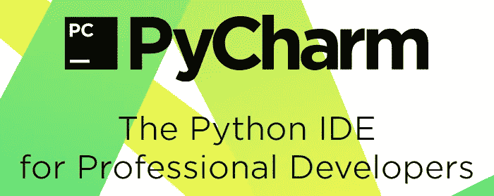
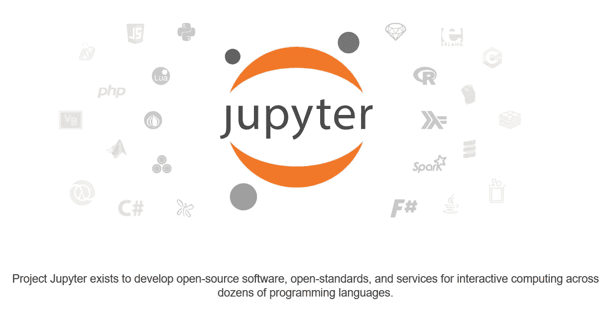
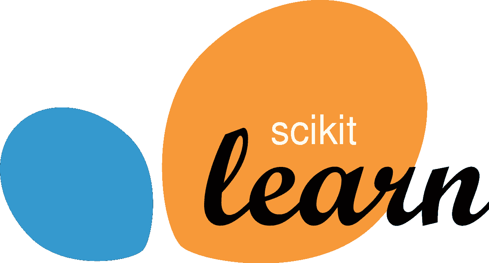
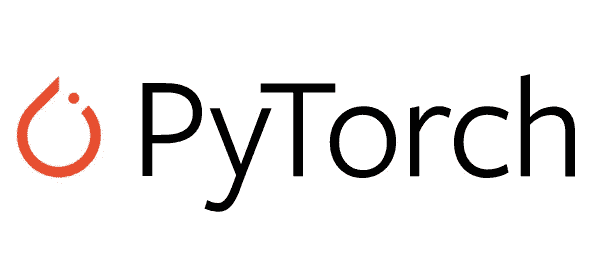
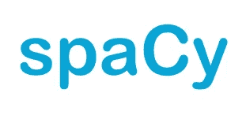
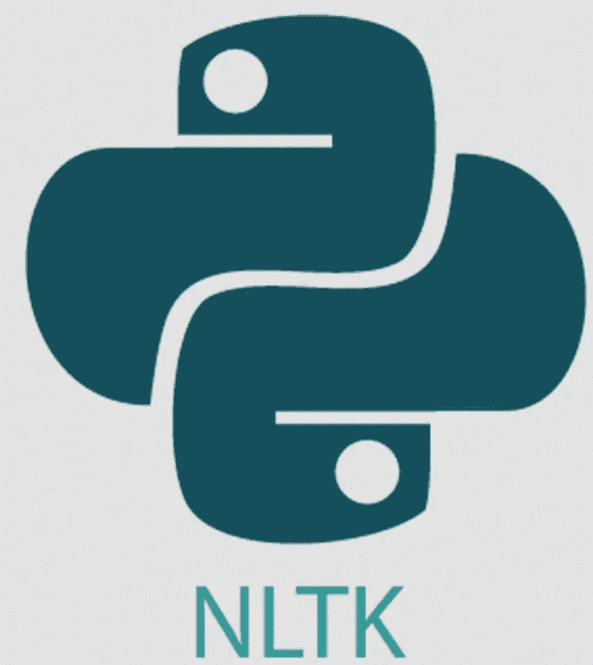
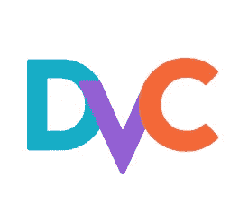

# 提高 ML 模型开发效率的工具

> 原文：<https://pub.towardsai.net/my-tools-to-increase-ml-model-development-productivity-fba739b18743?source=collection_archive---------4----------------------->

## [机器学习](https://towardsai.net/p/category/machine-learning)，[深度学习](https://towardsai.net/p/category/machine-learning/deep-learning)

## 关注文本中的 ML 开发

照片由[迈克·科奇](https://unsplash.com/@mike?utm_source=medium&utm_medium=referral)在 [Unsplash](https://unsplash.com?utm_source=medium&utm_medium=referral) 上拍摄

大家好，欢迎来到我的媒体的文章。在这篇文章中，我想分享一下我根据自己的经验开发机器学习(ML)模型时使用的工具。具体来说，我将关注一些自然语言项目(NLP)工具，因为我目前主要处理 NLP 项目。

# 介绍

照片由 [Reza Namdari](https://unsplash.com/@rezanamdari?utm_source=medium&utm_medium=referral) 在 [Unsplash](https://unsplash.com?utm_source=medium&utm_medium=referral) 上拍摄

根据我的经验，在开发 ML 模型时会遇到很多生产力问题。主要是，我发现我做的事情没有什么成效。例如，当我记录实验结果时，我经常从输出文件夹来回查看实验结果，并将它们手动写入电子表格文件。这需要很多时间。

另一个问题来自代码的可重用性。我，一个计算机科学学位的毕业生，关心代码的可重用性。当我想扩展以前的 ML 模型时，我经常遇到扩展代码的问题。最后，我重写了代码，使其更加整洁。同样，这也花费了很多时间。

使用下面的几个 ML 工具，我可以克服一些首先出现的问题，尤其是时间问题。一开始，学习这些工具需要时间。在我对它们感到舒适之后，我可以看到我的工作效率比以前更高了。

对于那些想利用生产力开发 ML 模型，尤其是 NLP 模型的人来说，您可能会对这篇文章感兴趣。请注意，这些是根据我的喜好，他们可能不适合你。这些工具可以免费使用。

我将列表的范围集中在开发模型，而不是部署。

# 目录

1.  介绍
2.  集成开发环境(IDE)
3.  机器学习库
4.  NLP 文本处理库
5.  数据探索库
6.  实验记录器和超参数优化工具
7.  版本控制
8.  结论

# 集成开发环境(IDE)

目前，流行用 Python 来做 ML 任务的编程语言。因为它的流行，我使用 Python 创建源代码来开发一个 ML 模型。下面是我使用的几个 ide。

# [皮查姆](https://www.jetbrains.com/pycharm/)

**我为什么要用 Pycharm？**

在开发代码的时候，我倾向于做面向对象的编程(OOP)，让代码可重用，遵循 DRY 原则。当我为某些东西(例如深度学习模型)创建类时，Pycharm 可以帮助我确定我需要的函数及其文档。在开发代码的时候对我帮助很大。除此之外，它还有一个代码风格警告，帮助我使我的代码更加整洁。Pycharm 还使我的代码不容易出错。如果没有这些错误提示，我可能要花更长的时间才能让代码正常工作。

**我什么时候使用 Pycharm？**

*   开发 OOP 代码(分类)。
*   开发一个复杂的模块，有几个依赖关系。

# [Visual Studio 代码](https://code.visualstudio.com/)

**我为什么要使用 Visual Studio 代码？**

我用的是 Visual Studio 代码，我想开发的代码不太复杂(比如写几个数据清理函数)。我发现，在占用我的 CPU 和 RAM 方面，Visual Studio 代码比 Pycharm(在我的 PC 上)更轻量级。不幸的是，它没有比 Pycharm 更好的错误检查。虽然，在某些情况下还是有用的，比如暗示缺少变量声明。当使用 Git 时出现合并冲突时，我喜欢使用 Visual Studio 代码。它突出显示了我的代码中的冲突，我可以对它们采取行动。在我看来，当我做一些代码版本控制和远程代码(ssh 到远程服务器)时，它比 Pycharm(从我的角度来看)有更好的用户体验(UX)。

**我什么时候使用 Visual Studio 代码？**

*   对我的代码做了小小的修改
*   开发一个小代码(例如，编写一个函数)
*   快速查看源代码。打开 Pycharm 比 Visual Studio 代码需要更多的时间。

# JupyterLab

**我为什么要用 JupyterLab？**

Jupyter Lab，Jupyter 的“下一代”笔记本界面，是数据科学社区上流行的 IDE。它有一个漂亮的界面，易于使用。我想强调它的实时代码特性，在这里你可以编码并看到输出。它还可以输出图形可视化，我有时需要它来进行探索性数据和分析(EDA)。

我做 EDA 的时候用 JupyterLab。例如，在分析文本时，我有时会绘制它们的词频，并显示输出。我也用 Jupyterlab 作为操场代号。我在开发深度学习模型的时候，经常会一步一步的做好每个模型的图层，在笔记本(jupyterLab 文件)里查看模型的输出。我将模型的每一层分开，检查输出是否正确。当我认为代码是正确的，我就把代码放到。使用其他 IDE 来减少代码错误。

我避免在笔记本上写我的可重用代码。根据 AllenNLP 前高级研究员 Joel Grus 的说法，他在他的“我讨厌笔记本”幻灯片中指出，笔记本的可重复性较差。这就是为什么，当开发一个可重用的可运行代码时，我将它们写在一个模块中，这样人们就可以很容易地使用我的代码来训练或测试模型。

**我什么时候用 JupyterLab？**

*   测试代码的游乐场
*   EDA 数据和模型的输出结果

# 机器学习库

这些是我在制作和训练模型时使用的一些库。

# [scikit-learn](https://scikit-learn.org/stable/)

**为什么我要用** **scikit-learn？**

如果我用 Python 开发一个经典的 ML 模型，这是一个流行的并且必须使用的库。它很容易使用，并且主要涵盖了我通常使用的几种浅层机器学习算法。它还提供了一些预处理工具，比如 TfIdfVectorizer(使用 TF-IDF 算法进行文本处理)、MinMaxScaling(数值缩放)和 train_test_split(将数据拆分成训练测试)，这让我的工作变得更加轻松。

我可以使用这个库，而不是从头开始编写模型。

**我什么时候使用** **scikit-learn？**

*   开发经典/浅层模型
*   数据处理
*   分割训练、验证、测试

# [Pytorch](https://pytorch.org/)

**我为什么要用 Pytorch？**

我使用 Pytorch 的主要原因是因为 Pytorch 是 Pythonic 语言，很容易学习。它也是一个流行的开源深度学习框架，由社区积极开发。有了它的动态图形支持，我可以很容易地调试我的代码。在使用 Pytorch 进行开发时，社区构建了许多扩展来提高效率。借助 Pytorch 的易用性，我可以快速构建一个原型模型。

**我何时使用 Pytorch？**

*   开发深度学习模型
*   尝试一些模型的架构

# [Pytorch 闪电](https://www.pytorchlightning.ai/)

**我为什么要用 Pytorch 闪电？**

Pytorch Lightning 是 Pytorch 上的一个包装器，用于组织代码。在开发 Pytorch 模型时，我发现当我经常做一个无组织的代码时。当我研究一个模型时，我通常专注于使代码正确，而不是代码的整洁。这使得代码混乱，难以扩展。此外，当我做其他模型开发项目时，我经常在代码中看到一些我认为不需要重复编码的‘模式’。

Pytorch 闪电前来救援。我喜欢这个库，因为它让我的代码有条理。它创建了一些我应该遵循的接口。有几个特性很容易使用，比如早期停止和模型检查点。这些特性使我的代码更加整洁，并且我可以在需要的时候快速调整我的代码。

我何时使用 Pytorch Lightning？

*   当我使用 Pytorch 开发深度学习时，我使用这个库包装代码。

# [拥抱脸的变形金刚](https://huggingface.co/)

**为什么我要用拥抱脸的变形金刚？**

Hugginface 的 Transformers 让我在开发基于 Transformer 的 NLP 模型时更加轻松。在加载一个预先训练好的模型时，我可以很容易地输入模型名称，它就会被自动下载和加载。在我加载模型后，我可以根据我的需要训练模型或定制模型。

我经常把 HuggingFace 的预训练模型包装到 Pytorch Lightning 模块。

**我什么时候用 HuggingFace 的变形金刚？**

*   开发基于 Transformer 的深度学习 NLP 模型

# NLP 文本处理库

这些是我用来预处理文本数据的一些库。

# [空间](https://spacy.io/)

**我为什么要用 Spacy？**

我主要使用 Spacy 来标记我的文本，以预处理我的文本。我使用 spacy 来轻松提取一些文本特征，如词性和单词的词条化。

**我什么时候使用 Spacy？**

*   文本特征提取
*   文本标记化

# [NLTK](https://www.nltk.org/)

**我为什么要使用 NLTK？**

类似于 Spacy。我使用了 Spacy 上没有的功能，比如标记 Twitter 的文本。

**我什么时候使用 NLTK？**

*   文本特征提取
*   文本标记化

# 拥抱脸的符号化者

为什么我要使用 HuggingFace 的 tokenizers？

在开发 NLP 模型时，有时我们希望尝试一种子词标记化算法(例如' eating → ['eat' — 'ing'])。我用这个库做一个子词表示。有了这个库，我可以训练分词器，并把它作为分词器使用。它是在铁锈中发展起来的，所以速度很快。

我什么时候使用 HuggingFace 的 tokenizers？

*   子词标记化

# 实验记录器和超参数优化工具

这些是我在开发模型时用来记录和调整的一些工具。

# [WANDB](https://wandb.ai/site)

**我为什么要用 WandB？**

我简单地使用 WandB，因为我发现它们在记录我的实验时很容易使用。当我使用 Pytorch Lightning 时，WandB 也可以轻松集成。它在记录和可视化我的实验结果方面帮助了我很多。有了 WANDB，我可以追溯我以前的实验。我喜欢它收集实验日志的简单界面。

他们还有名为“sweeps”的超参数优化工具，我可以在其中执行多种超参数优化策略。它有网格搜索、随机搜索和贝叶斯优化。它还记录了超参数优化的结果，并显示了特征的重要性。

**我什么时候使用 WandB？**

*   实验记录
*   超参数优化

# 版本控制

这些是我用来版本化我的代码、数据和模型的一些工具。

# [Git](https://git-scm.com/)

**我为什么要用 Git？**

当我开发源代码时，我会确保对代码进行版本控制，使其可跟踪。由于我经常与其他人一起工作，git 可以使协作无缝。甚至在我做一些自我项目的时候，我也习惯性的用 git 来版本化我的代码。

**我什么时候使用 Git？**

*   当我为一个项目做源代码时。
*   与他人合作。

# [**DVC**](https://dvc.org/)

**我为什么要用 DVC？**

为了使模型的实验具有可重复性，我还对 Git 中每次提交的数据和模型进行了版本控制。Git 的用例不适合处理大文件(模型的输出或数据)，所以我需要其他工具。我用来给大文件版本化的工具之一是 DVC。我可以指定我可以存储文件的位置，例如虚拟专用服务器、Google 云存储，甚至 Google Drive。我可以根据 git 存储库中的提交版本，将它们推送到存储中并取出。

我什么时候使用 DVC？

*   使用大文件时做一个 ML 项目。

# 数据探索库

这些是我用来处理和分析数据的工具。

# 熊猫

我为什么要用熊猫？

我用熊猫来操作和分析将用于训练 ML 模型的数据。做 EDA 的时候，我总是根据自己的好奇心，用熊猫来看数据。我也利用熊猫来做数据处理和清理。此外，熊猫图书馆使用起来简单灵活。

当分析数据时，我有时会用 matplotlib 绘制它们，matplotlib 可以用。熊猫数据框架中的“绘图”功能。如果我想要漂亮的，我就用[来做。](https://plotly.com/)

**我什么时候用熊猫？**

*   数据清理和预处理
*   数据分析和可视化

# 结论

这些是我在开发 ML 模型时经常使用的工具。请注意，这些工具只是根据我的喜好选择的。可能有一些工具不适合你。每个人在提高生产力方面都有自己独特的品味。如果你想建议一些提高生产力的好工具，你可以在评论区分享它们😉。

感谢您阅读我的文章。我希望我的文章对你有用🙂。在我的下一篇文章中再见！

来源: [Pixabay](https://cdn.pixabay.com/photo/2017/07/10/16/07/thank-you-2490552_1280.png) 带 [Pixabay 许可证](https://pixabay.com/service/license/)