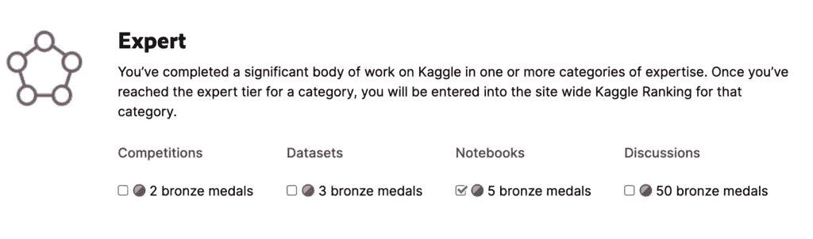
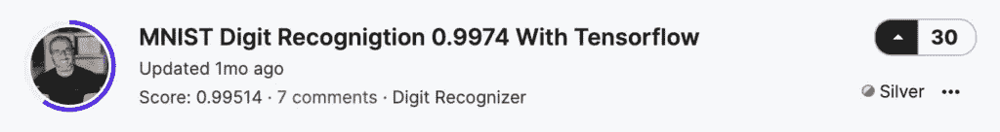
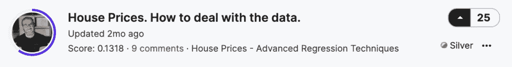
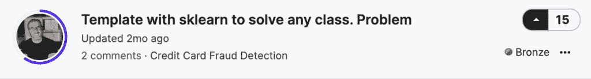
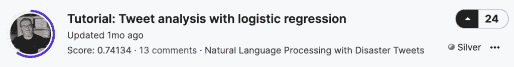
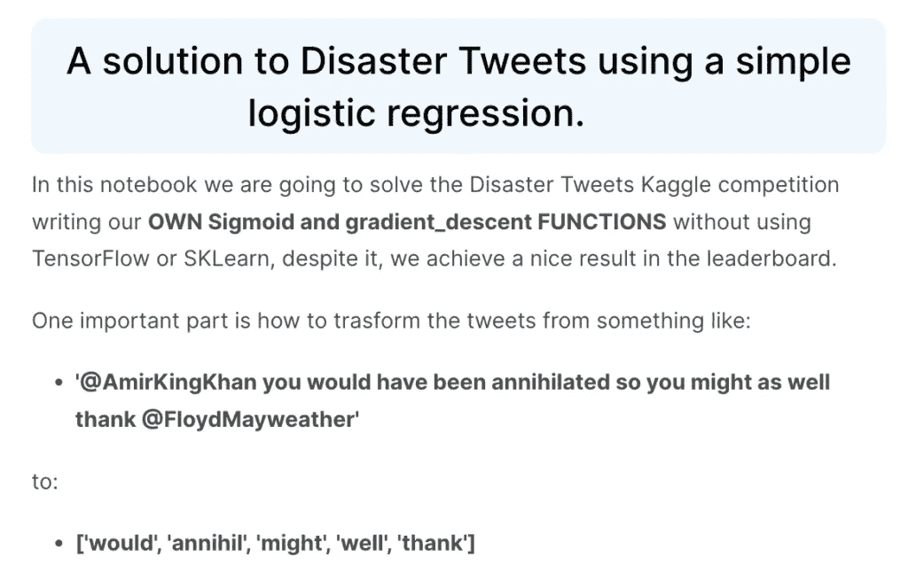
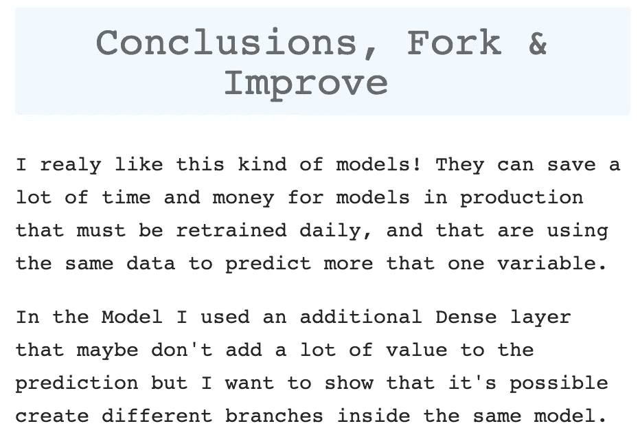
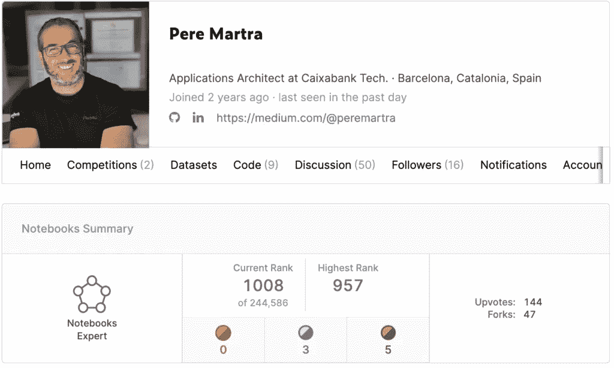

# 我的前 5 个笔记本获得 Kaggle 专家等级的 3 大技巧

> 原文：<https://pub.towardsai.net/my-top-3-tips-for-getting-kaggle-expert-rank-with-your-first-5-notebooks-b793b68885a9?source=collection_archive---------0----------------------->

## 成为 Kaggle 专家需要努力，但这是一个非常容易实现的目标。我来告诉你三个小技巧，它们对我只用五个笔记本做这件事帮助最大。


由 [sporlab](https://unsplash.com/@sporlab?utm_source=medium&utm_medium=referral) 在 [Unsplash](https://unsplash.com?utm_source=medium&utm_medium=referral) 上拍摄的照片

Kaggle 是最负盛名的数据科学竞赛网站。**在 Kaggle 上拥有良好的个人资料可以打开许多大门，**并且是展示你的数据科学解决问题技能的最佳场所之一。

卡格勒夫妇根据他们在比赛中的表现获得奖牌。但是 Kaggle 不仅仅是竞争。有四个类别可以让你进步。

*   **比赛**。可能是 Kaggle 内部最负盛名的类别。根据你参加的比赛结果，你可以获得奖牌。
*   **数据集**。数据科学家可以发布他们的数据集作品。奖牌是根据其他卡格勒人的投票来颁发的。
*   **笔记本**。也许是比赛后最有声望的奖项。并非所有上传的笔记本都必须与正在进行的 Kaggle 竞赛相关联。任何笔记本都可以获得社区的投票。与数据集的情况一样，获得的投票越多，奖牌的质量越高，排名也越高。
*   **讨论**。它是所有类别中声望最低的。针对 Kaggle 平台上的评论获得投票。

在每个类别中，你可以选择 5 个等级:新手、贡献者、专家、大师和大师。

两个初始排名真的很容易获得。比方说，通过填写个人资料，与社区进行一些互动，并发布一份工作，您已经达到了贡献者级别。但是获得专家等级需要努力，这是必须通过获得奖牌获得的第一个等级。

在本文中，**我将讨论如何在笔记本类别**中获得专家等级，这可能是比赛后最有声望的等级。

# 在 Kaggle 上要达到笔记本类别的专家等级需要什么条件？

非常容易！我们需要获得至少五枚铜牌。要获得奖牌，我们必须获得比新手更高级别的卡格勒人的五票。事实是，这看起来很简单，但我们必须考虑到，Kaggle 中只有 1/20 的笔记本获得 2 票以上。我们将尝试在 100%的笔记本上收到来自卡格勒的 5 张以上的投票。



作者图片

在图中，我们可以看到每个类别的要求。如你所见，我只有笔记本类的支票。所以，我只能算是那一类的专家。

拥有更多经验或更专注于 Kaggle 的数据科学家可以在更多类别中获得专家的排名。与通常所说的 Kaggle 专家* **n** 。被认为是专家的种类的数量。

竞赛是最负盛名的类别，其次是笔记本和数据集，最后是讨论。

# 我的前五本笔记本。

[](https://www.kaggle.com/code/peremartramanonellas/mnist-digit-recognigtion-0-9974-with-tensorflow)

这是我的第一个笔记本。目前，他获得了一枚银牌。从排名高于新手的 Kagglers 获得超过 20 票的奖励。

我打算用自己设计的模型在 MNIST 竞赛中获得最高分。在笔记本中，有一些不常用的技巧。例如，我没有使用 Dropout 层，而是使用了 SpatialDropout。我还努力使用回调函数，试图获得尽可能高的分数。**最重要的是，笔记本解释了使用每种技术的原因**。

[](https://www.kaggle.com/code/peremartramanonellas/house-prices-how-to-deal-with-the-data)

第二本笔记本现在也有了银牌。和上一个一样，它也是 Kaggle 基础比赛的一部分。这次的方法完全不同。我 100%地关注数据转换，并一步一步地解释每个修改的原因。

使用的模型是 SciKit 库中的回归模型。我没有和他浪费时间。我可以说，大部分工作都投入到数据处理和图形生成中，以理解数据及其转换。

此外，我试图用变量定制一些函数。以便其他 Kagglers 可以玩这个笔记本，并通过改变这些值来测试它是如何工作的。

[](https://www.kaggle.com/code/peremartramanonellas/template-with-sklearn-to-solve-any-class-problem)

这台笔记本没有参加任何比赛。但我使用了一个最著名的 Kaggle 数据集:信用卡欺诈检测。

这只是使用 SciKit Learn 库的一个实验，在这个实验中，我试图创建一个能够自己修改数据的函数。在没有数据科学家参与的情况下，应用算法以获得良好的性能。

这本笔记本比我预期的更受欢迎。

[](https://www.kaggle.com/code/peremartramanonellas/tutorial-tweet-analysis-with-logistic-regression)

这个笔记本也是基本竞赛的一部分。这是一个笔记本，它得到了这么多的投票，真的让我很惊讶。现在，它获得了银牌。在其中，我并没有试图得到一个好的分数，相反，**我手动生成了一个简单的逻辑回归模型**。它旨在作为学习如何手动创建简单模型的简单指南。

[](https://www.kaggle.com/code/peremartramanonellas/guide-tweet-analysis-with-transfer-learning)

通过参加与前一款笔记本相同的比赛并取得更好的成绩，该笔记本获得的票数少得多。起初这让我很惊讶，但后来，在浏览了其他竞争对手的笔记本后，我可以说这款笔记本贡献很小。**这只是使用迁移学习解决竞争的又一个笔记本**。

确实，所用的模型不是最广泛使用的模型之一，我试图把它作为迁移学习的基本方法。不过，幸运的是，他获得了一枚铜牌，**,这使我在笔记本类别中上升到了 Kaggle 专家级别。我的前五本笔记本。**

# 要遵循的三个技巧。

现在我在卡格尔又有了一些笔记本，其中只有一本没有奖章。我有一些想法，笔记本应该有什么，以获得奖牌或获得最多的选票。

## 提示 1:注意表达。

这真的是第一个提示吗？是的，它是！Kaggle 上有很多笔记本。**某人给你超过五秒钟的时间可能取决于他们的第一印象这样简单的事情。如果我进入一个笔记本，看到 Kaggle 默认放在开头的短语，我通常不会看得太远就出去了。**



作者图片

我的陈述并不精彩。我是一名开发人员，如你所知，我们不太擅长组合颜色或形状。但是我试着用高亮显示标题和不同的字体。

为此，我使用了一个藏在笔记本里的电池。该单元格包含修改表示的 HTML 代码。

```
from IPython.core.display import HTML
HTML("""
<style>
.output_png {
    display: table-cell;
    text-align: center;
    vertical-align: middle;
    horizontal-align: middle;
}
h1 {
    text-align: center;
    background-color: Blue;
    padding: 20px;
    margin: 2;
    font-family: monospace;
    color:DimGray;
    border-radius: 20px
}

h2 {
    text-align: center;
    background-color: Red;
    padding: 20px;
    margin: 0;
    font-family: monospace;
    color:DimGray;
    border-radius: 20px
}

h3 {
    text-align: center;
    background-color: Green;
    padding: 15px;
    margin: 0;
    font-family: monospace;
    color:DimGray;
    border-radius: 15px
}

body, p {
    font-family: monospace;
    font-size: 15px;
    color: charcoal;
}
div {
    font-size: 14px;
    margin: 0;

}

h4 {
    padding: 0px;
    margin: 0;
    font-family: monospace;
    color: purple;
}
</style>
""")
```

我把代码留给你，但我想让你知道我已经做了一些改动，这样你的笔记本看起来可能和我的不同。

## 技巧二。带点不一样的或者有用的。

对我来说效果最好的笔记本是那些我不仅尝试做一些不同的事情，而且解释了原因的笔记本。我认为，如果有人在你的笔记本里学到了一些东西，他们更有可能会投赞成票，因为他们很感激。

在 MNIST 笔记本中，我展示了多个回调函数和 SpatialDropout 层。它并不是真正的高级知识，但它是许多正在开始使用 TensorFlow 的人可能不知道的知识。

在《房价笔记本》中，我解释了每一种数据转换技术，事实是有很多。我确信它是在这方面有更多解释的笔记本之一。

也许最好的例子是笔记本电脑，它通过创建逻辑回归模型来分析推文的情绪。这不是一个闪亮的笔记本，远远不是。你不会有很好的表现。但它几乎是独一无二的。它教导了一种与通常不同的处理问题的方法，并且教导了如何从头开始创建一个模型。

得票最少的笔记本是基于迁移学习的笔记本，真的，从远处看，它是最正常的笔记本。许多笔记本可以找到使用相同的技术。

## 技巧三。以结论结束笔记本。

在每本笔记本的末尾，我都会附上一部分结论。试图以总结所获得的和所看到的来结束它。



不仅如此，在大多数博客中，我鼓励人们发表意见，告诉他们如何改进笔记本，这样他们就可以试用了。

这同样适用于提及或灵感。我总是试图指出我为创作笔记本而查阅过的其他笔记本或文章。

# 就这些吗？

对我来说，这是我能给出的三条最重要的建议。有些人致力于在评论中要求投票，我相信他们的策略会成功。但是我觉得不值得。

最好在我们的笔记本上多花点心思，这样内容才会有趣，而且解释得很清楚。一个只有精彩代码，却没有任何解释的笔记本，可能在竞争中表现得很好，但在笔记本类别中会有一段艰难的时间，因为你依赖于其他人的投票。

最后一条建议是**和 Kaggle 玩得开心！**不要挂在奖牌上，用 Kaggle 学习。

我希望我们能在那里见到你！**不要犹豫，通过 Kaggle 联系我，或者在评论中，我将很高兴访问您的笔记本！**

[](https://www.kaggle.com/peremartramanonellas/notebooks)

作者图片

我定期写张量流和机器学习。**考虑** [**在媒体**](https://medium.com/subscribe/@peremartra) **上关注我，获取关于新文章的更新。**当然，欢迎你在 [LinkedIn](https://www.linkedin.com/in/pere-martra-0310631/) 上与我联系。

如果你喜欢 TensorFlow，想了解一些有趣的技巧，可以查看我的系列:TensorFlow Beyond The Basics。


[佩雷·马特拉](https://medium.com/@peremartra?source=post_page-----b793b68885a9--------------------------------)

## 张量流超越基础

[View list](https://medium.com/@peremartra/list/tensorflow-beyond-the-basics-24c4c6a844d8?source=post_page-----b793b68885a9--------------------------------)3 stories