# 我的 VS 代码设置使用精益在本地构建算法交易策略的原型

> 原文：<https://pub.towardsai.net/my-vs-code-setup-to-prototype-algorithmic-trading-strategies-locally-using-lean-f069e0435353?source=collection_archive---------0----------------------->

## [软件工程](https://towardsai.net/p/category/software-engineering)

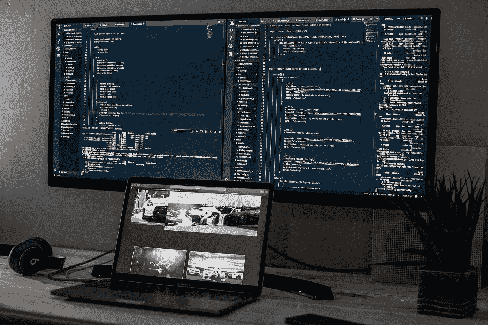

约书亚·阿拉贡在 [Unsplash](https://unsplash.com?utm_source=medium&utm_medium=referral) 上的照片

# 介绍

这篇文章描述了我的 [VS 代码](https://code.visualstudio.com/)设置的文档，该设置使用 QuantConnect 的 [LEAN](https://github.com/quantconnect/lean) 引擎在本地机器上开发算法交易策略。这是使用 [QuantConnect Lean CLI](https://github.com/QuantConnect/lean-cli) 工具的替代方法。

重现本文所述结果的所有代码和脚本都可以在 [this](https://github.com/hsm207/lean/tree/dev) repo 中找到。

本文将首先描述创建设置的先决条件，然后是实际创建设置的步骤。然后，它将遍历 3 个使用示例，即:回溯测试算法、调试算法和运行研究笔记本。最后，我们将讨论这种设置的利与弊。

注意，尽管 LEAN 支持 C#，但这种设置只关注 Python 中算法交易策略的原型。

# 先决条件

您需要安装以下工具:

1.  Visual Studio 代码
2.  [码头工人](https://www.docker.com/get-started)

你还需要一份精益源代码的本地副本，你可以从[这里](https://github.com/quantconnect/lean)克隆/派生。

# 设置

## 概观

该设置分为 5 个步骤。其背后的想法是有一个容器，我们可以从其中构建和运行精益，并依靠 VS 代码来运行常见的任务，例如调试算法，启动研究笔记本等。

## 步骤 1:为设置创建一个单独的分支

这个设置需要添加和修改一些文件，所以我们将从`master` 创建一个名为`dev`的分支，这样我们就可以继续从上游获取关于`master`的最新更新，而不会出现任何问题。

## 步骤 2:创建一个开发容器

我们将需要一个包含所有必要依赖项的容器来构建和运行精益。

在项目根目录下创建一个名为`dev.Dockerfile`的文件，内容如下:

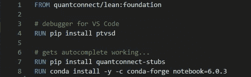

图 1:构建和运行精益的 Dockerfile 文件

接下来，告诉 VS 代码在由`dev.Dockerfile`定义的容器中重新打开项目。见[这里](https://code.visualstudio.com/docs/remote/containers#_quick-start-try-a-development-container)关于如何做的细节。下面截图供参考:

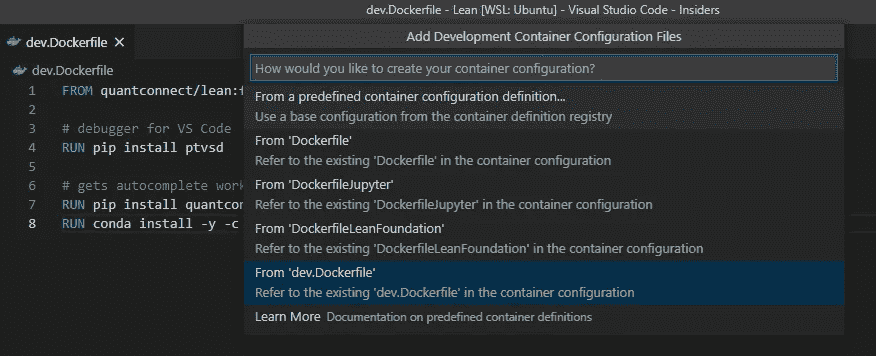

图 2:使用命令面板在 dev 中重新打开项目。Dockerfile 文件

## 第三步:建立精益

现在我们已经进入了容器，我们可以使用以下命令来构建精益:

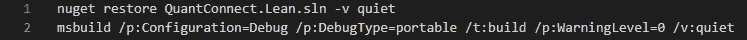

图 3:构建精益的命令

## 步骤 4:创建运行研究笔记本的脚本

本文中的研究笔记本是指在 JupyterLab 上运行的常规 Jupyter 笔记本，其中安装了用于定量分析的所有通用库。

您可能希望通过 Lean API 获取数据进行分析，但是在这之前，您需要完成一些步骤来配置 Python，以便它可以通过。NET 公共语言运行库，因为 Lean 是用 C#编写的。

因此，在项目目录中创建一个名为`run_research.sh`的脚本来执行这些步骤。脚本很长，所以我不会在本文中展示它。你可以在这里查看完整的脚本。它是基于 Lean 的 [Dockerfile](https://github.com/hsm207/Lean/blob/dev/DockerfileJupyter) 发布的研究笔记本。

## 步骤 5:创建 VS 代码任务来运行常见任务

在终端中键入命令来运行研究笔记本很麻烦，所以让我们在`.vscode/tasks.json`文件中添加一个任务来自动化这个过程:

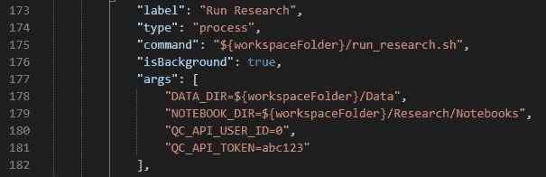

图 5:启动研究笔记本的任务

图 5 创建了一个名为“Run Research”的任务，它调用我们在上一步中创建的`run_research.sh`脚本。它还定义了环境变量来告诉 Lean 从哪里读取数据(DATA_DIR)以及笔记本存储在哪里(NOTEBOOK_DIR)。只要可以从容器内部访问，就可以将这些目录更改为指向任何位置。如果您计划与 [QuantConnect Web API](https://www.quantconnect.com/lean/docs#topic100.html) 进行交互，则需要 QC_API_USER_ID 和 QC_API_TOKEN。

类似地，我们也可以创建一个任务来对算法进行回溯测试，如下所示:

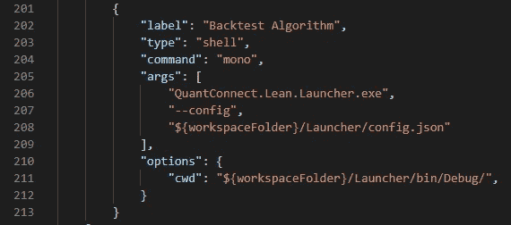

图 6:回溯测试算法的任务

# 使用

## 回溯测试算法

假设我们在名为`SillyAlgorithm.py`的文件中编写了以下算法，并在`/tmp/secret_algo`将它保存在容器中的**:**

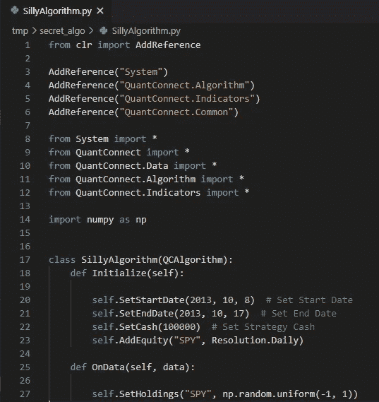

图 7:一个愚蠢的算法

图 7 中的算法简单地基于每天随机变化的目标持仓量每天买卖 SPY。

为了回测这个算法，我们需要修改 Lean 的`Launcher`目录中的`config.json`文件，告诉它我们想要回测一个 Pyhton 算法，以及在哪里可以找到这个算法的代码。`config.json`文件中需要更新的相关部分如下:

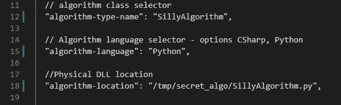

图 8:更新 Launcher/config.json 以回溯测试 SillyAlgorithm

然后，为了运行回溯测试，我们可以使用命令面板来执行`Tasks: Run Task`命令并选择`Backtest Algorithm`任务:

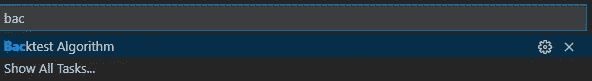

图 9:从命令面板启动“回溯测试算法”任务

## 调试算法

假设我们想调试我们在图 7 中编写的算法，当它在第 27 行时。

我们通过在相关行设置断点来开始调试过程:

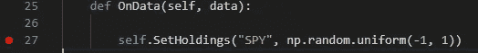

图 10:在 SillyAlgorithm.py 的第 27 行设置断点

接下来，我们修改`/Launcher/config.json`,告诉它用 VS 代码在调试模式下运行回溯测试:

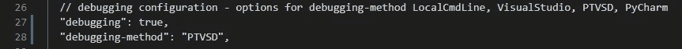

图 11:如何在调试模式下运行回溯测试并在 VS 代码中进行调试

然后，我们像以前一样运行`Backtest Algorithm`任务。如果您注意运行任务的终端，您会注意到它会暂停，并显示消息`waiting for PTVSD debugger to attach at localhost:5678...`:

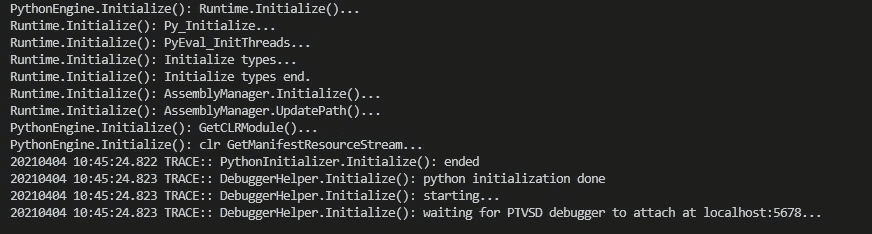

图 12:回溯测试在继续之前正在等待来自调试器的连接

这提示您转到`Run and Debug`面板并执行`Attach to Python (Local)`配置:

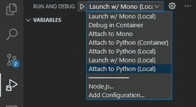

图 13:找到“附加到 Python(本地)”配置

启动此配置将导致回测恢复其操作，并最终在指定的断点处暂停:

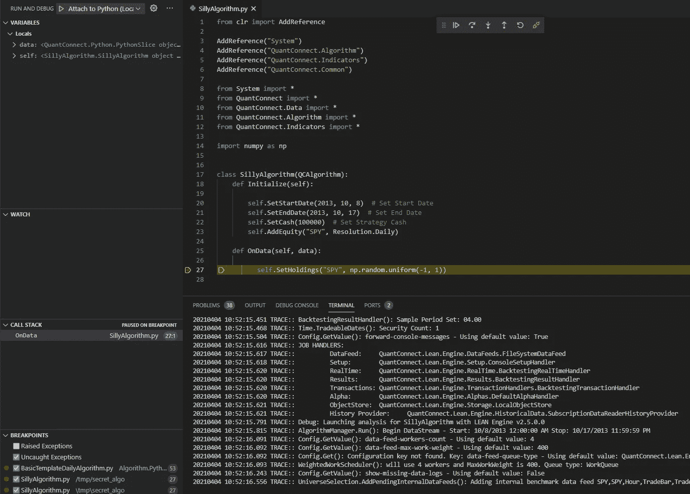

图 14:在断点处暂停的回溯测试

## 启动研究环境

启动研究环境就像启动`Run Research`任务一样简单。该任务最终将在容器内部的端口 8889 上启动一个 JupyterLab 服务器，并自动对该端口进行端口转发，以便可以从本地主机访问它。当一切准备就绪时，您将从 VS 代码中得到一个“在浏览器中打开”的提示:

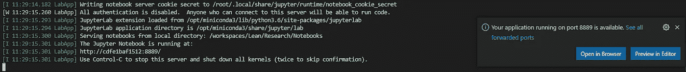

图 15:“运行研究”任务的成功启动

# 利弊

## 赞成的意见

这种设置有 3 个好处:

1.  **完全控制已安装的库。**你可以更新`dev.Dockerfile`文件来安装/升级任何你需要的库来开发你的交易算法。在回溯测试和研究环境中都可以使用同一套库。使用精益 CLI 实现这一点并不那么直接，因为它需要不同的容器来进行回溯测试和研究，并且您无法控制它们。
2.  **减少对官方发布的依赖。**假设您遇到了一个 bug，或者有一个功能请求已经有一个 PR 正在等待审查。审查过程可能需要一段时间，但通过这种设置，您不需要等待它被合并到 master 中，因为您可以简单地将 PR 合并到您的本地 Lean 副本中，然后重新构建它以享受 bugfix 或功能。
3.  **更容易调试和贡献代码。**现在有了源代码，研究意外行为或 bug 的根本原因并反馈给社区就更方便了！

## 骗局

到目前为止，我遇到的主要问题是与`master` 分支保持同步具有挑战性。

我最初认为我可以通过从上游拉然后与`dev`合并来更新我的本地`master`。但是合并步骤经常引起合并冲突，我自己解决它们并不有趣。我发现更新`master`并重复设置步骤后，重新创建`dev`分支更容易。

这种设置的另一个问题是初始设置步骤不是一次性的。随着引擎随着时间的推移发展新的特性或架构，您将不得不偶尔修改一些脚本和命令。

例如，在我的一个笔记本意外损坏后，我在`run_research.sh`脚本中添加了以下几行:

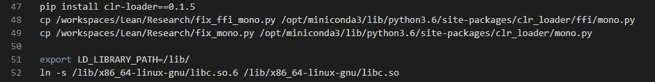

图 16:修复损坏的笔记本的热修复程序

我通过研究自从我上次更新我的本地`master` 分支以来对`DockerfileJupyter`文件的更新，得出了这个解决方案。

# 结论

本文描述了我在本地使用精益引擎开发算法交易策略时所遵循的设置。如果你知道一个更有效的设置，并且仍然保留了上述优点，请在评论中告诉我。