# 我的 VS 代码设置原型 Rasa 聊天机器人

> 原文：<https://pub.towardsai.net/my-vs-code-setup-to-prototype-rasa-chatbots-2993062de90?source=collection_archive---------2----------------------->

## [编程](https://towardsai.net/p/category/programming)

## 一些简化开发工作流程的 VS 代码特性

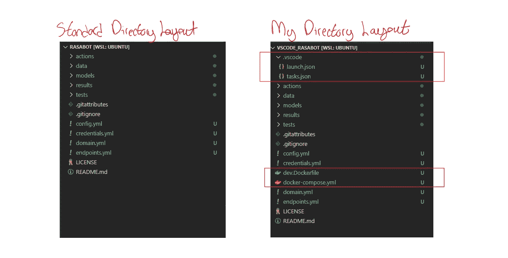

# 介绍

在这篇文章中，我将分享我使用 [Rasa](https://rasa.com/) 框架创建对话式人工智能代理的工作流程。它使用 VS Code 和 Docker 以一种与操作系统无关的方式自动化重复的任务和代码。

重现结果的代码可以在[这里](https://github.com/hsm207/vscode_rasabot)找到。

我假设读者对 Rasa 和 Docker 有基本的了解。

# 先决条件

您需要安装以下软件才能继续操作:

*   [VS 代码](https://code.visualstudio.com/)
*   [Docker 撰写](https://docs.docker.com/compose/install/)

# 设置

## 概观

基于 Rasa 框架的聊天机器人原型围绕 3 个不同的任务:

*   编写(和调试)自定义操作
*   训练模型以执行 NLU 和对话管理
*   与机器人聊天以验证正确性

该工作流的目标是让开发人员能够轻松地在这三个任务之间进行切换。这将涉及设置以下内容:

1.  创建操作服务器
2.  定义所需的服务
3.  创建新的 Rasa 项目
4.  为自定义操作设置调试基础结构。

## 步骤 1:创建操作服务器

首先，我们需要定义一个我们的动作服务器将在其中运行的环境。这个环境将包含运行动作服务器的代码以及我们的自定义动作将需要的任何依赖项。

例如，我们可以在名为`dev.Dockerfile`的文件中编写以下内容:

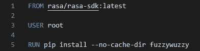

图 1:动作服务器的环境

图 1 显示我们将使用`rasa-sdk`作为我们的动作服务器，并安装 [fuzzywuzzy](https://pypi.org/project/fuzzywuzzy/) 库作为依赖项(用于处理错别字)。

编写自定义动作将涉及大量的编码和测试，因此我们应该安装一些库来使我们的生活更容易，并应用软件工程最佳实践。例如:

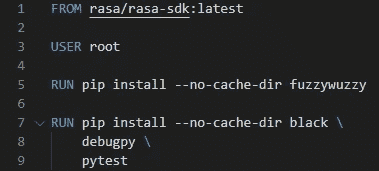

图 2:带有用于开发的有用库的 Action server 环境

有兴趣的读者可以看看 [black](https://pypi.org/project/black/) 、 [debugby、](https://pypi.org/project/debugpy/)和 [pytest](https://pypi.org/project/pytest/) 库是做什么的。

## 步骤 2:定义所需的服务

一个正常运行的 bot 至少需要一个 rasa 服务器来托管 bot，还需要一个操作服务器来运行自定义操作。

出于原型的目的，我们可以在`docker-compose.yml`中定义以下服务:

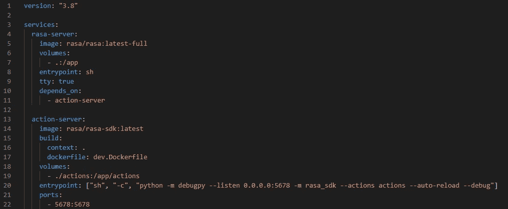

图 3:机器人将需要的服务

图 3 定义了一个名为`rasa-server`的服务，它什么也不做，但是拥有托管机器人所需的所有依赖关系。它还定义了一个名为`action-server`的服务，在调试模式下启动一个动作服务器。

## 步骤 3:创建新的 Rasa 项目

要创建一个新的 Rasa 项目，我们首先需要启动我们在上一步中定义的服务。

我们可以打开一个终端并执行`docker-compose up`，但是更方便的方法是使用 VS Code 的[命令面板](https://code.visualstudio.com/docs/getstarted/userinterface#_command-palette):

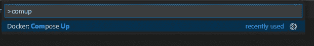

图 4:使用命令面板启动 bot

然后，在终端中，我们执行:

`docker-compose exec rasa-server rasa init`

创建新项目。

## 步骤 4:为自定义操作设置调试基础结构

这一步包括创建一个[启动配置](https://code.visualstudio.com/Docs/editor/debugging#_launch-configurations)来启动一个将连接到动作服务器的进程。

为此，只需在项目的根文件夹中的目录下创建一个名为`launch.json`的文件。

`launch.json`的内容应该是这样的:

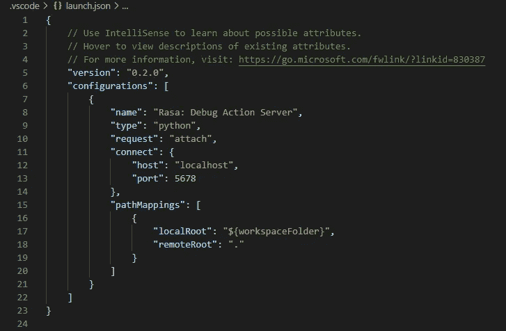

图 4:启动配置以调试动作服务器

# 一些快捷方式

根据上一节中的步骤 3，应该很清楚您可以通过在终端中执行来使用 [Rasa CLI](https://rasa.com/docs/rasa/command-line-interface/) :

`docker-compose exec rasa-server rasa <command>`

其中`<command>`是 CLI 支持的任何命令。

但是打开一个终端并输入如此长的命令是令人厌烦的，尤其是当我们想要重复做这件事的时候，例如，训练机器人，与机器人聊天，验证数据集等等。

这个问题的解决方案是通过在`.vscode`目录中创建一个`tasks.json`文件来创建一个 [VS 代码任务](https://code.visualstudio.com/Docs/editor/tasks)，该文件将包含我们计划频繁执行的任务。

例如:

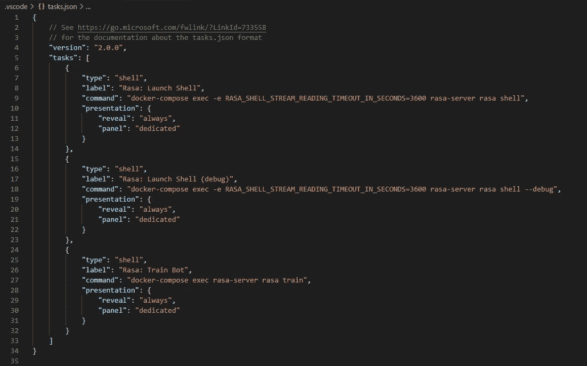

图 5:一个`tasks.json` 文件的样本内容

图 5 定义了 3 个任务，即:

1.  `Rasa: Launch Shell`哪个执行`rasa shell`
2.  `Rasa: Launch Shell (debug)`它也启动 rasa shell，但是设置了`--debug`标志
3.  `Rasa: Train Bot`执行`rasa train`

现在我们可以利用命令面板来启动在`tasks.json`中定义的任何任务。

例如，为了训练机器人，我们首先使用命令面板来调用`Task: Run Task`命令:

图 6:在 VS 代码中执行任务

然后，我们开始从我们打算执行的任务名称中键入几个字符，即`Rasa: Train Bot`，以快速缩小可用任务的列表。

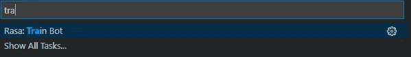

图 7:找到我们想要执行的任务

# 示例工作流

本节将描述以下工作流程:

*   编写自定义操作。
*   调试自定义操作

## 编写自定义操作

编写自定义动作的第一步是调用命令面板来附加到包含`action-server`的容器:

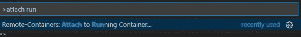

图 8a:启动“附加到运行容器”命令

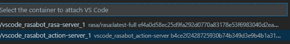

图 8b:连接到动作服务器

连接后，打开`/app/actions`文件夹。

最后，安装 [Python 扩展](https://code.visualstudio.com/docs/languages/python#_install-python-and-the-python-extension)。

现在，您已经能够在 VS 代码的完全支持下编写 Python 代码，例如林挺、自动完成、运行单元测试等。

## 调试自定义操作

假设我们有一个错误的自定义操作，我们希望实时了解该操作的状态，以找出错误的来源。

为了简单起见，我们将使用`rasa init`附带的默认定制动作。我们只需要在`actions.py`文件中取消对它的注释:

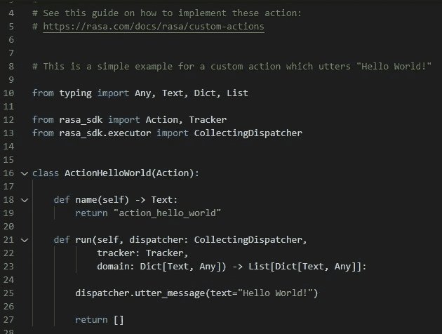

图 actions.py 中的默认定制动作

我们需要让这个动作能被机器人发现。这包括编辑以下文件:

*   endpoints.yml
*   domain.yml

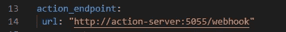

图 10:endpoints . yml 中的配置更新

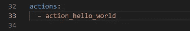

图 11:domain . yml 中的配置更新

我们还需要一个能引发行动的故事。为了简单起见，我们将定义一个规则，当用户向机器人告别时，该操作将在该规则中运行(只需编辑`rules.yml`中的一个预定义规则):

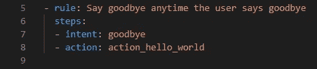

图 12:规则更新规则

我们现在准备开始调试过程。

首先，启动我们在步骤 4 中定义的`Rasa: Debug Action Server`配置。一种方法是使用命令面板启动`Debug: Select and Start Debugging`命令并选择`Rasa: Debug Action Server`:

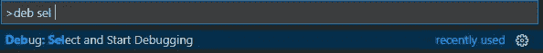

图 13a:启动调试配置

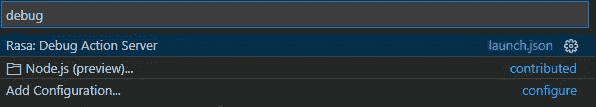

图 13b:选择调试动作服务器的配置

接下来，在自定义操作中插入一个断点:

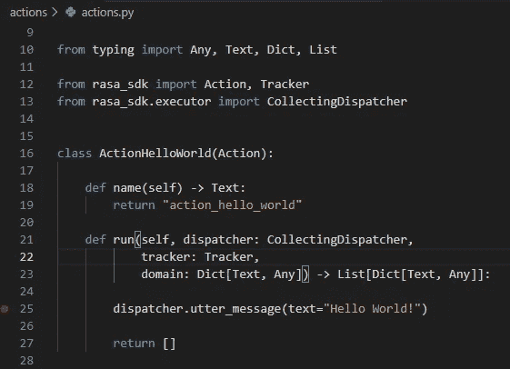

图 14:在 actions.py 的第 25 行插入一个断点

此时，如果您启动 rasa shell 并发出“bye ”,将执行`action_hello_world`动作，VS 代码将在第 25 行暂停执行:

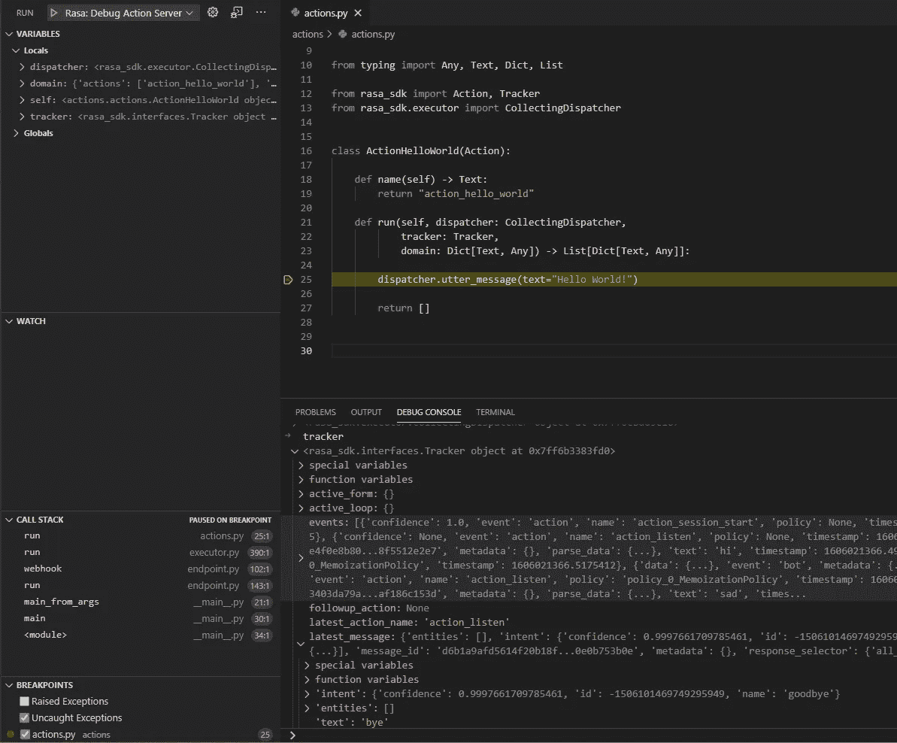

图 15: action_hello_world 在第 25 行暂停

我们现在可以自由地检查环境(例如，查看调用堆栈和变量 pan)并使用调试控制台执行任意 Python 代码。

# 清理

当你完成一天的工作时，记得从命令面板调用`docker-compose down`:

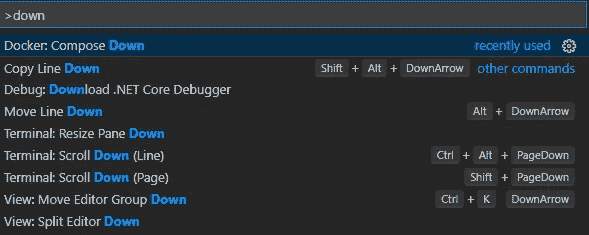

图 16:停止所有容器

# 利益

这种设置的两个主要优点是:

1.  **机器独立性** —使用 VS 代码在本地或远程机器上开发代码(通过 SSH 或附加到远程容器)是很简单的。当你需要远程训练机器人时，这很方便，例如，使用云 GPU。
2.  **易于部署**—`docker-compose.yml`文件可以作为您的 DevOps 同事的蓝图，帮助他们了解如何在他们的定制基础架构上部署 bot 并与他们的 CI/CD 管道集成。

# 结论

本文描述了我使用 VS 代码和 Docker 容器构建 Rasa 聊天机器人原型的工作流程。希望你觉得有用。

如果你发现了进一步自动化的空间，请在评论中告诉我。