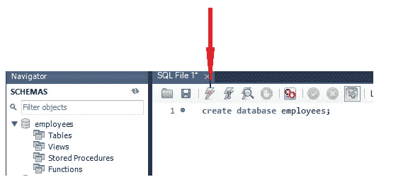
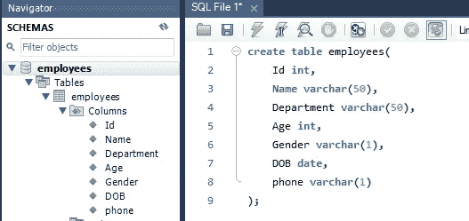

# MySQL:零到英雄，包含所有主题的语法

> 原文：<https://pub.towardsai.net/mysql-zero-to-hero-with-syntax-of-all-topics-92e700762c7b?source=collection_archive---------1----------------------->

## [编程](https://towardsai.net/p/category/programming)

## 数据库查询语言手册


[国立癌症研究所](https://unsplash.com/@nci?utm_source=medium&utm_medium=referral)在 [Unsplash](https://unsplash.com?utm_source=medium&utm_medium=referral) 上拍摄的照片

大家都在做数据，但是很多都不知道 MySQL，它是一个数据库管理系统。数据库是数据的集合，我们在其中存储数据，并且可以通过其他来源方便地访问。

**第一部分:** MySQL 安装链接

**第二节:**创建数据库、表格和插入数据

**第 3 节:**MySQL 中的语句和操作符

**第四节:**正则表达式和命令

**第五节:**加入

**第 6 节:**字符串和日期/时间函数

[](https://medium.com/towards-artificial-intelligence/python-zero-to-hero-with-examples-c7a5dedb968b) [## Python:从零到英雄(带示例)

### python 初学者手册指南

medium.com](https://medium.com/towards-artificial-intelligence/python-zero-to-hero-with-examples-c7a5dedb968b) 

# 第一节:

## 安装链接

对于 MySQL 实践，请从这里下载 MySQL workbench:

链接: [MySQL 工作台](https://dev.mysql.com/downloads/installer/)

# 第二节:

## 创建数据库

使用如下所示的命令在 MySQL 中创建数据库:

```
create database employees;
```

使用这个命令，我们可以创建一个数据库，然后在数据库中创建表。每一个命令之后我们都要通过执行命令来执行它们，也就是说，照片中是一个闪电符号。



正在创建数据库。作者照片

执行之后，我们刷新左侧的模式，我们看到新创建的数据库中有雇员的姓名。在数据库内部，我们必须创建作为主要目标的表。

## 创建表格

我们必须创建一个带有列名的表，在这个表中，我们以不同数据类型的行和列的形式写入信息/记录。

为了创建表，我们考虑表名、列名及其数据类型。创建表格的命令。

```
create table_name(
                  col_name1 datatype,
                  col_name2 datatype,
                  .
                  .
                  );
```

示例:

```
create table employees(
    Id int,
    Name varchar(50),      # upto 50 characters
    Department varchar(50),
    Age int,
    Gender varchar(1),
    DOB date,
    phone varchar(14)
);
```



表列名视图。作者照片

## 在名为 employees 的表中插入数据

句法

```
insert into table_name( col1, col2, ....)
values(value1, value2, ...);
```

示例:

```
insert into employees(Id, Name, Department, Age, Gender, DOB, phone)
values(1, "Amit", "R&D", 25, "M", "2000-1-1","363463625");
```

为了插入多行，可以在查询中添加更多的值。

# 第三节:

## 声明

插入数据后，下一阶段通过 SELECT 命令查看不同的表数据。如果我们想看到一些列名，那么只写那些列名，如果我们想看到表中的所有列名，那么我们用星号(*)代替列名。

```
select Id, Name, Gender
from employees;orselect *
from employees;
```

如果我们想给出列名的别名，那么我们在命令中使用‘AS’。

```
select Id as Roll_number, Name as Person_name
from employees;
```

WHERE 子句用于查看条件数据，假设如果我们只想查看年龄超过 25 岁的雇员的信息，等等。

```
select col1, clo2, ...
from table_name
where condition;
```

## 经营者

**和运算符**

这两个条件都必须为真，才能从表中获得正确的信息。

```
select col1, clo2, ...
from table_name
where condition1 AND condition2;
```

**OR 运算符**

至少其中一个条件应该为真。

```
select col1, clo2, ...
from table_name
where condition1 OR condition2;
```

**不算符**

在这个运算符中，结果不会显示使用 NOT 运算符的结果。

```
select col1, clo2, ...
from table_name
where NOT condition1 OR condition2;
```

**换操作员**

当我们使用 AND 或 OR 操作符时，查询变得有点长，所以我们使用 IN 操作符。

```
select col1, clo2, ...
from table_name
where Age = 18 or Age = 21;# with IN operator
select col1, clo2, ...
from table_name
where Age IN(18,21);
```

**间运算符**

该运算符用于查找两个条件跨度之间的数据。

```
select col1, clo2, ...
from table_name
where col_name BETWEEN value1 AND value2;
```

[](https://medium.com/towards-artificial-intelligence/nlp-zero-to-hero-with-python-2df6fcebff6e) [## NLP——使用 Python 从零到英雄

### 学习自然语言处理基本概念的手册

medium.com](https://medium.com/towards-artificial-intelligence/nlp-zero-to-hero-with-python-2df6fcebff6e) 

# **第四节:**

## 正则表达式

正则表达式用于在一些模式的帮助下寻找表达式。

示例:

```
select col1, clo2, ...
from table_name
where col_name REGEXP pattern; or
where col_name REGEXP 'Am';
```

当我们编写模式' Am '时，它将显示该列中的所有记录。还有各种其他模式风格。

```
'Am' - search this pattern anywhere in the expression.
'^Am' - search expression starting from 'Am'.
'it$' - dollar sign search expression ending with 'it'.
'Amit|Singh|Kumar' - searching multiple expressions.
'[AT]' - search A and T in all records
```

## 命令

**排序依据**

这个命令为我们提供了一个按升序和降序排序的记录。

```
select col1, clo2, ...
from table_name
where col_name
ORDER BY col_name;
```

**为空**

有时，当我们创建大数据时，我们会忘记/遗漏一些条目或记录。该运算符将在数据/列中查找所有空/缺失的记录。

```
select col1, clo2, ...
from table_name
where col_name IS NULL;
```

**极限值**

假设我们有非常大的数据，当我们使用星号' * '时，我们得到所有记录，但如果我们只想看到其中的一些记录，那么我们使用 LIMIT。

```
select col1, clo2, ...
from table_name
where condition
LIMIT number;              #LIMIT 100 (to see first 100 records)
```

**更新**

有时候我们填写了不正确的数据，需要更新数据中的一些记录。然后我们对这些使用更新。

```
UPDATE col_name
SET col1 = value1, col2 = value2, ....
where condition;
```

# **第五节:**

## 连接

**主键**

主键仅用于获取唯一记录。我们也可以用 unique 关键字获得唯一的数据，但是我们只能将一列作为主键。主键没有空值。

```
create table employees(
    Id int NOT NULL AUTO_INCREMENT,
    Name varchar(50) NOT NULL,      # up to 50 characters
    Department varchar(50) NOT NULL,
    PRIMARY KEY(Id)
);
```

**外键**

外键链接两个表的主要重要工作。当另一个表中有主键时，可以使用外键。

```
create table employees(
    Id int NOT NULL AUTO_INCREMENT,
    Name varchar(50) NOT NULL,      # upto 50 characters
    Department varchar(50) NOT NULL,
    PRIMARY KEY(Id),
    FOREIGN KEY(student), REFERENCES student(Id)
);
```

**内部连接**

内部连接用于获取两个表的公共数据。

```
select columns
from table_name1
INNER JOIN table_name2
ON table1.col_name = table2.col_name;
```

**左连接**

该连接用于从一个表中查找记录，并从两个数据中获取公共数据。

```
select columns
from table_name1
LEFT JOIN table_name2
ON table1.col_name = table2.col_name;
```

**右连接**

该连接用于从一个表中查找记录，并从两个数据中获取公共数据。

```
select columns
from table_name1
RIGHT JOIN table_name2
ON table1.col_name = table2.col_name;
```

**交叉连接**

在这个联合中，我们不必使用主键和外键。交叉连接用于连接表 1 中的记录和表 2 中的所有记录。

```
SELECT columns
FROM table1
CROSS JOIN table2;
```

# **第六节:**

## 字符串函数

**上部**

它用于区分所有字符串中的每个字符。

```
SELECT UPPER(Name)
FROM employees;
```

**降低**

它用于将所有记录中的所有字母转换成小写字母。

```
SELECT LOWER(Name)
FROM employees;
```

**字符长度**

它用于计算字符串的字符数。

```
SELECT Name, LOWER(Name) as Char_length
FROM employees;
```

## 数据/时间函数

**当前日期**

它用于显示当前日期。

```
Select Current_date();
```

**系统日期**

它用于显示当前日期和时间。

```
Select SYSDATE();
```

**现在**

它的用法也和 SYSDATE 一样。

**月**

它用于从日期中找出月份。

```
Select MONTH("2020-07-02 02:21:32") as Month#output:
Month
10
```

# 结论

MySQL 查询几乎在所有好公司的许多数据库管理系统中使用。

我希望你喜欢这篇文章。通过我的 [LinkedIn](https://www.linkedin.com/in/data-scientist-95040a1ab/) 和 [twitter](https://twitter.com/amitprius) 联系我。

# 推荐文章

1.  [NLP —用 Python 从零到英雄](https://medium.com/towards-artificial-intelligence/nlp-zero-to-hero-with-python-2df6fcebff6e?sk=2231d868766e96b13d1e9d7db6064df1)

2. [Python 数据结构数据类型和对象](https://medium.com/towards-artificial-intelligence/python-data-structures-data-types-and-objects-244d0a86c3cf?sk=42f4b462499f3fc3a160b21e2c94dba6)