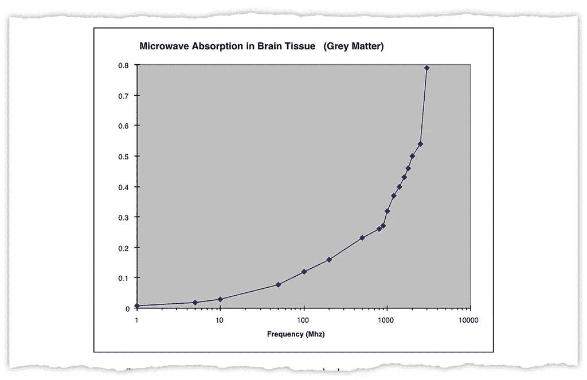
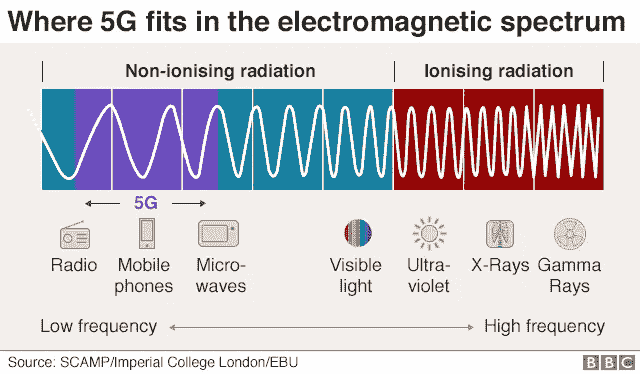
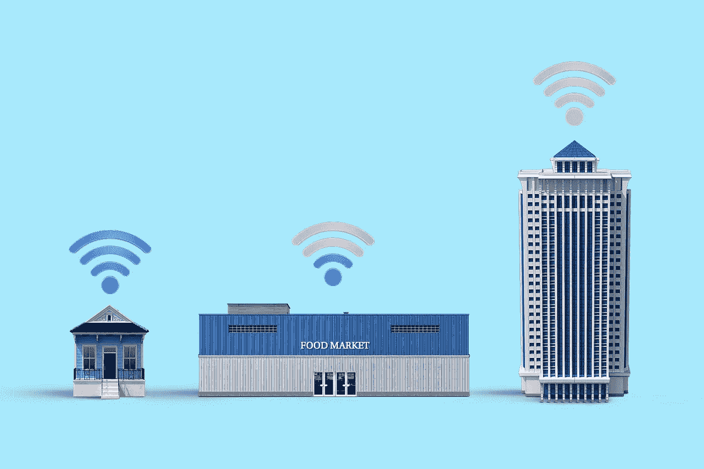
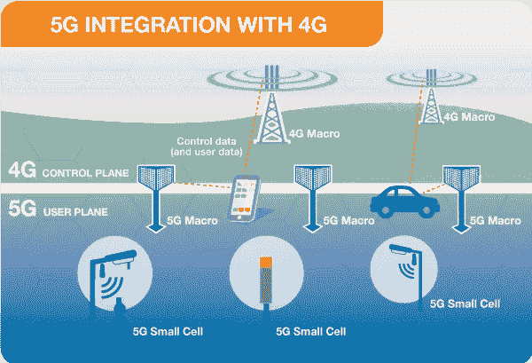
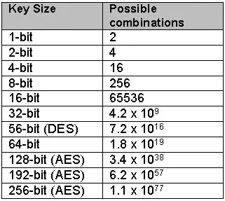
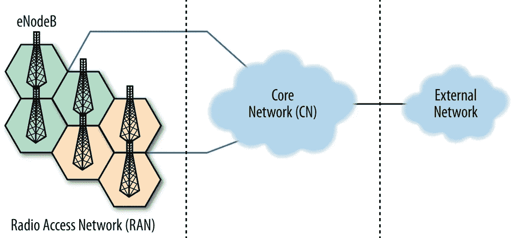

# 流言终结者 5G

> 原文：<https://pub.towardsai.net/mythbusting-5g-818338afd55?source=collection_archive---------3----------------------->

## [未来](https://towardsai.net/p/category/future)，[意见](https://towardsai.net/p/category/opinion)，[技术](https://towardsai.net/p/category/technology)

*——对激烈辩论的深思熟虑的概述*

[千斤顶单桅帆船](https://unsplash.com/@jacksloop?utm_source=unsplash&utm_medium=referral&utm_content=creditCopyText)在 [Unsplash](https://unsplash.com/s/photos/5g?utm_source=unsplash&utm_medium=referral&utm_content=creditCopyText) 上拍照

> "所有的谎言和玩笑，男人仍然听到他想听到的，而无视其余的."—保罗·西蒙

互联网上流传着最疯狂的 5G 网络阴谋。我不会占用你的宝贵时间来讨论这些问题。

大多数新闻文章和专家评论都关注 5G 社会的特定领域。这个想法是为了让你相信他们对 5G 世界的愿景。如果你花时间做一些谷歌搜索，你就会知道科学并没有对 5G 的潜在风险做出定论。

为了让你对 5G 对人类意味着什么的各种想法有一个概述，我将来自不同领域的几个专家观点分组，放在互联网上流传的三个看似毫无根据的陈述下。

这篇博文必须作为关于 5G 话题的自我探究的引子来阅读。我很清楚，如果我包含多个视角，就很难说出任何有意义的东西。但是在一个全球化的世界里，必须有人把拼图拼在一起。

在流言被打破的间隙，我会要求你反思你的立场。因为 5G 网络的实施将改变方式，我们作为一个物种思考在数字世界中对人类意味着什么。

最终，你需要在这场持续的辩论中给自己定位。所以我建议你——自学。

# 误区一。— 5G 辐射对身体有害

## 创立人

顾问兼物理学家 Bill.P. Curry 于 2000 年发表了这张图表，表明组织损伤随着无线电波频率的上升而增加。

来源:[《纽约时报》——不是 5G 的健康危害](https://www.nytimes.com/2019/07/16/science/5g-cellphones-wireless-cancer.html)

可悲的是，他未能解释人类皮肤的屏蔽作用。

据《纽约时报》的科学记者和资深作家威廉·j·布罗德说，制造恐慌的网站采用了库里的研究，并假设癌症和手机之间存在关联。除了所有涌现的阴谋之外，甚至一些诉讼也使用这个图表来提出无实质意义的主张。

## 弹开

为了详细说明，为什么 5G 对身体没有那么危险，我们必须在物理上停下来解释频率。

如果你跳到蹦床上，你会被弹回来。你的质量比蹦床垫还密。否则你会摔倒在地上。

现在想象你的皮肤是蹦床的垫子，阳光是蹦床。当阳光接触到你手臂的皮肤时，会反射到你的眼睛里。如果光被吸收了，你就看不到你的身体部位了。因此没有阳光能透过你的皮肤到达骨头。好好看看下一张图片。

来源:[BBC——5G 会带来健康风险吗？](https://www.bbc.com/news/world-europe-48616174)

根据[癌症研究者和物理学家大卫·罗伯特·格莱姆斯](https://blogs.scientificamerican.com/observations/dont-fall-prey-to-scaremongering-about-5g/)的说法，我们不应该成为 5G 危言耸听的牺牲品。将 5g 与电离辐射进行比较，电离辐射对我们的健康有害，能够破坏 DNA 并导致死亡；

> 最弱的可见光的能量是最高能量的 5G 光子的 17000 倍以上。

换句话说，5G 射线不会电离，因此理性主义者会认为 5G 不会带来任何风险。

但是这项技术还是比较新的。我们不知道将皮肤暴露在 4G 和 5G 网络频率下的长期物理影响。

## 精神后遗症

大多数活动家关注潜在的健康和环境风险，而我认为人们应该关注互联网造成的信息过载。

随着 5G 更快的上传速度和正在进行的全球化进程，我认为人们每天都会受到更多信息的轰炸。如今，我发现通过省略来区分观点、事实和谎言变得越来越困难。

> 人类是否淹没在丰富的知识中？

## 保持平衡

我相信技术没有好坏之分。我推测，如果没有 4G 网络，我们就不会有*阿拉伯之春、我也是*和 B *缺乏生命至关重要*运动。此外，数字游牧、在线自由职业、直运、增长黑客和数字营销也不会发展。平均而言，世界会变得更糟。

当然，这一数字化过程也有陷阱，比如“随时可用”的心态、FOMO、网络欺凌、烧钱、假新闻和远程黑客。没有阴影，光就不存在，反之亦然。

同样，5G 网络将拥有巨大的潜力和黑暗的底色。

## 结论

5G 辐射对健康有害的神话是部分可信的。根据科学常识，5G 的潜在物理风险往往被夸大。然而，我们缺乏低频辐射对皮肤长期影响的研究。

对于 5G 文明是如何运作的，我没有一个清晰的图像。因此，我只能假设人类无法应对信息过载。

照片由[晨酿](https://unsplash.com/@morningbrew?utm_source=unsplash&utm_medium=referral&utm_content=creditCopyText)在 [Unsplash](https://unsplash.com/s/photos/internet-of-things?utm_source=unsplash&utm_medium=referral&utm_content=creditCopyText) 拍摄

# 神话 2——5G 让 4G 过时。

## 网络功能

网络的效率取决于速度、延迟和覆盖范围。

速度是从服务器下载信息到你的手机需要的毫秒数。在 4G 网络上，平均下载速度为 10 至 50 Mbps(每秒兆比特)。

网飞推荐 25 Mbps 的 Ulta HD，但它只需要 5 Mbps 的高清流媒体。5G 的目标是达到平均最低 50Mbps。如果你使用手机网络来 Chromecast 网飞或 Amazone Prime 电视节目，你就会知道 4G 在流媒体高清方面已经非常出色了。

## 物联网

[物联网](https://www.youtube.com/watch?v=QSIPNhOiMoE)是一个网络，在这个网络中，每个对象都可以相互通信，以获得最佳效率。

在我们目前的 4G 世界中，网络的延迟或上传速度是 50 毫秒。5G 有可能将延迟降至 1 毫秒。

就上下文而言，大脑至少在 10 毫秒内处理图像，以实现物联网世界，包括自动驾驶交通、云游戏和沉浸式虚拟现实——低延迟至关重要。

## 新闻报道

高延迟网络的代价是带宽比 4g 网络短很多。通俗地说，每一百米，就需要一个新的天线。信号传不了多远。

据 [RCR 无线新闻](https://www.rcrwireless.com/20180517/5g/five-ways-kt-5g-at-the-olympics-tag6-tag99)报道，韩国 KT，2018 年庆昌冬季奥运会的网络提供商，需要 46 根天线用于 4G 基础设施，212 根用于 5G 网络。

## 不足之处

因为 5G 网络的频率比 4G 略高，所以它不能轻易穿透固体物体，如汽车、树木和墙壁。

英国议员 Geraint Davies 提出了一个反对 5G 网络的有效论点:

> 当你有实现零碳排放以减缓气候变化的雄心时，为了提高 5G 网络的效率而清除树木是荒谬的。

## 综合

由于这两种网络各有所长，5G 网络可以作为现有 4G 基础设施的延伸。大型 4G 天线连接到较小的 5G 天线，以获得两个世界的最佳效果。

来源= [emfexplained](http://www.emfexplained.info/?ID=25916)

## 结论

5G 让 4G 过时的神话被终结了。4G 和 5G 网络将继续存在，因为它们相互补充。

# 神话 3——5G 让互联网监控变得更容易

在我们深入政治之前，互联网安全有三个不同的方面:隐私法、数据加密、易受黑客攻击。

# 隐私法规

大多数隐私立法是规范性的。基本思想是保护企业利益，防止他们在分析数据后滥用洞察力。但是一些法律赋予政府监视其他国家的能力。

当你同意监视你的平民是不道德的时候，我觉得这很虚伪。尽管如此，在国家自卫的座右铭下，一个政府可能会监视外国人。

## 中国

据[拥有比较法博士学位的德勤数据顾问伊曼纽尔·珀诺-莱普莱](https://pernot-leplay.com/data-privacy-law-china-comparison-europe-usa/)**介绍，**

> **中国的数据隐私法遵循欧洲 GDPR 的所有路线，与美国不同，美国没有提供相同级别的保护，例如，允许互联网提供商在未经用户同意的情况下出售用户数据。**

**虽然中国正在加强对私人实体的数字身份的保护，他们也增加了政府对个人数据的访问，因为仍然没有针对政府入侵的重要隐私保护。**

> ***中国 2017 年的《国家情报法》规定，各机构必须“支持、配合和协作国家情报工作”，这意味着北京方面可以迫使华为等任何公司听命于它。***

## **美利坚合众国**

**Cnet 的工作人员记者 Laura Hautala 认为，当 FISA 修正案 Ac 的第 702 条在 2018 年通过国会两院和唐纳德·特朗普总统时，[棱镜](https://www.youtube.com/watch?v=JR6YyYdF8ho)和[上游](https://www.eff.org/nl/pages/upstream-prism)间谍计划被更新。**

> ***第 702 条允许司法部长和国家情报总监共同授权锁定被合理认为位于美国境外的人员，但仅限于锁定非美国人。***

**棱镜计划和上游计划旨在收集美国境外外国人的在线交流信息。Prism 直接从电子邮件提供商和视频聊天程序等互联网服务获取通信，上游接入互联网的基础设施，在通信传输过程中获取通信。**

**中国和美国都喜欢指责缺乏隐私。两人都犯有通过窃听互联网利用数字身份的罪行。**

# **加密**

**福布斯技术委员会成员 [Andy Pury](https://www.forbes.com/sites/forbestechcouncil/2019/09/23/why-5g-can-be-more-secure-than-4g/#49662fa957b2) 认为，5G 网络的 256 位漫游加密将优于目前标准的 128 位 4G 网络。**

****

**来源= [堆栈溢出](https://stackoverflow.com/questions/18847580/aes128-vs-aes256-using-bruteforce)**

## **模糊界限**

**一种担忧是，随着增强的计算能力越来越靠近网络边缘，无线接入网络(RAN)和网络核心之间的边界将开始消失。**

**核心是网络的大脑，它控制着对敏感客户数据的认证和加密。或者，RAN 是网络的胳膊和腿。**

**它是网络外部边缘的地方，在那里它接收来自智能手机和其他设备的信号，并使用手机信号塔或基站将它们传输回核心。**

****

**奥赖利**

**根据[重阅](http://www.heavyreading.com/details.asp?sku_id=3504&skuitem_itemid=1729)的说法，B2B 数字媒体平台[轻阅](https://www.lightreading.com/about-us/d/d-id/1)的研究部门“通过 5G RAN 提供服务，需要一个系统架构和核心网络。”因此，任何不包含这种分离的移动技术都不会与我们的互联网网络兼容。**

## **黑客证据**

**请放心，大多数电信运营商被建议使用[多家供应商](https://www.gartner.com/en/documents/3817866)进行加密。**

**我的一位云工程师朋友向我保证，大多数公司通过将个人数据存储在多个云数据库中来最大限度地降低黑客攻击的风险——每个数据库使用不同的 entree 密钥和另一个认证系统。即使黑客集体成功了，他们也无法将数据集与用户联系起来，反之亦然。**

# **弱点**

**对于 5G 网络的脆弱性，有很多不同的观点。因此，我将讨论三个有争议的观点。**

## **漏洞**

**参议员马克·华纳说:**

> **“任何被认为是安全的中国产品，只要升级一次固件，就有可能变成不安全的中国产品。**

**外国公司似乎更难信任，因为它们不像科技巨头脸书、谷歌和苹果那样接受年度审计。**

## **最坏的情况**

**中国政府可能会迫使华为在下一次框架更新中制作一个小后门，并利用它来窃取敏感数据，将漏洞隐藏在数千行代码之下，显而易见。**

**然后，在一些有道德的黑客组织发现安全漏洞之前，他们会在下一次更新中消除漏洞。用国际计算机科学研究所研究员 Niclas Weaver 的话来说——破坏是非常微妙的。**

## **这场比赛**

**畅销书《智人》(Homo Sapiens)的作者尤瓦尔·诺亚·哈拉里(Yuval Noah Harari)在蒂姆·费里斯的播客中说，谷歌正在努力破解如何持续预测人类行为的密码。**

**5G 网络将成为所有增长黑客、数字营销人员、心理学家、政府和机器学习公司的金矿，因为他们可以更好地分析大量数据。**

## **自我反省**

**问自己一些令人不安的问题。我们是我们所有生活经历的总和吗？如果是，人生经历是否可以量化？如果你同意，那么我们就是我们的数据吗？**

> **我们的个人数据应该像谷歌泄露的关于自私账本的视频一样为下一代服务吗？**

**[来源——马特·沙农](https://www.youtube.com/watch?v=QDVVo14A_fo)**

**我推荐你看视频，因为你需要这种独特的视角来理解接下来的段落。**

**哺乳动物具有教导后代认识世界的进化优势，因此它们不会犯和祖先一样的错误。你能想象如果每一代人都必须自己学习我们能吃什么，不能吃什么吗？我们永远无法按照我们的想象塑造世界。

在你看完《自私的莱杰》视频后，问问自己这个问题。**

> **如果选择不在全球范围内利用人类数据的潜在洞察力，不坚持我们帮助后代的进化责任是否是反人类罪？**

## **透明度**

**在政府谎称监视平民的世界里，银行有交易不稳定金融产品的历史——诚信成为维护社会契约的关键。**

**对于政治事实核查，我们有[政治](https://www.politifact.com/personalities/donald-trump/)，对于分散银行业务，我们有[区块链](https://www.youtube.com/watch?v=SSo_EIwHSd4)的发明。**

**5G 基础设施将使区块链的验证更快。也许在未来，去中心化，或者减少中间人，就像我们金融系统中的银行一样，成为常态而不是例外。或许加密货币会成为现状，而不是一种淘金式的投资。**

## **怀疑论**

**问问你自己，**

> **在经济衰退期间，如果必须在货币政策的生存和国家福祉之间做出选择，我的政府会怎么做？**

**OpenVPN 首席执行官兼福布斯杂志和企业家杂志作者 Francis Dinha 认为，我们需要更多开源软件来为 5G 社会提供更好的安全性和透明度。**

**我希望我们能在人类的基本权利上增加一个数字生活宪章，以防止个人数据被出售，并通过透明法律来约束公司和政府。**

## **结论**

**5G 让互联网监控变得更容易，这是一个有充分理由的担忧。尽管加密技术可能会有所改进，但立法仍在不断追赶数字身份和福祉的发展。脆弱性的问题归结为一个问题。**

> **你信任你在国外的同胞吗？**

**我梦想我们作为一个星球，在我们的宪法中集体承认数字身份的存在。我希望我们可以改变对数据使用的看法，帮助年轻一代建设未来的社会，而不是被落后的思维禁锢。**

# **资源**

**[《纽约时报》——5G 对健康的危害并不存在](https://www.nytimes.com/2019/07/16/science/5g-cellphones-wireless-cancer.html)**

**[电信——揭穿 5G 健康担忧](https://telecoms.com/opinion/debunking-5g-health-concerns/)**

**[《科学美国人》——不要陷入关于 5G 的危言耸听](https://blogs.scientificamerican.com/observations/dont-fall-prey-to-scaremongering-about-5g/)**

**[EMF- 5G 解释了 5G 的工作原理](http://www.emfexplained.info/?ID=25916)**

**[BBC 华为是什么，为什么被封杀？](https://www.bbc.com/news/newsbeat-47041341)**

**[The Verge——华为是安全威胁吗？七位专家参与](https://www.theverge.com/2019/3/17/18264283/huawei-security-threat-experts-china-spying-5g)。**

**《电讯报》——事实还是虚构:我们应该相信华为吗？**

**[外交政策——中国将利用华为进行间谍活动，因为你也会这样做](https://foreignpolicy.com/2020/07/14/britain-boris-johnson-china-will-use-huawei-to-spy-because-so-would-you/)**

**[数字趋势——解释速度、延迟和覆盖范围的差异](https://www.digitaltrends.com/mobile/5g-vs-4g/)**

**[福布斯—为什么 5G 比 4g 更安全](https://www.forbes.com/sites/forbestechcouncil/2019/09/23/why-5g-can-be-more-secure-than-4g/#17ca4c0a57b2)**

**Cnet——如果你没有注意到的话，美国国家安全局的监控项目还在继续**

**[Penot-le play——中国的数据隐私法:与欧盟和美国方法的比较](https://pernot-leplay.com/data-privacy-law-china-comparison-europe-usa/)**