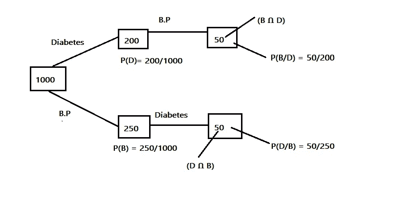
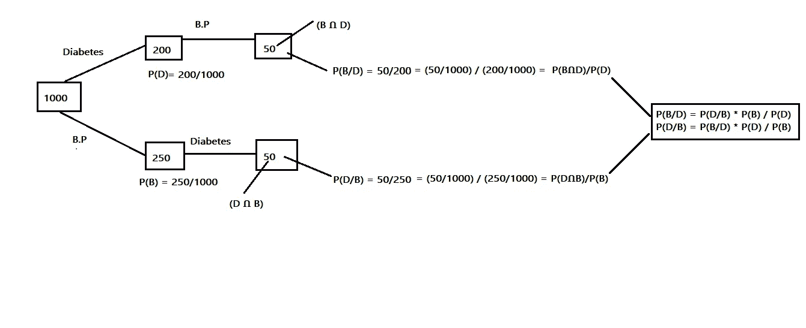
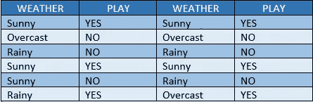
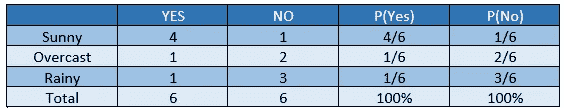
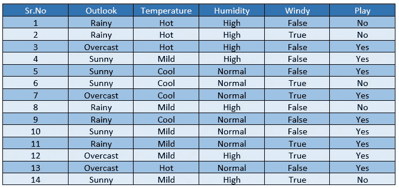
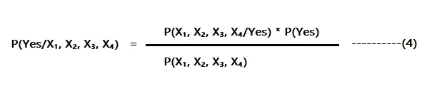
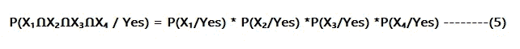
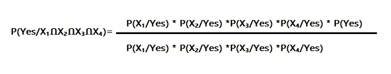

# 朴素贝叶斯分类

> 原文：<https://pub.towardsai.net/naive-bayes-classification-5e69cffe2050?source=collection_archive---------5----------------------->

## [统计数据](https://towardsai.net/p/category/statistics)

## 概率基础和贝叶斯定理

## 介绍

照片由 [Riho Kroll](https://unsplash.com/@rihok?utm_source=unsplash&utm_medium=referral&utm_content=creditCopyText) 在 [Unsplash](https://unsplash.com/collections/12248278/probabilities?utm_source=unsplash&utm_medium=referral&utm_content=creditCopyText) 上拍摄

朴素贝叶斯分类是一种有监督的机器学习算法。这是从贝叶斯定理衍生出来的众多算法之一。该算法可以根据需要进行扩展。应用朴素贝叶斯分类器时使用的特征是相互独立的。在我们深入研究朴素贝叶斯分类器的原理之前，我们先回顾一下概率、条件概率和贝叶斯定理的基础知识。

## 随机实验

这是一个实验或过程，其结果无法确切预测。

例如，在掷硬币时，我们不能预先断定输出是正面还是反面。

## 样本空间

由随机实验的所有可能结果组成的集合称为样本空间。

例如-

投掷硬币的输出可以由以下值组成= {H，T}

掷骰子的输出 S = {1，2，3，4，5，6}

## 事件

由所有可用结果组成的样本空间子集被称为事件。

例如，投掷硬币后获得的输出头称为事件。

## 独立事件

任何不依赖于过去事件的特定事件的发生被称为独立事件。

例如，考虑投掷硬币的情况，在第一次尝试中，我们得到的输出是反面。现在我们第二次扔硬币，输出可以是正面也可以是反面。输出不依赖于任何时间点给定的过去结果。

## 可能性

从给定样本空间获得特定结果的可能性称为概率。

例如，假设我们正在掷骰子，其样本空间由 S = {1，2，3，4，5，6}的结果组成

我们想知道结果是偶数的概率

让我们将上述事件视为 A，因此其概率将由 **P(A) =获得偶数的概率**给出

**= 3/6**

**= 1/2**

P(A) = 1/2

P(ā)= 1-P(A)= 1-(1/2)= 1/2

## 概率公理

*   任何事件发生的概率和不发生的概率之和总是等于 1。

***P(A)+P(ā)= 1***

*   任何特定事件的概率值总是在 0 & 1 之间。

**0≤P(A)≤1**

*   如果 A 和 B 是独立事件，则存在以下条件:

***【p(aոb)= p(a)* p(b)***

## 条件概率

作者图片

条件概率是相关事件的一个例子。当任何特定事件的发生依赖于任何其他事件的发生时，这就是所谓的条件概率。

为了更好地理解事情，让我们以上面的例子为例，其中 1000 名患者来进行医学测试。在这 1000 人中，我们首先找出其中有多少人的血压用 b 表示。在获得 P(B) = 200/1000 的概率后，我们接着计算有多少患者患有血压和糖尿病，这两者都可以用 bոD = 50 表示，其中 d =糖尿病。可以观察到，患有糖尿病的患者依赖于这样的事实，即他们的血压必须被评估为真实的。这种基于条件的概率称为条件概率。

所以**的产量 P(D/B) = 50/200。**

类似地，我们首先从给定 D 的 1000 人中计算糖尿病患者列表。因此，1000 人中糖尿病患者的概率由 P(D) = 250/1000 给出。现在我们的目标是计算有多少糖尿病患者有血压，可以表示为 dոB = 50，其中 b =血压。可以观察到，患者有血压的概率取决于患者已经被检测出患有糖尿病的事实。

所以输出 **P(B/D) = 50/250。**

## 贝叶斯定理

作者图片

考虑上面的图表，其中我们将条件概率的分子和分母都除以来进行医学测试的患者总数。假设 P(B/D)的条件概率的情况，当我们除以 1000 时，我们在代表 p(bոd).的分子中得到(50/1000)同样，我们在代表 P(D)的分母中得到(200/1000)。

所以基本上这个等式，

p(b/d)= p(bոd)/p(d)——( 1)

考虑 P(D/B)条件概率的第二种情况，当我们除以 1000 时，我们在代表 p(dոb).的分子中得到(50/1000)同样，我们在代表 P(B)的分母中得到(250/1000)。

**p(d/b)= p(dոb)/p(b)————(2)**

从(1)和(2)中，我们可以将两个方程的 LHS 视为分子 p(bոd，因为两个方程中的 lhs 是相似的。

**P(B/D)* P(D)= P(D/B)* P(B)——( 3)**

因此，从(3)中，我们可以获得下面的等式，该等式被定义为**贝叶斯公式。**

## **P(B/D)**=**P(D/B)* P(B)/P(D)**

## P(D/B) = P(B/D) * P(D) / P(B)

## 示例理解

作者图片

考虑上面的例子，我们有天气细节，并想根据晴朗的天气数据预测今天是否可以进行比赛。

作者图片

从上表中，我们可以预测

p(晴天/是)= 4/6 = 0.66

p(晴天)= 4/5 = 0.8

p(是)= 6/12 = 0.5

p(晴/否)= 1/6 = 0.16

p(是)= 6/12 = 0.5

因此，如果我们想预测天气晴朗时比赛发生的概率，那么我们可以应用贝叶斯概念

= P(是/晴天)

= P(晴天/是)* P(是)/ P(晴天)

= 0.66 * 0.5 / 0.8

=0.41

所以，P(是/晴天)= 0.41

类似地，如果我们想预测天气晴朗时比赛不进行的概率，那么我们可以应用贝叶斯概念

= P(无/晴天)

= P(晴/无)* P(无)/ P(晴)

= 0.16 * 0.5 / 0.8

=0.1

所以，P(无/晴天)= 0.1

因此，我们使用贝叶斯公式得出结论，在阳光明媚的日子里比赛的概率更高。

## 朴素贝叶斯分类器

在贝叶斯分类中，我们过去仅基于一个单一特征来预测输出，即上述特定示例中的天气。然而，考虑一种情况，其中游戏是否将被玩取决于多个特征，例如天气、温度、湿度、风等。

作者图片

基于上表中显示的过去数据，用户希望使用以下输入来预测游戏是否可以进行:

今天=(晴，热，正常，假)

考虑 X₁、X₂、X₃、X₄等特征，使用贝叶斯公式

作者图片

现在我们知道 **P(X₁，X₂，X₃，x₄)=p(x₁ոx₂ոx₃ոx₄)**

根据概率公理，我们知道

**对于独立事件 A 和 B，**

**p(aոb)= p(a)* p(b)**

在我们的示例中，X₁、X₂、X₃和 X₄是独立的事件，彼此不依赖。

所以**p(x₁ոx₂ոx₃ոx₄)=p(x₁)*p(x₂)*p(x₃)*p(x₄)**

还有，

作者图片

所以在主方程(4)中代入上述(5)的值

作者图片

上面的等式被称为朴素贝叶斯分类器。它使用影响输出的多个要素，并根据概率值收集特定操作是否会发生的信息。需要考虑的非常重要的一点是，这些特性是相互独立的。朴素贝叶斯分类器中的朴素一词，意思是独立。

## 朴素贝叶斯分类器何时使用？

*   当训练数据很小时。
*   当特征独立时。
*   当我们丢失的数据较少时。

## 朴素贝叶斯的优势

*   需要较少的训练数据。
*   很好地处理缺失数据
*   对无关的特征不敏感。

感谢您阅读文章！！