# 机器学习中的朴素贝叶斯分类器

> 原文：<https://pub.towardsai.net/naive-bayes-classifier-in-machine-learning-b0201684607c?source=collection_archive---------0----------------------->

## [机器学习](https://towardsai.net/p/category/machine-learning)

## 使用 sklearn 的数学解释和 python 实现


来自 [Pexels](https://www.pexels.com/photo/person-about-to-catch-four-dices-1111597/?utm_content=attributionCopyText&utm_medium=referral&utm_source=pexels) 的[摄影记者拍摄的](https://www.pexels.com/@fotografierende?utm_content=attributionCopyText&utm_medium=referral&utm_source=pexels)

# 朴素贝叶斯分类器

朴素贝叶斯分类器是用于分类任务的概率模型。它基于 Bayes 定理，并假设预测器之间是独立的。在现实世界中，独立性假设可能是真的，也可能不是真的，但朴素贝叶斯仍然表现良好。

# 本故事涵盖的主题

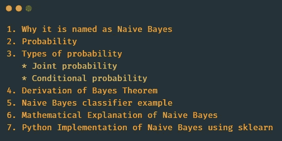

作者图片

# 为什么命名为朴素贝叶斯？

**幼稚** →之所以称之为幼稚，是因为它假设数据集中的所有特征都是相互独立的。
**贝叶斯，** →它是基于贝叶斯定理。

# 贝叶斯定理

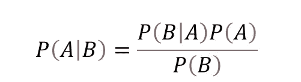

首先，我们来学习一下概率。

# 可能性

**概率**是一个反映特定事件发生的机会或可能性的数字。

**事件** →从概率上来说，事件是随机实验的结果。

**P(A)=n(A)/n(S)**

P(A) →事件发生的概率 A
n(A)→有利结果的数量
n(S)→可能结果的总数

**示例**

P(A) →抽王概率
P(B)→抽红牌概率。

P(A) =4/52
P(B)=26/52

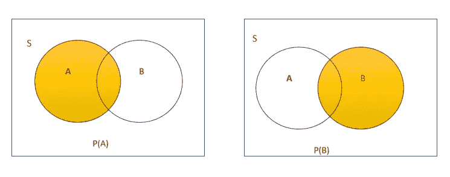

作者图片

# 概率的类型

1.  联合概率
2.  条件概率

## **1。联合概率**

联合概率是两个事件同时发生的概率。

p(A∩B)→抽到一个王的概率，红色。

P(A∩B)= P(A)* P(B)=(4/52)*(26/52)=(1/13)*(1/2)= 1/26

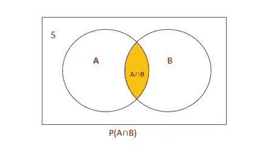

作者图片

## **2。条件概率**

**条件概率**是一个事件在另一个事件存在的情况下发生的**概率**。

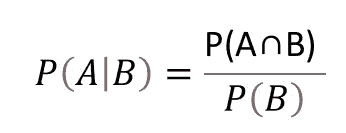

给定红色，抽到国王的概率→ P(A|B)

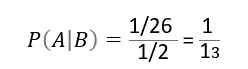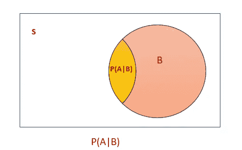

作者图片

**给定国王 P(B|A)抽红牌的概率**

P(B|A) =P(A∩B)/P(A)

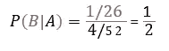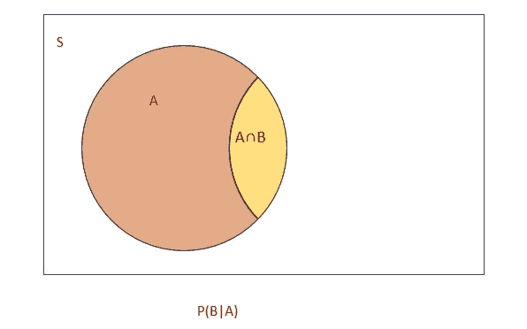

作者图片

# 贝叶斯定理的推导

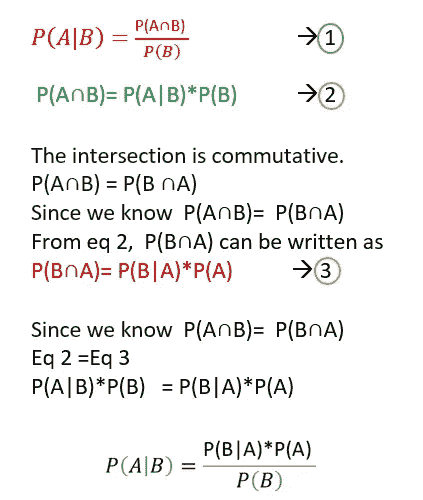

作者图片

# 朴素贝叶斯分类器示例

贝叶斯定理是条件概率的推广。利用贝叶斯定理，我们不得不用一个条件概率去计算另一个条件概率。

要计算 P(A|B)，我们得先计算 P(B|A)。

**例如:**

如果你想预测一个人是否有糖尿病，在给定的条件下？P(A|B)
糖尿病→类→ A
条件→独立属性→ B

为了使用朴素贝叶斯来计算这个，

1.  首先，计算 P(B|A) →这意味着从数据集中找出多少糖尿病患者(A)具有这些条件(B)。这叫做**似然比 P(B|A)**
2.  然后乘以**P(A)→先验概率**→数据集中糖尿病患者的概率。
3.  然后除以 **P(B) →证据。**这是当前发生的事件**。**假设这个事件已经发生，我们正在计算另一个事件也将发生的概率。

这个概念被称为朴素贝叶斯算法。


**P(B|A) →似然比
P(A) →先验概率
P(A|B) →后验概率
P(B) →证据**

# 资料组

我已经拿到了高尔夫数据集。

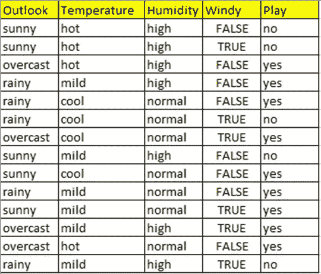

作者图片

考虑打高尔夫的问题。在这个数据集中， **Play** 是目标变量。我们是否能在某一天打高尔夫球是由独立变量**天气、温度、湿度、风**决定的。

# 朴素贝叶斯的数学解释

让我们预测给定的条件**晴朗、温和、正常、错误** →他/她是否能打高尔夫球？


作者图片

## **简化贝叶斯定理**

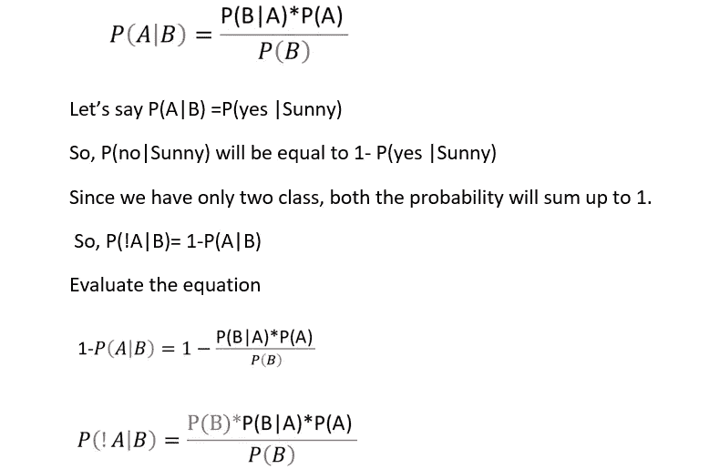

P(A|B)和 P(！A|B)仅由分子值决定，因为两个等式中的分母相同。

所以，要预测类是或否，我们可以用这个公式`P(A|B)=P(B|A)*P(A)`

1.  **计算先验概率**
    14 条记录中，有 9 条是肯定的。所以 P(是)=9/14，P(否)=5/14


作者图片

**2。计算似然比**

**展望**

在 14 次记录中，5 次是晴天，4 次是阴天，5 次是雨天。

假设他/她会打高尔夫球，找出当天阳光明媚的概率？

从数据集来看，我们可以玩的晴天数是 2。我们可以玩的总天数是 9 天。

所以 P(Sunny | yes) =2/9

同样，我们必须计算所有变量。

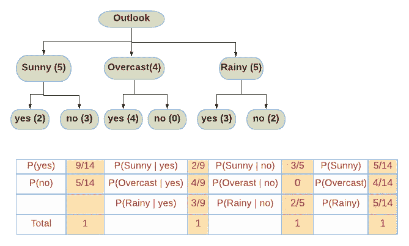

作者图片

**温度**

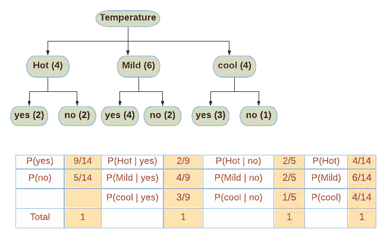

作者图片

**湿度**

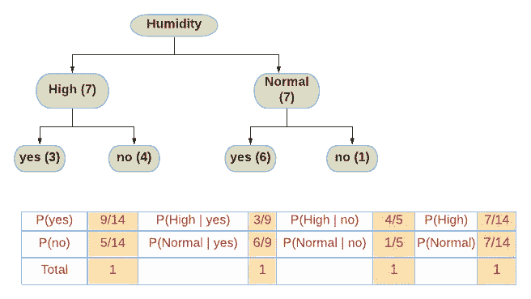

作者图片

**刮风**


作者图片

让我们预测给定的条件**晴朗、温和、正常、错误** →他/她是否能打高尔夫？

a =是
B=(晴朗、温和、正常、错误)

P(A|B)=P((是)|(晴天，温和，正常，假)

P(A|B)=P(B|A)*P(A)

P(yes|(晴天，温和，正常，假))= P((晴天，温和，正常，假)|yes) *P(是)

[独立事件的概率通过将所有事件的概率相乘来计算。朴素贝叶斯算法将所有变量视为独立变量)

=P(晴天|是)*P(温和|是)*P(正常|是)*P(假|是)*P(是)

=2/9 *4/9 *6/9 *6/9 *9/14

`**P(yes|(Sunny,Mild,Normal,False))= 0.0282**`

**现在让我们计算 P(no|(晴，温和，正常，假))**

P(no|(晴天，温和，正常，假))= P((晴天，温和，正常，假)|no) *P(no)

=P(晴|否)* P(轻度|否)* P(正常|否)* P(假|否)* P(否)

=3/5 *2/5 *1/5 *2/5 *5/14

`P(no|(Sunny,Mild,Normal,False))= =0.0068`

由于**0.0282>0.0068**【P(是|条件)】> P(否|条件)，对于给定条件**晴天，温和，正常，假**，发挥预测为**是**。

让我们使用相同的数据集来构建 NB 模型

# 使用 sklearn 的朴素贝叶斯的 Python 实现

1.  **导入库**

```
**import** numpy **as** np
**import** pandas **as** pd
**import** seaborn **as** sns
**import** matplotlib.pyplot **as** plt
```

**2。加载数据**

```
df=pd.read_csv(**"golf_df.csv"**)
df.head(3)
```

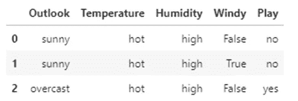

**3。将分类变量(字符串数据类型)转换为连续变量**

```
**from** sklearn.preprocessing **import** LabelEncoder
le=LabelEncoder()
Outlook_le=le.fit_transform(df.Outlook)
Temperature_le=le.fit_transform(df.Temperature)
Humidity_le=le.fit_transform(df.Humidity)
Windy_le=le.fit_transform(df.Windy)
Play_le=le.fit_transform(df.Play)

df[**"Outlook_le"**]=Outlook_le
df[**"Temperature_l1"**]=Temperature_le
df[**"Humidity_le"**]=Humidity_le
df[**"Windy_le"**]=Windy_le
df[**"Play_le"**]=Play_le
df.head(3)
```

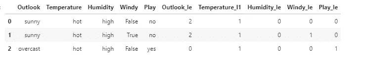

**4。现在从数据帧中删除旧的分类列**

```
df=df.drop([**"Outlook"**,**"Temperature"**,**"Humidity"**,**"Windy"**,**"Play"**],axis=1)
df.head(3)
```

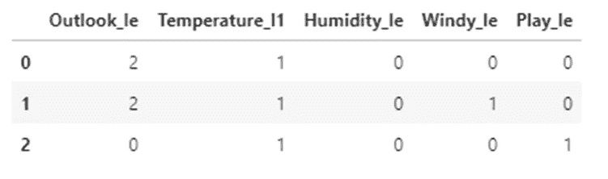

**5。分配 x(自变量)和 y(因变量)**

```
x=df.iloc[:,0:4]
x.head(3)
```

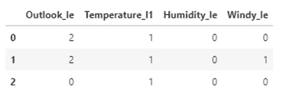

```
y=df.iloc[:,4:]
y.head(3)
```

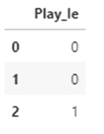

6。将数据分成训练和测试

```
**from** sklearn.model_selection **import** train_test_split
x_train,x_test,y_train,y_test=train_test_split(x,y,test_size=0.3,random_state=10)
```

7.**用 sklearn 建模**

```
**from** sklearn.naive_bayes **import** GaussianNB
model=GaussianNB()
model.fit(x_train,y_train)
```

高斯安 b()

8。准确度分数

```
y_predict=model.predict(x_test)
**from** sklearn.metrics **import** accuracy_score
accuracy_score(y_test,y_predict,normalize=**True**)
```

输出: **1.0**

9。让我们预测给定条件下的类别(是或否):晴天、温和、正常、错误。

```
model.predict([[2,2,1,0]])
```

输出:数组([1])

1 →表示是。

所以给定条件**晴天，温和，正常，假→玩是。所以我们可以在阳光充足、温和、正常、虚假的条件下打高尔夫球。**

# Github 链接

这个故事中使用的代码和数据集可以从我的 [Github 链接](https://github.com/IndhumathyChelliah/MachineLearningAlgorithms/tree/master/naive_bayes)下载。

# 结论

当独立预测器的假设成立时，朴素贝叶斯分类器与其他模型相比表现非常好。它在训练和测试数据上都非常快。在一些罕见的事件中，如果我们预测的类别在训练数据中没有被观察到，那么模型将增加零概率，并且将不能做出预测。为了解决这个问题，使用平滑技术，如**拉普拉斯估计**。

# 我关于机器学习的其他博客

[](https://towardsdatascience.com/line-of-best-fit-in-linear-regression-13658266fbc8) [## 线性回归中的最佳拟合线

### 相关系数、决定系数、模型系数

towardsdatascience.com](https://towardsdatascience.com/line-of-best-fit-in-linear-regression-13658266fbc8) [](https://towardsdatascience.com/logistic-regression-in-python-2f965c355b93) [## Python 中的逻辑回归

### 详细的逻辑回归

towardsdatascience.com](https://towardsdatascience.com/logistic-regression-in-python-2f965c355b93) [](https://towardsdatascience.com/an-introduction-to-support-vector-machine-3f353241303b) [## 支持向量机简介

### 如何在分类问题中使用 SVM？

towardsdatascience.com](https://towardsdatascience.com/an-introduction-to-support-vector-machine-3f353241303b) [](https://towardsdatascience.com/an-introduction-to-k-nearest-neighbours-algorithm-3ddc99883acd) [## K-最近邻算法简介

### 什么是 KNN？

towardsdatascience.com](https://towardsdatascience.com/an-introduction-to-k-nearest-neighbours-algorithm-3ddc99883acd) [](https://betterprogramming.pub/understanding-decision-trees-in-machine-learning-86d750e0a38f) [## 理解机器学习中的决策树

### 决策树背后的数学以及如何使用 Python 和 sklearn 实现它们

better 编程. pub](https://betterprogramming.pub/understanding-decision-trees-in-machine-learning-86d750e0a38f) 

我希望这篇文章对你有所帮助。

请关注此空间，了解更多关于 Python 和数据科学的文章。如果你喜欢看我的更多教程，就关注我的 [***中***](https://medium.com/@IndhumathyChelliah)[***LinkedIn***](https://www.linkedin.com/in/indhumathy-chelliah/)*[***Twitter***](https://twitter.com/IndhuChelliah)***。****

****点击此处成为中等会员:****

*[*https://indhumathychelliah.medium.com/membership*](https://indhumathychelliah.medium.com/membership)*