# 朴素贝叶斯分类器

> 原文：<https://pub.towardsai.net/naive-bayes-classifiers-79ac2c805f3f?source=collection_archive---------1----------------------->

本文讨论朴素贝叶斯分类器背后的理论及其实现。

朴素贝叶斯分类器是基于**贝叶斯定理**的分类算法集合。它不是一个单一的算法，而是一个算法家族，所有算法都有一个共同的原则，即每一对被分类的特征都是相互独立的。

首先，让我们考虑一个数据集。

考虑一个虚构的数据集，它描述了打高尔夫球的天气条件。给定天气条件，每个元组将条件分类为适合(“是”)或不适合(“否”)打高尔夫。

这是我们数据集的表格表示。

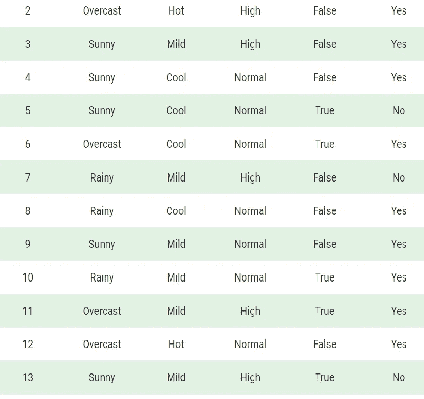

数据集分为两部分，即**特征矩阵**和**响应向量**。

*   特征矩阵包含数据集的所有向量(行)，其中每个向量由**相关特征**的值组成。在上面的数据集中，特征是“前景”、“温度”、“湿度”和“有风”。
*   响应向量包含特征矩阵每一行的**类变量**(预测或输出)的值。在上面的数据集中，类变量名为“Play golf”

**假设:**

朴素贝叶斯的基本假设是，每个特征构成一个:

*   自主的
*   平等的

对结果的贡献。

对于我们的数据集，这个概念可以理解为:

*   我们假设没有一对特征是相互依赖的。例如，温度“热”与湿度无关，或者天气“多雨”对风没有影响。因此，这些特征被认为是独立于**和**的。
*   其次，每个特征被赋予相同的权重(或重要性)。比如只知道唯一的温度和湿度，是无法准确预测结果的。没有一个属性是不相关的，并被假定为对结果的贡献**相等**。

**注:**朴素贝叶斯做出的假设在现实情况下一般不正确。独立性假设从来都是不正确的，但在实践中往往很有效。

现在，在讨论朴素贝叶斯公式之前，了解贝叶斯定理是很重要的。

贝叶斯定理根据已经发生的另一个事件的概率，求出一个事件发生的概率。贝叶斯定理在数学上表述为以下等式:

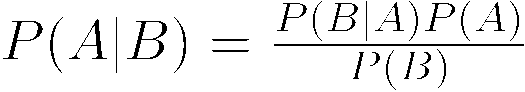

其中 A 和 B 是事件，P(B)是。0.

*   假设事件 B 为真，我们试图找出事件 A 的概率。事件 B 也被称为**证据**。
*   P(A)是 A 的优先级(先验概率，即事件在证据出现之前的概率)。证据是一个未知实例的属性值(这里是事件 B)。
*   P(A|B)是 B 的后验概率，即看到证据后事件的概率。

现在，关于我们的数据集，我们可以按以下方式应用贝叶斯定理:

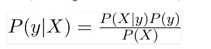

其中 y 是类变量，X 是从属特征向量(大小为 *n* ),其中:

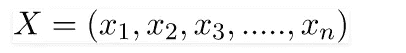

为了澄清，特征向量和相应的类变量的例子可以是:(参考数据集的第一行)

```
X = (Rainy, Hot, High, False)
y = No
```

因此，基本上，P(X|y)在这里意味着“不打高尔夫球”的概率，假设天气条件是“有雨”、“温度高”、“湿度大”和“无风”。

**天真的假设**

现在，是时候给贝叶斯定理一个天真的假设了，它是特征中的**独立性**。所以现在，我们将**证据**分割成独立的部分。

现在，如果任意两个事件 A 和 B 是独立的，那么，

```
P(A,B) = P(A)P(B)
```

因此，我们得出结果:

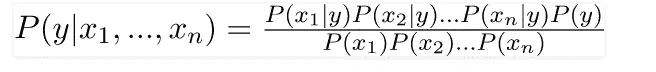

这可以表示为:

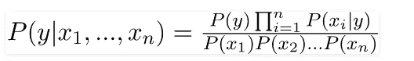

现在，对于给定的输入，分母保持不变，我们可以去掉这一项:

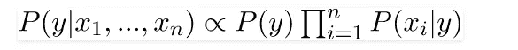

现在，我们需要创建一个分类器模型。为此，我们为类变量 *y* 的所有可能值找到一组给定输入的概率，并选取具有最大概率的输出。这可以用数学方法表示为:

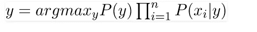

因此，最后，我们剩下的任务是计算 P(y)和 P(xi | y)。

请注意，P(y)也叫**类概率，**，P(xi | y)叫**条件概率**。

不同的朴素贝叶斯分类器的区别主要在于它们对 P(xi | y)的分布所做的假设。

让我们尝试将上述公式手动应用于我们的天气数据集。为此，我们需要在数据集上做一些预计算。

我们需要为 X 中的每个 xi 和 y 中的每个 yj 找到 P(xi | yj)。所有这些计算都在下表中进行了演示:

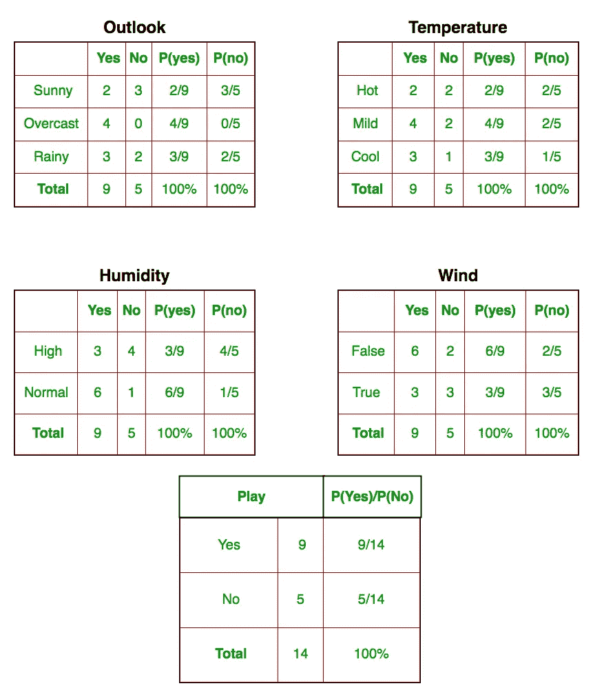

因此，在上图中，我们已经在表 1-4 中手动计算了 X 中每个 xi 的 P(xi | yj)和 y 中的 yj。例如，打高尔夫球的概率，假设气温凉爽，即 P(temp。=酷|打高尔夫=是)= 3/9。

此外，我们需要找到类别概率(P(y))，这已在表 5 中计算出来。比如 P(打高尔夫=是)= 9/14。

现在，我们完成了预先计算，分类器准备好了！

让我们在一组新特性上测试一下(今天就称之为新特性):

```
today = (Sunny, Hot, Normal, False)
```

因此，打高尔夫球的概率由下式给出:


不打高尔夫的概率由下式给出:

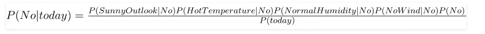

因为 P(今天)在两种概率中是常见的，所以我们可以忽略 P(今天),并找到比例概率:

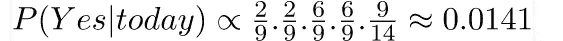

和

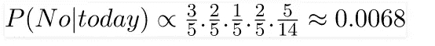

现在，既然

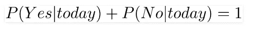

通过使总和等于 1(归一化)，可以将这些数字转换成概率:

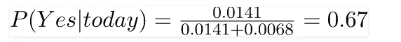

和

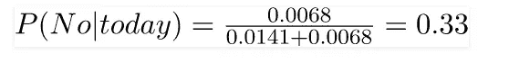

因为

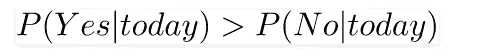

所以，高尔夫将会被使用的预测是肯定的。

我们上面讨论的方法适用于离散数据。在连续数据的情况下，我们需要对每个特性的值的分布做一些假设。不同的朴素贝叶斯分类器的区别主要在于它们对 P(xi | y)的分布所做的假设。

现在，我们在这里讨论一个这样的分类器。

**高斯朴素贝叶斯分类器**

在高斯朴素贝叶斯中，假设与每个特征相关联的连续值按照**高斯分布**分布。高斯分布也被称为[正态分布](https://en.wikipedia.org/wiki/Normal_distribution)。绘制时，它给出一条钟形曲线，该曲线关于特征值的平均值对称，如下所示:

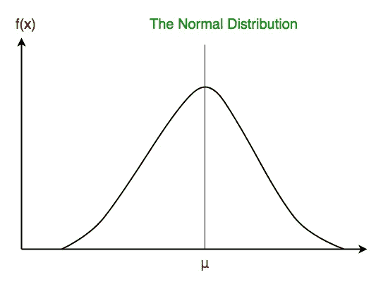

假设特征的似然性是高斯的；因此，条件概率由下式给出:

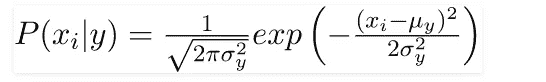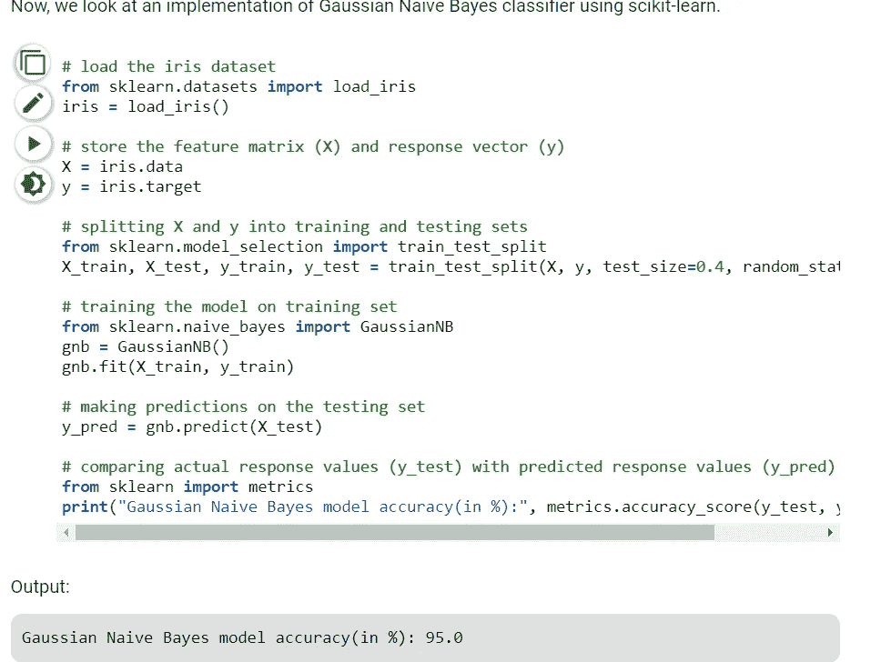

其他流行的朴素贝叶斯分类器有:

*   **多项式朴素贝叶斯**:特征向量代表由**多项式分布**产生的特定事件的频率。这是通常用于文档分类的事件模型。
*   **伯努利朴素贝叶斯**:在多元伯努利事件模型中，特征是描述输入的独立布尔(二元变量)。像多项式模型一样，该模型对于文档分类任务是流行的，其中使用二元术语出现(即，单词是否在文档中出现)特征，而不是术语频率(即，单词在文档中的频率)。

当我们到达本文的结尾时，这里有一些重要的问题需要思考:

*   尽管朴素贝叶斯分类器的假设过于简化，但它在许多现实情况下工作得相当好，著名的有文档分类和垃圾邮件过滤。它们需要少量的训练数据来估计必要的参数。
*   与更复杂的方法相比，朴素贝叶斯学习器和分类器可以非常快。类别条件特征分布的解耦意味着每个分布可以被独立地估计为一维分布，反过来，它有助于缓解源于维数灾难的问题。

参考资料:

*   [https://en.wikipedia.org/wiki/Naive_Bayes_classifier](https://en.wikipedia.org/wiki/Naive_Bayes_classifier)
*   [http://gerardnico.com/wiki/data_mining/naive_bayes](http://gerardnico.com/wiki/data_mining/naive_bayes)
*   [http://scikit-learn.org/stable/modules/naive_bayes.html](http://scikit-learn.org/stable/modules/naive_bayes.html)