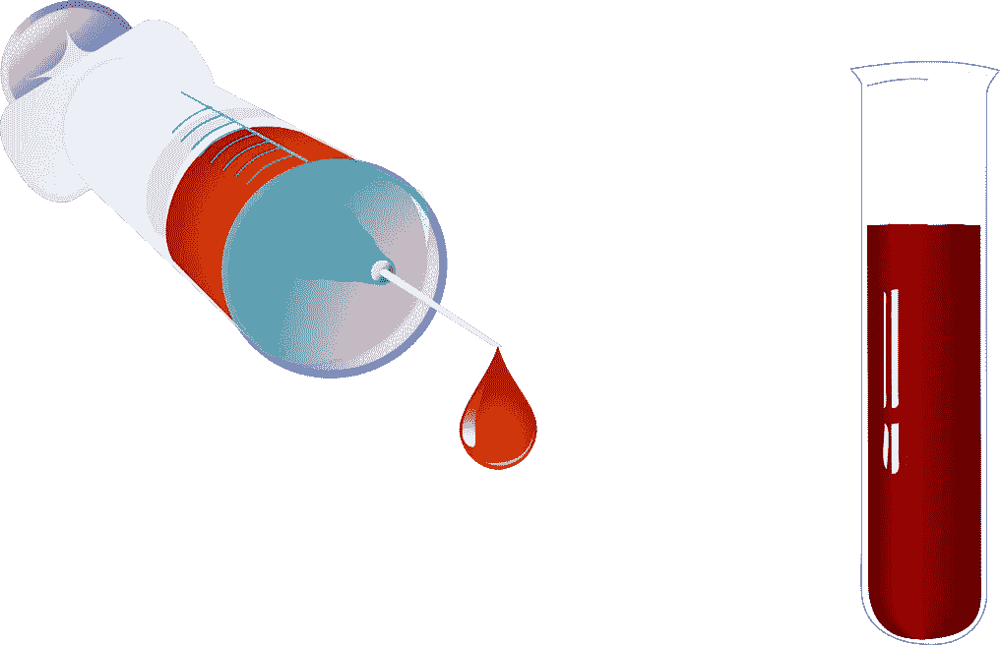
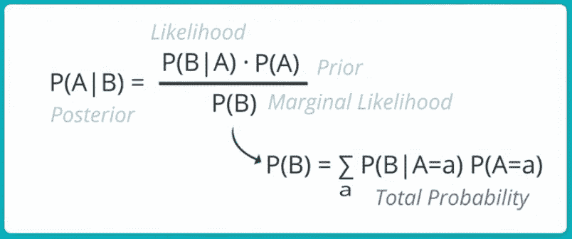
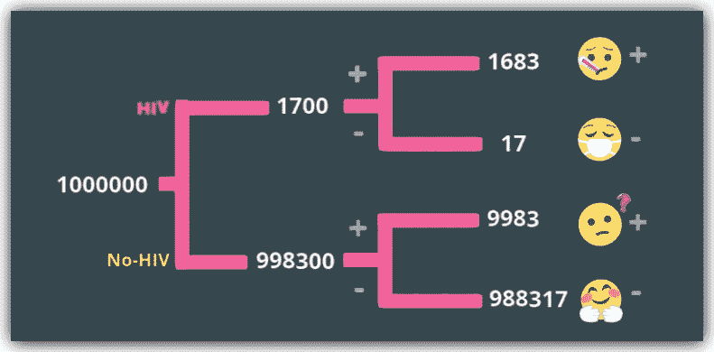

# 用于测试的朴素贝叶斯推断

> 原文：<https://pub.towardsai.net/naive-bayes-inference-for-testing-7d96f4fcd62f?source=collection_archive---------2----------------------->

## [数据科学](https://towardsai.net/p/category/data-science)

## 证明测试准确性仅仅是不够的…



来源: [Pixabay](https://pixabay.com/?utm_source=link-attribution&utm_medium=referral&utm_campaign=image&utm_content=1297583)

# 简介:

概率是人工智能的基石。不确定性的管理是人工智能许多应用的关键，如机器学习、过滤、机器人、计算机视觉、NLP、搜索等。

> 概率是我们管理不确定性的机器…

没有任何其他部门像卫生部门那样对不确定性的管理至关重要。

*   想象一下，你对一种特定的药物过敏，但是过敏测试错误地显示你不过敏(*假阴性*)。
*   或者想象一下，你生病了，接受了艾滋病毒检测，结果却是阳性，而你实际上并没有感染艾滋病毒(*假阳性*)。

乍一看，假阴性似乎更具破坏性。当然，虚假的过敏测试结果可能会导致全科医生给你开一种药物，从而导致危及生命的问题。

但假阳性的情况也是如此。一个人在艾滋病毒测试呈假阳性后可能会有自杀倾向。如果他/她的家庭成员出现紧急情况，急需他们的血型，他/她将被禁止献血。加上这些精神和情感上的折磨和绝望。

> 说到健康，假阳性和假阴性同样有害…

18 世纪的数学家和长老会牧师托马斯·贝叶斯牧师发明了 [***贝叶斯法则***](https://classroom.udacity.com/courses/st101/lessons/48703346/concepts/483698470923) ，由于其对边际概率、联合概率、条件概率和总概率的约束，通常被称为概率推理的 [***圣杯***](https://youtu.be/CohZnkZMOxE) 。



[图片 _ 信用](https://youtu.be/3AWOaMo8Vi8)

简而言之，贝叶斯定理计算的是某个事件发生的概率(***P***)(*比如这个消息是垃圾消息吗？*)基于某些其他事件的联合概率分布。

Naive-Bayes 之所以如此，是因为它天真地假设事件是独立的。这是一个错误和天真的假设，但在实践中，它工作得非常好，并使朴素贝叶斯算法有效。

# 朴素贝叶斯应用；

让我们看一个现实生活中的例子，使用朴素贝叶斯定理从医学测试中得出关键的推论。


伦敦桥| [image_credit](https://unsplash.com/@ashkya)

假设你是伦敦的一名硕士生，星期五下课后，你在家和你的室友约翰喝一杯，休息一下。

你观察到约翰明显感到悲伤和不安，所以经过几分钟的刺激后，他向你敞开心扉，告诉你他刚刚检测出 HIV 阳性。

这是毁灭性的！所以你问约翰他是否做了后续测试，他说:

> “不，这是镇上最好的实验室，他们的测试套件使用最新的软件，在过去的 5 年里，准确率达到 99%。”

你为约翰感到难过，然后基于你对数据的了解，你决定做一些调查。

1.  你发现英国的艾滋病毒感染率为每 1000 人中有 1.7 人[。](https://www.avert.org/professionals/hiv-around-world/western-central-europe-north-america/uk)
2.  你还在该实验室的网站上证实，该检测试剂盒的准确率为 99%，表明在每 100 名感染艾滋病毒的患者样本中，该检测将 99 人归类为阳性。在 100 个消极的人的样本中反过来成立，它准确地将 99 个归类为消极的。在这两种情况下，它只错分了一个病人。

你开始意识到约翰可能真的感染了艾滋病毒，但是你记起了贝叶斯法则，打开了你的笔记本…

# 机会还是逻辑？


概率是衡量不确定性的机器| [image_credit](https://pixabay.com/vectors/dice-die-probability-fortune-luck-147157/)

好的，所以你要写下这个案子的细节…到目前为止你有什么事实？幸运的是，你还记得概率的一个公理:

> 互斥事件的概率( **P** )必须等于 1。。

如果一枚硬币正面的 ***P*** 是 0.5，那么反面的 ***P*** 一定是**1–0.5 = 0.5**。我们称之为 ***补码规则(CR)。*** 这是极不平凡而强大的。

所以你开始写下你的事实…

*   **艾滋病病毒检测呈阳性的概率为 99%**

```
**p_pos_given_hiv = 0.99**
```

*   **因此，基于(CR)** ，它的补码必须是 1–0.99

```
**p_neg_given_hiv = 1 - 0.99**
```

*   **下一步，假设无艾滋病病毒，检测阴性的 *P* 也是 99%**

```
**p_neg_given_no_hiv = 0.99**
```

*   **同样，基于(CR)** ，它的补码必须是 1–0.99

```
**p_pos_given_no_hiv = 1 - 0.99**
```

*   **接下来，HIV 的 *P* 为 1.7/1000 = 0.0017**

```
**p_hiv = 0.0017**
```

*   **同样，基于(CR)** ，它的补码必须是 1–0.0017

```
**p_no_hiv = 1 - 0.0017**
```

到目前为止，你似乎做得很好，但是等等！你需要再次提醒自己贝叶斯法则的公式…


贝叶斯规则| [图像 _ 信用](https://youtu.be/3AWOaMo8Vi8)

> 这仅仅意味着事件 **A** 的**条件 P** ，给定事件 **B** 是事件 **B** 的**条件 P** ，给定事件 **A** 乘以事件 **A** 的**边际 P** ，所有这些除以事件 **B** 的**边际 P** (实际上是【T22

相当的满嘴，但是真的很直观…

## 请注意:

1.  ***【P(A | B)】***:叫做*，这就是我们要计算给出的一些证据。*
2.  ****【P(B | A)】***:被称为*。这是我们知道的一些条件 P。在这种情况下，它是艾滋病毒检测呈阳性的条件 P，我们知道是 99%。**
3.  *****【P(A)***:被称为*的先验，是我们在意识到可能性之后偶然发现的证据。这样的话就是 ***p_hiv*** 也就是 **0.0017** 。***
4.  *****【P(B)】***:称为*又名 ***总概率***又名 ***规格化器*** 。这通常是贝叶斯法则更难计算的方面。***

**好吧，那我们现在做什么？我们有约翰的阳性测试结果。我们还知道约翰的艾滋病病毒检测呈阳性的条件是 99%**。****

```
******p_pos_given_hiv = 0.99******
```

****但是谢天谢地！有了贝叶斯法则，我们就可以知道，假设约翰的测试结果是阳性的，他实际感染艾滋病毒的概率或机会到底是多少？****

```
******p_hiv_given_pos = ??******
```

****这种新的条件 ***P*** 我们寻求的是**后路** …****

****你可以看到，使用贝叶斯法则，我们可以从我们所知道的( **p_pos_given_hiv = 0.99)** 到我们从可用数据和证据中推断出来的 **(p_hiv_given_pos =？？).******

****这一推论是约翰实际上感染了艾滋病毒的条件 ***P*** ，因为我们知道他的检测呈阳性。****

# ****计算后验概率:****

****现在，我们简单地使用贝叶斯规则并插入我们的变量。****

```
****# **Bayes_Rule****p_hiv_given_pos = (p_pos_given_hiv * p_hiv) / p_pos******
```

****最理想的是先计算分子…***p _ pos _ given _ HIV***乘以 ***p_hiv*** 。****

```
******numerator = p_pos_given_hiv * p_hiv
>>
#** numerator = 0.0017****
```

****现在来计算分母，也就是规格化器… ***p_pos。*******

*****这里有点棘手，规格化器是通过总 p 计算的，这是****(p _ pos _ given _ HIV * p _ HIV)+(p _ pos _ given _ no _ HIV * p _ no _ HIV)****。*****

```
****denominator = 
**(p_pos_given_hiv * p_hiv)+(p_pos_given_no_hiv * p_no_hiv)
>>
#** denominator = 0.0117****
```

****现在我们有了分子和分母，我们用前者除以后者得到后验概率。****

```
******posterior = numerator / denominator
posterior = 0.0017 / 0.0117**
>>
# **posterior = 0.1452******
```

****坚持住！你真的明白刚才发生了什么吗？****

****贝叶斯法则表明，如果约翰的检测结果为阳性，通过最先进的检测试剂盒，准确率为 99%……约翰只有 14.5% 的几率感染艾滋病毒。意思是他有 85.5%的几率没有感染艾滋病病毒！****

********

****凯尔特-结时刻| [image_credit](https://pixabay.com/vectors/celtic-knot-interlace-148345/)****

****这真是难以置信的疯狂！你现在正在你的大脑中编织凯尔特结，试图处理*什么* - *翻转快乐*，你只是从数据中推断…****

****你反复检查计算结果，一切都很好，所以你兴奋地向约翰宣布，尽管存在 ***可能性*** ，他仍有 85.5%的几率是否定的。****

****他死盯着你的眼睛说，****

> ****嘿，伙计…现在不是你检查那些新奇的未经测试的算法的时候，这是关于我的生活！我们是如何从 99%的阳性检测准确率提高到 85.5%的无感染几率的？****

# ****证据是:****

********

****综合起来… | [image_credit](https://burst.shopify.com/photos/floating-cubes-on-blue?c=abstract)****

****我们从 [*目前关于英国*](https://www.avert.org/professionals/hiv-around-world/western-central-europe-north-america/uk) 的统计数据得知，艾滋病病毒感染率为每 1000 人中 **1.7 人，T42 为 0.0017** 。****

****让我们假设英国有一百万人口。****

```
******uk_pop = 1000000******
```

****现在，对于这 100 万人来说，他们要么是艾滋病毒阳性，要么是阴性。让我们把这些分成两个互补的组…****

```
******hiv = 1.7 * 1000 * 1000
no_hiv = uk_pop - hiv**>>
**hiv = 1,700
no_hiv = 998,300******
```

****回想一下，每 100 个案例中，有 99 个被正确分类，1 个被错误分类。这适用于 ***hiv*** 和 ***no_hiv*** 群体。****

****现在，让我们从混淆矩阵中定义一些重要的术语。****

****[*看看这篇文章*](https://medium.com/towards-artificial-intelligence/the-confusion-matrix-for-classification-eb3bcf3064c7) 如果你需要复习的话，我写了很多关于混淆矩阵的文章。****

1.  ******假阳性:**这是指测试显示一个人呈阳性，但它是假的，因为这个人真的呈阴性。****
2.  ****假阴性:这是指测试显示一个人是阴性的，但它是假的，因为这个人是真的阳性。****
3.  ****真阳性:这是指一项测试说一个人是阳性的，而且是真的。****
4.  ******真阴性:**这是指一项测试说一个人是阴性，而这是真的。****

****所以先拿 ***hiv*** 组来说，让我们计算一下那些真阳性( **99%** )和假阴性( **1%** )。****

```
******true_positive_hiv_group = (99/100) * hiv
false_negative_hiv_group = (1/100) * hiv**>>
**true_positive_hiv_group = 1,683
false_negative_hiv_group = 17******
```

****我们对***no _ HIV****组进行重复，计算那些真阴性( **99%** )和假阳性( **1%** )*****

```
*******true_negative_no_hiv_group = (99/100) * no_hiv
false_positive_no_hiv_group = no_hiv - true_negative_no_hiv_group**>> **true_negative_no_hiv_group = 988,317
false_positive_no_hiv_group = 9,983*******
```

*****所以我们这里有四个不同的组…*****

**********

1.  *******true _ positive _ HIV _ group**:**1，683 名**艾滋病毒携带者，被正确归类为阳性，理想情况下给予药物和护理。*****
2.  *******false _ negative _ HIV _ group**:**17**有艾滋病毒的人，却凭着自己没有艾滋病毒的假证被送回家。*****
3.  *******true _ negative _ no _ hiv _ group**:**988，317** 英国居民没有携带 HIV 病毒，并在没有携带 HIV 病毒的真实证据下被遣送回家。*****
4.  *******false _ positive _ no _ HIV _ group**:**9983**没有感染艾滋病毒，但被诊断为感染了艾滋病毒，并被送去接受更多测试和护理的困惑和创伤患者。尽管已经用测试工具测试了 99%的准确性。*****

*****那么回到约翰的测试结果…鉴于他测试呈阳性，他没有感染艾滋病毒的几率是 85.5%？*****

*****我们知道，既然他的测试结果是阳性，那么他肯定属于阳性组。这意味着他必须在***true _ positive _ HIV _ group***或***false _ positive _ no _ HIV _ group***中。*****

****那么他的机会有多大？****

```
******total_positives = true_positive_hiv_group + false_positive_no_hiv_group**>>
**total_positives = 11,666******
```

****所以约翰在检测呈阳性后真正成为 HIV 阳性的几率是…****

```
******p_john_true_pos = true_positive_hiv_group / total_positives = 0.1443******
```

****只有大约 14%的机会！****

```
******p_john_false_pos = false_positive_no_hiv_group / total_positives 
p_john_false_pos = ** **0.8557******
```

****约翰有 85.5%的几率对艾滋病毒呈假阳性。****

# ****更多推断:****

********

****[image_credit](https://burst.shopify.com/photos/man-pointing-at-laptop-screen-analytics?c=technology)****

****上述实验永远是正确的，因为尽管测试失败的概率只有 1% ，但 T2 的 1% 比 T4 每 1000 名英国人口中 0.017% 的艾滋病毒感染率要高得多。****

> ****因此，在英国 100 万人的样本中，约 10，000 人将被诊断为艾滋病毒携带者，而只有约 1，700 人携带艾滋病毒，该测试的准确率为 99%。****

# ****可能的解决方案:****

****当涉及到任何形式的分类任务时，无论是二进制还是多类分类，一个更好的度量标准是 [***混淆矩阵***](https://medium.com/towards-artificial-intelligence/the-confusion-matrix-for-classification-eb3bcf3064c7) 及其一套度量标准，如*召回率、精确度、真阴性率(TNR)、假阳性率、F1 分数和 AUC* 。光靠精度是不靠谱的。****

****让我们快速地看看这些，考虑到我们所知道的关于检测试剂盒和 HIV 在英国流行的所有证据，如果我们从 100 万人中取样，我们会得到如下结果:****

1.  ****准确率= 99%****
2.  ****召回率/TPR/敏感度= 99%****
3.  ****精度= 14.4%****
4.  ****TNR/特异性= 99%****
5.  ****FPR = 1%****

****但是我们会有一个可怕的***F1-分数*** 这是召回率和精确度的调和加权平均值。****

```
******f1_score  = 2 * ((precision * recall) / (precision + recall))
>>
f1_score = 0.2519******
```

****由于 F1 值*为 0.25/1，该测试套件总体上是低效的。*****

*****但这并非毫无用处，因为凭借 99% *的 TPR* 和*的 TNR* 率，它在识别全部正面和负面案例方面做得非常好。但这是有代价的。*****

****而这个成本就是 ***的精度(14.4%)和*** 的 FPR (1%)，我们在上面看到了。****

> ****如果全英国超过 6700 万人都进行了这项 HIV 检测，准确率达到 99%,那么就会有超过 67 万人被错误地归类为 HIV 阳性，而他们并没有携带 HIV。这将是一场全国性的噩梦。****

****所以这里的解决方案不是一个单一的步骤，而是涉及到 [***精度/召回***](https://medium.com/towards-artificial-intelligence/the-confusion-matrix-for-classification-eb3bcf3064c7) 的仔细权衡。****

****简而言之，如果目标是在任何时候对所有艾滋病毒病例进行分类，我们似乎有 99%的准确率。但是我们必须找到一种方法来减少被错误归类为积极的消极的人的数量。****

****这种 ***权衡*** 是一种谨慎的平衡，经验丰富的数据专业人员可以通过一些迭代测试来处理，更好地平衡数据集和活动，从而使模型对 HIV 类别稍微不太敏感。****

# ****总结:****

********

****[image_credit](https://pixabay.com/photos/juice-beet-healthy-summary-412161/)****

****约翰高兴起来，微微一笑，抿了一口饮料，说道:****

> ****那么接下来呢？我想去做第二次测试，但我最后的机会是什么？****

****所以你说…****

> ****亲爱的约翰，鉴于检测结果呈阳性的证据，你再次检测呈阳性的机会增加了，但总的来说，你没有感染艾滋病毒的机会保持不变，仅考虑第一次检测的证据。****

****你继续向约翰展示，根据他第一次检测的证据，他再次检测为阳性的机会增加了。这叫做 ***条件概率。*******

> ****这就是*朴素贝叶斯*规则的美妙之处，每一个证据都被认为是我们做出推论的依据。****

****约翰新的 ***P*** 再次检测为阳性是总的 ***P*** 检测为阳性，条件是他的第一次检测为阳性，并利用了 **Test1** 和 **Test2** 为阳性的条件独立性，给定了 HIV 和非 HIV。****

****这可不是简单的计算。我建议你 [*看我的笔记本*](https://github.com/Lawrence-Krukrubo/Probability-and-Statistics/blob/master/bayes_rule_for_testing.ipynb) 寻找直觉。****

# ****最后:****

****你让约翰知道了他的新机会****

1.  *******P*** 第二次检测的阳性给定第一次检测的阳性=**【15.2% 】(比**【14.5%】略有增加)********
2.  ********在第一次检测中没有携带 HIV 病毒的概率仍然是 85.5%(因为目前没有任何其他检测的证据)********

********一周后，约翰进行了第二次测试，结果是阴性，三个月后他再次测试结果也是阴性。********

********[**这篇文章请看笔记本这里**](https://github.com/Lawrence-Krukrubo/Probability-and-Statistics/blob/master/bayes_rule_for_testing.ipynb)********

# ******信用:******

*******感谢巴斯蒂安·特龙(Udacity 创始人)在概率和统计方面令人敬畏且富有挑战性的教导。我是一个自豪的人工智能纳米学位获得者…学习继续！*******

# ******关于我:******

******劳伦斯是技术层的数据专家，对公平和可解释的人工智能和数据科学充满热情。我相信分享知识和经验是最好的学习方式。我同时持有 IBM 的 ***数据科学专业*** *和* ***高级数据科学专业*** *证书和 IBM 的******数据科学讲解徽章*** *。我已经使用 ML 和 DL 库进行了几个项目，我喜欢尽可能多地编写我的函数。最后，我从未停止学习和尝试，是的，我已经写了几篇被强烈推荐的文章。*********

******请随时在以下网址找到我******

******[**Github**](https://github.com/Lawrence-Krukrubo)******

******[**领英**](https://www.linkedin.com/in/lawrencekrukrubo/)******

******[**推特**](https://twitter.com/LKrukrubo)******