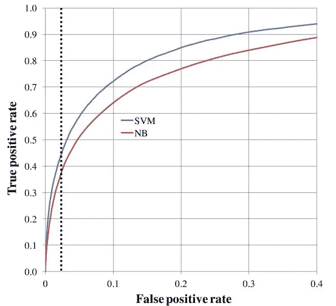
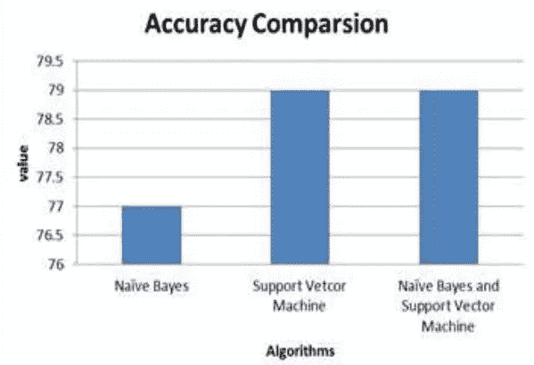

# 朴素贝叶斯(NB)-支持向量机(SVM):使用 Fast.ai 的最新结果实践指南

> 原文：<https://pub.towardsai.net/naive-bayes-support-vector-machine-svm-art-of-state-results-hands-on-guide-using-fast-ai-13b5d9bea3b2?source=collection_archive---------0----------------------->

## 融合 NB 和 SVM | [走向 AI](https://towardsai.net)

## 具有 NB 特征的 SVM:最先进的性能模型差异



**在进入 NB 和 SVM 的模型变体之前，将讨论 NB 什么时候表现得比 SVM 更好，这解释了使用 NBSVM 的原因**

NB 和 SVM 有不同的选项，包括为每一个选择核函数。**它们都对参数优化敏感(即不同的参数选择会显著改变它们的输出)。**所以，如果你有一个结果显示 NB 比 SVM 表现更好。这只适用于选定的参数。然而，对于另一个参数选择，你可能会发现 SVM 表现更好。



NB 和 SVM 的变体通常被用作文本分类的基线方法，但是它们的性能根据模型变体、所使用的特征和任务/数据集而有很大不同。基于这些观察，您可以确定简单的 NB 和 SVM 变体，它们在文本数据集上的表现优于大多数已发布的结果，有时会提供新的最先进的性能水平。

# **现在，讨论 NBSVM 背后的数学原理，它是如何推导出来的。**

设 f (i) ∈ R |V |是标签为 y(I)∈{-1，1}的训练情况 I 的特征计数向量。v 是特征的集合，f (i) j 表示特征 Vj 在训练案例 I 中的出现次数

计数向量公式为 P = α +总和(i:y (i))=1。

f (i)和 Q = α +总和(I:y(I))= 1。这里 f (i)用于平滑参数α。

对数计数比是:r = log (p/||p||1 ) /(q/||q||1)

**多项朴素贝叶斯(MNB)**

在 MNB，x (k) = f (k)，w = r，b = log(N+/N)。N+和 N-是正训练案例和负训练案例的数量。

然而，发现二值化 f (k)更好。让我们取 x(k)=ˇf(k)= 1 { f(k)> 0 }，其中 1 是指示函数。ˇp，ˇq，ˇr 是用ˇf (i)而不是 f(I)计算的

**支持向量机(SVM)**

对于 SVM，x(k)= f(k)和 w，b 通过最小化得到

wT w + C 总和 i ( max(0，1y(I)(wTˇf(I)+b))2)

在这里 L2 正则化的 L2 损失 SVM 是用来工作最好的和 L1 损失 SVM 不太稳定。

# **具有 NB 特征的 SVM(nbs VM)**

除了使用 x(k)= > f(k)之外，其他方面与 SVM 相同，

其中 f(k)= r * f(k)是元素间的乘积。虽然这对于长文档非常有效，但现在您可以发现，MNB 和 SVM 之间的插值对于所有文档都表现出色，并使用此模型找到结果:

w0 =(1β)w+βw(4)其中 w = ||w||1/|V |

以上是 w 的平均星等，β ∈ [0，1]是插值参数。这种插值可以看作是正则化的一种形式:信任 NB，除非 SVM 非常有信心。

现在让我们开始实现，这里我使用 IMDB 数据集 fast.ai NVSVM 将电影评论分为正面和负面类别

**第一步:**

标记化和术语文档矩阵创建

```
PATH='data/aclImdb/'
names = ['neg','pos']%ls {PATH}aclImdb_v1.tar.gz  imdbEr.txt  imdb.vocab  models/  README  test/  tmp/  train/%ls {PATH}trainaclImdb/  all_val/         neg/  tmp/    unsupBow.feat  urls_pos.txt
all/      labeledBow.feat  pos/  unsup/  urls_neg.txt   urls_unsup.txt%ls {PATH}train/pos | headtrn,trn_y = texts_labels_from_folders(f'**{PATH}**train',names)
val,val_y = texts_labels_from_folders(f'**{PATH}**test',names)
```

这是第一次审查的文本

```
trn[0]" A formal orchestra audience is turned into an insane, violent mob by the crazy chantings of it's singers. Unfortunately it stays absurd the WHOLE time with no general narrative eventually making it just too off putting. Even those from the era should be turned off. The cryptic dialogue would make Shakespeare seem easy to a third grader. On a technical level it's better than you might think with some good cinematography by future great Vilmos Zsigmond. Future stars Sally Kirkland and Frederic Forrest can be seen briefly."trn_y[0]0
```

**第二步:**

`[**CountVectorizer**](http://scikit-learn.org/stable/modules/generated/sklearn.feature_extraction.text.CountVectorizer.html)`将一组文本文档转换成一个令牌计数矩阵(是`**sklearn.feature_extraction.text**`的一部分)。

```
veczr = CountVectorizer(tokenizer=tokenize)
```

`fit_transform(trn)`在训练集中查找词汇。它还将训练集转换为术语-文档矩阵。现在让我们将*相同的转换*应用到验证集，第二行只使用了方法`transform(val)`。`trn_term_doc`和`val_term_doc`是稀疏矩阵。`trn_term_doc[i]`表示训练文档 I，并且它包含词汇表中每个单词的每个文档的单词计数。

```
trn_term_doc = veczr.fit_transform(trn)
val_term_doc = veczr.transform(val)
trn_term_doc<25000x75132 sparse matrix of type '<class 'numpy.int64'>'
	with 3749745 stored elements in Compressed Sparse Row format>trn_term_doc[0]<1x75132 sparse matrix of type '<class 'numpy.int64'>'
	with 93 stored elements in Compressed Sparse Row format>vocab = veczr.get_feature_names(); vocab[5000:5005]['aussie', 'aussies', 'austen', 'austeniana', 'austens']w0 = set([o.lower() **for** o **in** trn[0].split(' ')]); w0len(w0)
```

92

```
veczr.vocabulary_['absurd']
```

1297

**第三步:**

**现在定义朴素贝叶斯**

在此定义每个单词的**对数计数率**，

$ r = \ log \ frac { \ text { feature $ f $在正文档中的比率} } { \ text { feature $ f $在负文档中的比率}}$

其中肯定文档中特征的比率是肯定文档具有特征的次数除以肯定文档的数量。

```
**def** pr(y_i):
    p = x[y==y_i].sum(0)
    **return** (p+1) / ((y==y_i).sum()+1)x=trn_term_doc
y=trn_yr = np.log(pr(1)/pr(0))
b = np.log((y==1).mean() / (y==0).mean())
```

下面是朴素贝叶斯的公式。

```
pre_preds = val_term_doc @ r.T + b
preds = pre_preds.T>0
(preds==val_y).mean()0.80691999999999997
```

**二值化的朴素贝叶斯。**

```
x=trn_term_doc.sign()
r = np.log(pr(1)/pr(0))pre_preds = val_term_doc.sign() @ r.T + b
preds = pre_preds.T>0
(preds==val_y).mean()0.83016000000000001
```

# 第四步:逻辑回归

此处拟合逻辑回归，其中特征是单字。

```
m = LogisticRegression(C=1e8, dual=**True**)
m.fit(x, y)
preds = m.predict(val_term_doc)
(preds==val_y).mean()0.85504000000000002m = LogisticRegression(C=1e8, dual=**True**)
m.fit(trn_term_doc.sign(), y)
preds = m.predict(val_term_doc.sign())
(preds==val_y).mean()0.85487999999999997
```

**规则化版本**

```
m = LogisticRegression(C=0.1, dual=**True**)
m.fit(x, y)
preds = m.predict(val_term_doc)
(preds==val_y).mean()0.88275999999999999m = LogisticRegression(C=0.1, dual=**True**)
m.fit(trn_term_doc.sign(), y)
preds = m.predict(val_term_doc.sign())
(preds==val_y).mean()0.88404000000000005
```

# 步骤 5:具有 NB 特征的三元模型

我们的下一个模型是带有朴素贝叶斯特征的逻辑回归版本。对于每个文档，现在如上所述计算二值化特征，但是这次也使用二元模型和三元模型。每个特征都是对数计数比。然后训练逻辑回归模型来预测情绪。

```
veczr =  CountVectorizer(ngram_range=(1,3), tokenizer=tokenize, max_features=800000)
trn_term_doc = veczr.fit_transform(trn)
val_term_doc = veczr.transform(val)trn_term_doc.shape(25000, 800000)vocab = veczr.get_feature_names()vocab[200000:200005]['by vast', 'by vengeance', 'by vengeance .', 'by vera', 'by vera miles']y=trn_y
x=trn_term_doc.sign()
val_x = val_term_doc.sign()r = np.log(pr(1) / pr(0))
b = np.log((y==1).mean() / (y==0).mean())
```

**步骤 6:这里拟合正则化逻辑回归，其中特征是三元模型。**

```
m = LogisticRegression(C=0.1, dual=**True**)
m.fit(x, y);preds = m.predict(val_x)
(preds.T==val_y).mean()0.90500000000000003np.exp(r)matrix([[ 0.94678,  0.85129,  0.78049, ...,  3\.     ,  0.5    ,  0.5    ]])
```

然后拟合正则化的逻辑回归，其中特征是三元模型的对数比。

```
x_nb = x.multiply(r)
m = LogisticRegression(dual=**True**, C=0.1)
m.fit(x_nb, y);val_x_nb = val_x.multiply(r)
preds = m.predict(val_x_nb)
(preds.T==val_y).mean()
```

0.91768000000000005

# 第七步:fast.ai NBSVM

```
sl=2000*# Here is how the model looks from a bag of words*
md = TextClassifierData.from_bow(trn_term_doc, trn_y, val_term_doc, val_y, sl)learner = md.dotprod_nb_learner()
learner.fit(0.02, 1, wds=1e-6, cycle_len=1)A Jupyter Widget[ 0\.       0.0251   0.12003  0.91552]learner.fit(0.02, 2, wds=1e-6, cycle_len=1)A Jupyter Widget[ 0\.       0.02014  0.11387  0.92012]                         
[ 1\.       0.01275  0.11149  0.92124]learner.fit(0.02, 2, wds=1e-6, cycle_len=1)A Jupyter Widget[ 0\.       0.01681  0.11089  0.92129]                           
[ 1\.       0.00949  0.10951  0.92223]
```

该 NBSVM 实现了 0.92129 的精度。

相同的 NBSVM 可以用来解决其他基于 NLP 的问题，但不同的特征工程需要进行实验，以获得最先进的结果，我在 Kaggle 毒性评论分类中获得了前 8%。

非常感谢你的阅读，希望你喜欢。