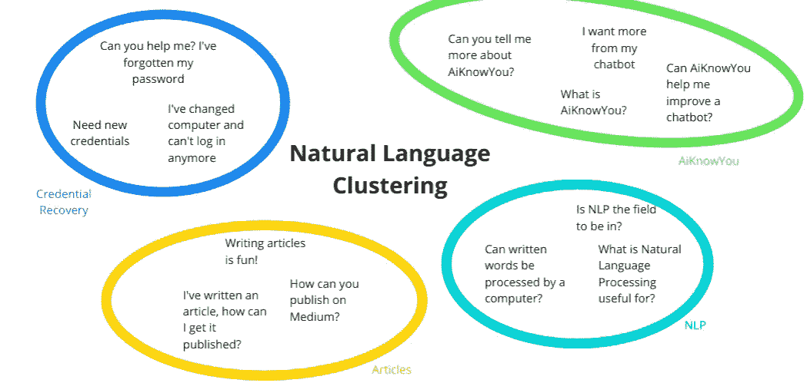
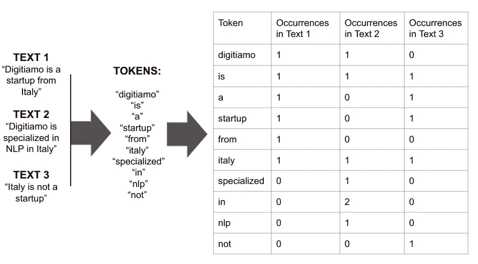
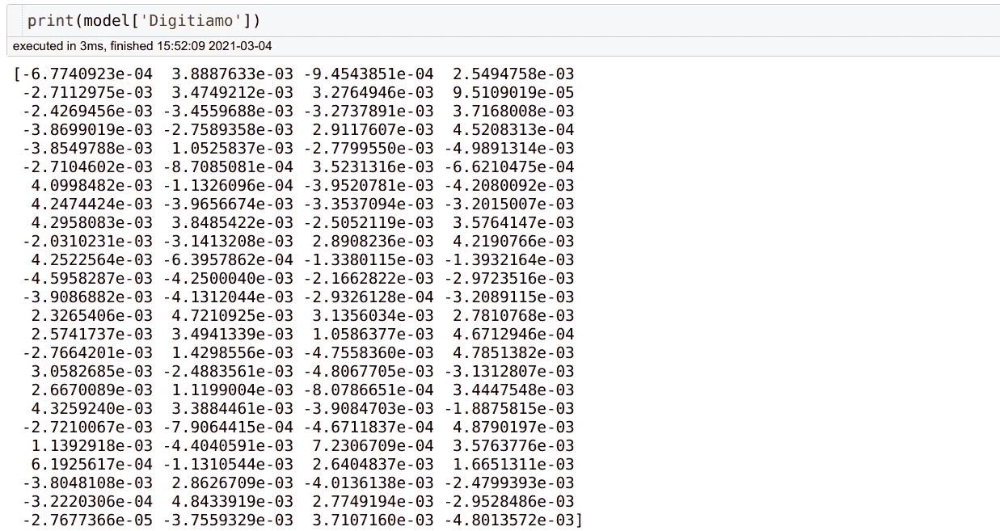
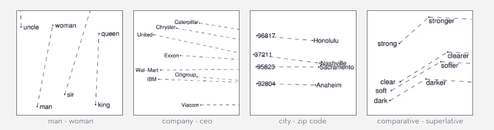
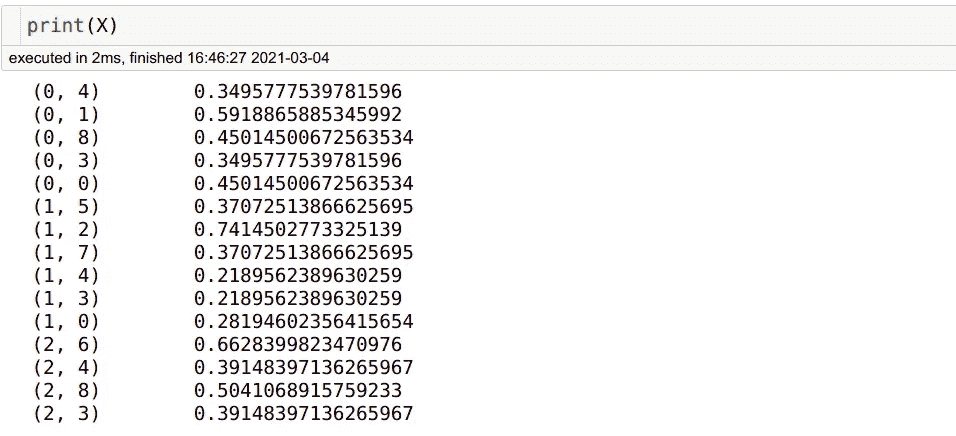
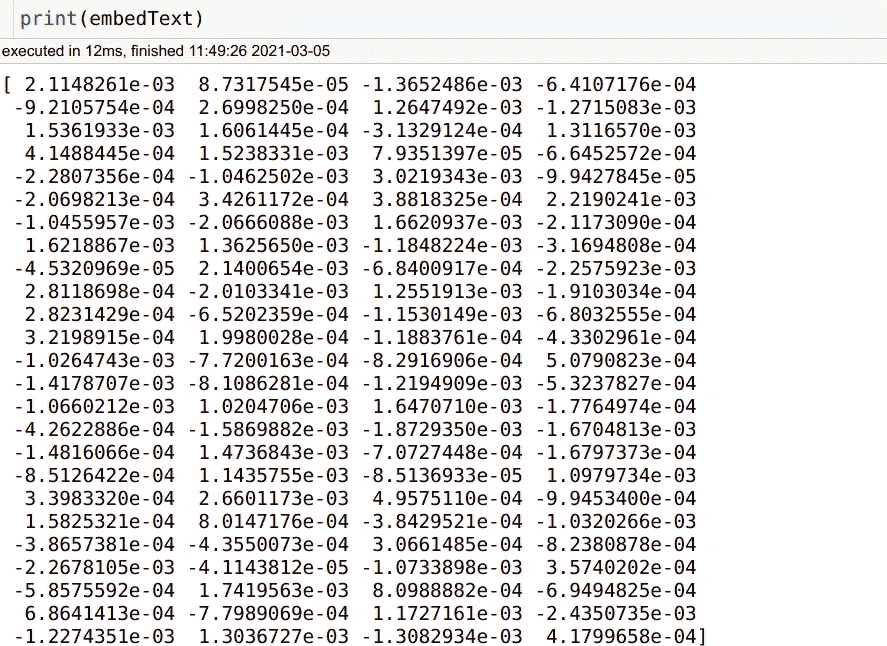

# 自然语言聚类—第 1 部分

> 原文：<https://pub.towardsai.net/natural-language-clustering-part-1-32301e3125e5?source=collection_archive---------2----------------------->

## [自然语言处理](https://towardsai.net/p/category/nlp)

## 帮助聊天机器人处理常见问题，使用 Python 代码进行标记化，GloVe 和 TF-IDF

对事物进行分类对我们来说很自然:我们的书籍、电影和音乐都有流派；我们学习的东西被分成不同的科目，甚至我们吃的食物也属于不同的菜系！
近年来，我们已经能够开发出越来越好的算法来对文本进行分类:像伯特-ITPT-FiT (BERT +任务内预训练+微调)或 XL-NET 这样的模型似乎是这一领域的卫冕冠军，至少在 PapersWithCode 上提供的 [29 个基准数据集](https://paperswithcode.com/task/text-classification)中是如此。

近年来，我们已经能够开发出越来越好的算法来对文本进行分类:像伯特-ITPT-FiT (BERT +任务内预训练+微调)或 XL-NET 这样的模型似乎是这一类别中的卫冕冠军，至少在 PapersWithCode 上提供的 [29 个基准数据集](https://paperswithcode.com/task/text-classification)中是如此。



作者图片

但是如果我们不知道我们想要分析的文本的可用类别呢？例如，一组对话或一组书籍或文章都属于同一主题的不同专业:标签并不总是像垃圾邮件/非垃圾邮件一样清晰，我们可能不知道会有多少或什么类型的标签，或者正常的预先训练的分类方法不具备将它们分类为相同类别所需的深入领域知识，同时没有足够的材料、时间或计算能力可用于[微调](https://huggingface.co/transformers/custom_datasets.html)转换模型。

也许最明显的例子之一是将收到的消息分类到 FAQ 中:不是每条消息都可以通过 FAQ 得到回答，但是我们希望将尽可能多的正确答案关联起来，以最小化我们留下的未回答或手动解决的数量，并动态地改进我们的 FAQ，添加变得相关的新问题。

让我们看看如何！

# 从单词到数值:标记化和嵌入

我们要做的第一件事，就像处理自然语言时一样，是将文本转换成我们的算法可以理解的东西。段落和句子在一个叫做记号化的过程中被分解成它们的基本成分，单词。但是单词本身不能被输入计算模型，因为数学运算不能应用于它们，这解释了将它们映射到实数向量的需要:基本上转换成在数学空间中表示它们的数字序列，还保留它们之间的关系(这个过程被称为[单词嵌入](https://en.wikipedia.org/wiki/Word_embedding)，这个术语来自[数学](https://en.wikipedia.org/wiki/Embedding)以识别内射和结构保留映射)。

这听起来很复杂，但有一些简单的方法可以做到这一点，如下所示:从三个句子(左侧)开始，提取它们的标记，并通过计算每个标记(单词)在原始文本中的出现次数来执行非常简单的嵌入(右侧)



三篇短文本的标记化和简单计数向量嵌入。

在上面的示例中，单词 startup 被嵌入为[1，0，1]，因为它在第一个和第三个文本中出现过一次，但在第二个文本中没有出现，而单词“In”被嵌入为[0，2，0]，因为它只在第二个句子中出现了两次。

请注意，这不是一个非常实用的示例:由于输入数量很少，不同的单词最终具有相同的嵌入(例如，“specialized”和“in”都只出现在第二个文本中，因此它们共享相同的嵌入[0，1，0])，但我们希望它能帮助您更好地理解该过程是如何工作的。

还要注意，记号都是小写的，标点符号被去掉了:这是常见的做法，尽管这取决于我们要处理的文本类型。

上例中没有显示的另一个常见做法是删除停用词，这些词太常见了，与我们的目的不相关，而且很可能在我们遇到的大多数文本中大量出现(如“a”、“the”或“is”)。

然而，这种方法提供了在嵌入单词的同时嵌入文档本身的优势:垂直阅读表格，Text1 可以读作[1，1，1，1，1，0，0，0]。这使得通过引入距离度量来面对不同的源变得容易。

## 使用 nltk 的 Python 中的标记化代码示例:

```
# !pip install nltkfrom nltk.tokenize import word_tokenizetext = "Digitiamo is a Startup from Italy"tokenized_text = nltk.word_tokenize(text)print(tokenized_text)# OUTPUT:
# ['Digitiamo', 'is', 'a', 'Startup', 'from', 'Italy']
```

## 使用 gensim 的 Word2Vec 在 Python 中嵌入代码示例

```
# !pip install --upgrade gensimfrom gensim.models import Word2Vec
model = Word2Vec([tokenized_text], min_count=1)
"""
 **min_count** (*int, optional*) – Ignores all words with total frequency lower than this.Word2Vec is optimized to work with multiple texts at the same time in the form of a list of texts. When working with a single text, it should be put into a list, which explains the square brackets around tokenized_text 
"""print(list(model.wv.vocab))# OUTPUT:
# ['Digitiamo', 'is', 'a', 'Startup', 'from', 'Italy']
```



显示单词的嵌入。Word2Vec 的默认参数使用 100 维嵌入

# 常用嵌入:TF-IDF 和 GloVe

*   [**TF-IDF**](https://en.wikipedia.org/wiki/Tf%E2%80%93idf) 代表**T**erm**F**frequency—**I**n reverse**D**document**F**frequency，它根据每个术语在语料库的其他文本中出现的次数来强调其重要性。出于集群化的目的，将文本嵌入专门的领域是非常有用的。出现在每个文档中的单词，无论它们在日常使用中多么不频繁，都将被赋予很小的权重，而只出现在某些文档中的单词将被赋予更大的权重，从而更容易识别可能的聚类。
    例如，如果我们试图嵌入一堆关于内分泌学的论文，单词“endocrinology”本身可能会在每篇论文中被多次提及，这使得它的存在对于区分它们的目的没有太大帮助。
*   [**GloVe**](https://nlp.stanford.edu/projects/glove/)(**Glo**bal**Ve**ctors for word representation)是一种无监督算法，它根据单词出现的频率来链接单词，试图映射潜在的含义。你可以在下面的图片中看到一些通过 GloVe 获得的单词之间关系的例子:“男人”与“女人”的距离大约与“国王”与“王后”的距离相同，因为它们对不同性别具有相同的含义(当然反之亦然)。同样的情况也发生在第四个面板中的比较级和最高级上:将你从“清晰”带到“更清晰”的向量，如果应用于“柔和”，会将你带到“更柔和”。
    根据你的语料库的大小，[**Mittens**library](https://github.com/roamanalytics/mittens)可能是 GloVe 的一个很好的补充:根据他们的 GitHub，它“对于需要专门表示但缺乏足够数据来从头训练它们的领域很有用。Mittens 从通用的预训练表示开始，并将它们调整到专门的领域”，它也与 Numpy 和 TensorFlow 兼容。



(图片来自官方手套来源:[https://nlp.stanford.edu/projects/glove/](https://nlp.stanford.edu/projects/glove/))

太棒了。既然我们已经将单词转换成数字向量，并将它们映射到空间上，如果我们使用的嵌入只适用于单词而不适用于全文，那么是时候回到句子了:还记得我们最初的目标吗？我们不只是想映射单词，而是试图将它们所在的文本或句子聚集在一起。

有许多方法可以做到这一点，根据具体情况，有些方法可能比其他方法更有效。也许最简单的方法，也是对短文本非常有效的方法，是对文本中每个单词的嵌入进行平均，以生成整个文本的嵌入。

对于较长的材料，另一种方法是提取关键字，然后对这些关键字的嵌入进行平均，以确保您的平均值不会被无数的常见单词稀释，但这需要一种关键字提取算法，该算法可能并不总是可用。

## 使用 sklearn 的 Python 中的 Tf-Idf 代码示例

```
from sklearn.feature_extraction.text import TfidfVectorizercorpus = [
    'Digitiamo is a Startup from Italy',
    'Digitiamo is specialized in NLP in Italy',
    'Italy is not a Startup'
]vectorizer = TfidfVectorizer()X = vectorizer.fit_transform(corpus)print(vectorizer.get_feature_names())
print(X.shape)# OUTPUT: 
# ['digitiamo', 'from', 'in', 'is', 'italy', 'nlp', 'not',  'specialized', 'startup']
# (3, 9)# get_feature_names returns the dictionary of words, whereas X.shape # is 3x9: 3 documents, 9 different words. The word ‘a’ has been stopped.
```



得到的训练模型。Word 是倒着打印的，可以在上面的 get_feature_names 列表中看到，所以 first row (0，4)表示第一个文本的最后一个单词，也就是列表中的第五个(4+1，我们从零开始数):“italy”。(0，1)是“从”；(0，8)“启动”等等。

## 在 Python 中使用手套([来源](https://stackoverflow.com/questions/37793118/load-pretrained-glove-vectors-in-python))

一旦你从[官方来源](https://nlp.stanford.edu/projects/glove/)下载了一个手套嵌入，你就可以如下所示使用它(归功于[卡里什马·马尔坎](https://stackoverflow.com/users/2857133/karishma-malkan)

```
import numpy as np

def loadGloveModel(File):
    print("Loading Glove Model")
    f = open(File,'r')
    gloveModel = {}
    for line in f:
        splitLines = line.split()
        word = splitLines[0]
        wordEmbedding = np.array([float(value) for value in splitLines[1:]])
        gloveModel[word] = wordEmbedding
    print(len(gloveModel)," words loaded!")
    return gloveModel
```

然后，您可以通过简单地使用 gloveModel 变量来访问单词 vectors。

```
print gloveModel['hello']
```

或者，您可以使用如下所示的 **Pandas** 加载文件(归功于 [Petter](https://stackoverflow.com/users/116186/petter) )

```
import pandas as pd
import csvwords = pd.read_table(glove_data_file, sep=" ", index_col=0, header=None, quoting=csv.QUOTE_NONE)
```

然后得到一个单词的向量:

```
def vec(w):
  return words.loc[w].as_matrix()
```

为了找到最接近矢量的单词:

```
words_matrix = words.as_matrix()

def find_closest_word(v):
  diff = words_matrix - v
  delta = np.sum(diff * diff, axis=1)
  i = np.argmin(delta)
  return words.iloc[i].name
```

该文件也可以使用如下所示的 **gensim** 打开(归功于 [Ben](https://stackoverflow.com/users/8514366/ben) )，这可能是最好的方法，因为它与我们在本文中之前看到的其他方法一致，并且允许您使用 gensim [word2vec](https://radimrehurek.com/gensim/models/word2vec.html) 方法(例如，相似性)

使用 [glove2word2vec](https://radimrehurek.com/gensim/scripts/glove2word2vec.html) 将文本格式的手套向量转换为 word2vec 文本格式:

```
from gensim.scripts.glove2word2vec import glove2word2vec
glove2word2vec(glove_input_file="vectors.txt", word2vec_output_file="gensim_glove_vectors.txt")
```

最后，使用 [KeyedVectors](https://radimrehurek.com/gensim/models/keyedvectors.html) 将 word2vec txt 读取到 gensim 模型中:

```
from gensim.models.keyedvectors import KeyedVectors
glove_model = KeyedVectors.load_word2vec_format("gensim_glove_vectors.txt", binary=False)
```

## 平均单词嵌入以获得文本嵌入

```
import re
from gensim.models import Word2Vectext = 'Digitiamo is a Startup from Italy'tokenized_text = nltk.word_tokenize(text)model = Word2Vec([tokenized_text], min_count=1)modelledText = []
for word in text.split():
    word = re.sub(r'[^\w\s]','',word)
    # remove punctuation
    modelledText.append(model[word])embedText = sum(modelledText) / len(modelledText)
# The embeddings are vectors, so the can be added and dividedprint(embedText)
```



整个句子的结果(平均)嵌入向量

现在我们终于得到了文本的嵌入，我们可以将它们聚集起来，就像它们是普通的数字数据条目一样！

要了解关于一些可用的集群技术的更多信息，请阅读本文的第二部分，即将推出！如果你想在它出版时得到通知，通过滑动下面的工具订阅我们的时事通讯(就像 iPhone 解锁一样)

想了解我们最新发布的产品吗？上面订阅！别担心，我们会谨慎使用:)

通过利用和完善本文中解释的技术，我们开发了 [AiKnowYou](https://it.digitiamo.com/aiknowyou) ，这是一款分析和改进聊天机器人性能的产品。如果你想更好地了解它是如何工作的，或者如果你想提高你自己的聊天机器人的性能，请随时联系我们

*感谢您的阅读！*


Digitiamo 徽标

## 关于 Digitiamo

Digitiamo 是一家来自意大利的初创公司，专注于使用人工智能来帮助公司管理和利用他们的知识。要了解更多信息，[请访问我们的](https://www.digitiamo.com/)。

## 关于作者

[*法比奥·丘萨诺*](https://medium.com/u/56f43ec01c1e?source=post_page-----576ed5f7988b--------------------------------) *是*[*Digitiamo*](https://www.digitiamo.com/)*的数据科学负责人；* [*弗朗切斯科·福马加利*](https://medium.com/u/ec9f76d504e0?source=post_page-----576ed5f7988b--------------------------------)是一名有抱负的数据科学家，正在做 R & D 实习。