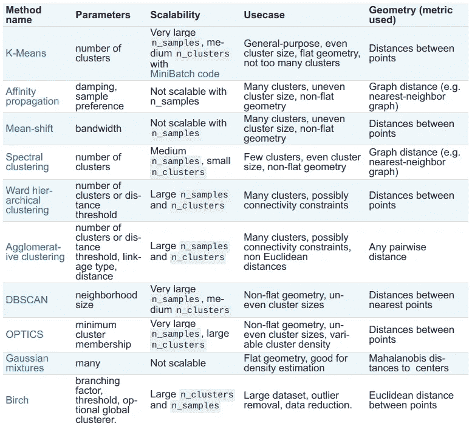
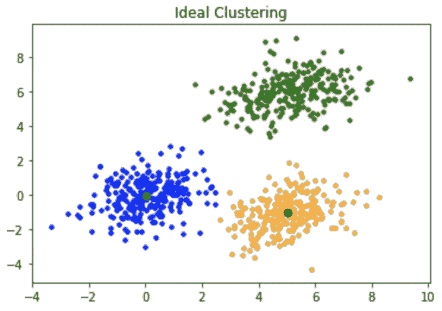
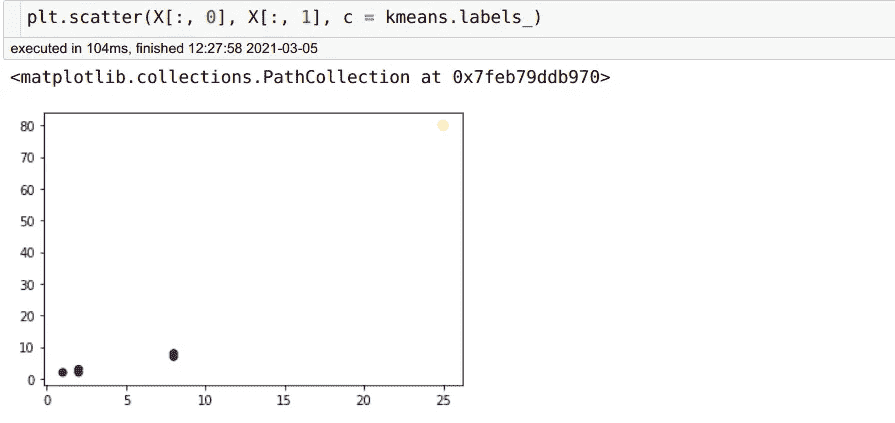
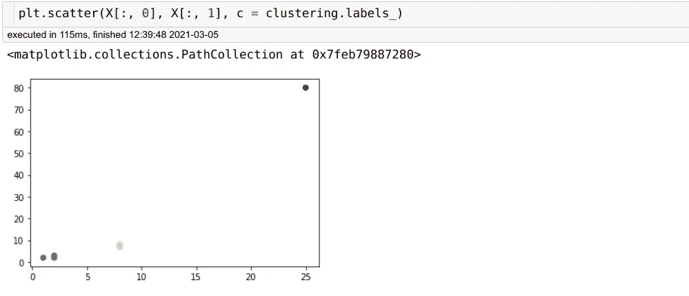
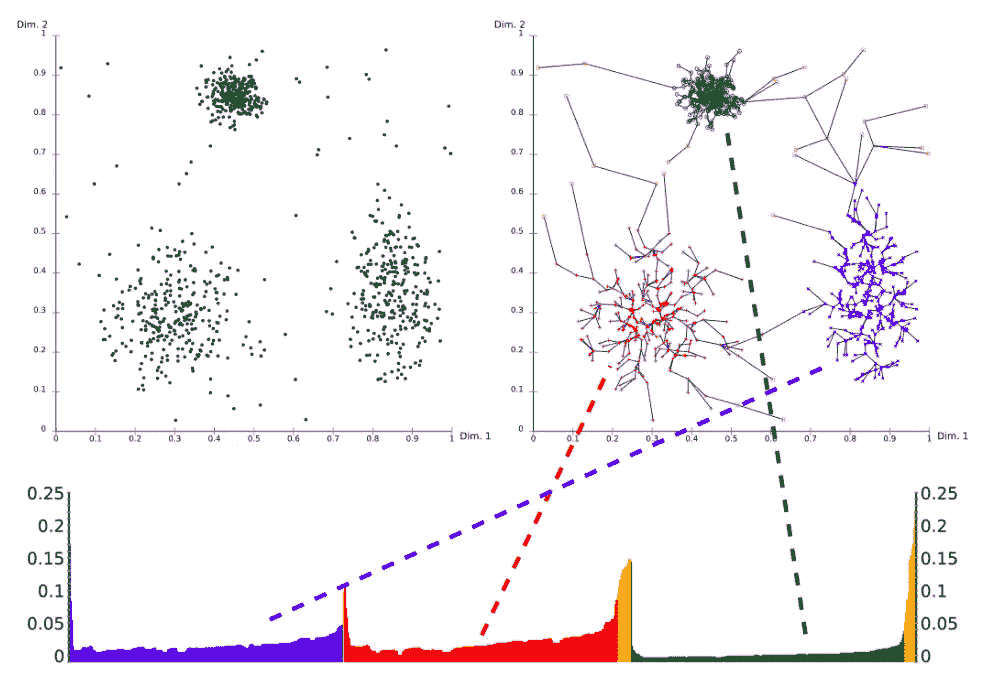
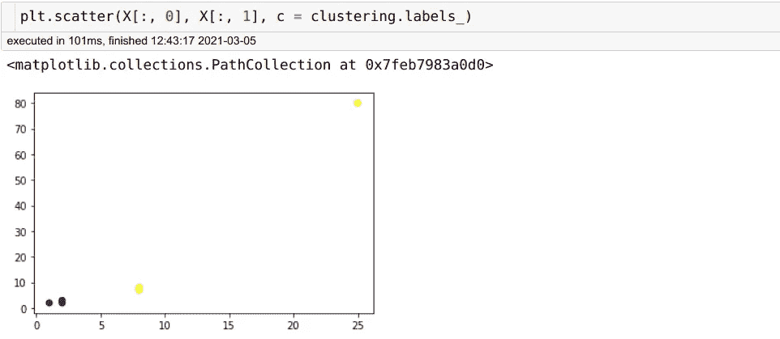

# 自然语言聚类—第二部分

> 原文：<https://pub.towardsai.net/natural-language-clustering-part-2-3d2f93cc0eaa?source=collection_archive---------2----------------------->

## [自然语言处理](https://towardsai.net/p/category/nlp)

## K-Means，高斯混合，DBSCAN 和 OPTICS 比较，带 Python 代码示例

我们一直在研究如何聚类文本，当没有足够的数据、时间或计算能力来[微调](https://huggingface.co/transformers/custom_datasets.html)变压器模型时，这对于常见问题解答和文本分类很有用。

在第一部分([此处可用](/natural-language-clustering-part-1-32301e3125e5))我们已经看到了如何通过标记化和嵌入将文本转化为数字向量。现在我们的文本是机器可读的格式，我们可以处理我们的主要目标:聚类它们。

# 聚类方法



一些可用的聚类方法—图片来自 scikit-learn 库[文档](https://scikit-learn.org/stable/modules/clustering.html)

聚类是最有用的[无监督学习](https://en.wikipedia.org/wiki/Unsupervised_learning)任务之一，因此多年来已经开发了许多不同的方法来完成它。我们将简要说明我们尝试过的方法，比较它们的理论优缺点和我们的第一手经验。不幸的是(正如[没有免费的午餐定理](https://en.wikipedia.org/wiki/No_free_lunch_theorem)所证明的),当在所有指标上进行比较时，没有一个算法比其他任何一个算法客观地执行得更好，因此最佳选择取决于您的使用案例和可用资源的具体情况。

# k 均值



k 均值聚类的一个例子，质心是黑点。[来源:GeeksForGeeks](https://www.geeksforgeeks.org/ml-k-means-algorithm/)

也许是最著名的聚类算法，它是基于[质心的](https://en.wikipedia.org/wiki/Cluster_analysis#Centroid-based_clustering)，需要预先确定聚类的数量，这是它的主要缺点之一。也只有[保证找到](https://stats.stackexchange.com/questions/48757/why-doesnt-k-means-give-the-global-minimum)局部最优解(可能是也可能不是全局最优解)，因此需要多次随机初始化来找到最佳结果，并且总是聚类所有数据点，如果您希望您的算法让更多中间结果不被聚类，这是一个次优的解决方案(例如，在 FAQ 相关的场景中:我们宁愿让任何 FAQ 都无法回答的问题不被聚类，这样它们更容易识别和管理，而不是提供错误的答案)。
它通常比下面引用的其他方法更快。

**我们使用 K-Means 的经验:**它对我们的目标没有太大作用:缺乏关于最佳聚类数的先验知识(尽管使用了[剪影和肘方法](https://www.datanovia.com/en/lessons/determining-the-optimal-number-of-clusters-3-must-know-methods/)来缓解这个问题)以及难以区分实际聚类和噪声通常会导致较差的性能。

## k-表示 Python 中的示例:

```
from sklearn.cluster import KMeans
import numpy as npX = np.array([[1, 2], [2, 2], [2, 3],
             [8, 7], [8, 8], [25, 80]])
kmeans = KMeans(n_clusters=2, random_state=0).fit(X)kmeans.labels_# OUTPUT:
# array([0, 0, 0, 0, 0, 1], dtype=int32)# k-means labels the first five points as cluster 0, the last one as cluster 1, as shown below
```



紫色点:集群 0；黄点:第一组

# 高斯混合模型(GMM)


来自两种不同高斯分布的数据。[来源:Scikit-Learn 文档](https://scikit-learn.org/stable/modules/mixture.html)

一个基于[分布的](https://en.wikipedia.org/wiki/Cluster_analysis#Distribution-based_clustering)算法，它基于[期望最大化](https://en.wikipedia.org/wiki/Expectation%E2%80%93maximization_algorithm)算法，该算法在高斯分布数据上运行良好。

> [人们可以将](https://scikit-learn.org/stable/modules/mixture.html#mixture)混合模型视为推广 K 均值聚类，以纳入有关数据协方差结构以及潜在高斯中心的信息

像 K-意味着它只找到局部最优解，高斯数必须预先指定，因此可能需要多次初始化来优化性能。

**我们使用高斯混合模型的经验:**通过设置相对较高数量的高斯分布，然后移除过于稀疏或过小的集群，我们能够分离出密度较高且彼此相距较远的特定集群，这对我们的任务非常有用。

## Python 中的 GMM 示例:

```
import numpy as np
from sklearn.mixture import GaussianMixtureX = np.array([[1, 2], [2, 2], [2, 3],
             [8, 7], [8, 8], [25, 80]])gm_labels = GaussianMixture(n_components=2, random_state=0).fit_predict(X)gm_labels# OUTPUT:
# array([0, 0, 0, 0, 0, 1])# gm identifies the first five points as cluster 0 and the last one as cluster 1gm = GaussianMixture(n_components=2, random_state=0).fit(X)gm.means_# OUTPUT:
# array([[ 4.2,  4.4],
       [25\. , 80\. ]])# by calling the fit method (instead of fit_predict) we obtain more information about the model, such as the means of the distributions
```


根据预测标签着色的点(紫色= 0；黄色= 1)和高斯分布的平均值(略大，红色)

# 基于密度的噪声应用空间聚类


[来源:维基百科](https://en.wikipedia.org/wiki/DBSCAN)

**D**en sity-**B**Based**S**partial**C**Clustering of**A**applications with**N**oise，顾名思义就是一种基于[密度的](https://blog.dominodatalab.com/topology-and-density-based-clustering/)聚类方法。它的主要参数(eps)是您设置的距离:基本上，彼此在该距离内的所有点都被识别为属于同一个聚类。所需的其他相关参数是距离度量和识别单独聚类所需的最小聚类数。
它有很多优点:不像 k-means 和 GMM，聚类的数目不需要先验确定；它可以找到任意形状的集群，并且对异常值具有鲁棒性。它的主要缺点是，鉴于其性质，它不能很好地聚类密度差异较大的数据集，这可能取决于我们正在处理的文本的质量和数量。

**我们使用 DBSCAN 的经验:**不同的主题可能有不同的密度，这一事实使它的表现次优:它大多找到了正确的主题，但许多文本没有正确聚类。光学(见下文)更适合我们正在处理的数据类型。

## Python 中的 DBSCAN 示例，来自 sklearn 文档:

```
from sklearn.cluster import DBSCAN
import numpy as npX = np.array([[1, 2], [2, 2], [2, 3],
             [8, 7], [8, 8], [25, 80]])clustering = DBSCAN(eps=3, min_samples=2).fit(X)clustering.labels_# OUTPUT:
# array([ 0,  0,  0,  1,  1, -1])# DBSCAN identifies the first three points belonging to cluster 0; the fourth and fifth belonging to cluster 1 and the last one alone in cluster -1
```



根据 DBSCAN 聚类着色的数据点

# 光学



对左上角的数据集运行光学系统的结果。下图:给出可达性距离的光学图。右上:聚类和聚类顺序(将每个点与其前一个点连接起来)。[来源:维基百科](https://en.wikipedia.org/wiki/OPTICS_algorithm)

**O**ordering**P**points**T**O**I**identify**C**Clustering**S**structure，一种基于密度的聚类方法，类似于 DBSCAN，但解决了在不同密度的数据中检测有意义的聚类的问题。鉴于其复杂性，它需要比 DBSCAN 更多的内存和计算能力。

**我们在光学方面的经验:**超参数微调非常敏感，微小的变化会导致巨大的集群化差异。我们只能在一些数据集上得到好的结果。

## Python 中的光学示例:

```
from sklearn.cluster import OPTICS
import numpy as npX = np.array([[1, 2], [2, 2], [2, 3],
             [8, 7], [8, 8], [25, 80]])clustering = OPTICS(min_samples=2).fit(X)clustering.labels_# OUTPUT:
# array([0, 0, 0, 1, 1, 1])# OPTICS identifies the first three points as belonging to cluster 0, the last three to cluster 1
```



根据光学聚类着色的数据点

# 概述

我们已经看到了一些在文本语料库中识别聚类的可用方法。

文本首先被标记化，然后被嵌入，然后聚类方法被应用于嵌入，该聚类方法是根据我们的数据的大小和形状以及可用的时间和计算资源来选择的。

这种方法比其他机器学习应用程序更少即插即用，需要投入一些时间和精力来找到最适合您特定用例的方法，但根据我们的经验，一旦正确设置，它可以在微调之前准确地聚类大约 40%的文本。请注意，即使在代码片段中提供的简单示例中，只有六个点进行聚类，也只有 K-Means 和 GMM 表现相同，而 DBSCAN 和 OPTICS 尽管方法相似，却给出了不同的结果。

虽然与人类水平的性能相差甚远，但在处理大量数据时，它可以节省大量时间。

通过利用和改进本文中介绍的技术，我们开发了 [AiKnowYou](https://it.digitiamo.com/aiknowyou) ，这是一款分析和改进聊天机器人性能的产品。如果您想更好地了解它是如何工作的，或者如果您想提高您自己的聊天机器人的性能，请随时联系我们:)

*感谢您的阅读！*

想了解我们最新发布的产品吗？上面订阅！别担心，我们会谨慎使用:)


Digitiamo 徽标

## 关于 Digitiamo

Digitiamo 是一家来自意大利的初创公司，专注于使用人工智能来帮助公司管理和利用他们的知识。要了解更多信息，请访问我们的。

## 关于作者

[*法比奥·丘萨诺*](https://medium.com/u/56f43ec01c1e?source=post_page-----576ed5f7988b--------------------------------) *是*[*Digitiamo*](https://www.digitiamo.com/)*的数据科学负责人；* [*弗朗西斯科·福马加利*](https://medium.com/u/ec9f76d504e0?source=post_page-----576ed5f7988b--------------------------------) *是一名有抱负的数据科学家，正在进行 R & D 实习。*