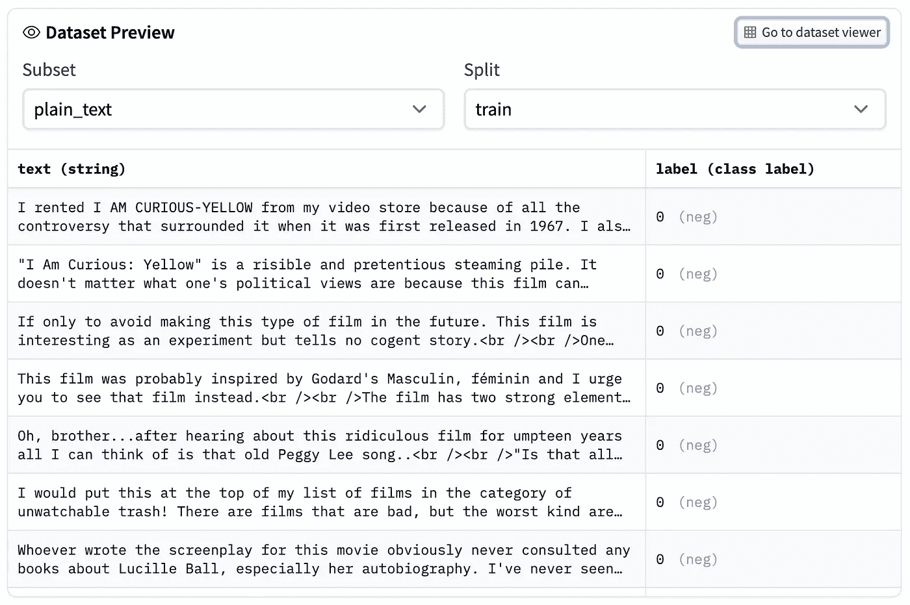

# 如何使用 Huggingface 数据集？流、指标、地图、连接等功能指南

> 原文：<https://pub.towardsai.net/natural-language-processing-6495c10a85cb?source=collection_archive---------1----------------------->

## [自然语言处理](https://towardsai.net/p/category/nlp)

*一个方便的库，可以加载数据集，轻松操作它们，并使用众所周知的指标实现来评估您的结果。*

图一。来自 Huggingface 数据集中心的屏幕截图显示了预览功能。

我使用 Huggingface 数据集库已经有一段时间了。不打算说谎，鉴于我使用其他库的内置数据集加载功能的经验，我起初持怀疑态度，但 Huggingface 做了一项顶级的工作。它提供了广泛的功能，让您可以轻松地加载大型数据集，操作它们，并评估您的工作。让我们仔细看看我在实验中发现有用的一些提到的要点。

# 加载数据集

第一步是展示如何加载数据集，以及是什么让这个库变得强大。`load_dataset()`函数负责几乎所有的事情。您可以使用它从 Hub 下载数据集，选择加载哪个分割(训练、验证、测试集)，甚至加载自定义数据集。以下代码演示了加载 CNN/DailyMail [1]数据集的不同方式。

代码 1。加载 CNN/DM 数据集。

`split`参数给你加载不同数据集组合的自由。例如，通过使用“+”像`train+validation`一样连接两个集合，或者像`train[:10%]`一样加载一定百分比的数据。阅读[文档](https://huggingface.co/docs/datasets/loading.html#slice-splits)查看所有选项及示例。

## 数据集中心

可以使用相同的`load_dataset`函数从 [CSV](https://huggingface.co/docs/datasets/loading.html#csv) 、 [JSON](https://huggingface.co/docs/datasets/loading.html#json) ，甚至[文本](https://huggingface.co/docs/datasets/loading.html#text-files)文件中加载数据。但是强烈建议搜索[中枢](https://huggingface.co/datasets)，除非是自定义数据集。您可以按特定任务、大小、语言和许可证进行过滤。只需从顶部复制数据集的名称，并将其传递给`path`参数。此外，预览部分(图 1)允许您在加载数据集之前查看一些示例和功能。

# 有用的功能

## 1.[流](https://huggingface.co/docs/datasets/stream.html)

训练最先进的模型通常需要大量数据。它甚至可以达到万亿字节！这甚至连下载数据集都有问题，更不用说将其加载到内存中了。该库通过设置`Stream=True`返回一个迭代对象，该选项将使您能够立即批量处理数据集，而不是等待下载过程完成。

代码 2。使用流选项。

## 2.[加载流行指标](https://huggingface.co/metrics)

你将有机会获得一些著名的自然语言处理(NLP)分数，如 BLEU，ROUGE，BERTScore 等。请记住，有些指标可能需要您安装额外的包，但是说明很清楚，很容易理解。比如想用胭脂分就需要安装`rouge_score`包。当您第一次尝试导入软件包时，会收到一个关于如何安装软件包的错误说明。下面的代码演示了如何使用`load_metric()`函数。([可用指标列表](https://huggingface.co/metrics))

代码 4。使用度量计算胭脂分数。

## 3.[测绘](https://huggingface.co/docs/datasets/package_reference/main_classes.html?highlight=map#datasets.Dataset.map)

显而易见，您可以使用`.map()`将函数应用于数据集。通过使用它的批处理实现，这是一个加速数据操作的好工具。

代码 4。使用 map 函数的示例代码

使用 map 函数的一个很好的例子是标记化过程，因为如果成批处理，它会快得多。上面的代码将把`tokenize()`函数映射到数据集，并将文章(输入)和突出显示(输出)标记化。它还将数据存储在 4 个名为`input_ids, attention_mask, labels, decoder_attention_mask`的新列中，模型将在训练过程中使用这些数据。映射功能也可以删除不必要的列。

## 4.连接多个数据集

众所周知，使用更多的数据可能会提高模型的性能。`concatenate_datasets()`函数将会做它所说的事情。我们应该确保两个数据集具有相同的列数、相同的名称和相同的顺序。在下面的示例代码中，我将合并 CNN/DailyMail 和 XSum 数据集。

代码 5。连接 CNN/DailyMail 和 XSum 数据集。

## 5.添加新列

诚然，向数据集添加新列可能不是一个非常有用的特性，但是我需要在我的一个实验中这样做，并且对`add_column()`函数的存在感到有点惊讶。您可以传递与数据集具有相同项数的列表。

代码 6。向数据集中添加新列。

还值得注意的是，Datasets 库不是为了与其他 Huggingface 库(如 Transformers)兼容而构建的。您可以轻松地进行所有您喜欢的操作，并获得 PyTorch 的 DataLoader 或 Tensorflow 的 dataset 对象以在您的训练/推理循环中使用。查看文档中的[样本代码](https://huggingface.co/docs/datasets/torch_tensorflow.html#setting-the-format)。

# 最后的话，

我可以说，在使用 Huggingface 的数据集库一段时间后，我感到惊喜。无论使用什么框架，您都可以在现有代码中轻松使用这个库，这一事实使它更加强大。这是 Huggingface 在他们所有的图书馆里做得很好的事情。

> 我每周给 NLP 的书呆子发一份时事通讯。如果您想了解自然语言处理的最新发展，可以考虑订阅。
> [阅读更多，订阅](https://nlpiation.github.io/) —加入酷孩子俱乐部，立即报名！

**参考文献**
【1】*赫尔曼，K. M .，科希斯基，t .，格雷芬斯特特，e .，埃斯佩霍尔特，l .，凯，w .，苏莱曼，m .，&布伦松，P. (2015)。教机器阅读和理解。神经信息处理系统进展，28。*