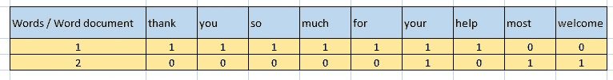

# 在 NLP 中从头开始构建单词袋(BOW)模型

> 原文：<https://pub.towardsai.net/natural-language-processing-a983bc35561?source=collection_archive---------2----------------------->

## [自然语言处理](https://towardsai.net/p/category/nlp)

## 自然语言处理中的文本表示模型


由[布雷特·乔丹](https://unsplash.com/@brett_jordan?utm_source=medium&utm_medium=referral)在 [Unsplash](https://unsplash.com?utm_source=medium&utm_medium=referral) 上拍摄的照片

在本文中，我们将讨论自然语言处理中的词袋(BOW)模型构建。有时，我们试图找到文本文档中出现的单词，并尝试使用简单的计数方法来搜索一个单词的计数。但是如果我们想知道每个单词在文本文档中的出现及其计数，那么我们使用 ***单词包*** 方法，也称为 ***单词嵌入*** 。

单词包用于从文本中提取信息，并试图用其字数将它们制作成字典或直方图。

让我们用下面这句话来举例:

```
Sentence 1: “Thank you so much for your help.”
Sentence 2: “ Your most welcome.”
```

在这些句子中，我们首先将它们分解成标记，并从句子中删除所有标点和符号，以建立模型，以便用算法进行进一步分析。

用字数做一个矩阵有简单的步骤。

```
Step 1: Make tokens from the sentences
Step 2: Lower all words
Step 3: make a matrix or dictionary with word counts
```



字数统计。作者的照片

在上面的照片中，我们可以清楚地看到，句子 1 和 2 中的单词数都显示了它们在句子中的出现次数。

现在，我们实际上要从头开始寻找这个单词包。

安装 NLTK 库和其他用于自然语言处理的库

```
import nltk
import re
```

现在，我们将阅读文本数据示例。

```
text = """Machine learning and robotic vision system combination
          opens a gateway for precision agriculture and enhances the
          quality of fruit harvesting applications. Study describes
          various challenges in the fruit agricultural process like
          weather, illumination variation and occlusion, etc.. 
          Currently fruit harvesting processes are manual with semi-
          advanced machinery. Many approaches use images that
          contain fruits to make more advanced vision system for 
          yield estimation analysis."""
```

是时候用文字做记号了。

```
token_data = nltk.sent_tokenize(text)
token_data#output:
['Machine learning and robotic vision system combination opens a gateway for precision \n           agriculture and enhances the quality of fruit harvesting applications. Study describes \n           various challenges in the fruit agricultural process like weather, illumination variation \n           and occlusion, etc..',
 'Currently fruit harvesting processes are manual with semi-advanced \n           machinery.',
 'Many approaches use images that contain fruits to make more advanced vision system \n           for yield estimation analysis.']
```

在输出中，很明显输出中有一些杂质和标点符号，我们需要删除它们。

我们还需要找到令牌的长度。

```
len(token_data)#output:
3
```

这意味着在原始数据中有 3 个句子。

为了移除这些，我们需要一个正则表达式(re)库，我们在开始时导入了这个库。

```
#to remove the extra non-wordsfor i in range(len(token_data)):
    token_data[i] = token_data[i].lower()
    token_data[i] = re.sub(r'\W',' ', token_data[i])
    token_data[i] = re.sub(r'\s+',' ', token_data[i])#output:
['machine learning and robotic vision system combination opens a gateway for precision agriculture and enhances the quality of fruit harvesting applications study describes various challenges in the fruit agricultural process like weather illumination variation and occlusion etc ','currently fruit harvesting processes are manual with semi advanced machinery ','many approaches use images that contain fruits to make more advanced vision system for yield estimation analysis ']
```

现在，我们得到了更清晰的数据，现在我们将制作这些单词的直方图或词典。

```
#creating the histogram or dictionary
word2count = {}
for data in token_data:
    words = nltk.word_tokenize(data)
    for word in words:
        if word not in word2count.keys():
            word2count[word] = 1
        else:
            word2count[word] += 1word2count#output:
{'machine': 1,
 'learning': 1,
 'and': 3,
 'robotic': 1,
 'vision': 2,
 'system': 2,
 'combination': 1,
 'opens': 1,
 'a': 1,
   ...
   ...
 'makemore': 1,
 'yield': 1,
 'estimation': 1,
 'analysis': 1}
```

正如我们所看到的，这是一个小例子，但如果我们必须进行文本分类并对数千个单词进行建模，那么我们必须从所有单词中提取出最常见的单词。

字数的总长度如下所示:

```
len(word2count)#output:
52
```

为了从 52 个单词中提取前 20 个最常用的单词，我们使用 heapq 库。

```
import heapqfreq_words = heapq.nlargest(20, word2count, key = word2count.get)
freq_words#output:
['and','fruit','vision','system','for','the','harvesting',
 'advanced','machine','learning','robotic','combination','opens',
 'a','gateway','precision','agriculture','enhances','quality','of']
```

现在，我们得到了文本文档中最常用的 20 个单词的列表。

[](/latest-programming-languages-for-ai-5252d39e1c51) [## 最新的人工智能编程语言

### 人工智能未来娱乐它的语言

pub.towardsai.net](/latest-programming-languages-for-ai-5252d39e1c51) [](/natural-language-processing-ea960ba12d42) [## 自然语言处理

### 用 Python 实现自然语言处理中的词干化和词汇化

pub.towardsai.net](/natural-language-processing-ea960ba12d42) 

我们将尝试将 freq_words 与原始数据进行匹配，以制作单词袋模型。

```
bow = []
for data in text:
    vector = []
    for word in freq_words:
        if word in nltk.word_tokenize(data):
            vector.append(1)
        else:
            vector.append(0)
    bow.append(vector)bow#output:
[[0, 0, 0, 0, 0, 0, 0, 0, 0, 0, 0, 0, 0, 0, 0, 0, 0, 0, 0, 0],
 [0, 0, 0, 0, 0, 0, 0, 0, 0, 0, 0, 0, 0, 1, 0, 0, 0, 0, 0, 0],
 [0, 0, 0, 0, 0, 0, 0, 0, 0, 0, 0, 0, 0, 0, 0, 0, 0, 0, 0, 0],
                        .........
 [0, 0, 0, 0, 0, 0, 0, 0, 0, 0, 0, 0, 0, 1, 0, 0, 0, 0, 0, 0],
 [0, 0, 0, 0, 0, 0, 0, 0, 0, 0, 0, 0, 0, 0, 0, 0, 0, 0, 0, 0],
 [0, 0, 0, 0, 0, 0, 0, 0, 0, 0, 0, 0, 0, 1, 0, 0, 0, 0, 0, 0]]
```

单词袋模型是一个列表的列表。但是为了我们的算法，我们需要把它做成一个数组矩阵。

```
import numpy as npbow = np.asarray(bow)bow#output:
array([[0, 0, 0, ..., 0, 0, 0],
       [0, 0, 0, ..., 0, 0, 0],
       [0, 0, 0, ..., 0, 0, 0],
       ...,
       [0, 0, 0, ..., 0, 0, 0],
       [0, 0, 0, ..., 0, 0, 0],
       [0, 0, 0, ..., 0, 0, 0]])
```

现在，这个输出是一个二维数组，对进一步建模很有用。

我希望你喜欢这篇文章。通过我的 [LinkedIn](https://www.linkedin.com/in/data-scientist-95040a1ab/) 和 [twitter](https://twitter.com/amitprius) 联系我。

# 推荐文章

[1。NLP —零到英雄用 Python](https://medium.com/towards-artificial-intelligence/nlp-zero-to-hero-with-python-2df6fcebff6e?sk=2231d868766e96b13d1e9d7db6064df1)
2。 [Python 数据结构数据类型和对象](https://medium.com/towards-artificial-intelligence/python-data-structures-data-types-and-objects-244d0a86c3cf?sk=42f4b462499f3fc3a160b21e2c94dba6)
3。[Python 中的异常处理概念](/exception-handling-concepts-in-python-4d5116decac3?source=friends_link&sk=a0ed49d9fdeaa67925eac34ecb55ea30)
4。[为什么 LSTM 在深度学习方面比 RNN 更有用？](/deep-learning-88e218b74a14?source=friends_link&sk=540bf9088d31859d50dbddab7524ba35)
5。[神经网络:递归神经网络的兴起](/neural-networks-the-rise-of-recurrent-neural-networks-df740252da88?source=friends_link&sk=6844935e3de14e478ce00f0b22e419eb)
6。[用 Python 充分解释了线性回归](https://medium.com/towards-artificial-intelligence/fully-explained-linear-regression-with-python-fe2b313f32f3?source=friends_link&sk=53c91a2a51347ec2d93f8222c0e06402)
7。[用 Python](https://medium.com/towards-artificial-intelligence/fully-explained-logistic-regression-with-python-f4a16413ddcd?source=friends_link&sk=528181f15a44e48ea38fdd9579241a78)
充分解释了 Logistic 回归 8。[concat()、merge()和 join()与 Python](/differences-between-concat-merge-and-join-with-python-1a6541abc08d?source=friends_link&sk=3b37b694fb90db16275059ea752fc16a)
9 的区别。[与 Python 的数据角力—第一部分](/data-wrangling-with-python-part-1-969e3cc81d69?source=friends_link&sk=9c3649cf20f31a5c9ead51c50c89ba0b)10。[机器学习中的混淆矩阵](https://medium.com/analytics-vidhya/confusion-matrix-in-machine-learning-91b6e2b3f9af?source=friends_link&sk=11c6531da0bab7b504d518d02746d4cc)