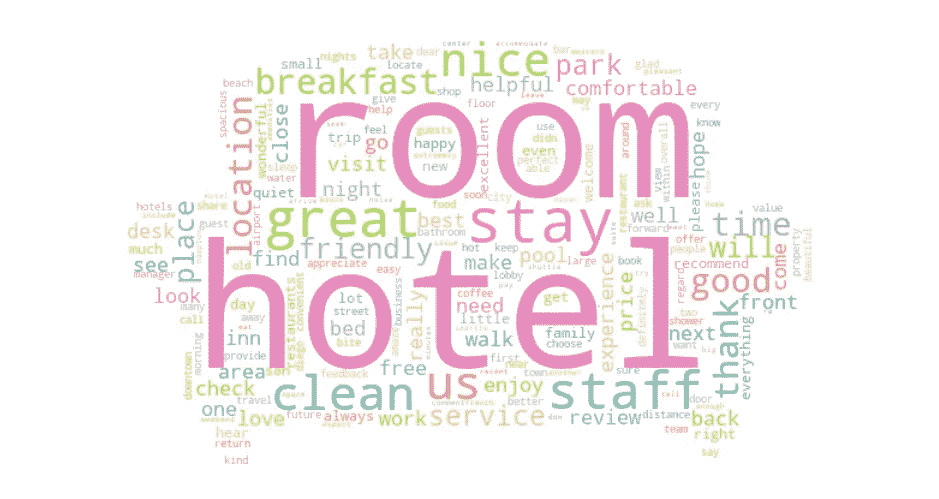
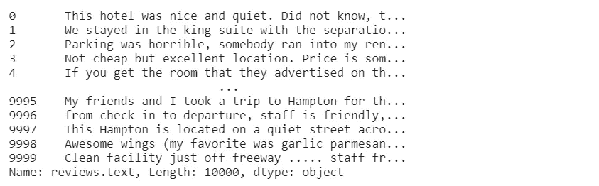
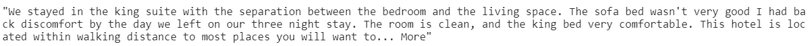
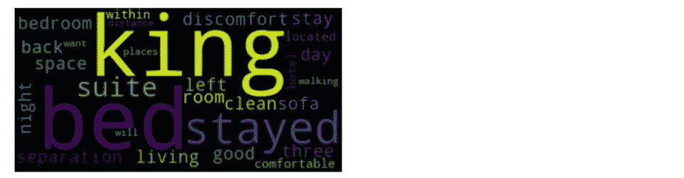
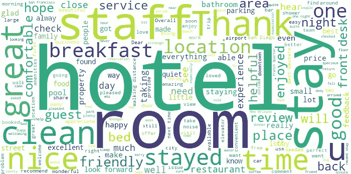
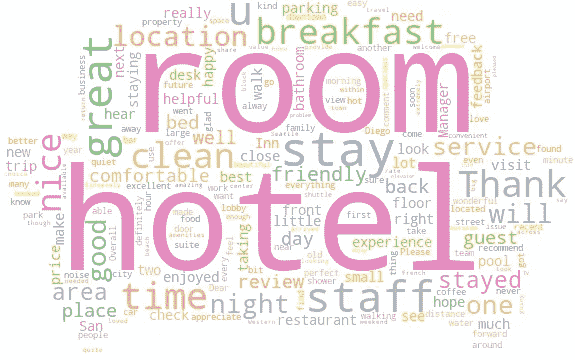
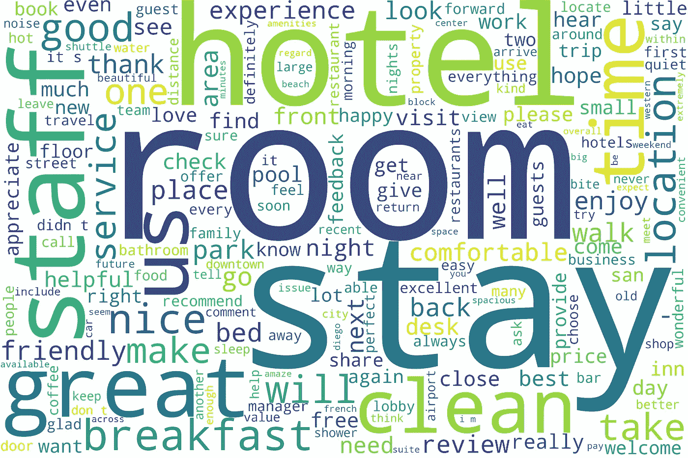
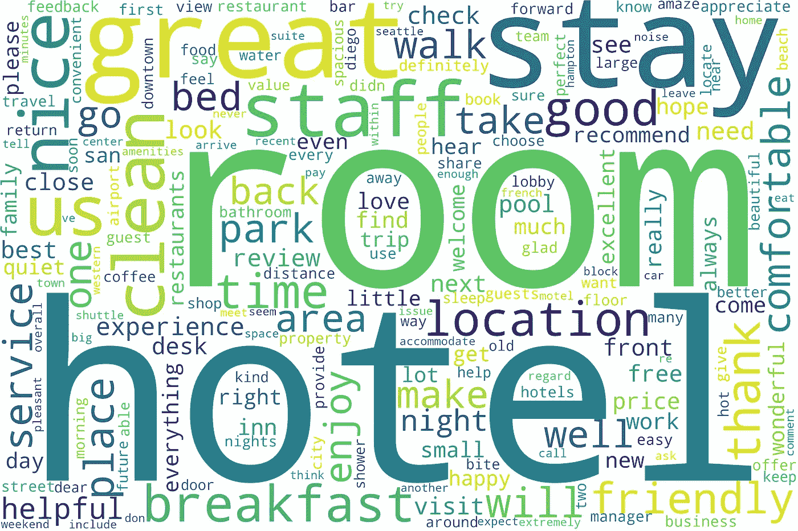
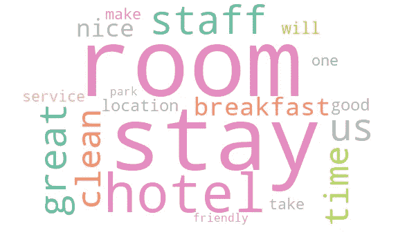
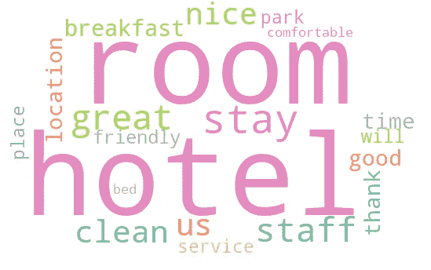

# 用 TF-IDF 创建词云

> 原文：<https://pub.towardsai.net/natural-language-processing-c12b0d525f99?source=collection_archive---------0----------------------->

## [自然语言处理](https://towardsai.net/p/category/nlp)

## 一种通过更强大的功能来改进经典单词云的方法



作者插图

*这是* [*NLP 教程系列*](https://eugenia-anello.medium.com/nlp-tutorial-series-d0baaf7616e0) *的第四篇帖子。本指南将让您了解如何使用 TF-IDF 表示来改进 word cloud。*

你听说过云这个词吗？这是一个惊人的文本数据的可视化，其目的是捕捉关键词。一个单词出现得越多，这个单词在表示中就越大。

这是你随处可见的标准词云。但是真的有用吗？统计单词的出现次数有助于理解它们的重要性吗？肯定有一些重复的词可以被认为是关键词，但其他的则是噪音多于信息。此外，频率较低的术语可能会丢失，这样，我们会丢失重要的信息，而这些信息我们可以在表示中可视化。

可以在 word cloud 中使用 [TF-IDF](https://betterprogramming.pub/a-friendly-guide-to-nlp-tf-idf-with-python-example-5fcb26286a33?sk=c204d0a817f8b5cd52f0e3d4ab8d688e) 进行改进。如您所知，TF-IDF 是一种技术，可以同时量化一个文档内和一组文档中单词的重要性。重复多次的单词将倾向于具有较低的权重，而不太频繁的术语将被认为更重要。

在这篇文章中，我将展示标准的词云，基于词频的词云，以及带有 TF-IDF 的词云，展示它们的主要区别。

**目录:**

1.  **导入库和数据集**
2.  **标准字云**
3.  **基于词频的词云**
4.  **字云与 TF-IDF**

# 1.导入库和数据集

用 Python 生成单词云，需要的模块有 word cloud、matplotlib 和 pandas。如果您的 Jupiter 笔记本中没有安装 word cloud，您只需添加这行代码:

```
!pip install wordcloud
```

让我们导入库:

```
import pandas as pd 
import matplotlib.pyplot as plt
from wordcloud import WordCloud
```

本教程中使用的数据集取自 [Kaggle](https://www.kaggle.com/datafiniti/hotel-reviews) 。它只是一个酒店列表以及相应的评论。这个数据集有许多列，但是我们需要的唯一一列叫做“review.text”。

```
df = pd.read_csv('../input/hotel reviews/Datafiniti_Hotel_Reviews_Jun19.csv')
df['reviews.text']
```



# 2.标准单词云

为了创建单词 Cloud，我们现在只回顾一家酒店:

```
text = df['reviews.text'][1]
text
```



第一步是初始化一个`WordCloud`对象:

```
wordcloud = WordCloud()
```

它包括许多可以指定的参数[1]。最广泛使用的参数是:

*   `font_path`是指定改变默认字体的路径。默认值为无。
*   `width`和`height`的默认值分别等于 400 和 200。
*   `random_state`用于再现每次相同的再现。
*   `max_words`是最大字数。默认值为 200。
*   `stopwords`用于指定要从文本中删除的停用词列表。默认值为无。
*   `background_color`用于指定文字云表示的背景颜色。默认为“黑色”。
*   `colormap`是 Matplotlib 颜色图，将每个单词分配给一种随机颜色。
*   `mask`指定改变字云的形状
*   `collocations`被指定为包括或不包括两个词的搭配或二元组。默认值为 True。如果您只想要单词云中的单个单词，您应该将该参数更改为 False。

要了解更多关于 WordCloud 函数的信息，您也可以这样写:

```
?WordCloud
```

我们最终可以这样从文本中生成单词 cloud:

```
wordcloud.generate(text)
```

首先，我们可以使用 Maplotlib 来显示它:

```
plt.imshow(wordcloud, interpolation='bilinear')
plt.axis("off")
plt.show()
```



您也可以保存图像:

```
wordcloud.to_file('wordcloud.png')
```

为了更加通用，我们还可以合并不同酒店的所有评论:

```
text = " ".join(review for review in df['reviews.text'])
```

这一次，我们可以改变单词云情节的背景、宽度和高度，并删除常用词，如“the”、“is”、“and”。

```
from wordcloud import STOPWORDS
stopwords = set(STOPWORDS)
wordcloud = WordCloud(width = 3000, height = 2000,background_color='white',stopwords=stopwords)
wordcloud.generate(text)
plt.figure(figsize=(40, 30))
plt.imshow(wordcloud, interpolation='bilinear')
plt.axis("off")
plt.show()
```



通过这种方式，我们获得了评论中包含的单词的更清晰的可视化。

为了得到一个更漂亮可爱的云字，我们可以改变它的形状。我们可以用一个 JPG 文件作为单词 cloud 的掩码。我选择沙发作为造型，因为酒店里总是摆满了沙发。我们只需要一个 NumPy 数组形式的图像，它由 0 到 255 之间的数字矩阵组成。如果你选择一个图像，你需要小心:它需要有一个白色的背景来配合单词 cloud。

```
import numpy as np
from PIL import Image
mask = np.array(Image.open('../input/sofa-image/sofa.jpg'))
```

在我们使用相同的代码行之后，只将参数掩码添加到函数中:

```
wordcloud = WordCloud(width = 3000, height = 2000, random_state=1,background_color='white', colormap='Set2', collocations=False, stopwords = STOPWORDS, mask=mask).generate(text)
plt.figure(figsize=(40, 30))
plt.imshow(wordcloud, interpolation='bilinear')
plt.axis("off")
plt.show()
```



瞧啊。现在，我们有了一个沙发形状的字云！它肯定比正方形更清晰。

# **3。**基于词频的词云

在展示基于词云的词频之前，有一个必经的步骤:文本预处理。我们需要删除不必要的单词，如标点符号、空格和停用词。我们也可以将单词规范化，将单词转换成它的基本形式。例如，open 转换为单词 open。

```
from collections import Counter
from nltk.stem import WordNetLemmatizer
import re
words = text.lower().split()
words = [re.sub("[.,!?:;-='...'@#_]", " ", s) for s in words]
words = [re.sub(r'\d+', '', w) for w in words]
words = [word.strip() for word in words if word not in stopwords]
words.remove('')
lemmatiser = WordNetLemmatizer()
lem_words = [lemmatiser.lemmatize(w, pos='v') for w in words]
words_counter = Counter(lem_words)
```

我们将单词列表转换成一个计数器对象，其中键是单词，值是相应的频率。我们可以使用`generate_from_frequencies`方法获得基于词频的词云，而不是使用`generatethe` 方法。而且，输入是上一节得到的计数对象。

```
wordcloud = WordCloud(width = 3000, height = 2000,background_color='white')
wordcloud.generate_from_frequencies(words_counter)
plt.figure(figsize=(40, 30))
plt.imshow(wordcloud, interpolation='bilinear')
plt.axis("off")
plt.show()
```



带词频的词云

发现的单词 cloud 与之前获得的单词 cloud 没有太大不同，因为概念是相同的。我们仍然有非常大的单词“酒店”、“房间”、“住宿”、“员工”、“干净”、“棒极了”，而剩下的单词较小。使用 TF-IDF 看看单词 cloud 如何变化会很有趣。

# 5.使用 TF-IDF 的词云

我们重复清洁的部分，因为每一个酒店的审查应该被视为一个文件。所以，我们不能像以前一样合并所有的文本。

```
df["clean_text"] = df["reviews.text"].apply(lambda s: ' '.join(re.sub("[.,!?:;-='...'@#_]", " ", s).split()))
df["clean_text"] = df["clean_text"].apply(lambda s: ' '.join(re.sub(r'\d+', '', s).split()))
def rem_en(input_txt):
    words = input_txt.lower().split()
    noise_free_words = [word for word in words if word not in stopwords] 
    noise_free_text = " ".join(noise_free_words) 
    return noise_free_text
df["clean_text"] = df["clean_text"].apply(lambda s: rem_en(s))
lemmatiser = WordNetLemmatizer()
df["clean_text"] = df["clean_text"].apply(lambda row: [lemmatiser.lemmatize(r, pos='v') for r in row.split()])
df["clean_text"] = df["clean_text"].apply(lambda row: ' '.join(row))
```

我们现在可以基于 TF-IDF 创建单词云

```
tf_idf_counter = df_tfidf_sklearn.T.sum(axis=1)
wordcloud = WordCloud(width = 3000, height = 2000,background_color='white')
wordcloud.generate_from_frequencies(tf_idf_counter)
plt.figure(figsize=(40, 30))
plt.imshow(wordcloud, interpolation='bilinear')
plt.axis("off")
plt.show()
```



使用 tf-idf 的 word cloud

显然，似乎有相同的话。但是有 200 字的时候就很难做比较了。让我们试着将两种情况下的字数限制在 20 个以内:

```
wordcloud = WordCloud(width = 3000, height = 2000, random_state=1,background_color='white', colormap='Set2', collocations=False, stopwords = STOPWORDS, mask=mask,max_words=20).generate_from_frequencies(words_counter)
plt.figure(figsize=(40, 30))
plt.imshow(wordcloud, interpolation='bilinear')
plt.axis("off")
plt.show()
```



```
wordcloud = WordCloud(width = 3000, height = 2000, random_state=1,background_color='white', colormap='Set2', collocations=False, stopwords = STOPWORDS, mask=mask,max_words=20).generate_from_frequencies(tf_idf_counter)
plt.figure(figsize=(40, 30))
plt.imshow(wordcloud, interpolation='bilinear')
plt.axis("off")
plt.show()
```



如果我们比较两种不同类型的词云，我们可以注意到一些方面:

*   大部分词都是对等的，像“酒店”、“入住”、“工作人员”。
*   在基于词频的词云中，“拿”、“一”、“使”这些词没有任何意义，在词云中被替换为来自 thanking、comfort、bed 的 TF-IDF，这些词似乎更适合上下文。
*   即使两种表征之间有很多共同的词，维度也是变化的。例如，在第一个单词 cloud 中，“Stay”非常大，而在 TF-IDF 中，这个单词变得更小。相反，如果我们看“酒店”这个词，它在第二种情况下变得更大。

# 最终想法:

我希望这篇教程能帮助你对单词云表示有一个很好的了解，以及如何使用 TF-IDF 来改进它。代码在 [Github](https://github.com/eugeniaring/Medium-Articles/blob/main/NLP/hotel-cloud.ipynb) 上。感谢阅读。祝您愉快！

# 参考资料:

[1] [Wordcloud 文档](https://amueller.github.io/word_cloud/generated/wordcloud.WordCloud.html)

你喜欢我的文章吗？ [*成为会员*](https://eugenia-anello.medium.com/membership) *每天无限获取数据科学新帖！这是一种间接的支持我的方式，不会给你带来任何额外的费用。如果您已经是会员，* [*订阅*](https://eugenia-anello.medium.com/subscribe) *每当我发布新的数据科学和 python 指南时，您都会收到电子邮件！*