# 使用 Python 的自然语言处理(NLP)——教程

> 原文：<https://pub.towardsai.net/natural-language-processing-nlp-with-python-tutorial-for-beginners-1f54e610a1a0?source=collection_archive---------0----------------------->


来源: [Pixabay](https://pixabay.com/photos/audio-nlp-5418642/)

## [自然语言处理](https://towardsai.net/p/category/nlp)、[学术](https://towardsai.net/p/category/scholarly)、[教程](https://towardsai.net/p/category/tutorial)

## 自然语言处理(NLP)基础教程，包含 Python 中的示例编码实现

**作者:**普拉蒂克·舒克拉，[罗伯特·伊里翁多](https://mktg.best/vguzs)

最后更新于 2021 年 12 月 1 日

[](https://members.towardsai.net/) [## 加入我们吧↓ |面向人工智能成员|数据驱动的社区

### 加入人工智能，成为会员，你将不仅支持人工智能，但你将有机会…

members.towardsai.net](https://members.towardsai.net/) 

在这篇文章中，我们通过代码示例探索自然语言处理(NLP)的基础。我们深入研究了自然语言工具包(NLTK)库，以展示它如何对自然语言处理相关的任务有用。之后，我们将讨论其他自然语言处理库的基础知识和 NLP 的其他基本方法，以及它们各自在 Python 中的编码示例实现。

本教程的代码可以在 Github[](https://github.com/towardsai/tutorials/tree/master/natural_language_processing)**上找到，它的完整实现也可以在 Google Colab 上找到。**

## **目录:**

1.  **什么是自然语言处理？**
2.  **[自然语言处理的应用](#7458)**
3.  **[理解自然语言处理](#e9b8)**
4.  **[基于规则的自然语言处理与统计的自然语言处理](#aab0)**
5.  **[自然语言处理组件](#1bcf)**
6.  **[NLP 当前面临的挑战](#c0d8)**
7.  **[易于使用的 NLP 库](#62b7)**
8.  **[探索 NLTK 的特性](#7ec0)**
9.  **[字云](#2847)**
10.  **[词干](#f0db)**
11.  **[词汇化](#3be2)**
12.  **[词性标注](#32ff)**
13.  **[春分](#b706)**
14.  **[叮当声](#01f7)**
15.  **[命名实体识别(NER)](#a03e)**
16.  **[WordNet](#6724)**
17.  **[袋字](#2143)**
18.  **[TF-IDF](#27f3)**

> **📚查看我们的[Python 情感分析](https://towardsai.net/p/nlp/sentiment-analysis-opinion-mining-with-python-nlp-tutorial-d1f173ca4e3c)教程。📚**

# **什么是自然语言处理(NLP)？**

**计算机和机器非常擅长处理表格数据或电子表格。但是，人类一般是用文字和句子交流，而不是用表格的形式。人类说或写的许多信息都是非结构化的。所以对于计算机来说解释这些并不是很清楚。在自然语言处理(NLP)中，目标是让计算机理解非结构化文本并从中检索有意义的信息。自然语言处理(NLP)是 [**人工智能**](https://mld.ai/mldcmu) 的一个子领域，其深度涉及计算机与人类的交互。**

# **自然语言处理的应用:**

*   **机器翻译。**
*   **语音识别。**
*   **[**情绪分析**](https://towardsai.net/p/nlp/sentiment-analysis-opinion-mining-with-python-nlp-tutorial-d1f173ca4e3c) 。**
*   **问题回答。**
*   **文本摘要。**
*   **聊天机器人。**
*   **智能系统。**
*   **文本分类。**
*   **字符识别。**
*   **拼写检查。**
*   **垃圾邮件检测。**
*   **自动完成。**
*   **命名实体识别。**
*   **预测打字。**

# **理解自然语言处理(NLP):**

**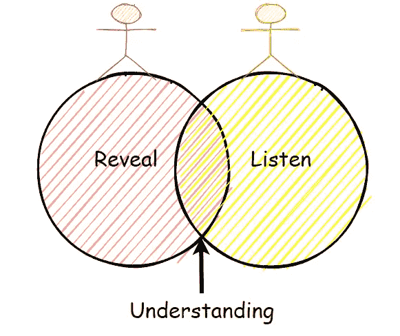**

**图 1:揭示、倾听和理解。**

**作为人类，我们在自然语言处理(NLP)方面做得相当好，但即使如此，我们也不是完美的。我们经常把一件事误解为另一件事，我们经常对同一个句子或单词做出不同的解释。**

**例如，考虑下面的句子，我们将试图以许多不同的方式理解它的解释:**

****例 1:****

****

**图 2:带有文本的 NLP 例句:“我看见一个人在山上拿着望远镜。”**

**以上是对上述句子的一些解释。**

*   **山上有一个人，我用望远镜观察他。**
*   **山上有一个人，他有一架望远镜。**
*   **我在一座山上，我看见一个人在用我的望远镜。**
*   **我在一座山上，我看见一个有望远镜的男人。**
*   **山上有一个人，我用望远镜看到他身上有什么东西。**

****例 2:****

**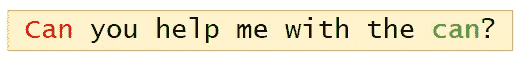**

**图 3:带有文本的 NLP 例句:“你能帮我拿一下罐子吗？”**

**在上面的句子中，我们可以看到有两个“可以”字，但这两个字的意思不同。这里第一个“can”字用于构成疑问句。句末的第二个“can”字用来表示盛食物或液体的容器。**

**因此，从上面的例子中，我们可以看到，语言处理不是“确定性的”(同一种语言有相同的解释)，适合一个人的东西可能不适合另一个人。因此，自然语言处理(NLP)具有非确定性方法。换句话说，自然语言处理可以用来创建一个新的智能系统，它可以理解人类在不同情况下如何理解和解释语言。**

> **📚查看我们关于[伯努利分布](https://towardsai.net/p/statistics/bernoulli-distribution-probability-tutorial-with-python-90061ee078a)的教程，以及 Python 中的代码示例。📚**

# **基于规则的自然语言处理与统计的自然语言处理:**

**自然语言处理分为两种不同的方法:**

## ****基于规则的自然语言处理:****

**它使用常识推理来处理任务。例如，冰冻的温度会导致死亡，或者热咖啡会灼伤人的皮肤，以及其他常识推理任务。然而，这个过程会花费很多时间，并且需要手动操作。**

## ****统计自然语言处理:****

**它使用大量数据，并试图从中得出结论。统计 NLP 使用机器学习算法来训练 NLP 模型。在对大量数据进行成功的训练之后，经过训练的模型将通过演绎产生积极的结果。**

## **比较:**

**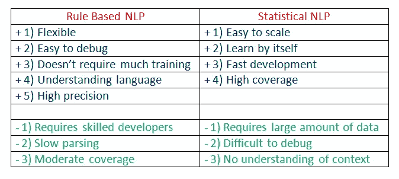**

**图 4:基于规则的自然语言处理和统计的自然语言处理。**

# **自然语言处理(NLP)组件:**

**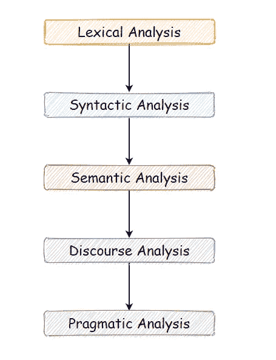**

**图 5:自然语言处理(NLP)组件。**

## ****a .词法分析:****

**通过词法分析，我们将一整块文本分成段落、句子和单词。它包括识别和分析单词的结构。**

## ****b .句法分析:****

**句法分析包括对句子中的单词进行语法分析，并以显示单词之间关系的方式排列单词。例如，句子“商店去房子”不通过。**

## ****c .语义分析:****

**语义分析得出单词的确切含义，并分析文本的意义。像“热冰淇淋”这样的句子不能通过。**

## ****d .披露整合:****

**披露整合考虑了文本的上下文。它在句子结束前考虑句子的意思。比如:“他在谷歌工作。”在这个句子中，“他”必须在它前面的句子中被引用。**

## ****e .语用分析:****

**语用分析涉及语言的整体交流和解释。它涉及在各种情况下有意义地使用语言。**

> **📚查看[机器学习算法的概述](https://towardsai.net/machine-learning-algorithms)，为初学者提供 Python 代码示例。📚**

# **NLP 当前面临的挑战:**

1.  **将句子分解成记号。**
2.  **词性标注。**
3.  **建立适当的词汇。**
4.  **链接所创建词汇的组成部分。**
5.  **理解上下文。**
6.  **提取语义。**
7.  **命名实体识别(NER)。**
8.  **将非结构化数据转换为结构化数据。**
9.  **说话含糊不清。**

# **易于使用的 NLP 库:**

## ****a.** [**NLTK(自然语言工具包)**](https://www.nltk.org/) **:****

**NLTK Python 框架通常被用作教育和研究工具。它通常不用于生产应用程序。然而，由于它的易用性，它可以用来构建令人兴奋的程序。**

****功能:****

*   **符号化。**
*   **词性标注。**
*   **命名实体识别(NER)。**
*   **分类。**
*   **[**情绪分析**](https://towardsai.net/p/nlp/sentiment-analysis-opinion-mining-with-python-nlp-tutorial-d1f173ca4e3c) 。**
*   **聊天机器人套装。**

****使用案例:****

*   **推荐系统。**
*   **情感分析。**
*   **构建聊天机器人。**

**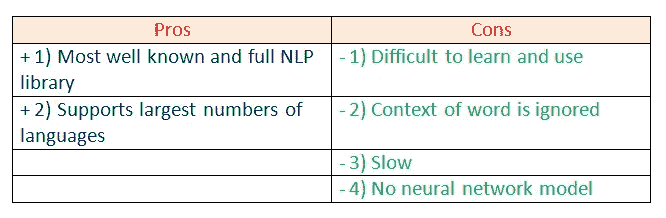**

**图 6:使用 NLTK 框架的利与弊。**

## ****b.** [**空间**](https://spacy.io/) **:****

**spaCy 是一个开源的自然语言处理 Python 库，旨在快速投入生产。spaCy 专注于为生产用途提供软件。**

****功能:****

*   **符号化。**
*   **词性标注。**
*   **命名实体识别(NER)。**
*   **分类。**
*   **[**情绪分析**](https://towardsai.net/p/nlp/sentiment-analysis-opinion-mining-with-python-nlp-tutorial-d1f173ca4e3c) 。**
*   **依存解析。**
*   **单词向量。**

****使用案例:****

*   **自动完成和自动更正。**
*   **分析评论。**
*   **总结。**

**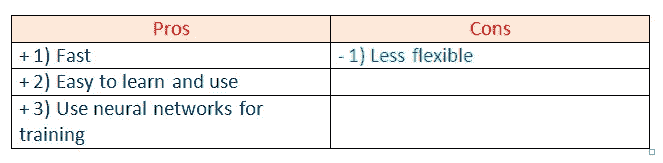**

**图 spaCy 框架的利与弊。**

## ****c .**T38**Gensim****:****

**Gensim 是一个 NLP Python 框架，通常用于主题建模和相似性检测。它不是一个通用的 NLP 库，但是它可以很好地处理分配给它的任务。**

****特色:****

*   **潜在语义分析。**
*   **非负矩阵分解。**
*   **TF-IDF。**

****使用案例:****

*   **将文档转换为矢量。**
*   **查找文本相似性。**
*   **文本摘要。**

**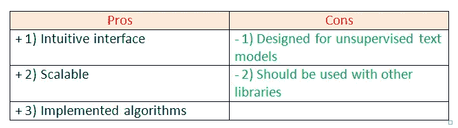**

**图 8:gen sim 框架的优缺点。**

## ****d.** [**图案**](https://github.com/clips/pattern) **:****

**Pattern 是一个具有简单语法的 NLP Python 框架。这是科学和非科学任务的强大工具。这对学生来说很有价值。**

****功能:****

*   **符号化。**
*   **词性标注。**
*   **命名实体识别。**
*   **正在解析。**
*   **情感分析。**

****使用案例:****

*   **拼写纠正。**
*   **搜索引擎优化。**
*   **情感分析。**

**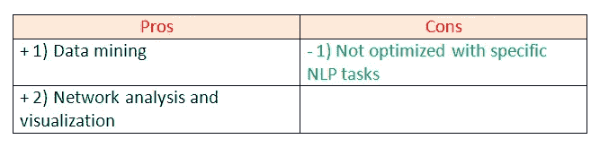**

**图 9:模式框架的优缺点。**

## ****e .**[**text blob**](https://textblob.readthedocs.io/en/dev/)**:****

**TextBlob 是为处理文本数据而设计的 Python 库。**

****功能:****

*   **词性标注。**
*   **名词短语提取。**
*   **情感分析。**
*   **分类。**
*   **语言翻译。**
*   **正在解析。**
*   **Wordnet 集成。**

****使用案例:****

*   **情感分析。**
*   **拼写纠正。**
*   **翻译和语言检测。**

****

**图 10:text blob 库的优缺点。**

**对于本教程，我们将更多地关注 NLTK 库。让我们通过一些例子来更深入地研究自然语言处理。**

# **探索 NLTK 的特性:**

## ****a .打开文本文件进行处理:****

**首先，我们将打开并读取我们想要分析的文件。**

****

**图 11:打开并读取文本文件并对其进行分析的小代码片段。**

**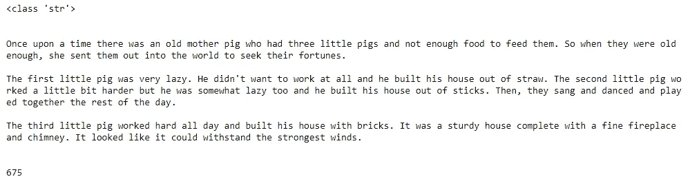**

**图 12:文本字符串文件。**

**接下来，注意所读取的文本文件的数据类型是一个**字符串**。我们文本文件中的字符数是 **675** 。**

## ****b .导入所需的库:****

**对于 NLP 中的各种数据处理案例，我们需要导入一些库。在这种情况下，我们将使用 NLTK 进行自然语言处理。我们将使用它对文本执行各种操作。**

**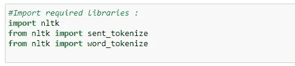**

**图 13:导入所需的库。**

## ****c .句子标记化:****

**通过用`sent_tokenize( )`对文本进行标记，我们可以得到句子形式的文本。**

**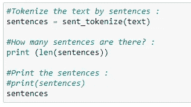**

**图 14:使用 sent_tokenize()将文本标记为句子。**

**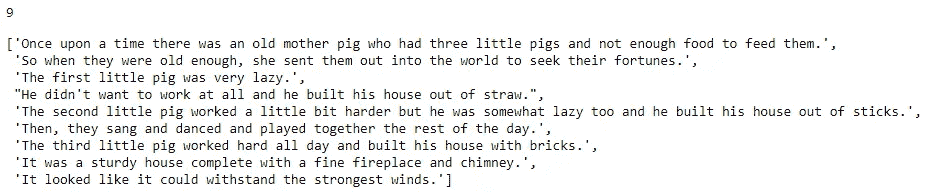**

**图 15:文本样本数据。**

**在上面的例子中，我们可以看到数据的整个文本被表示为句子，还可以注意到这里句子的总数是 **9** 。**

## ****d .分词:****

**通过用`word_tokenize( )`对文本进行记号化，我们可以得到作为单词的文本。**

**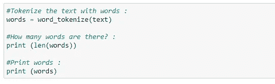**

**图 16:使用 word_tokenize()将文本标记为单词。**

**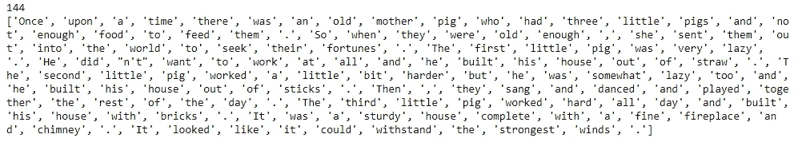**

**图 17:文本样本数据。**

**接下来，我们可以看到数据的整个文本被表示为单词，还可以注意到这里的单词总数是 **144** 。**

## ****e .求频数分布:****

**让我们找出课文中单词的频率。**

**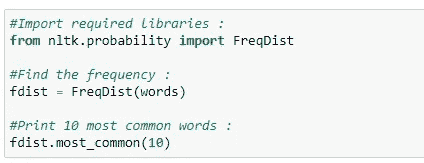**

**图 18:使用 FreqDist()查找示例文本中单词的频率。**

**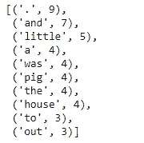**

**图 19:打印样本文本中十个最常见的单词。**

**请注意，使用最多的单词是标点符号和停用词。我们将不得不删除这样的词来分析实际的文本。**

## ****f .绘制频率图:****

**让我们画一张图来形象化我们文本中的单词分布。**

**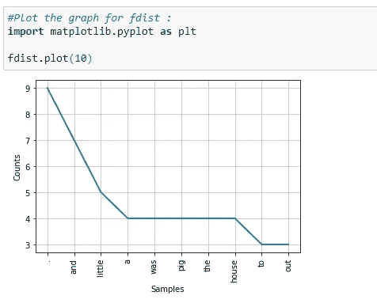**

**图 20:绘制一个图形来可视化文本分布。**

**在上图中，请注意句号“.”在我们的课文中用了九次。从分析上来说，标点符号对于自然语言处理并没有那么重要。因此，在下一步中，我们将删除此类标点符号。**

## ****g .去掉标点符号:****

**接下来，我们将删除标点符号，因为它们对我们来说不是很有用。我们将使用`isalpha( )`方法从实际文本中分离出标点符号。此外，我们将制作一个名为`words_no_punc`的新列表，它将以小写形式存储单词，但不包括标点符号。**

**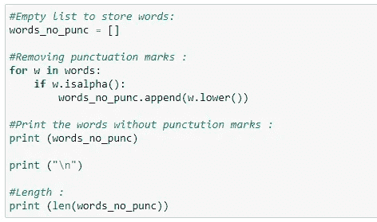**

**图 21:使用 isalpha()方法来分隔标点符号，并在 words_no_punc 下创建一个列表来分隔没有标点符号的单词。**

**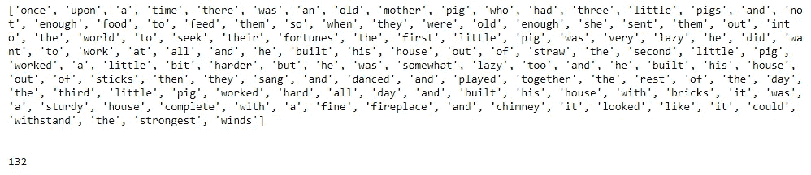**

**图 22:文本样本数据。**

**如上所示，我们文本中的所有标点符号都被排除在外。这些也可以和字数交叉核对。**

## ****h .绘制无标点符号的图形:****

**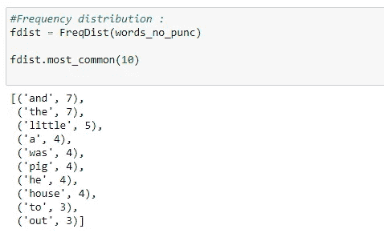**

**图 23:打印样本文本中十个最常见的单词。**

**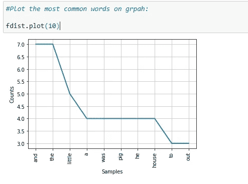**

**图 24:绘制没有标点符号的图表。**

**请注意，在我们的文本文件示例的分析中，我们仍然有许多不太有用的词，比如“and”、“but”、“so”等等。接下来，我们需要删除并列连词。**

## ****一、停用词列表:****

**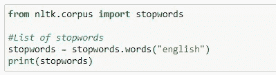**

**图 25:导入停用词列表。**

**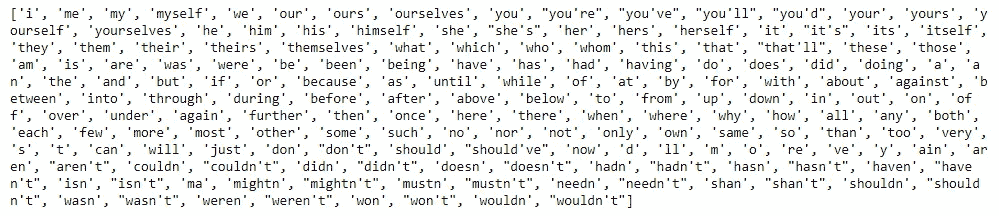**

**图 26:文本样本数据。**

## ****j .删除停用词:****

**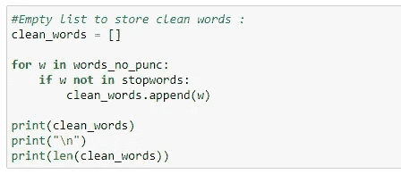**

**图 27:清理文本样本数据。**

**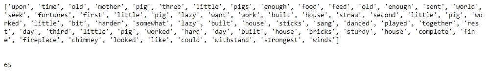**

**图 28:清理后的数据。**

## ****k .最终频率分布:****

**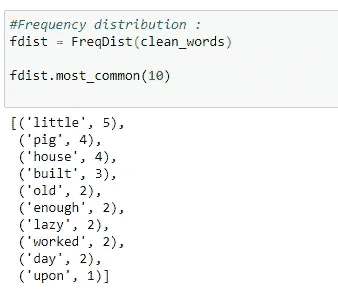**

**图 29:显示最常见单词的最终频率分布。**

**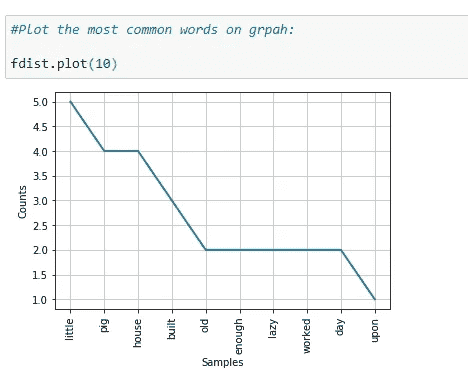**

**图 30:组中最常见单词的可视化。**

**如上所示，最终的图表有许多有用的词，帮助我们理解我们的样本数据是什么，显示了在 NLP 上执行数据清理是多么重要。**

**接下来，我们将通过编码示例介绍 NLP 中的各种主题。**

# **词云:**

**词云是一种数据可视化技术。其中给定文本中的单词显示在主图表上。在这种技术中，更频繁或重要的单词以更大和更粗的字体显示，而不太频繁或重要的单词以更小或更细的字体显示。这是 NLP 中的一项有益的技术，它让我们看一眼应该分析什么文本。**

## **属性:**

1.  ****font_path** :指定我们要使用的字体的路径。**
2.  ****宽度**:指定画布的宽度。**
3.  ****高度**:指定画布的高度。**
4.  ****min_font_size** :指定使用的最小字体大小。**
5.  ****max_font_size:** 指定要使用的最大字体大小。**
6.  ****font_step** :指定字体的步长。**
7.  ****max_words** :指定词云上的最大字数。**
8.  ****停用词**:我们的程序会剔除这些词。**
9.  ****背景颜色:**指定画布的背景颜色。**
10.  ****normalize_plurals** :从单词中删除尾部的“s”。**

****阅读完整文档请上** [**文字云**](https://amueller.github.io/word_cloud/generated/wordcloud.WordCloud.html) **。****

## **Word Cloud Python 实现:**

**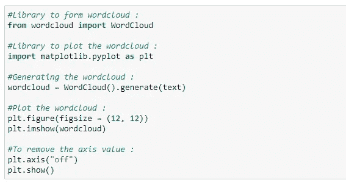**

**图 31:单词 cloud 的 Python 代码实现。**

**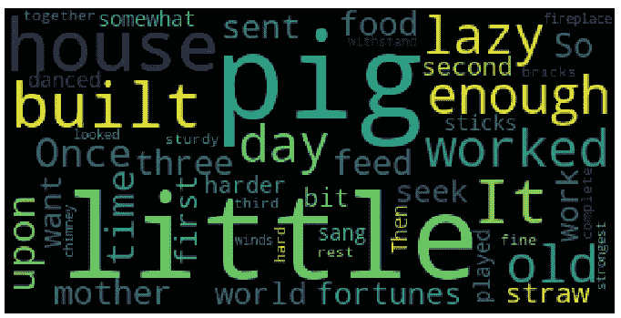**

**图 32:单词云示例。**

**如上图所示，最常用的单词以较大的字体显示。单词 cloud 可以以任何形状或图像显示。**

**例如:在这种情况下，我们将使用下面的圆形图像，但我们可以使用任何形状或任何图像。**

****

**图 33:我们的单词云的圆形图像形状。**

## **Word Cloud Python 实现:**

**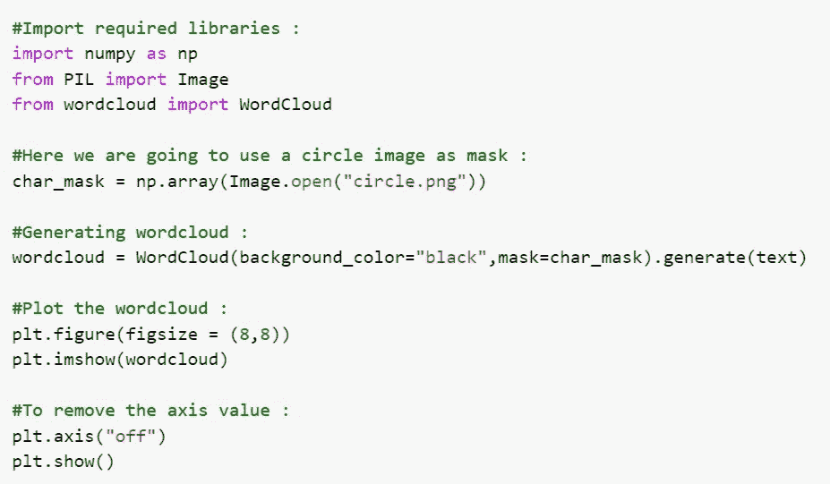**

**图 34:单词 cloud 的 Python 代码实现。**

**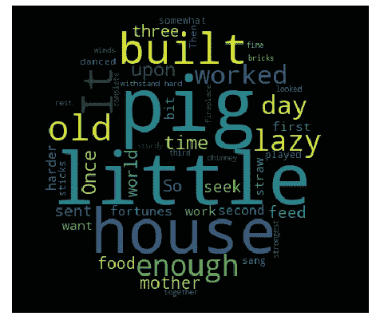**

**图 35:圆形的单词云。**

**如上图，云这个词是圆形的。我们之前提到过，我们可以用任何形状或图像来组成词云。**

## ****Word 云优点:****

*   **他们速度很快。**
*   **他们很迷人。**
*   **它们很容易理解。**
*   **它们很随意，视觉上很吸引人。**

## ****字云缺点:****

*   **对于不干净的数据，它们并不完美。**
*   **他们缺乏词语的上下文。**

# **词干:**

**我们使用词干来规范单词。在英语和许多其他语言中，一个单词可以根据上下文有多种形式。例如，动词“study”可以有多种形式，如“studies”、“studies”、“studied”等，这取决于它的上下文。当我们对单词进行标记时，解释器会将这些输入单词视为不同的单词，即使它们的潜在含义是相同的。此外，我们知道 NLP 是关于分析内容的含义，为了解决这个问题，我们使用词干。**

**词干化通过将单词截断为其词干来规范单词。例如，单词“studies”、“studied”、“正在学习”将被简化为**“studi”、**，使得所有这些单词形式仅指代一个令牌。请注意，词干分析可能不会给我们一个字典，一个特定单词集的语法单词。**

**让我们举个例子:**

## ****a .波特的斯特梅尔例 1:****

**在下面的代码片段中，我们展示了所有的单词都被截短为它们的词干。但是，请注意，带词干的单词不是词典中的单词。**

****

**图 36:显示词干示例的代码片段。**

## ****b .波特的《斯特梅尔》例二:****

**在下面的代码片段中，词干化后的许多单词最终没有成为可识别的词典单词。**

**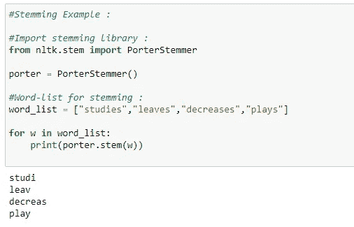**

**图 37:显示词干示例的代码片段。**

## ****c .雪球阻止器:****

**SnowballStemmer 生成的输出与 porter stemmer 相同，但它支持更多的语言。**

**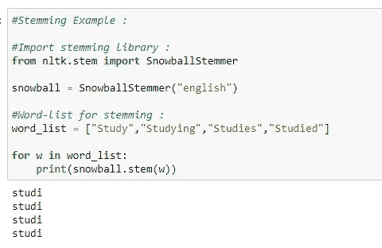**

**图 38:显示 NLP 词干示例的代码片段。**

## ****d .雪球词干分析器支持的语言:****

**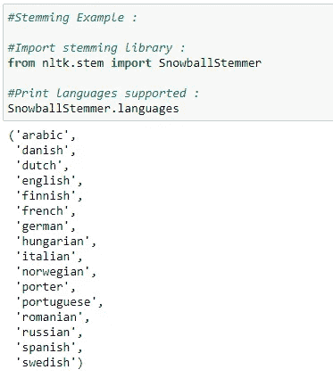**

**图 39:显示 NLP 词干示例的代码片段。**

# **各种词干算法:**

## ****波特的斯特梅尔:****

**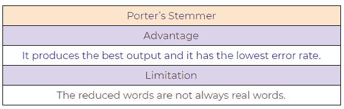**

**图 40:波特的斯特梅尔 NLP 算法，优点和缺点。**

## ****b. Lovin 的斯特梅尔:****

**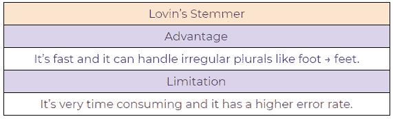**

**图 41: Lovin 的斯特梅尔 NLP 算法，优点和缺点。**

## ****道森笔下的斯特梅尔:****

**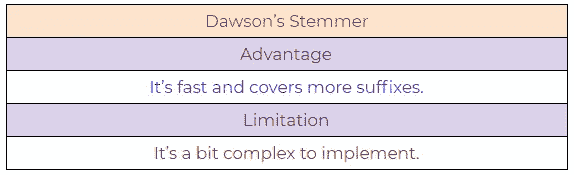**

**图 42:道森的斯特梅尔 NLP 算法，利弊。**

## **德·克罗维兹·斯特梅尔**

**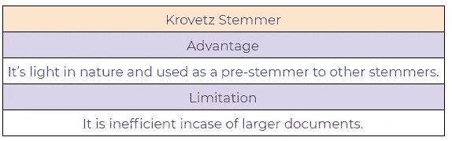**

**图 43:克罗维兹斯特梅尔自然语言处理算法，优点和缺点。**

## **e .施乐斯特梅尔公司**

**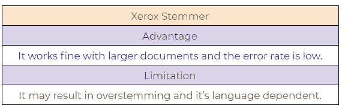**

**图 44:施乐斯特梅尔 NLP 算法，利弊。**

## **斯诺鲍·斯特梅尔:**

**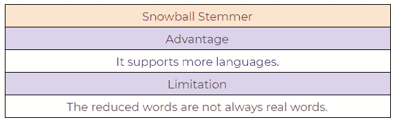**

**图 45:雪球斯特梅尔 NLP 算法，利弊。**

> **📚查看我们的 [**神经网络教程**](https://towardsai.net/neural-networks-with-python) 从头开始详细讲解 Python 代码和数学。📚**

# **词汇化:**

**词汇化试图为一个单词获得一个相似的基本“词干”。但是，它的不同之处在于，它找到了词典中的单词，而不是截断原始单词。词干提取不考虑单词的上下文。这就是为什么它生成结果更快，但不如引理化准确。**

**如果准确性不是项目的最终目标，那么词干提取是一种合适的方法。如果更高的准确性是至关重要的，并且项目没有紧迫的期限，那么最好的选择是分期偿还(与词干化相比，词汇化的处理速度较低)。**

**词汇化考虑了词性(POS)值。此外，变元化可以为不同的 POS 值生成不同的输出。我们通常有四种 POS 选择:**

**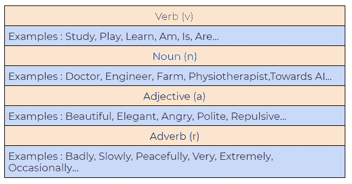**

**图 46:词汇化中的词性(POS)值。**

## **斯特梅尔和莱马提泽的区别:**

****a .词干:****

**注意在词干提取时，单词“studies”是如何被截短为“studi”的。**

**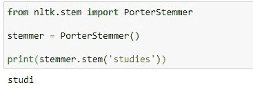**

**图 47:在 NLTK Python 框架中使用词干。**

****b .引理:****

**在词汇化过程中，单词“studies”显示其词典单词“study”**

**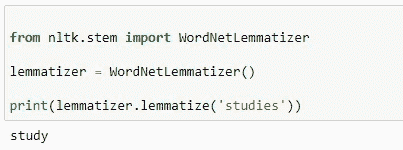**

**图 48:在 NLTK Python 框架中使用词汇化。**

## **Python 实现:**

****答:一个演示 lemmatizer 如何工作的基本示例****

**在下面的例子中，我们将 PoS 标记作为“动词”，当我们应用词汇化规则时，它会给出字典单词，而不是截断原始单词:**

**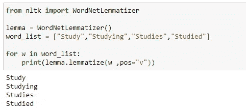**

**图 49:使用 NLTK 框架的简单词汇化示例。**

****b .带有默认位置值的 Lemmatizer】****

**词目化中 PoS 的默认值是名词(n)。在下面的例子中，我们可以看到它正在生成字典单词:**

**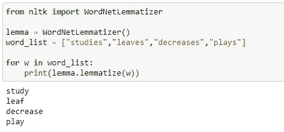**

**图 50:使用词汇化生成默认值。**

****c .展示 lemmatizer 强大功能的另一个例子****

**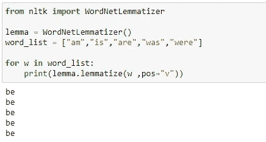**

**图 51:单词“am”、“are”、“is”、“was”、“were”的词汇化**

****具有不同位置值的 d . lemma tizer****

**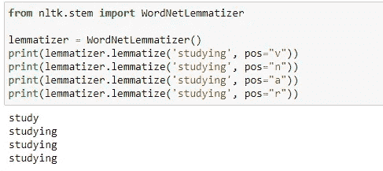**

**图 52:不同词性值的词汇化。**

# **词性标注(词性标注):**

## **为什么我们需要词性？**

****

**图 53:例句，“你能帮我拿一下罐子吗？”**

**词性标注对于句法和语义分析至关重要。所以，对于类似上面这句话的东西，“可以”这个词有几个语义。第一个“can”用于形成问题。句末的第二个“can”用来表示容器。第一个“can”是动词，第二个“can”是名词。赋予这个词一个特定的含义允许程序在语义和句法分析中正确地处理它。**

**下面，请查找词类(PoS)标签列表及其各自的示例:**

****1。抄送:并列连词****

**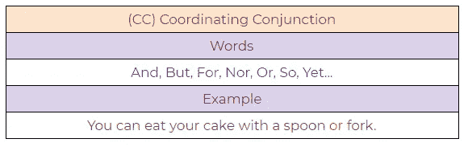**

**图 54:协调连接示例。**

****2。CD:基数****

**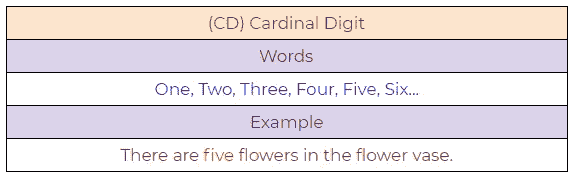**

**图 55:基数示例。**

****3。DT:限定词****

**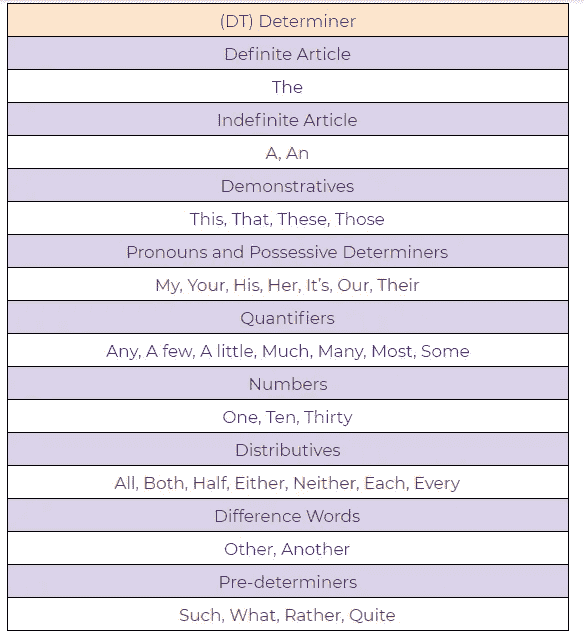**

**图 56:限定词示例。**

****4。存在主义在那里****

****

**图 57:存在“那里”的例子。**

****5。FW:外来词****

****

**图 58:外来词示例。**

****6。IN:介词/从属连词****

****

**图 59:介词/从属连词。**

****7。JJ:形容词****

****

**图 60:形容词示例。**

****8。JJR:形容词，比较级****

****

**图 61:形容词，比较例。**

****9。JJS:形容词，最高级****

****

**图 62:**

****10。LS:列表标记****

****

**图 63:列表标记示例。**

****11。MD:模态****

****

**图 64:**

****12。NN:名词，单数****

****

**图 65:名词，单数例子。**

****13。NNS:名词，复数****

****

**图 66:名词，复数示例。**

****14。NNP:专有名词，单数****

****

**图 67:专有名词，单数例子。**

****15。NNPS:专有名词，复数****

****

**图 68:专有名词，复数示例。**

**16。PDT:预定者**

****

**图 69:预定义示例。**

**17。词性:所有格结尾**

****

**图 70:所有格结尾示例。**

**18。PRP:人称代词**

****

**图 71:人称代词示例。**

**19。PRP$:所有格代词**

****

**图 72:所有格代词示例。**

**20。副词**

****

**图 73:副词例子。**

****21。RBR:副词，比较级****

****

**图 74:副词，比较例。**

****22。副词，最高级****

****

**图 75:副词，最高级例子。**

****23。RP:粒子****

****

**图 76:粒子示例。**

****二十四。至:至****

****

**图 77:举例。**

**25。呃:感叹词**

****

**图 78:感叹词示例。**

****26。VB:动词，基本形式****

****

**图 79:动词，基本形式示例。**

****27。VBD:动词，过去式****

****

**图 80:动词，过去式示例。**

****28。VBG:动词，现在分词****

****

**图 81:动词，现在分词示例。**

****29。VBN:动词，过去分词****

****

**图 82:动词，过去分词。**

**30。VBP:动词，现在时态，不是第三人称单数**

****

**图 83:动词，现在时，不是第三人称单数。**

**31。VBZ:动词，现在时，第三人称单数**

****

**图 84:动词，现在时，第三人称单数。**

**32。WDT: Wh —限定词**

****

**图 85:限定词示例。**

****33。WP: Wh —代词****

****

**图 86:代词示例。**

**34。WP$:所有格 Wh——代词**

****

**图 87:所有格代词示例。**

****35。WRB: Wh —副词****

****

**图 88:副词例子。**

## **Python 实现:**

****a .演示词性标注的简单示例。****

****

**图 89:位置标记示例。**

****b .展示词性标注用法的完整示例。****

****

**图 90:演示位置标记的完整 Python 示例。**

# **分块:**

**组块意味着从非结构化文本中提取有意义的短语。通过把一本书标记成单词，有时很难推断出有意义的信息。它在词性标注的基础上工作。组块以词性标签作为输入，并提供组块作为输出。组块字面意思是一组单词，它将简单的文本分成比单个单词更有意义的短语。**

****

**图 91:NLP 中的组块过程。**

**在使用示例之前，我们需要知道什么是短语？有意义的词组叫做短语。有五种重要的短语。**

1.  **名词短语。**
2.  **动词短语。**
3.  **形容词短语。**
4.  **副词短语。**
5.  **介词短语。**

## **短语结构规则:**

*   **s(句子)→ NP VP。**
*   **NP →{限定词，名词，代词，专名}。**
*   **VP → V (NP)(PP)(副词)。**
*   **PP →代词(NP)。**
*   **AP →形容词(PP)。**

## **示例:**

****

**图 92:NLP 中的分块示例。**

## **Python 实现:**

**在下面的例子中，我们将从文本中提取一个名词短语。在提取它之前，我们需要定义我们要寻找什么样的名词短语，或者换句话说，我们必须为一个名词短语设置语法。在这种情况下，我们用一个可选的限定词来定义一个名词短语，后跟形容词和名词。然后我们可以定义其他规则来提取一些其他短语。接下来，我们将使用`RegexpParser( )`来解析语法。注意，我们也可以用`.draw( )`函数可视化文本。**

****

**图 93:从文本文件中提取名词短语的代码片段。**

**在这个例子中，我们可以看到我们已经成功地从文本中提取了名词短语。**

****

**图 94:从输入文本中成功提取名词短语。**

# **Chinking:**

**Chinking 从我们的大块中排除了一部分。在某些情况下，我们需要从整个文本或文本块中排除一部分文本。在复杂的提取中，分块可能会输出无用的数据。在这种情况下，我们可以使用 chinking 从分块文本中排除一些部分。
在下面的例子中，我们将把整个字符串作为一个组块，然后我们将通过使用 chinking 从其中排除形容词。即使在分块之后，当我们有很多无用的数据时，我们通常使用 chinking。因此，通过使用这种方法，我们可以很容易地将它分开，同样为了编写 chinking 文法，我们必须使用反花括号，即:**

> ****}在这里写汉语语法{****

## **Python 实现:**

****

**图 95:用 Python 实现 Chinking。**

**从上面的例子中，我们可以看到形容词从其他文本中分离出来。**

****

**图 96:在这个例子中，通过使用 chinking 排除了形容词。**

# **命名实体识别(NER):**

**命名实体识别可以自动扫描整篇文章，并提取一些基本实体，如人物、组织、地点、日期、时间、金钱和文章中讨论的 GPE。**

## ****使用案例:****

1.  **新闻频道的内容分类。**
2.  **总结简历。**
3.  **优化搜索引擎算法。**
4.  **推荐系统。**
5.  **客户支持。**

## ****常用的命名实体类型:****

****

**图 97:命名实体识别常用类型的一个例子(NER)。**

## **Python 实现:**

**有两种选择:**

****1。二进制=真****

**当二进制值为真时，那么它将只显示一个特定的实体是否是命名实体。它不会显示任何进一步的细节。**

****

**图 98:二进制值为真时的 Python 实现。**

**我们的图表没有显示命名实体的类型。它只显示一个特定的词是否是命名实体。**

****

**图 99:二进制值为真时的图形示例。**

****2。二进制=假****

**当二进制值等于 False 时，它详细显示命名实体的类型。**

****

**图 100:二进制值为假时的 Python 实现。**

**我们的图表现在显示了命名实体的类型。**

****

**图 101:当二进制值等于假时，显示命名实体类型的图形。**

# **WordNet:**

**Wordnet 是一个英语词汇数据库。Wordnet 是 NLTK 语料库的一部分。我们可以使用 Wordnet 来查找单词、同义词、反义词和许多其他单词的意思。**

## ****答:我们可以在 Wordnet 中查看一个词有多少种不同的定义。****

****

**图 102:使用 NLTK 框架用 Wordnet 检查单词定义。**

## **我们还可以检查那些不同定义的含义。**

****

**图 103:使用 Wordnet 收集不同定义的含义。**

## ****c .所有细节一字不差。****

****

**图 104:查找特定单词的所有细节。**

## ****d .一个词的所有含义的所有细节。****

****

**图 105:查找特定单词所有含义的所有细节。**

## **上位词:上位词给了我们一个更抽象的词。**

****

**图 106:使用 Wordnet 查找上位词。**

## **下义词:下义词给了我们一个更具体的词语。**

****

**图 107:使用 Wordnet 查找下位词。**

## **只得到一个名字。**

****

**图 108:用 Wordnet 只找到一个名字。**

## ****h .同义词。****

****

**图 109:用 Wordnet 查找同义词。**

## ****一、反义词。****

****

**图 110:用 Wordnet 寻找反义词。**

## ****j .同义词和反义词。****

****

**图 111:用 Wordnet 查找同义词和反义词代码片段。**

## ****k .寻找单词之间的相似性。****

****

**图 112:使用 Wordnet 查找单词之间的相似度。**

****

**图 113:使用 Wordnet 查找单词之间的相似度。**

# **一袋单词:**

****

**图 114:一包单词的表示。**

## **什么是单词袋法？**

**这是一种从行文本中提取基本特征的方法，以便我们可以将其用于机器学习模型。我们称之为单词的“包”，因为我们抛弃了单词出现的顺序。单词包模型将原始文本转换成单词，并且它还计算文本中单词的频率。总之，单词包是代表一个句子的单词以及单词计数的集合，其中出现的顺序是不相关的。**

****

**图 115:一袋单词的结构。**

1.  ****原始文本:**这是我们想要执行分析的原始文本。**
2.  ****清理文本:**由于我们的原始文本包含一些不必要的数据，如标点符号和停用词，所以我们需要清理我们的文本。干净文本是删除此类单词后的文本。**
3.  ****标记化:**标记化将句子表示为一组标记或单词。**
4.  ****Building Vocab:** 包含去除不必要数据后的文本中使用的总字数。**
5.  ****生成 Vocab:** 包含单词及其在句子中的出现频率。**

****例如:****

**句子:**

1.  **吉姆和帕姆乘公共汽车旅行。**
2.  **火车晚点了。**
3.  **航班满员了。乘飞机旅行是昂贵的。**

****a .创建基本结构:****

****

**图 116:一个单词包的基本结构示例。**

****b .有频率的词:****

****

**图 117:带有频率的单词的基本结构示例。**

****c .组合所有单词:****

****

**图 118:所有输入单词的组合。**

****d .最终模型:****

****

**图 119:我们单词袋的最终模型。**

## **Python 实现:**

****

**图 120:我们的单词包的 Python 实现代码片段。**

****

**图 121:我们单词包的输出。**

****

**图 122:我们单词包的输出。**

## **应用:**

1.  **自然语言处理。**
2.  **从文献中检索信息。**
3.  **文件的分类。**

## **局限性:**

1.  ****语义**:不考虑一个词的语义。它忽略了使用该词的上下文。**
2.  ****矢量大小**:对于大型文档，矢量大小会增加，这可能会导致计算时间增加。**
3.  ****预处理**:在预处理中，我们需要在使用之前进行数据清洗。**

# **TF-IDF**

**TF-IDF 代表**词频—逆文档频率**，是一种常用于信息检索(IR)和摘要的评分指标。TF-IDF 分数显示了一个术语在给定文档中的重要性或相关性。**

## **TF 和 IDF 背后的直觉:**

**如果一个特定的单词在一个文档中出现多次，那么它可能比其他出现次数较少的单词具有更高的重要性(TF)。同时，如果一个特定的单词在一个文档中多次出现，但它在其他一些文档中也多次出现，那么可能这个单词是频繁出现的，所以我们不能赋予它太多的重要性。(IDF)。例如，我们有一个包含数千条狗的描述的数据库，用户想要从我们的数据库中搜索**“一只可爱的狗”**。我们搜索引擎的工作是显示与用户查询最接近的响应。**搜索引擎如何做到这一点？**搜索引擎可能会使用 TF-IDF 来计算我们所有描述的得分，得分较高的结果将显示为对用户的响应。现在，当用户的查询没有精确匹配时就是这种情况。如果与用户查询完全匹配，那么将首先显示结果。然后，让我们假设我们的数据库中有四个可用的描述。**

1.  **毛茸茸的狗。**
2.  **一只可爱的小狗。**
3.  **一只大狗。**
4.  **可爱的狗狗。**

**请注意，第一个描述包含用户查询中 3 个单词中的 2 个，第二个描述包含查询中的 1 个单词。第三个描述也包含 1 个单词，第四个描述不包含来自用户查询的单词。我们可以感觉到，与我们的查询最接近的答案将是描述 2，因为它包含用户查询中的基本单词“**可爱**”,这就是 TF-IDF 计算值的方式。**

**请注意，所有句子的词频值都是相同的，因为任何句子中的单词都不会在同一个句子中重复。所以，在这种情况下，TF 的值将不是工具性的。接下来，我们将使用 IDF 值来获得与查询最接近的答案。请注意，单词 dog 或 doggo 会出现在很多很多的文档中。因此，IDF 值将会非常低。最终，TF-IDF 值也会降低。然而，如果我们在狗的描述中检查“可爱”这个词，那么它会出现相对较少的次数，所以它增加了 TF-IDF 值。所以“可爱”这个词比“狗”或“狗狗”更有辨别能力然后，我们的搜索引擎会找到包含“可爱”一词的描述，最终，这就是用户想要的。**

**简单来说，TF*IDF 得分越高，该术语就越稀有或独特或有价值，反之亦然。**

**现在我们将举一个简单的例子，更详细地了解 TF-IDF。**

****举例:****

****句子 1** :这是第一份文件。**

****第二句**:本文件为第二份文件。**

## **TF:术语频率**

****

**图 123:TF-IDF 上术语频率的计算。**

**代表表中句子的单词。**

****

**图 124:句子的表格表示。**

****b .显示词频。****

****

**图 125:显示词频的表格。**

****c .用公式计算 TF。****

****

**图 126:计算 TF。**

****

**图 127:产生的 TF。**

****IDF:逆文档频率****

****

**图 128:计算 IDF。**

****d .根据公式计算 IDF 值。****

****

**图 129:根据公式计算 IDF 值。**

****e .计算 TF-IDF。****

**TF-IDF 是 TF*IDF 的乘积。**

****

**图 130:TF-IDF 的乘法结果。**

**在这种情况下，请注意区分两个句子的重要单词在句子 1 中是“first ”,在句子 2 中是“second”。正如我们所看到的，这些单词比其他单词具有相对更高的值。**

**然而，对于大型文档来说，平滑这些值有许多变化。最常见的变化是使用 TF-IDF 的对数值。让我们使用新的 IDF 值再次计算 TF-IDF 值。**

****

**图 131:通过使用新的 IDF 值来使用 TF-IDF 的对数值。**

****f .使用对数计算 IDF 值。****

****

**图 132:使用日志计算 IDF 值。**

****g .计算 TF-IDF。****

****

**图 133:使用日志计算 TF-IDF。**

**如上所述，“第一”和“第二”值是帮助我们区分这两个句子的重要单词。**

**既然我们已经看到了 TF-IDF 的基础知识。接下来，我们将使用 sklearn 库在 Python 中实现 TF-IDF。一个不同的公式计算我们程序的实际输出。首先，我们将看到我们的计算和公式的概述，然后我们将用 Python 实现它。**

## **实际计算:**

****a .词频(TF):****

****

**图 134:TF 的实际计算。**

****b .逆文档频率(IDF):****

****

**图 135:IDF 的公式。**

****

**图 136:将日志应用于 IDF 值。**

****c .计算最终 TF-IDF 值:****

****

**图 137:计算最终 IDF 值。**

****

**图 138:最终 TF-IDF 值。**

## **Python 实现:**

****

**图 139:TF-IDF 代码片段的 Python 实现。**

****

**图 140:最终输出。**

# **结论:**

**这些是令人兴奋的自然语言处理(NLP)领域的一些基础知识。我们希望你喜欢阅读这篇文章，并学到一些新的东西。任何建议或反馈对于继续改进都至关重要。如果你有任何问题，请在评论中告诉我们。**

**[](https://www.buymeacoffee.com/pratu)

给普拉蒂克买杯咖啡！** 

****免责声明:**本文中表达的观点仅代表作者个人，不代表卡耐基梅隆大学或其他(直接或间接)与作者相关的公司的观点。这些文章并不打算成为最终产品，而是当前思想的反映，同时也是讨论和改进的催化剂。**

**通过[向 AI](https://towardsai.net/) 发布**

# **引用**

**对于学术背景下的归属，请引用该工作为:**

```
Shukla, et al., “Natural Language Processing (NLP) with Python — Tutorial”, Towards AI, 2020
```

# **BibTex 引文:**

```
@article{pratik_iriondo_2020, 
 title={Natural Language Processing (NLP) with Python — Tutorial}, 
 url={[https://towardsai.net/nlp-tutorial-with-python](https://towardsai.net/nlp-tutorial-with-python)}, 
 journal={Towards AI}, 
 publisher={Towards AI Co.}, 
 author={Pratik, Shukla and Iriondo, Roberto},  
 year={2020}, 
 month={Jul}
}
```

# **推荐文章**

**一、[机器学习和数据科学最佳数据集](https://towardsai.net/p/machine-learning/best-datasets-for-machine-learning-and-data-science-d80e9f030279)
二。[艾薪资冲天](http://towardsai.net/ai-salaries)三世
。[什么是机器学习？](https://towardsai.net/p/machine-learning/what-is-machine-learning-ml-b58162f97ec7)
四世。[2020 年最佳机器学习硕士项目](https://towardsai.net/ml-masters)
五、[2020 年最佳机器学习博士项目](https://towardsai.net/ml-phd)
六、[最佳机器学习博客](https://towardsai.net/p/machine-learning/best-machine-learning-blogs-6730ea2df3bd)
七。[关键机器学习定义](https://towardsai.net/p/machine-learning/key-machine-learning-ml-definitions-43e837ec6add)
八。[用机器学习在 0.05 秒内破解验证码](https://towardsai.net/ml-captcha)
九。[机器学习 vs. AI 及其重要区别](https://towardsai.net/p/machine-learning/machine-learning-vs-ai-important-differences-between-them/robiriondo/3432/)
十.[确保成功开创机器学习事业(ML)](https://towardsai.net/p/machine-learning/moocs-vs-academia-ensuring-success-starting-in-a-machine-learning-ml-career-304b2e42315e)
XI。[机器学习算法初学者](https://towardsai.net/p/machine-learning/machine-learning-algorithms-for-beginners-with-python-code-examples-ml-19c6afd60daa)
十二。[神经网络从零开始详细用 Python 代码和数学](https://towardsai.net/neural-networks-with-python)
XIII。[用 Python 构建神经网络](https://towardsai.net/p/machine-learning/building-neural-networks-with-python-code-and-math-in-detail-ii-bbe8accbf3d1)
XIV。[神经网络的主要类型](https://towardsai.net/p/machine-learning/main-types-of-neural-networks-and-its-applications-tutorial-734480d7ec8e)
十五。[用 Python 编写的蒙特卡洛模拟教程](https://towardsai.net/p/machine-learning/monte-carlo-simulation-an-in-depth-tutorial-with-python-bcf6eb7856c8)
XVI。[Python 自然语言处理教程](https://towardsai.net/p/nlp/natural-language-processing-nlp-with-python-tutorial-for-beginners-1f54e610a1a0)**

# ****参考文献:****

**[1]例文是从美国文学中搜集来的，【https://americanliterature.com/】T2**

**[2]自然语言工具包，【https://www.nltk.org/】T4**

**[3] TF-IDF，KDnuggets，[https://www.kdnuggets.com/2018/08/wtf-tf-idf.html](https://www.kdnuggets.com/2018/08/wtf-tf-idf.html)**

# **资源:**

**[Google Colab 实现](https://colab.research.google.com/drive/1vt4u8Hp-iQIRSFc633Outvl7t3R34-iJ?usp=sharing)。**

**[Github 教程完整代码库](https://github.com/towardsai/tutorials/tree/master/natural_language_processing)。**