# 自然语言处理:什么，为什么，如何？

> 原文：<https://pub.towardsai.net/natural-language-processing-what-why-and-how-3936b8a85e0d?source=collection_archive---------2----------------------->

## [机器学习](https://towardsai.net/p/category/machine-learning)，[自然语言处理](https://towardsai.net/p/category/nlp)

## NLP 初学者完全手册

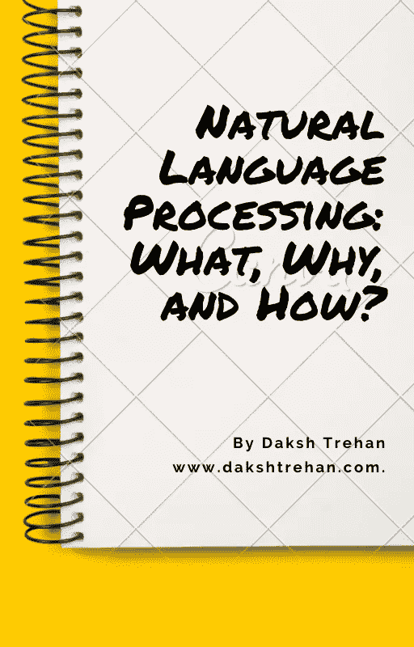

## 目录:

*   什么是自然语言处理(NLP)？
*   自然语言处理是如何工作的？
*   标记化
*   词干化和词汇化
*   停止言语
*   正则表达式
*   一袋单词
*   N-grams
*   TF-IDF

想知道谷歌搜索如何准确显示你想看的内容吗？” **Puma** “既可以是动物也可以是鞋类公司，但对你来说，主要是鞋类公司和谷歌知道吧！

它是如何发生的？搜索引擎如何理解你想说的话？

聊天机器人是如何回复你问他们的问题而不被偏离的？Siri、Alexa、Cortana、Bixby 是如何工作的？


照片由[耶戈·古格莱塔](https://unsplash.com/@lazargugleta?utm_source=medium&utm_medium=referral)在 [Unsplash](https://unsplash.com?utm_source=medium&utm_medium=referral) 上拍摄

这些都是**自然语言处理(NLP)的奇迹。**

# 什么是自然语言处理？

计算机太好了，不能处理表格/结构化数据，它们可以很容易地检索特征，学习它们并产生所需的输出。但是，为了创建一个健壮的虚拟世界，我们需要一些技术，通过这些技术，我们可以让机器像人类一样理解和交流，即通过自然语言。

**自然语言处理**是**人工智能**的子领域，处理机器和人类语言。它用于理解人类语言的逻辑意义，通过考虑不同的方面，如形态学，句法，语义和语用学。

NLP 的一些应用有:

*   *机器音译。*
*   *语音识别。*
*   *情绪分析。*
*   文本摘要。
*   聊天机器人。
*   *文本分类。*
*   *字符识别。*
*   拼写检查。
*   *垃圾邮件检测。*
*   自动完成。
*   *命名实体识别。*

# 自然语言处理是如何工作的？

人类的语言并不遵循一套明确的规则，我们模糊地交流。“*好的*”可以多次使用，在不同的句子中仍然传递不同的意思。

如果我们希望我们的机器能够准确处理自然语言，我们需要为它们提供一套特定的规则，并且必须考虑各种其他因素，如语法结构、语义、情感、过去和未来单词的影响。

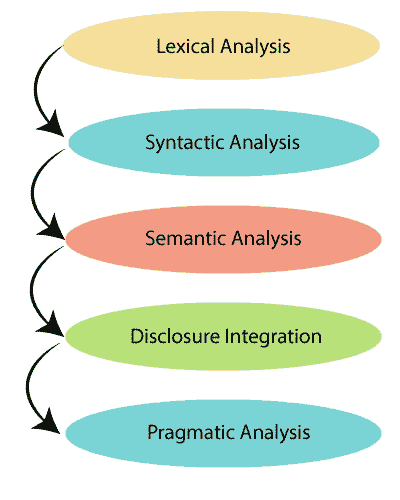

NLP 的阶段，[来源](https://www.tutorialandexample.com/nlp-tutorial/)

**词法分析:**这是负责检查单词的结构，它是通过将句子和段落分解成一大块文本来完成的。

**句法分析:**当我们试图理解单词之间的语法关系时，它就发挥作用了。这也需要帮助安排的话，以产生真正的和合乎逻辑的意义。

例如*“上学他”*，这在逻辑上是正确的，但在语法上，更好的词语安排会有很大帮助。

**语义分析:**我们仅仅把一个句子中的单词的意思连接起来，并不能真正得到这个句子的意思。我们需要考虑其他因素，如过去和未来单词的影响。下面是语义分析的帮助。

例如，“cold fire”可能看起来语法正确，但逻辑上是不相关的，因此它将被语义分析器丢弃。

**披露整合**:遵循明确定义的方法，考虑过去陈述的影响，以生成下一个陈述的含义。

汤姆食物中毒，因为他吃了垃圾食品。现在使用这个句子，我们可以得出结论，汤姆遇到了一场悲剧，这是他的错，但如果我们删除一些短语或只考虑几个短语，意思可能会改变。

**语用分析**:它有助于发现文本中隐藏的意义，我们需要结合上下文对其进行更深入的理解。

汤姆买不起汽车，因为他没有钱。

汤姆不会有汽车，因为他不需要。

两个句子中“他”的意思是完全不同的，为了弄清楚这种区别，我们需要世界知识和造句的语境。

# 标记化

**标记化**可以定义为以更短的形式打断句子或单词。接下来的想法可能是，如果我们观察到句子中的任何标点符号，就马上打破它，对于单词，如果我们看到任何空格字符分割句子。

## 句子标记化

作为输出，我们得到两个独立的句子。

```
Google is a great search engine that outperforms Yahoo and Bing.It was found in 1998
```

## 单词标记化

输出:

```
['Google', 'is', 'a', 'great', 'search', 'engine', 'that', 'outperforms', 'Yahoo', 'and', 'Bing', '.'] ['It', 'was', 'found', 'in', '1998']
```

# 词干化和词汇化

从语法上来说，不同形式的词根在时态和用例上的变化意味着相同的意思。举例来说， ***驱动*，*驱动*，*驱动*，*驱动*** 都是逻辑上相同的意思，只是用在不同的场景中。

为了将单词转换成通用形式，我们使用词干化和词汇化。

## 词干:

这种技术倾向于通过使用机器生成算法将词根格式化为词干来生成词根。

例如“**研究**”、“**研究**”、“**研究**”、“**研究**”都会转换为“**研究**”，而不是“**研究**”(这是一个准确的词根)。

词干提取的输出可能不总是符合语法逻辑和语义，这是因为它完全由算法驱动。

不同类型的斯特梅尔有:

*   **波特·斯特梅尔**
*   **雪球斯特梅尔**
*   **洛温·斯特梅尔**
*   道森·斯特梅尔

## 词汇化:

词汇化试图实现词干化的目的，但它不是计算机生成的算法，而是基于人类生成的单词字典，并试图产生基于字典的单词。

这样往往更准确。

比如“**学**”、“**学**”、“**学**”、“**学**”都会转换成“**学**”(这是一个准确的词根)。

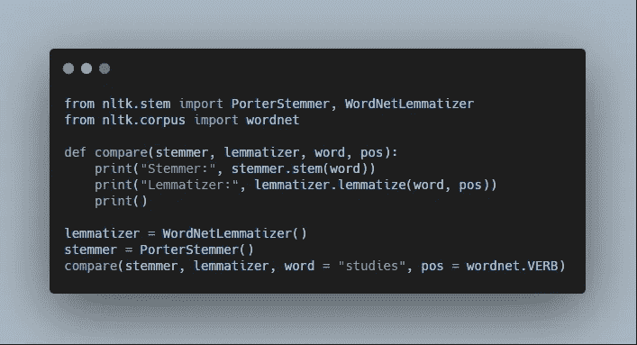

输出:

```
Stemmer: studi 
Lemmatizer: study
```

## 词干化与词汇化

词干化和词元化对于它们的中心用例都是有用的，但是一般来说，如果我们的模型的目标是在没有任何期限的情况下实现更高的准确性，我们更喜欢词元化。但是，如果我们的动机是快速输出，词干是首选。

# 停止言语

**停用词**是我们的文档需要审查的那些词。这些是不相关的词，通常对文本的逻辑意义没有贡献，但有助于语法结构。在将我们的数学模型应用于文本时，这些单词可能会添加大量噪声，从而改变输出。

停用词通常包括大多数常用词，如“ **a** ”、“ **the** ”、“中的**”、“**何**”、“**我**”、“**我**”、“**我自己**”。**

输出:

```
['i', 'me', 'my', 'myself', 'we', 'our', 'ours', 'ourselves', 'you', "you're", "you've", "you'll", "you'd", 'your', 'yours', 'yourself', 'yourselves', 'he', 'him', 'his', 'himself', 'she', "she's", 'her', 'hers', 'herself', 'it', "it's", 'its', 'itself', 'they', 'them', 'their', 'theirs', 'themselves', 'what', 'which', 'who', 'whom', 'this', 'that', "that'll", 'these', 'those', 'am', 'is', 'are', 'was', 'were', 'be', 'been', 'being', 'have', 'has', 'had', 'having', 'do', 'does', 'did', 'doing', 'a', 'an', 'the', 'and', 'but', 'if', 'or', 'because', 'as', 'until', 'while', 'of', 'at', 'by', 'for', 'with', 'about', 'against', 'between', 'into', 'through', 'during', 'before', 'after', 'above', 'below', 'to', 'from', 'up', 'down', 'in', 'out', 'on', 'off', 'over', 'under', 'again', 'further', 'then', 'once', 'here', 'there', 'when', 'where', 'why', 'how', 'all', 'any', 'both', 'each', 'few', 'more', 'most', 'other', 'some', 'such', 'no', 'nor', 'not', 'only', 'own', 'same', 'so', 'than', 'too', 'very', 's', 't', 'can', 'will', 'just', 'don', "don't", 'should', "should've", 'now', 'd', 'll', 'm', 'o', 're', 've', 'y', 'ain', 'aren', "aren't", 'couldn', "couldn't", 'didn', "didn't", 'doesn', "doesn't", 'hadn', "hadn't", 'hasn', "hasn't", 'haven', "haven't", 'isn', "isn't", 'ma', 'mightn', "mightn't", 'mustn', "mustn't", 'needn', "needn't", 'shan', "shan't", 'shouldn', "shouldn't", 'wasn', "wasn't", 'weren', "weren't", 'won', "won't", 'wouldn', "wouldn't"]
```

# 正则表达式

**Regex** 是**正则表达式**的简称，可以定义为一组定义搜索模式的字符串。

*   `\w` -匹配**所有字**
*   `\d` -匹配**所有数字**
*   `\W`——配**不字**
*   `\D` -匹配**而非数字**
*   `\S` -匹配**而不是空白**
*   `[abc]` -匹配 a、b 或 c 中的任意一个
*   `[**^**abc]` -与 a、b 或 c 都不匹配
*   `[a**-**z]` -在和& z 之间匹配一个字符**，即字母表**
*   `[1-100]` -在 1 & 100 之间匹配一个字符

**输出:**

```
Google is a great search engine that outperforms Yahoo and Bing. It was found in     .
```

# **一袋单词**

**机器学习算法大多基于数学计算，它们不能直接处理文本数据。为了使我们的算法与自然语言兼容，我们需要将原始文本数据转换成数字。这种技术被称为特征提取。**

**BoW(**B**ag**o**f**W**ords)是特征提取技术的一个例子，用于定义文本中每个单词的出现。**

**这项技术如其名**一样工作，单词存储在没有顺序的袋子里**。这样做的目的是检查输入到我们模型中的单词是否存在于我们的语料库中。**

**例如**

1.  **达克什、拉克沙伊和梅格纳是好朋友。**
2.  **达克什很酷。**
3.  **拉克谢是书呆子。**
4.  **Meghna 疯了。**

*   ****创建基本结构:****

**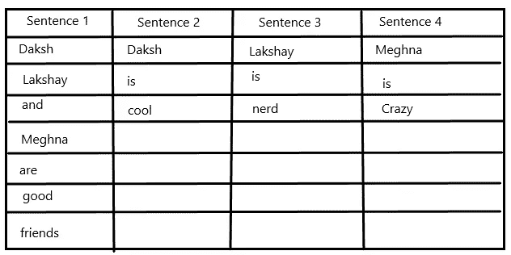**

*   ****查找每个单词的频率:****

**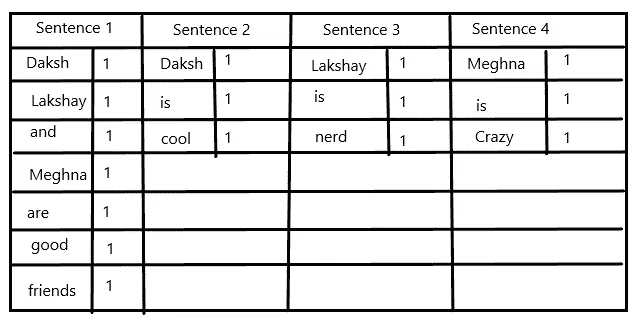**

*   ****结合上一步的输出:****

**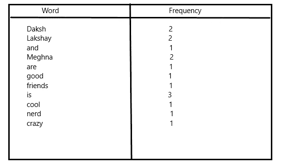**

****d .最终输出:****

**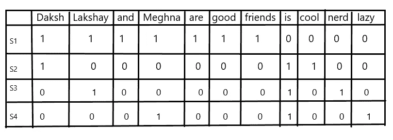**

**当我们的输入语料库增加时，词汇量增加，从而增加了向量表示，这导致我们的向量中有许多零，这些向量被称为**稀疏向量**，求解起来更复杂。**

**为了限制向量表示的大小，我们可以使用几种文本清理技术:**

*   ****忽略**标点符号。**
*   ****去掉**停止字。**
*   **将单词转换成它们的通用形式(**词干化和词条化**)**
*   **为统一起见，将输入文本转换为小写**字母**。**

# **N-grams**

**N-grams 是一种创建词汇的强大技术，因此为 BoW 模型提供了更多功能。n 元语法是由“n”个项目组合而成的集合。**

**一个**一元词**是一个词的集合，一个**二元词**是两个词的集合，一个**三元词**带有三个项目，以此类推。它们只包含已经可用的序列，而不是所有可能的序列，因此限制了语料库的大小。**

****例**
`He will go to school tomorrow.`**

**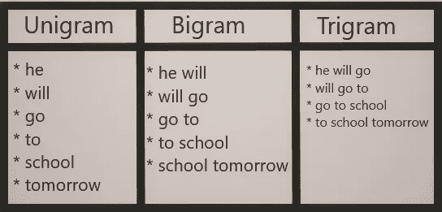**

# **TF-IDF**

****T**erm**F**frequency-**I**nverse**D**document**F**frequency(TF-IDF)是一种生成分数的度量，用于定义文档中每个术语的相关性。**

**TF-IDF 基于**词频(TF)** 和 I **倒序文档频率(IDF)的思想。****

**TF 表示，如果一个单词被重复多次，这意味着它比其他单词更重要。**

**根据 **IDF** 的说法，如果同一个出现频率更高的单词在其他文档中出现，那么它的相关性不高。**

**TF 和 IDF 的结合为每个单词生成一个分数，帮助我们的机器学习模型从文档中获得精确的高相关性文本。**

**TF-IDF 评分是**正比**于该词的出现频率，但它是**反比**于该词在其他文档中的出现频率。**

**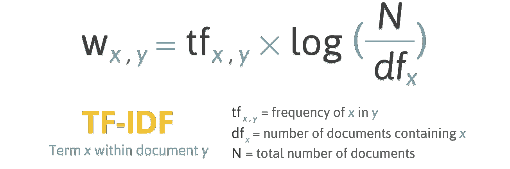**

**文档 y 中给定术语 x 的 TF-IDF，[来源](http://filotechnologia.blogspot.com/2014/01/a-simple-java-class-for-tfidf-scoring.html)**

*   ****词频(TF)** :检查词频。**

**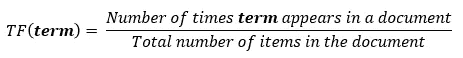**

*   ****逆词频(ITF)** :检查单词的稀有度。**

**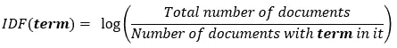**

**结合以上公式，我们可以得出结论:**

**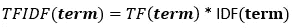**

****如果你喜欢这篇文章，请考虑订阅我的简讯:** [**达克什·特雷汉每周简讯**](https://mailchi.mp/b535943b5fff/daksh-trehan-weekly-newsletter) **。****

# **结论**

**这篇文章帮助我们了解了自然语言处理及其所有基本术语和技术。如果您希望使用 [**神经网络**](/diving-deep-into-deep-learning-f34497c18f11) 更深入地研究 NLP，您可以阅读更多关于 [**递归神经网络**](https://medium.com/towards-artificial-intelligence/recurrent-neural-networks-for-dummies-8d2c4c725fbe) 、[**lst ms&GRUs**](https://medium.com/towards-artificial-intelligence/understanding-lstms-and-gru-s-b69749acaa35)的信息。**

# **参考资料:**

**[1] [NLP —用 Python 从零到英雄。自然语言处理基础知识学习手册… |作者:Amit Chauhan |走向人工智能](/nlp-zero-to-hero-with-python-2df6fcebff6e)**

**【2】[自然语言处理(NLP):它是什么&它是如何工作的？(monkeylearn.com)](https://monkeylearn.com/natural-language-processing/)**

**[3] [文本的自然语言处理介绍| Ventsislav Yordanov |走向数据科学](https://towardsdatascience.com/introduction-to-natural-language-processing-for-text-df845750fb63)**

**[4] [使用 Python 的自然语言处理(NLP)——教程|由走向 AI 团队|走向 AI](/natural-language-processing-nlp-with-python-tutorial-for-beginners-1f54e610a1a0)**

**请随意连接:**

> **【组合~】[*【https://www.dakshtrehan.com】*](http://www.dakshtrehan.com/)**
> 
> ***LinkedIn ~*[*https://www.linkedin.com/in/dakshtrehan*](https://www.linkedin.com/in/dakshtrehan/)**

**关注更多机器学习/深度学习博客。**

> ***中等~*[*https://medium.com/@dakshtrehan*](https://medium.com/@dakshtrehan)**

# **想了解更多？**

**[准备好拜 AI 神了吗？](https://medium.com/swlh/are-you-ready-to-worship-ai-gods-818c9b7490dc)
[利用深度学习检测新冠肺炎](https://towardsdatascience.com/detecting-covid-19-using-deep-learning-262956b6f981)
[无法逃脱的 AI 算法:抖音](https://towardsdatascience.com/the-inescapable-ai-algorithm-tiktok-ad4c6fd981b8)
[GPT-3 向一个 5 岁的孩子解释。](/gpt-3-explained-to-a-5-year-old-1f3cb9fa030b)
[Tinder+AI:一场完美的牵线搭桥？](https://medium.com/towards-artificial-intelligence/tinder-ai-a-perfect-matchmaking-b0a7b916e271)
[一个使用机器学习的卡通化内幕指南](https://medium.com/towards-artificial-intelligence/an-insiders-guide-to-cartoonization-using-machine-learning-ce3648adfe8)
[强化强化学习背后的科学](https://medium.com/towards-artificial-intelligence/reinforcing-the-science-behind-reinforcement-learning-d2643ca39b51)
[解码生成性对抗网络背后的科学](https://medium.com/towards-artificial-intelligence/decoding-science-behind-generative-adversarial-networks-4d188a67d863)
[了解 LSTM 和 GRU 的](https://medium.com/towards-artificial-intelligence/understanding-lstms-and-gru-s-b69749acaa35)
[用于假人的递归神经网络](https://medium.com/towards-artificial-intelligence/recurrent-neural-networks-for-dummies-8d2c4c725fbe)
[用于假人的卷积神经网络](https://medium.com/towards-artificial-intelligence/convolutional-neural-networks-for-dummies-afd7166cd9e)**

> ***欢呼***