# 基于空间的自然语言处理——步骤与实例

> 原文：<https://pub.towardsai.net/natural-language-processing-with-spacy-steps-and-examples-155618e84103?source=collection_archive---------0----------------------->


图片来自 [Pixabay](https://pixabay.com/?utm_source=link-attribution&utm_medium=referral&utm_campaign=image&utm_content=3088958) 的 [xresch](https://pixabay.com/users/xresch-7410129/?utm_source=link-attribution&utm_medium=referral&utm_campaign=image&utm_content=3088958)

## [自然语言处理](https://towardsai.net/p/category/nlp)

## 使用空间库的各种 NLP 任务指南

spaCy 是 Python 中一个开源的高级自然语言处理(NLP)库。该库由 Matthew Honnibal 和 Ines Montani 开发，他们是 Explosion.ai 公司的创始人。[在我之前的文章](https://medium.com/towards-artificial-intelligence/text-mining-in-python-steps-and-examples-78b3f8fd913b)中，我已经解释了使用 NLTK 库的自然语言处理。spaCy 是专门为生产用途设计的，它有助于处理和理解大量文本。它提供了清晰和用户友好的 API。

想了解更多关于 NLP 的知识，我邀请你来看看我的[上一篇文章](https://medium.com/towards-artificial-intelligence/text-mining-in-python-steps-and-examples-78b3f8fd913b)。在本文中，我们将看到如何使用 spaCy 库来完成各种与 NLP 相关的任务。

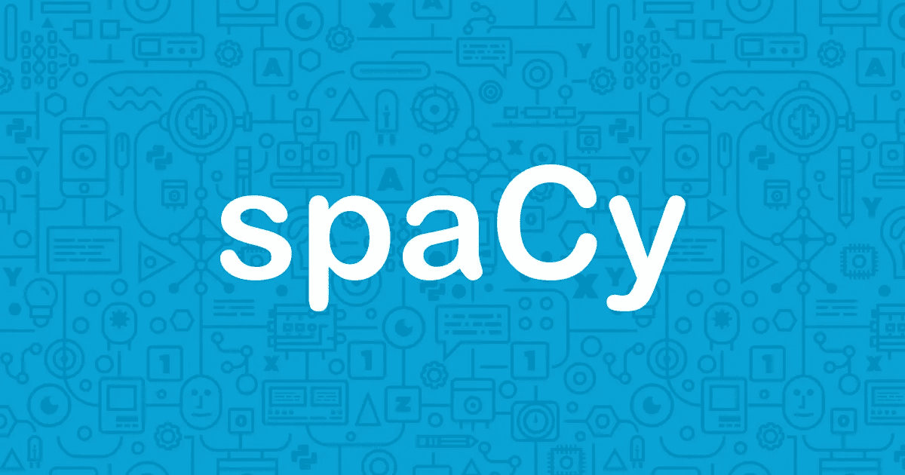

资料来源:https://spacy.io/

# 装置

## 密码

```
#Installing spaCy library
!pip install -U spaCy
```

# 如何加载模型？

spaCy 有不同类型的预训练模型。这些模型使 spaCy 能够执行一些与 NLP 相关的任务，如词性标注、标记化、词汇化、命名实体识别、依存解析等。请在此查看[不同型号的型号。](https://spacy.io/models)

spaCy 支持不同的语言模型。在这里，我们使用`**"en_core_web_sm"**`英国模式。

使用`**"spacy.load"**` 加载模型。

## 密码

```
# Importing the spaCy libraryimport spacy# Loading english model and initialize an object called 'nlp'nlp = spacy.load(“en_core_web_sm”)
```

我们加载了模型并初始化了一个名为“nlp”的对象。无论何时调用 nlp，它都会加载“en_core_web_sm”模型。这里,“nlp”对象是一个语言模型实例

# 读取字符串

文本预处理是自然语言处理的重要组成部分和关键步骤。它将原始文本转换为机器学习算法可以更好地执行的数字。

在下面的文本示例中，

## 密码

```
text = """ The Republican president is being challenged by Democratic Party nominee Joe Biden, who is best known as Barack Obama’s vice-president but has been in US politics since the 1970s.As election day approaches, pollingcompanies will be trying to gauge the mood of the nation by asking voters which candidate they prefer."""#Passing the text to nlp and initialize an object called 'doc'doc = nlp(text)#Checking the type of doc objecttype(doc)
```

## 输出

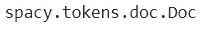

当上述文本传递给“nlp 对象”时，spaCy 首先将文本标记为产品“doc”对象。然后' **doc'** 对象被处理成几个步骤，如标记器、解析器、ner 等..这也叫做 ***处理流水线。*****doc**对象的类型是令牌。我们将逐一查看管道中涉及的步骤。


[https://spacy.io/usage/processing-pipelines](https://spacy.io/usage/processing-pipelines)

# 句子检测

句子检测用于识别给定文本中句子的开始和结束。这有助于将原始文本划分成有意义的形式，也有助于执行词性标注和命名实体识别。spaCy 使用`**sents**`属性来标识句子。

## 密码

```
#passing the above text example into nlp objectsentence = nlp(text)#Identify the sentences using attributesentences = list(sentence.sents)# Length of the sentencesprint(" The lenght of the sentences:", len(sentences))# Reading the sentencesfor sent in sentences:
    print(sent)
```

## 输出

```
The lenght of the sentences: 2 The Republican president is being challenged by Democratic Party nominee Joe Biden, who is best known as Barack Obama’s vice-president but has been in US politics since the 1970s. As election day approaches, polling companies will be trying to gauge the mood of the nation by asking voters which candidate they prefer.
```

spaCy 使用分隔符“句号”正确识别句子。从上面的例子中总结两句话。

# 标记化

标记化是指将文本分成一系列单词或句子。它包括三个步骤:将一个复杂的句子分解成单词，理解每个单词对于句子的重要性，最后对输入的句子进行结构描述。

## 密码

使用属性**标记对**文档**进行标记**

```
# Tokenization#Sample texttext = “The Republican president is being challenged by Democratic Party nominee Joe Biden,”#passing the text into nlp and store as a doc objectdoc = nlp(text)# Tokenize the doc using token.text attributefor token in doc:
    print (token.text)
```

## **输出**

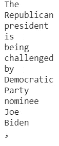

从上面的输出中，文本被分割成标记。这些标记包含标点符号，像 is、being 等常用词也称为停用词。这些标点符号和停用词对我们的文本没有任何意义。因此，我们需要删除它。

# 停用词

如上所述，停用词是语言中最常见的词，如“at”、“am”、“is”、“above”、“for”等。这些词不提供任何意义，通常从文本中删除。

spaCy 有每个语言模型的停用词列表。下面的代码检查英语语言模型中的停用词列表。

## 密码

```
#Checking the stopwords for enlgish language modelsstopwords = spacy.lang.en.stop_words.STOP_WORDS# check the length of stopwordsprint(“The length of stopwords:”, len(stopwords))# Printing the first five stopwordsfor i in list(stopwords)[:5]:
   print(i)
```

## 输出

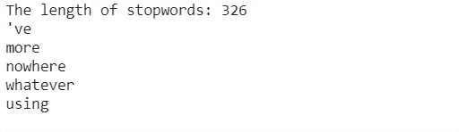

# 如何识别并去除文本中的停用词？

使用 spaCy 中的`**is_stop**`属性类识别并移除停用词。

# 密码

识别停用词

```
#Printing the stop words from our text examplefor token in doc:
  if token.is_stop:print(token)
```

# 输出

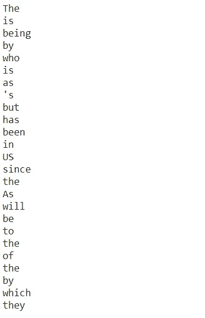

删除停用词

# 密码

```
# Printing total number of tokens in docprint(“Number of tokens in the doc:”, len(doc))# Removing the stopwords from the docdoc2 = []for token in doc:
  if not token.is_stop:doc2.append(token)# Printing total number of tokens in doc after removing stopwordsprint(“Number of tokens after removing stopwords:”, len(doc2))
```

# 输出

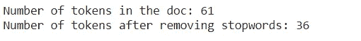

# 标点符号

我们可以使用`**is_punct**`属性类删除文本中的标点符号

## 密码

```
#Removing Punctuations# sample texttext = “The Republican president, is being challenged by Democratic Party nominee: Joe Biden,”doc = nlp(text)#Removing the punctuationfor punc in doc:
    if not punc.is_punct:print(punc)
```

## 输出

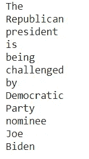

文本中的标点符号被删除了。

# 词汇化

词汇化是将一个词转换成它的基本形式的过程。例如，词汇化将正确识别“care”到“care”的基本形式。

## 密码

```
# sample texttext = “The Republican president is being challenged by Democratic Party nominee Joe Biden”# Passing the text into spacy model and store as a doc objectdoc = nlp(text)#Lemmatization, printing token and lemmatization side by sidefor token in doc:
   print(token, '-->', token.lemma_)
```

## 输出

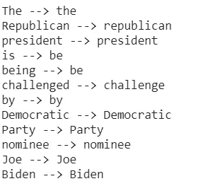

‘是’字转化为‘是’，是->是，被挑战->挑战。

spaCy 提供了各种令牌属性类。以下是文本预处理中使用的一些常见属性。我们可以根据数据集使用不同的属性。更多属性类，请[查看此处](https://spacy.io/api/token#attributes)。

*   `**is_ascii**` 检查令牌是否由 ASCII 字符组成。
*   `**is_digit**` 检查令牌是否由数字组成。
*   `**is_lower**` 检查令牌是否为小写
*   `**is_uppercase**` 检查令牌是否大写
*   `**text_with_ws**`打印带有尾随空格的标记文本(如果有)。
*   `**is_alpha**`检查令牌是否由字母字符组成。
*   `**is_punct**`检查令牌是否为标点符号。
*   `**is_space**`检查令牌是否为空格。
*   `**shape_**`打印出单词的形状。
*   `**is_stop**`检查令牌是否为停用词。
*   `**like_email**` 检查令牌是否由电子邮件地址组成
*   `**like_url**` 检查令牌是否由 URL 组成

# 词性标注

词性标注用于根据定义和上下文给给定文本的每个单词(如名词、动词、代词、副词、连词、形容词、感叹词)分配词性。

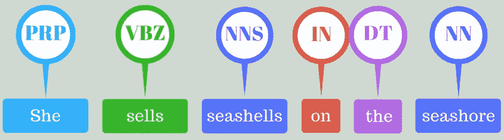

词性标注可以在 spaCy 中使用令牌属性类来完成。`**tag_**` 显示细粒度词性`**pos_**` 显示粗粒度词性。`**spacy.explain**`显示关于特定标签的描述性细节。请点击查看更多详情[。](https://spacy.io/api/annotation#pos-tagging)

## 密码

```
#Sample texttext = “The Republican president is being challenged by Democratic Party nominee Joe Biden”# Passing the text into spacy model(nlp) and store as a doc objectdoc = nlp(text)# Parts of speech taggingfor token in doc:
    print (token, token.tag_, token.pos_, spacy.explain(token.tag_))
```

## 输出

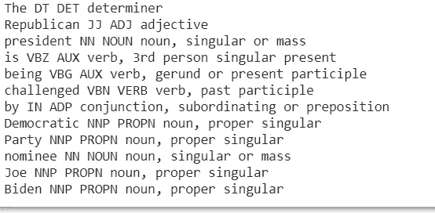

上面的输出使用 spacy.explain 显示了所有单词的词性以及完整的描述性细节。spacy 还提供了名为 displaCy 的内置可视化工具。这有助于我们形象化 POS 标签

## 密码

```
# Visualizing the POS Tags using displacy#importing displacyfrom spacy import displacy#Passing the docdisplacy.render(doc, style=’dep’, jupyter=True, options={‘distance’: 90})
```

## 输出

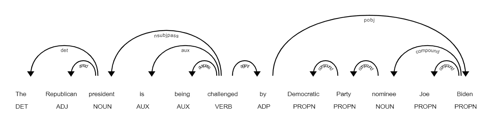

# 命名实体识别

它是检测命名实体(如人名、地名、公司名、数量和货币价值)的过程。


Ref: [Sujit Pal](https://www.slideshare.net/sujitpal/soda-v2-named-entity-recognition-from-streaming-test-106598233)

我们可以使用 spaCy `**ents**`属性类找到命名实体。

请点击查看更多关于实体属性[的详细信息](https://spacy.io/api/annotation#named-entities)

## 密码

```
# sample texttext = “The Republican president is being challenged by Democratic Party nominee Joe Biden, who is best known as Barack Obama’s vice-president but has been in US politics since the 1970s”# Passing the text into spacy model and store as a doc objectdoc = nlp(text)# Named Entity recognition using ents attributeprint(doc.ents)# Printing the entity label description using label_ attributefor entity in doc.ents:
    print(entity.text, ‘->’, entity.label_)
```

## 输出

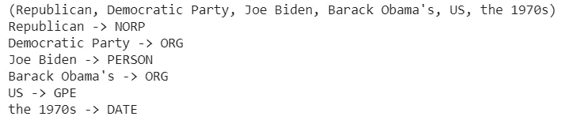

可视化命名实体描述

## 密码

```
# Visualizing the named entity descriptiondisplacy.render(doc, style = “ent”,jupyter = True)
```

## 输出

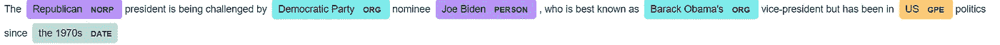

# 依存句法分析

依存句法分析通过理解句子结构和单个单词之间的关系来帮助理解句子的意思。在分析阶段，它有助于语法检查和理解语义。

## 密码

```
# sample texttext = “The Republican president is being challenged by Democratic Party nominee Joe Biden”# Passing the text to spacy model and intiialize the object called docdoc = nlp(text)# Dependency parsingfor chunk in doc.noun_chunks:
     print(chunk.text, chunk.root.text, chunk.root.dep_,     chunk.root.head.text)
```

## 输出

```
The Republican president president nsubjpass challenged Democratic Party nominee Joe Biden Biden pobj by
```

上面的输出很难理解。我们可以使用 displacy 来实现同样的效果

## 密码

```
# Visualize the dependencydisplacy.render(doc, style=”dep”, jupyter= True, options={'distance': 120})
```

## 输出

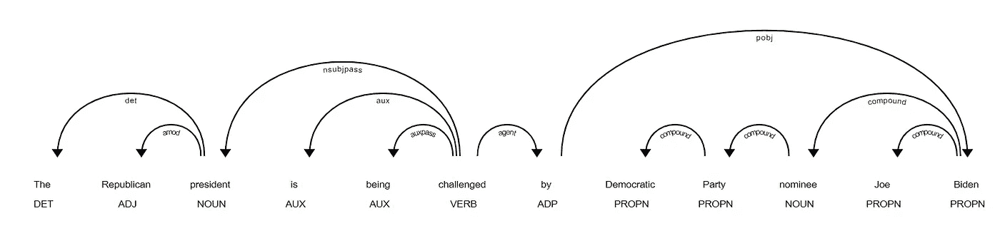

上面的输出显示了不同的标签，如 nsubjpass、auxpass、agent、compound。这些可以通过理解这些标签在句子中的意思来解释。请查看 spaCy 关于[依赖解析](https://spacy.io/api/annotation#dependency-parsing)的文档，了解标签细节

# 基于规则的匹配

基于规则的匹配是 spaCy 的另一个惊人特性。它有助于在用户定义的规则的帮助下找到给定文本中的单词和短语。它类似于正则表达式。但是，spaCy 通过模式和词汇属性(如词性标签、依赖性、词汇化等)与用户定义的规则进行匹配。

## 密码

```
# Import spaCy Matcherfrom spacy.matcher import Matcher# Initialize the matcher with the spaCy vocabularymatcher = Matcher(nlp.vocab)#Sample texttext = "The Republican president is being challenged by Democratic  Party nominee Joe Biden"doc = nlp(text)# Define rulepattern = [{‘TEXT’: ‘Joe’}, {‘TEXT’: ‘Biden’}]# Add rulematcher.add(‘rule_1’, None, pattern)
```

上述代码解释如下:

*   导入空间匹配器
*   用默认空间词汇表初始化匹配器对象
*   将输入传递给 NLP 对象
*   为我们想要从文本中提取的内容定义规则/模式。我们想从文本中提取“乔·拜登”。这意味着每当单词“Joe”后面跟着单词“Biden”时，匹配器应该能够在文本中找到这种模式。

```
# Finding matches and passing the doc to the matches objectmatches = matcher(doc)matches
```

将 doc 对象传递给匹配项

## 输出

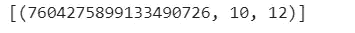

Matches 对象返回元组列表。它有三个元素，match_id，start 和 end。7604275899133490726 是 match_id。开始和结束表示给定文本的开始和结束标记号。

下面的代码提取匹配

## 密码

```
# Extract the matchesfor matchid, start, end in matches:matchid = nlp.vocab.strings[matchid]span = doc[start:end]print(span.text)
```

## 输出


在基于规则的匹配中，我们可以定义许多规则。更多详情，请查看[此处](https://spacy.io/usage/rule-based-matching)

# 词向量和相似度

单词向量是单词的数字表示，它有助于理解单词的语义并用于各种 NLP 任务。spaCy 模型支持内置向量，我们需要为此任务下载中型或更大的模型。更多详情请点击查看[。](https://spacy.io/usage/vectors-similarity)

## 检查单词向量

第一次装载中型或大型模型。我们在这里使用大模型。

## 密码

```
# Downloading large pre-trained model!python -m spacy download en_core_web_lg
```

现在，在预训练的模型中查找样本文本是否具有向量。`**has_vector**`用于检查矢量是否可用。

## 密码

```
# Importing library and loading the large modelimport spacynlp = spacy.load(‘en_core_web_lg’)# Sample texttext = “The Republican president is being challenged by Democratic Party nominee Joe Biden fe45ty 34fedjdj”# passing the text to spacy modeldoc = nlp(text)# Finding whether the word is available in the pre-trained modelfor token in doc:
    print(token.text, ‘ — ->’, token.has_vector)
```

## 输出

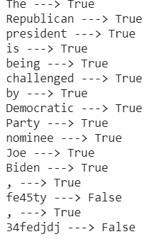

我们可以看到单词*‘Fe 45 ty’，‘34 feddj’*在预训练的模型中没有单词向量。

## 打印单词向量

使用`**vector_norm**` 属性类打印矢量。

## 密码

```
# Printing the word Vector# sample texttext = “The Republican president is being challenged by Democratic Party nominee Joe Biden, fe45ty, 34fedjdj”#Passing the text to modeldoc = nlp(text)# Printing the vectorsfor token in doc:
    print(token.text,’ ‘,token.vector_norm)
```

## 输出

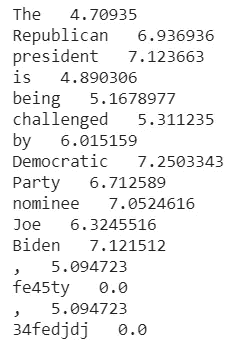

我们可以看到单词“fe45ty”和“34fedjdj”具有向量 0，因为这两个单词在预训练模型中不可用。

## 两个向量之间的相似性

令牌对象有一个内置的相似性函数，它有助于找到两个令牌之间的相似性。值越高，两个标记之间越相似，值越低，标记之间越不相似。相似性特征主要用于推荐应用。

相似性得分可以使用`**similairty**` 属性类来计算。

## 密码

```
# Calculate similarity score#sample texttext = “excellent”text_1 = “good”# passing the text into nlp modeldoc = nlp(text)doc1 = nlp(text_1)# Finding the similarityscore = doc.similarity(doc1)print(score)
```

## 输出

```
0.777407893397578
```

该值为 0.77，更接近于 1，因此这两个标记具有高相似性。

本文总结了 spaCy 库如何用于各种 NLP 任务。

感谢阅读。请继续学习，并关注更多内容！

# 参考

[https://spacy.io/](https://spacy.io/)