# 用于分层强化学习的近似最优表示学习

> 原文：<https://pub.towardsai.net/near-optimal-representation-learning-for-hierarchical-reinforcement-learning-37e01c24a299?source=collection_archive---------0----------------------->

## [机器学习](https://towardsai.net/p/category/machine-learning)

## 超越分层强化学习与偏离政策的纠正(HIRO)

# 介绍

这是该系列的第二篇文章，在这篇文章中，我们将讨论一种新的分层强化学习，它建立在我们在[上一篇文章](https://towardsdatascience.com/data-efficient-hierarchical-reinforcement-learning-hiro-5d8538c27a80?source=friends_link&sk=9a800a0ccd8f074bbfec7dd09e9835a2)中讨论过的**嗨**分层 **R** 强化学习和**O**ff-策略修正(HIRO)的基础上。

这个员额由两部分组成。在第一部分，我们首先比较了 HRL 和 HIRO 的表征学习体系；然后，我们从论文中的权利要求 4 开始，看看如何学习导致有界次优的良好表示，以及如何定义低级策略的内在回报；我们将在本节末尾提供算法的伪代码。在部分讨论中，我们将为算法带来一些见解，并将低级策略连接到概率图形模型，以建立一些直觉。

为了更好地阅读数学表达式和最新更新，你可能想参考[我的个人博客](https://xlnwel.github.io/blog/reinforcement%20learning/NORL-HRL/)。

## 结构

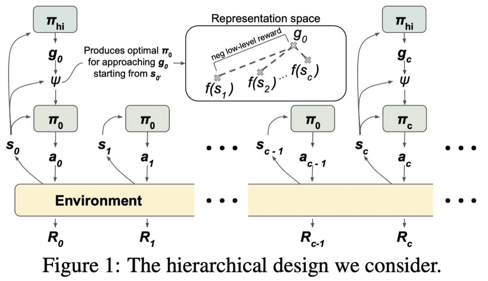

摘自 O . f . nach um 等人的《用于分层强化学习的近似最佳表示学习》

不同于 HIRO，其中目标用作当前状态和期望状态之间的相异度的度量，这里的目标用于结合当前状态直接产生较低级别的政策。形式上，我们使用较高级别的策略对目标 *gₜ∼π^{high}(g|sₜ)* 进行采样，并将其转换为较低级别的策略*πₜˡᵒʷ=ψ(sₜ,gₜ)*，后者用于对 *a_{t+k}∼πₜˡᵒʷ(a|s_{t+k}、k)* 的行动进行采样。然后从 *s_{t+c}* 开始重复该过程。(请注意，上面的低策略描述是一个理论模型，它不同于我们稍后将讨论的实践中的模型)

映射*ψ*通常表示为策略空间上 RL 优化的结果

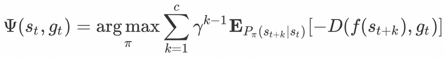

等式 1 理论上期望的低级策略

其中 *P_π(s_{t+k}|sₜ)* 表示从 *sₜ* 开始跟随*π*k 步后处于状态 *s_{t+k}* 的概率， *f* 表示将状态编码为低维表示的表示函数， *D* 是距离函数(例如[胡伯函数](https://en.wikipedia.org/wiki/Huber_loss)，其负值表示固有的低水平奖励。注意这里的 *D* 与 HIRO 定义的主要有两点不同:1 .由于 *gₜ* 不再是相异度的度量，因此不涉及*sₜ*—*gₜ*现在更像是 *s_{t+c}* 在目标空间的投影。2.现在在目标空间(通常是低维空间)而不是原始状态空间上测量距离。

## 好的表示导致有界的次优

等式 1 让我们看到了期望的低级策略看起来像什么，但是它没有提供关于应该如何定义表示学习函数 *f* 的任何洞察。论文中的权利要求 4 表明，如果我们将*ψ*定义为等式 1 中给出的传统目标的轻微修改，那么我们可以将*ψ*的次优性转化为 *f* 的实际表示学习目标。(不要被符号和术语吓到，很快会有解释)

> **权利要求 4** :设ρ(s)是状态空间 s 上的先验，设 f 和φ为

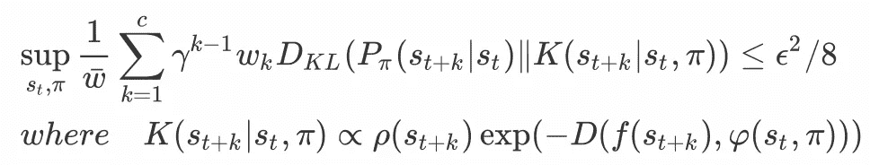

等式 2 代表目标

> 如果低级目标被定义为

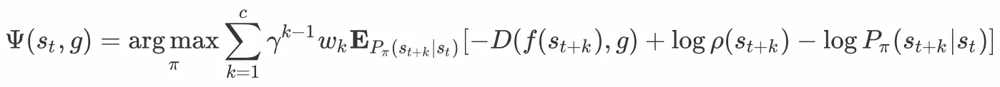

方程式 3 低水平政策目标

> 那么ψ的次优性被 Cϵ所有界

我们没有在这里证明这种说法，因为论文提供的详细证明相当简洁，但仍然需要两页以上。在这里，我们将解决上面使用的那些符号和术语，稍后我们将对此声明提出一些见解:

*   *f* 是我们在*之前讨论过的表征学习函数。φ* 是一个辅助的逆目标模型，旨在预测哪个目标会导致*ψ*产生一个策略*\ tildeπ=ψ(s，g)* 诱导后续分配*p _ { \ tildeπ}(s_{t+k}|sₜ)*类似于 *P_π(s_{t+k}|sₜ)* 对于*k∈【1，c】*。正如我们将很快看到的，f 和φ*都通过最小化等式 2 来优化。*
*   我们通过权重 *wₖ=1* 对 *k < c* 和 wₖ=(1-γ)^{-1} fo*r k*=*c .*对分布之间的 KL 散度进行加权。我们进一步将 *\bar w* 表示为在 *c* 步 *∑w_{1:c}* 上贴现的 *w* 之和，这将所有权重归一化，以便它们被加和为一。
*   作者将 *K* 解释为联合分布*P(state = s ')P(repr = Z | state = s ')=ρ(s ')(exp(-D(f(s ')，z))/Z)* 的条件*P(state = s ')*Z*。这样，我们可以把 *P(repr=z|stat=s')* 看成一个输入 logits *-D(f(s ')，z)的玻尔兹曼分布。*正如我们将在后面看到的，通过以这种方式设计 *K* ，我们可以将表示学习与 [MINE](https://xlnwel.github.io/blog/representation%20learning/MINE/) 对齐，并且基于[概率图形模型](https://xlnwel.github.io/blog/reinforcement%20learning/PGM/)给出更好的解释。*
*   *ψ*的次最优性根据状态值测量使用策略*ψ*相对于最优策略的损失。形式上定义为最优策略π*与π^{hier}通过*ψ*学习到的分层策略之间的最大值差，即，

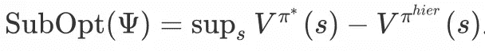

次优，定义为最优策略和分级策略之间的最大值差

*   低级目标也可以转换成 KL

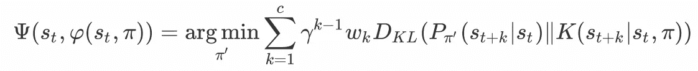

等式 4 KL 版本的低层次政策目标

其中公式 3 中的 *g* 替换为 *h φ(sₜ,π)* 。其实情商。4 等同于等式 2 的 LHS，这为我们带来了策略优化和表征学习之间的相关性的很好的解释。我们将在分组讨论中回到这一点。

## 学问

**表象学习**

我们先用 *θ* 参数化表征学习函数 *f* 和逆目标模型 *φ* 。等式 2 中的上确界表示 *f* 和 *φ* 应该最小化上确界的内部。然而，实际上，我们无法访问策略表示 *π* 。因此，作者建议选择从重放缓冲区均匀采样的 *sₜ* ，并使用随后的 *c* 动作 a_{t:t+c-1}作为策略的表示。因此，我们的表示学习目标是

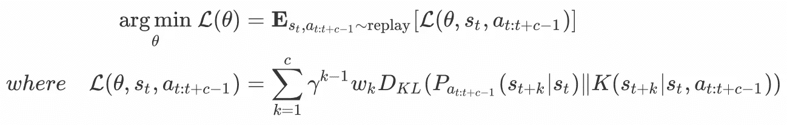

公式 5 表示学习目标

为了在下面的讨论中简化符号，我们将缩写如下

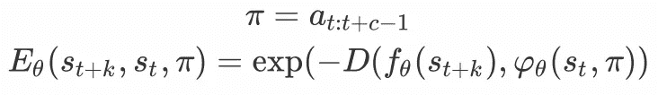

同样，回想一下等式 2

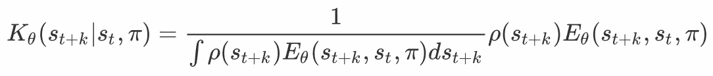

现在我们扩展等式 5 中的目标

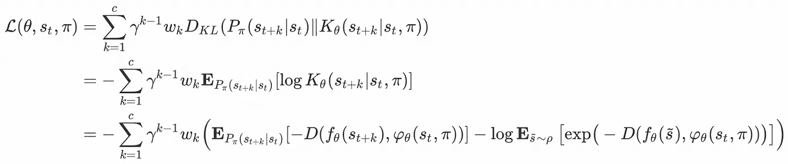

等式 6 表示学习目标

其中尽可能省略与 *θ* 无关的术语。注意，等式 6 中的内容正是地雷估计器的目标。这表明我们的表征学习目标实际上是最大化 *π* 和 *s_{t+k}* 之间的互信息，随着 *k* 增加而减少。正如在我的文章中，括号中第二项的梯度将引入偏倚，作者建议将第二项替换为

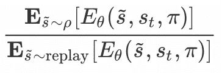

等式 7 对数分区函数的替换

其中使用从重放缓冲器采样的附加小批量状态来近似分母，并且没有通过分母反向传播的梯度。

由于等式 6 本质上是对于 *k ∈ [1，c]* 最大化 *π* 和 *s_{t+k}* 之间的互信息，因此可以进一步使用诸如 [DIM](https://xlnwel.github.io/blog/representation%20learning/DIM/) 的其他方法来提高性能。

**低级策略学习**

等式 3 建议为每个 *sₜ，g* 优化一个策略 *π_{sₜ，g}(a|s_{t+k}，k)* 。这相当于最大化参数化 *π^{low}(a|sₜ，g，s_{t+k}，k)* ，这是目标条件分层设计中的标准。可以采用标准 RL 算法来最大化由以下等式暗示的低级别奖励

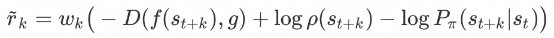

低级奖励功能

其中括号中的第一项计算起来很简单，但其余项通常是未知的。为了解决这个问题，我们将 *P_π(s_{t+k}|sₜ)* 替换为 *K_θ(s_{t+k}|s_t，π)* (因为等式 5)，最后得到

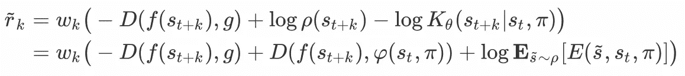

等式 8 低级奖励函数

其中π近似为 *a_{t:t+c-1}* 如前。现在我们有了可以从等式 8 计算出来的低级奖励，低级策略可以像我们在 HIRO 那样用一些非策略方法来学习。

## 算法

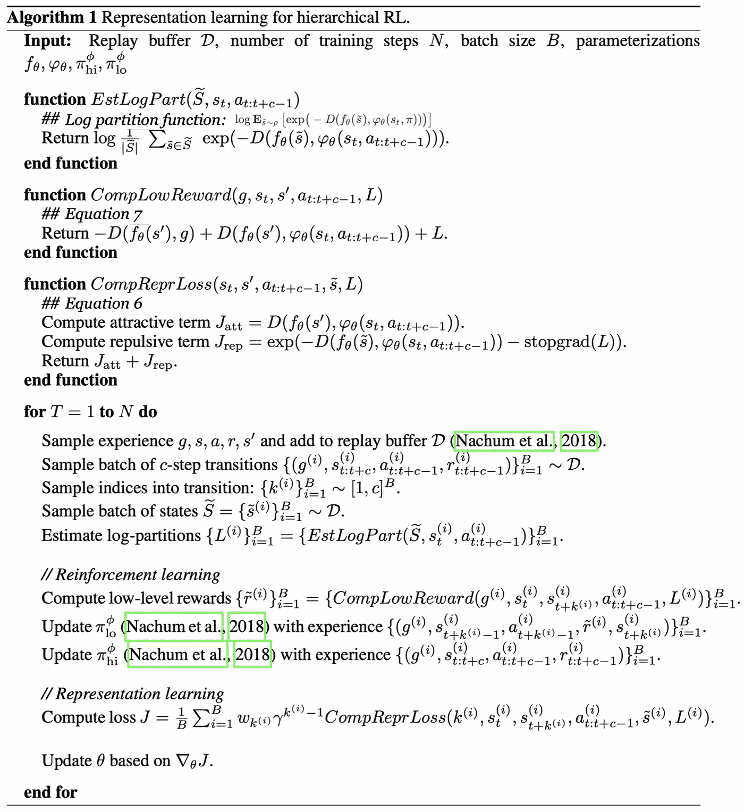

O fir na chum 等人的伪代码，用于分层强化学习的近似最佳表示学习

## 讨论

在这一节中，我谦恭地讨论一下阅读这篇论文时的一些个人想法。

**对*的不同解读【k(s_{t+k}|sₜπ】***

如果我们将*【-d(f(s_{t+k}),φ(sₜ,π】)*作为奖励函数 *r(sₜ，π，s_{t+k})* ，并将 *K* 的定义与我们在[这篇](https://xlnwel.github.io/blog/reinforcement%20learning/PGM/)文章中讨论过的概率图模型(PGM)联系起来，我们可以得到如下 PGM

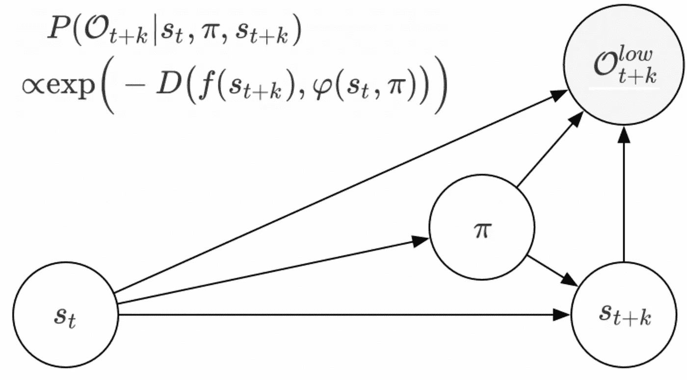

K 的概率图形视图

那么我们有

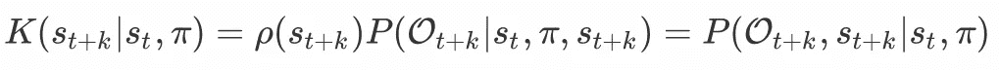

现在我们可以将 *K(s_{t+k}|sₜ,π)* 解释为给定当前状态 *sₜ* 和策略*π，状态 *s_{t+k}* 最优的概率。*

**低级策略优化和表征学习之间的相关性**

如等式所示。如图 4 和 5 所示，如果我们忽略所有权重和折扣因子，并且为了简单起见仅考虑单个时间戳，则低级策略优化和表示学习本质上都最小化 KL 发散，如下所示

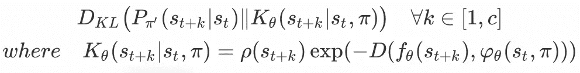

其中 *φ_θ(sₜ、π)* 和 *g* 可以互换。从这个 KL 发散中我们可以看出:底层策略优化绘制 *P_{π'}* 接近 *K_θ* ，而表征学习绘制 *K_θ* 接近 *P_{π'}* 。直观上，我们在优化低级策略时，希望 *s_{t+k}* 在该策略下的分布等于 *s_{t+k}* 最优的概率。另一方面，我们在做表征学习时，最大化 *s_{t+k}* 和π之间的互信息，使得底层策略更容易优化。

我们是否应该像在 HIRO 那样，在这里重新标注目标？

这个问题困扰了我一段时间，因为它没有在论文中提到。到目前为止，我个人的答案是，也许我们也应该重新标记，但它不像在 HIRO 那样紧迫。HIRO 要求重新标记目标的相同原因在这里仍然有效:随着低级策略的发展，以前收集的转换元组可能不再对高级策略有效。然而，在某种意义上，这个问题可能会因为我们在较低的维度中表示目标而得到缓解。

好吧，也许论文以一种非常含蓄的方式提到了这一点……用于训练高级策略的经验包括状态和低级动作序列，这仅对于偏离策略的纠正有用。

感谢 O fr nach um 在回复中澄清了这个问题:-)是的，目标确实像在 HIRO 那样被重新标记。

## 结束

嗯，这是一个漫长的旅程。希望你喜欢它。如果你遇到任何困惑，欢迎留言。

感谢人工智能团队帮助我们接触奥弗尔纳丘姆:-)

## 参考

Mohamed Ishmael Belghazi 等.互信息神经估计

用于分层强化学习的近似最佳表示学习